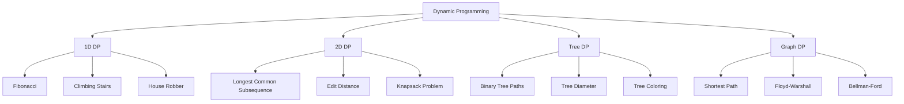

# Dynamic Programming - Advanced Problem Solving

## Overview

Dynamic Programming (DP) is a method for solving complex problems by breaking them down into simpler subproblems. It's particularly useful for optimization problems where the same subproblems are solved multiple times.

## Key Concepts

- **Overlapping Subproblems**: Same subproblems appear multiple times
- **Optimal Substructure**: Optimal solution contains optimal solutions to subproblems
- **Memoization**: Store results of subproblems to avoid recomputation
- **Tabulation**: Build solutions bottom-up using tables
- **State Transition**: Define how to move from one state to another

## DP Problem Types



## Go Implementation

```go
package main

import (
    "fmt"
    "math"
    "sort"
)

// Fibonacci - Basic DP example
func Fibonacci(n int) int {
    if n <= 1 {
        return n
    }
    
    // Memoization approach
    memo := make(map[int]int)
    return fibonacciMemo(n, memo)
}

func fibonacciMemo(n int, memo map[int]int) int {
    if n <= 1 {
        return n
    }
    
    if val, exists := memo[n]; exists {
        return val
    }
    
    memo[n] = fibonacciMemo(n-1, memo) + fibonacciMemo(n-2, memo)
    return memo[n]
}

// Fibonacci - Tabulation approach
func FibonacciTabulation(n int) int {
    if n <= 1 {
        return n
    }
    
    dp := make([]int, n+1)
    dp[0] = 0
    dp[1] = 1
    
    for i := 2; i <= n; i++ {
        dp[i] = dp[i-1] + dp[i-2]
    }
    
    return dp[n]
}

// Climbing Stairs - Count ways to reach top
func ClimbingStairs(n int) int {
    if n <= 2 {
        return n
    }
    
    dp := make([]int, n+1)
    dp[1] = 1
    dp[2] = 2
    
    for i := 3; i <= n; i++ {
        dp[i] = dp[i-1] + dp[i-2]
    }
    
    return dp[n]
}

// House Robber - Maximum money without adjacent houses
func HouseRobber(houses []int) int {
    if len(houses) == 0 {
        return 0
    }
    if len(houses) == 1 {
        return houses[0]
    }
    
    dp := make([]int, len(houses))
    dp[0] = houses[0]
    dp[1] = max(houses[0], houses[1])
    
    for i := 2; i < len(houses); i++ {
        dp[i] = max(dp[i-1], dp[i-2]+houses[i])
    }
    
    return dp[len(houses)-1]
}

// Longest Common Subsequence
func LongestCommonSubsequence(text1, text2 string) int {
    m, n := len(text1), len(text2)
    dp := make([][]int, m+1)
    for i := range dp {
        dp[i] = make([]int, n+1)
    }
    
    for i := 1; i <= m; i++ {
        for j := 1; j <= n; j++ {
            if text1[i-1] == text2[j-1] {
                dp[i][j] = dp[i-1][j-1] + 1
            } else {
                dp[i][j] = max(dp[i-1][j], dp[i][j-1])
            }
        }
    }
    
    return dp[m][n]
}

// Edit Distance (Levenshtein Distance)
func EditDistance(word1, word2 string) int {
    m, n := len(word1), len(word2)
    dp := make([][]int, m+1)
    for i := range dp {
        dp[i] = make([]int, n+1)
    }
    
    // Initialize base cases
    for i := 0; i <= m; i++ {
        dp[i][0] = i
    }
    for j := 0; j <= n; j++ {
        dp[0][j] = j
    }
    
    for i := 1; i <= m; i++ {
        for j := 1; j <= n; j++ {
            if word1[i-1] == word2[j-1] {
                dp[i][j] = dp[i-1][j-1]
            } else {
                dp[i][j] = min(dp[i-1][j], dp[i][j-1], dp[i-1][j-1]) + 1
            }
        }
    }
    
    return dp[m][n]
}

// 0/1 Knapsack Problem
func Knapsack(weights, values []int, capacity int) int {
    n := len(weights)
    dp := make([][]int, n+1)
    for i := range dp {
        dp[i] = make([]int, capacity+1)
    }
    
    for i := 1; i <= n; i++ {
        for w := 1; w <= capacity; w++ {
            if weights[i-1] <= w {
                dp[i][w] = max(dp[i-1][w], dp[i-1][w-weights[i-1]]+values[i-1])
            } else {
                dp[i][w] = dp[i-1][w]
            }
        }
    }
    
    return dp[n][capacity]
}

// Coin Change - Minimum coins needed
func CoinChange(coins []int, amount int) int {
    dp := make([]int, amount+1)
    for i := 1; i <= amount; i++ {
        dp[i] = math.MaxInt32
    }
    
    for i := 1; i <= amount; i++ {
        for _, coin := range coins {
            if coin <= i {
                dp[i] = min(dp[i], dp[i-coin]+1)
            }
        }
    }
    
    if dp[amount] == math.MaxInt32 {
        return -1
    }
    return dp[amount]
}

// Longest Increasing Subsequence
func LongestIncreasingSubsequence(nums []int) int {
    if len(nums) == 0 {
        return 0
    }
    
    dp := make([]int, len(nums))
    for i := range dp {
        dp[i] = 1
    }
    
    maxLen := 1
    for i := 1; i < len(nums); i++ {
        for j := 0; j < i; j++ {
            if nums[j] < nums[i] {
                dp[i] = max(dp[i], dp[j]+1)
            }
        }
        maxLen = max(maxLen, dp[i])
    }
    
    return maxLen
}

// Longest Common Substring
func LongestCommonSubstring(text1, text2 string) int {
    m, n := len(text1), len(text2)
    dp := make([][]int, m+1)
    for i := range dp {
        dp[i] = make([]int, n+1)
    }
    
    maxLen := 0
    for i := 1; i <= m; i++ {
        for j := 1; j <= n; j++ {
            if text1[i-1] == text2[j-1] {
                dp[i][j] = dp[i-1][j-1] + 1
                maxLen = max(maxLen, dp[i][j])
            } else {
                dp[i][j] = 0
            }
        }
    }
    
    return maxLen
}

// Palindrome Subsequence
func LongestPalindromeSubsequence(s string) int {
    n := len(s)
    dp := make([][]int, n)
    for i := range dp {
        dp[i] = make([]int, n)
    }
    
    // Single characters are palindromes
    for i := 0; i < n; i++ {
        dp[i][i] = 1
    }
    
    // Fill for lengths 2 to n
    for length := 2; length <= n; length++ {
        for i := 0; i <= n-length; i++ {
            j := i + length - 1
            if s[i] == s[j] {
                dp[i][j] = dp[i+1][j-1] + 2
            } else {
                dp[i][j] = max(dp[i+1][j], dp[i][j-1])
            }
        }
    }
    
    return dp[0][n-1]
}

// Word Break
func WordBreak(s string, wordDict []string) bool {
    wordSet := make(map[string]bool)
    for _, word := range wordDict {
        wordSet[word] = true
    }
    
    dp := make([]bool, len(s)+1)
    dp[0] = true
    
    for i := 1; i <= len(s); i++ {
        for j := 0; j < i; j++ {
            if dp[j] && wordSet[s[j:i]] {
                dp[i] = true
                break
            }
        }
    }
    
    return dp[len(s)]
}

// Unique Paths
func UniquePaths(m, n int) int {
    dp := make([][]int, m)
    for i := range dp {
        dp[i] = make([]int, n)
    }
    
    // Initialize first row and column
    for i := 0; i < m; i++ {
        dp[i][0] = 1
    }
    for j := 0; j < n; j++ {
        dp[0][j] = 1
    }
    
    for i := 1; i < m; i++ {
        for j := 1; j < n; j++ {
            dp[i][j] = dp[i-1][j] + dp[i][j-1]
        }
    }
    
    return dp[m-1][n-1]
}

// Minimum Path Sum
func MinPathSum(grid [][]int) int {
    m, n := len(grid), len(grid[0])
    dp := make([][]int, m)
    for i := range dp {
        dp[i] = make([]int, n)
    }
    
    dp[0][0] = grid[0][0]
    
    // Initialize first row
    for j := 1; j < n; j++ {
        dp[0][j] = dp[0][j-1] + grid[0][j]
    }
    
    // Initialize first column
    for i := 1; i < m; i++ {
        dp[i][0] = dp[i-1][0] + grid[i][0]
    }
    
    for i := 1; i < m; i++ {
        for j := 1; j < n; j++ {
            dp[i][j] = min(dp[i-1][j], dp[i][j-1]) + grid[i][j]
        }
    }
    
    return dp[m-1][n-1]
}

// Maximum Subarray Sum (Kadane's Algorithm)
func MaxSubarraySum(nums []int) int {
    if len(nums) == 0 {
        return 0
    }
    
    maxSum := nums[0]
    currentSum := nums[0]
    
    for i := 1; i < len(nums); i++ {
        currentSum = max(nums[i], currentSum+nums[i])
        maxSum = max(maxSum, currentSum)
    }
    
    return maxSum
}

// Maximum Product Subarray
func MaxProductSubarray(nums []int) int {
    if len(nums) == 0 {
        return 0
    }
    
    maxProduct := nums[0]
    minProduct := nums[0]
    result := nums[0]
    
    for i := 1; i < len(nums); i++ {
        if nums[i] < 0 {
            maxProduct, minProduct = minProduct, maxProduct
        }
        
        maxProduct = max(nums[i], maxProduct*nums[i])
        minProduct = min(nums[i], minProduct*nums[i])
        
        result = max(result, maxProduct)
    }
    
    return result
}

// Helper functions
func max(a, b int) int {
    if a > b {
        return a
    }
    return b
}

func min(a, b int) int {
    if a < b {
        return a
    }
    return b
}

func min3(a, b, c int) int {
    return min(min(a, b), c)
}

// Example usage
func main() {
    // Test Fibonacci
    fmt.Printf("Fibonacci(10): %d\n", Fibonacci(10))
    fmt.Printf("Fibonacci Tabulation(10): %d\n", FibonacciTabulation(10))
    
    // Test Climbing Stairs
    fmt.Printf("Climbing Stairs(5): %d\n", ClimbingStairs(5))
    
    // Test House Robber
    houses := []int{2, 7, 9, 3, 1}
    fmt.Printf("House Robber: %d\n", HouseRobber(houses))
    
    // Test Longest Common Subsequence
    text1, text2 := "abcde", "ace"
    fmt.Printf("LCS: %d\n", LongestCommonSubsequence(text1, text2))
    
    // Test Edit Distance
    word1, word2 := "horse", "ros"
    fmt.Printf("Edit Distance: %d\n", EditDistance(word1, word2))
    
    // Test Knapsack
    weights := []int{1, 3, 4, 5}
    values := []int{1, 4, 5, 7}
    capacity := 7
    fmt.Printf("Knapsack: %d\n", Knapsack(weights, values, capacity))
    
    // Test Coin Change
    coins := []int{1, 3, 4, 5}
    amount := 7
    fmt.Printf("Coin Change: %d\n", CoinChange(coins, amount))
    
    // Test Longest Increasing Subsequence
    nums := []int{10, 9, 2, 5, 3, 7, 101, 18}
    fmt.Printf("LIS: %d\n", LongestIncreasingSubsequence(nums))
    
    // Test Longest Common Substring
    text1, text2 = "ABCDGH", "ACDGHR"
    fmt.Printf("LCSubstring: %d\n", LongestCommonSubstring(text1, text2))
    
    // Test Palindrome Subsequence
    s := "bbbab"
    fmt.Printf("Longest Palindrome Subsequence: %d\n", LongestPalindromeSubsequence(s))
    
    // Test Word Break
    s = "leetcode"
    wordDict := []string{"leet", "code"}
    fmt.Printf("Word Break: %t\n", WordBreak(s, wordDict))
    
    // Test Unique Paths
    fmt.Printf("Unique Paths(3, 7): %d\n", UniquePaths(3, 7))
    
    // Test Min Path Sum
    grid := [][]int{{1, 3, 1}, {1, 5, 1}, {4, 2, 1}}
    fmt.Printf("Min Path Sum: %d\n", MinPathSum(grid))
    
    // Test Max Subarray Sum
    nums = []int{-2, 1, -3, 4, -1, 2, 1, -5, 4}
    fmt.Printf("Max Subarray Sum: %d\n", MaxSubarraySum(nums))
    
    // Test Max Product Subarray
    nums = []int{2, 3, -2, 4}
    fmt.Printf("Max Product Subarray: %d\n", MaxProductSubarray(nums))
}
```

## DP Patterns

### 1. 1D DP
- **Fibonacci**: F(n) = F(n-1) + F(n-2)
- **Climbing Stairs**: Ways to reach top
- **House Robber**: Maximum money without adjacent
- **Coin Change**: Minimum coins needed

### 2. 2D DP
- **Longest Common Subsequence**: Common characters
- **Edit Distance**: Minimum operations to transform
- **Knapsack**: Maximum value with weight constraint
- **Unique Paths**: Ways to reach destination

### 3. Tree DP
- **Binary Tree Paths**: All root-to-leaf paths
- **Tree Diameter**: Longest path in tree
- **Tree Coloring**: Minimum colors needed
- **Tree Sum**: Sum of all paths

### 4. Graph DP
- **Shortest Path**: Floyd-Warshall algorithm
- **All Pairs Shortest Path**: Bellman-Ford
- **Traveling Salesman**: Minimum cost tour
- **Graph Coloring**: Minimum colors needed

## Optimization Techniques

### 1. Space Optimization
- **Rolling Array**: Use only necessary rows
- **State Compression**: Reduce state space
- **Memory Reuse**: Reuse arrays when possible

### 2. Time Optimization
- **Memoization**: Cache computed results
- **Tabulation**: Build solutions bottom-up
- **State Transition**: Optimize transitions

### 3. Algorithm Optimization
- **Sliding Window**: Optimize subarray problems
- **Two Pointers**: Optimize two-pointer problems
- **Binary Search**: Optimize search problems

## Benefits

1. **Efficiency**: Avoids recomputation of subproblems
2. **Optimality**: Guarantees optimal solutions
3. **Clarity**: Clear problem decomposition
4. **Reusability**: Solutions can be reused
5. **Scalability**: Handles large problem sizes

## Common Pitfalls

1. **Overlapping Subproblems**: Not identifying overlapping subproblems
2. **Optimal Substructure**: Not recognizing optimal substructure
3. **State Definition**: Poor state definition
4. **Transition**: Incorrect state transitions
5. **Base Cases**: Missing or incorrect base cases

## Interview Questions

1. **What is dynamic programming?**
   - Method for solving problems by breaking them into subproblems

2. **What are the key characteristics of DP?**
   - Overlapping subproblems and optimal substructure

3. **What's the difference between memoization and tabulation?**
   - Memoization is top-down, tabulation is bottom-up

4. **How do you identify a DP problem?**
   - Look for overlapping subproblems and optimal substructure

## Time Complexity

- **1D DP**: O(n) where n is problem size
- **2D DP**: O(m*n) where m,n are dimensions
- **Tree DP**: O(n) where n is number of nodes
- **Graph DP**: O(V²) or O(V³) where V is vertices

## Space Complexity

- **Memoization**: O(n) for recursion stack
- **Tabulation**: O(n) for DP table
- **Space Optimized**: O(1) for rolling array

The optimal solution uses:
1. **Proper State Definition**: Define states clearly
2. **Efficient Transitions**: Optimize state transitions
3. **Space Optimization**: Use rolling arrays when possible
4. **Base Cases**: Handle edge cases properly
