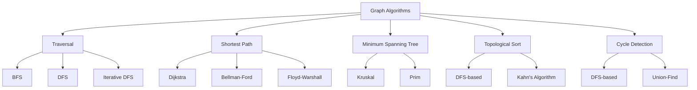

# Graph Algorithms - Advanced Graph Processing

## Overview

Graph algorithms are fundamental to solving many computer science problems. They are used in network analysis, social media, routing, and many other applications. Understanding graph algorithms is crucial for system design and optimization.

## Key Concepts

- **Graph**: Collection of vertices and edges
- **Directed/Undirected**: Edges have direction or not
- **Weighted/Unweighted**: Edges have weights or not
- **Connected Components**: Groups of connected vertices
- **Shortest Path**: Minimum cost path between vertices
- **Cycle Detection**: Finding cycles in graphs

## Graph Types and Algorithms



## Go Implementation

```go
package main

import (
    "container/heap"
    "fmt"
    "math"
    "sort"
)

// Graph represents a graph using adjacency list
type Graph struct {
    Vertices int
    Edges    [][]Edge
    Directed bool
}

// Edge represents an edge in the graph
type Edge struct {
    To     int
    Weight int
}

// NewGraph creates a new graph
func NewGraph(vertices int, directed bool) *Graph {
    return &Graph{
        Vertices: vertices,
        Edges:    make([][]Edge, vertices),
        Directed: directed,
    }
}

// AddEdge adds an edge to the graph
func (g *Graph) AddEdge(from, to, weight int) {
    g.Edges[from] = append(g.Edges[from], Edge{To: to, Weight: weight})
    if !g.Directed {
        g.Edges[to] = append(g.Edges[to], Edge{To: from, Weight: weight})
    }
}

// BFS - Breadth-First Search
func (g *Graph) BFS(start int) []int {
    visited := make([]bool, g.Vertices)
    queue := []int{start}
    result := []int{}
    
    visited[start] = true
    
    for len(queue) > 0 {
        vertex := queue[0]
        queue = queue[1:]
        result = append(result, vertex)
        
        for _, edge := range g.Edges[vertex] {
            if !visited[edge.To] {
                visited[edge.To] = true
                queue = append(queue, edge.To)
            }
        }
    }
    
    return result
}

// DFS - Depth-First Search (Recursive)
func (g *Graph) DFS(start int) []int {
    visited := make([]bool, g.Vertices)
    result := []int{}
    g.dfsHelper(start, visited, &result)
    return result
}

func (g *Graph) dfsHelper(vertex int, visited []bool, result *[]int) {
    visited[vertex] = true
    *result = append(*result, vertex)
    
    for _, edge := range g.Edges[vertex] {
        if !visited[edge.To] {
            g.dfsHelper(edge.To, visited, result)
        }
    }
}

// DFS - Iterative implementation
func (g *Graph) DFSIterative(start int) []int {
    visited := make([]bool, g.Vertices)
    stack := []int{start}
    result := []int{}
    
    for len(stack) > 0 {
        vertex := stack[len(stack)-1]
        stack = stack[:len(stack)-1]
        
        if visited[vertex] {
            continue
        }
        
        visited[vertex] = true
        result = append(result, vertex)
        
        for i := len(g.Edges[vertex]) - 1; i >= 0; i-- {
            edge := g.Edges[vertex][i]
            if !visited[edge.To] {
                stack = append(stack, edge.To)
            }
        }
    }
    
    return result
}

// Dijkstra's Algorithm - Shortest path from source
func (g *Graph) Dijkstra(start int) []int {
    dist := make([]int, g.Vertices)
    for i := range dist {
        dist[i] = math.MaxInt32
    }
    dist[start] = 0
    
    // Priority queue for vertices
    pq := make(PriorityQueue, 0)
    heap.Init(&pq)
    heap.Push(&pq, &Item{Value: start, Priority: 0})
    
    for pq.Len() > 0 {
        item := heap.Pop(&pq).(*Item)
        vertex := item.Value
        
        for _, edge := range g.Edges[vertex] {
            newDist := dist[vertex] + edge.Weight
            if newDist < dist[edge.To] {
                dist[edge.To] = newDist
                heap.Push(&pq, &Item{Value: edge.To, Priority: newDist})
            }
        }
    }
    
    return dist
}

// Bellman-Ford Algorithm - Handles negative weights
func (g *Graph) BellmanFord(start int) ([]int, bool) {
    dist := make([]int, g.Vertices)
    for i := range dist {
        dist[i] = math.MaxInt32
    }
    dist[start] = 0
    
    // Relax edges V-1 times
    for i := 0; i < g.Vertices-1; i++ {
        for u := 0; u < g.Vertices; u++ {
            for _, edge := range g.Edges[u] {
                if dist[u] != math.MaxInt32 && dist[u]+edge.Weight < dist[edge.To] {
                    dist[edge.To] = dist[u] + edge.Weight
                }
            }
        }
    }
    
    // Check for negative cycles
    for u := 0; u < g.Vertices; u++ {
        for _, edge := range g.Edges[u] {
            if dist[u] != math.MaxInt32 && dist[u]+edge.Weight < dist[edge.To] {
                return nil, false // Negative cycle detected
            }
        }
    }
    
    return dist, true
}

// Floyd-Warshall Algorithm - All pairs shortest path
func (g *Graph) FloydWarshall() [][]int {
    dist := make([][]int, g.Vertices)
    for i := range dist {
        dist[i] = make([]int, g.Vertices)
        for j := range dist[i] {
            if i == j {
                dist[i][j] = 0
            } else {
                dist[i][j] = math.MaxInt32
            }
        }
    }
    
    // Initialize with edge weights
    for u := 0; u < g.Vertices; u++ {
        for _, edge := range g.Edges[u] {
            dist[u][edge.To] = edge.Weight
        }
    }
    
    // Floyd-Warshall algorithm
    for k := 0; k < g.Vertices; k++ {
        for i := 0; i < g.Vertices; i++ {
            for j := 0; j < g.Vertices; j++ {
                if dist[i][k] != math.MaxInt32 && dist[k][j] != math.MaxInt32 {
                    if dist[i][k]+dist[k][j] < dist[i][j] {
                        dist[i][j] = dist[i][k] + dist[k][j]
                    }
                }
            }
        }
    }
    
    return dist
}

// Kruskal's Algorithm - Minimum Spanning Tree
func (g *Graph) KruskalMST() ([]Edge, int) {
    // Create all edges
    edges := []Edge{}
    for u := 0; u < g.Vertices; u++ {
        for _, edge := range g.Edges[u] {
            if g.Directed || u < edge.To { // Avoid duplicate edges in undirected graph
                edges = append(edges, Edge{To: edge.To, Weight: edge.Weight})
            }
        }
    }
    
    // Sort edges by weight
    sort.Slice(edges, func(i, j int) bool {
        return edges[i].Weight < edges[j].Weight
    })
    
    // Union-Find for cycle detection
    parent := make([]int, g.Vertices)
    rank := make([]int, g.Vertices)
    for i := range parent {
        parent[i] = i
    }
    
    mst := []Edge{}
    totalWeight := 0
    
    for _, edge := range edges {
        if g.find(parent, edge.To) != g.find(parent, edge.To) {
            mst = append(mst, edge)
            totalWeight += edge.Weight
            g.union(parent, rank, edge.To, edge.To)
        }
    }
    
    return mst, totalWeight
}

// Union-Find helper functions
func (g *Graph) find(parent []int, x int) int {
    if parent[x] != x {
        parent[x] = g.find(parent, parent[x])
    }
    return parent[x]
}

func (g *Graph) union(parent, rank []int, x, y int) {
    rootX := g.find(parent, x)
    rootY := g.find(parent, y)
    
    if rootX != rootY {
        if rank[rootX] < rank[rootY] {
            parent[rootX] = rootY
        } else if rank[rootX] > rank[rootY] {
            parent[rootY] = rootX
        } else {
            parent[rootY] = rootX
            rank[rootX]++
        }
    }
}

// Prim's Algorithm - Minimum Spanning Tree
func (g *Graph) PrimMST() ([]Edge, int) {
    parent := make([]int, g.Vertices)
    key := make([]int, g.Vertices)
    mstSet := make([]bool, g.Vertices)
    
    for i := range key {
        key[i] = math.MaxInt32
    }
    key[0] = 0
    parent[0] = -1
    
    for count := 0; count < g.Vertices-1; count++ {
        u := g.minKey(key, mstSet)
        mstSet[u] = true
        
        for _, edge := range g.Edges[u] {
            if !mstSet[edge.To] && edge.Weight < key[edge.To] {
                parent[edge.To] = u
                key[edge.To] = edge.Weight
            }
        }
    }
    
    mst := []Edge{}
    totalWeight := 0
    for i := 1; i < g.Vertices; i++ {
        mst = append(mst, Edge{To: i, Weight: key[i]})
        totalWeight += key[i]
    }
    
    return mst, totalWeight
}

func (g *Graph) minKey(key []int, mstSet []bool) int {
    min := math.MaxInt32
    minIndex := -1
    
    for v := 0; v < g.Vertices; v++ {
        if !mstSet[v] && key[v] < min {
            min = key[v]
            minIndex = v
        }
    }
    
    return minIndex
}

// Topological Sort - DFS based
func (g *Graph) TopologicalSort() []int {
    if !g.Directed {
        return nil // Topological sort only for directed graphs
    }
    
    visited := make([]bool, g.Vertices)
    stack := []int{}
    
    for i := 0; i < g.Vertices; i++ {
        if !visited[i] {
            g.topologicalSortHelper(i, visited, &stack)
        }
    }
    
    // Reverse the stack to get topological order
    result := make([]int, len(stack))
    for i, v := range stack {
        result[len(stack)-1-i] = v
    }
    
    return result
}

func (g *Graph) topologicalSortHelper(vertex int, visited []bool, stack *[]int) {
    visited[vertex] = true
    
    for _, edge := range g.Edges[vertex] {
        if !visited[edge.To] {
            g.topologicalSortHelper(edge.To, visited, stack)
        }
    }
    
    *stack = append(*stack, vertex)
}

// Cycle Detection - DFS based
func (g *Graph) HasCycle() bool {
    if !g.Directed {
        return g.hasCycleUndirected()
    }
    return g.hasCycleDirected()
}

func (g *Graph) hasCycleDirected() bool {
    visited := make([]bool, g.Vertices)
    recStack := make([]bool, g.Vertices)
    
    for i := 0; i < g.Vertices; i++ {
        if !visited[i] {
            if g.hasCycleDirectedHelper(i, visited, recStack) {
                return true
            }
        }
    }
    
    return false
}

func (g *Graph) hasCycleDirectedHelper(vertex int, visited, recStack []bool) bool {
    visited[vertex] = true
    recStack[vertex] = true
    
    for _, edge := range g.Edges[vertex] {
        if !visited[edge.To] {
            if g.hasCycleDirectedHelper(edge.To, visited, recStack) {
                return true
            }
        } else if recStack[edge.To] {
            return true
        }
    }
    
    recStack[vertex] = false
    return false
}

func (g *Graph) hasCycleUndirected() bool {
    visited := make([]bool, g.Vertices)
    
    for i := 0; i < g.Vertices; i++ {
        if !visited[i] {
            if g.hasCycleUndirectedHelper(i, -1, visited) {
                return true
            }
        }
    }
    
    return false
}

func (g *Graph) hasCycleUndirectedHelper(vertex, parent int, visited []bool) bool {
    visited[vertex] = true
    
    for _, edge := range g.Edges[vertex] {
        if !visited[edge.To] {
            if g.hasCycleUndirectedHelper(edge.To, vertex, visited) {
                return true
            }
        } else if edge.To != parent {
            return true
        }
    }
    
    return false
}

// Connected Components
func (g *Graph) ConnectedComponents() [][]int {
    visited := make([]bool, g.Vertices)
    components := [][]int{}
    
    for i := 0; i < g.Vertices; i++ {
        if !visited[i] {
            component := []int{}
            g.dfsHelper(i, visited, &component)
            components = append(components, component)
        }
    }
    
    return components
}

// Strongly Connected Components (Kosaraju's Algorithm)
func (g *Graph) StronglyConnectedComponents() [][]int {
    if !g.Directed {
        return g.ConnectedComponents()
    }
    
    // Step 1: Get finish times using DFS
    visited := make([]bool, g.Vertices)
    finishOrder := []int{}
    
    for i := 0; i < g.Vertices; i++ {
        if !visited[i] {
            g.getFinishOrder(i, visited, &finishOrder)
        }
    }
    
    // Step 2: Reverse the graph
    reversed := g.reverse()
    
    // Step 3: DFS on reversed graph in reverse finish order
    visited = make([]bool, g.Vertices)
    sccs := [][]int{}
    
    for i := len(finishOrder) - 1; i >= 0; i-- {
        vertex := finishOrder[i]
        if !visited[vertex] {
            component := []int{}
            reversed.dfsHelper(vertex, visited, &component)
            sccs = append(sccs, component)
        }
    }
    
    return sccs
}

func (g *Graph) getFinishOrder(vertex int, visited []bool, finishOrder *[]int) {
    visited[vertex] = true
    
    for _, edge := range g.Edges[vertex] {
        if !visited[edge.To] {
            g.getFinishOrder(edge.To, visited, finishOrder)
        }
    }
    
    *finishOrder = append(*finishOrder, vertex)
}

func (g *Graph) reverse() *Graph {
    reversed := NewGraph(g.Vertices, true)
    
    for u := 0; u < g.Vertices; u++ {
        for _, edge := range g.Edges[u] {
            reversed.AddEdge(edge.To, u, edge.Weight)
        }
    }
    
    return reversed
}

// Priority Queue implementation for Dijkstra
type Item struct {
    Value    int
    Priority int
    Index    int
}

type PriorityQueue []*Item

func (pq PriorityQueue) Len() int { return len(pq) }

func (pq PriorityQueue) Less(i, j int) bool {
    return pq[i].Priority < pq[j].Priority
}

func (pq PriorityQueue) Swap(i, j int) {
    pq[i], pq[j] = pq[j], pq[i]
    pq[i].Index = i
    pq[j].Index = j
}

func (pq *PriorityQueue) Push(x interface{}) {
    n := len(*pq)
    item := x.(*Item)
    item.Index = n
    *pq = append(*pq, item)
}

func (pq *PriorityQueue) Pop() interface{} {
    old := *pq
    n := len(old)
    item := old[n-1]
    old[n-1] = nil
    item.Index = -1
    *pq = old[0 : n-1]
    return item
}

// Example usage
func main() {
    // Create a directed graph
    g := NewGraph(6, true)
    g.AddEdge(0, 1, 5)
    g.AddEdge(0, 2, 3)
    g.AddEdge(1, 3, 6)
    g.AddEdge(2, 1, 2)
    g.AddEdge(2, 4, 4)
    g.AddEdge(3, 4, 1)
    g.AddEdge(4, 5, 2)
    
    fmt.Println("Graph created with 6 vertices")
    
    // Test BFS
    fmt.Printf("BFS from vertex 0: %v\n", g.BFS(0))
    
    // Test DFS
    fmt.Printf("DFS from vertex 0: %v\n", g.DFS(0))
    
    // Test Dijkstra
    dist := g.Dijkstra(0)
    fmt.Printf("Shortest distances from vertex 0: %v\n", dist)
    
    // Test Bellman-Ford
    dist, noNegativeCycle := g.BellmanFord(0)
    if noNegativeCycle {
        fmt.Printf("Bellman-Ford distances: %v\n", dist)
    } else {
        fmt.Println("Negative cycle detected")
    }
    
    // Test Floyd-Warshall
    allPairsDist := g.FloydWarshall()
    fmt.Println("All pairs shortest distances:")
    for i, row := range allPairsDist {
        fmt.Printf("From %d: %v\n", i, row)
    }
    
    // Test Topological Sort
    topoOrder := g.TopologicalSort()
    fmt.Printf("Topological order: %v\n", topoOrder)
    
    // Test Cycle Detection
    hasCycle := g.HasCycle()
    fmt.Printf("Has cycle: %t\n", hasCycle)
    
    // Test Connected Components
    components := g.ConnectedComponents()
    fmt.Printf("Connected components: %v\n", components)
    
    // Test Strongly Connected Components
    sccs := g.StronglyConnectedComponents()
    fmt.Printf("Strongly connected components: %v\n", sccs)
    
    // Create undirected graph for MST
    mstGraph := NewGraph(5, false)
    mstGraph.AddEdge(0, 1, 2)
    mstGraph.AddEdge(0, 3, 6)
    mstGraph.AddEdge(1, 2, 3)
    mstGraph.AddEdge(1, 3, 8)
    mstGraph.AddEdge(1, 4, 5)
    mstGraph.AddEdge(2, 4, 7)
    mstGraph.AddEdge(3, 4, 9)
    
    // Test Kruskal's MST
    mst, weight := mstGraph.KruskalMST()
    fmt.Printf("Kruskal MST weight: %d, edges: %v\n", weight, mst)
    
    // Test Prim's MST
    mst, weight = mstGraph.PrimMST()
    fmt.Printf("Prim MST weight: %d, edges: %v\n", weight, mst)
}
```

## Graph Representation

### 1. Adjacency List
- **Space**: O(V + E)
- **Add Edge**: O(1)
- **Check Edge**: O(V)
- **Use Case**: Sparse graphs

### 2. Adjacency Matrix
- **Space**: O(V²)
- **Add Edge**: O(1)
- **Check Edge**: O(1)
- **Use Case**: Dense graphs

### 3. Edge List
- **Space**: O(E)
- **Add Edge**: O(1)
- **Check Edge**: O(E)
- **Use Case**: Kruskal's algorithm

## Algorithm Complexities

### 1. Traversal
- **BFS**: O(V + E) time, O(V) space
- **DFS**: O(V + E) time, O(V) space
- **Iterative DFS**: O(V + E) time, O(V) space

### 2. Shortest Path
- **Dijkstra**: O((V + E) log V) time, O(V) space
- **Bellman-Ford**: O(VE) time, O(V) space
- **Floyd-Warshall**: O(V³) time, O(V²) space

### 3. Minimum Spanning Tree
- **Kruskal**: O(E log E) time, O(V) space
- **Prim**: O((V + E) log V) time, O(V) space

### 4. Topological Sort
- **DFS-based**: O(V + E) time, O(V) space
- **Kahn's**: O(V + E) time, O(V) space

## Benefits

1. **Efficiency**: Optimized algorithms for different problems
2. **Flexibility**: Works with different graph types
3. **Scalability**: Handles large graphs efficiently
4. **Reusability**: Algorithms can be reused
5. **Optimization**: Many algorithms have optimizations

## Common Pitfalls

1. **Graph Type**: Not considering directed vs undirected
2. **Edge Cases**: Not handling empty graphs or single vertices
3. **Memory**: Not considering space complexity
4. **Cycles**: Not handling cycles properly
5. **Negative Weights**: Not considering negative edge weights

## Interview Questions

1. **What's the difference between BFS and DFS?**
   - BFS uses queue, DFS uses stack; BFS finds shortest path, DFS uses less memory

2. **When would you use Dijkstra vs Bellman-Ford?**
   - Dijkstra for non-negative weights, Bellman-Ford for negative weights

3. **What's the time complexity of Floyd-Warshall?**
   - O(V³) for all pairs shortest path

4. **How do you detect cycles in a graph?**
   - Use DFS with recursion stack for directed, DFS with parent tracking for undirected

## Time Complexity

- **BFS/DFS**: O(V + E)
- **Dijkstra**: O((V + E) log V)
- **Bellman-Ford**: O(VE)
- **Floyd-Warshall**: O(V³)
- **Kruskal**: O(E log E)
- **Prim**: O((V + E) log V)

## Space Complexity

- **Adjacency List**: O(V + E)
- **Adjacency Matrix**: O(V²)
- **BFS/DFS**: O(V)
- **Dijkstra**: O(V)
- **Floyd-Warshall**: O(V²)

The optimal solution uses:
1. **Appropriate Representation**: Choose based on graph density
2. **Efficient Algorithms**: Use the right algorithm for the problem
3. **Space Optimization**: Minimize memory usage
4. **Edge Case Handling**: Handle all possible scenarios
