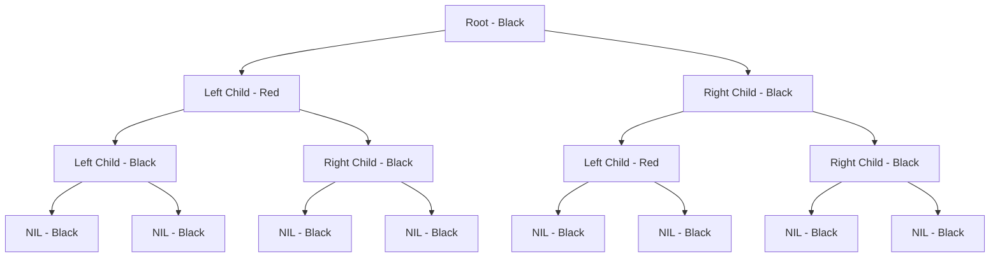

---
# Auto-generated front matter
Title: Red Black Tree
LastUpdated: 2025-11-06T20:45:58.683304
Tags: []
Status: draft
---

# Red-Black Tree - Self-Balancing Binary Search Tree

## Overview

A Red-Black Tree is a self-balancing binary search tree that maintains balance through color properties and rotations. It ensures O(log n) height for all operations, making it efficient for dynamic data structures.

## Key Properties

1. **Color Property**: Each node is either red or black
2. **Root Property**: The root is always black
3. **Leaf Property**: All leaves (NIL nodes) are black
4. **Red Property**: Red nodes cannot have red children
5. **Path Property**: All paths from root to leaves have the same number of black nodes

## Red-Black Tree Structure



## Go Implementation

```go
package main

import (
    "fmt"
    "log"
)

// Color represents the color of a node
type Color bool

const (
    RED   Color = false
    BLACK Color = true
)

// Node represents a node in the Red-Black Tree
type Node struct {
    Key    int
    Value  interface{}
    Color  Color
    Left   *Node
    Right  *Node
    Parent *Node
}

// RedBlackTree represents a Red-Black Tree
type RedBlackTree struct {
    Root *Node
    Size int
}

// NewRedBlackTree creates a new Red-Black Tree
func NewRedBlackTree() *RedBlackTree {
    return &RedBlackTree{
        Root: nil,
        Size: 0,
    }
}

// Insert inserts a key-value pair into the tree
func (rbt *RedBlackTree) Insert(key int, value interface{}) {
    newNode := &Node{
        Key:   key,
        Value: value,
        Color: RED,
        Left:  nil,
        Right: nil,
    }

    rbt.insertNode(newNode)
    rbt.fixInsertion(newNode)
    rbt.Size++
}

// insertNode performs the basic BST insertion
func (rbt *RedBlackTree) insertNode(newNode *Node) {
    var parent *Node
    current := rbt.Root

    // Find the correct position
    for current != nil {
        parent = current
        if newNode.Key < current.Key {
            current = current.Left
        } else {
            current = current.Right
        }
    }

    newNode.Parent = parent

    if parent == nil {
        rbt.Root = newNode
    } else if newNode.Key < parent.Key {
        parent.Left = newNode
    } else {
        parent.Right = newNode
    }
}

// fixInsertion fixes the Red-Black Tree properties after insertion
func (rbt *RedBlackTree) fixInsertion(node *Node) {
    for node.Parent != nil && node.Parent.Color == RED {
        if node.Parent == node.Parent.Parent.Left {
            uncle := node.Parent.Parent.Right
            if uncle != nil && uncle.Color == RED {
                // Case 1: Uncle is red
                node.Parent.Color = BLACK
                uncle.Color = BLACK
                node.Parent.Parent.Color = RED
                node = node.Parent.Parent
            } else {
                if node == node.Parent.Right {
                    // Case 2: Uncle is black and node is right child
                    node = node.Parent
                    rbt.leftRotate(node)
                }
                // Case 3: Uncle is black and node is left child
                node.Parent.Color = BLACK
                node.Parent.Parent.Color = RED
                rbt.rightRotate(node.Parent.Parent)
            }
        } else {
            uncle := node.Parent.Parent.Left
            if uncle != nil && uncle.Color == RED {
                // Case 1: Uncle is red
                node.Parent.Color = BLACK
                uncle.Color = BLACK
                node.Parent.Parent.Color = RED
                node = node.Parent.Parent
            } else {
                if node == node.Parent.Left {
                    // Case 2: Uncle is black and node is left child
                    node = node.Parent
                    rbt.rightRotate(node)
                }
                // Case 3: Uncle is black and node is right child
                node.Parent.Color = BLACK
                node.Parent.Parent.Color = RED
                rbt.leftRotate(node.Parent.Parent)
            }
        }
    }
    rbt.Root.Color = BLACK
}

// leftRotate performs a left rotation
func (rbt *RedBlackTree) leftRotate(node *Node) {
    rightChild := node.Right
    node.Right = rightChild.Left

    if rightChild.Left != nil {
        rightChild.Left.Parent = node
    }

    rightChild.Parent = node.Parent

    if node.Parent == nil {
        rbt.Root = rightChild
    } else if node == node.Parent.Left {
        node.Parent.Left = rightChild
    } else {
        node.Parent.Right = rightChild
    }

    rightChild.Left = node
    node.Parent = rightChild
}

// rightRotate performs a right rotation
func (rbt *RedBlackTree) rightRotate(node *Node) {
    leftChild := node.Left
    node.Left = leftChild.Right

    if leftChild.Right != nil {
        leftChild.Right.Parent = node
    }

    leftChild.Parent = node.Parent

    if node.Parent == nil {
        rbt.Root = leftChild
    } else if node == node.Parent.Right {
        node.Parent.Right = leftChild
    } else {
        node.Parent.Left = leftChild
    }

    leftChild.Right = node
    node.Parent = leftChild
}

// Search searches for a key in the tree
func (rbt *RedBlackTree) Search(key int) *Node {
    current := rbt.Root
    for current != nil {
        if key == current.Key {
            return current
        } else if key < current.Key {
            current = current.Left
        } else {
            current = current.Right
        }
    }
    return nil
}

// Delete deletes a key from the tree
func (rbt *RedBlackTree) Delete(key int) bool {
    node := rbt.Search(key)
    if node == nil {
        return false
    }

    rbt.deleteNode(node)
    rbt.Size--
    return true
}

// deleteNode deletes a node from the tree
func (rbt *RedBlackTree) deleteNode(node *Node) {
    var child *Node
    var originalColor = node.Color

    if node.Left == nil {
        child = node.Right
        rbt.transplant(node, node.Right)
    } else if node.Right == nil {
        child = node.Left
        rbt.transplant(node, node.Left)
    } else {
        successor := rbt.minimum(node.Right)
        originalColor = successor.Color
        child = successor.Right

        if successor.Parent == node {
            if child != nil {
                child.Parent = successor
            }
        } else {
            rbt.transplant(successor, successor.Right)
            successor.Right = node.Right
            successor.Right.Parent = successor
        }

        rbt.transplant(node, successor)
        successor.Left = node.Left
        successor.Left.Parent = successor
        successor.Color = node.Color
    }

    if originalColor == BLACK {
        rbt.fixDeletion(child)
    }
}

// transplant replaces one subtree with another
func (rbt *RedBlackTree) transplant(u, v *Node) {
    if u.Parent == nil {
        rbt.Root = v
    } else if u == u.Parent.Left {
        u.Parent.Left = v
    } else {
        u.Parent.Right = v
    }

    if v != nil {
        v.Parent = u.Parent
    }
}

// minimum finds the minimum node in a subtree
func (rbt *RedBlackTree) minimum(node *Node) *Node {
    for node.Left != nil {
        node = node.Left
    }
    return node
}

// fixDeletion fixes the Red-Black Tree properties after deletion
func (rbt *RedBlackTree) fixDeletion(node *Node) {
    for node != rbt.Root && node != nil && node.Color == BLACK {
        if node == node.Parent.Left {
            sibling := node.Parent.Right
            if sibling != nil && sibling.Color == RED {
                sibling.Color = BLACK
                node.Parent.Color = RED
                rbt.leftRotate(node.Parent)
                sibling = node.Parent.Right
            }

            if (sibling.Left == nil || sibling.Left.Color == BLACK) &&
                (sibling.Right == nil || sibling.Right.Color == BLACK) {
                sibling.Color = RED
                node = node.Parent
            } else {
                if sibling.Right == nil || sibling.Right.Color == BLACK {
                    sibling.Left.Color = BLACK
                    sibling.Color = RED
                    rbt.rightRotate(sibling)
                    sibling = node.Parent.Right
                }

                sibling.Color = node.Parent.Color
                node.Parent.Color = BLACK
                sibling.Right.Color = BLACK
                rbt.leftRotate(node.Parent)
                node = rbt.Root
            }
        } else {
            sibling := node.Parent.Left
            if sibling != nil && sibling.Color == RED {
                sibling.Color = BLACK
                node.Parent.Color = RED
                rbt.rightRotate(node.Parent)
                sibling = node.Parent.Left
            }

            if (sibling.Right == nil || sibling.Right.Color == BLACK) &&
                (sibling.Left == nil || sibling.Left.Color == BLACK) {
                sibling.Color = RED
                node = node.Parent
            } else {
                if sibling.Left == nil || sibling.Left.Color == BLACK {
                    sibling.Right.Color = BLACK
                    sibling.Color = RED
                    rbt.leftRotate(sibling)
                    sibling = node.Parent.Left
                }

                sibling.Color = node.Parent.Color
                node.Parent.Color = BLACK
                sibling.Left.Color = BLACK
                rbt.rightRotate(node.Parent)
                node = rbt.Root
            }
        }
    }
    if node != nil {
        node.Color = BLACK
    }
}

// InOrderTraversal performs an in-order traversal
func (rbt *RedBlackTree) InOrderTraversal() []int {
    var result []int
    rbt.inOrderHelper(rbt.Root, &result)
    return result
}

// inOrderHelper is a helper function for in-order traversal
func (rbt *RedBlackTree) inOrderHelper(node *Node, result *[]int) {
    if node != nil {
        rbt.inOrderHelper(node.Left, result)
        *result = append(*result, node.Key)
        rbt.inOrderHelper(node.Right, result)
    }
}

// Height returns the height of the tree
func (rbt *RedBlackTree) Height() int {
    return rbt.heightHelper(rbt.Root)
}

// heightHelper is a helper function to calculate height
func (rbt *RedBlackTree) heightHelper(node *Node) int {
    if node == nil {
        return 0
    }
    leftHeight := rbt.heightHelper(node.Left)
    rightHeight := rbt.heightHelper(node.Right)
    if leftHeight > rightHeight {
        return leftHeight + 1
    }
    return rightHeight + 1
}

// IsValid checks if the tree maintains Red-Black properties
func (rbt *RedBlackTree) IsValid() bool {
    if rbt.Root == nil {
        return true
    }

    // Check if root is black
    if rbt.Root.Color != BLACK {
        return false
    }

    // Check all paths have same number of black nodes
    return rbt.checkBlackHeight(rbt.Root) != -1
}

// checkBlackHeight checks if all paths have same number of black nodes
func (rbt *RedBlackTree) checkBlackHeight(node *Node) int {
    if node == nil {
        return 1
    }

    leftBlackHeight := rbt.checkBlackHeight(node.Left)
    rightBlackHeight := rbt.checkBlackHeight(node.Right)

    if leftBlackHeight == -1 || rightBlackHeight == -1 {
        return -1
    }

    if leftBlackHeight != rightBlackHeight {
        return -1
    }

    if node.Color == BLACK {
        return leftBlackHeight + 1
    }
    return leftBlackHeight
}

// Example usage
func main() {
    rbt := NewRedBlackTree()

    // Insert elements
    keys := []int{10, 20, 30, 40, 50, 25, 35, 45, 55, 15}
    for _, key := range keys {
        rbt.Insert(key, fmt.Sprintf("value_%d", key))
        fmt.Printf("Inserted %d\n", key)
    }

    // Search for a key
    if node := rbt.Search(30); node != nil {
        fmt.Printf("Found key 30 with value: %v\n", node.Value)
    }

    // In-order traversal
    fmt.Printf("In-order traversal: %v\n", rbt.InOrderTraversal())

    // Check if tree is valid
    fmt.Printf("Tree is valid: %v\n", rbt.IsValid())

    // Get tree height
    fmt.Printf("Tree height: %d\n", rbt.Height())

    // Delete a key
    if rbt.Delete(30) {
        fmt.Println("Deleted key 30")
    }

    // Final in-order traversal
    fmt.Printf("Final in-order traversal: %v\n", rbt.InOrderTraversal())
    fmt.Printf("Final tree height: %d\n", rbt.Height())
    fmt.Printf("Tree is still valid: %v\n", rbt.IsValid())
}
```

## Node.js Implementation

```javascript
class Node {
  constructor(key, value) {
    this.key = key;
    this.value = value;
    this.color = "RED";
    this.left = null;
    this.right = null;
    this.parent = null;
  }
}

class RedBlackTree {
  constructor() {
    this.root = null;
    this.size = 0;
  }

  insert(key, value) {
    const newNode = new Node(key, value);
    this.insertNode(newNode);
    this.fixInsertion(newNode);
    this.size++;
  }

  insertNode(newNode) {
    let parent = null;
    let current = this.root;

    // Find the correct position
    while (current !== null) {
      parent = current;
      if (newNode.key < current.key) {
        current = current.left;
      } else {
        current = current.right;
      }
    }

    newNode.parent = parent;

    if (parent === null) {
      this.root = newNode;
    } else if (newNode.key < parent.key) {
      parent.left = newNode;
    } else {
      parent.right = newNode;
    }
  }

  fixInsertion(node) {
    while (node.parent !== null && node.parent.color === "RED") {
      if (node.parent === node.parent.parent.left) {
        const uncle = node.parent.parent.right;
        if (uncle !== null && uncle.color === "RED") {
          // Case 1: Uncle is red
          node.parent.color = "BLACK";
          uncle.color = "BLACK";
          node.parent.parent.color = "RED";
          node = node.parent.parent;
        } else {
          if (node === node.parent.right) {
            // Case 2: Uncle is black and node is right child
            node = node.parent;
            this.leftRotate(node);
          }
          // Case 3: Uncle is black and node is left child
          node.parent.color = "BLACK";
          node.parent.parent.color = "RED";
          this.rightRotate(node.parent.parent);
        }
      } else {
        const uncle = node.parent.parent.left;
        if (uncle !== null && uncle.color === "RED") {
          // Case 1: Uncle is red
          node.parent.color = "BLACK";
          uncle.color = "BLACK";
          node.parent.parent.color = "RED";
          node = node.parent.parent;
        } else {
          if (node === node.parent.left) {
            // Case 2: Uncle is black and node is left child
            node = node.parent;
            this.rightRotate(node);
          }
          // Case 3: Uncle is black and node is right child
          node.parent.color = "BLACK";
          node.parent.parent.color = "RED";
          this.leftRotate(node.parent.parent);
        }
      }
    }
    this.root.color = "BLACK";
  }

  leftRotate(node) {
    const rightChild = node.right;
    node.right = rightChild.left;

    if (rightChild.left !== null) {
      rightChild.left.parent = node;
    }

    rightChild.parent = node.parent;

    if (node.parent === null) {
      this.root = rightChild;
    } else if (node === node.parent.left) {
      node.parent.left = rightChild;
    } else {
      node.parent.right = rightChild;
    }

    rightChild.left = node;
    node.parent = rightChild;
  }

  rightRotate(node) {
    const leftChild = node.left;
    node.left = leftChild.right;

    if (leftChild.right !== null) {
      leftChild.right.parent = node;
    }

    leftChild.parent = node.parent;

    if (node.parent === null) {
      this.root = leftChild;
    } else if (node === node.parent.right) {
      node.parent.right = leftChild;
    } else {
      node.parent.left = leftChild;
    }

    leftChild.right = node;
    node.parent = leftChild;
  }

  search(key) {
    let current = this.root;
    while (current !== null) {
      if (key === current.key) {
        return current;
      } else if (key < current.key) {
        current = current.left;
      } else {
        current = current.right;
      }
    }
    return null;
  }

  delete(key) {
    const node = this.search(key);
    if (node === null) {
      return false;
    }

    this.deleteNode(node);
    this.size--;
    return true;
  }

  deleteNode(node) {
    let child;
    let originalColor = node.color;

    if (node.left === null) {
      child = node.right;
      this.transplant(node, node.right);
    } else if (node.right === null) {
      child = node.left;
      this.transplant(node, node.left);
    } else {
      const successor = this.minimum(node.right);
      originalColor = successor.color;
      child = successor.right;

      if (successor.parent === node) {
        if (child !== null) {
          child.parent = successor;
        }
      } else {
        this.transplant(successor, successor.right);
        successor.right = node.right;
        successor.right.parent = successor;
      }

      this.transplant(node, successor);
      successor.left = node.left;
      successor.left.parent = successor;
      successor.color = node.color;
    }

    if (originalColor === "BLACK") {
      this.fixDeletion(child);
    }
  }

  transplant(u, v) {
    if (u.parent === null) {
      this.root = v;
    } else if (u === u.parent.left) {
      u.parent.left = v;
    } else {
      u.parent.right = v;
    }

    if (v !== null) {
      v.parent = u.parent;
    }
  }

  minimum(node) {
    while (node.left !== null) {
      node = node.left;
    }
    return node;
  }

  fixDeletion(node) {
    while (node !== this.root && node !== null && node.color === "BLACK") {
      if (node === node.parent.left) {
        let sibling = node.parent.right;
        if (sibling !== null && sibling.color === "RED") {
          sibling.color = "BLACK";
          node.parent.color = "RED";
          this.leftRotate(node.parent);
          sibling = node.parent.right;
        }

        if (
          (sibling.left === null || sibling.left.color === "BLACK") &&
          (sibling.right === null || sibling.right.color === "BLACK")
        ) {
          sibling.color = "RED";
          node = node.parent;
        } else {
          if (sibling.right === null || sibling.right.color === "BLACK") {
            sibling.left.color = "BLACK";
            sibling.color = "RED";
            this.rightRotate(sibling);
            sibling = node.parent.right;
          }

          sibling.color = node.parent.color;
          node.parent.color = "BLACK";
          sibling.right.color = "BLACK";
          this.leftRotate(node.parent);
          node = this.root;
        }
      } else {
        let sibling = node.parent.left;
        if (sibling !== null && sibling.color === "RED") {
          sibling.color = "BLACK";
          node.parent.color = "RED";
          this.rightRotate(node.parent);
          sibling = node.parent.left;
        }

        if (
          (sibling.right === null || sibling.right.color === "BLACK") &&
          (sibling.left === null || sibling.left.color === "BLACK")
        ) {
          sibling.color = "RED";
          node = node.parent;
        } else {
          if (sibling.left === null || sibling.left.color === "BLACK") {
            sibling.right.color = "BLACK";
            sibling.color = "RED";
            this.leftRotate(sibling);
            sibling = node.parent.left;
          }

          sibling.color = node.parent.color;
          node.parent.color = "BLACK";
          sibling.left.color = "BLACK";
          this.rightRotate(node.parent);
          node = this.root;
        }
      }
    }
    if (node !== null) {
      node.color = "BLACK";
    }
  }

  inOrderTraversal() {
    const result = [];
    this.inOrderHelper(this.root, result);
    return result;
  }

  inOrderHelper(node, result) {
    if (node !== null) {
      this.inOrderHelper(node.left, result);
      result.push(node.key);
      this.inOrderHelper(node.right, result);
    }
  }

  height() {
    return this.heightHelper(this.root);
  }

  heightHelper(node) {
    if (node === null) {
      return 0;
    }
    const leftHeight = this.heightHelper(node.left);
    const rightHeight = this.heightHelper(node.right);
    return Math.max(leftHeight, rightHeight) + 1;
  }

  isValid() {
    if (this.root === null) {
      return true;
    }

    // Check if root is black
    if (this.root.color !== "BLACK") {
      return false;
    }

    // Check all paths have same number of black nodes
    return this.checkBlackHeight(this.root) !== -1;
  }

  checkBlackHeight(node) {
    if (node === null) {
      return 1;
    }

    const leftBlackHeight = this.checkBlackHeight(node.left);
    const rightBlackHeight = this.checkBlackHeight(node.right);

    if (leftBlackHeight === -1 || rightBlackHeight === -1) {
      return -1;
    }

    if (leftBlackHeight !== rightBlackHeight) {
      return -1;
    }

    if (node.color === "BLACK") {
      return leftBlackHeight + 1;
    }
    return leftBlackHeight;
  }
}

// Example usage
function main() {
  const rbt = new RedBlackTree();

  // Insert elements
  const keys = [10, 20, 30, 40, 50, 25, 35, 45, 55, 15];
  for (const key of keys) {
    rbt.insert(key, `value_${key}`);
    console.log(`Inserted ${key}`);
  }

  // Search for a key
  const found = rbt.search(30);
  if (found) {
    console.log(`Found key 30 with value: ${found.value}`);
  }

  // In-order traversal
  console.log(`In-order traversal: ${rbt.inOrderTraversal()}`);

  // Check if tree is valid
  console.log(`Tree is valid: ${rbt.isValid()}`);

  // Get tree height
  console.log(`Tree height: ${rbt.height()}`);

  // Delete a key
  if (rbt.delete(30)) {
    console.log("Deleted key 30");
  }

  // Final in-order traversal
  console.log(`Final in-order traversal: ${rbt.inOrderTraversal()}`);
  console.log(`Final tree height: ${rbt.height()}`);
  console.log(`Tree is still valid: ${rbt.isValid()}`);
}

if (require.main === module) {
  main();
}
```

## Benefits

1. **Guaranteed O(log n) Height**: Maintains balance automatically
2. **Efficient Operations**: All operations are O(log n)
3. **Memory Efficient**: No extra storage for balance information
4. **Stable Performance**: Consistent performance across operations

## Trade-offs

1. **Complex Implementation**: More complex than regular BST
2. **Overhead**: Color maintenance and rotations add overhead
3. **Memory**: Additional parent pointers required
4. **Debugging**: Harder to debug due to complexity

## Use Cases

- **Database Indexes**: B-trees are often preferred for disk storage
- **Memory Maps**: When you need sorted data with fast access
- **Priority Queues**: Can be used for efficient priority queues
- **Range Queries**: Efficient for range-based operations

## Time Complexity

- **Insertion**: O(log n)
- **Deletion**: O(log n)
- **Search**: O(log n)
- **Traversal**: O(n)

## Space Complexity

- **Storage**: O(n) for n nodes
- **Auxiliary Space**: O(1) for operations

## Interview Questions

1. **What are the properties of a Red-Black Tree?**
   - Root is black, leaves are black, red nodes have black children, all paths have same black height

2. **How does it maintain balance?**
   - Through color properties and rotations during insertions/deletions

3. **What's the difference between Red-Black and AVL trees?**
   - Red-Black allows more flexibility in balance, AVL is more strictly balanced

4. **When would you use Red-Black over other trees?**
   - When you need guaranteed O(log n) performance with less strict balancing

The optimal solution uses:
1. **Proper Rotation Logic**: Correctly implement left and right rotations
2. **Color Maintenance**: Ensure all color properties are maintained
3. **Efficient Operations**: Minimize the number of rotations needed
4. **Error Handling**: Handle edge cases and invalid states
