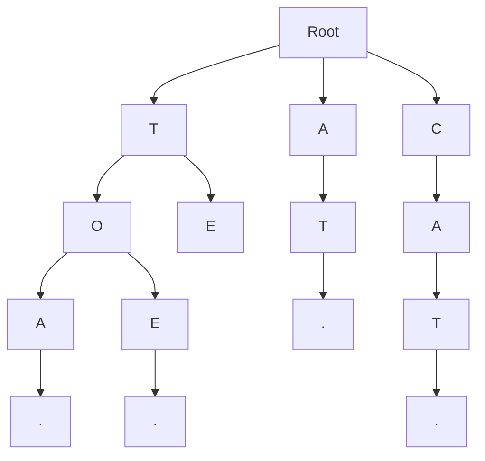

# Trie (Prefix Tree) - String Search Data Structure

## Overview

A Trie (pronounced "try") is a tree-like data structure used for storing and searching strings efficiently. It's particularly useful for prefix-based searches, autocomplete, and string matching applications.

## Key Concepts

- **Node**: Each node represents a character
- **Path**: Path from root to leaf represents a complete string
- **Prefix**: Common prefix of multiple strings
- **Leaf Node**: Marks the end of a complete string
- **Children**: Each node can have multiple children

## Trie Structure



## Go Implementation

```go
package main

import (
    "fmt"
    "log"
    "strings"
)

// TrieNode represents a node in the trie
type TrieNode struct {
    Children map[rune]*TrieNode
    IsEnd    bool
    Value    interface{}
    Count    int
}

// NewTrieNode creates a new trie node
func NewTrieNode() *TrieNode {
    return &TrieNode{
        Children: make(map[rune]*TrieNode),
        IsEnd:    false,
        Value:    nil,
        Count:    0,
    }
}

// Trie represents a trie data structure
type Trie struct {
    Root *TrieNode
    Size int
}

// NewTrie creates a new trie
func NewTrie() *Trie {
    return &Trie{
        Root: NewTrieNode(),
        Size: 0,
    }
}

// Insert inserts a word into the trie
func (t *Trie) Insert(word string, value interface{}) {
    current := t.Root
    
    for _, char := range word {
        if current.Children[char] == nil {
            current.Children[char] = NewTrieNode()
        }
        current = current.Children[char]
        current.Count++
    }
    
    current.IsEnd = true
    current.Value = value
    t.Size++
}

// Search searches for a word in the trie
func (t *Trie) Search(word string) (bool, interface{}) {
    current := t.Root
    
    for _, char := range word {
        if current.Children[char] == nil {
            return false, nil
        }
        current = current.Children[char]
    }
    
    return current.IsEnd, current.Value
}

// StartsWith checks if any word in the trie starts with the given prefix
func (t *Trie) StartsWith(prefix string) bool {
    current := t.Root
    
    for _, char := range prefix {
        if current.Children[char] == nil {
            return false
        }
        current = current.Children[char]
    }
    
    return true
}

// Delete deletes a word from the trie
func (t *Trie) Delete(word string) bool {
    return t.deleteHelper(t.Root, word, 0)
}

// deleteHelper is a helper function for deletion
func (t *Trie) deleteHelper(node *TrieNode, word string, index int) bool {
    if index == len(word) {
        if !node.IsEnd {
            return false
        }
        node.IsEnd = false
        node.Value = nil
        t.Size--
        return len(node.Children) == 0
    }
    
    char := rune(word[index])
    child, exists := node.Children[char]
    if !exists {
        return false
    }
    
    shouldDeleteChild := t.deleteHelper(child, word, index+1)
    
    if shouldDeleteChild {
        delete(node.Children, char)
        node.Count--
        return len(node.Children) == 0 && !node.IsEnd
    }
    
    return false
}

// GetAllWords returns all words in the trie
func (t *Trie) GetAllWords() []string {
    var words []string
    t.collectWords(t.Root, "", &words)
    return words
}

// collectWords is a helper function to collect all words
func (t *Trie) collectWords(node *TrieNode, prefix string, words *[]string) {
    if node.IsEnd {
        *words = append(*words, prefix)
    }
    
    for char, child := range node.Children {
        t.collectWords(child, prefix+string(char), words)
    }
}

// GetWordsWithPrefix returns all words that start with the given prefix
func (t *Trie) GetWordsWithPrefix(prefix string) []string {
    current := t.Root
    
    // Navigate to the prefix node
    for _, char := range prefix {
        if current.Children[char] == nil {
            return []string{}
        }
        current = current.Children[char]
    }
    
    var words []string
    t.collectWords(current, prefix, &words)
    return words
}

// GetLongestCommonPrefix returns the longest common prefix of all words
func (t *Trie) GetLongestCommonPrefix() string {
    if t.Root == nil || len(t.Root.Children) == 0 {
        return ""
    }
    
    var prefix strings.Builder
    current := t.Root
    
    for len(current.Children) == 1 && !current.IsEnd {
        for char, child := range current.Children {
            prefix.WriteRune(char)
            current = child
            break
        }
    }
    
    return prefix.String()
}

// GetWordCount returns the number of words in the trie
func (t *Trie) GetWordCount() int {
    return t.Size
}

// GetNodeCount returns the total number of nodes in the trie
func (t *Trie) GetNodeCount() int {
    return t.countNodes(t.Root)
}

// countNodes is a helper function to count nodes
func (t *Trie) countNodes(node *TrieNode) int {
    if node == nil {
        return 0
    }
    
    count := 1
    for _, child := range node.Children {
        count += t.countNodes(child)
    }
    
    return count
}

// GetHeight returns the height of the trie
func (t *Trie) GetHeight() int {
    return t.getHeightHelper(t.Root)
}

// getHeightHelper is a helper function to calculate height
func (t *Trie) getHeightHelper(node *TrieNode) int {
    if node == nil || len(node.Children) == 0 {
        return 0
    }
    
    maxHeight := 0
    for _, child := range node.Children {
        height := t.getHeightHelper(child)
        if height > maxHeight {
            maxHeight = height
        }
    }
    
    return maxHeight + 1
}

// IsEmpty checks if the trie is empty
func (t *Trie) IsEmpty() bool {
    return t.Size == 0
}

// Clear clears all words from the trie
func (t *Trie) Clear() {
    t.Root = NewTrieNode()
    t.Size = 0
}

// GetWordsByLength returns all words of a specific length
func (t *Trie) GetWordsByLength(length int) []string {
    var words []string
    t.collectWordsByLength(t.Root, "", length, &words)
    return words
}

// collectWordsByLength is a helper function to collect words by length
func (t *Trie) collectWordsByLength(node *TrieNode, prefix string, targetLength int, words *[]string) {
    if len(prefix) == targetLength {
        if node.IsEnd {
            *words = append(*words, prefix)
        }
        return
    }
    
    if len(prefix) > targetLength {
        return
    }
    
    for char, child := range node.Children {
        t.collectWordsByLength(child, prefix+string(char), targetLength, words)
    }
}

// GetWordsWithPattern returns all words that match a pattern (with wildcards)
func (t *Trie) GetWordsWithPattern(pattern string) []string {
    var words []string
    t.collectWordsWithPattern(t.Root, "", pattern, 0, &words)
    return words
}

// collectWordsWithPattern is a helper function to collect words matching a pattern
func (t *Trie) collectWordsWithPattern(node *TrieNode, prefix string, pattern string, index int, words *[]string) {
    if index == len(pattern) {
        if node.IsEnd {
            *words = append(*words, prefix)
        }
        return
    }
    
    char := rune(pattern[index])
    
    if char == '*' {
        // Wildcard: match any character
        for childChar, child := range node.Children {
            t.collectWordsWithPattern(child, prefix+string(childChar), pattern, index+1, words)
        }
    } else {
        // Specific character
        if child, exists := node.Children[char]; exists {
            t.collectWordsWithPattern(child, prefix+string(char), pattern, index+1, words)
        }
    }
}

// GetPrefixCount returns the number of words that start with the given prefix
func (t *Trie) GetPrefixCount(prefix string) int {
    current := t.Root
    
    for _, char := range prefix {
        if current.Children[char] == nil {
            return 0
        }
        current = current.Children[char]
    }
    
    return current.Count
}

// Example usage
func main() {
    // Create a new trie
    trie := NewTrie()
    
    // Insert words
    words := []string{"cat", "car", "card", "care", "careful", "carefully", "careless", "carelessness"}
    for i, word := range words {
        trie.Insert(word, fmt.Sprintf("value_%d", i))
    }
    
    // Search for words
    fmt.Println("Searching for 'cat':")
    found, value := trie.Search("cat")
    fmt.Printf("Found: %v, Value: %v\n", found, value)
    
    fmt.Println("\nSearching for 'care':")
    found, value = trie.Search("care")
    fmt.Printf("Found: %v, Value: %v\n", found, value)
    
    fmt.Println("\nSearching for 'careful':")
    found, value = trie.Search("careful")
    fmt.Printf("Found: %v, Value: %v\n", found, value)
    
    // Check prefixes
    fmt.Println("\nChecking prefixes:")
    fmt.Printf("Starts with 'car': %v\n", trie.StartsWith("car"))
    fmt.Printf("Starts with 'care': %v\n", trie.StartsWith("care"))
    fmt.Printf("Starts with 'xyz': %v\n", trie.StartsWith("xyz"))
    
    // Get words with prefix
    fmt.Println("\nWords with prefix 'care':")
    careWords := trie.GetWordsWithPrefix("care")
    for _, word := range careWords {
        fmt.Printf("- %s\n", word)
    }
    
    // Get all words
    fmt.Println("\nAll words in trie:")
    allWords := trie.GetAllWords()
    for _, word := range allWords {
        fmt.Printf("- %s\n", word)
    }
    
    // Get words by length
    fmt.Println("\nWords of length 4:")
    length4Words := trie.GetWordsByLength(4)
    for _, word := range length4Words {
        fmt.Printf("- %s\n", word)
    }
    
    // Get words with pattern
    fmt.Println("\nWords matching pattern 'care*':")
    patternWords := trie.GetWordsWithPattern("care*")
    for _, word := range patternWords {
        fmt.Printf("- %s\n", word)
    }
    
    // Get prefix count
    fmt.Printf("\nNumber of words starting with 'care': %d\n", trie.GetPrefixCount("care"))
    
    // Get trie statistics
    fmt.Printf("\nTrie statistics:\n")
    fmt.Printf("- Word count: %d\n", trie.GetWordCount())
    fmt.Printf("- Node count: %d\n", trie.GetNodeCount())
    fmt.Printf("- Height: %d\n", trie.GetHeight())
    fmt.Printf("- Is empty: %v\n", trie.IsEmpty())
    
    // Get longest common prefix
    fmt.Printf("Longest common prefix: %s\n", trie.GetLongestCommonPrefix())
    
    // Delete a word
    fmt.Println("\nDeleting 'careful':")
    deleted := trie.Delete("careful")
    fmt.Printf("Deleted: %v\n", deleted)
    
    // Check if word still exists
    found, _ = trie.Search("careful")
    fmt.Printf("'careful' still exists: %v\n", found)
    
    // Get updated word count
    fmt.Printf("Updated word count: %d\n", trie.GetWordCount())
}
```

## Node.js Implementation

```javascript
class TrieNode {
  constructor() {
    this.children = new Map();
    this.isEnd = false;
    this.value = null;
    this.count = 0;
  }
}

class Trie {
  constructor() {
    this.root = new TrieNode();
    this.size = 0;
  }

  insert(word, value = null) {
    let current = this.root;

    for (const char of word) {
      if (!current.children.has(char)) {
        current.children.set(char, new TrieNode());
      }
      current = current.children.get(char);
      current.count++;
    }

    current.isEnd = true;
    current.value = value;
    this.size++;
  }

  search(word) {
    let current = this.root;

    for (const char of word) {
      if (!current.children.has(char)) {
        return { found: false, value: null };
      }
      current = current.children.get(char);
    }

    return { found: current.isEnd, value: current.value };
  }

  startsWith(prefix) {
    let current = this.root;

    for (const char of prefix) {
      if (!current.children.has(char)) {
        return false;
      }
      current = current.children.get(char);
    }

    return true;
  }

  delete(word) {
    return this.deleteHelper(this.root, word, 0);
  }

  deleteHelper(node, word, index) {
    if (index === word.length) {
      if (!node.isEnd) {
        return false;
      }
      node.isEnd = false;
      node.value = null;
      this.size--;
      return node.children.size === 0;
    }

    const char = word[index];
    const child = node.children.get(char);
    if (!child) {
      return false;
    }

    const shouldDeleteChild = this.deleteHelper(child, word, index + 1);

    if (shouldDeleteChild) {
      node.children.delete(char);
      node.count--;
      return node.children.size === 0 && !node.isEnd;
    }

    return false;
  }

  getAllWords() {
    const words = [];
    this.collectWords(this.root, '', words);
    return words;
  }

  collectWords(node, prefix, words) {
    if (node.isEnd) {
      words.push(prefix);
    }

    for (const [char, child] of node.children) {
      this.collectWords(child, prefix + char, words);
    }
  }

  getWordsWithPrefix(prefix) {
    let current = this.root;

    // Navigate to the prefix node
    for (const char of prefix) {
      if (!current.children.has(char)) {
        return [];
      }
      current = current.children.get(char);
    }

    const words = [];
    this.collectWords(current, prefix, words);
    return words;
  }

  getLongestCommonPrefix() {
    if (!this.root || this.root.children.size === 0) {
      return '';
    }

    let prefix = '';
    let current = this.root;

    while (current.children.size === 1 && !current.isEnd) {
      const [char, child] = current.children.entries().next().value;
      prefix += char;
      current = child;
    }

    return prefix;
  }

  getWordCount() {
    return this.size;
  }

  getNodeCount() {
    return this.countNodes(this.root);
  }

  countNodes(node) {
    if (!node) {
      return 0;
    }

    let count = 1;
    for (const child of node.children.values()) {
      count += this.countNodes(child);
    }

    return count;
  }

  getHeight() {
    return this.getHeightHelper(this.root);
  }

  getHeightHelper(node) {
    if (!node || node.children.size === 0) {
      return 0;
    }

    let maxHeight = 0;
    for (const child of node.children.values()) {
      const height = this.getHeightHelper(child);
      if (height > maxHeight) {
        maxHeight = height;
      }
    }

    return maxHeight + 1;
  }

  isEmpty() {
    return this.size === 0;
  }

  clear() {
    this.root = new TrieNode();
    this.size = 0;
  }

  getWordsByLength(length) {
    const words = [];
    this.collectWordsByLength(this.root, '', length, words);
    return words;
  }

  collectWordsByLength(node, prefix, targetLength, words) {
    if (prefix.length === targetLength) {
      if (node.isEnd) {
        words.push(prefix);
      }
      return;
    }

    if (prefix.length > targetLength) {
      return;
    }

    for (const [char, child] of node.children) {
      this.collectWordsByLength(child, prefix + char, targetLength, words);
    }
  }

  getWordsWithPattern(pattern) {
    const words = [];
    this.collectWordsWithPattern(this.root, '', pattern, 0, words);
    return words;
  }

  collectWordsWithPattern(node, prefix, pattern, index, words) {
    if (index === pattern.length) {
      if (node.isEnd) {
        words.push(prefix);
      }
      return;
    }

    const char = pattern[index];

    if (char === '*') {
      // Wildcard: match any character
      for (const [childChar, child] of node.children) {
        this.collectWordsWithPattern(child, prefix + childChar, pattern, index + 1, words);
      }
    } else {
      // Specific character
      if (node.children.has(char)) {
        const child = node.children.get(char);
        this.collectWordsWithPattern(child, prefix + char, pattern, index + 1, words);
      }
    }
  }

  getPrefixCount(prefix) {
    let current = this.root;

    for (const char of prefix) {
      if (!current.children.has(char)) {
        return 0;
      }
      current = current.children.get(char);
    }

    return current.count;
  }
}

// Example usage
function main() {
  // Create a new trie
  const trie = new Trie();

  // Insert words
  const words = ['cat', 'car', 'card', 'care', 'careful', 'carefully', 'careless', 'carelessness'];
  words.forEach((word, index) => {
    trie.insert(word, `value_${index}`);
  });

  // Search for words
  console.log("Searching for 'cat':");
  const catResult = trie.search('cat');
  console.log(`Found: ${catResult.found}, Value: ${catResult.value}`);

  console.log("\nSearching for 'care':");
  const careResult = trie.search('care');
  console.log(`Found: ${careResult.found}, Value: ${careResult.value}`);

  console.log("\nSearching for 'careful':");
  const carefulResult = trie.search('careful');
  console.log(`Found: ${carefulResult.found}, Value: ${carefulResult.value}`);

  // Check prefixes
  console.log("\nChecking prefixes:");
  console.log(`Starts with 'car': ${trie.startsWith('car')}`);
  console.log(`Starts with 'care': ${trie.startsWith('care')}`);
  console.log(`Starts with 'xyz': ${trie.startsWith('xyz')}`);

  // Get words with prefix
  console.log("\nWords with prefix 'care':");
  const careWords = trie.getWordsWithPrefix('care');
  careWords.forEach(word => console.log(`- ${word}`));

  // Get all words
  console.log("\nAll words in trie:");
  const allWords = trie.getAllWords();
  allWords.forEach(word => console.log(`- ${word}`));

  // Get words by length
  console.log("\nWords of length 4:");
  const length4Words = trie.getWordsByLength(4);
  length4Words.forEach(word => console.log(`- ${word}`));

  // Get words with pattern
  console.log("\nWords matching pattern 'care*':");
  const patternWords = trie.getWordsWithPattern('care*');
  patternWords.forEach(word => console.log(`- ${word}`));

  // Get prefix count
  console.log(`\nNumber of words starting with 'care': ${trie.getPrefixCount('care')}`);

  // Get trie statistics
  console.log("\nTrie statistics:");
  console.log(`- Word count: ${trie.getWordCount()}`);
  console.log(`- Node count: ${trie.getNodeCount()}`);
  console.log(`- Height: ${trie.getHeight()}`);
  console.log(`- Is empty: ${trie.isEmpty()}`);

  // Get longest common prefix
  console.log(`Longest common prefix: ${trie.getLongestCommonPrefix()}`);

  // Delete a word
  console.log("\nDeleting 'careful':");
  const deleted = trie.delete('careful');
  console.log(`Deleted: ${deleted}`);

  // Check if word still exists
  const stillExists = trie.search('careful');
  console.log(`'careful' still exists: ${stillExists.found}`);

  // Get updated word count
  console.log(`Updated word count: ${trie.getWordCount()}`);
}

if (require.main === module) {
  main();
}
```

## Benefits

1. **Efficient Prefix Search**: O(m) where m is prefix length
2. **Space Efficient**: Shared prefixes reduce storage
3. **Fast Insertion**: O(m) where m is word length
4. **Autocomplete**: Perfect for autocomplete functionality
5. **Pattern Matching**: Supports wildcard patterns

## Trade-offs

1. **Memory Usage**: Can use more memory than hash tables
2. **Complexity**: More complex than simple data structures
3. **Cache Performance**: May have poor cache locality
4. **Implementation**: More complex to implement correctly

## Use Cases

- **Autocomplete**: Search suggestions
- **Spell Checkers**: Word validation
- **IP Routing**: Longest prefix matching
- **Text Processing**: String matching
- **Database Indexing**: Prefix-based queries

## Best Practices

1. **Memory Management**: Consider memory usage for large datasets
2. **Node Compression**: Use compressed tries for space efficiency
3. **Caching**: Cache frequently accessed nodes
4. **Testing**: Test with various input patterns

## Common Pitfalls

1. **Memory Leaks**: Not properly cleaning up nodes
2. **Incorrect Deletion**: Not handling deletion correctly
3. **Pattern Matching**: Not handling wildcards properly
4. **Performance**: Not considering worst-case scenarios

## Interview Questions

1. **What's the time complexity of searching in a trie?**
   - O(m) where m is the length of the word

2. **How do you implement autocomplete using a trie?**
   - Use prefix search to find all words starting with the prefix

3. **What's the space complexity of a trie?**
   - O(ALPHABET_SIZE * N * M) where N is number of words, M is average length

4. **How do you handle deletion in a trie?**
   - Mark node as not end, remove if no children, propagate deletion up

## Time Complexity

- **Insertion**: O(m) where m is word length
- **Search**: O(m) where m is word length
- **Prefix Search**: O(m) where m is prefix length
- **Deletion**: O(m) where m is word length

## Space Complexity

- **Storage**: O(ALPHABET_SIZE * N * M) where N is number of words, M is average length
- **Auxiliary Space**: O(1) for basic operations

The optimal solution uses:
1. **Efficient Node Structure**: Use appropriate data structures for children
2. **Memory Management**: Properly manage memory allocation and deallocation
3. **Pattern Matching**: Implement efficient pattern matching algorithms
4. **Caching**: Use caching for frequently accessed nodes
