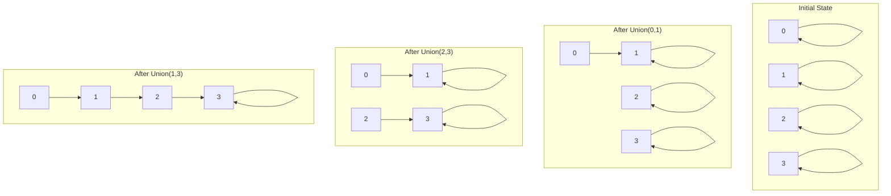
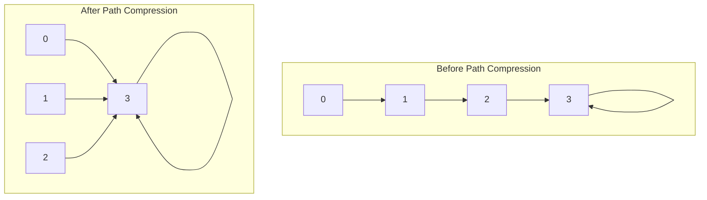
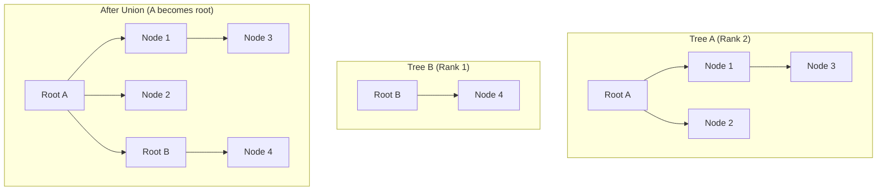

# 🔗 **Union-Find (Disjoint Set Union)**

## 📘 **Theory**

Union-Find, also known as Disjoint Set Union (DSU), is a data structure that efficiently tracks a set of elements partitioned into disjoint subsets. It supports two main operations: finding which subset an element belongs to and uniting two subsets.

### **Why Union-Find Matters**

- **Graph Algorithms**: Used in Kruskal's algorithm for MST
- **Network Connectivity**: Check if nodes are connected
- **Image Processing**: Connected component analysis
- **Social Networks**: Find connected groups of people
- **Database Systems**: Optimize queries with union operations
- **Game Development**: Check if game objects are connected
- **Compiler Design**: Variable equivalence analysis
- **Cryptography**: Key management and grouping

### **Key Concepts**

1. **Disjoint Sets**: Sets with no common elements
2. **Union Operation**: Merge two sets into one
3. **Find Operation**: Find which set an element belongs to
4. **Path Compression**: Optimize find operation
5. **Union by Rank**: Optimize union operation
6. **Connected Components**: Elements in the same set
7. **Cycle Detection**: Detect cycles in undirected graphs
8. **Equivalence Relations**: Elements that are equivalent

### **Operations**

1. **MakeSet**: Create a new set with one element
2. **Find**: Find the representative of a set
3. **Union**: Merge two sets
4. **Connected**: Check if two elements are in the same set
5. **Count**: Count number of disjoint sets
6. **Size**: Get size of a set

### **Common Pitfalls and Best Practices**

- **Path Compression**: Always use path compression for efficiency
- **Union by Rank**: Use union by rank to keep trees balanced
- **Array Bounds**: Ensure array indices are within bounds
- **Initialization**: Properly initialize all elements
- **Memory Management**: Manage memory efficiently
- **Error Handling**: Handle invalid operations gracefully
- **Testing**: Test with various input sizes
- **Performance**: Optimize for your specific use case

## 📊 **Diagrams**

### **Union-Find Structure**



### **Path Compression**



### **Union by Rank**



## 🧩 **Example**

**Scenario**: Implement Union-Find to detect cycles in a graph

**Input**:

- Edges: [(0,1), (1,2), (2,3), (3,0)]
- Number of vertices: 4

**Expected Output**:

- Cycle detected: true
- Connected components: 1
- All vertices are connected

**Step-by-step**:

1. Initialize Union-Find with 4 vertices
2. Process edge (0,1): Union 0 and 1
3. Process edge (1,2): Union 1 and 2
4. Process edge (2,3): Union 2 and 3
5. Process edge (3,0): Check if 3 and 0 are already connected
6. Since they are connected, a cycle is detected

## 💻 **Implementation (Golang)**

```go
package main

import (
    "fmt"
    "math"
)

// UnionFind represents a Union-Find data structure
type UnionFind struct {
    parent []int
    rank   []int
    count  int
}

// NewUnionFind creates a new Union-Find with n elements
func NewUnionFind(n int) *UnionFind {
    parent := make([]int, n)
    rank := make([]int, n)

    for i := 0; i < n; i++ {
        parent[i] = i
        rank[i] = 0
    }

    return &UnionFind{
        parent: parent,
        rank:   rank,
        count:  n,
    }
}

// Find finds the root of the set containing x
func (uf *UnionFind) Find(x int) int {
    if uf.parent[x] != x {
        // Path compression
        uf.parent[x] = uf.Find(uf.parent[x])
    }
    return uf.parent[x]
}

// Union merges the sets containing x and y
func (uf *UnionFind) Union(x, y int) bool {
    rootX := uf.Find(x)
    rootY := uf.Find(y)

    if rootX == rootY {
        return false // Already in the same set
    }

    // Union by rank
    if uf.rank[rootX] < uf.rank[rootY] {
        uf.parent[rootX] = rootY
    } else if uf.rank[rootX] > uf.rank[rootY] {
        uf.parent[rootY] = rootX
    } else {
        uf.parent[rootY] = rootX
        uf.rank[rootX]++
    }

    uf.count--
    return true
}

// Connected checks if x and y are in the same set
func (uf *UnionFind) Connected(x, y int) bool {
    return uf.Find(x) == uf.Find(y)
}

// Count returns the number of disjoint sets
func (uf *UnionFind) Count() int {
    return uf.count
}

// Size returns the size of the set containing x
func (uf *UnionFind) Size(x int) int {
    root := uf.Find(x)
    size := 0
    for i := 0; i < len(uf.parent); i++ {
        if uf.Find(i) == root {
            size++
        }
    }
    return size
}

// GetSets returns all disjoint sets
func (uf *UnionFind) GetSets() map[int][]int {
    sets := make(map[int][]int)

    for i := 0; i < len(uf.parent); i++ {
        root := uf.Find(i)
        sets[root] = append(sets[root], i)
    }

    return sets
}

// PrintStructure prints the current structure
func (uf *UnionFind) PrintStructure() {
    fmt.Println("Union-Find Structure:")
    fmt.Println("Element | Parent | Rank")
    fmt.Println("--------|--------|-----")

    for i := 0; i < len(uf.parent); i++ {
        fmt.Printf("%7d | %6d | %4d\n", i, uf.parent[i], uf.rank[i])
    }

    fmt.Printf("Number of disjoint sets: %d\n", uf.count)
}

// CycleDetector detects cycles in a graph using Union-Find
type CycleDetector struct {
    uf *UnionFind
}

// NewCycleDetector creates a new cycle detector
func NewCycleDetector(vertices int) *CycleDetector {
    return &CycleDetector{
        uf: NewUnionFind(vertices),
    }
}

// AddEdge adds an edge and returns true if it creates a cycle
func (cd *CycleDetector) AddEdge(u, v int) bool {
    if cd.uf.Connected(u, v) {
        return true // Cycle detected
    }

    cd.uf.Union(u, v)
    return false
}

// HasCycle checks if the graph has a cycle
func (cd *CycleDetector) HasCycle() bool {
    return cd.uf.Count() < len(cd.uf.parent)
}

// GetConnectedComponents returns connected components
func (cd *CycleDetector) GetConnectedComponents() map[int][]int {
    return cd.uf.GetSets()
}

// MinimumSpanningTree finds MST using Kruskal's algorithm
type MinimumSpanningTree struct {
    uf *UnionFind
}

// Edge represents an edge in the graph
type Edge struct {
    U      int
    V      int
    Weight int
}

// NewMinimumSpanningTree creates a new MST finder
func NewMinimumSpanningTree(vertices int) *MinimumSpanningTree {
    return &MinimumSpanningTree{
        uf: NewUnionFind(vertices),
    }
}

// FindMST finds the minimum spanning tree using Kruskal's algorithm
func (mst *MinimumSpanningTree) FindMST(edges []Edge) []Edge {
    // Sort edges by weight
    sortedEdges := make([]Edge, len(edges))
    copy(sortedEdges, edges)

    for i := 0; i < len(sortedEdges); i++ {
        for j := i + 1; j < len(sortedEdges); j++ {
            if sortedEdges[i].Weight > sortedEdges[j].Weight {
                sortedEdges[i], sortedEdges[j] = sortedEdges[j], sortedEdges[i]
            }
        }
    }

    var mstEdges []Edge

    for _, edge := range sortedEdges {
        if !mst.uf.Connected(edge.U, edge.V) {
            mst.uf.Union(edge.U, edge.V)
            mstEdges = append(mstEdges, edge)
        }
    }

    return mstEdges
}

// ConnectedComponents finds connected components in a graph
type ConnectedComponents struct {
    uf *UnionFind
}

// NewConnectedComponents creates a new connected components finder
func NewConnectedComponents(vertices int) *ConnectedComponents {
    return &ConnectedComponents{
        uf: NewUnionFind(vertices),
    }
}

// AddEdge adds an edge to the graph
func (cc *ConnectedComponents) AddEdge(u, v int) {
    cc.uf.Union(u, v)
}

// GetComponents returns all connected components
func (cc *ConnectedComponents) GetComponents() map[int][]int {
    return cc.uf.GetSets()
}

// GetComponentCount returns the number of connected components
func (cc *ConnectedComponents) GetComponentCount() int {
    return cc.uf.Count()
}

// IsConnected checks if two vertices are connected
func (cc *ConnectedComponents) IsConnected(u, v int) bool {
    return cc.uf.Connected(u, v)
}

// Example usage
func main() {
    // Test basic Union-Find operations
    fmt.Println("=== Basic Union-Find Operations ===")
    uf := NewUnionFind(5)
    uf.PrintStructure()

    fmt.Println("\nAfter Union(0, 1):")
    uf.Union(0, 1)
    uf.PrintStructure()

    fmt.Println("\nAfter Union(2, 3):")
    uf.Union(2, 3)
    uf.PrintStructure()

    fmt.Println("\nAfter Union(1, 3):")
    uf.Union(1, 3)
    uf.PrintStructure()

    fmt.Printf("Are 0 and 4 connected? %t\n", uf.Connected(0, 4))
    fmt.Printf("Are 0 and 2 connected? %t\n", uf.Connected(0, 2))
    fmt.Printf("Size of set containing 0: %d\n", uf.Size(0))

    // Test cycle detection
    fmt.Println("\n=== Cycle Detection ===")
    cd := NewCycleDetector(4)

    edges := [][]int{{0, 1}, {1, 2}, {2, 3}, {3, 0}}

    for i, edge := range edges {
        u, v := edge[0], edge[1]
        hasCycle := cd.AddEdge(u, v)
        fmt.Printf("Edge %d: (%d, %d) - Cycle: %t\n", i+1, u, v, hasCycle)
    }

    fmt.Printf("Graph has cycle: %t\n", cd.HasCycle())

    // Test minimum spanning tree
    fmt.Println("\n=== Minimum Spanning Tree ===")
    mst := NewMinimumSpanningTree(4)

    graphEdges := []Edge{
        {0, 1, 10},
        {0, 2, 6},
        {0, 3, 5},
        {1, 3, 15},
        {2, 3, 4},
    }

    mstEdges := mst.FindMST(graphEdges)

    fmt.Println("MST Edges:")
    totalWeight := 0
    for _, edge := range mstEdges {
        fmt.Printf("(%d, %d) - Weight: %d\n", edge.U, edge.V, edge.Weight)
        totalWeight += edge.Weight
    }
    fmt.Printf("Total MST Weight: %d\n", totalWeight)

    // Test connected components
    fmt.Println("\n=== Connected Components ===")
    cc := NewConnectedComponents(6)

    componentEdges := [][]int{{0, 1}, {1, 2}, {3, 4}, {5, 5}}

    for _, edge := range componentEdges {
        u, v := edge[0], edge[1]
        cc.AddEdge(u, v)
        fmt.Printf("Added edge (%d, %d)\n", u, v)
    }

    components := cc.GetComponents()
    fmt.Printf("Number of connected components: %d\n", cc.GetComponentCount())

    for root, vertices := range components {
        fmt.Printf("Component with root %d: %v\n", root, vertices)
    }

    // Test with larger graph
    fmt.Println("\n=== Large Graph Test ===")
    largeUF := NewUnionFind(1000)

    // Add random unions
    for i := 0; i < 500; i++ {
        u := i % 1000
        v := (i + 1) % 1000
        largeUF.Union(u, v)
    }

    fmt.Printf("Number of disjoint sets: %d\n", largeUF.Count())
    fmt.Printf("Are 0 and 999 connected? %t\n", largeUF.Connected(0, 999))
    fmt.Printf("Are 0 and 500 connected? %t\n", largeUF.Connected(0, 500))
}
```

## 💻 **Implementation (Node.js)**

```javascript
class UnionFind {
  constructor(n) {
    this.parent = Array.from({ length: n }, (_, i) => i);
    this.rank = new Array(n).fill(0);
    this.count = n;
  }

  find(x) {
    if (this.parent[x] !== x) {
      // Path compression
      this.parent[x] = this.find(this.parent[x]);
    }
    return this.parent[x];
  }

  union(x, y) {
    const rootX = this.find(x);
    const rootY = this.find(y);

    if (rootX === rootY) {
      return false; // Already in the same set
    }

    // Union by rank
    if (this.rank[rootX] < this.rank[rootY]) {
      this.parent[rootX] = rootY;
    } else if (this.rank[rootX] > this.rank[rootY]) {
      this.parent[rootY] = rootX;
    } else {
      this.parent[rootY] = rootX;
      this.rank[rootX]++;
    }

    this.count--;
    return true;
  }

  connected(x, y) {
    return this.find(x) === this.find(y);
  }

  getCount() {
    return this.count;
  }

  getSize(x) {
    const root = this.find(x);
    let size = 0;
    for (let i = 0; i < this.parent.length; i++) {
      if (this.find(i) === root) {
        size++;
      }
    }
    return size;
  }

  getSets() {
    const sets = {};

    for (let i = 0; i < this.parent.length; i++) {
      const root = this.find(i);
      if (!sets[root]) {
        sets[root] = [];
      }
      sets[root].push(i);
    }

    return sets;
  }

  printStructure() {
    console.log("Union-Find Structure:");
    console.log("Element | Parent | Rank");
    console.log("--------|--------|-----");

    for (let i = 0; i < this.parent.length; i++) {
      console.log(
        `${i.toString().padStart(7)} | ${this.parent[i]
          .toString()
          .padStart(6)} | ${this.rank[i].toString().padStart(4)}`
      );
    }

    console.log(`Number of disjoint sets: ${this.count}`);
  }
}

class CycleDetector {
  constructor(vertices) {
    this.uf = new UnionFind(vertices);
  }

  addEdge(u, v) {
    if (this.uf.connected(u, v)) {
      return true; // Cycle detected
    }

    this.uf.union(u, v);
    return false;
  }

  hasCycle() {
    return this.uf.getCount() < this.uf.parent.length;
  }

  getConnectedComponents() {
    return this.uf.getSets();
  }
}

class Edge {
  constructor(u, v, weight) {
    this.u = u;
    this.v = v;
    this.weight = weight;
  }
}

class MinimumSpanningTree {
  constructor(vertices) {
    this.uf = new UnionFind(vertices);
  }

  findMST(edges) {
    // Sort edges by weight
    const sortedEdges = [...edges].sort((a, b) => a.weight - b.weight);
    const mstEdges = [];

    for (const edge of sortedEdges) {
      if (!this.uf.connected(edge.u, edge.v)) {
        this.uf.union(edge.u, edge.v);
        mstEdges.push(edge);
      }
    }

    return mstEdges;
  }
}

class ConnectedComponents {
  constructor(vertices) {
    this.uf = new UnionFind(vertices);
  }

  addEdge(u, v) {
    this.uf.union(u, v);
  }

  getComponents() {
    return this.uf.getSets();
  }

  getComponentCount() {
    return this.uf.getCount();
  }

  isConnected(u, v) {
    return this.uf.connected(u, v);
  }
}

// Example usage
function main() {
  // Test basic Union-Find operations
  console.log("=== Basic Union-Find Operations ===");
  const uf = new UnionFind(5);
  uf.printStructure();

  console.log("\nAfter Union(0, 1):");
  uf.union(0, 1);
  uf.printStructure();

  console.log("\nAfter Union(2, 3):");
  uf.union(2, 3);
  uf.printStructure();

  console.log("\nAfter Union(1, 3):");
  uf.union(1, 3);
  uf.printStructure();

  console.log(`Are 0 and 4 connected? ${uf.connected(0, 4)}`);
  console.log(`Are 0 and 2 connected? ${uf.connected(0, 2)}`);
  console.log(`Size of set containing 0: ${uf.getSize(0)}`);

  // Test cycle detection
  console.log("\n=== Cycle Detection ===");
  const cd = new CycleDetector(4);

  const edges = [
    [0, 1],
    [1, 2],
    [2, 3],
    [3, 0],
  ];

  for (let i = 0; i < edges.length; i++) {
    const [u, v] = edges[i];
    const hasCycle = cd.addEdge(u, v);
    console.log(`Edge ${i + 1}: (${u}, ${v}) - Cycle: ${hasCycle}`);
  }

  console.log(`Graph has cycle: ${cd.hasCycle()}`);

  // Test minimum spanning tree
  console.log("\n=== Minimum Spanning Tree ===");
  const mst = new MinimumSpanningTree(4);

  const graphEdges = [
    new Edge(0, 1, 10),
    new Edge(0, 2, 6),
    new Edge(0, 3, 5),
    new Edge(1, 3, 15),
    new Edge(2, 3, 4),
  ];

  const mstEdges = mst.findMST(graphEdges);

  console.log("MST Edges:");
  let totalWeight = 0;
  for (const edge of mstEdges) {
    console.log(`(${edge.u}, ${edge.v}) - Weight: ${edge.weight}`);
    totalWeight += edge.weight;
  }
  console.log(`Total MST Weight: ${totalWeight}`);

  // Test connected components
  console.log("\n=== Connected Components ===");
  const cc = new ConnectedComponents(6);

  const componentEdges = [
    [0, 1],
    [1, 2],
    [3, 4],
    [5, 5],
  ];

  for (const [u, v] of componentEdges) {
    cc.addEdge(u, v);
    console.log(`Added edge (${u}, ${v})`);
  }

  const components = cc.getComponents();
  console.log(`Number of connected components: ${cc.getComponentCount()}`);

  for (const [root, vertices] of Object.entries(components)) {
    console.log(`Component with root ${root}: [${vertices.join(", ")}]`);
  }

  // Test with larger graph
  console.log("\n=== Large Graph Test ===");
  const largeUF = new UnionFind(1000);

  // Add random unions
  for (let i = 0; i < 500; i++) {
    const u = i % 1000;
    const v = (i + 1) % 1000;
    largeUF.union(u, v);
  }

  console.log(`Number of disjoint sets: ${largeUF.getCount()}`);
  console.log(`Are 0 and 999 connected? ${largeUF.connected(0, 999)}`);
  console.log(`Are 0 and 500 connected? ${largeUF.connected(0, 500)}`);
}

// Run the example
main();
```

## ⏱ **Complexity Analysis**

### **Time Complexity**

- **Find**: O(α(n)) where α is the inverse Ackermann function (practically constant)
- **Union**: O(α(n)) where α is the inverse Ackermann function
- **Connected**: O(α(n)) where α is the inverse Ackermann function
- **Count**: O(1)
- **Size**: O(n) where n is number of elements

### **Space Complexity**

- **Parent Array**: O(n) where n is number of elements
- **Rank Array**: O(n) where n is number of elements
- **Overall**: O(n) where n is number of elements

## 🚀 **Optimal Solution**

The optimal Union-Find solution includes:

1. **Path Compression**: Always use path compression for efficiency
2. **Union by Rank**: Use union by rank to keep trees balanced
3. **Efficient Implementation**: Use arrays for better cache performance
4. **Error Handling**: Handle invalid operations gracefully
5. **Memory Management**: Manage memory efficiently
6. **Testing**: Test with various input sizes and edge cases
7. **Documentation**: Document the implementation clearly
8. **Optimization**: Optimize for your specific use case

### **Production Considerations**

- Use path compression and union by rank for efficiency
- Handle edge cases and invalid operations
- Use appropriate data types for your use case
- Test thoroughly with various inputs
- Consider memory constraints
- Use efficient data structures
- Implement proper error handling
- Consider performance implications

## ❓ **Follow-up Questions**

### **How would this scale with X?**

- **Large Graphs**: Use efficient data structures and algorithms
- **Frequent Operations**: Use path compression and union by rank
- **Memory Constraints**: Use compressed representations

### **How can we optimize further if Y changes?**

- **Performance Requirements**: Use optimized implementations
- **Memory Constraints**: Use compressed data structures
- **Specific Use Cases**: Use specialized algorithms

### **What trade-offs exist in different approaches?**

- **Time vs Space**: Faster operations vs more memory usage
- **Simplicity vs Performance**: Simple implementation vs optimized code
- **General vs Specific**: General-purpose vs specialized solutions
