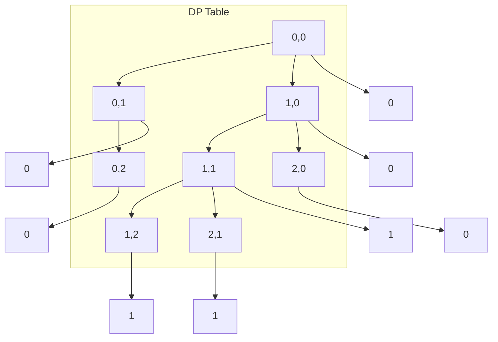

---
# Auto-generated front matter
Title: Longest Common Subsequence
LastUpdated: 2025-11-06T20:45:58.747406
Tags: []
Status: draft
---

# 🔗 **Longest Common Subsequence (LCS)**

## 📘 **Theory**

The Longest Common Subsequence (LCS) problem is a classic dynamic programming problem that finds the longest subsequence common to two or more sequences. A subsequence is a sequence that appears in the same relative order but not necessarily contiguous.

### **Why LCS Matters**

- **String Similarity**: Measure similarity between two strings
- **Version Control**: Find differences between file versions
- **Bioinformatics**: Compare DNA sequences and protein structures
- **Text Processing**: Find common patterns in documents
- **Data Analysis**: Identify common trends in time series data
- **Algorithm Foundation**: Basis for many other DP problems

### **Key Concepts**

1. **Subsequence**: A sequence that can be derived from another sequence by deleting some or no elements
2. **Common Subsequence**: A subsequence that appears in both sequences
3. **Optimal Substructure**: The LCS of two sequences contains the LCS of their prefixes
4. **Overlapping Subproblems**: The same subproblems are solved multiple times
5. **Memoization**: Store results of subproblems to avoid recomputation
6. **Tabulation**: Build solution bottom-up using a table

### **Common Pitfalls and Best Practices**

- **Index Confusion**: Be careful with 0-based vs 1-based indexing
- **Base Cases**: Handle empty strings and single characters correctly
- **Space Optimization**: Use rolling array for space-efficient solutions
- **Path Reconstruction**: Track the actual LCS, not just its length
- **Edge Cases**: Handle identical strings, no common subsequence, etc.
- **Memory Management**: Avoid stack overflow in recursive solutions

## 📊 **Diagrams**

### **LCS Problem Visualization**

```mermaid
graph TD
    A[String 1: "ABCDGH"] --> B[Subsequences]
    C[String 2: "AEDFHR"] --> D[Subsequences]

    B --> E[ABC, ABD, ACD, ADG, etc.]
    D --> F[AED, AFH, ADR, etc.]

    E --> G[Common Subsequences]
    F --> G
    G --> H[AD, A, D, etc.]
    H --> I[Longest: AD]
```

### **DP Table Construction**



### **Recursive Tree with Memoization**

```mermaid
graph TD
    A[LCS(0,0)] --> B[LCS(1,0)]
    A --> C[LCS(0,1)]
    A --> D[LCS(1,1)]

    B --> E[LCS(2,0)]
    B --> F[LCS(2,1)]
    C --> G[LCS(1,1)]
    C --> H[LCS(1,2)]
    D --> I[LCS(2,1)]
    D --> J[LCS(2,2)]

    E --> E1[Memoized]
    F --> F1[Memoized]
    G --> G1[Memoized]
    H --> H1[Memoized]
    I --> I1[Memoized]
    J --> J1[Memoized]
```

## 🧩 **Example**

**Scenario**: Find the longest common subsequence between "ABCDGH" and "AEDFHR"

**Input**:

- String 1: "ABCDGH"
- String 2: "AEDFHR"

**Expected Output**:

- Length: 3
- LCS: "ADH"

**Step-by-step**:

1. Create DP table of size (m+1) × (n+1)
2. Fill base cases (empty strings)
3. For each cell, if characters match, add 1 to diagonal value
4. If characters don't match, take maximum of left and top values
5. Backtrack to reconstruct the actual LCS

## 💻 **Implementation (Golang)**

```go
package main

import (
    "fmt"
    "strings"
)

// LCS solver with different approaches
type LCSSolver struct {
    memo map[string]int
}

func NewLCSSolver() *LCSSolver {
    return &LCSSolver{
        memo: make(map[string]int),
    }
}

// Recursive solution with memoization
func (lcs *LCSSolver) LCSRecursive(s1, s2 string, i, j int) int {
    // Base cases
    if i == 0 || j == 0 {
        return 0
    }

    // Check memo
    key := fmt.Sprintf("%d,%d", i, j)
    if val, exists := lcs.memo[key]; exists {
        return val
    }

    var result int

    // If characters match
    if s1[i-1] == s2[j-1] {
        result = 1 + lcs.LCSRecursive(s1, s2, i-1, j-1)
    } else {
        // Take maximum of two possibilities
        result = max(
            lcs.LCSRecursive(s1, s2, i-1, j),
            lcs.LCSRecursive(s1, s2, i, j-1),
        )
    }

    // Memoize result
    lcs.memo[key] = result
    return result
}

// Iterative solution with 2D DP table
func (lcs *LCSSolver) LCSIterative(s1, s2 string) (int, [][]int) {
    m, n := len(s1), len(s2)

    // Create DP table
    dp := make([][]int, m+1)
    for i := range dp {
        dp[i] = make([]int, n+1)
    }

    // Fill DP table
    for i := 1; i <= m; i++ {
        for j := 1; j <= n; j++ {
            if s1[i-1] == s2[j-1] {
                dp[i][j] = 1 + dp[i-1][j-1]
            } else {
                dp[i][j] = max(dp[i-1][j], dp[i][j-1])
            }
        }
    }

    return dp[m][n], dp
}

// Space-optimized solution using rolling array
func (lcs *LCSSolver) LCSOptimized(s1, s2 string) int {
    m, n := len(s1), len(s2)

    // Use shorter string for the inner loop
    if m < n {
        s1, s2 = s2, s1
        m, n = n, m
    }

    // Use two rows instead of full table
    prev := make([]int, n+1)
    curr := make([]int, n+1)

    for i := 1; i <= m; i++ {
        for j := 1; j <= n; j++ {
            if s1[i-1] == s2[j-1] {
                curr[j] = 1 + prev[j-1]
            } else {
                curr[j] = max(prev[j], curr[j-1])
            }
        }
        // Swap arrays
        prev, curr = curr, prev
    }

    return prev[n]
}

// Reconstruct the actual LCS
func (lcs *LCSSolver) ReconstructLCS(s1, s2 string, dp [][]int) string {
    m, n := len(s1), len(s2)
    var result strings.Builder

    i, j := m, n

    // Backtrack through DP table
    for i > 0 && j > 0 {
        if s1[i-1] == s2[j-1] {
            result.WriteByte(s1[i-1])
            i--
            j--
        } else if dp[i-1][j] > dp[i][j-1] {
            i--
        } else {
            j--
        }
    }

    // Reverse the result
    lcsStr := result.String()
    return reverseString(lcsStr)
}

// Find all possible LCS sequences
func (lcs *LCSSolver) FindAllLCS(s1, s2 string, dp [][]int) []string {
    m, n := len(s1), len(s2)
    var result []string

    var backtrack func(int, int, string)
    backtrack = func(i, j int, current string) {
        if i == 0 || j == 0 {
            if len(current) > 0 {
                result = append(result, reverseString(current))
            }
            return
        }

        if s1[i-1] == s2[j-1] {
            backtrack(i-1, j-1, current+string(s1[i-1]))
        } else if dp[i-1][j] > dp[i][j-1] {
            backtrack(i-1, j, current)
        } else if dp[i][j-1] > dp[i-1][j] {
            backtrack(i, j-1, current)
        } else {
            // Both paths are equal, explore both
            backtrack(i-1, j, current)
            backtrack(i, j-1, current)
        }
    }

    backtrack(m, n, "")
    return result
}

// LCS with multiple strings
func (lcs *LCSSolver) LCSMultiple(strings []string) int {
    if len(strings) < 2 {
        return 0
    }

    // Start with first two strings
    result := lcs.LCSOptimized(strings[0], strings[1])

    // Find LCS with remaining strings
    for i := 2; i < len(strings); i++ {
        // This is a simplified approach
        // For multiple strings, we need a more complex algorithm
        result = min(result, lcs.LCSOptimized(strings[0], strings[i]))
    }

    return result
}

// LCS with constraints (e.g., maximum length)
func (lcs *LCSSolver) LCSWithConstraints(s1, s2 string, maxLength int) int {
    m, n := len(s1), len(s2)

    // Create DP table with constraint
    dp := make([][]int, m+1)
    for i := range dp {
        dp[i] = make([]int, n+1)
    }

    for i := 1; i <= m; i++ {
        for j := 1; j <= n; j++ {
            if s1[i-1] == s2[j-1] {
                dp[i][j] = 1 + dp[i-1][j-1]
            } else {
                dp[i][j] = max(dp[i-1][j], dp[i][j-1])
            }

            // Apply constraint
            if dp[i][j] > maxLength {
                dp[i][j] = maxLength
            }
        }
    }

    return dp[m][n]
}

// LCS with weighted characters
func (lcs *LCSSolver) LCSWeighted(s1, s2 string, weights map[byte]int) int {
    m, n := len(s1), len(s2)

    dp := make([][]int, m+1)
    for i := range dp {
        dp[i] = make([]int, n+1)
    }

    for i := 1; i <= m; i++ {
        for j := 1; j <= n; j++ {
            if s1[i-1] == s2[j-1] {
                weight := weights[s1[i-1]]
                if weight == 0 {
                    weight = 1 // Default weight
                }
                dp[i][j] = weight + dp[i-1][j-1]
            } else {
                dp[i][j] = max(dp[i-1][j], dp[i][j-1])
            }
        }
    }

    return dp[m][n]
}

// Helper functions
func max(a, b int) int {
    if a > b {
        return a
    }
    return b
}

func min(a, b int) int {
    if a < b {
        return a
    }
    return b
}

func reverseString(s string) string {
    runes := []rune(s)
    for i, j := 0, len(runes)-1; i < j; i, j = i+1, j-1 {
        runes[i], runes[j] = runes[j], runes[i]
    }
    return string(runes)
}

// Performance testing
func (lcs *LCSSolver) PerformanceTest(s1, s2 string) {
    fmt.Println("=== Performance Test ===")

    // Test recursive with memoization
    start := time.Now()
    result1 := lcs.LCSRecursive(s1, s2, len(s1), len(s2))
    time1 := time.Since(start)
    fmt.Printf("Recursive with memoization: %d (Time: %v)\n", result1, time1)

    // Test iterative
    start = time.Now()
    result2, _ := lcs.LCSIterative(s1, s2)
    time2 := time.Since(start)
    fmt.Printf("Iterative: %d (Time: %v)\n", result2, time2)

    // Test optimized
    start = time.Now()
    result3 := lcs.LCSOptimized(s1, s2)
    time3 := time.Since(start)
    fmt.Printf("Optimized: %d (Time: %v)\n", result3, time3)

    // Verify all methods give same result
    if result1 == result2 && result2 == result3 {
        fmt.Println("✓ All methods produce the same result")
    } else {
        fmt.Println("✗ Methods produce different results")
    }
}

// Example usage
func main() {
    // Create LCS solver
    solver := NewLCSSolver()

    // Test cases
    testCases := []struct {
        s1, s2 string
        expected int
    }{
        {"ABCDGH", "AEDFHR", 3},
        {"AGGTAB", "GXTXAYB", 4},
        {"ABCDEF", "ABCDEF", 6},
        {"ABCDEF", "FEDCBA", 1},
        {"", "ABCD", 0},
        {"ABCD", "", 0},
        {"A", "A", 1},
        {"A", "B", 0},
    }

    fmt.Println("=== LCS Test Cases ===")
    for i, tc := range testCases {
        fmt.Printf("\nTest Case %d:\n", i+1)
        fmt.Printf("String 1: %q\n", tc.s1)
        fmt.Printf("String 2: %q\n", tc.s2)

        // Test iterative solution
        length, dp := solver.LCSIterative(tc.s1, tc.s2)
        fmt.Printf("LCS Length: %d (Expected: %d)\n", length, tc.expected)

        if length == tc.expected {
            fmt.Println("✓ Test passed")
        } else {
            fmt.Println("✗ Test failed")
        }

        // Reconstruct LCS
        if length > 0 {
            lcs := solver.ReconstructLCS(tc.s1, tc.s2, dp)
            fmt.Printf("LCS: %q\n", lcs)
        }
    }

    // Test with larger strings
    fmt.Println("\n=== Large String Test ===")
    s1 := "ABCDEFGHIJKLMNOPQRSTUVWXYZ"
    s2 := "ZYXWVUTSRQPONMLKJIHGFEDCBA"

    length, dp := solver.LCSIterative(s1, s2)
    fmt.Printf("String 1: %q\n", s1)
    fmt.Printf("String 2: %q\n", s2)
    fmt.Printf("LCS Length: %d\n", length)

    if length > 0 {
        lcs := solver.ReconstructLCS(s1, s2, dp)
        fmt.Printf("LCS: %q\n", lcs)
    }

    // Test all possible LCS
    fmt.Println("\n=== All Possible LCS ===")
    s1 = "ABC"
    s2 = "AC"
    length, dp = solver.LCSIterative(s1, s2)
    allLCS := solver.FindAllLCS(s1, s2, dp)
    fmt.Printf("String 1: %q\n", s1)
    fmt.Printf("String 2: %q\n", s2)
    fmt.Printf("All LCS: %v\n", allLCS)

    // Test weighted LCS
    fmt.Println("\n=== Weighted LCS ===")
    weights := map[byte]int{
        'A': 2,
        'B': 3,
        'C': 1,
        'D': 4,
    }
    s1 = "ABCD"
    s2 = "ACD"
    weightedLength := solver.LCSWeighted(s1, s2, weights)
    fmt.Printf("String 1: %q\n", s1)
    fmt.Printf("String 2: %q\n", s2)
    fmt.Printf("Weighted LCS: %d\n", weightedLength)

    // Performance test
    fmt.Println("\n=== Performance Test ===")
    s1 = "ABCDEFGHIJKLMNOPQRSTUVWXYZ"
    s2 = "ZYXWVUTSRQPONMLKJIHGFEDCBA"
    solver.PerformanceTest(s1, s2)
}
```

## 💻 **Implementation (Node.js)**

```javascript
// LCS solver with different approaches
class LCSSolver {
  constructor() {
    this.memo = new Map();
  }

  // Recursive solution with memoization
  lcsRecursive(s1, s2, i, j) {
    // Base cases
    if (i === 0 || j === 0) {
      return 0;
    }

    // Check memo
    const key = `${i},${j}`;
    if (this.memo.has(key)) {
      return this.memo.get(key);
    }

    let result;

    // If characters match
    if (s1[i - 1] === s2[j - 1]) {
      result = 1 + this.lcsRecursive(s1, s2, i - 1, j - 1);
    } else {
      // Take maximum of two possibilities
      result = Math.max(
        this.lcsRecursive(s1, s2, i - 1, j),
        this.lcsRecursive(s1, s2, i, j - 1)
      );
    }

    // Memoize result
    this.memo.set(key, result);
    return result;
  }

  // Iterative solution with 2D DP table
  lcsIterative(s1, s2) {
    const m = s1.length;
    const n = s2.length;

    // Create DP table
    const dp = Array(m + 1)
      .fill()
      .map(() => Array(n + 1).fill(0));

    // Fill DP table
    for (let i = 1; i <= m; i++) {
      for (let j = 1; j <= n; j++) {
        if (s1[i - 1] === s2[j - 1]) {
          dp[i][j] = 1 + dp[i - 1][j - 1];
        } else {
          dp[i][j] = Math.max(dp[i - 1][j], dp[i][j - 1]);
        }
      }
    }

    return { length: dp[m][n], dp };
  }

  // Space-optimized solution using rolling array
  lcsOptimized(s1, s2) {
    let m = s1.length;
    let n = s2.length;

    // Use shorter string for the inner loop
    if (m < n) {
      [s1, s2] = [s2, s1];
      [m, n] = [n, m];
    }

    // Use two rows instead of full table
    let prev = Array(n + 1).fill(0);
    let curr = Array(n + 1).fill(0);

    for (let i = 1; i <= m; i++) {
      for (let j = 1; j <= n; j++) {
        if (s1[i - 1] === s2[j - 1]) {
          curr[j] = 1 + prev[j - 1];
        } else {
          curr[j] = Math.max(prev[j], curr[j - 1]);
        }
      }
      // Swap arrays
      [prev, curr] = [curr, prev];
    }

    return prev[n];
  }

  // Reconstruct the actual LCS
  reconstructLCS(s1, s2, dp) {
    const m = s1.length;
    const n = s2.length;
    let result = "";

    let i = m;
    let j = n;

    // Backtrack through DP table
    while (i > 0 && j > 0) {
      if (s1[i - 1] === s2[j - 1]) {
        result = s1[i - 1] + result;
        i--;
        j--;
      } else if (dp[i - 1][j] > dp[i][j - 1]) {
        i--;
      } else {
        j--;
      }
    }

    return result;
  }

  // Find all possible LCS sequences
  findAllLCS(s1, s2, dp) {
    const m = s1.length;
    const n = s2.length;
    const result = [];

    const backtrack = (i, j, current) => {
      if (i === 0 || j === 0) {
        if (current.length > 0) {
          result.push(current.split("").reverse().join(""));
        }
        return;
      }

      if (s1[i - 1] === s2[j - 1]) {
        backtrack(i - 1, j - 1, current + s1[i - 1]);
      } else if (dp[i - 1][j] > dp[i][j - 1]) {
        backtrack(i - 1, j, current);
      } else if (dp[i][j - 1] > dp[i - 1][j]) {
        backtrack(i, j - 1, current);
      } else {
        // Both paths are equal, explore both
        backtrack(i - 1, j, current);
        backtrack(i, j - 1, current);
      }
    };

    backtrack(m, n, "");
    return result;
  }

  // LCS with multiple strings
  lcsMultiple(strings) {
    if (strings.length < 2) {
      return 0;
    }

    // Start with first two strings
    let result = this.lcsOptimized(strings[0], strings[1]);

    // Find LCS with remaining strings
    for (let i = 2; i < strings.length; i++) {
      // This is a simplified approach
      // For multiple strings, we need a more complex algorithm
      result = Math.min(result, this.lcsOptimized(strings[0], strings[i]));
    }

    return result;
  }

  // LCS with constraints (e.g., maximum length)
  lcsWithConstraints(s1, s2, maxLength) {
    const m = s1.length;
    const n = s2.length;

    // Create DP table with constraint
    const dp = Array(m + 1)
      .fill()
      .map(() => Array(n + 1).fill(0));

    for (let i = 1; i <= m; i++) {
      for (let j = 1; j <= n; j++) {
        if (s1[i - 1] === s2[j - 1]) {
          dp[i][j] = 1 + dp[i - 1][j - 1];
        } else {
          dp[i][j] = Math.max(dp[i - 1][j], dp[i][j - 1]);
        }

        // Apply constraint
        if (dp[i][j] > maxLength) {
          dp[i][j] = maxLength;
        }
      }
    }

    return dp[m][n];
  }

  // LCS with weighted characters
  lcsWeighted(s1, s2, weights) {
    const m = s1.length;
    const n = s2.length;

    const dp = Array(m + 1)
      .fill()
      .map(() => Array(n + 1).fill(0));

    for (let i = 1; i <= m; i++) {
      for (let j = 1; j <= n; j++) {
        if (s1[i - 1] === s2[j - 1]) {
          const weight = weights[s1[i - 1]] || 1; // Default weight
          dp[i][j] = weight + dp[i - 1][j - 1];
        } else {
          dp[i][j] = Math.max(dp[i - 1][j], dp[i][j - 1]);
        }
      }
    }

    return dp[m][n];
  }

  // Performance testing
  performanceTest(s1, s2) {
    console.log("=== Performance Test ===");

    // Test recursive with memoization
    const start1 = Date.now();
    const result1 = this.lcsRecursive(s1, s2, s1.length, s2.length);
    const time1 = Date.now() - start1;
    console.log(`Recursive with memoization: ${result1} (Time: ${time1}ms)`);

    // Test iterative
    const start2 = Date.now();
    const result2 = this.lcsIterative(s1, s2);
    const time2 = Date.now() - start2;
    console.log(`Iterative: ${result2.length} (Time: ${time2}ms)`);

    // Test optimized
    const start3 = Date.now();
    const result3 = this.lcsOptimized(s1, s2);
    const time3 = Date.now() - start3;
    console.log(`Optimized: ${result3} (Time: ${time3}ms)`);

    // Verify all methods give same result
    if (result1 === result2.length && result2.length === result3) {
      console.log("✓ All methods produce the same result");
    } else {
      console.log("✗ Methods produce different results");
    }
  }
}

// Example usage
function main() {
  // Create LCS solver
  const solver = new LCSSolver();

  // Test cases
  const testCases = [
    { s1: "ABCDGH", s2: "AEDFHR", expected: 3 },
    { s1: "AGGTAB", s2: "GXTXAYB", expected: 4 },
    { s1: "ABCDEF", s2: "ABCDEF", expected: 6 },
    { s1: "ABCDEF", s2: "FEDCBA", expected: 1 },
    { s1: "", s2: "ABCD", expected: 0 },
    { s1: "ABCD", s2: "", expected: 0 },
    { s1: "A", s2: "A", expected: 1 },
    { s1: "A", s2: "B", expected: 0 },
  ];

  console.log("=== LCS Test Cases ===");
  testCases.forEach((tc, i) => {
    console.log(`\nTest Case ${i + 1}:`);
    console.log(`String 1: "${tc.s1}"`);
    console.log(`String 2: "${tc.s2}"`);

    // Test iterative solution
    const { length, dp } = solver.lcsIterative(tc.s1, tc.s2);
    console.log(`LCS Length: ${length} (Expected: ${tc.expected})`);

    if (length === tc.expected) {
      console.log("✓ Test passed");
    } else {
      console.log("✗ Test failed");
    }

    // Reconstruct LCS
    if (length > 0) {
      const lcs = solver.reconstructLCS(tc.s1, tc.s2, dp);
      console.log(`LCS: "${lcs}"`);
    }
  });

  // Test with larger strings
  console.log("\n=== Large String Test ===");
  const s1 = "ABCDEFGHIJKLMNOPQRSTUVWXYZ";
  const s2 = "ZYXWVUTSRQPONMLKJIHGFEDCBA";

  const { length, dp } = solver.lcsIterative(s1, s2);
  console.log(`String 1: "${s1}"`);
  console.log(`String 2: "${s2}"`);
  console.log(`LCS Length: ${length}`);

  if (length > 0) {
    const lcs = solver.reconstructLCS(s1, s2, dp);
    console.log(`LCS: "${lcs}"`);
  }

  // Test all possible LCS
  console.log("\n=== All Possible LCS ===");
  const s1_ = "ABC";
  const s2_ = "AC";
  const { length: length_, dp: dp_ } = solver.lcsIterative(s1_, s2_);
  const allLCS = solver.findAllLCS(s1_, s2_, dp_);
  console.log(`String 1: "${s1_}"`);
  console.log(`String 2: "${s2_}"`);
  console.log(`All LCS: [${allLCS.map((s) => `"${s}"`).join(", ")}]`);

  // Test weighted LCS
  console.log("\n=== Weighted LCS ===");
  const weights = {
    A: 2,
    B: 3,
    C: 1,
    D: 4,
  };
  const s1__ = "ABCD";
  const s2__ = "ACD";
  const weightedLength = solver.lcsWeighted(s1__, s2__, weights);
  console.log(`String 1: "${s1__}"`);
  console.log(`String 2: "${s2__}"`);
  console.log(`Weighted LCS: ${weightedLength}`);

  // Performance test
  console.log("\n=== Performance Test ===");
  const s1___ = "ABCDEFGHIJKLMNOPQRSTUVWXYZ";
  const s2___ = "ZYXWVUTSRQPONMLKJIHGFEDCBA";
  solver.performanceTest(s1___, s2___);
}

// Run the example
main();
```

## ⏱ **Complexity Analysis**

### **Time Complexity**

- **Recursive**: O(2^(m+n)) without memoization, O(m×n) with memoization
- **Iterative**: O(m×n) where m and n are lengths of strings
- **Optimized**: O(m×n) time, O(min(m,n)) space
- **Reconstruction**: O(m+n) for backtracking

### **Space Complexity**

- **Recursive with memoization**: O(m×n) for memo table
- **Iterative**: O(m×n) for DP table
- **Optimized**: O(min(m,n)) using rolling array
- **Reconstruction**: O(m+n) for result string

## 🚀 **Optimal Solution**

The optimal LCS solution includes:

1. **Algorithm Choice**: Use iterative DP for most cases
2. **Space Optimization**: Use rolling array for large strings
3. **Memoization**: Use for recursive solutions to avoid recomputation
4. **Path Reconstruction**: Track actual LCS, not just length
5. **Edge Cases**: Handle empty strings and single characters
6. **Multiple Strings**: Use specialized algorithms for 3+ strings

### **Production Considerations**

- Use iterative approach for large strings to avoid stack overflow
- Implement space optimization for memory-constrained environments
- Add input validation and error handling
- Consider using specialized libraries for very large strings
- Implement parallel processing for multiple string comparisons

## ❓ **Follow-up Questions**

### **How would this scale with X?**

- **Very Long Strings**: Use space-optimized version and consider parallel processing
- **Multiple Strings**: Use specialized algorithms like Hirschberg's algorithm
- **Real-time Processing**: Use streaming algorithms for continuous data

### **How can we optimize further if Y changes?**

- **Memory Constraints**: Use rolling array and external storage
- **Time Constraints**: Use parallel processing and optimized data structures
- **Accuracy Requirements**: Use more precise algorithms for specific use cases

### **What trade-offs exist in different approaches?**

- **Recursive vs Iterative**: Readability vs Performance
- **Space vs Time**: Memory usage vs Computation time
- **Accuracy vs Speed**: Precise results vs Fast approximation
