---
# Auto-generated front matter
Title: Dijkstra Algorithm
LastUpdated: 2025-11-06T20:45:58.741422
Tags: []
Status: draft
---

# 🚀 **Dijkstra's Algorithm**

## 📘 **Theory**

Dijkstra's algorithm is a graph search algorithm that finds the shortest path between nodes in a weighted graph. It's particularly useful for finding the shortest path from a single source vertex to all other vertices in the graph.

### **Why Dijkstra's Algorithm Matters**

- **Shortest Path**: Finds the optimal path between two points
- **Network Routing**: Used in computer networks for packet routing
- **GPS Navigation**: Powers GPS systems for route planning
- **Game Development**: Used for AI pathfinding in games
- **Resource Optimization**: Optimizes resource allocation in systems
- **Social Networks**: Finds shortest connections between people
- **Transportation**: Optimizes delivery routes and logistics

### **Key Concepts**

1. **Weighted Graph**: Graph with edge weights representing costs
2. **Priority Queue**: Data structure for efficient minimum extraction
3. **Relaxation**: Process of updating shortest path estimates
4. **Greedy Approach**: Always chooses the locally optimal choice
5. **Single Source**: Finds shortest paths from one source to all destinations
6. **Non-negative Weights**: Only works with non-negative edge weights
7. **Optimal Substructure**: Optimal solution contains optimal sub-solutions

### **Algorithm Steps**

1. Initialize distances to all vertices as infinite
2. Set distance to source vertex as 0
3. Add all vertices to priority queue
4. While queue is not empty:
   - Extract vertex with minimum distance
   - For each neighbor of current vertex:
     - Calculate new distance through current vertex
     - If new distance is shorter, update it
5. Return shortest distances to all vertices

### **Common Pitfalls and Best Practices**

- **Negative Weights**: Algorithm fails with negative edge weights
- **Priority Queue**: Use efficient priority queue implementation
- **Relaxation**: Always check if new path is shorter
- **Visited Vertices**: Mark vertices as visited to avoid reprocessing
- **Edge Cases**: Handle disconnected graphs and single vertex graphs
- **Memory Management**: Properly manage priority queue memory
- **Performance**: Use appropriate data structures for efficiency

## 📊 **Diagrams**

### **Graph Representation**


### **Algorithm Visualization**

```mermaid
graph TD
    subgraph "Step 1: Initialize"
        A1[A: 0]
        B1[B: ∞]
        C1[C: ∞]
        D1[D: ∞]
        E1[E: ∞]
        F1[F: ∞]
    end

    subgraph "Step 2: Process A"
        A2[A: 0 ✓]
        B2[B: 4]
        C2[C: 2]
        D2[D: ∞]
        E2[E: ∞]
        F2[F: ∞]
    end

    subgraph "Step 3: Process C"
        A3[A: 0 ✓]
        B3[B: 4]
        C3[C: 2 ✓]
        D3[D: 10]
        E3[E: ∞]
        F3[F: 12]
    end
```



### **Call Stack Diagram**

```
dijkstra(graph, source)
├── initializeDistances()
├── createPriorityQueue()
├── while (!queue.isEmpty())
│   ├── current = queue.extractMin()
│   ├── for each neighbor of current
│   │   ├── newDistance = current.distance + edge.weight
│   │   └── if (newDistance < neighbor.distance)
│   │       ├── neighbor.distance = newDistance
│   │       └── queue.update(neighbor)
│   └── mark current as visited
└── return distances
```

## 🧩 **Example**

**Scenario**: Find shortest path from A to F in a weighted graph

**Input**:

```
Graph: A->B(4), A->C(2), B->D(1), B->E(5), C->D(8), C->F(10), D->E(2), E->F(3)
Source: A
```

**Expected Output**:

```
Shortest distances from A:
A: 0
B: 4
C: 2
D: 5
E: 7
F: 10
```

**Step-by-step**:

1. Initialize distances: A=0, others=∞
2. Process A: Update B=4, C=2
3. Process C: Update D=10, F=12
4. Process B: Update D=5, E=9
5. Process D: Update E=7
6. Process E: Update F=10
7. Process F: No updates needed

## 💻 **Implementation (Golang)**

```go
package main

import (
    "container/heap"
    "fmt"
    "math"
)

// Edge represents an edge in the graph
type Edge struct {
    To     int
    Weight int
}

// Graph represents a weighted graph
type Graph struct {
    Vertices int
    Edges    [][]Edge
}

// NewGraph creates a new graph
func NewGraph(vertices int) *Graph {
    return &Graph{
        Vertices: vertices,
        Edges:    make([][]Edge, vertices),
    }
}

// AddEdge adds an edge to the graph
func (g *Graph) AddEdge(from, to, weight int) {
    g.Edges[from] = append(g.Edges[from], Edge{To: to, Weight: weight})
}

// DijkstraResult represents the result of Dijkstra's algorithm
type DijkstraResult struct {
    Distances []int
    Previous  []int
    Paths     [][]int
}

// PriorityQueueItem represents an item in the priority queue
type PriorityQueueItem struct {
    Vertex   int
    Distance int
    Index    int
}

// PriorityQueue represents a priority queue
type PriorityQueue []*PriorityQueueItem

func (pq PriorityQueue) Len() int { return len(pq) }

func (pq PriorityQueue) Less(i, j int) bool {
    return pq[i].Distance < pq[j].Distance
}

func (pq PriorityQueue) Swap(i, j int) {
    pq[i], pq[j] = pq[j], pq[i]
    pq[i].Index = i
    pq[j].Index = j
}

func (pq *PriorityQueue) Push(x interface{}) {
    n := len(*pq)
    item := x.(*PriorityQueueItem)
    item.Index = n
    *pq = append(*pq, item)
}

func (pq *PriorityQueue) Pop() interface{} {
    old := *pq
    n := len(old)
    item := old[n-1]
    old[n-1] = nil
    item.Index = -1
    *pq = old[0 : n-1]
    return item
}

// Dijkstra finds shortest paths from source to all vertices
func (g *Graph) Dijkstra(source int) *DijkstraResult {
    // Initialize distances and previous vertices
    distances := make([]int, g.Vertices)
    previous := make([]int, g.Vertices)
    visited := make([]bool, g.Vertices)

    // Set all distances to infinity except source
    for i := 0; i < g.Vertices; i++ {
        distances[i] = math.MaxInt32
        previous[i] = -1
    }
    distances[source] = 0

    // Create priority queue
    pq := make(PriorityQueue, 0)
    heap.Init(&pq)

    // Add all vertices to priority queue
    for i := 0; i < g.Vertices; i++ {
        item := &PriorityQueueItem{
            Vertex:   i,
            Distance: distances[i],
        }
        heap.Push(&pq, item)
    }

    // Process vertices
    for pq.Len() > 0 {
        // Extract vertex with minimum distance
        current := heap.Pop(&pq).(*PriorityQueueItem)

        // Skip if already visited
        if visited[current.Vertex] {
            continue
        }

        // Mark as visited
        visited[current.Vertex] = true

        // Process all neighbors
        for _, edge := range g.Edges[current.Vertex] {
            neighbor := edge.To
            newDistance := distances[current.Vertex] + edge.Weight

            // Relaxation: update distance if shorter path found
            if newDistance < distances[neighbor] {
                distances[neighbor] = newDistance
                previous[neighbor] = current.Vertex

                // Update priority queue
                for i := 0; i < pq.Len(); i++ {
                    if pq[i].Vertex == neighbor {
                        pq[i].Distance = newDistance
                        heap.Fix(&pq, i)
                        break
                    }
                }
            }
        }
    }

    // Build paths
    paths := make([][]int, g.Vertices)
    for i := 0; i < g.Vertices; i++ {
        paths[i] = g.buildPath(previous, source, i)
    }

    return &DijkstraResult{
        Distances: distances,
        Previous:  previous,
        Paths:     paths,
    }
}

// buildPath builds the shortest path from source to target
func (g *Graph) buildPath(previous []int, source, target int) []int {
    if previous[target] == -1 && target != source {
        return nil // No path exists
    }

    path := []int{}
    current := target

    for current != -1 {
        path = append([]int{current}, path...)
        current = previous[current]
    }

    return path
}

// FindShortestPath finds the shortest path between two vertices
func (g *Graph) FindShortestPath(source, target int) ([]int, int) {
    result := g.Dijkstra(source)

    if result.Distances[target] == math.MaxInt32 {
        return nil, -1 // No path exists
    }

    return result.Paths[target], result.Distances[target]
}

// PrintResult prints the Dijkstra result
func (result *DijkstraResult) PrintResult(source int) {
    fmt.Printf("Shortest distances from vertex %d:\n", source)
    for i, distance := range result.Distances {
        if distance == math.MaxInt32 {
            fmt.Printf("Vertex %d: No path\n", i)
        } else {
            fmt.Printf("Vertex %d: %d (Path: %v)\n", i, distance, result.Paths[i])
        }
    }
}

// Example usage
func main() {
    // Create a graph
    graph := NewGraph(6)

    // Add edges (directed graph)
    graph.AddEdge(0, 1, 4) // A -> B
    graph.AddEdge(0, 2, 2) // A -> C
    graph.AddEdge(1, 3, 1) // B -> D
    graph.AddEdge(1, 4, 5) // B -> E
    graph.AddEdge(2, 3, 8) // C -> D
    graph.AddEdge(2, 5, 10) // C -> F
    graph.AddEdge(3, 4, 2) // D -> E
    graph.AddEdge(4, 5, 3) // E -> F

    // Find shortest paths from vertex 0
    result := graph.Dijkstra(0)
    result.PrintResult(0)

    // Find shortest path from A to F
    path, distance := graph.FindShortestPath(0, 5)
    if path != nil {
        fmt.Printf("\nShortest path from A to F: %v (Distance: %d)\n", path, distance)
    } else {
        fmt.Println("No path from A to F")
    }

    // Test with different source
    fmt.Println("\nShortest paths from vertex 1:")
    result2 := graph.Dijkstra(1)
    result2.PrintResult(1)
}
```

## 💻 **Implementation (Node.js)**

```javascript
class Edge {
  constructor(to, weight) {
    this.to = to;
    this.weight = weight;
  }
}

class Graph {
  constructor(vertices) {
    this.vertices = vertices;
    this.edges = Array.from({ length: vertices }, () => []);
  }

  addEdge(from, to, weight) {
    this.edges[from].push(new Edge(to, weight));
  }
}

class PriorityQueue {
  constructor() {
    this.items = [];
  }

  enqueue(vertex, distance) {
    const item = { vertex, distance };
    this.items.push(item);
    this.items.sort((a, b) => a.distance - b.distance);
  }

  dequeue() {
    return this.items.shift();
  }

  isEmpty() {
    return this.items.length === 0;
  }

  update(vertex, newDistance) {
    const item = this.items.find((item) => item.vertex === vertex);
    if (item) {
      item.distance = newDistance;
      this.items.sort((a, b) => a.distance - b.distance);
    }
  }
}

class DijkstraResult {
  constructor(distances, previous, paths) {
    this.distances = distances;
    this.previous = previous;
    this.paths = paths;
  }

  printResult(source) {
    console.log(`Shortest distances from vertex ${source}:`);
    for (let i = 0; i < this.distances.length; i++) {
      if (this.distances[i] === Infinity) {
        console.log(`Vertex ${i}: No path`);
      } else {
        console.log(
          `Vertex ${i}: ${this.distances[i]} (Path: ${this.paths[i]})`
        );
      }
    }
  }
}

class DijkstraSolver {
  constructor(graph) {
    this.graph = graph;
  }

  dijkstra(source) {
    const distances = new Array(this.graph.vertices).fill(Infinity);
    const previous = new Array(this.graph.vertices).fill(-1);
    const visited = new Array(this.graph.vertices).fill(false);

    // Set source distance to 0
    distances[source] = 0;

    // Create priority queue
    const pq = new PriorityQueue();

    // Add all vertices to priority queue
    for (let i = 0; i < this.graph.vertices; i++) {
      pq.enqueue(i, distances[i]);
    }

    // Process vertices
    while (!pq.isEmpty()) {
      const current = pq.dequeue();

      // Skip if already visited
      if (visited[current.vertex]) {
        continue;
      }

      // Mark as visited
      visited[current.vertex] = true;

      // Process all neighbors
      for (const edge of this.graph.edges[current.vertex]) {
        const neighbor = edge.to;
        const newDistance = distances[current.vertex] + edge.weight;

        // Relaxation: update distance if shorter path found
        if (newDistance < distances[neighbor]) {
          distances[neighbor] = newDistance;
          previous[neighbor] = current.vertex;

          // Update priority queue
          pq.update(neighbor, newDistance);
        }
      }
    }

    // Build paths
    const paths = [];
    for (let i = 0; i < this.graph.vertices; i++) {
      paths[i] = this.buildPath(previous, source, i);
    }

    return new DijkstraResult(distances, previous, paths);
  }

  buildPath(previous, source, target) {
    if (previous[target] === -1 && target !== source) {
      return null; // No path exists
    }

    const path = [];
    let current = target;

    while (current !== -1) {
      path.unshift(current);
      current = previous[current];
    }

    return path;
  }

  findShortestPath(source, target) {
    const result = this.dijkstra(source);

    if (result.distances[target] === Infinity) {
      return { path: null, distance: -1 }; // No path exists
    }

    return {
      path: result.paths[target],
      distance: result.distances[target],
    };
  }
}

// Example usage
function main() {
  // Create a graph
  const graph = new Graph(6);

  // Add edges (directed graph)
  graph.addEdge(0, 1, 4); // A -> B
  graph.addEdge(0, 2, 2); // A -> C
  graph.addEdge(1, 3, 1); // B -> D
  graph.addEdge(1, 4, 5); // B -> E
  graph.addEdge(2, 3, 8); // C -> D
  graph.addEdge(2, 5, 10); // C -> F
  graph.addEdge(3, 4, 2); // D -> E
  graph.addEdge(4, 5, 3); // E -> F

  // Create Dijkstra solver
  const solver = new DijkstraSolver(graph);

  // Find shortest paths from vertex 0
  const result = solver.dijkstra(0);
  result.printResult(0);

  // Find shortest path from A to F
  const { path, distance } = solver.findShortestPath(0, 5);
  if (path) {
    console.log(`\nShortest path from A to F: ${path} (Distance: ${distance})`);
  } else {
    console.log("No path from A to F");
  }

  // Test with different source
  console.log("\nShortest paths from vertex 1:");
  const result2 = solver.dijkstra(1);
  result2.printResult(1);
}

// Run the example
main();
```

## ⏱ **Complexity Analysis**

### **Time Complexity**

- **Priority Queue Operations**: O(log V) for each operation
- **Relaxation**: O(E) total relaxations
- **Overall**: O((V + E) log V) = O(E log V) for connected graphs

### **Space Complexity**

- **Distance Array**: O(V)
- **Previous Array**: O(V)
- **Priority Queue**: O(V)
- **Visited Array**: O(V)
- **Overall**: O(V)

## 🚀 **Optimal Solution**

The optimal Dijkstra implementation includes:

1. **Efficient Priority Queue**: Use binary heap or Fibonacci heap
2. **Early Termination**: Stop when target is reached (if only one target)
3. **Memory Optimization**: Use appropriate data structures
4. **Path Reconstruction**: Efficiently build shortest paths
5. **Edge Case Handling**: Handle disconnected graphs and negative weights
6. **Performance Tuning**: Optimize for specific use cases

### **Production Considerations**

- Use appropriate data structures for your use case
- Handle edge cases like disconnected graphs
- Consider using A\* algorithm for single-target shortest path
- Implement proper error handling and validation
- Use efficient priority queue implementations
- Consider parallel processing for large graphs

## ❓ **Follow-up Questions**

### **How would this scale with X?**

- **Large Graphs**: Use more efficient data structures and parallel processing
- **Frequent Queries**: Use preprocessing and caching strategies
- **Dynamic Graphs**: Use incremental algorithms

### **How can we optimize further if Y changes?**

- **Single Target**: Use A\* algorithm with heuristics
- **Multiple Sources**: Use multi-source Dijkstra or Floyd-Warshall
- **Negative Weights**: Use Bellman-Ford algorithm

### **What trade-offs exist in different approaches?**

- **Time vs Space**: More memory for faster execution
- **Preprocessing vs Runtime**: Precompute vs compute on demand
- **Accuracy vs Speed**: Exact vs approximate solutions
