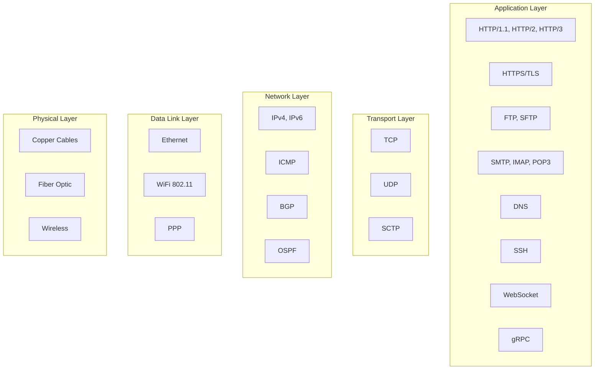

# Network Protocols and Communication Systems - Comprehensive Guide

## 🎯 Overview

This comprehensive guide covers all major network protocols, communication systems, and networking concepts essential for backend engineers. From low-level protocols to high-level application protocols.

## 📊 Protocol Stack Overview



## 🔧 Core Protocols

### 1. HTTP/1.1

#### HTTP Client Implementation
```go
type HTTPClient struct {
    connectionPool ConnectionPool
    timeout        time.Duration
    retryCount     int
}

func (hc *HTTPClient) Get(url string) (*HTTPResponse, error) {
    // Parse URL
    parsedURL, err := url.Parse(url)
    if err != nil {
        return nil, err
    }
    
    // Get connection
    conn, err := hc.connectionPool.Get(parsedURL.Host)
    if err != nil {
        return nil, err
    }
    defer hc.connectionPool.Put(conn)
    
    // Build request
    req := &HTTPRequest{
        Method: "GET",
        URL:    parsedURL,
        Headers: map[string]string{
            "Host":       parsedURL.Host,
            "User-Agent": "Go-HTTP-Client/1.0",
        },
    }
    
    // Send request
    resp, err := hc.sendRequest(conn, req)
    if err != nil {
        return nil, err
    }
    
    return resp, nil
}

func (hc *HTTPClient) sendRequest(conn *Connection, req *HTTPRequest) (*HTTPResponse, error) {
    // Build HTTP request string
    httpReq := hc.buildHTTPRequest(req)
    
    // Send request
    if err := conn.Write([]byte(httpReq)); err != nil {
        return nil, err
    }
    
    // Read response
    resp, err := hc.readResponse(conn)
    if err != nil {
        return nil, err
    }
    
    return resp, nil
}

func (hc *HTTPClient) buildHTTPRequest(req *HTTPRequest) string {
    var builder strings.Builder
    
    // Request line
    builder.WriteString(fmt.Sprintf("%s %s HTTP/1.1\r\n", req.Method, req.URL.RequestURI()))
    
    // Headers
    for key, value := range req.Headers {
        builder.WriteString(fmt.Sprintf("%s: %s\r\n", key, value))
    }
    
    // Empty line
    builder.WriteString("\r\n")
    
    // Body
    if req.Body != nil {
        builder.Write(req.Body)
    }
    
    return builder.String()
}
```

#### HTTP Server Implementation
```go
type HTTPServer struct {
    addr     string
    handler  http.Handler
    listener net.Listener
}

func (hs *HTTPServer) Start() error {
    // Create listener
    listener, err := net.Listen("tcp", hs.addr)
    if err != nil {
        return err
    }
    hs.listener = listener
    
    // Accept connections
    for {
        conn, err := listener.Accept()
        if err != nil {
            continue
        }
        
        // Handle connection
        go hs.handleConnection(conn)
    }
}

func (hs *HTTPServer) handleConnection(conn net.Conn) {
    defer conn.Close()
    
    // Read request
    req, err := hs.readRequest(conn)
    if err != nil {
        return
    }
    
    // Create response writer
    w := &ResponseWriter{conn: conn}
    
    // Call handler
    hs.handler.ServeHTTP(w, req)
}

func (hs *HTTPServer) readRequest(conn net.Conn) (*HTTPRequest, error) {
    // Read request line
    line, err := hs.readLine(conn)
    if err != nil {
        return nil, err
    }
    
    // Parse request line
    parts := strings.Split(line, " ")
    if len(parts) != 3 {
        return nil, errors.New("invalid request line")
    }
    
    method := parts[0]
    uri := parts[1]
    version := parts[2]
    
    // Read headers
    headers := make(map[string]string)
    for {
        line, err := hs.readLine(conn)
        if err != nil {
            return nil, err
        }
        
        if line == "" {
            break
        }
        
        parts := strings.SplitN(line, ":", 2)
        if len(parts) == 2 {
            headers[strings.TrimSpace(parts[0])] = strings.TrimSpace(parts[1])
        }
    }
    
    return &HTTPRequest{
        Method:  method,
        URI:     uri,
        Version: version,
        Headers: headers,
    }, nil
}
```

### 2. HTTP/2

#### HTTP/2 Frame Implementation
```go
type HTTP2Frame struct {
    Length   uint32
    Type     uint8
    Flags    uint8
    StreamID uint32
    Payload  []byte
}

func (f *HTTP2Frame) Encode() []byte {
    buf := make([]byte, 9+len(f.Payload))
    
    // Length (24 bits)
    buf[0] = byte(f.Length >> 16)
    buf[1] = byte(f.Length >> 8)
    buf[2] = byte(f.Length)
    
    // Type (8 bits)
    buf[3] = f.Type
    
    // Flags (8 bits)
    buf[4] = f.Flags
    
    // Stream ID (31 bits)
    buf[5] = byte(f.StreamID >> 24)
    buf[6] = byte(f.StreamID >> 16)
    buf[7] = byte(f.StreamID >> 8)
    buf[8] = byte(f.StreamID)
    
    // Payload
    copy(buf[9:], f.Payload)
    
    return buf
}

func (f *HTTP2Frame) Decode(data []byte) error {
    if len(data) < 9 {
        return errors.New("frame too short")
    }
    
    // Length
    f.Length = uint32(data[0])<<16 | uint32(data[1])<<8 | uint32(data[2])
    
    // Type
    f.Type = data[3]
    
    // Flags
    f.Flags = data[4]
    
    // Stream ID
    f.StreamID = uint32(data[5])<<24 | uint32(data[6])<<16 | uint32(data[7])<<8 | uint32(data[8])
    
    // Payload
    if len(data) > 9 {
        f.Payload = data[9:]
    }
    
    return nil
}
```

#### HTTP/2 Connection Management
```go
type HTTP2Connection struct {
    conn        net.Conn
    streams     map[uint32]*Stream
    nextStreamID uint32
    settings    Settings
    mutex       sync.RWMutex
}

func (c *HTTP2Connection) HandleFrame(frame *HTTP2Frame) error {
    switch frame.Type {
    case FrameTypeSettings:
        return c.handleSettings(frame)
    case FrameTypeHeaders:
        return c.handleHeaders(frame)
    case FrameTypeData:
        return c.handleData(frame)
    case FrameTypePing:
        return c.handlePing(frame)
    case FrameTypeGoAway:
        return c.handleGoAway(frame)
    default:
        return fmt.Errorf("unknown frame type: %d", frame.Type)
    }
}

func (c *HTTP2Connection) handleSettings(frame *HTTP2Frame) error {
    // Parse settings
    settings, err := c.parseSettings(frame.Payload)
    if err != nil {
        return err
    }
    
    // Update connection settings
    c.settings.Update(settings)
    
    // Send settings ack
    ackFrame := &HTTP2Frame{
        Type:     FrameTypeSettings,
        Flags:    FlagSettingsAck,
        StreamID: 0,
    }
    
    return c.sendFrame(ackFrame)
}

func (c *HTTP2Connection) handleHeaders(frame *HTTP2Frame) error {
    c.mutex.Lock()
    defer c.mutex.Unlock()
    
    // Get or create stream
    stream, exists := c.streams[frame.StreamID]
    if !exists {
        stream = &Stream{
            ID:     frame.StreamID,
            State:  StreamStateOpen,
            Headers: make(map[string]string),
        }
        c.streams[frame.StreamID] = stream
    }
    
    // Parse headers
    headers, err := c.parseHeaders(frame.Payload)
    if err != nil {
        return err
    }
    
    // Update stream headers
    for key, value := range headers {
        stream.Headers[key] = value
    }
    
    // Check if end of headers
    if frame.Flags&FlagHeadersEndHeaders != 0 {
        stream.State = StreamStateHalfClosed
    }
    
    return nil
}
```

### 3. WebSocket Protocol

#### WebSocket Handshake
```go
type WebSocketServer struct {
    addr    string
    handler WebSocketHandler
}

func (ws *WebSocketServer) Start() error {
    listener, err := net.Listen("tcp", ws.addr)
    if err != nil {
        return err
    }
    
    for {
        conn, err := listener.Accept()
        if err != nil {
            continue
        }
        
        go ws.handleConnection(conn)
    }
}

func (ws *WebSocketServer) handleConnection(conn net.Conn) {
    defer conn.Close()
    
    // Perform handshake
    if err := ws.performHandshake(conn); err != nil {
        return
    }
    
    // Handle WebSocket communication
    ws.handleWebSocket(conn)
}

func (ws *WebSocketServer) performHandshake(conn net.Conn) error {
    // Read HTTP request
    req, err := ws.readHTTPRequest(conn)
    if err != nil {
        return err
    }
    
    // Validate WebSocket headers
    if !ws.validateWebSocketHeaders(req) {
        return errors.New("invalid WebSocket headers")
    }
    
    // Generate accept key
    acceptKey := ws.generateAcceptKey(req.Headers["Sec-WebSocket-Key"])
    
    // Send response
    resp := fmt.Sprintf(
        "HTTP/1.1 101 Switching Protocols\r\n"+
        "Upgrade: websocket\r\n"+
        "Connection: Upgrade\r\n"+
        "Sec-WebSocket-Accept: %s\r\n"+
        "\r\n",
        acceptKey,
    )
    
    _, err = conn.Write([]byte(resp))
    return err
}

func (ws *WebSocketServer) generateAcceptKey(key string) string {
    // Append magic string
    key += "258EAFA5-E914-47DA-95CA-C5AB0DC85B11"
    
    // SHA-1 hash
    h := sha1.New()
    h.Write([]byte(key))
    hash := h.Sum(nil)
    
    // Base64 encode
    return base64.StdEncoding.EncodeToString(hash)
}
```

#### WebSocket Frame Handling
```go
type WebSocketFrame struct {
    Fin     bool
    Opcode  uint8
    Masked  bool
    Length  uint64
    MaskKey []byte
    Payload []byte
}

func (f *WebSocketFrame) Encode() []byte {
    var buf []byte
    
    // First byte
    firstByte := byte(0)
    if f.Fin {
        firstByte |= 0x80
    }
    firstByte |= f.Opcode & 0x0F
    buf = append(buf, firstByte)
    
    // Second byte
    secondByte := byte(0)
    if f.Masked {
        secondByte |= 0x80
    }
    
    // Length
    if f.Length < 126 {
        secondByte |= byte(f.Length)
        buf = append(buf, secondByte)
    } else if f.Length < 65536 {
        secondByte |= 126
        buf = append(buf, secondByte)
        buf = append(buf, byte(f.Length>>8))
        buf = append(buf, byte(f.Length))
    } else {
        secondByte |= 127
        buf = append(buf, secondByte)
        for i := 7; i >= 0; i-- {
            buf = append(buf, byte(f.Length>>(i*8)))
        }
    }
    
    // Mask key
    if f.Masked {
        buf = append(buf, f.MaskKey...)
    }
    
    // Payload
    payload := f.Payload
    if f.Masked {
        payload = make([]byte, len(f.Payload))
        for i, b := range f.Payload {
            payload[i] = b ^ f.MaskKey[i%4]
        }
    }
    buf = append(buf, payload...)
    
    return buf
}

func (f *WebSocketFrame) Decode(data []byte) error {
    if len(data) < 2 {
        return errors.New("frame too short")
    }
    
    // First byte
    f.Fin = (data[0] & 0x80) != 0
    f.Opcode = data[0] & 0x0F
    
    // Second byte
    f.Masked = (data[1] & 0x80) != 0
    length := data[1] & 0x7F
    
    offset := 2
    
    // Length
    if length < 126 {
        f.Length = uint64(length)
    } else if length == 126 {
        if len(data) < offset+2 {
            return errors.New("frame too short")
        }
        f.Length = uint64(data[offset])<<8 | uint64(data[offset+1])
        offset += 2
    } else {
        if len(data) < offset+8 {
            return errors.New("frame too short")
        }
        f.Length = 0
        for i := 0; i < 8; i++ {
            f.Length |= uint64(data[offset+i]) << ((7 - i) * 8)
        }
        offset += 8
    }
    
    // Mask key
    if f.Masked {
        if len(data) < offset+4 {
            return errors.New("frame too short")
        }
        f.MaskKey = data[offset : offset+4]
        offset += 4
    }
    
    // Payload
    if len(data) < offset+int(f.Length) {
        return errors.New("frame too short")
    }
    f.Payload = data[offset : offset+int(f.Length)]
    
    // Unmask payload
    if f.Masked {
        for i, b := range f.Payload {
            f.Payload[i] = b ^ f.MaskKey[i%4]
        }
    }
    
    return nil
}
```

### 4. DNS Protocol

#### DNS Client Implementation
```go
type DNSClient struct {
    servers []string
    cache   DNSCache
}

func (dc *DNSClient) Resolve(hostname string) (string, error) {
    // Check cache first
    if ip, err := dc.cache.Get(hostname); err == nil {
        return ip, nil
    }
    
    // Create DNS query
    query := &DNSQuery{
        ID:      uint16(rand.Intn(65536)),
        Flags:   DNSFlagRecursionDesired,
        Questions: []DNSQuestion{
            {
                Name:  hostname,
                Type:  DNSTypeA,
                Class: DNSClassIN,
            },
        },
    }
    
    // Send query to servers
    for _, server := range dc.servers {
        resp, err := dc.sendQuery(server, query)
        if err != nil {
            continue
        }
        
        if len(resp.Answers) > 0 {
            ip := resp.Answers[0].Data
            dc.cache.Set(hostname, ip)
            return ip, nil
        }
    }
    
    return "", errors.New("no DNS servers responded")
}

func (dc *DNSClient) sendQuery(server string, query *DNSQuery) (*DNSResponse, error) {
    // Create UDP connection
    conn, err := net.Dial("udp", server+":53")
    if err != nil {
        return nil, err
    }
    defer conn.Close()
    
    // Encode query
    data, err := query.Encode()
    if err != nil {
        return nil, err
    }
    
    // Send query
    if _, err := conn.Write(data); err != nil {
        return nil, err
    }
    
    // Read response
    resp := make([]byte, 512)
    n, err := conn.Read(resp)
    if err != nil {
        return nil, err
    }
    
    // Decode response
    dnsResp := &DNSResponse{}
    if err := dnsResp.Decode(resp[:n]); err != nil {
        return nil, err
    }
    
    return dnsResp, nil
}
```

#### DNS Message Structure
```go
type DNSMessage struct {
    Header     DNSHeader
    Questions  []DNSQuestion
    Answers    []DNSResourceRecord
    Authority  []DNSResourceRecord
    Additional []DNSResourceRecord
}

type DNSHeader struct {
    ID      uint16
    Flags   uint16
    QDCount uint16
    ANCount uint16
    NSCount uint16
    ARCount uint16
}

func (h *DNSHeader) Encode() []byte {
    buf := make([]byte, 12)
    
    binary.BigEndian.PutUint16(buf[0:2], h.ID)
    binary.BigEndian.PutUint16(buf[2:4], h.Flags)
    binary.BigEndian.PutUint16(buf[4:6], h.QDCount)
    binary.BigEndian.PutUint16(buf[6:8], h.ANCount)
    binary.BigEndian.PutUint16(buf[8:10], h.NSCount)
    binary.BigEndian.PutUint16(buf[10:12], h.ARCount)
    
    return buf
}

func (h *DNSHeader) Decode(data []byte) error {
    if len(data) < 12 {
        return errors.New("header too short")
    }
    
    h.ID = binary.BigEndian.Uint16(data[0:2])
    h.Flags = binary.BigEndian.Uint16(data[2:4])
    h.QDCount = binary.BigEndian.Uint16(data[4:6])
    h.ANCount = binary.BigEndian.Uint16(data[6:8])
    h.NSCount = binary.BigEndian.Uint16(data[8:10])
    h.ARCount = binary.BigEndian.Uint16(data[10:12])
    
    return nil
}
```

### 5. gRPC Protocol

#### gRPC Server Implementation
```go
type GRPCServer struct {
    addr     string
    services map[string]Service
    listener net.Listener
}

func (gs *GRPCServer) Start() error {
    listener, err := net.Listen("tcp", gs.addr)
    if err != nil {
        return err
    }
    gs.listener = listener
    
    for {
        conn, err := listener.Accept()
        if err != nil {
            continue
        }
        
        go gs.handleConnection(conn)
    }
}

func (gs *GRPCServer) handleConnection(conn net.Conn) {
    defer conn.Close()
    
    // Read HTTP/2 preface
    preface := make([]byte, 24)
    if _, err := conn.Read(preface); err != nil {
        return
    }
    
    // Send HTTP/2 settings
    settings := &HTTP2Frame{
        Type:     FrameTypeSettings,
        StreamID: 0,
        Payload:  gs.buildSettingsPayload(),
    }
    
    if err := gs.sendFrame(conn, settings); err != nil {
        return
    }
    
    // Handle gRPC requests
    gs.handleGRPCRequests(conn)
}

func (gs *GRPCServer) handleGRPCRequests(conn net.Conn) {
    for {
        frame, err := gs.readFrame(conn)
        if err != nil {
            return
        }
        
        switch frame.Type {
        case FrameTypeHeaders:
            gs.handleHeaders(conn, frame)
        case FrameTypeData:
            gs.handleData(conn, frame)
        }
    }
}
```

## 🔍 Advanced Protocols

### 1. QUIC Protocol

#### QUIC Connection
```go
type QUICConnection struct {
    connID      []byte
    version     uint32
    state       ConnectionState
    streams     map[uint64]*QUICStream
    crypto      CryptoState
}

func (qc *QUICConnection) HandlePacket(packet []byte) error {
    // Parse packet header
    header, err := qc.parsePacketHeader(packet)
    if err != nil {
        return err
    }
    
    // Decrypt payload
    payload, err := qc.decryptPayload(packet[header.Length:])
    if err != nil {
        return err
    }
    
    // Handle frames
    return qc.handleFrames(payload)
}

func (qc *QUICConnection) handleFrames(data []byte) error {
    offset := 0
    
    for offset < len(data) {
        frame, frameLen, err := qc.parseFrame(data[offset:])
        if err != nil {
            return err
        }
        
        if err := qc.handleFrame(frame); err != nil {
            return err
        }
        
        offset += frameLen
    }
    
    return nil
}
```

### 2. MQTT Protocol

#### MQTT Broker
```go
type MQTTBroker struct {
    clients    map[string]*MQTTClient
    topics     map[string][]*MQTTClient
    mutex      sync.RWMutex
    persistence Persistence
}

func (mb *MQTTBroker) HandleConnect(clientID string, conn net.Conn) error {
    client := &MQTTClient{
        ID:   clientID,
        Conn: conn,
        State: ClientStateConnected,
    }
    
    mb.mutex.Lock()
    mb.clients[clientID] = client
    mb.mutex.Unlock()
    
    // Send CONNACK
    connack := &MQTTConnAck{
        SessionPresent: false,
        ReturnCode:     ConnectAccepted,
    }
    
    return mb.sendPacket(conn, connack)
}

func (mb *MQTTBroker) HandlePublish(packet *MQTTPublish) error {
    mb.mutex.RLock()
    subscribers := mb.topics[packet.Topic]
    mb.mutex.RUnlock()
    
    // Forward to subscribers
    for _, client := range subscribers {
        if client.State == ClientStateConnected {
            go mb.forwardMessage(client, packet)
        }
    }
    
    return nil
}
```

## 📊 Performance Optimization

### 1. Connection Pooling

#### HTTP Connection Pool
```go
type ConnectionPool struct {
    connections map[string][]*Connection
    maxConns    int
    maxIdle     time.Duration
    mutex       sync.RWMutex
}

func (cp *ConnectionPool) Get(host string) (*Connection, error) {
    cp.mutex.Lock()
    defer cp.mutex.Unlock()
    
    conns := cp.connections[host]
    
    // Try to reuse existing connection
    for i, conn := range conns {
        if conn.IsIdle() && time.Since(conn.LastUsed) < cp.maxIdle {
            conns = append(conns[:i], conns[i+1:]...)
            conn.SetActive()
            return conn, nil
        }
    }
    
    // Create new connection if under limit
    if len(conns) < cp.maxConns {
        conn, err := cp.createConnection(host)
        if err != nil {
            return nil, err
        }
        return conn, nil
    }
    
    // Wait for available connection
    return cp.waitForConnection(host)
}
```

### 2. Load Balancing

#### Round Robin Load Balancer
```go
type RoundRobinBalancer struct {
    servers []string
    current int
    mutex   sync.Mutex
}

func (rr *RoundRobinBalancer) GetServer() string {
    rr.mutex.Lock()
    defer rr.mutex.Unlock()
    
    server := rr.servers[rr.current]
    rr.current = (rr.current + 1) % len(rr.servers)
    
    return server
}
```

## 🔍 Key Technical Challenges

### 1. Protocol Compatibility
- **Problem**: Supporting multiple protocol versions
- **Solution**: Protocol negotiation and fallback
- **Implementation**: Feature detection and graceful degradation

### 2. Performance at Scale
- **Problem**: Handling millions of concurrent connections
- **Solution**: Event-driven architecture with connection pooling
- **Implementation**: epoll/kqueue with worker pools

### 3. Security
- **Problem**: Protecting against various attacks
- **Solution**: Encryption, authentication, and rate limiting
- **Implementation**: TLS, JWT, and circuit breakers

### 4. Reliability
- **Problem**: Ensuring message delivery
- **Solution**: Retry mechanisms and acknowledgments
- **Implementation**: Exponential backoff and idempotency

## 📚 Interview Questions

### System Design Questions
1. How would you design a high-performance HTTP server?
2. How does HTTP/2 improve over HTTP/1.1?
3. How would you implement WebSocket communication?
4. How does DNS resolution work?
5. How would you design a load balancer?

### Technical Deep Dive
1. Explain the TCP three-way handshake
2. How does HTTP keep-alive work?
3. Describe the WebSocket protocol
4. How does gRPC differ from REST?
5. Explain QUIC protocol benefits

## 🎯 Key Takeaways

1. **Protocol Stack**: Layered architecture with clear responsibilities
2. **HTTP Evolution**: HTTP/1.1 → HTTP/2 → HTTP/3 improvements
3. **Real-time Communication**: WebSocket for bidirectional communication
4. **Service Communication**: gRPC for high-performance RPC
5. **Performance**: Connection pooling and load balancing
6. **Security**: Encryption and authentication at every layer
7. **Reliability**: Retry mechanisms and error handling

## 🔗 Additional Resources

- [HTTP/2 Specification](https://tools.ietf.org/html/rfc7540)
- [WebSocket Protocol](https://tools.ietf.org/html/rfc6455)
- [gRPC Documentation](https://grpc.io/docs/)
- [QUIC Protocol](https://tools.ietf.org/html/draft-ietf-quic-transport)
- [MQTT Specification](https://mqtt.org/mqtt-specification/)
