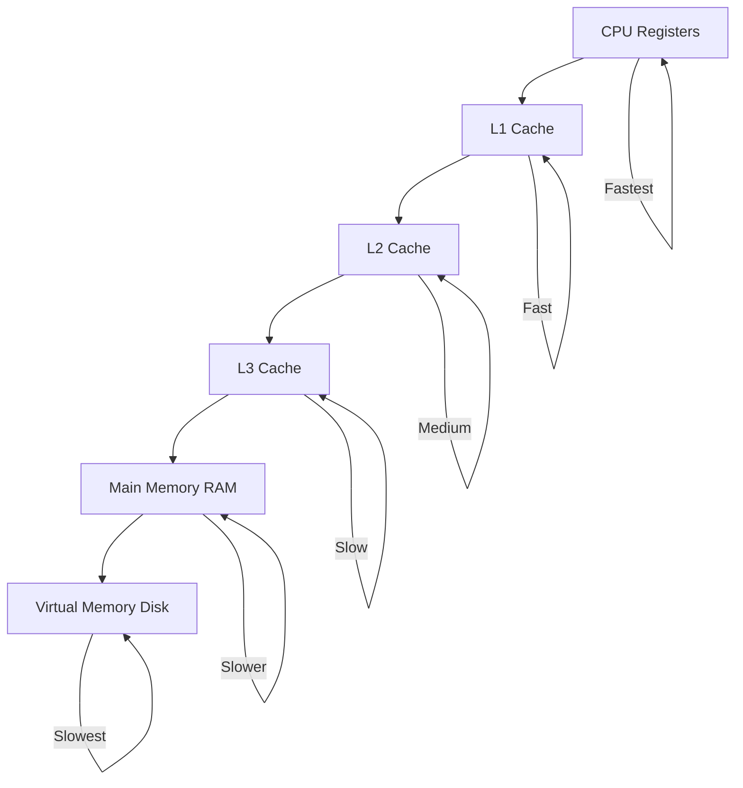
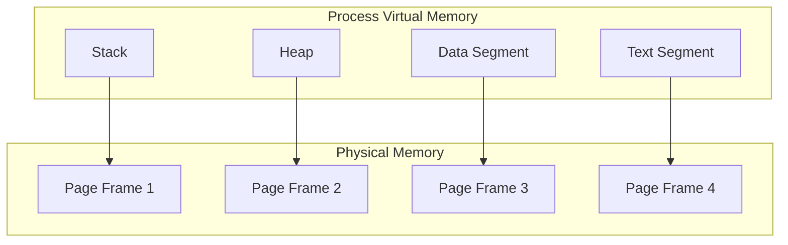
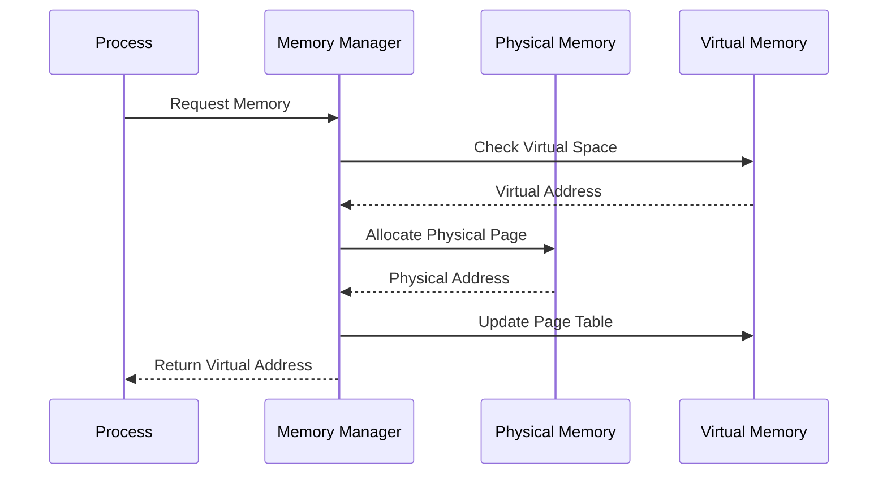

# 🧠 **Memory Management**

## 📘 **Theory**

Memory management is a critical aspect of operating systems that handles the allocation, deallocation, and organization of memory resources. It ensures efficient use of memory while providing isolation and protection between processes.

### **Why Memory Management Matters**

- **Resource Efficiency**: Maximizes available memory usage
- **Process Isolation**: Prevents processes from interfering with each other
- **Security**: Protects system and user data
- **Performance**: Optimizes memory access patterns
- **Multitasking**: Enables multiple processes to run simultaneously
- **Virtual Memory**: Provides illusion of more memory than physically available
- **Memory Protection**: Prevents unauthorized access to memory regions
- **Fragmentation Control**: Minimizes memory waste

### **Key Concepts**

1. **Physical Memory**: Actual RAM hardware
2. **Virtual Memory**: Abstract memory space for processes
3. **Memory Mapping**: Translation between virtual and physical addresses
4. **Page Tables**: Data structures for address translation
5. **Memory Allocation**: Dynamic allocation of memory blocks
6. **Garbage Collection**: Automatic memory deallocation
7. **Memory Fragmentation**: Wasted space due to allocation patterns
8. **Memory Hierarchy**: Different levels of memory (L1, L2, L3, RAM, Disk)

### **Memory Management Techniques**

1. **Paging**: Divide memory into fixed-size pages
2. **Segmentation**: Divide memory into variable-size segments
3. **Virtual Memory**: Use disk as extension of RAM
4. **Memory Pooling**: Pre-allocate memory blocks for efficiency
5. **Copy-on-Write**: Share memory until modification
6. **Memory Compression**: Compress memory to save space
7. **Memory Deduplication**: Share identical memory pages
8. **Memory Overcommitment**: Allocate more memory than available

### **Common Pitfalls and Best Practices**

- **Memory Leaks**: Always free allocated memory
- **Buffer Overflows**: Validate buffer bounds
- **Use After Free**: Avoid accessing freed memory
- **Double Free**: Don't free memory twice
- **Memory Fragmentation**: Use appropriate allocation strategies
- **Cache Misses**: Optimize memory access patterns
- **Page Faults**: Minimize unnecessary page faults
- **Memory Alignment**: Align data structures for performance

## 📊 **Diagrams**

### **Memory Hierarchy**



### **Virtual Memory Layout**



### **Memory Allocation Process**



## 🧩 **Example**

**Scenario**: Implement a memory allocator with first-fit strategy

**Input**:

- Memory size: 1024 bytes
- Allocation requests: 100, 200, 150, 300 bytes
- Deallocation: Free 200-byte block

**Expected Output**:

- Successful allocations with addresses
- Memory fragmentation after deallocation
- Memory usage statistics

**Step-by-step**:

1. Initialize memory pool
2. Allocate 100 bytes (address: 0)
3. Allocate 200 bytes (address: 100)
4. Allocate 150 bytes (address: 300)
5. Free 200-byte block (address: 100)
6. Allocate 300 bytes (address: 100)
7. Show memory layout and statistics

## 💻 **Implementation (Golang)**

```go
package main

import (
    "fmt"
    "unsafe"
)

// MemoryBlock represents a block of memory
type MemoryBlock struct {
    Start    uintptr
    Size     int
    IsFree   bool
    Next     *MemoryBlock
    Previous *MemoryBlock
}

// MemoryAllocator manages memory allocation
type MemoryAllocator struct {
    memory     []byte
    size       int
    freeList   *MemoryBlock
    usedBlocks map[uintptr]*MemoryBlock
    stats      *MemoryStats
}

// MemoryStats tracks memory usage statistics
type MemoryStats struct {
    TotalSize      int
    UsedSize       int
    FreeSize       int
    Allocations    int
    Deallocations  int
    Fragmentation  float64
}

// NewMemoryAllocator creates a new memory allocator
func NewMemoryAllocator(size int) *MemoryAllocator {
    memory := make([]byte, size)

    // Create initial free block
    freeBlock := &MemoryBlock{
        Start:    uintptr(unsafe.Pointer(&memory[0])),
        Size:     size,
        IsFree:   true,
        Next:     nil,
        Previous: nil,
    }

    return &MemoryAllocator{
        memory:     memory,
        size:       size,
        freeList:   freeBlock,
        usedBlocks: make(map[uintptr]*MemoryBlock),
        stats: &MemoryStats{
            TotalSize: size,
            FreeSize:  size,
        },
    }
}

// Allocate allocates memory using first-fit strategy
func (ma *MemoryAllocator) Allocate(size int) (uintptr, error) {
    if size <= 0 {
        return 0, fmt.Errorf("invalid allocation size: %d", size)
    }

    // Find first suitable free block
    current := ma.freeList
    for current != nil {
        if current.IsFree && current.Size >= size {
            // Found suitable block
            return ma.splitBlock(current, size)
        }
        current = current.Next
    }

    return 0, fmt.Errorf("insufficient memory: requested %d bytes", size)
}

// splitBlock splits a free block and returns the allocated portion
func (ma *MemoryAllocator) splitBlock(block *MemoryBlock, size int) (uintptr, error) {
    // Mark block as used
    block.IsFree = false
    ma.usedBlocks[block.Start] = block

    // Update statistics
    ma.stats.UsedSize += size
    ma.stats.FreeSize -= size
    ma.stats.Allocations++

    // If block is much larger than requested, split it
    if block.Size > size+int(unsafe.Sizeof(MemoryBlock{})) {
        // Create new free block for remaining space
        remainingSize := block.Size - size
        newBlock := &MemoryBlock{
            Start:    block.Start + uintptr(size),
            Size:     remainingSize,
            IsFree:   true,
            Next:     block.Next,
            Previous: block,
        }

        // Update block size
        block.Size = size

        // Update linked list
        if block.Next != nil {
            block.Next.Previous = newBlock
        }
        block.Next = newBlock

        // Update statistics
        ma.stats.FreeSize += remainingSize
    }

    return block.Start, nil
}

// Deallocate frees previously allocated memory
func (ma *MemoryAllocator) Deallocate(ptr uintptr) error {
    block, exists := ma.usedBlocks[ptr]
    if !exists {
        return fmt.Errorf("invalid pointer: %x", ptr)
    }

    // Mark block as free
    block.IsFree = true
    delete(ma.usedBlocks, ptr)

    // Update statistics
    ma.stats.UsedSize -= block.Size
    ma.stats.FreeSize += block.Size
    ma.stats.Deallocations++

    // Merge with adjacent free blocks
    ma.mergeFreeBlocks(block)

    return nil
}

// mergeFreeBlocks merges adjacent free blocks
func (ma *MemoryAllocator) mergeFreeBlocks(block *MemoryBlock) {
    // Merge with next block if it's free
    if block.Next != nil && block.Next.IsFree {
        block.Size += block.Next.Size
        block.Next = block.Next.Next
        if block.Next != nil {
            block.Next.Previous = block
        }
    }

    // Merge with previous block if it's free
    if block.Previous != nil && block.Previous.IsFree {
        block.Previous.Size += block.Size
        block.Previous.Next = block.Next
        if block.Next != nil {
            block.Next.Previous = block.Previous
        }
    }
}

// GetStats returns memory usage statistics
func (ma *MemoryAllocator) GetStats() *MemoryStats {
    // Calculate fragmentation
    freeBlocks := 0
    totalFreeSize := 0
    maxFreeBlock := 0

    current := ma.freeList
    for current != nil {
        if current.IsFree {
            freeBlocks++
            totalFreeSize += current.Size
            if current.Size > maxFreeBlock {
                maxFreeBlock = current.Size
            }
        }
        current = current.Next
    }

    if totalFreeSize > 0 {
        ma.stats.Fragmentation = float64(totalFreeSize-maxFreeBlock) / float64(totalFreeSize)
    }

    return ma.stats
}

// PrintMemoryLayout prints the current memory layout
func (ma *MemoryAllocator) PrintMemoryLayout() {
    fmt.Println("Memory Layout:")
    fmt.Println("Address    | Size | Status | Next")
    fmt.Println("-----------|------|--------|-----")

    current := ma.freeList
    for current != nil {
        status := "Free"
        if !current.IsFree {
            status = "Used"
        }

        nextAddr := "nil"
        if current.Next != nil {
            nextAddr = fmt.Sprintf("0x%x", current.Next.Start)
        }

        fmt.Printf("0x%08x | %4d | %-6s | %s\n",
            current.Start, current.Size, status, nextAddr)
        current = current.Next
    }
}

// VirtualMemoryManager manages virtual memory
type VirtualMemoryManager struct {
    pageSize    int
    numPages    int
    pageTable   []PageEntry
    freePages   []int
    usedPages   map[int]bool
    stats       *VirtualMemoryStats
}

// PageEntry represents a page table entry
type PageEntry struct {
    PhysicalPage int
    Present      bool
    Modified     bool
    Referenced   bool
    Protection   int
}

// VirtualMemoryStats tracks virtual memory statistics
type VirtualMemoryStats struct {
    TotalPages     int
    UsedPages      int
    FreePages      int
    PageFaults     int
    PageHits       int
    PageReplacements int
}

// NewVirtualMemoryManager creates a new virtual memory manager
func NewVirtualMemoryManager(pageSize, numPages int) *VirtualMemoryManager {
    pageTable := make([]PageEntry, numPages)
    freePages := make([]int, numPages)

    // Initialize all pages as free
    for i := 0; i < numPages; i++ {
        freePages[i] = i
    }

    return &VirtualMemoryManager{
        pageSize:  pageSize,
        numPages:  numPages,
        pageTable: pageTable,
        freePages: freePages,
        usedPages: make(map[int]bool),
        stats: &VirtualMemoryStats{
            TotalPages: numPages,
            FreePages:  numPages,
        },
    }
}

// AllocatePage allocates a virtual page
func (vmm *VirtualMemoryManager) AllocatePage(virtualPage int) error {
    if virtualPage < 0 || virtualPage >= vmm.numPages {
        return fmt.Errorf("invalid virtual page: %d", virtualPage)
    }

    if vmm.pageTable[virtualPage].Present {
        return fmt.Errorf("page already allocated: %d", virtualPage)
    }

    if len(vmm.freePages) == 0 {
        return fmt.Errorf("no free pages available")
    }

    // Allocate a physical page
    physicalPage := vmm.freePages[0]
    vmm.freePages = vmm.freePages[1:]

    // Update page table
    vmm.pageTable[virtualPage] = PageEntry{
        PhysicalPage: physicalPage,
        Present:      true,
        Modified:     false,
        Referenced:   true,
        Protection:   0, // Read/Write
    }

    // Update statistics
    vmm.usedPages[physicalPage] = true
    vmm.stats.UsedPages++
    vmm.stats.FreePages--

    return nil
}

// DeallocatePage deallocates a virtual page
func (vmm *VirtualMemoryManager) DeallocatePage(virtualPage int) error {
    if virtualPage < 0 || virtualPage >= vmm.numPages {
        return fmt.Errorf("invalid virtual page: %d", virtualPage)
    }

    if !vmm.pageTable[virtualPage].Present {
        return fmt.Errorf("page not allocated: %d", virtualPage)
    }

    // Get physical page
    physicalPage := vmm.pageTable[virtualPage].PhysicalPage

    // Free physical page
    vmm.freePages = append(vmm.freePages, physicalPage)
    delete(vmm.usedPages, physicalPage)

    // Update page table
    vmm.pageTable[virtualPage] = PageEntry{}

    // Update statistics
    vmm.stats.UsedPages--
    vmm.stats.FreePages++

    return nil
}

// TranslateAddress translates virtual address to physical address
func (vmm *VirtualMemoryManager) TranslateAddress(virtualAddr int) (int, error) {
    virtualPage := virtualAddr / vmm.pageSize
    offset := virtualAddr % vmm.pageSize

    if virtualPage < 0 || virtualPage >= vmm.numPages {
        return 0, fmt.Errorf("invalid virtual page: %d", virtualPage)
    }

    entry := vmm.pageTable[virtualPage]
    if !entry.Present {
        vmm.stats.PageFaults++
        return 0, fmt.Errorf("page fault: page %d not present", virtualPage)
    }

    vmm.stats.PageHits++
    physicalAddr := entry.PhysicalPage*vmm.pageSize + offset
    return physicalAddr, nil
}

// GetStats returns virtual memory statistics
func (vmm *VirtualMemoryManager) GetStats() *VirtualMemoryStats {
    return vmm.stats
}

// PrintPageTable prints the page table
func (vmm *VirtualMemoryManager) PrintPageTable() {
    fmt.Println("Page Table:")
    fmt.Println("Virtual | Physical | Present | Modified | Referenced")
    fmt.Println("--------|----------|---------|----------|-----------")

    for i, entry := range vmm.pageTable {
        if entry.Present {
            fmt.Printf("%7d | %8d | %7t | %8t | %10t\n",
                i, entry.PhysicalPage, entry.Present, entry.Modified, entry.Referenced)
        }
    }
}

// Example usage
func main() {
    // Test memory allocator
    fmt.Println("=== Memory Allocator Test ===")
    allocator := NewMemoryAllocator(1024)

    // Allocate memory
    addr1, err := allocator.Allocate(100)
    if err != nil {
        fmt.Printf("Allocation error: %v\n", err)
        return
    }
    fmt.Printf("Allocated 100 bytes at address: 0x%x\n", addr1)

    addr2, err := allocator.Allocate(200)
    if err != nil {
        fmt.Printf("Allocation error: %v\n", err)
        return
    }
    fmt.Printf("Allocated 200 bytes at address: 0x%x\n", addr2)

    addr3, err := allocator.Allocate(150)
    if err != nil {
        fmt.Printf("Allocation error: %v\n", err)
        return
    }
    fmt.Printf("Allocated 150 bytes at address: 0x%x\n", addr3)

    // Print memory layout
    allocator.PrintMemoryLayout()

    // Deallocate memory
    err = allocator.Deallocate(addr2)
    if err != nil {
        fmt.Printf("Deallocation error: %v\n", err)
        return
    }
    fmt.Printf("Deallocated 200 bytes at address: 0x%x\n", addr2)

    // Print memory layout after deallocation
    allocator.PrintMemoryLayout()

    // Print statistics
    stats := allocator.GetStats()
    fmt.Printf("\nMemory Statistics:\n")
    fmt.Printf("Total Size: %d bytes\n", stats.TotalSize)
    fmt.Printf("Used Size: %d bytes\n", stats.UsedSize)
    fmt.Printf("Free Size: %d bytes\n", stats.FreeSize)
    fmt.Printf("Allocations: %d\n", stats.Allocations)
    fmt.Printf("Deallocations: %d\n", stats.Deallocations)
    fmt.Printf("Fragmentation: %.2f%%\n", stats.Fragmentation*100)

    // Test virtual memory manager
    fmt.Println("\n=== Virtual Memory Manager Test ===")
    vmm := NewVirtualMemoryManager(4096, 8) // 4KB pages, 8 pages

    // Allocate pages
    err = vmm.AllocatePage(0)
    if err != nil {
        fmt.Printf("Page allocation error: %v\n", err)
        return
    }
    fmt.Println("Allocated virtual page 0")

    err = vmm.AllocatePage(1)
    if err != nil {
        fmt.Printf("Page allocation error: %v\n", err)
        return
    }
    fmt.Println("Allocated virtual page 1")

    // Translate addresses
    addr, err := vmm.TranslateAddress(0)
    if err != nil {
        fmt.Printf("Address translation error: %v\n", err)
    } else {
        fmt.Printf("Virtual address 0 -> Physical address %d\n", addr)
    }

    addr, err = vmm.TranslateAddress(4096)
    if err != nil {
        fmt.Printf("Address translation error: %v\n", err)
    } else {
        fmt.Printf("Virtual address 4096 -> Physical address %d\n", addr)
    }

    // Print page table
    vmm.PrintPageTable()

    // Print statistics
    vmmStats := vmm.GetStats()
    fmt.Printf("\nVirtual Memory Statistics:\n")
    fmt.Printf("Total Pages: %d\n", vmmStats.TotalPages)
    fmt.Printf("Used Pages: %d\n", vmmStats.UsedPages)
    fmt.Printf("Free Pages: %d\n", vmmStats.FreePages)
    fmt.Printf("Page Faults: %d\n", vmmStats.PageFaults)
    fmt.Printf("Page Hits: %d\n", vmmStats.PageHits)
}
```

## 💻 **Implementation (Node.js)**

```javascript
class MemoryBlock {
  constructor(start, size, isFree = true) {
    this.start = start;
    this.size = size;
    this.isFree = isFree;
    this.next = null;
    this.previous = null;
  }
}

class MemoryAllocator {
  constructor(size) {
    this.memory = new ArrayBuffer(size);
    this.size = size;
    this.freeList = new MemoryBlock(0, size);
    this.usedBlocks = new Map();
    this.stats = {
      totalSize: size,
      usedSize: 0,
      freeSize: size,
      allocations: 0,
      deallocations: 0,
      fragmentation: 0,
    };
  }

  allocate(size) {
    if (size <= 0) {
      throw new Error(`Invalid allocation size: ${size}`);
    }

    // Find first suitable free block
    let current = this.freeList;
    while (current) {
      if (current.isFree && current.size >= size) {
        // Found suitable block
        return this.splitBlock(current, size);
      }
      current = current.next;
    }

    throw new Error(`Insufficient memory: requested ${size} bytes`);
  }

  splitBlock(block, size) {
    // Mark block as used
    block.isFree = false;
    this.usedBlocks.set(block.start, block);

    // Update statistics
    this.stats.usedSize += size;
    this.stats.freeSize -= size;
    this.stats.allocations++;

    // If block is much larger than requested, split it
    if (block.size > size + 16) {
      // 16 bytes for block metadata
      // Create new free block for remaining space
      const remainingSize = block.size - size;
      const newBlock = new MemoryBlock(block.start + size, remainingSize, true);

      // Update block size
      block.size = size;

      // Update linked list
      if (block.next) {
        block.next.previous = newBlock;
      }
      newBlock.next = block.next;
      block.next = newBlock;
      newBlock.previous = block;

      // Update statistics
      this.stats.freeSize += remainingSize;
    }

    return block.start;
  }

  deallocate(ptr) {
    const block = this.usedBlocks.get(ptr);
    if (!block) {
      throw new Error(`Invalid pointer: 0x${ptr.toString(16)}`);
    }

    // Mark block as free
    block.isFree = true;
    this.usedBlocks.delete(ptr);

    // Update statistics
    this.stats.usedSize -= block.size;
    this.stats.freeSize += block.size;
    this.stats.deallocations++;

    // Merge with adjacent free blocks
    this.mergeFreeBlocks(block);
  }

  mergeFreeBlocks(block) {
    // Merge with next block if it's free
    if (block.next && block.next.isFree) {
      block.size += block.next.size;
      block.next = block.next.next;
      if (block.next) {
        block.next.previous = block;
      }
    }

    // Merge with previous block if it's free
    if (block.previous && block.previous.isFree) {
      block.previous.size += block.size;
      block.previous.next = block.next;
      if (block.next) {
        block.next.previous = block.previous;
      }
    }
  }

  getStats() {
    // Calculate fragmentation
    let freeBlocks = 0;
    let totalFreeSize = 0;
    let maxFreeBlock = 0;

    let current = this.freeList;
    while (current) {
      if (current.isFree) {
        freeBlocks++;
        totalFreeSize += current.size;
        if (current.size > maxFreeBlock) {
          maxFreeBlock = current.size;
        }
      }
      current = current.next;
    }

    if (totalFreeSize > 0) {
      this.stats.fragmentation = (totalFreeSize - maxFreeBlock) / totalFreeSize;
    }

    return this.stats;
  }

  printMemoryLayout() {
    console.log("Memory Layout:");
    console.log("Address    | Size | Status | Next");
    console.log("-----------|------|--------|-----");

    let current = this.freeList;
    while (current) {
      const status = current.isFree ? "Free" : "Used";
      const nextAddr = current.next
        ? `0x${current.next.start.toString(16)}`
        : "null";

      console.log(
        `0x${current.start.toString(16).padStart(8, "0")} | ${current.size
          .toString()
          .padStart(4)} | ${status.padEnd(6)} | ${nextAddr}`
      );
      current = current.next;
    }
  }
}

class VirtualMemoryManager {
  constructor(pageSize, numPages) {
    this.pageSize = pageSize;
    this.numPages = numPages;
    this.pageTable = new Array(numPages).fill(null);
    this.freePages = Array.from({ length: numPages }, (_, i) => i);
    this.usedPages = new Set();
    this.stats = {
      totalPages: numPages,
      usedPages: 0,
      freePages: numPages,
      pageFaults: 0,
      pageHits: 0,
      pageReplacements: 0,
    };
  }

  allocatePage(virtualPage) {
    if (virtualPage < 0 || virtualPage >= this.numPages) {
      throw new Error(`Invalid virtual page: ${virtualPage}`);
    }

    if (this.pageTable[virtualPage]) {
      throw new Error(`Page already allocated: ${virtualPage}`);
    }

    if (this.freePages.length === 0) {
      throw new Error("No free pages available");
    }

    // Allocate a physical page
    const physicalPage = this.freePages.shift();

    // Update page table
    this.pageTable[virtualPage] = {
      physicalPage,
      present: true,
      modified: false,
      referenced: true,
      protection: 0, // Read/Write
    };

    // Update statistics
    this.usedPages.add(physicalPage);
    this.stats.usedPages++;
    this.stats.freePages--;

    return physicalPage;
  }

  deallocatePage(virtualPage) {
    if (virtualPage < 0 || virtualPage >= this.numPages) {
      throw new Error(`Invalid virtual page: ${virtualPage}`);
    }

    if (!this.pageTable[virtualPage]) {
      throw new Error(`Page not allocated: ${virtualPage}`);
    }

    // Get physical page
    const physicalPage = this.pageTable[virtualPage].physicalPage;

    // Free physical page
    this.freePages.push(physicalPage);
    this.usedPages.delete(physicalPage);

    // Update page table
    this.pageTable[virtualPage] = null;

    // Update statistics
    this.stats.usedPages--;
    this.stats.freePages++;
  }

  translateAddress(virtualAddr) {
    const virtualPage = Math.floor(virtualAddr / this.pageSize);
    const offset = virtualAddr % this.pageSize;

    if (virtualPage < 0 || virtualPage >= this.numPages) {
      throw new Error(`Invalid virtual page: ${virtualPage}`);
    }

    const entry = this.pageTable[virtualPage];
    if (!entry || !entry.present) {
      this.stats.pageFaults++;
      throw new Error(`Page fault: page ${virtualPage} not present`);
    }

    this.stats.pageHits++;
    const physicalAddr = entry.physicalPage * this.pageSize + offset;
    return physicalAddr;
  }

  getStats() {
    return this.stats;
  }

  printPageTable() {
    console.log("Page Table:");
    console.log("Virtual | Physical | Present | Modified | Referenced");
    console.log("--------|----------|---------|----------|-----------");

    for (let i = 0; i < this.numPages; i++) {
      const entry = this.pageTable[i];
      if (entry) {
        console.log(
          `${i.toString().padStart(7)} | ${entry.physicalPage
            .toString()
            .padStart(8)} | ${entry.present
            .toString()
            .padStart(7)} | ${entry.modified
            .toString()
            .padStart(8)} | ${entry.referenced.toString().padStart(10)}`
        );
      }
    }
  }
}

// Example usage
function main() {
  // Test memory allocator
  console.log("=== Memory Allocator Test ===");
  const allocator = new MemoryAllocator(1024);

  try {
    // Allocate memory
    const addr1 = allocator.allocate(100);
    console.log(`Allocated 100 bytes at address: 0x${addr1.toString(16)}`);

    const addr2 = allocator.allocate(200);
    console.log(`Allocated 200 bytes at address: 0x${addr2.toString(16)}`);

    const addr3 = allocator.allocate(150);
    console.log(`Allocated 150 bytes at address: 0x${addr3.toString(16)}`);

    // Print memory layout
    allocator.printMemoryLayout();

    // Deallocate memory
    allocator.deallocate(addr2);
    console.log(`Deallocated 200 bytes at address: 0x${addr2.toString(16)}`);

    // Print memory layout after deallocation
    allocator.printMemoryLayout();

    // Print statistics
    const stats = allocator.getStats();
    console.log("\nMemory Statistics:");
    console.log(`Total Size: ${stats.totalSize} bytes`);
    console.log(`Used Size: ${stats.usedSize} bytes`);
    console.log(`Free Size: ${stats.freeSize} bytes`);
    console.log(`Allocations: ${stats.allocations}`);
    console.log(`Deallocations: ${stats.deallocations}`);
    console.log(`Fragmentation: ${(stats.fragmentation * 100).toFixed(2)}%`);
  } catch (error) {
    console.error("Error:", error.message);
  }

  // Test virtual memory manager
  console.log("\n=== Virtual Memory Manager Test ===");
  const vmm = new VirtualMemoryManager(4096, 8); // 4KB pages, 8 pages

  try {
    // Allocate pages
    vmm.allocatePage(0);
    console.log("Allocated virtual page 0");

    vmm.allocatePage(1);
    console.log("Allocated virtual page 1");

    // Translate addresses
    const addr1 = vmm.translateAddress(0);
    console.log(`Virtual address 0 -> Physical address ${addr1}`);

    const addr2 = vmm.translateAddress(4096);
    console.log(`Virtual address 4096 -> Physical address ${addr2}`);

    // Print page table
    vmm.printPageTable();

    // Print statistics
    const vmmStats = vmm.getStats();
    console.log("\nVirtual Memory Statistics:");
    console.log(`Total Pages: ${vmmStats.totalPages}`);
    console.log(`Used Pages: ${vmmStats.usedPages}`);
    console.log(`Free Pages: ${vmmStats.freePages}`);
    console.log(`Page Faults: ${vmmStats.pageFaults}`);
    console.log(`Page Hits: ${vmmStats.pageHits}`);
  } catch (error) {
    console.error("Error:", error.message);
  }
}

// Run the example
main();
```

## ⏱ **Complexity Analysis**

### **Time Complexity**

- **Memory Allocation**: O(n) where n is number of free blocks
- **Memory Deallocation**: O(1) for simple deallocation
- **Block Merging**: O(1) for adjacent block merging
- **Page Allocation**: O(1) for page table lookup
- **Address Translation**: O(1) for page table lookup

### **Space Complexity**

- **Memory Allocator**: O(n) where n is number of blocks
- **Page Table**: O(p) where p is number of pages
- **Free List**: O(n) where n is number of free blocks
- **Statistics**: O(1) for fixed-size structures

## 🚀 **Optimal Solution**

The optimal memory management solution includes:

1. **Efficient Allocation**: Use appropriate allocation strategies
2. **Fragmentation Control**: Minimize external and internal fragmentation
3. **Cache Optimization**: Align data structures for cache efficiency
4. **Memory Pooling**: Use memory pools for frequent allocations
5. **Garbage Collection**: Implement automatic memory management
6. **Virtual Memory**: Use virtual memory for large address spaces
7. **Memory Compression**: Compress memory to save space
8. **NUMA Awareness**: Consider NUMA topology for performance

### **Production Considerations**

- Use appropriate allocation strategies for your use case
- Implement proper error handling and validation
- Monitor memory usage and fragmentation
- Use memory pools for frequent allocations
- Implement proper cleanup and deallocation
- Consider memory alignment for performance
- Use virtual memory for large applications

## ❓ **Follow-up Questions**

### **How would this scale with X?**

- **Large Memory**: Use virtual memory and paging
- **Many Allocations**: Use memory pools and efficient data structures
- **Real-time Systems**: Use deterministic allocation strategies

### **How can we optimize further if Y changes?**

- **Memory Constraints**: Use compression and efficient allocation
- **Performance Requirements**: Use memory pools and cache optimization
- **Fragmentation Issues**: Use different allocation strategies

### **What trade-offs exist in different approaches?**

- **Speed vs Memory**: Faster allocation vs more memory usage
- **Fragmentation vs Simplicity**: Complex algorithms vs simple implementation
- **Preallocation vs Dynamic**: Memory efficiency vs flexibility
