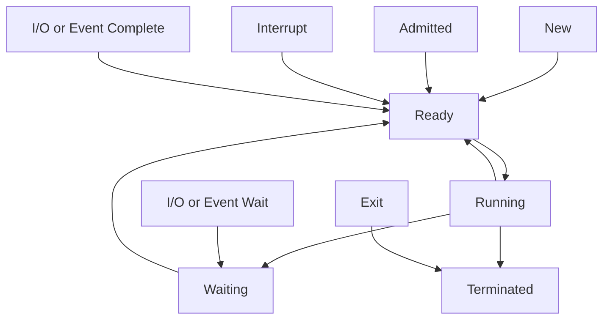
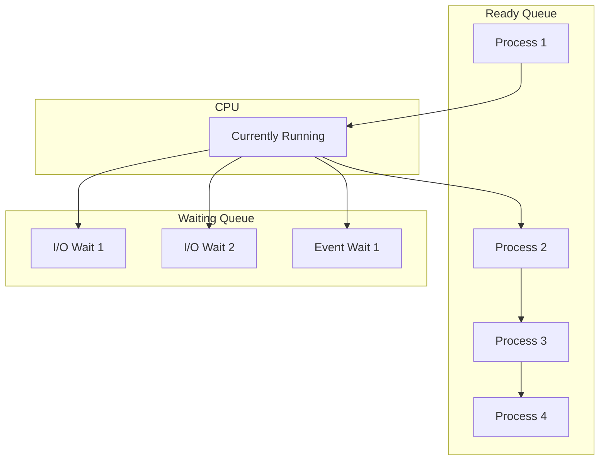

# ⏰ **Process Scheduling**

## 📘 **Theory**

Process scheduling is the mechanism by which the operating system decides which process gets to use the CPU and for how long. It's a critical component of multitasking operating systems that ensures fair and efficient resource utilization.

### **Why Process Scheduling Matters**

- **CPU Utilization**: Maximizes CPU usage by keeping it busy
- **Throughput**: Increases the number of processes completed per unit time
- **Response Time**: Reduces waiting time for interactive processes
- **Fairness**: Ensures all processes get fair access to CPU
- **Deadline Management**: Meets real-time process deadlines
- **Resource Efficiency**: Optimizes system resource usage
- **User Experience**: Provides responsive system behavior
- **System Stability**: Prevents system overload and crashes

### **Key Concepts**

1. **Process States**: Ready, Running, Waiting, Terminated
2. **Scheduling Algorithms**: Different strategies for process selection
3. **Context Switching**: Saving and restoring process state
4. **Preemption**: Interrupting a running process
5. **Priority**: Process importance levels
6. **Quantum**: Time slice allocated to a process
7. **Turnaround Time**: Total time from submission to completion
8. **Waiting Time**: Time spent waiting in ready queue

### **Scheduling Algorithms**

1. **First-Come, First-Served (FCFS)**: Processes served in arrival order
2. **Shortest Job First (SJF)**: Shortest processes scheduled first
3. **Priority Scheduling**: Processes scheduled by priority
4. **Round Robin (RR)**: Equal time slices for all processes
5. **Multilevel Queue**: Different queues for different process types
6. **Multilevel Feedback Queue**: Dynamic priority adjustment
7. **Real-Time Scheduling**: Meeting deadline requirements
8. **Load Balancing**: Distributing processes across CPUs

### **Common Pitfalls and Best Practices**

- **Starvation**: Low-priority processes never get CPU time
- **Convoy Effect**: Short processes wait for long processes
- **Context Switch Overhead**: Minimize context switching
- **Priority Inversion**: High-priority processes blocked by low-priority
- **Deadlock**: Circular waiting for resources
- **Fairness**: Ensure fair resource allocation
- **Performance**: Balance between fairness and efficiency
- **Real-time Requirements**: Meet timing constraints

## 📊 **Diagrams**

### **Process State Transition**



### **Scheduling Queue Structure**



### **Round Robin Scheduling**

```mermaid
gantt
    title Round Robin Scheduling (Time Quantum = 2)
    dateFormat X
    axisFormat %s

    section Process A
    Running    :0, 2
    Ready      :2, 6
    Running    :6, 8

    section Process B
    Ready      :0, 2
    Running    :2, 4
    Ready      :4, 8
    Running    :8, 10

    section Process C
    Ready      :0, 4
    Running    :4, 6
    Ready      :6, 10
    Running    :10, 12
```



## 🧩 **Example**

**Scenario**: Implement a process scheduler with multiple scheduling algorithms

**Input**:

- Processes: P1(0, 8), P2(1, 4), P3(2, 9), P4(3, 5)
- Time quantum: 2
- Scheduling algorithms: FCFS, SJF, Priority, Round Robin

**Expected Output**:

- Execution order for each algorithm
- Average waiting time and turnaround time
- Gantt chart showing process execution
- Performance comparison

**Step-by-step**:

1. Implement different scheduling algorithms
2. Create process queue and scheduler
3. Execute processes using each algorithm
4. Calculate performance metrics
5. Compare algorithm performance
6. Generate execution timeline

## 💻 **Implementation (Golang)**

```go
package main

import (
    "fmt"
    "sort"
    "time"
)

// Process represents a process in the system
type Process struct {
    ID           int
    ArrivalTime  int
    BurstTime    int
    Priority     int
    RemainingTime int
    StartTime    int
    EndTime      int
    WaitingTime  int
    TurnaroundTime int
}

// Scheduler represents a process scheduler
type Scheduler struct {
    processes []Process
    algorithm string
    quantum   int
}

// NewScheduler creates a new scheduler
func NewScheduler(processes []Process, algorithm string, quantum int) *Scheduler {
    return &Scheduler{
        processes: processes,
        algorithm: algorithm,
        quantum:   quantum,
    }
}

// FCFS implements First-Come, First-Served scheduling
func (s *Scheduler) FCFS() []Process {
    // Sort processes by arrival time
    sortedProcesses := make([]Process, len(s.processes))
    copy(sortedProcesses, s.processes)
    sort.Slice(sortedProcesses, func(i, j int) bool {
        return sortedProcesses[i].ArrivalTime < sortedProcesses[j].ArrivalTime
    })

    currentTime := 0
    for i := range sortedProcesses {
        if sortedProcesses[i].ArrivalTime > currentTime {
            currentTime = sortedProcesses[i].ArrivalTime
        }

        sortedProcesses[i].StartTime = currentTime
        sortedProcesses[i].EndTime = currentTime + sortedProcesses[i].BurstTime
        sortedProcesses[i].WaitingTime = sortedProcesses[i].StartTime - sortedProcesses[i].ArrivalTime
        sortedProcesses[i].TurnaroundTime = sortedProcesses[i].EndTime - sortedProcesses[i].ArrivalTime

        currentTime = sortedProcesses[i].EndTime
    }

    return sortedProcesses
}

// SJF implements Shortest Job First scheduling
func (s *Scheduler) SJF() []Process {
    // Sort processes by arrival time first
    sortedProcesses := make([]Process, len(s.processes))
    copy(sortedProcesses, s.processes)
    sort.Slice(sortedProcesses, func(i, j int) bool {
        return sortedProcesses[i].ArrivalTime < sortedProcesses[j].ArrivalTime
    })

    currentTime := 0
    completed := 0
    readyQueue := []Process{}

    for completed < len(sortedProcesses) {
        // Add processes that have arrived
        for i := completed; i < len(sortedProcesses); i++ {
            if sortedProcesses[i].ArrivalTime <= currentTime {
                readyQueue = append(readyQueue, sortedProcesses[i])
            }
        }

        if len(readyQueue) == 0 {
            currentTime++
            continue
        }

        // Sort ready queue by burst time
        sort.Slice(readyQueue, func(i, j int) bool {
            return readyQueue[i].BurstTime < readyQueue[j].BurstTime
        })

        // Execute shortest job
        process := readyQueue[0]
        readyQueue = readyQueue[1:]

        process.StartTime = currentTime
        process.EndTime = currentTime + process.BurstTime
        process.WaitingTime = process.StartTime - process.ArrivalTime
        process.TurnaroundTime = process.EndTime - process.ArrivalTime

        currentTime = process.EndTime
        completed++

        // Update the original array
        for i := range sortedProcesses {
            if sortedProcesses[i].ID == process.ID {
                sortedProcesses[i] = process
                break
            }
        }
    }

    return sortedProcesses
}

// Priority implements Priority scheduling
func (s *Scheduler) Priority() []Process {
    // Sort processes by arrival time first
    sortedProcesses := make([]Process, len(s.processes))
    copy(sortedProcesses, s.processes)
    sort.Slice(sortedProcesses, func(i, j int) bool {
        return sortedProcesses[i].ArrivalTime < sortedProcesses[j].ArrivalTime
    })

    currentTime := 0
    completed := 0
    readyQueue := []Process{}

    for completed < len(sortedProcesses) {
        // Add processes that have arrived
        for i := completed; i < len(sortedProcesses); i++ {
            if sortedProcesses[i].ArrivalTime <= currentTime {
                readyQueue = append(readyQueue, sortedProcesses[i])
            }
        }

        if len(readyQueue) == 0 {
            currentTime++
            continue
        }

        // Sort ready queue by priority (lower number = higher priority)
        sort.Slice(readyQueue, func(i, j int) bool {
            return readyQueue[i].Priority < readyQueue[j].Priority
        })

        // Execute highest priority process
        process := readyQueue[0]
        readyQueue = readyQueue[1:]

        process.StartTime = currentTime
        process.EndTime = currentTime + process.BurstTime
        process.WaitingTime = process.StartTime - process.ArrivalTime
        process.TurnaroundTime = process.EndTime - process.ArrivalTime

        currentTime = process.EndTime
        completed++

        // Update the original array
        for i := range sortedProcesses {
            if sortedProcesses[i].ID == process.ID {
                sortedProcesses[i] = process
                break
            }
        }
    }

    return sortedProcesses
}

// RoundRobin implements Round Robin scheduling
func (s *Scheduler) RoundRobin() []Process {
    // Sort processes by arrival time
    sortedProcesses := make([]Process, len(s.processes))
    copy(sortedProcesses, s.processes)
    sort.Slice(sortedProcesses, func(i, j int) bool {
        return sortedProcesses[i].ArrivalTime < sortedProcesses[j].ArrivalTime
    })

    // Initialize remaining time
    for i := range sortedProcesses {
        sortedProcesses[i].RemainingTime = sortedProcesses[i].BurstTime
    }

    currentTime := 0
    readyQueue := []Process{}
    completed := 0
    processIndex := 0

    // Add first process
    if len(sortedProcesses) > 0 {
        readyQueue = append(readyQueue, sortedProcesses[0])
        processIndex++
    }

    for completed < len(sortedProcesses) {
        if len(readyQueue) == 0 {
            currentTime++
            continue
        }

        // Get next process from ready queue
        process := readyQueue[0]
        readyQueue = readyQueue[1:]

        // Set start time if not set
        if process.StartTime == 0 {
            process.StartTime = currentTime
        }

        // Execute for quantum or remaining time
        executionTime := s.quantum
        if process.RemainingTime < s.quantum {
            executionTime = process.RemainingTime
        }

        process.RemainingTime -= executionTime
        currentTime += executionTime

        // Add new processes that have arrived
        for processIndex < len(sortedProcesses) {
            if sortedProcesses[processIndex].ArrivalTime <= currentTime {
                readyQueue = append(readyQueue, sortedProcesses[processIndex])
                processIndex++
            } else {
                break
            }
        }

        // If process is not completed, add it back to ready queue
        if process.RemainingTime > 0 {
            readyQueue = append(readyQueue, process)
        } else {
            // Process completed
            process.EndTime = currentTime
            process.WaitingTime = process.StartTime - process.ArrivalTime
            process.TurnaroundTime = process.EndTime - process.ArrivalTime
            completed++

            // Update the original array
            for i := range sortedProcesses {
                if sortedProcesses[i].ID == process.ID {
                    sortedProcesses[i] = process
                    break
                }
            }
        }
    }

    return sortedProcesses
}

// CalculateMetrics calculates average waiting time and turnaround time
func (s *Scheduler) CalculateMetrics(processes []Process) (float64, float64) {
    totalWaitingTime := 0
    totalTurnaroundTime := 0

    for _, process := range processes {
        totalWaitingTime += process.WaitingTime
        totalTurnaroundTime += process.TurnaroundTime
    }

    avgWaitingTime := float64(totalWaitingTime) / float64(len(processes))
    avgTurnaroundTime := float64(totalTurnaroundTime) / float64(len(processes))

    return avgWaitingTime, avgTurnaroundTime
}

// PrintGanttChart prints a Gantt chart for the processes
func (s *Scheduler) PrintGanttChart(processes []Process) {
    fmt.Println("Gantt Chart:")
    fmt.Println("Process | Start | End | Duration")
    fmt.Println("--------|-------|-----|---------")

    for _, process := range processes {
        duration := process.EndTime - process.StartTime
        fmt.Printf("P%d     | %5d | %3d | %8d\n",
            process.ID, process.StartTime, process.EndTime, duration)
    }
}

// PrintProcessTable prints a detailed process table
func (s *Scheduler) PrintProcessTable(processes []Process) {
    fmt.Println("Process Details:")
    fmt.Println("ID | Arrival | Burst | Priority | Start | End | Waiting | Turnaround")
    fmt.Println("---|---------|-------|----------|-------|-----|---------|-----------")

    for _, process := range processes {
        fmt.Printf("%2d | %7d | %5d | %8d | %5d | %3d | %7d | %10d\n",
            process.ID, process.ArrivalTime, process.BurstTime, process.Priority,
            process.StartTime, process.EndTime, process.WaitingTime, process.TurnaroundTime)
    }
}

// CompareAlgorithms compares different scheduling algorithms
func (s *Scheduler) CompareAlgorithms() {
    algorithms := []string{"FCFS", "SJF", "Priority", "Round Robin"}

    fmt.Println("Scheduling Algorithm Comparison")
    fmt.Println("===============================")
    fmt.Println("Algorithm    | Avg Waiting Time | Avg Turnaround Time")
    fmt.Println("-------------|------------------|-------------------")

    for _, algo := range algorithms {
        var processes []Process
        switch algo {
        case "FCFS":
            processes = s.FCFS()
        case "SJF":
            processes = s.SJF()
        case "Priority":
            processes = s.Priority()
        case "Round Robin":
            processes = s.RoundRobin()
        }

        avgWaiting, avgTurnaround := s.CalculateMetrics(processes)
        fmt.Printf("%-12s | %16.2f | %19.2f\n", algo, avgWaiting, avgTurnaround)
    }
}

// Example usage
func main() {
    // Create sample processes
    processes := []Process{
        {ID: 1, ArrivalTime: 0, BurstTime: 8, Priority: 3},
        {ID: 2, ArrivalTime: 1, BurstTime: 4, Priority: 1},
        {ID: 3, ArrivalTime: 2, BurstTime: 9, Priority: 2},
        {ID: 4, ArrivalTime: 3, BurstTime: 5, Priority: 4},
    }

    // Create scheduler
    scheduler := NewScheduler(processes, "Round Robin", 2)

    // Test FCFS
    fmt.Println("=== First-Come, First-Served (FCFS) ===")
    fcfsProcesses := scheduler.FCFS()
    scheduler.PrintProcessTable(fcfsProcesses)
    avgWaiting, avgTurnaround := scheduler.CalculateMetrics(fcfsProcesses)
    fmt.Printf("Average Waiting Time: %.2f\n", avgWaiting)
    fmt.Printf("Average Turnaround Time: %.2f\n", avgTurnaround)
    scheduler.PrintGanttChart(fcfsProcesses)
    fmt.Println()

    // Test SJF
    fmt.Println("=== Shortest Job First (SJF) ===")
    sjfProcesses := scheduler.SJF()
    scheduler.PrintProcessTable(sjfProcesses)
    avgWaiting, avgTurnaround = scheduler.CalculateMetrics(sjfProcesses)
    fmt.Printf("Average Waiting Time: %.2f\n", avgWaiting)
    fmt.Printf("Average Turnaround Time: %.2f\n", avgTurnaround)
    scheduler.PrintGanttChart(sjfProcesses)
    fmt.Println()

    // Test Priority
    fmt.Println("=== Priority Scheduling ===")
    priorityProcesses := scheduler.Priority()
    scheduler.PrintProcessTable(priorityProcesses)
    avgWaiting, avgTurnaround = scheduler.CalculateMetrics(priorityProcesses)
    fmt.Printf("Average Waiting Time: %.2f\n", avgWaiting)
    fmt.Printf("Average Turnaround Time: %.2f\n", avgTurnaround)
    scheduler.PrintGanttChart(priorityProcesses)
    fmt.Println()

    // Test Round Robin
    fmt.Println("=== Round Robin (Quantum = 2) ===")
    rrProcesses := scheduler.RoundRobin()
    scheduler.PrintProcessTable(rrProcesses)
    avgWaiting, avgTurnaround = scheduler.CalculateMetrics(rrProcesses)
    fmt.Printf("Average Waiting Time: %.2f\n", avgWaiting)
    fmt.Printf("Average Turnaround Time: %.2f\n", avgTurnaround)
    scheduler.PrintGanttChart(rrProcesses)
    fmt.Println()

    // Compare all algorithms
    scheduler.CompareAlgorithms()
}
```

## 💻 **Implementation (Node.js)**

```javascript
class Process {
  constructor(id, arrivalTime, burstTime, priority) {
    this.id = id;
    this.arrivalTime = arrivalTime;
    this.burstTime = burstTime;
    this.priority = priority;
    this.remainingTime = burstTime;
    this.startTime = 0;
    this.endTime = 0;
    this.waitingTime = 0;
    this.turnaroundTime = 0;
  }
}

class Scheduler {
  constructor(processes, algorithm, quantum) {
    this.processes = processes;
    this.algorithm = algorithm;
    this.quantum = quantum;
  }

  fcfs() {
    // Sort processes by arrival time
    const sortedProcesses = [...this.processes].sort(
      (a, b) => a.arrivalTime - b.arrivalTime
    );

    let currentTime = 0;
    for (const process of sortedProcesses) {
      if (process.arrivalTime > currentTime) {
        currentTime = process.arrivalTime;
      }

      process.startTime = currentTime;
      process.endTime = currentTime + process.burstTime;
      process.waitingTime = process.startTime - process.arrivalTime;
      process.turnaroundTime = process.endTime - process.arrivalTime;

      currentTime = process.endTime;
    }

    return sortedProcesses;
  }

  sjf() {
    // Sort processes by arrival time first
    const sortedProcesses = [...this.processes].sort(
      (a, b) => a.arrivalTime - b.arrivalTime
    );

    let currentTime = 0;
    let completed = 0;
    let readyQueue = [];

    while (completed < sortedProcesses.length) {
      // Add processes that have arrived
      for (let i = completed; i < sortedProcesses.length; i++) {
        if (sortedProcesses[i].arrivalTime <= currentTime) {
          readyQueue.push(sortedProcesses[i]);
        }
      }

      if (readyQueue.length === 0) {
        currentTime++;
        continue;
      }

      // Sort ready queue by burst time
      readyQueue.sort((a, b) => a.burstTime - b.burstTime);

      // Execute shortest job
      const process = readyQueue.shift();

      process.startTime = currentTime;
      process.endTime = currentTime + process.burstTime;
      process.waitingTime = process.startTime - process.arrivalTime;
      process.turnaroundTime = process.endTime - process.arrivalTime;

      currentTime = process.endTime;
      completed++;

      // Update the original array
      const index = sortedProcesses.findIndex((p) => p.id === process.id);
      if (index !== -1) {
        sortedProcesses[index] = process;
      }
    }

    return sortedProcesses;
  }

  priority() {
    // Sort processes by arrival time first
    const sortedProcesses = [...this.processes].sort(
      (a, b) => a.arrivalTime - b.arrivalTime
    );

    let currentTime = 0;
    let completed = 0;
    let readyQueue = [];

    while (completed < sortedProcesses.length) {
      // Add processes that have arrived
      for (let i = completed; i < sortedProcesses.length; i++) {
        if (sortedProcesses[i].arrivalTime <= currentTime) {
          readyQueue.push(sortedProcesses[i]);
        }
      }

      if (readyQueue.length === 0) {
        currentTime++;
        continue;
      }

      // Sort ready queue by priority (lower number = higher priority)
      readyQueue.sort((a, b) => a.priority - b.priority);

      // Execute highest priority process
      const process = readyQueue.shift();

      process.startTime = currentTime;
      process.endTime = currentTime + process.burstTime;
      process.waitingTime = process.startTime - process.arrivalTime;
      process.turnaroundTime = process.endTime - process.arrivalTime;

      currentTime = process.endTime;
      completed++;

      // Update the original array
      const index = sortedProcesses.findIndex((p) => p.id === process.id);
      if (index !== -1) {
        sortedProcesses[index] = process;
      }
    }

    return sortedProcesses;
  }

  roundRobin() {
    // Sort processes by arrival time
    const sortedProcesses = [...this.processes].sort(
      (a, b) => a.arrivalTime - b.arrivalTime
    );

    // Initialize remaining time
    for (const process of sortedProcesses) {
      process.remainingTime = process.burstTime;
    }

    let currentTime = 0;
    let readyQueue = [];
    let completed = 0;
    let processIndex = 0;

    // Add first process
    if (sortedProcesses.length > 0) {
      readyQueue.push(sortedProcesses[0]);
      processIndex++;
    }

    while (completed < sortedProcesses.length) {
      if (readyQueue.length === 0) {
        currentTime++;
        continue;
      }

      // Get next process from ready queue
      const process = readyQueue.shift();

      // Set start time if not set
      if (process.startTime === 0) {
        process.startTime = currentTime;
      }

      // Execute for quantum or remaining time
      const executionTime = Math.min(this.quantum, process.remainingTime);

      process.remainingTime -= executionTime;
      currentTime += executionTime;

      // Add new processes that have arrived
      while (processIndex < sortedProcesses.length) {
        if (sortedProcesses[processIndex].arrivalTime <= currentTime) {
          readyQueue.push(sortedProcesses[processIndex]);
          processIndex++;
        } else {
          break;
        }
      }

      // If process is not completed, add it back to ready queue
      if (process.remainingTime > 0) {
        readyQueue.push(process);
      } else {
        // Process completed
        process.endTime = currentTime;
        process.waitingTime = process.startTime - process.arrivalTime;
        process.turnaroundTime = process.endTime - process.arrivalTime;
        completed++;

        // Update the original array
        const index = sortedProcesses.findIndex((p) => p.id === process.id);
        if (index !== -1) {
          sortedProcesses[index] = process;
        }
      }
    }

    return sortedProcesses;
  }

  calculateMetrics(processes) {
    const totalWaitingTime = processes.reduce(
      (sum, process) => sum + process.waitingTime,
      0
    );
    const totalTurnaroundTime = processes.reduce(
      (sum, process) => sum + process.turnaroundTime,
      0
    );

    const avgWaitingTime = totalWaitingTime / processes.length;
    const avgTurnaroundTime = totalTurnaroundTime / processes.length;

    return { avgWaitingTime, avgTurnaroundTime };
  }

  printGanttChart(processes) {
    console.log("Gantt Chart:");
    console.log("Process | Start | End | Duration");
    console.log("--------|-------|-----|---------");

    for (const process of processes) {
      const duration = process.endTime - process.startTime;
      console.log(
        `P${process.id}     | ${process.startTime
          .toString()
          .padStart(5)} | ${process.endTime.toString().padStart(3)} | ${duration
          .toString()
          .padStart(8)}`
      );
    }
  }

  printProcessTable(processes) {
    console.log("Process Details:");
    console.log(
      "ID | Arrival | Burst | Priority | Start | End | Waiting | Turnaround"
    );
    console.log(
      "---|---------|-------|----------|-------|-----|---------|-----------"
    );

    for (const process of processes) {
      console.log(
        `${process.id.toString().padStart(2)} | ${process.arrivalTime
          .toString()
          .padStart(7)} | ${process.burstTime
          .toString()
          .padStart(5)} | ${process.priority
          .toString()
          .padStart(8)} | ${process.startTime
          .toString()
          .padStart(5)} | ${process.endTime
          .toString()
          .padStart(3)} | ${process.waitingTime
          .toString()
          .padStart(7)} | ${process.turnaroundTime.toString().padStart(10)}`
      );
    }
  }

  compareAlgorithms() {
    const algorithms = ["FCFS", "SJF", "Priority", "Round Robin"];

    console.log("Scheduling Algorithm Comparison");
    console.log("===============================");
    console.log("Algorithm    | Avg Waiting Time | Avg Turnaround Time");
    console.log("-------------|------------------|-------------------");

    for (const algo of algorithms) {
      let processes;
      switch (algo) {
        case "FCFS":
          processes = this.fcfs();
          break;
        case "SJF":
          processes = this.sjf();
          break;
        case "Priority":
          processes = this.priority();
          break;
        case "Round Robin":
          processes = this.roundRobin();
          break;
      }

      const { avgWaitingTime, avgTurnaroundTime } =
        this.calculateMetrics(processes);
      console.log(
        `${algo.padEnd(12)} | ${avgWaitingTime
          .toFixed(2)
          .padStart(16)} | ${avgTurnaroundTime.toFixed(2).padStart(19)}`
      );
    }
  }
}

// Example usage
function main() {
  // Create sample processes
  const processes = [
    new Process(1, 0, 8, 3),
    new Process(2, 1, 4, 1),
    new Process(3, 2, 9, 2),
    new Process(4, 3, 5, 4),
  ];

  // Create scheduler
  const scheduler = new Scheduler(processes, "Round Robin", 2);

  // Test FCFS
  console.log("=== First-Come, First-Served (FCFS) ===");
  const fcfsProcesses = scheduler.fcfs();
  scheduler.printProcessTable(fcfsProcesses);
  const { avgWaitingTime, avgTurnaroundTime } =
    scheduler.calculateMetrics(fcfsProcesses);
  console.log(`Average Waiting Time: ${avgWaitingTime.toFixed(2)}`);
  console.log(`Average Turnaround Time: ${avgTurnaroundTime.toFixed(2)}`);
  scheduler.printGanttChart(fcfsProcesses);
  console.log();

  // Test SJF
  console.log("=== Shortest Job First (SJF) ===");
  const sjfProcesses = scheduler.sjf();
  scheduler.printProcessTable(sjfProcesses);
  const sjfMetrics = scheduler.calculateMetrics(sjfProcesses);
  console.log(`Average Waiting Time: ${sjfMetrics.avgWaitingTime.toFixed(2)}`);
  console.log(
    `Average Turnaround Time: ${sjfMetrics.avgTurnaroundTime.toFixed(2)}`
  );
  scheduler.printGanttChart(sjfProcesses);
  console.log();

  // Test Priority
  console.log("=== Priority Scheduling ===");
  const priorityProcesses = scheduler.priority();
  scheduler.printProcessTable(priorityProcesses);
  const priorityMetrics = scheduler.calculateMetrics(priorityProcesses);
  console.log(
    `Average Waiting Time: ${priorityMetrics.avgWaitingTime.toFixed(2)}`
  );
  console.log(
    `Average Turnaround Time: ${priorityMetrics.avgTurnaroundTime.toFixed(2)}`
  );
  scheduler.printGanttChart(priorityProcesses);
  console.log();

  // Test Round Robin
  console.log("=== Round Robin (Quantum = 2) ===");
  const rrProcesses = scheduler.roundRobin();
  scheduler.printProcessTable(rrProcesses);
  const rrMetrics = scheduler.calculateMetrics(rrProcesses);
  console.log(`Average Waiting Time: ${rrMetrics.avgWaitingTime.toFixed(2)}`);
  console.log(
    `Average Turnaround Time: ${rrMetrics.avgTurnaroundTime.toFixed(2)}`
  );
  scheduler.printGanttChart(rrProcesses);
  console.log();

  // Compare all algorithms
  scheduler.compareAlgorithms();
}

// Run the example
main();
```

## ⏱ **Complexity Analysis**

### **Time Complexity**

- **FCFS**: O(n log n) for sorting
- **SJF**: O(n²) for each process selection
- **Priority**: O(n²) for each process selection
- **Round Robin**: O(n) for each time quantum
- **Context Switching**: O(1) for each switch

### **Space Complexity**

- **Process Storage**: O(n) where n is number of processes
- **Ready Queue**: O(n) where n is number of processes
- **Scheduler State**: O(1) for scheduler state
- **Overall**: O(n) where n is number of processes

## 🚀 **Optimal Solution**

The optimal process scheduling solution includes:

1. **Appropriate Algorithm**: Choose algorithm based on system requirements
2. **Fairness**: Ensure fair resource allocation
3. **Efficiency**: Minimize context switching and overhead
4. **Real-time Support**: Meet timing constraints for real-time processes
5. **Load Balancing**: Distribute processes across multiple CPUs
6. **Priority Management**: Handle priority inversion and starvation
7. **Performance Monitoring**: Monitor and optimize performance
8. **Adaptive Scheduling**: Adjust scheduling based on system load

### **Production Considerations**

- Use appropriate scheduling algorithm for your use case
- Implement proper priority management
- Handle real-time requirements if needed
- Monitor system performance and adjust accordingly
- Implement proper error handling and recovery
- Use efficient data structures for process queues
- Consider multi-core systems and load balancing
- Implement proper testing and validation

## ❓ **Follow-up Questions**

### **How would this scale with X?**

- **Many Processes**: Use efficient data structures and algorithms
- **Real-time Requirements**: Use real-time scheduling algorithms
- **Multi-core Systems**: Use load balancing and parallel processing

### **How can we optimize further if Y changes?**

- **Performance Requirements**: Use optimized algorithms and data structures
- **Memory Constraints**: Use efficient memory management
- **Latency Requirements**: Use preemptive scheduling and priority management

### **What trade-offs exist in different approaches?**

- **Fairness vs Performance**: Equal time vs optimal performance
- **Preemption vs Simplicity**: Interrupting processes vs simple implementation
- **Real-time vs General Purpose**: Meeting deadlines vs general efficiency
