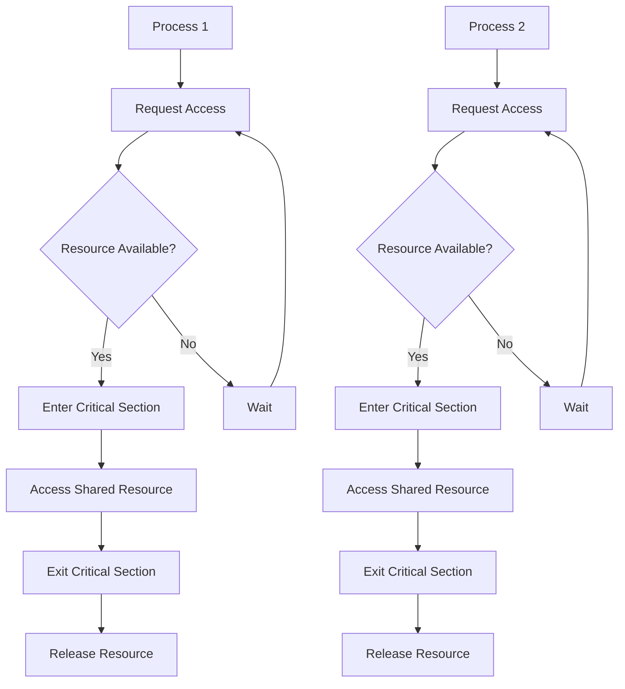

# Process Synchronization - Concurrency Control and Mutual Exclusion

## Overview

Process synchronization is the coordination of multiple processes to ensure they don't interfere with each other when accessing shared resources. It's essential for maintaining data consistency and preventing race conditions in concurrent systems.

## Key Concepts

- **Critical Section**: Code section that accesses shared resources
- **Mutual Exclusion**: Only one process can access critical section at a time
- **Race Condition**: Unpredictable behavior due to concurrent access
- **Deadlock**: Processes waiting indefinitely for each other
- **Starvation**: Process never gets access to resources
- **Semaphore**: Synchronization primitive for controlling access

## Synchronization Primitives

### 1. Mutex (Mutual Exclusion)
- Binary semaphore (0 or 1)
- Ensures only one process can access critical section
- Simple and efficient
- Can cause deadlock if not used properly

### 2. Semaphore
- Counter-based synchronization
- Can allow multiple processes (counting semaphore)
- More flexible than mutex
- Requires careful management

### 3. Condition Variables
- Used with mutexes for complex synchronization
- Allows processes to wait for specific conditions
- Enables efficient waiting and signaling
- More complex to implement

### 4. Monitors
- High-level synchronization construct
- Encapsulates shared data and operations
- Automatic mutual exclusion
- Easier to use but less flexible

## Process Synchronization Flow



## Go Implementation

```go
package main

import (
    "context"
    "fmt"
    "log"
    "sync"
    "sync/atomic"
    "time"
)

// Mutex represents a mutex lock
type Mutex struct {
    locked int32
    waiters []chan struct{}
    mutex   sync.Mutex
}

// NewMutex creates a new mutex
func NewMutex() *Mutex {
    return &Mutex{
        locked: 0,
        waiters: make([]chan struct{}, 0),
    }
}

// Lock acquires the mutex
func (m *Mutex) Lock() {
    m.mutex.Lock()
    defer m.mutex.Unlock()
    
    if atomic.CompareAndSwapInt32(&m.locked, 0, 1) {
        return
    }
    
    // Add to waiters
    waiter := make(chan struct{})
    m.waiters = append(m.waiters, waiter)
    m.mutex.Unlock()
    
    // Wait for signal
    <-waiter
}

// Unlock releases the mutex
func (m *Mutex) Unlock() {
    m.mutex.Lock()
    defer m.mutex.Unlock()
    
    if len(m.waiters) > 0 {
        // Signal next waiter
        waiter := m.waiters[0]
        m.waiters = m.waiters[1:]
        close(waiter)
    } else {
        atomic.StoreInt32(&m.locked, 0)
    }
}

// Semaphore represents a counting semaphore
type Semaphore struct {
    count int32
    waiters []chan struct{}
    mutex   sync.Mutex
}

// NewSemaphore creates a new semaphore
func NewSemaphore(initialCount int32) *Semaphore {
    return &Semaphore{
        count: initialCount,
        waiters: make([]chan struct{}, 0),
    }
}

// Acquire acquires a permit from the semaphore
func (s *Semaphore) Acquire() {
    s.mutex.Lock()
    defer s.mutex.Unlock()
    
    if s.count > 0 {
        s.count--
        return
    }
    
    // Add to waiters
    waiter := make(chan struct{})
    s.waiters = append(s.waiters, waiter)
    s.mutex.Unlock()
    
    // Wait for signal
    <-waiter
}

// Release releases a permit to the semaphore
func (s *Semaphore) Release() {
    s.mutex.Lock()
    defer s.mutex.Unlock()
    
    if len(s.waiters) > 0 {
        // Signal next waiter
        waiter := s.waiters[0]
        s.waiters = s.waiters[1:]
        close(waiter)
    } else {
        s.count++
    }
}

// ConditionVariable represents a condition variable
type ConditionVariable struct {
    waiters []chan struct{}
    mutex   sync.Mutex
}

// NewConditionVariable creates a new condition variable
func NewConditionVariable() *ConditionVariable {
    return &ConditionVariable{
        waiters: make([]chan struct{}, 0),
    }
}

// Wait waits for the condition to be signaled
func (cv *ConditionVariable) Wait(mutex *sync.Mutex) {
    cv.mutex.Lock()
    waiter := make(chan struct{})
    cv.waiters = append(cv.waiters, waiter)
    cv.mutex.Unlock()
    
    // Release mutex and wait
    mutex.Unlock()
    <-waiter
    mutex.Lock()
}

// Signal signals one waiting thread
func (cv *ConditionVariable) Signal() {
    cv.mutex.Lock()
    defer cv.mutex.Unlock()
    
    if len(cv.waiters) > 0 {
        waiter := cv.waiters[0]
        cv.waiters = cv.waiters[1:]
        close(waiter)
    }
}

// Broadcast signals all waiting threads
func (cv *ConditionVariable) Broadcast() {
    cv.mutex.Lock()
    defer cv.mutex.Unlock()
    
    for _, waiter := range cv.waiters {
        close(waiter)
    }
    cv.waiters = make([]chan struct{}, 0)
}

// Monitor represents a monitor for synchronization
type Monitor struct {
    mutex sync.Mutex
    condition *ConditionVariable
    data interface{}
}

// NewMonitor creates a new monitor
func NewMonitor() *Monitor {
    return &Monitor{
        condition: NewConditionVariable(),
    }
}

// Enter enters the monitor
func (m *Monitor) Enter() {
    m.mutex.Lock()
}

// Exit exits the monitor
func (m *Monitor) Exit() {
    m.mutex.Unlock()
}

// Wait waits for a condition
func (m *Monitor) Wait() {
    m.condition.Wait(&m.mutex)
}

// Signal signals a waiting thread
func (m *Monitor) Signal() {
    m.condition.Signal()
}

// Broadcast signals all waiting threads
func (m *Monitor) Broadcast() {
    m.condition.Broadcast()
}

// SetData sets the monitor's data
func (m *Monitor) SetData(data interface{}) {
    m.data = data
}

// GetData gets the monitor's data
func (m *Monitor) GetData() interface{} {
    return m.data
}

// SharedResource represents a shared resource
type SharedResource struct {
    value int
    mutex sync.Mutex
}

// NewSharedResource creates a new shared resource
func NewSharedResource(initialValue int) *SharedResource {
    return &SharedResource{
        value: initialValue,
    }
}

// Read reads the value
func (sr *SharedResource) Read() int {
    sr.mutex.Lock()
    defer sr.mutex.Unlock()
    
    return sr.value
}

// Write writes a value
func (sr *SharedResource) Write(value int) {
    sr.mutex.Lock()
    defer sr.mutex.Unlock()
    
    sr.value = value
}

// Increment increments the value
func (sr *SharedResource) Increment() {
    sr.mutex.Lock()
    defer sr.mutex.Unlock()
    
    sr.value++
}

// Decrement decrements the value
func (sr *SharedResource) Decrement() {
    sr.mutex.Lock()
    defer sr.mutex.Unlock()
    
    sr.value--
}

// Process represents a process
type Process struct {
    ID int
    resource *SharedResource
    semaphore *Semaphore
    mutex *Mutex
    monitor *Monitor
}

// NewProcess creates a new process
func NewProcess(id int, resource *SharedResource, semaphore *Semaphore, mutex *Mutex, monitor *Monitor) *Process {
    return &Process{
        ID: id,
        resource: resource,
        semaphore: semaphore,
        mutex: mutex,
        monitor: monitor,
    }
}

// Run runs the process
func (p *Process) Run(ctx context.Context) {
    for {
        select {
        case <-ctx.Done():
            return
        default:
            // Simulate some work
            time.Sleep(time.Duration(100+rand.Intn(200)) * time.Millisecond)
            
            // Access shared resource
            p.accessSharedResource()
        }
    }
}

// accessSharedResource accesses the shared resource
func (p *Process) accessSharedResource() {
    // Use semaphore
    p.semaphore.Acquire()
    defer p.semaphore.Release()
    
    // Use mutex
    p.mutex.Lock()
    defer p.mutex.Unlock()
    
    // Access resource
    oldValue := p.resource.Read()
    p.resource.Write(oldValue + 1)
    
    log.Printf("Process %d: Resource value changed from %d to %d", p.ID, oldValue, oldValue+1)
}

// ProducerConsumer represents a producer-consumer scenario
type ProducerConsumer struct {
    buffer []int
    size   int
    count  int
    mutex  sync.Mutex
    notEmpty *ConditionVariable
    notFull  *ConditionVariable
}

// NewProducerConsumer creates a new producer-consumer
func NewProducerConsumer(size int) *ProducerConsumer {
    return &ProducerConsumer{
        buffer: make([]int, size),
        size:   size,
        count:  0,
        notEmpty: NewConditionVariable(),
        notFull:  NewConditionVariable(),
    }
}

// Produce produces an item
func (pc *ProducerConsumer) Produce(item int) {
    pc.mutex.Lock()
    defer pc.mutex.Unlock()
    
    // Wait until buffer is not full
    for pc.count == pc.size {
        pc.notFull.Wait(&pc.mutex)
    }
    
    // Add item to buffer
    pc.buffer[pc.count] = item
    pc.count++
    
    log.Printf("Produced item %d, buffer count: %d", item, pc.count)
    
    // Signal that buffer is not empty
    pc.notEmpty.Signal()
}

// Consume consumes an item
func (pc *ProducerConsumer) Consume() int {
    pc.mutex.Lock()
    defer pc.mutex.Unlock()
    
    // Wait until buffer is not empty
    for pc.count == 0 {
        pc.notEmpty.Wait(&pc.mutex)
    }
    
    // Remove item from buffer
    item := pc.buffer[pc.count-1]
    pc.count--
    
    log.Printf("Consumed item %d, buffer count: %d", item, pc.count)
    
    // Signal that buffer is not full
    pc.notFull.Signal()
    
    return item
}

// ReaderWriter represents a reader-writer scenario
type ReaderWriter struct {
    readers int
    writers int
    mutex   sync.Mutex
    readCondition  *ConditionVariable
    writeCondition *ConditionVariable
}

// NewReaderWriter creates a new reader-writer
func NewReaderWriter() *ReaderWriter {
    return &ReaderWriter{
        readCondition:  NewConditionVariable(),
        writeCondition: NewConditionVariable(),
    }
}

// StartRead starts reading
func (rw *ReaderWriter) StartRead() {
    rw.mutex.Lock()
    defer rw.mutex.Unlock()
    
    // Wait until no writers
    for rw.writers > 0 {
        rw.readCondition.Wait(&rw.mutex)
    }
    
    rw.readers++
    log.Printf("Reader started, readers: %d", rw.readers)
}

// EndRead ends reading
func (rw *ReaderWriter) EndRead() {
    rw.mutex.Lock()
    defer rw.mutex.Unlock()
    
    rw.readers--
    log.Printf("Reader ended, readers: %d", rw.readers)
    
    // Signal writers if no readers
    if rw.readers == 0 {
        rw.writeCondition.Signal()
    }
}

// StartWrite starts writing
func (rw *ReaderWriter) StartWrite() {
    rw.mutex.Lock()
    defer rw.mutex.Unlock()
    
    // Wait until no readers or writers
    for rw.readers > 0 || rw.writers > 0 {
        rw.writeCondition.Wait(&rw.mutex)
    }
    
    rw.writers++
    log.Printf("Writer started, writers: %d", rw.writers)
}

// EndWrite ends writing
func (rw *ReaderWriter) EndWrite() {
    rw.mutex.Lock()
    defer rw.mutex.Unlock()
    
    rw.writers--
    log.Printf("Writer ended, writers: %d", rw.writers)
    
    // Signal readers and writers
    rw.readCondition.Broadcast()
    rw.writeCondition.Signal()
}

// Example usage
func main() {
    // Create shared resource
    resource := NewSharedResource(0)
    
    // Create synchronization primitives
    semaphore := NewSemaphore(2) // Allow 2 concurrent accesses
    mutex := NewMutex()
    monitor := NewMonitor()
    
    // Create processes
    processes := make([]*Process, 5)
    for i := 0; i < 5; i++ {
        processes[i] = NewProcess(i, resource, semaphore, mutex, monitor)
    }
    
    // Create context for cancellation
    ctx, cancel := context.WithTimeout(context.Background(), 5*time.Second)
    defer cancel()
    
    // Start processes
    var wg sync.WaitGroup
    for _, process := range processes {
        wg.Add(1)
        go func(p *Process) {
            defer wg.Done()
            p.Run(ctx)
        }(process)
    }
    
    // Wait for processes to complete
    wg.Wait()
    
    // Test producer-consumer
    log.Println("\nTesting Producer-Consumer:")
    pc := NewProducerConsumer(3)
    
    // Start producer
    go func() {
        for i := 0; i < 10; i++ {
            pc.Produce(i)
            time.Sleep(100 * time.Millisecond)
        }
    }()
    
    // Start consumer
    go func() {
        for i := 0; i < 10; i++ {
            item := pc.Consume()
            time.Sleep(150 * time.Millisecond)
            _ = item
        }
    }()
    
    time.Sleep(3 * time.Second)
    
    // Test reader-writer
    log.Println("\nTesting Reader-Writer:")
    rw := NewReaderWriter()
    
    // Start readers
    for i := 0; i < 3; i++ {
        go func(id int) {
            for j := 0; j < 5; j++ {
                rw.StartRead()
                time.Sleep(100 * time.Millisecond)
                rw.EndRead()
                time.Sleep(200 * time.Millisecond)
            }
        }(i)
    }
    
    // Start writers
    for i := 0; i < 2; i++ {
        go func(id int) {
            for j := 0; j < 3; j++ {
                rw.StartWrite()
                time.Sleep(200 * time.Millisecond)
                rw.EndWrite()
                time.Sleep(300 * time.Millisecond)
            }
        }(i)
    }
    
    time.Sleep(5 * time.Second)
    
    log.Printf("Final resource value: %d", resource.Read())
}
```

## Node.js Implementation

```javascript
class Mutex {
  constructor() {
    this.locked = false;
    this.waiters = [];
  }

  async lock() {
    if (!this.locked) {
      this.locked = true;
      return;
    }

    return new Promise((resolve) => {
      this.waiters.push(resolve);
    });
  }

  unlock() {
    if (this.waiters.length > 0) {
      const waiter = this.waiters.shift();
      waiter();
    } else {
      this.locked = false;
    }
  }
}

class Semaphore {
  constructor(initialCount) {
    this.count = initialCount;
    this.waiters = [];
  }

  async acquire() {
    if (this.count > 0) {
      this.count--;
      return;
    }

    return new Promise((resolve) => {
      this.waiters.push(resolve);
    });
  }

  release() {
    if (this.waiters.length > 0) {
      const waiter = this.waiters.shift();
      waiter();
    } else {
      this.count++;
    }
  }
}

class ConditionVariable {
  constructor() {
    this.waiters = [];
  }

  async wait(mutex) {
    const waiter = new Promise((resolve) => {
      this.waiters.push(resolve);
    });
    
    mutex.unlock();
    await waiter;
    await mutex.lock();
  }

  signal() {
    if (this.waiters.length > 0) {
      const waiter = this.waiters.shift();
      waiter();
    }
  }

  broadcast() {
    for (const waiter of this.waiters) {
      waiter();
    }
    this.waiters = [];
  }
}

class Monitor {
  constructor() {
    this.mutex = new Mutex();
    this.condition = new ConditionVariable();
    this.data = null;
  }

  async enter() {
    await this.mutex.lock();
  }

  exit() {
    this.mutex.unlock();
  }

  async wait() {
    await this.condition.wait(this.mutex);
  }

  signal() {
    this.condition.signal();
  }

  broadcast() {
    this.condition.broadcast();
  }

  setData(data) {
    this.data = data;
  }

  getData() {
    return this.data;
  }
}

class SharedResource {
  constructor(initialValue) {
    this.value = initialValue;
    this.mutex = new Mutex();
  }

  async read() {
    await this.mutex.lock();
    const value = this.value;
    this.mutex.unlock();
    return value;
  }

  async write(value) {
    await this.mutex.lock();
    this.value = value;
    this.mutex.unlock();
  }

  async increment() {
    await this.mutex.lock();
    this.value++;
    this.mutex.unlock();
  }

  async decrement() {
    await this.mutex.lock();
    this.value--;
    this.mutex.unlock();
  }
}

class Process {
  constructor(id, resource, semaphore, mutex, monitor) {
    this.id = id;
    this.resource = resource;
    this.semaphore = semaphore;
    this.mutex = mutex;
    this.monitor = monitor;
  }

  async run() {
    while (true) {
      // Simulate some work
      await new Promise(resolve => setTimeout(resolve, 100 + Math.random() * 200));
      
      // Access shared resource
      await this.accessSharedResource();
    }
  }

  async accessSharedResource() {
    // Use semaphore
    await this.semaphore.acquire();
    
    try {
      // Use mutex
      await this.mutex.lock();
      
      try {
        // Access resource
        const oldValue = await this.resource.read();
        await this.resource.write(oldValue + 1);
        
        console.log(`Process ${this.id}: Resource value changed from ${oldValue} to ${oldValue + 1}`);
      } finally {
        this.mutex.unlock();
      }
    } finally {
      this.semaphore.release();
    }
  }
}

class ProducerConsumer {
  constructor(size) {
    this.buffer = new Array(size);
    this.size = size;
    this.count = 0;
    this.mutex = new Mutex();
    this.notEmpty = new ConditionVariable();
    this.notFull = new ConditionVariable();
  }

  async produce(item) {
    await this.mutex.lock();
    
    try {
      // Wait until buffer is not full
      while (this.count === this.size) {
        await this.notFull.wait(this.mutex);
      }
      
      // Add item to buffer
      this.buffer[this.count] = item;
      this.count++;
      
      console.log(`Produced item ${item}, buffer count: ${this.count}`);
      
      // Signal that buffer is not empty
      this.notEmpty.signal();
    } finally {
      this.mutex.unlock();
    }
  }

  async consume() {
    await this.mutex.lock();
    
    try {
      // Wait until buffer is not empty
      while (this.count === 0) {
        await this.notEmpty.wait(this.mutex);
      }
      
      // Remove item from buffer
      const item = this.buffer[this.count - 1];
      this.count--;
      
      console.log(`Consumed item ${item}, buffer count: ${this.count}`);
      
      // Signal that buffer is not full
      this.notFull.signal();
      
      return item;
    } finally {
      this.mutex.unlock();
    }
  }
}

class ReaderWriter {
  constructor() {
    this.readers = 0;
    this.writers = 0;
    this.mutex = new Mutex();
    this.readCondition = new ConditionVariable();
    this.writeCondition = new ConditionVariable();
  }

  async startRead() {
    await this.mutex.lock();
    
    try {
      // Wait until no writers
      while (this.writers > 0) {
        await this.readCondition.wait(this.mutex);
      }
      
      this.readers++;
      console.log(`Reader started, readers: ${this.readers}`);
    } finally {
      this.mutex.unlock();
    }
  }

  async endRead() {
    await this.mutex.lock();
    
    try {
      this.readers--;
      console.log(`Reader ended, readers: ${this.readers}`);
      
      // Signal writers if no readers
      if (this.readers === 0) {
        this.writeCondition.signal();
      }
    } finally {
      this.mutex.unlock();
    }
  }

  async startWrite() {
    await this.mutex.lock();
    
    try {
      // Wait until no readers or writers
      while (this.readers > 0 || this.writers > 0) {
        await this.writeCondition.wait(this.mutex);
      }
      
      this.writers++;
      console.log(`Writer started, writers: ${this.writers}`);
    } finally {
      this.mutex.unlock();
    }
  }

  async endWrite() {
    await this.mutex.lock();
    
    try {
      this.writers--;
      console.log(`Writer ended, writers: ${this.writers}`);
      
      // Signal readers and writers
      this.readCondition.broadcast();
      this.writeCondition.signal();
    } finally {
      this.mutex.unlock();
    }
  }
}

// Example usage
async function main() {
  // Create shared resource
  const resource = new SharedResource(0);
  
  // Create synchronization primitives
  const semaphore = new Semaphore(2); // Allow 2 concurrent accesses
  const mutex = new Mutex();
  const monitor = new Monitor();
  
  // Create processes
  const processes = [];
  for (let i = 0; i < 5; i++) {
    processes.push(new Process(i, resource, semaphore, mutex, monitor));
  }
  
  // Start processes
  const processPromises = processes.map(process => process.run());
  
  // Wait for 5 seconds
  setTimeout(() => {
    console.log('Stopping processes...');
    process.exit(0);
  }, 5000);
  
  // Test producer-consumer
  console.log('\nTesting Producer-Consumer:');
  const pc = new ProducerConsumer(3);
  
  // Start producer
  const producer = async () => {
    for (let i = 0; i < 10; i++) {
      await pc.produce(i);
      await new Promise(resolve => setTimeout(resolve, 100));
    }
  };
  
  // Start consumer
  const consumer = async () => {
    for (let i = 0; i < 10; i++) {
      await pc.consume();
      await new Promise(resolve => setTimeout(resolve, 150));
    }
  };
  
  producer();
  consumer();
  
  // Test reader-writer
  console.log('\nTesting Reader-Writer:');
  const rw = new ReaderWriter();
  
  // Start readers
  for (let i = 0; i < 3; i++) {
    const reader = async (id) => {
      for (let j = 0; j < 5; j++) {
        await rw.startRead();
        await new Promise(resolve => setTimeout(resolve, 100));
        await rw.endRead();
        await new Promise(resolve => setTimeout(resolve, 200));
      }
    };
    reader(i);
  }
  
  // Start writers
  for (let i = 0; i < 2; i++) {
    const writer = async (id) => {
      for (let j = 0; j < 3; j++) {
        await rw.startWrite();
        await new Promise(resolve => setTimeout(resolve, 200));
        await rw.endWrite();
        await new Promise(resolve => setTimeout(resolve, 300));
      }
    };
    writer(i);
  }
  
  // Wait for processes
  await Promise.all(processPromises);
  
  const finalValue = await resource.read();
  console.log(`Final resource value: ${finalValue}`);
}

if (require.main === module) {
  main().catch(console.error);
}
```

## Benefits

1. **Data Consistency**: Prevents race conditions
2. **Mutual Exclusion**: Ensures only one process accesses critical section
3. **Ordering**: Controls the order of process execution
4. **Deadlock Prevention**: Prevents deadlock situations
5. **Efficiency**: Optimizes resource utilization

## Trade-offs

1. **Performance Overhead**: Synchronization adds overhead
2. **Complexity**: More complex than single-threaded programs
3. **Deadlock Risk**: Can cause deadlocks if not used properly
4. **Debugging**: Harder to debug concurrent programs

## Use Cases

- **Database Systems**: Transaction management
- **Operating Systems**: Process scheduling
- **Multithreaded Applications**: Thread synchronization
- **Distributed Systems**: Distributed locking

## Best Practices

1. **Minimize Critical Sections**: Keep critical sections small
2. **Avoid Nested Locks**: Prevent deadlock situations
3. **Use Timeouts**: Set timeouts for lock acquisition
4. **Monitor Performance**: Monitor synchronization overhead
5. **Test Thoroughly**: Test with various scenarios

## Common Pitfalls

1. **Deadlock**: Circular waiting for resources
2. **Starvation**: Some processes never get access
3. **Race Conditions**: Unprotected shared data access
4. **Performance Issues**: Excessive synchronization

## Interview Questions

1. **What's the difference between mutex and semaphore?**
   - Mutex is binary (0 or 1), semaphore is counting

2. **How do you prevent deadlock?**
   - Use lock ordering, timeouts, and deadlock detection

3. **What's a race condition?**
   - Unpredictable behavior due to concurrent access to shared data

4. **How do you implement reader-writer locks?**
   - Allow multiple readers or one writer, use condition variables

## Time Complexity

- **Lock Acquisition**: O(1) for simple cases
- **Deadlock Detection**: O(n²) where n is number of processes
- **Synchronization**: O(1) for basic operations

## Space Complexity

- **Lock Storage**: O(1) per lock
- **Wait Queue**: O(n) where n is number of waiting processes
- **Synchronization Data**: O(1) for basic primitives

The optimal solution uses:
1. **Proper Lock Ordering**: Prevent deadlock situations
2. **Minimal Critical Sections**: Reduce contention
3. **Efficient Algorithms**: Use appropriate synchronization primitives
4. **Deadlock Prevention**: Implement deadlock prevention strategies
