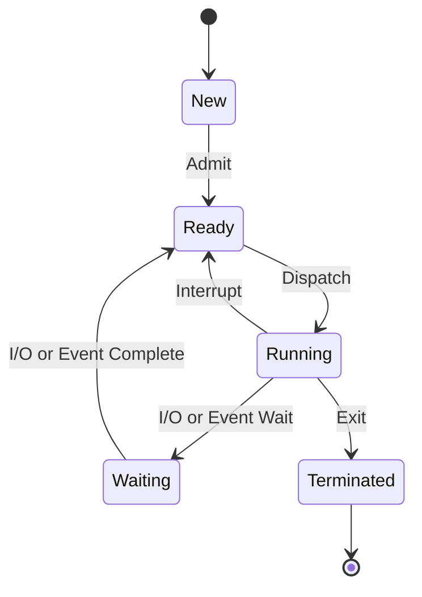
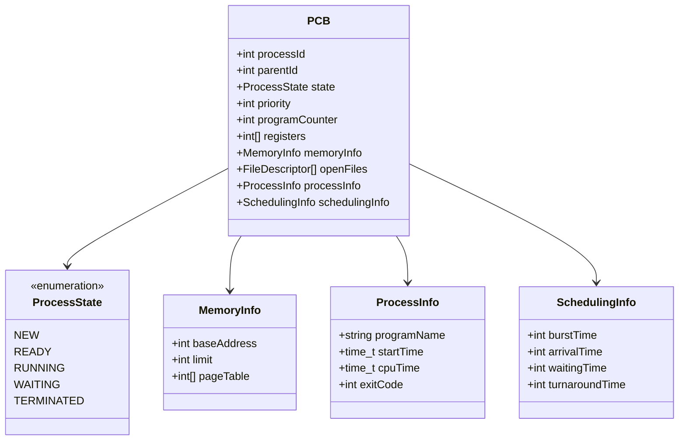

# 🔄 **Processes**

## 📘 **Theory**

A process is an instance of a running program that has its own memory space, program counter, and system resources. It's the fundamental unit of execution in an operating system, representing a program in execution with its associated data and state.

### **Why Processes Matter**

- **Isolation**: Each process has its own memory space, preventing interference
- **Resource Management**: OS can allocate and manage resources per process
- **Concurrency**: Multiple processes can run simultaneously
- **Fault Tolerance**: Failure of one process doesn't affect others
- **Security**: Process boundaries provide security isolation

### **Process States**

1. **New**: Process is being created
2. **Ready**: Process is loaded in memory, waiting for CPU
3. **Running**: Process is executing on CPU
4. **Waiting/Blocked**: Process is waiting for I/O or event
5. **Terminated**: Process has finished execution

### **Common Pitfalls and Best Practices**

- **Memory Leaks**: Ensure proper cleanup of allocated resources
- **Deadlocks**: Avoid circular waiting conditions
- **Race Conditions**: Use proper synchronization mechanisms
- **Resource Management**: Always release acquired resources
- **Error Handling**: Implement proper error handling and recovery

## 📊 **Diagrams**

### **Process State Transition Diagram**



### **Process Memory Layout**

```
High Memory
┌─────────────────┐
│   Stack         │ ← Grows downward
├─────────────────┤
│                 │
│   (unused)      │
│                 │
├─────────────────┤
│   Heap          │ ← Grows upward
├─────────────────┤
│   BSS           │ ← Uninitialized data
├─────────────────┤
│   Data          │ ← Initialized data
├─────────────────┤
│   Text          │ ← Program code
└─────────────────┘
Low Memory
```

### **Process Control Block (PCB)**



## 🧩 **Example**

**Scenario**: Create a simple process manager that can create, schedule, and terminate processes

**Input**: Process creation requests with priorities
**Expected Output**: Process execution with proper state transitions

**Step-by-step**:

1. Create process with unique ID and priority
2. Add process to ready queue
3. Schedule process based on priority
4. Execute process (simulate CPU time)
5. Handle I/O operations and state transitions
6. Terminate process and clean up resources

## 💻 **Implementation (Golang)**

```go
package main

import (
    "fmt"
    "math/rand"
    "sync"
    "time"
)

// ProcessState represents the state of a process
type ProcessState int

const (
    New ProcessState = iota
    Ready
    Running
    Waiting
    Terminated
)

func (ps ProcessState) String() string {
    switch ps {
    case New:
        return "NEW"
    case Ready:
        return "READY"
    case Running:
        return "RUNNING"
    case Waiting:
        return "WAITING"
    case Terminated:
        return "TERMINATED"
    default:
        return "UNKNOWN"
    }
}

// ProcessControlBlock represents a process control block
type ProcessControlBlock struct {
    ProcessID     int
    ParentID      int
    State         ProcessState
    Priority      int
    ProgramCounter int
    Registers     map[string]int
    MemoryInfo    *MemoryInfo
    OpenFiles     []*FileDescriptor
    ProcessInfo   *ProcessInfo
    SchedulingInfo *SchedulingInfo
    mutex         sync.RWMutex
}

type MemoryInfo struct {
    BaseAddress int
    Limit       int
    PageTable   []int
}

type FileDescriptor struct {
    FD     int
    Name   string
    Mode   string
    Offset int64
}

type ProcessInfo struct {
    ProgramName string
    StartTime   time.Time
    CPUTime     time.Duration
    ExitCode    int
}

type SchedulingInfo struct {
    BurstTime     time.Duration
    ArrivalTime   time.Time
    WaitingTime   time.Duration
    TurnaroundTime time.Duration
}

// ProcessManager manages processes
type ProcessManager struct {
    processes    map[int]*ProcessControlBlock
    readyQueue   []*ProcessControlBlock
    waitingQueue []*ProcessControlBlock
    nextPID      int
    mutex        sync.RWMutex
}

func NewProcessManager() *ProcessManager {
    return &ProcessManager{
        processes:    make(map[int]*ProcessControlBlock),
        readyQueue:   make([]*ProcessControlBlock, 0),
        waitingQueue: make([]*ProcessControlBlock, 0),
        nextPID:      1,
    }
}

// CreateProcess creates a new process
func (pm *ProcessManager) CreateProcess(programName string, priority int, burstTime time.Duration) *ProcessControlBlock {
    pm.mutex.Lock()
    defer pm.mutex.Unlock()

    pcb := &ProcessControlBlock{
        ProcessID:     pm.nextPID,
        ParentID:      0, // Root process
        State:         New,
        Priority:      priority,
        ProgramCounter: 0,
        Registers:     make(map[string]int),
        MemoryInfo: &MemoryInfo{
            BaseAddress: rand.Intn(1000) + 1000, // Simulate memory allocation
            Limit:       1024,
            PageTable:   make([]int, 10),
        },
        OpenFiles: make([]*FileDescriptor, 0),
        ProcessInfo: &ProcessInfo{
            ProgramName: programName,
            StartTime:   time.Now(),
            CPUTime:     0,
            ExitCode:    0,
        },
        SchedulingInfo: &SchedulingInfo{
            BurstTime:   burstTime,
            ArrivalTime: time.Now(),
            WaitingTime: 0,
        },
    }

    pm.processes[pcb.ProcessID] = pcb
    pm.nextPID++

    // Move to ready state
    pm.AdmitProcess(pcb)

    return pcb
}

// AdmitProcess moves process from New to Ready
func (pm *ProcessManager) AdmitProcess(pcb *ProcessControlBlock) {
    pcb.mutex.Lock()
    pcb.State = Ready
    pcb.mutex.Unlock()

    pm.readyQueue = append(pm.readyQueue, pcb)
    fmt.Printf("Process %d (%s) admitted to ready queue\n", pcb.ProcessID, pcb.ProcessInfo.ProgramName)
}

// ScheduleProcess selects next process to run
func (pm *ProcessManager) ScheduleProcess() *ProcessControlBlock {
    pm.mutex.Lock()
    defer pm.mutex.Unlock()

    if len(pm.readyQueue) == 0 {
        return nil
    }

    // Simple priority-based scheduling
    bestIndex := 0
    for i := 1; i < len(pm.readyQueue); i++ {
        if pm.readyQueue[i].Priority > pm.readyQueue[bestIndex].Priority {
            bestIndex = i
        }
    }

    // Remove from ready queue
    pcb := pm.readyQueue[bestIndex]
    pm.readyQueue = append(pm.readyQueue[:bestIndex], pm.readyQueue[bestIndex+1:]...)

    return pcb
}

// DispatchProcess moves process from Ready to Running
func (pm *ProcessManager) DispatchProcess(pcb *ProcessControlBlock) {
    pcb.mutex.Lock()
    pcb.State = Running
    pcb.mutex.Unlock()

    fmt.Printf("Process %d (%s) dispatched to CPU\n", pcb.ProcessID, pcb.ProcessInfo.ProgramName)
}

// ExecuteProcess simulates process execution
func (pm *ProcessManager) ExecuteProcess(pcb *ProcessControlBlock) {
    startTime := time.Now()

    // Simulate CPU execution
    executionTime := time.Duration(rand.Intn(500)) * time.Millisecond
    if executionTime > pcb.SchedulingInfo.BurstTime {
        executionTime = pcb.SchedulingInfo.BurstTime
    }

    time.Sleep(executionTime)

    // Update CPU time
    pcb.mutex.Lock()
    pcb.ProcessInfo.CPUTime += time.Since(startTime)
    pcb.mutex.Unlock()

    fmt.Printf("Process %d (%s) executed for %v\n", pcb.ProcessID, pcb.ProcessInfo.ProgramName, executionTime)

    // Simulate I/O operation (30% chance)
    if rand.Float32() < 0.3 {
        pm.WaitForIO(pcb)
    } else {
        pm.TerminateProcess(pcb)
    }
}

// WaitForIO moves process from Running to Waiting
func (pm *ProcessManager) WaitForIO(pcb *ProcessControlBlock) {
    pcb.mutex.Lock()
    pcb.State = Waiting
    pcb.mutex.Unlock()

    pm.waitingQueue = append(pm.waitingQueue, pcb)
    fmt.Printf("Process %d (%s) waiting for I/O\n", pcb.ProcessID, pcb.ProcessInfo.ProgramName)

    // Simulate I/O completion after some time
    go func() {
        time.Sleep(time.Duration(rand.Intn(1000)) * time.Millisecond)
        pm.IOComplete(pcb)
    }()
}

// IOComplete moves process from Waiting to Ready
func (pm *ProcessManager) IOComplete(pcb *ProcessControlBlock) {
    pm.mutex.Lock()
    defer pm.mutex.Unlock()

    // Remove from waiting queue
    for i, p := range pm.waitingQueue {
        if p.ProcessID == pcb.ProcessID {
            pm.waitingQueue = append(pm.waitingQueue[:i], pm.waitingQueue[i+1:]...)
            break
        }
    }

    pcb.mutex.Lock()
    pcb.State = Ready
    pcb.mutex.Unlock()

    pm.readyQueue = append(pm.readyQueue, pcb)
    fmt.Printf("Process %d (%s) I/O completed, back to ready queue\n", pcb.ProcessID, pcb.ProcessInfo.ProgramName)
}

// TerminateProcess moves process from Running to Terminated
func (pm *ProcessManager) TerminateProcess(pcb *ProcessControlBlock) {
    pcb.mutex.Lock()
    pcb.State = Terminated
    pcb.ProcessInfo.ExitCode = 0 // Success
    pcb.SchedulingInfo.TurnaroundTime = time.Since(pcb.SchedulingInfo.ArrivalTime)
    pcb.mutex.Unlock()

    fmt.Printf("Process %d (%s) terminated\n", pcb.ProcessID, pcb.ProcessInfo.ProgramName)

    // Clean up resources
    pm.CleanupProcess(pcb)
}

// CleanupProcess cleans up process resources
func (pm *ProcessManager) CleanupProcess(pcb *ProcessControlBlock) {
    pm.mutex.Lock()
    defer pm.mutex.Unlock()

    // Close open files
    for _, fd := range pcb.OpenFiles {
        fmt.Printf("Closing file descriptor %d (%s)\n", fd.FD, fd.Name)
    }

    // Remove from process table
    delete(pm.processes, pcb.ProcessID)

    fmt.Printf("Process %d resources cleaned up\n", pcb.ProcessID)
}

// GetProcessInfo returns information about a process
func (pm *ProcessManager) GetProcessInfo(processID int) *ProcessControlBlock {
    pm.mutex.RLock()
    defer pm.mutex.RUnlock()

    return pm.processes[processID]
}

// ListProcesses lists all processes
func (pm *ProcessManager) ListProcesses() {
    pm.mutex.RLock()
    defer pm.mutex.RUnlock()

    fmt.Println("\n=== Process List ===")
    for _, pcb := range pm.processes {
        pcb.mutex.RLock()
        fmt.Printf("PID: %d, Name: %s, State: %s, Priority: %d, CPU Time: %v\n",
            pcb.ProcessID, pcb.ProcessInfo.ProgramName, pcb.State, pcb.Priority, pcb.ProcessInfo.CPUTime)
        pcb.mutex.RUnlock()
    }
}

// GetReadyQueueLength returns the length of ready queue
func (pm *ProcessManager) GetReadyQueueLength() int {
    pm.mutex.RLock()
    defer pm.mutex.RUnlock()

    return len(pm.readyQueue)
}

// GetWaitingQueueLength returns the length of waiting queue
func (pm *ProcessManager) GetWaitingQueueLength() int {
    pm.mutex.RLock()
    defer pm.mutex.RUnlock()

    return len(pm.waitingQueue)
}

// ProcessScheduler runs the process scheduler
func (pm *ProcessManager) ProcessScheduler() {
    for {
        // Check for processes in ready queue
        if pm.GetReadyQueueLength() > 0 {
            pcb := pm.ScheduleProcess()
            if pcb != nil {
                pm.DispatchProcess(pcb)
                pm.ExecuteProcess(pcb)
            }
        }

        // Small delay to prevent busy waiting
        time.Sleep(100 * time.Millisecond)
    }
}

// Example usage
func main() {
    // Create process manager
    pm := NewProcessManager()

    // Start scheduler in background
    go pm.ProcessScheduler()

    // Create some processes
    processes := []struct {
        name     string
        priority int
        burst    time.Duration
    }{
        {"Browser", 3, 2 * time.Second},
        {"Text Editor", 2, 1 * time.Second},
        {"Calculator", 1, 500 * time.Millisecond},
        {"File Manager", 2, 1 * time.Second},
        {"Media Player", 4, 3 * time.Second},
    }

    // Create processes
    for _, p := range processes {
        pm.CreateProcess(p.name, p.priority, p.burst)
        time.Sleep(200 * time.Millisecond) // Stagger creation
    }

    // Monitor processes for a while
    for i := 0; i < 20; i++ {
        pm.ListProcesses()
        fmt.Printf("Ready Queue: %d, Waiting Queue: %d\n",
            pm.GetReadyQueueLength(), pm.GetWaitingQueueLength())
        time.Sleep(1 * time.Second)
    }

    // Wait for all processes to complete
    for pm.GetReadyQueueLength() > 0 || pm.GetWaitingQueueLength() > 0 {
        time.Sleep(500 * time.Millisecond)
    }

    fmt.Println("\nAll processes completed!")
}
```

## 💻 **Implementation (Node.js)**

```javascript
// ProcessState enumeration
const ProcessState = {
  NEW: "NEW",
  READY: "READY",
  RUNNING: "RUNNING",
  WAITING: "WAITING",
  TERMINATED: "TERMINATED",
};

// ProcessControlBlock class
class ProcessControlBlock {
  constructor(processId, parentId, programName, priority, burstTime) {
    this.processId = processId;
    this.parentId = parentId;
    this.state = ProcessState.NEW;
    this.priority = priority;
    this.programCounter = 0;
    this.registers = new Map();
    this.memoryInfo = {
      baseAddress: Math.floor(Math.random() * 1000) + 1000,
      limit: 1024,
      pageTable: new Array(10).fill(0),
    };
    this.openFiles = [];
    this.processInfo = {
      programName: programName,
      startTime: new Date(),
      cpuTime: 0,
      exitCode: 0,
    };
    this.schedulingInfo = {
      burstTime: burstTime,
      arrivalTime: new Date(),
      waitingTime: 0,
      turnaroundTime: 0,
    };
  }

  updateState(newState) {
    this.state = newState;
  }

  addCPUTime(time) {
    this.processInfo.cpuTime += time;
  }

  setExitCode(code) {
    this.processInfo.exitCode = code;
  }

  calculateTurnaroundTime() {
    this.schedulingInfo.turnaroundTime =
      new Date() - this.schedulingInfo.arrivalTime;
  }
}

// ProcessManager class
class ProcessManager {
  constructor() {
    this.processes = new Map();
    this.readyQueue = [];
    this.waitingQueue = [];
    this.nextPID = 1;
  }

  // Create a new process
  createProcess(programName, priority, burstTime) {
    const pcb = new ProcessControlBlock(
      this.nextPID++,
      0, // Root process
      programName,
      priority,
      burstTime
    );

    this.processes.set(pcb.processId, pcb);
    this.admitProcess(pcb);
    return pcb;
  }

  // Move process from New to Ready
  admitProcess(pcb) {
    pcb.updateState(ProcessState.READY);
    this.readyQueue.push(pcb);
    console.log(
      `Process ${pcb.processId} (${pcb.processInfo.programName}) admitted to ready queue`
    );
  }

  // Schedule next process to run
  scheduleProcess() {
    if (this.readyQueue.length === 0) {
      return null;
    }

    // Simple priority-based scheduling
    let bestIndex = 0;
    for (let i = 1; i < this.readyQueue.length; i++) {
      if (this.readyQueue[i].priority > this.readyQueue[bestIndex].priority) {
        bestIndex = i;
      }
    }

    // Remove from ready queue
    const pcb = this.readyQueue.splice(bestIndex, 1)[0];
    return pcb;
  }

  // Move process from Ready to Running
  dispatchProcess(pcb) {
    pcb.updateState(ProcessState.RUNNING);
    console.log(
      `Process ${pcb.processId} (${pcb.processInfo.programName}) dispatched to CPU`
    );
  }

  // Execute process
  async executeProcess(pcb) {
    const startTime = new Date();

    // Simulate CPU execution
    const executionTime = Math.min(
      Math.random() * 500, // Random execution time up to 500ms
      pcb.schedulingInfo.burstTime
    );

    await new Promise((resolve) => setTimeout(resolve, executionTime));

    // Update CPU time
    pcb.addCPUTime(new Date() - startTime);

    console.log(
      `Process ${pcb.processId} (${pcb.processInfo.programName}) executed for ${executionTime}ms`
    );

    // Simulate I/O operation (30% chance)
    if (Math.random() < 0.3) {
      this.waitForIO(pcb);
    } else {
      this.terminateProcess(pcb);
    }
  }

  // Move process from Running to Waiting
  waitForIO(pcb) {
    pcb.updateState(ProcessState.WAITING);
    this.waitingQueue.push(pcb);
    console.log(
      `Process ${pcb.processId} (${pcb.processInfo.programName}) waiting for I/O`
    );

    // Simulate I/O completion after some time
    setTimeout(() => {
      this.ioComplete(pcb);
    }, Math.random() * 1000);
  }

  // Move process from Waiting to Ready
  ioComplete(pcb) {
    // Remove from waiting queue
    const index = this.waitingQueue.findIndex(
      (p) => p.processId === pcb.processId
    );
    if (index !== -1) {
      this.waitingQueue.splice(index, 1);
    }

    pcb.updateState(ProcessState.READY);
    this.readyQueue.push(pcb);
    console.log(
      `Process ${pcb.processId} (${pcb.processInfo.programName}) I/O completed, back to ready queue`
    );
  }

  // Move process from Running to Terminated
  terminateProcess(pcb) {
    pcb.updateState(ProcessState.TERMINATED);
    pcb.setExitCode(0); // Success
    pcb.calculateTurnaroundTime();

    console.log(
      `Process ${pcb.processId} (${pcb.processInfo.programName}) terminated`
    );

    // Clean up resources
    this.cleanupProcess(pcb);
  }

  // Clean up process resources
  cleanupProcess(pcb) {
    // Close open files
    pcb.openFiles.forEach((fd) => {
      console.log(`Closing file descriptor ${fd.fd} (${fd.name})`);
    });

    // Remove from process table
    this.processes.delete(pcb.processId);
    console.log(`Process ${pcb.processId} resources cleaned up`);
  }

  // Get process information
  getProcessInfo(processId) {
    return this.processes.get(processId);
  }

  // List all processes
  listProcesses() {
    console.log("\n=== Process List ===");
    this.processes.forEach((pcb) => {
      console.log(
        `PID: ${pcb.processId}, Name: ${pcb.processInfo.programName}, State: ${pcb.state}, Priority: ${pcb.priority}, CPU Time: ${pcb.processInfo.cpuTime}ms`
      );
    });
  }

  // Get ready queue length
  getReadyQueueLength() {
    return this.readyQueue.length;
  }

  // Get waiting queue length
  getWaitingQueueLength() {
    return this.waitingQueue.length;
  }

  // Process scheduler
  async runScheduler() {
    while (true) {
      // Check for processes in ready queue
      if (this.getReadyQueueLength() > 0) {
        const pcb = this.scheduleProcess();
        if (pcb) {
          this.dispatchProcess(pcb);
          await this.executeProcess(pcb);
        }
      }

      // Small delay to prevent busy waiting
      await new Promise((resolve) => setTimeout(resolve, 100));
    }
  }
}

// Example usage
async function main() {
  // Create process manager
  const pm = new ProcessManager();

  // Start scheduler in background
  pm.runScheduler();

  // Create some processes
  const processes = [
    { name: "Browser", priority: 3, burst: 2000 },
    { name: "Text Editor", priority: 2, burst: 1000 },
    { name: "Calculator", priority: 1, burst: 500 },
    { name: "File Manager", priority: 2, burst: 1000 },
    { name: "Media Player", priority: 4, burst: 3000 },
  ];

  // Create processes
  for (const p of processes) {
    pm.createProcess(p.name, p.priority, p.burst);
    await new Promise((resolve) => setTimeout(resolve, 200)); // Stagger creation
  }

  // Monitor processes for a while
  for (let i = 0; i < 20; i++) {
    pm.listProcesses();
    console.log(
      `Ready Queue: ${pm.getReadyQueueLength()}, Waiting Queue: ${pm.getWaitingQueueLength()}`
    );
    await new Promise((resolve) => setTimeout(resolve, 1000));
  }

  // Wait for all processes to complete
  while (pm.getReadyQueueLength() > 0 || pm.getWaitingQueueLength() > 0) {
    await new Promise((resolve) => setTimeout(resolve, 500));
  }

  console.log("\nAll processes completed!");
}

main().catch(console.error);
```

## ⏱ **Complexity Analysis**

### **Time Complexity**

- **Process Creation**: O(1) - Constant time to create PCB
- **Process Scheduling**: O(n) - Linear search through ready queue
- **Process Execution**: O(1) - Constant time for state transitions
- **Process Cleanup**: O(1) - Constant time to remove from data structures

### **Space Complexity**

- **Process Storage**: O(n) - Linear space for n processes
- **Queue Management**: O(n) - Linear space for ready and waiting queues
- **Memory per Process**: O(1) - Constant space per process PCB

## 🚀 **Optimal Solution**

The optimal process management solution includes:

1. **Efficient Scheduling**: Use priority queues for O(log n) scheduling
2. **Memory Management**: Implement virtual memory and paging
3. **Synchronization**: Use proper locking mechanisms
4. **Resource Management**: Implement resource pools and cleanup
5. **Monitoring**: Add comprehensive process monitoring and logging

### **Production Considerations**

- Implement process limits and resource quotas
- Add process monitoring and health checks
- Use efficient data structures for scheduling
- Implement proper error handling and recovery
- Add security and access control mechanisms

## ❓ **Follow-up Questions**

### **How would this scale with X?**

- **Many Processes**: Use efficient data structures and scheduling algorithms
- **High CPU Usage**: Implement process priorities and preemption
- **Memory Constraints**: Use virtual memory and swapping

### **How can we optimize further if Y changes?**

- **Real-time Requirements**: Use real-time scheduling algorithms
- **Multicore Systems**: Implement parallel process execution
- **Resource Constraints**: Use resource management and quotas

### **What trade-offs exist in different approaches?**

- **Scheduling Algorithms**: Fairness vs Efficiency
- **Memory Management**: Performance vs Complexity
- **Process Isolation**: Security vs Performance
