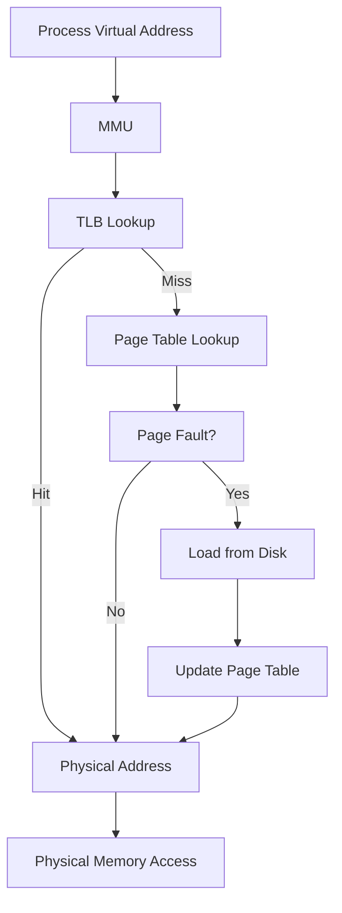
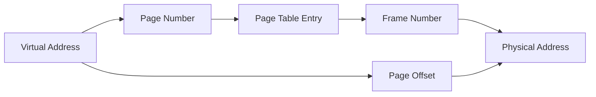

---
# Auto-generated front matter
Title: Virtual Memory
LastUpdated: 2025-11-06T20:45:58.757284
Tags: []
Status: draft
---

# Virtual Memory Management

## 📘 Theory

Virtual memory is a memory management technique that provides an abstraction layer between the application and physical memory. It allows programs to use more memory than physically available by using disk storage as an extension of RAM. This enables efficient memory sharing, protection, and paging.

### Key Concepts:

- **Virtual Address Space**: Logical memory space seen by processes
- **Physical Memory**: Actual RAM available to the system
- **Page Tables**: Data structures mapping virtual to physical addresses
- **Page Faults**: Exceptions when accessing unmapped memory
- **TLB (Translation Lookaside Buffer)**: Cache for page table entries
- **Memory Protection**: Isolation between processes
- **Demand Paging**: Loading pages only when needed

### Memory Hierarchy:

```
CPU Registers (1 cycle)
    ↓
L1 Cache (2-4 cycles)
    ↓
L2 Cache (10-20 cycles)
    ↓
L3 Cache (40-45 cycles)
    ↓
Main Memory (100-300 cycles)
    ↓
Virtual Memory (1,000,000+ cycles)
```

## 📊 Diagrams

### Virtual Memory Architecture



### Page Table Structure



## 🧩 Example

32-bit system with 4KB pages:

**Virtual Address: 0x12345678**

- Page Number: 0x12345 (bits 31-12)
- Page Offset: 0x678 (bits 11-0)
- Page Table Entry: Contains frame number and flags
- Physical Address: (Frame Number << 12) | Page Offset

**Page Fault Handling:**

1. CPU generates page fault exception
2. OS checks if page is valid
3. If valid, load page from disk
4. Update page table
5. Restart instruction

## 💻 Implementation (Golang)

```go
package main

import (
    "fmt"
    "math/rand"
    "time"
)

// Page size constants
const (
    PAGE_SIZE = 4096 // 4KB pages
    PAGE_OFFSET_BITS = 12
    PAGE_NUMBER_BITS = 20
    MAX_PAGES = 1 << PAGE_NUMBER_BITS
)

// Page table entry
type PageTableEntry struct {
    FrameNumber int
    Present     bool
    Modified    bool
    Referenced  bool
    Protection  int // 0=read-only, 1=read-write
    Valid       bool
}

// Page table
type PageTable struct {
    entries []PageTableEntry
    size    int
}

// Virtual memory manager
type VirtualMemoryManager struct {
    pageTable     *PageTable
    physicalMemory []byte
    disk          []byte
    tlb           *TLB
    pageFaults    int
    tlbHits       int
    tlbMisses     int
}

// TLB (Translation Lookaside Buffer)
type TLB struct {
    entries map[int]int // virtual page -> physical frame
    size    int
    accessOrder []int
}

// Memory access result
type MemoryAccessResult struct {
    PhysicalAddress int
    PageFault       bool
    TLBHit          bool
    Data            byte
}

// NewPageTable creates a new page table
func NewPageTable(size int) *PageTable {
    return &PageTable{
        entries: make([]PageTableEntry, size),
        size:    size,
    }
}

// NewTLB creates a new TLB
func NewTLB(size int) *TLB {
    return &TLB{
        entries:     make(map[int]int),
        size:        size,
        accessOrder: make([]int, 0, size),
    }
}

// NewVirtualMemoryManager creates a new VMM
func NewVirtualMemoryManager(physicalSize, diskSize int) *VirtualMemoryManager {
    return &VirtualMemoryManager{
        pageTable:      NewPageTable(MAX_PAGES),
        physicalMemory: make([]byte, physicalSize),
        disk:          make([]byte, diskSize),
        tlb:           NewTLB(64), // 64-entry TLB
    }
}

// GetPageNumber extracts page number from virtual address
func (vmm *VirtualMemoryManager) GetPageNumber(virtualAddr int) int {
    return virtualAddr >> PAGE_OFFSET_BITS
}

// GetPageOffset extracts page offset from virtual address
func (vmm *VirtualMemoryManager) GetPageOffset(virtualAddr int) int {
    return virtualAddr & ((1 << PAGE_OFFSET_BITS) - 1)
}

// GetPhysicalAddress converts virtual to physical address
func (vmm *VirtualMemoryManager) GetPhysicalAddress(virtualAddr int) int {
    pageNumber := vmm.GetPageNumber(virtualAddr)
    pageOffset := vmm.GetPageOffset(virtualAddr)

    // Check TLB first
    if frameNumber, hit := vmm.tlb.Get(pageNumber); hit {
        vmm.tlbHits++
        return (frameNumber << PAGE_OFFSET_BITS) | pageOffset
    }

    vmm.tlbMisses++

    // Check page table
    if pageNumber >= vmm.pageTable.size {
        return -1 // Invalid page number
    }

    entry := &vmm.pageTable.entries[pageNumber]
    if !entry.Present {
        // Page fault
        vmm.pageFaults++
        frameNumber := vmm.handlePageFault(pageNumber)
        if frameNumber == -1 {
            return -1 // No free frame
        }
        entry.FrameNumber = frameNumber
        entry.Present = true
        entry.Valid = true
    }

    // Update TLB
    vmm.tlb.Set(pageNumber, entry.FrameNumber)

    return (entry.FrameNumber << PAGE_OFFSET_BITS) | pageOffset
}

// handlePageFault handles page faults
func (vmm *VirtualMemoryManager) handlePageFault(pageNumber int) int {
    // Find free frame
    frameNumber := vmm.findFreeFrame()
    if frameNumber == -1 {
        // No free frame, need to evict
        frameNumber = vmm.evictPage()
    }

    // Load page from disk to physical memory
    vmm.loadPageFromDisk(pageNumber, frameNumber)

    return frameNumber
}

// findFreeFrame finds a free physical frame
func (vmm *VirtualMemoryManager) findFreeFrame() int {
    frameSize := len(vmm.physicalMemory) / PAGE_SIZE
    for i := 0; i < frameSize; i++ {
        if !vmm.isFrameUsed(i) {
            return i
        }
    }
    return -1
}

// isFrameUsed checks if a frame is currently used
func (vmm *VirtualMemoryManager) isFrameUsed(frameNumber int) bool {
    for _, entry := range vmm.pageTable.entries {
        if entry.Present && entry.FrameNumber == frameNumber {
            return true
        }
    }
    return false
}

// evictPage evicts a page using LRU algorithm
func (vmm *VirtualMemoryManager) evictPage() int {
    // Simple LRU implementation
    oldestPage := -1
    oldestTime := time.Now()

    for pageNumber, entry := range vmm.pageTable.entries {
        if entry.Present && entry.Referenced {
            // Find the oldest referenced page
            if entry.Referenced && time.Since(oldestTime) > 0 {
                oldestPage = pageNumber
                oldestTime = time.Now()
            }
        }
    }

    if oldestPage != -1 {
        // Save page to disk if modified
        if vmm.pageTable.entries[oldestPage].Modified {
            vmm.savePageToDisk(oldestPage, vmm.pageTable.entries[oldestPage].FrameNumber)
        }

        // Clear page table entry
        vmm.pageTable.entries[oldestPage].Present = false
        vmm.pageTable.entries[oldestPage].Modified = false
        vmm.pageTable.entries[oldestPage].Referenced = false

        return vmm.pageTable.entries[oldestPage].FrameNumber
    }

    return 0 // Default to frame 0
}

// loadPageFromDisk loads a page from disk to physical memory
func (vmm *VirtualMemoryManager) loadPageFromDisk(pageNumber, frameNumber int) {
    diskOffset := pageNumber * PAGE_SIZE
    physicalOffset := frameNumber * PAGE_SIZE

    // Copy from disk to physical memory
    for i := 0; i < PAGE_SIZE; i++ {
        vmm.physicalMemory[physicalOffset+i] = vmm.disk[diskOffset+i]
    }
}

// savePageToDisk saves a page from physical memory to disk
func (vmm *VirtualMemoryManager) savePageToDisk(pageNumber, frameNumber int) {
    diskOffset := pageNumber * PAGE_SIZE
    physicalOffset := frameNumber * PAGE_SIZE

    // Copy from physical memory to disk
    for i := 0; i < PAGE_SIZE; i++ {
        vmm.disk[diskOffset+i] = vmm.physicalMemory[physicalOffset+i]
    }
}

// ReadByte reads a byte from virtual address
func (vmm *VirtualMemoryManager) ReadByte(virtualAddr int) (byte, error) {
    physicalAddr := vmm.GetPhysicalAddress(virtualAddr)
    if physicalAddr == -1 {
        return 0, fmt.Errorf("invalid virtual address")
    }

    if physicalAddr >= len(vmm.physicalMemory) {
        return 0, fmt.Errorf("physical address out of bounds")
    }

    return vmm.physicalMemory[physicalAddr], nil
}

// WriteByte writes a byte to virtual address
func (vmm *VirtualMemoryManager) WriteByte(virtualAddr int, value byte) error {
    physicalAddr := vmm.GetPhysicalAddress(virtualAddr)
    if physicalAddr == -1 {
        return fmt.Errorf("invalid virtual address")
    }

    if physicalAddr >= len(vmm.physicalMemory) {
        return fmt.Errorf("physical address out of bounds")
    }

    vmm.physicalMemory[physicalAddr] = value

    // Mark page as modified
    pageNumber := vmm.GetPageNumber(virtualAddr)
    if pageNumber < vmm.pageTable.size {
        vmm.pageTable.entries[pageNumber].Modified = true
    }

    return nil
}

// GetStatistics returns memory access statistics
func (vmm *VirtualMemoryManager) GetStatistics() map[string]int {
    return map[string]int{
        "PageFaults": vmm.pageFaults,
        "TLBHits":    vmm.tlbHits,
        "TLBMisses":  vmm.tlbMisses,
        "TLBHitRate": vmm.tlbHits * 100 / (vmm.tlbHits + vmm.tlbMisses),
    }
}

// TLB methods
func (tlb *TLB) Get(pageNumber int) (int, bool) {
    frameNumber, exists := tlb.entries[pageNumber]
    return frameNumber, exists
}

func (tlb *TLB) Set(pageNumber, frameNumber int) {
    if len(tlb.entries) >= tlb.size {
        // Evict oldest entry
        if len(tlb.accessOrder) > 0 {
            oldestPage := tlb.accessOrder[0]
            delete(tlb.entries, oldestPage)
            tlb.accessOrder = tlb.accessOrder[1:]
        }
    }

    tlb.entries[pageNumber] = frameNumber
    tlb.accessOrder = append(tlb.accessOrder, pageNumber)
}

// Memory allocation functions
func (vmm *VirtualMemoryManager) AllocatePages(numPages int) (int, error) {
    if numPages <= 0 {
        return -1, fmt.Errorf("invalid number of pages")
    }

    // Find contiguous virtual pages
    startPage := vmm.findContiguousPages(numPages)
    if startPage == -1 {
        return -1, fmt.Errorf("no contiguous pages available")
    }

    // Initialize page table entries
    for i := 0; i < numPages; i++ {
        pageNumber := startPage + i
        if pageNumber < vmm.pageTable.size {
            vmm.pageTable.entries[pageNumber].Valid = true
            vmm.pageTable.entries[pageNumber].Protection = 1 // Read-write
        }
    }

    return startPage << PAGE_OFFSET_BITS, nil
}

func (vmm *VirtualMemoryManager) findContiguousPages(numPages int) int {
    for i := 0; i <= vmm.pageTable.size-numPages; i++ {
        // Check if pages are free
        allFree := true
        for j := 0; j < numPages; j++ {
            if vmm.pageTable.entries[i+j].Valid {
                allFree = false
                break
            }
        }

        if allFree {
            return i
        }
    }
    return -1
}

func (vmm *VirtualMemoryManager) DeallocatePages(startPage, numPages int) error {
    if startPage < 0 || startPage >= vmm.pageTable.size {
        return fmt.Errorf("invalid start page")
    }

    if startPage+numPages > vmm.pageTable.size {
        return fmt.Errorf("invalid page range")
    }

    // Clear page table entries
    for i := 0; i < numPages; i++ {
        pageNumber := startPage + i
        entry := &vmm.pageTable.entries[pageNumber]

        if entry.Present {
            // Save to disk if modified
            if entry.Modified {
                vmm.savePageToDisk(pageNumber, entry.FrameNumber)
            }
        }

        // Clear entry
        *entry = PageTableEntry{}
    }

    return nil
}

func main() {
    // Create virtual memory manager
    vmm := NewVirtualMemoryManager(1024*1024, 10*1024*1024) // 1MB RAM, 10MB disk

    // Allocate some memory
    virtualAddr, err := vmm.AllocatePages(4) // Allocate 4 pages
    if err != nil {
        fmt.Printf("Error allocating memory: %v\n", err)
        return
    }

    fmt.Printf("Allocated memory at virtual address: 0x%x\n", virtualAddr)

    // Write some data
    for i := 0; i < 16; i++ {
        err := vmm.WriteByte(virtualAddr+i, byte('A'+i))
        if err != nil {
            fmt.Printf("Error writing byte: %v\n", err)
            return
        }
    }

    // Read data back
    fmt.Println("Reading data back:")
    for i := 0; i < 16; i++ {
        value, err := vmm.ReadByte(virtualAddr + i)
        if err != nil {
            fmt.Printf("Error reading byte: %v\n", err)
            return
        }
        fmt.Printf("Address 0x%x: %c\n", virtualAddr+i, value)
    }

    // Test page faults
    fmt.Println("\nTesting page faults:")
    for i := 0; i < 100; i++ {
        virtualAddr := rand.Intn(MAX_PAGES) << PAGE_OFFSET_BITS
        _, err := vmm.ReadByte(virtualAddr)
        if err != nil {
            // Expected for unmapped pages
        }
    }

    // Print statistics
    stats := vmm.GetStatistics()
    fmt.Printf("\nMemory Statistics:\n")
    for key, value := range stats {
        fmt.Printf("%s: %d\n", key, value)
    }

    // Test memory allocation and deallocation
    fmt.Println("\nTesting memory allocation:")
    for i := 0; i < 5; i++ {
        addr, err := vmm.AllocatePages(2)
        if err != nil {
            fmt.Printf("Allocation %d failed: %v\n", i, err)
        } else {
            fmt.Printf("Allocation %d: 0x%x\n", i, addr)
        }
    }

    // Deallocate memory
    err = vmm.DeallocatePages(vmm.GetPageNumber(virtualAddr), 4)
    if err != nil {
        fmt.Printf("Error deallocating memory: %v\n", err)
    } else {
        fmt.Println("Memory deallocated successfully")
    }
}
```

## 💻 Implementation (Node.js)

```javascript
class VirtualMemoryManager {
  constructor(physicalSize, diskSize) {
    this.PAGE_SIZE = 4096; // 4KB pages
    this.PAGE_OFFSET_BITS = 12;
    this.PAGE_NUMBER_BITS = 20;
    this.MAX_PAGES = 1 << this.PAGE_NUMBER_BITS;

    this.pageTable = new Array(this.MAX_PAGES).fill(null).map(() => ({
      frameNumber: 0,
      present: false,
      modified: false,
      referenced: false,
      protection: 0,
      valid: false,
    }));

    this.physicalMemory = new Array(physicalSize).fill(0);
    this.disk = new Array(diskSize).fill(0);
    this.tlb = new TLB(64); // 64-entry TLB

    this.pageFaults = 0;
    this.tlbHits = 0;
    this.tlbMisses = 0;
  }

  getPageNumber(virtualAddr) {
    return virtualAddr >> this.PAGE_OFFSET_BITS;
  }

  getPageOffset(virtualAddr) {
    return virtualAddr & ((1 << this.PAGE_OFFSET_BITS) - 1);
  }

  getPhysicalAddress(virtualAddr) {
    const pageNumber = this.getPageNumber(virtualAddr);
    const pageOffset = this.getPageOffset(virtualAddr);

    // Check TLB first
    const tlbResult = this.tlb.get(pageNumber);
    if (tlbResult.hit) {
      this.tlbHits++;
      return (tlbResult.frameNumber << this.PAGE_OFFSET_BITS) | pageOffset;
    }

    this.tlbMisses++;

    // Check page table
    if (pageNumber >= this.pageTable.length) {
      return -1; // Invalid page number
    }

    const entry = this.pageTable[pageNumber];
    if (!entry.present) {
      // Page fault
      this.pageFaults++;
      const frameNumber = this.handlePageFault(pageNumber);
      if (frameNumber === -1) {
        return -1; // No free frame
      }
      entry.frameNumber = frameNumber;
      entry.present = true;
      entry.valid = true;
    }

    // Update TLB
    this.tlb.set(pageNumber, entry.frameNumber);

    return (entry.frameNumber << this.PAGE_OFFSET_BITS) | pageOffset;
  }

  handlePageFault(pageNumber) {
    // Find free frame
    let frameNumber = this.findFreeFrame();
    if (frameNumber === -1) {
      // No free frame, need to evict
      frameNumber = this.evictPage();
    }

    // Load page from disk to physical memory
    this.loadPageFromDisk(pageNumber, frameNumber);

    return frameNumber;
  }

  findFreeFrame() {
    const frameSize = Math.floor(this.physicalMemory.length / this.PAGE_SIZE);
    for (let i = 0; i < frameSize; i++) {
      if (!this.isFrameUsed(i)) {
        return i;
      }
    }
    return -1;
  }

  isFrameUsed(frameNumber) {
    return this.pageTable.some(
      (entry) => entry.present && entry.frameNumber === frameNumber
    );
  }

  evictPage() {
    // Simple LRU implementation
    let oldestPage = -1;
    let oldestTime = Date.now();

    for (let pageNumber = 0; pageNumber < this.pageTable.length; pageNumber++) {
      const entry = this.pageTable[pageNumber];
      if (entry.present && entry.referenced) {
        // Find the oldest referenced page
        if (entry.referenced && Date.now() - oldestTime > 0) {
          oldestPage = pageNumber;
          oldestTime = Date.now();
        }
      }
    }

    if (oldestPage !== -1) {
      // Save page to disk if modified
      if (this.pageTable[oldestPage].modified) {
        this.savePageToDisk(oldestPage, this.pageTable[oldestPage].frameNumber);
      }

      // Clear page table entry
      this.pageTable[oldestPage].present = false;
      this.pageTable[oldestPage].modified = false;
      this.pageTable[oldestPage].referenced = false;

      return this.pageTable[oldestPage].frameNumber;
    }

    return 0; // Default to frame 0
  }

  loadPageFromDisk(pageNumber, frameNumber) {
    const diskOffset = pageNumber * this.PAGE_SIZE;
    const physicalOffset = frameNumber * this.PAGE_SIZE;

    // Copy from disk to physical memory
    for (let i = 0; i < this.PAGE_SIZE; i++) {
      this.physicalMemory[physicalOffset + i] = this.disk[diskOffset + i];
    }
  }

  savePageToDisk(pageNumber, frameNumber) {
    const diskOffset = pageNumber * this.PAGE_SIZE;
    const physicalOffset = frameNumber * this.PAGE_SIZE;

    // Copy from physical memory to disk
    for (let i = 0; i < this.PAGE_SIZE; i++) {
      this.disk[diskOffset + i] = this.physicalMemory[physicalOffset + i];
    }
  }

  readByte(virtualAddr) {
    const physicalAddr = this.getPhysicalAddress(virtualAddr);
    if (physicalAddr === -1) {
      throw new Error("Invalid virtual address");
    }

    if (physicalAddr >= this.physicalMemory.length) {
      throw new Error("Physical address out of bounds");
    }

    return this.physicalMemory[physicalAddr];
  }

  writeByte(virtualAddr, value) {
    const physicalAddr = this.getPhysicalAddress(virtualAddr);
    if (physicalAddr === -1) {
      throw new Error("Invalid virtual address");
    }

    if (physicalAddr >= this.physicalMemory.length) {
      throw new Error("Physical address out of bounds");
    }

    this.physicalMemory[physicalAddr] = value;

    // Mark page as modified
    const pageNumber = this.getPageNumber(virtualAddr);
    if (pageNumber < this.pageTable.length) {
      this.pageTable[pageNumber].modified = true;
    }
  }

  getStatistics() {
    const total = this.tlbHits + this.tlbMisses;
    return {
      pageFaults: this.pageFaults,
      tlbHits: this.tlbHits,
      tlbMisses: this.tlbMisses,
      tlbHitRate: total > 0 ? Math.floor((this.tlbHits * 100) / total) : 0,
    };
  }

  allocatePages(numPages) {
    if (numPages <= 0) {
      throw new Error("Invalid number of pages");
    }

    // Find contiguous virtual pages
    const startPage = this.findContiguousPages(numPages);
    if (startPage === -1) {
      throw new Error("No contiguous pages available");
    }

    // Initialize page table entries
    for (let i = 0; i < numPages; i++) {
      const pageNumber = startPage + i;
      if (pageNumber < this.pageTable.length) {
        this.pageTable[pageNumber].valid = true;
        this.pageTable[pageNumber].protection = 1; // Read-write
      }
    }

    return startPage << this.PAGE_OFFSET_BITS;
  }

  findContiguousPages(numPages) {
    for (let i = 0; i <= this.pageTable.length - numPages; i++) {
      // Check if pages are free
      let allFree = true;
      for (let j = 0; j < numPages; j++) {
        if (this.pageTable[i + j].valid) {
          allFree = false;
          break;
        }
      }

      if (allFree) {
        return i;
      }
    }
    return -1;
  }

  deallocatePages(startPage, numPages) {
    if (startPage < 0 || startPage >= this.pageTable.length) {
      throw new Error("Invalid start page");
    }

    if (startPage + numPages > this.pageTable.length) {
      throw new Error("Invalid page range");
    }

    // Clear page table entries
    for (let i = 0; i < numPages; i++) {
      const pageNumber = startPage + i;
      const entry = this.pageTable[pageNumber];

      if (entry.present) {
        // Save to disk if modified
        if (entry.modified) {
          this.savePageToDisk(pageNumber, entry.frameNumber);
        }
      }

      // Clear entry
      this.pageTable[pageNumber] = {
        frameNumber: 0,
        present: false,
        modified: false,
        referenced: false,
        protection: 0,
        valid: false,
      };
    }
  }
}

class TLB {
  constructor(size) {
    this.entries = new Map();
    this.size = size;
    this.accessOrder = [];
  }

  get(pageNumber) {
    const frameNumber = this.entries.get(pageNumber);
    return {
      frameNumber: frameNumber,
      hit: frameNumber !== undefined,
    };
  }

  set(pageNumber, frameNumber) {
    if (this.entries.size >= this.size) {
      // Evict oldest entry
      if (this.accessOrder.length > 0) {
        const oldestPage = this.accessOrder[0];
        this.entries.delete(oldestPage);
        this.accessOrder = this.accessOrder.slice(1);
      }
    }

    this.entries.set(pageNumber, frameNumber);
    this.accessOrder.push(pageNumber);
  }
}

// Example usage
function main() {
  // Create virtual memory manager
  const vmm = new VirtualMemoryManager(1024 * 1024, 10 * 1024 * 1024); // 1MB RAM, 10MB disk

  try {
    // Allocate some memory
    const virtualAddr = vmm.allocatePages(4); // Allocate 4 pages
    console.log(
      `Allocated memory at virtual address: 0x${virtualAddr.toString(16)}`
    );

    // Write some data
    for (let i = 0; i < 16; i++) {
      vmm.writeByte(virtualAddr + i, "A".charCodeAt(0) + i);
    }

    // Read data back
    console.log("Reading data back:");
    for (let i = 0; i < 16; i++) {
      const value = vmm.readByte(virtualAddr + i);
      console.log(
        `Address 0x${(virtualAddr + i).toString(16)}: ${String.fromCharCode(
          value
        )}`
      );
    }

    // Test page faults
    console.log("\nTesting page faults:");
    for (let i = 0; i < 100; i++) {
      const virtualAddr =
        Math.floor(Math.random() * vmm.MAX_PAGES) << vmm.PAGE_OFFSET_BITS;
      try {
        vmm.readByte(virtualAddr);
      } catch (e) {
        // Expected for unmapped pages
      }
    }

    // Print statistics
    const stats = vmm.getStatistics();
    console.log("\nMemory Statistics:");
    for (const [key, value] of Object.entries(stats)) {
      console.log(`${key}: ${value}`);
    }

    // Test memory allocation and deallocation
    console.log("\nTesting memory allocation:");
    for (let i = 0; i < 5; i++) {
      try {
        const addr = vmm.allocatePages(2);
        console.log(`Allocation ${i}: 0x${addr.toString(16)}`);
      } catch (e) {
        console.log(`Allocation ${i} failed: ${e.message}`);
      }
    }

    // Deallocate memory
    vmm.deallocatePages(vmm.getPageNumber(virtualAddr), 4);
    console.log("Memory deallocated successfully");
  } catch (error) {
    console.error(`Error: ${error.message}`);
  }
}

main();
```

## ⏱ Complexity Analysis

**Time Complexity:**

- TLB Lookup: O(1)
- Page Table Lookup: O(1) with hardware support
- Page Fault Handling: O(disk access time)
- Memory Allocation: O(n) where n is number of pages

**Space Complexity:**

- Page Table: O(n) where n is number of pages
- TLB: O(k) where k is TLB size
- Physical Memory: O(m) where m is RAM size

## 🚀 Optimal Solution

The optimal solution uses:

1. **Multi-level Page Tables**: Reduce memory overhead
2. **TLB Optimization**: Larger TLB, better replacement algorithms
3. **Page Replacement**: LRU, Clock, or Working Set algorithms
4. **Memory Compression**: Reduce physical memory usage
5. **NUMA Awareness**: Optimize for multi-socket systems

## ❓ Follow-up Questions

1. **How would this scale with 64-bit address spaces?**

   - Use multi-level page tables
   - Implement huge pages for large allocations
   - Consider sparse page table structures

2. **How can we optimize further if memory is limited?**

   - Use memory compression
   - Implement swap file optimization
   - Consider page sharing for read-only data

3. **What trade-offs exist in different approaches?**
   - TLB Size vs Hit Rate: Larger TLB = better hit rate but more hardware cost
   - Page Size vs Fragmentation: Larger pages = less fragmentation but more waste
   - Write-through vs Write-back: Write-through is simpler but slower
