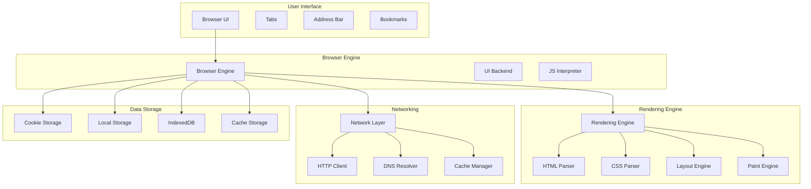

# How Browsers Work - Complete Technical Architecture

## 🎯 Overview

This comprehensive guide covers how modern web browsers work internally, including rendering engines, JavaScript engines, networking, security, and performance optimization. Essential knowledge for backend engineers working with web technologies.

## 🏗️ High-Level Browser Architecture



## 🔧 Core Components

### 1. Rendering Engine

#### HTML Parsing Process
```go
type HTMLParser struct {
    tokenizer    HTMLTokenizer
    treeBuilder  TreeBuilder
    document     Document
}

func (hp *HTMLParser) ParseHTML(html string) (*Document, error) {
    // Tokenize HTML
    tokens, err := hp.tokenizer.Tokenize(html)
    if err != nil {
        return nil, err
    }
    
    // Build DOM tree
    document, err := hp.treeBuilder.BuildTree(tokens)
    if err != nil {
        return nil, err
    }
    
    return document, nil
}

func (hp *HTMLParser) Tokenize(html string) ([]Token, error) {
    var tokens []Token
    state := "data"
    
    for i, char := range html {
        switch state {
        case "data":
            if char == '<' {
                state = "tag_open"
            } else {
                tokens = append(tokens, Token{Type: "character", Value: string(char)})
            }
        case "tag_open":
            if char == '/' {
                state = "end_tag_open"
            } else if isLetter(char) {
                state = "tag_name"
                tokens = append(tokens, Token{Type: "start_tag", Value: ""})
            }
        // ... more states
        }
    }
    
    return tokens, nil
}
```

#### CSS Parsing and Processing
```go
type CSSParser struct {
    tokenizer    CSSTokenizer
    ruleBuilder  RuleBuilder
    stylesheet   Stylesheet
}

func (cp *CSSParser) ParseCSS(css string) (*Stylesheet, error) {
    // Tokenize CSS
    tokens, err := cp.tokenizer.Tokenize(css)
    if err != nil {
        return nil, err
    }
    
    // Parse rules
    rules, err := cp.parseRules(tokens)
    if err != nil {
        return nil, err
    }
    
    // Build stylesheet
    stylesheet := &Stylesheet{
        Rules: rules,
    }
    
    return stylesheet, nil
}

func (cp *CSSParser) parseRules(tokens []Token) ([]Rule, error) {
    var rules []Rule
    var currentRule *Rule
    
    for _, token := range tokens {
        switch token.Type {
        case "selector":
            if currentRule != nil {
                rules = append(rules, *currentRule)
            }
            currentRule = &Rule{Selector: token.Value}
        case "property":
            if currentRule != nil {
                currentRule.Properties = append(currentRule.Properties, Property{Name: token.Value})
            }
        case "value":
            if currentRule != nil && len(currentRule.Properties) > 0 {
                currentRule.Properties[len(currentRule.Properties)-1].Value = token.Value
            }
        }
    }
    
    if currentRule != nil {
        rules = append(rules, *currentRule)
    }
    
    return rules, nil
}
```

#### Layout Engine (Reflow)
```go
type LayoutEngine struct {
    document     Document
    renderTree   RenderTree
    layoutTree   LayoutTree
}

func (le *LayoutEngine) Layout() (*LayoutTree, error) {
    // Build render tree
    renderTree, err := le.buildRenderTree()
    if err != nil {
        return nil, err
    }
    
    // Calculate layout
    layoutTree, err := le.calculateLayout(renderTree)
    if err != nil {
        return nil, err
    }
    
    return layoutTree, nil
}

func (le *LayoutEngine) buildRenderTree() (*RenderTree, error) {
    var renderNodes []RenderNode
    
    // Traverse DOM tree
    le.traverseDOM(le.document.Root, &renderNodes)
    
    return &RenderTree{Nodes: renderNodes}, nil
}

func (le *LayoutEngine) calculateLayout(renderTree *RenderTree) (*LayoutTree, error) {
    var layoutNodes []LayoutNode
    
    for _, renderNode := range renderTree.Nodes {
        layoutNode := le.calculateNodeLayout(renderNode)
        layoutNodes = append(layoutNodes, layoutNode)
    }
    
    return &LayoutTree{Nodes: layoutNodes}, nil
}

func (le *LayoutEngine) calculateNodeLayout(renderNode RenderNode) LayoutNode {
    // Calculate dimensions
    width := le.calculateWidth(renderNode)
    height := le.calculateHeight(renderNode)
    
    // Calculate position
    x, y := le.calculatePosition(renderNode)
    
    return LayoutNode{
        Element:  renderNode.Element,
        X:        x,
        Y:        y,
        Width:    width,
        Height:   height,
        Children: le.calculateChildrenLayout(renderNode.Children),
    }
}
```

#### Paint Engine (Repaint)
```go
type PaintEngine struct {
    layoutTree   LayoutTree
    canvas       Canvas
    paintLayers  []PaintLayer
}

func (pe *PaintEngine) Paint() error {
    // Create paint layers
    pe.createPaintLayers()
    
    // Paint each layer
    for _, layer := range pe.paintLayers {
        if err := pe.paintLayer(layer); err != nil {
            return err
        }
    }
    
    return nil
}

func (pe *PaintEngine) createPaintLayers() {
    pe.traverseLayoutTree(pe.layoutTree.Root, func(node LayoutNode) {
        if pe.needsNewLayer(node) {
            layer := PaintLayer{
                Node: node,
                ZIndex: node.ZIndex,
            }
            pe.paintLayers = append(pe.paintLayers, layer)
        }
    })
    
    // Sort layers by z-index
    sort.Slice(pe.paintLayers, func(i, j int) bool {
        return pe.paintLayers[i].ZIndex < pe.paintLayers[j].ZIndex
    })
}

func (pe *PaintEngine) paintLayer(layer PaintLayer) error {
    // Set up painting context
    context := pe.canvas.GetContext()
    
    // Paint background
    if err := pe.paintBackground(context, layer.Node); err != nil {
        return err
    }
    
    // Paint border
    if err := pe.paintBorder(context, layer.Node); err != nil {
        return err
    }
    
    // Paint content
    if err := pe.paintContent(context, layer.Node); err != nil {
        return err
    }
    
    return nil
}
```

### 2. JavaScript Engine

#### V8 Engine Architecture
```go
type V8Engine struct {
    parser       Parser
    compiler     Compiler
    interpreter  Interpreter
    optimizer    Optimizer
    garbageCollector GarbageCollector
}

func (v8 *V8Engine) ExecuteJavaScript(code string) (interface{}, error) {
    // Parse JavaScript code
    ast, err := v8.parser.Parse(code)
    if err != nil {
        return nil, err
    }
    
    // Compile to bytecode
    bytecode, err := v8.compiler.Compile(ast)
    if err != nil {
        return nil, err
    }
    
    // Execute bytecode
    result, err := v8.interpreter.Execute(bytecode)
    if err != nil {
        return nil, err
    }
    
    return result, nil
}

func (v8 *V8Engine) Parse(code string) (*AST, error) {
    // Tokenize JavaScript
    tokens, err := v8.tokenize(code)
    if err != nil {
        return nil, err
    }
    
    // Parse tokens into AST
    ast, err := v8.parseTokens(tokens)
    if err != nil {
        return nil, err
    }
    
    return ast, nil
}

func (v8 *V8Engine) tokenize(code string) ([]Token, error) {
    var tokens []Token
    state := "initial"
    
    for i, char := range code {
        switch state {
        case "initial":
            if isWhitespace(char) {
                continue
            } else if isLetter(char) {
                state = "identifier"
                tokens = append(tokens, Token{Type: "identifier", Value: string(char)})
            } else if isDigit(char) {
                state = "number"
                tokens = append(tokens, Token{Type: "number", Value: string(char)})
            } else if char == '"' {
                state = "string"
                tokens = append(tokens, Token{Type: "string", Value: ""})
            }
        // ... more states
        }
    }
    
    return tokens, nil
}
```

#### Garbage Collection
```go
type GarbageCollector struct {
    heap        Heap
    markStack   []Object
    sweepList   []Object
}

func (gc *GarbageCollector) Collect() error {
    // Mark phase
    if err := gc.mark(); err != nil {
        return err
    }
    
    // Sweep phase
    if err := gc.sweep(); err != nil {
        return err
    }
    
    return nil
}

func (gc *GarbageCollector) mark() error {
    // Start from roots
    roots := gc.getRoots()
    
    for _, root := range roots {
        gc.markObject(root)
    }
    
    // Mark all reachable objects
    for len(gc.markStack) > 0 {
        obj := gc.markStack[len(gc.markStack)-1]
        gc.markStack = gc.markStack[:len(gc.markStack)-1]
        
        // Mark object
        obj.Marked = true
        
        // Add children to mark stack
        for _, child := range obj.Children {
            if !child.Marked {
                gc.markStack = append(gc.markStack, child)
            }
        }
    }
    
    return nil
}

func (gc *GarbageCollector) sweep() error {
    // Remove unmarked objects
    for _, obj := range gc.heap.Objects {
        if !obj.Marked {
            gc.heap.RemoveObject(obj)
        } else {
            obj.Marked = false // Reset for next collection
        }
    }
    
    return nil
}
```

### 3. Networking Layer

#### HTTP Client Implementation
```go
type HTTPClient struct {
    connectionPool ConnectionPool
    dnsResolver    DNSResolver
    cacheManager   CacheManager
    cookieJar      CookieJar
}

func (hc *HTTPClient) Request(req *HTTPRequest) (*HTTPResponse, error) {
    // Check cache first
    if cached, err := hc.cacheManager.Get(req.URL); err == nil {
        return cached, nil
    }
    
    // Resolve DNS
    ip, err := hc.dnsResolver.Resolve(req.URL.Host)
    if err != nil {
        return nil, err
    }
    
    // Get connection from pool
    conn, err := hc.connectionPool.GetConnection(ip, req.URL.Port)
    if err != nil {
        return nil, err
    }
    defer hc.connectionPool.ReturnConnection(conn)
    
    // Send request
    resp, err := hc.sendRequest(conn, req)
    if err != nil {
        return nil, err
    }
    
    // Cache response
    hc.cacheManager.Set(req.URL, resp)
    
    return resp, nil
}

func (hc *HTTPClient) sendRequest(conn *Connection, req *HTTPRequest) (*HTTPResponse, error) {
    // Build HTTP request
    httpReq := hc.buildHTTPRequest(req)
    
    // Send request
    if err := conn.Write(httpReq); err != nil {
        return nil, err
    }
    
    // Read response
    resp, err := conn.Read()
    if err != nil {
        return nil, err
    }
    
    // Parse response
    return hc.parseResponse(resp)
}
```

#### DNS Resolution
```go
type DNSResolver struct {
    cache        DNSCache
    rootServers  []string
    recursiveResolvers []string
}

func (dr *DNSResolver) Resolve(hostname string) (string, error) {
    // Check cache first
    if ip, err := dr.cache.Get(hostname); err == nil {
        return ip, nil
    }
    
    // Perform DNS resolution
    ip, err := dr.resolveRecursive(hostname)
    if err != nil {
        return "", err
    }
    
    // Cache result
    dr.cache.Set(hostname, ip)
    
    return ip, nil
}

func (dr *DNSResolver) resolveRecursive(hostname string) (string, error) {
    // Start with root servers
    servers := dr.rootServers
    
    for {
        for _, server := range servers {
            resp, err := dr.queryDNS(hostname, server)
            if err != nil {
                continue
            }
            
            if resp.Answer != nil {
                return resp.Answer.IP, nil
            }
            
            if resp.Authority != nil {
                servers = resp.Authority.NameServers
                break
            }
        }
    }
}
```

### 4. Security Model

#### Same-Origin Policy
```go
type SecurityManager struct {
    originChecker OriginChecker
    policyEnforcer PolicyEnforcer
}

func (sm *SecurityManager) CheckSameOrigin(request *Request) bool {
    origin := sm.extractOrigin(request.URL)
    targetOrigin := sm.extractOrigin(request.TargetURL)
    
    return origin.Protocol == targetOrigin.Protocol &&
           origin.Host == targetOrigin.Host &&
           origin.Port == targetOrigin.Port
}

func (sm *SecurityManager) extractOrigin(url *URL) *Origin {
    return &Origin{
        Protocol: url.Scheme,
        Host:     url.Hostname,
        Port:     url.Port,
    }
}
```

#### Content Security Policy
```go
type CSPManager struct {
    policyParser PolicyParser
    violationReporter ViolationReporter
}

func (csp *CSPManager) CheckPolicy(request *Request) bool {
    // Parse CSP header
    policy, err := csp.policyParser.Parse(request.Headers["Content-Security-Policy"])
    if err != nil {
        return true // Allow if no policy
    }
    
    // Check directive
    directive := policy.GetDirective(request.Type)
    if directive == nil {
        return true // Allow if no directive
    }
    
    // Check source
    return directive.AllowsSource(request.Source)
}
```

### 5. Performance Optimization

#### Resource Loading
```go
type ResourceLoader struct {
    priorityQueue PriorityQueue
    connectionManager ConnectionManager
    cacheManager  CacheManager
}

func (rl *ResourceLoader) LoadResource(resource *Resource) error {
    // Check cache first
    if cached, err := rl.cacheManager.Get(resource.URL); err == nil {
        resource.Data = cached
        return nil
    }
    
    // Add to priority queue
    rl.priorityQueue.Push(resource, resource.Priority)
    
    // Process queue
    return rl.processQueue()
}

func (rl *ResourceLoader) processQueue() error {
    for rl.priorityQueue.Len() > 0 {
        resource := rl.priorityQueue.Pop()
        
        // Get connection
        conn, err := rl.connectionManager.GetConnection(resource.URL)
        if err != nil {
            return err
        }
        
        // Load resource
        data, err := rl.loadFromConnection(conn, resource)
        if err != nil {
            return err
        }
        
        // Cache resource
        rl.cacheManager.Set(resource.URL, data)
        
        // Notify completion
        resource.Callback(data)
    }
    
    return nil
}
```

#### Critical Rendering Path
```go
type CriticalRenderingPath struct {
    htmlParser   HTMLParser
    cssParser    CSSParser
    layoutEngine LayoutEngine
    paintEngine  PaintEngine
}

func (crp *CriticalRenderingPath) Render(html string, css string) error {
    // Parse HTML
    document, err := crp.htmlParser.ParseHTML(html)
    if err != nil {
        return err
    }
    
    // Parse CSS
    stylesheet, err := crp.cssParser.ParseCSS(css)
    if err != nil {
        return err
    }
    
    // Build render tree
    renderTree, err := crp.buildRenderTree(document, stylesheet)
    if err != nil {
        return err
    }
    
    // Layout
    layoutTree, err := crp.layoutEngine.Layout(renderTree)
    if err != nil {
        return err
    }
    
    // Paint
    if err := crp.paintEngine.Paint(layoutTree); err != nil {
        return err
    }
    
    return nil
}
```

## 🔍 Advanced Features

### 1. WebAssembly Integration

#### WASM Runtime
```go
type WASMRuntime struct {
    moduleLoader ModuleLoader
    memoryManager MemoryManager
    functionTable FunctionTable
}

func (wr *WASMRuntime) ExecuteWASM(wasmBytes []byte) error {
    // Load WASM module
    module, err := wr.moduleLoader.Load(wasmBytes)
    if err != nil {
        return err
    }
    
    // Initialize memory
    memory, err := wr.memoryManager.Allocate(module.MemorySize)
    if err != nil {
        return err
    }
    
    // Execute functions
    for _, function := range module.Functions {
        if err := wr.executeFunction(function, memory); err != nil {
            return err
        }
    }
    
    return nil
}
```

### 2. Service Workers

#### Service Worker Manager
```go
type ServiceWorkerManager struct {
    registrationStore RegistrationStore
    scriptCache      ScriptCache
    messageQueue     MessageQueue
}

func (swm *ServiceWorkerManager) Register(scope string, scriptURL string) error {
    // Download script
    script, err := swm.downloadScript(scriptURL)
    if err != nil {
        return err
    }
    
    // Cache script
    swm.scriptCache.Set(scriptURL, script)
    
    // Create registration
    registration := &ServiceWorkerRegistration{
        Scope:     scope,
        ScriptURL: scriptURL,
        State:     "installing",
    }
    
    // Store registration
    return swm.registrationStore.Store(registration)
}

func (swm *ServiceWorkerManager) Install(registration *ServiceWorkerRegistration) error {
    // Get script
    script, err := swm.scriptCache.Get(registration.ScriptURL)
    if err != nil {
        return err
    }
    
    // Install service worker
    sw, err := swm.createServiceWorker(script)
    if err != nil {
        return err
    }
    
    // Update registration
    registration.State = "installed"
    registration.ServiceWorker = sw
    
    return swm.registrationStore.Update(registration)
}
```

## 📊 Performance Metrics

### 1. Core Web Vitals

#### LCP (Largest Contentful Paint)
```go
type LCPTracker struct {
    elements    []Element
    observer    PerformanceObserver
    lcpValue    float64
}

func (lcp *LCPTracker) TrackLCP() {
    lcp.observer.Observe("largest-contentful-paint", func(entry PerformanceEntry) {
        if entry.StartTime > lcp.lcpValue {
            lcp.lcpValue = entry.StartTime
        }
    })
}
```

#### FID (First Input Delay)
```go
type FIDTracker struct {
    firstInput  *PerformanceEntry
    observer    PerformanceObserver
}

func (fid *FIDTracker) TrackFID() {
    fid.observer.Observe("first-input", func(entry PerformanceEntry) {
        if fid.firstInput == nil {
            fid.firstInput = &entry
        }
    })
}
```

#### CLS (Cumulative Layout Shift)
```go
type CLSTracker struct {
    layoutShifts []LayoutShift
    observer     PerformanceObserver
    clsValue     float64
}

func (cls *CLSTracker) TrackCLS() {
    cls.observer.Observe("layout-shift", func(entry PerformanceEntry) {
        if !entry.HadRecentInput {
            cls.layoutShifts = append(cls.layoutShifts, entry)
            cls.clsValue += entry.Value
        }
    })
}
```

## 🔍 Key Technical Challenges

### 1. Memory Management
- **Problem**: Managing memory for complex web applications
- **Solution**: Garbage collection with generational collection
- **Implementation**: V8's generational garbage collector

### 2. Rendering Performance
- **Problem**: Smooth 60fps rendering
- **Solution**: Hardware acceleration and layer optimization
- **Implementation**: GPU-accelerated compositing

### 3. Security
- **Problem**: Protecting users from malicious content
- **Solution**: Sandboxing and content security policies
- **Implementation**: Process isolation and CSP

### 4. Compatibility
- **Problem**: Supporting different web standards
- **Solution**: Feature detection and polyfills
- **Implementation**: Progressive enhancement

## 📚 Interview Questions

### System Design Questions
1. How would you design a web browser from scratch?
2. How does a browser render a web page?
3. How would you optimize browser performance?
4. How does browser security work?
5. How would you implement JavaScript execution?

### Technical Deep Dive
1. Explain the browser rendering pipeline
2. How does JavaScript garbage collection work?
3. Describe the HTTP/2 protocol implementation
4. How does browser caching work?
5. Explain the same-origin policy

## 🎯 Key Takeaways

1. **Rendering Pipeline**: HTML → CSS → Layout → Paint
2. **JavaScript Engine**: Parsing → Compilation → Execution
3. **Networking**: DNS → HTTP → Caching
4. **Security**: Same-origin policy and CSP
5. **Performance**: Critical rendering path optimization
6. **Memory Management**: Garbage collection strategies
7. **Standards**: Web APIs and compatibility

## 🔗 Additional Resources

- [How Browsers Work](https://web.dev/howbrowserswork/)
- [V8 Engine Documentation](https://v8.dev/)
- [Web Performance Best Practices](https://web.dev/performance/)
- [Browser Security Model](https://developer.mozilla.org/en-US/docs/Web/Security)
- [Web Standards](https://www.w3.org/standards/)
