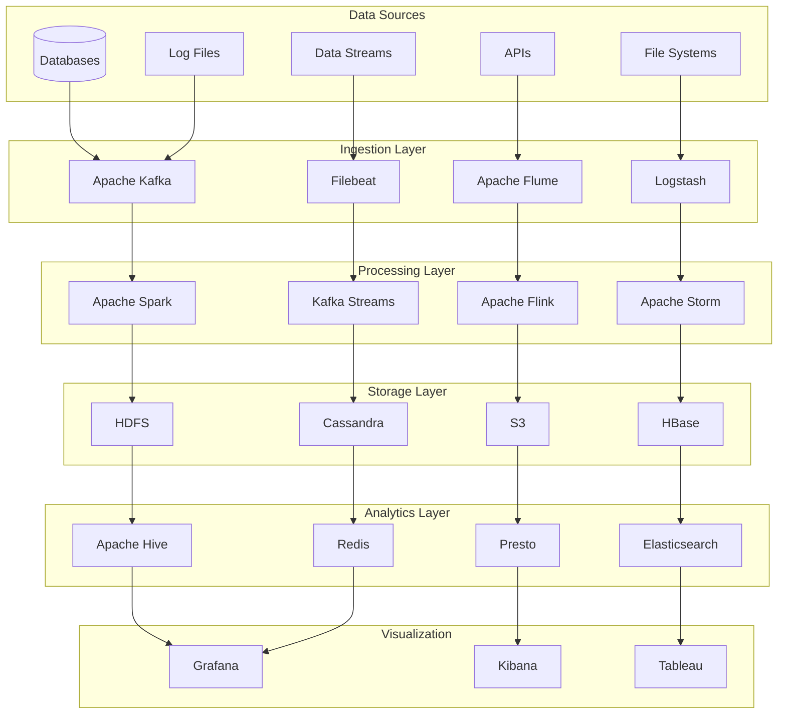

---
# Auto-generated front matter
Title: Data Pipelines Etl
LastUpdated: 2025-11-06T20:45:58.677619
Tags: []
Status: draft
---

# Data Pipeline and ETL Systems - Comprehensive Guide

## 🎯 Overview

This comprehensive guide covers data pipeline architectures, ETL (Extract, Transform, Load) systems, real-time data processing, and data engineering patterns. Essential for building scalable data infrastructure.

## 📊 Data Pipeline Architecture Overview



## 🔧 ETL Pipeline Implementation

### 1. Extract Layer

#### Database Extractor
```go
type DatabaseExtractor struct {
    db        *sql.DB
    config    DatabaseConfig
    batchSize int
}

type DatabaseConfig struct {
    Host     string
    Port     int
    Database string
    Username string
    Password string
    SSLMode  string
}

func NewDatabaseExtractor(config DatabaseConfig) (*DatabaseExtractor, error) {
    dsn := fmt.Sprintf("host=%s port=%d user=%s password=%s dbname=%s sslmode=%s",
        config.Host, config.Port, config.Username, config.Password, config.Database, config.SSLMode)
    
    db, err := sql.Open("postgres", dsn)
    if err != nil {
        return nil, err
    }
    
    return &DatabaseExtractor{
        db:        db,
        config:    config,
        batchSize: 1000,
    }, nil
}

func (de *DatabaseExtractor) ExtractTable(tableName string, lastExtracted time.Time) ([]Record, error) {
    query := fmt.Sprintf(`
        SELECT * FROM %s 
        WHERE updated_at > $1 
        ORDER BY updated_at 
        LIMIT $2
    `, tableName)
    
    rows, err := de.db.Query(query, lastExtracted, de.batchSize)
    if err != nil {
        return nil, err
    }
    defer rows.Close()
    
    var records []Record
    columns, err := rows.Columns()
    if err != nil {
        return nil, err
    }
    
    for rows.Next() {
        values := make([]interface{}, len(columns))
        valuePtrs := make([]interface{}, len(columns))
        for i := range values {
            valuePtrs[i] = &values[i]
        }
        
        if err := rows.Scan(valuePtrs...); err != nil {
            return nil, err
        }
        
        record := make(Record)
        for i, col := range columns {
            record[col] = values[i]
        }
        
        records = append(records, record)
    }
    
    return records, nil
}

func (de *DatabaseExtractor) ExtractIncremental(tableName string, watermark Watermark) ([]Record, error) {
    query := fmt.Sprintf(`
        SELECT * FROM %s 
        WHERE %s > $1 
        ORDER BY %s 
        LIMIT $2
    `, tableName, watermark.Column, watermark.Column)
    
    rows, err := de.db.Query(query, watermark.Value, de.batchSize)
    if err != nil {
        return nil, err
    }
    defer rows.Close()
    
    return de.scanRows(rows)
}
```

#### API Extractor
```go
type APIExtractor struct {
    client    *http.Client
    config    APIConfig
    rateLimit time.Duration
}

type APIConfig struct {
    BaseURL    string
    APIKey     string
    RateLimit  time.Duration
    Timeout    time.Duration
}

func NewAPIExtractor(config APIConfig) *APIExtractor {
    client := &http.Client{
        Timeout: config.Timeout,
    }
    
    return &APIExtractor{
        client:    client,
        config:    config,
        rateLimit: config.RateLimit,
    }
}

func (ae *APIExtractor) ExtractData(endpoint string, params map[string]string) ([]Record, error) {
    // Rate limiting
    time.Sleep(ae.rateLimit)
    
    // Build URL
    url := ae.buildURL(endpoint, params)
    
    // Create request
    req, err := http.NewRequest("GET", url, nil)
    if err != nil {
        return nil, err
    }
    
    // Add headers
    req.Header.Set("Authorization", "Bearer "+ae.config.APIKey)
    req.Header.Set("Accept", "application/json")
    
    // Make request
    resp, err := ae.client.Do(req)
    if err != nil {
        return nil, err
    }
    defer resp.Body.Close()
    
    // Check status
    if resp.StatusCode != http.StatusOK {
        return nil, fmt.Errorf("API request failed with status: %d", resp.StatusCode)
    }
    
    // Parse response
    var data APIResponse
    if err := json.NewDecoder(resp.Body).Decode(&data); err != nil {
        return nil, err
    }
    
    return data.Records, nil
}

func (ae *APIExtractor) buildURL(endpoint string, params map[string]string) string {
    url := ae.config.BaseURL + endpoint
    
    if len(params) > 0 {
        url += "?"
        var queryParams []string
        for key, value := range params {
            queryParams = append(queryParams, fmt.Sprintf("%s=%s", key, value))
        }
        url += strings.Join(queryParams, "&")
    }
    
    return url
}
```

#### File Extractor
```go
type FileExtractor struct {
    config FileConfig
}

type FileConfig struct {
    Path      string
    Pattern   string
    Format    string
    Delimiter string
}

func NewFileExtractor(config FileConfig) *FileExtractor {
    return &FileExtractor{
        config: config,
    }
}

func (fe *FileExtractor) ExtractFiles() ([]Record, error) {
    // Find files matching pattern
    files, err := fe.findFiles()
    if err != nil {
        return nil, err
    }
    
    var allRecords []Record
    
    for _, file := range files {
        records, err := fe.extractFile(file)
        if err != nil {
            log.Printf("Error extracting file %s: %v", file, err)
            continue
        }
        
        allRecords = append(allRecords, records...)
    }
    
    return allRecords, nil
}

func (fe *FileExtractor) findFiles() ([]string, error) {
    var files []string
    
    err := filepath.Walk(fe.config.Path, func(path string, info os.FileInfo, err error) error {
        if err != nil {
            return err
        }
        
        if !info.IsDir() {
            matched, err := filepath.Match(fe.config.Pattern, info.Name())
            if err != nil {
                return err
            }
            
            if matched {
                files = append(files, path)
            }
        }
        
        return nil
    })
    
    return files, err
}

func (fe *FileExtractor) extractFile(filePath string) ([]Record, error) {
    file, err := os.Open(filePath)
    if err != nil {
        return nil, err
    }
    defer file.Close()
    
    switch fe.config.Format {
    case "csv":
        return fe.extractCSV(file)
    case "json":
        return fe.extractJSON(file)
    case "parquet":
        return fe.extractParquet(file)
    default:
        return nil, fmt.Errorf("unsupported format: %s", fe.config.Format)
    }
}

func (fe *FileExtractor) extractCSV(file *os.File) ([]Record, error) {
    reader := csv.NewReader(file)
    reader.Comma = rune(fe.config.Delimiter[0])
    
    // Read header
    headers, err := reader.Read()
    if err != nil {
        return nil, err
    }
    
    var records []Record
    
    for {
        row, err := reader.Read()
        if err == io.EOF {
            break
        }
        if err != nil {
            return nil, err
        }
        
        record := make(Record)
        for i, value := range row {
            if i < len(headers) {
                record[headers[i]] = value
            }
        }
        
        records = append(records, record)
    }
    
    return records, nil
}
```

### 2. Transform Layer

#### Data Transformer
```go
type DataTransformer struct {
    rules []TransformRule
}

type TransformRule struct {
    Name        string
    SourceField string
    TargetField string
    Transform   TransformFunction
}

type TransformFunction func(interface{}) (interface{}, error)

func NewDataTransformer() *DataTransformer {
    return &DataTransformer{
        rules: make([]TransformRule, 0),
    }
}

func (dt *DataTransformer) AddRule(rule TransformRule) {
    dt.rules = append(dt.rules, rule)
}

func (dt *DataTransformer) Transform(records []Record) ([]Record, error) {
    var transformedRecords []Record
    
    for _, record := range records {
        transformedRecord := make(Record)
        
        // Copy original fields
        for key, value := range record {
            transformedRecord[key] = value
        }
        
        // Apply transformation rules
        for _, rule := range dt.rules {
            if value, exists := record[rule.SourceField]; exists {
                transformedValue, err := rule.Transform(value)
                if err != nil {
                    return nil, fmt.Errorf("error applying rule %s: %v", rule.Name, err)
                }
                
                transformedRecord[rule.TargetField] = transformedValue
            }
        }
        
        transformedRecords = append(transformedRecords, transformedRecord)
    }
    
    return transformedRecords, nil
}

// Common transformation functions
func StringToInt(value interface{}) (interface{}, error) {
    str, ok := value.(string)
    if !ok {
        return nil, fmt.Errorf("expected string, got %T", value)
    }
    
    return strconv.Atoi(str)
}

func StringToFloat(value interface{}) (interface{}, error) {
    str, ok := value.(string)
    if !ok {
        return nil, fmt.Errorf("expected string, got %T", value)
    }
    
    return strconv.ParseFloat(str, 64)
}

func StringToDate(value interface{}) (interface{}, error) {
    str, ok := value.(string)
    if !ok {
        return nil, fmt.Errorf("expected string, got %T", value)
    }
    
    return time.Parse("2006-01-02", str)
}

func UpperCase(value interface{}) (interface{}, error) {
    str, ok := value.(string)
    if !ok {
        return nil, fmt.Errorf("expected string, got %T", value)
    }
    
    return strings.ToUpper(str), nil
}

func LowerCase(value interface{}) (interface{}, error) {
    str, ok := value.(string)
    if !ok {
        return nil, fmt.Errorf("expected string, got %T", value)
    }
    
    return strings.ToLower(str), nil
}
```

#### Data Validator
```go
type DataValidator struct {
    rules []ValidationRule
}

type ValidationRule struct {
    Field    string
    Required bool
    Type     string
    Min      interface{}
    Max      interface{}
    Pattern  string
}

func NewDataValidator() *DataValidator {
    return &DataValidator{
        rules: make([]ValidationRule, 0),
    }
}

func (dv *DataValidator) AddRule(rule ValidationRule) {
    dv.rules = append(dv.rules, rule)
}

func (dv *DataValidator) Validate(records []Record) ([]Record, []ValidationError) {
    var validRecords []Record
    var errors []ValidationError
    
    for i, record := range records {
        recordErrors := dv.validateRecord(record, i)
        if len(recordErrors) == 0 {
            validRecords = append(validRecords, record)
        } else {
            errors = append(errors, recordErrors...)
        }
    }
    
    return validRecords, errors
}

func (dv *DataValidator) validateRecord(record Record, index int) []ValidationError {
    var errors []ValidationError
    
    for _, rule := range dv.rules {
        value, exists := record[rule.Field]
        
        // Check required
        if rule.Required && (!exists || value == nil || value == "") {
            errors = append(errors, ValidationError{
                RecordIndex: index,
                Field:       rule.Field,
                Message:     "field is required",
            })
            continue
        }
        
        if !exists || value == nil {
            continue
        }
        
        // Check type
        if rule.Type != "" {
            if !dv.checkType(value, rule.Type) {
                errors = append(errors, ValidationError{
                    RecordIndex: index,
                    Field:       rule.Field,
                    Message:     fmt.Sprintf("expected type %s, got %T", rule.Type, value),
                })
                continue
            }
        }
        
        // Check range
        if rule.Min != nil || rule.Max != nil {
            if err := dv.checkRange(value, rule.Min, rule.Max); err != nil {
                errors = append(errors, ValidationError{
                    RecordIndex: index,
                    Field:       rule.Field,
                    Message:     err.Error(),
                })
                continue
            }
        }
        
        // Check pattern
        if rule.Pattern != "" {
            if err := dv.checkPattern(value, rule.Pattern); err != nil {
                errors = append(errors, ValidationError{
                    RecordIndex: index,
                    Field:       rule.Field,
                    Message:     err.Error(),
                })
            }
        }
    }
    
    return errors
}
```

### 3. Load Layer

#### Database Loader
```go
type DatabaseLoader struct {
    db     *sql.DB
    config DatabaseConfig
}

func NewDatabaseLoader(config DatabaseConfig) (*DatabaseLoader, error) {
    dsn := fmt.Sprintf("host=%s port=%d user=%s password=%s dbname=%s sslmode=%s",
        config.Host, config.Port, config.Username, config.Password, config.Database, config.SSLMode)
    
    db, err := sql.Open("postgres", dsn)
    if err != nil {
        return nil, err
    }
    
    return &DatabaseLoader{
        db:     db,
        config: config,
    }, nil
}

func (dl *DatabaseLoader) LoadRecords(tableName string, records []Record) error {
    if len(records) == 0 {
        return nil
    }
    
    // Get column names from first record
    var columns []string
    for column := range records[0] {
        columns = append(columns, column)
    }
    
    // Build INSERT statement
    placeholders := make([]string, len(columns))
    for i := range placeholders {
        placeholders[i] = fmt.Sprintf("$%d", i+1)
    }
    
    query := fmt.Sprintf(`
        INSERT INTO %s (%s) VALUES (%s)
        ON CONFLICT DO UPDATE SET %s
    `, tableName, 
        strings.Join(columns, ","),
        strings.Join(placeholders, ","),
        dl.buildUpdateClause(columns))
    
    // Prepare statement
    stmt, err := dl.db.Prepare(query)
    if err != nil {
        return err
    }
    defer stmt.Close()
    
    // Insert records in batches
    batchSize := 1000
    for i := 0; i < len(records); i += batchSize {
        end := i + batchSize
        if end > len(records) {
            end = len(records)
        }
        
        if err := dl.insertBatch(stmt, records[i:end], columns); err != nil {
            return err
        }
    }
    
    return nil
}

func (dl *DatabaseLoader) insertBatch(stmt *sql.Stmt, records []Record, columns []string) error {
    for _, record := range records {
        values := make([]interface{}, len(columns))
        for i, column := range columns {
            values[i] = record[column]
        }
        
        if _, err := stmt.Exec(values...); err != nil {
            return err
        }
    }
    
    return nil
}
```

#### File Loader
```go
type FileLoader struct {
    config FileConfig
}

func NewFileLoader(config FileConfig) *FileLoader {
    return &FileLoader{
        config: config,
    }
}

func (fl *FileLoader) LoadRecords(records []Record) error {
    if len(records) == 0 {
        return nil
    }
    
    // Create output file
    file, err := os.Create(fl.config.Path)
    if err != nil {
        return err
    }
    defer file.Close()
    
    switch fl.config.Format {
    case "csv":
        return fl.writeCSV(file, records)
    case "json":
        return fl.writeJSON(file, records)
    case "parquet":
        return fl.writeParquet(file, records)
    default:
        return fmt.Errorf("unsupported format: %s", fl.config.Format)
    }
}

func (fl *FileLoader) writeCSV(file *os.File, records []Record) error {
    writer := csv.NewWriter(file)
    defer writer.Flush()
    
    // Write header
    if len(records) > 0 {
        var headers []string
        for header := range records[0] {
            headers = append(headers, header)
        }
        writer.Write(headers)
        
        // Write records
        for _, record := range records {
            var row []string
            for _, header := range headers {
                value := record[header]
                if value == nil {
                    row = append(row, "")
                } else {
                    row = append(row, fmt.Sprintf("%v", value))
                }
            }
            writer.Write(row)
        }
    }
    
    return nil
}

func (fl *FileLoader) writeJSON(file *os.File, records []Record) error {
    encoder := json.NewEncoder(file)
    encoder.SetIndent("", "  ")
    
    return encoder.Encode(records)
}
```

## 🔧 Real-time Data Processing

### 1. Stream Processing

#### Kafka Streams Processor
```go
type StreamProcessor struct {
    producer  *kafka.Producer
    consumer  *kafka.Consumer
    processor Processor
}

func NewStreamProcessor(brokers []string, groupID string) (*StreamProcessor, error) {
    // Create producer
    producer, err := kafka.NewProducer(&kafka.ConfigMap{
        "bootstrap.servers": strings.Join(brokers, ","),
    })
    if err != nil {
        return nil, err
    }
    
    // Create consumer
    consumer, err := kafka.NewConsumer(&kafka.ConfigMap{
        "bootstrap.servers": strings.Join(brokers, ","),
        "group.id":          groupID,
        "auto.offset.reset": "earliest",
    })
    if err != nil {
        return nil, err
    }
    
    return &StreamProcessor{
        producer: producer,
        consumer: consumer,
    }, nil
}

func (sp *StreamProcessor) ProcessStream(inputTopic string, outputTopic string, processor Processor) error {
    // Subscribe to input topic
    sp.consumer.SubscribeTopics([]string{inputTopic}, nil)
    
    for {
        msg, err := sp.consumer.ReadMessage(-1)
        if err != nil {
            log.Printf("Error reading message: %v", err)
            continue
        }
        
        // Process message
        processedMsg, err := processor.Process(msg.Value)
        if err != nil {
            log.Printf("Error processing message: %v", err)
            continue
        }
        
        // Send to output topic
        if err := sp.produceMessage(outputTopic, processedMsg); err != nil {
            log.Printf("Error producing message: %v", err)
        }
    }
}

func (sp *StreamProcessor) produceMessage(topic string, message []byte) error {
    return sp.producer.Produce(&kafka.Message{
        TopicPartition: kafka.TopicPartition{
            Topic:     &topic,
            Partition: kafka.PartitionAny,
        },
        Value: message,
    }, nil)
}
```

### 2. Data Pipeline Orchestration

#### Pipeline Orchestrator
```go
type PipelineOrchestrator struct {
    steps    []PipelineStep
    executor Executor
    monitor  Monitor
}

type PipelineStep struct {
    Name        string
    Type        string
    Config      map[string]interface{}
    Dependencies []string
    RetryCount  int
    Timeout     time.Duration
}

type Executor interface {
    Execute(step PipelineStep) error
}

type Monitor interface {
    RecordStepStart(stepName string)
    RecordStepEnd(stepName string, err error)
    RecordPipelineStart(pipelineName string)
    RecordPipelineEnd(pipelineName string, err error)
}

func NewPipelineOrchestrator() *PipelineOrchestrator {
    return &PipelineOrchestrator{
        steps:    make([]PipelineStep, 0),
        executor: NewDefaultExecutor(),
        monitor:  NewDefaultMonitor(),
    }
}

func (po *PipelineOrchestrator) AddStep(step PipelineStep) {
    po.steps = append(po.steps, step)
}

func (po *PipelineOrchestrator) Execute(pipelineName string) error {
    po.monitor.RecordPipelineStart(pipelineName)
    
    // Build dependency graph
    graph, err := po.buildDependencyGraph()
    if err != nil {
        po.monitor.RecordPipelineEnd(pipelineName, err)
        return err
    }
    
    // Execute steps in topological order
    for _, step := range graph {
        if err := po.executeStep(step); err != nil {
            po.monitor.RecordPipelineEnd(pipelineName, err)
            return err
        }
    }
    
    po.monitor.RecordPipelineEnd(pipelineName, nil)
    return nil
}

func (po *PipelineOrchestrator) executeStep(step PipelineStep) error {
    po.monitor.RecordStepStart(step.Name)
    
    var lastErr error
    for i := 0; i <= step.RetryCount; i++ {
        if err := po.executor.Execute(step); err != nil {
            lastErr = err
            if i < step.RetryCount {
                time.Sleep(time.Duration(i+1) * time.Second)
                continue
            }
        } else {
            lastErr = nil
            break
        }
    }
    
    po.monitor.RecordStepEnd(step.Name, lastErr)
    return lastErr
}
```

## 📊 Data Quality and Monitoring

### 1. Data Quality Metrics

#### Quality Metrics Collector
```go
type QualityMetricsCollector struct {
    metrics map[string]*QualityMetric
    mutex   sync.RWMutex
}

type QualityMetric struct {
    Name        string
    Value       float64
    Threshold   float64
    Status      string
    LastUpdated time.Time
}

func NewQualityMetricsCollector() *QualityMetricsCollector {
    return &QualityMetricsCollector{
        metrics: make(map[string]*QualityMetric),
    }
}

func (qmc *QualityMetricsCollector) RecordMetric(name string, value float64, threshold float64) {
    qmc.mutex.Lock()
    defer qmc.mutex.Unlock()
    
    status := "PASS"
    if value < threshold {
        status = "FAIL"
    }
    
    qmc.metrics[name] = &QualityMetric{
        Name:        name,
        Value:       value,
        Threshold:   threshold,
        Status:      status,
        LastUpdated: time.Now(),
    }
}

func (qmc *QualityMetricsCollector) GetMetrics() map[string]*QualityMetric {
    qmc.mutex.RLock()
    defer qmc.mutex.RUnlock()
    
    result := make(map[string]*QualityMetric)
    for name, metric := range qmc.metrics {
        result[name] = metric
    }
    
    return result
}
```

### 2. Data Lineage Tracking

#### Lineage Tracker
```go
type LineageTracker struct {
    lineage map[string]*DataLineage
    mutex   sync.RWMutex
}

type DataLineage struct {
    Dataset    string
    Sources    []string
    Transformations []string
    Targets    []string
    Timestamp  time.Time
}

func NewLineageTracker() *LineageTracker {
    return &LineageTracker{
        lineage: make(map[string]*DataLineage),
    }
}

func (lt *LineageTracker) TrackLineage(dataset string, sources []string, transformations []string, targets []string) {
    lt.mutex.Lock()
    defer lt.mutex.Unlock()
    
    lt.lineage[dataset] = &DataLineage{
        Dataset:         dataset,
        Sources:         sources,
        Transformations: transformations,
        Targets:         targets,
        Timestamp:       time.Now(),
    }
}

func (lt *LineageTracker) GetLineage(dataset string) *DataLineage {
    lt.mutex.RLock()
    defer lt.mutex.RUnlock()
    
    return lt.lineage[dataset]
}
```

## 🔍 Key Technical Challenges

### 1. Data Consistency
- **Problem**: Ensuring data consistency across systems
- **Solution**: Idempotent operations and eventual consistency
- **Implementation**: Versioning and conflict resolution

### 2. Performance at Scale
- **Problem**: Processing large volumes of data
- **Solution**: Parallel processing and distributed computing
- **Implementation**: Spark, Flink, and Kubernetes

### 3. Data Quality
- **Problem**: Maintaining data quality
- **Solution**: Validation rules and monitoring
- **Implementation**: Automated testing and alerting

### 4. Schema Evolution
- **Problem**: Handling schema changes
- **Solution**: Schema registry and versioning
- **Implementation**: Avro, Protobuf, and JSON Schema

## 📚 Interview Questions

### System Design Questions
1. How would you design a data pipeline?
2. How does ETL differ from ELT?
3. How would you handle real-time data processing?
4. How does data quality monitoring work?
5. How would you design a data lake?

### Technical Deep Dive
1. Explain the Lambda architecture
2. How does Apache Spark work?
3. Describe the Kappa architecture
4. How does data lineage tracking work?
5. Explain data partitioning strategies

## 🎯 Key Takeaways

1. **ETL Pipeline**: Extract, Transform, Load data
2. **Real-time Processing**: Stream processing with Kafka
3. **Data Quality**: Validation and monitoring
4. **Data Lineage**: Track data flow and transformations
5. **Performance**: Parallel processing and optimization
6. **Scalability**: Distributed computing and storage
7. **Monitoring**: Metrics, logging, and alerting

## 🔗 Additional Resources

- [Apache Spark Documentation](https://spark.apache.org/docs/)
- [Apache Kafka Documentation](https://kafka.apache.org/documentation/)
- [Apache Flink Documentation](https://flink.apache.org/docs/)
- [Data Engineering Best Practices](https://www.oreilly.com/library/view/fundamentals-of-data/9781492040806/)
- [ETL vs ELT](https://www.stitchdata.com/resources/etl-vs-elt/)
