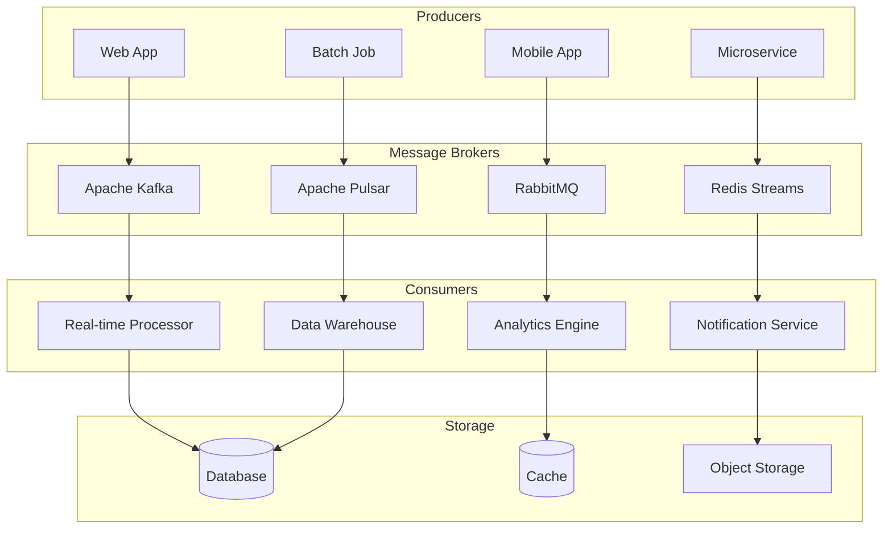

# Advanced Message Queue Systems and Event Streaming - Comprehensive Guide

## 🎯 Overview

This comprehensive guide covers advanced message queue systems, event streaming platforms, and real-time data processing architectures. Essential for building scalable, resilient backend systems.

## 📊 Message Queue Architecture Overview



## 🔧 Core Message Queue Systems

### 1. Apache Kafka Implementation

#### Kafka Producer
```go
type KafkaProducer struct {
    brokers    []string
    client     sarama.Client
    producer   sarama.SyncProducer
    config     *sarama.Config
}

func NewKafkaProducer(brokers []string) (*KafkaProducer, error) {
    config := sarama.NewConfig()
    config.Producer.RequiredAcks = sarama.WaitForAll
    config.Producer.Retry.Max = 3
    config.Producer.Return.Successes = true
    config.Producer.Compression = sarama.SnappyCompression
    
    client, err := sarama.NewClient(brokers, config)
    if err != nil {
        return nil, err
    }
    
    producer, err := sarama.NewSyncProducerFromClient(client)
    if err != nil {
        return nil, err
    }
    
    return &KafkaProducer{
        brokers:  brokers,
        client:   client,
        producer: producer,
        config:   config,
    }, nil
}

func (kp *KafkaProducer) SendMessage(topic string, key string, value []byte) error {
    message := &sarama.ProducerMessage{
        Topic: topic,
        Key:   sarama.StringEncoder(key),
        Value: sarama.ByteEncoder(value),
        Headers: []sarama.RecordHeader{
            {
                Key:   []byte("timestamp"),
                Value: []byte(time.Now().Format(time.RFC3339)),
            },
        },
    }
    
    partition, offset, err := kp.producer.SendMessage(message)
    if err != nil {
        return err
    }
    
    log.Printf("Message sent to topic %s, partition %d, offset %d", topic, partition, offset)
    return nil
}

func (kp *KafkaProducer) SendBatch(topic string, messages []Message) error {
    var producerMessages []*sarama.ProducerMessage
    
    for _, msg := range messages {
        producerMessage := &sarama.ProducerMessage{
            Topic: topic,
            Key:   sarama.StringEncoder(msg.Key),
            Value: sarama.ByteEncoder(msg.Value),
        }
        producerMessages = append(producerMessages, producerMessage)
    }
    
    return kp.producer.SendMessages(producerMessages)
}
```

#### Kafka Consumer
```go
type KafkaConsumer struct {
    brokers    []string
    client     sarama.Client
    consumer   sarama.ConsumerGroup
    config     *sarama.Config
    handler    MessageHandler
}

func NewKafkaConsumer(brokers []string, groupID string) (*KafkaConsumer, error) {
    config := sarama.NewConfig()
    config.Consumer.Group.Rebalance.Strategy = sarama.BalanceStrategyRoundRobin
    config.Consumer.Offsets.Initial = sarama.OffsetNewest
    config.Consumer.Group.Session.Timeout = 10 * time.Second
    config.Consumer.Group.Heartbeat.Interval = 3 * time.Second
    
    client, err := sarama.NewClient(brokers, config)
    if err != nil {
        return nil, err
    }
    
    consumer, err := sarama.NewConsumerGroupFromClient(groupID, client)
    if err != nil {
        return nil, err
    }
    
    return &KafkaConsumer{
        brokers: brokers,
        client:  client,
        consumer: consumer,
        config:  config,
    }, nil
}

func (kc *KafkaConsumer) Consume(topics []string, handler MessageHandler) error {
    kc.handler = handler
    
    ctx := context.Background()
    for {
        err := kc.consumer.Consume(ctx, topics, kc)
        if err != nil {
            log.Printf("Error consuming: %v", err)
            time.Sleep(5 * time.Second)
        }
    }
}

func (kc *KafkaConsumer) Setup(sarama.ConsumerGroupSession) error {
    return nil
}

func (kc *KafkaConsumer) Cleanup(sarama.ConsumerGroupSession) error {
    return nil
}

func (kc *KafkaConsumer) ConsumeClaim(session sarama.ConsumerGroupSession, claim sarama.ConsumerGroupClaim) error {
    for message := range claim.Messages() {
        msg := Message{
            Topic:     message.Topic,
            Partition: message.Partition,
            Offset:    message.Offset,
            Key:       string(message.Key),
            Value:     message.Value,
            Timestamp: message.Timestamp,
        }
        
        if err := kc.handler.HandleMessage(msg); err != nil {
            log.Printf("Error handling message: %v", err)
        }
        
        session.MarkMessage(message, "")
    }
    
    return nil
}
```

#### Kafka Streams Processing
```go
type KafkaStreamsProcessor struct {
    streams    map[string]*Stream
    processors map[string]Processor
    stateStore StateStore
}

func (ksp *KafkaStreamsProcessor) CreateStream(topic string) *Stream {
    stream := &Stream{
        Topic:    topic,
        Processors: make([]Processor, 0),
    }
    
    ksp.streams[topic] = stream
    return stream
}

func (ksp *KafkaStreamsProcessor) AddProcessor(stream *Stream, processor Processor) {
    stream.Processors = append(stream.Processors, processor)
    ksp.processors[processor.GetName()] = processor
}

func (ksp *KafkaStreamsProcessor) ProcessMessage(stream *Stream, message Message) error {
    currentMessage := message
    
    for _, processor := range stream.Processors {
        result, err := processor.Process(currentMessage)
        if err != nil {
            return err
        }
        
        if result != nil {
            currentMessage = *result
        }
    }
    
    return nil
}

// Example processors
type FilterProcessor struct {
    predicate func(Message) bool
}

func (fp *FilterProcessor) Process(msg Message) (*Message, error) {
    if fp.predicate(msg) {
        return &msg, nil
    }
    return nil, nil
}

func (fp *FilterProcessor) GetName() string {
    return "filter"
}

type TransformProcessor struct {
    transformer func(Message) Message
}

func (tp *TransformProcessor) Process(msg Message) (*Message, error) {
    transformed := tp.transformer(msg)
    return &transformed, nil
}

func (tp *TransformProcessor) GetName() string {
    return "transform"
}

type AggregateProcessor struct {
    keyExtractor func(Message) string
    aggregator   func(string, Message, interface{}) interface{}
    state        map[string]interface{}
}

func (ap *AggregateProcessor) Process(msg Message) (*Message, error) {
    key := ap.keyExtractor(msg)
    
    currentState := ap.state[key]
    newState := ap.aggregator(key, msg, currentState)
    ap.state[key] = newState
    
    // Create output message with aggregated state
    outputMsg := Message{
        Topic: msg.Topic + "-aggregated",
        Key:   key,
        Value: []byte(fmt.Sprintf("%v", newState)),
    }
    
    return &outputMsg, nil
}

func (ap *AggregateProcessor) GetName() string {
    return "aggregate"
}
```

### 2. RabbitMQ Implementation

#### RabbitMQ Producer
```go
type RabbitMQProducer struct {
    conn    *amqp.Connection
    channel *amqp.Channel
    config  RabbitMQConfig
}

type RabbitMQConfig struct {
    URL      string
    Exchange string
    Queue    string
}

func NewRabbitMQProducer(config RabbitMQConfig) (*RabbitMQProducer, error) {
    conn, err := amqp.Dial(config.URL)
    if err != nil {
        return nil, err
    }
    
    channel, err := conn.Channel()
    if err != nil {
        return nil, err
    }
    
    // Declare exchange
    err = channel.ExchangeDeclare(
        config.Exchange,
        "topic",
        true,
        false,
        false,
        false,
        nil,
    )
    if err != nil {
        return nil, err
    }
    
    // Declare queue
    _, err = channel.QueueDeclare(
        config.Queue,
        true,
        false,
        false,
        false,
        nil,
    )
    if err != nil {
        return nil, err
    }
    
    return &RabbitMQProducer{
        conn:    conn,
        channel: channel,
        config:  config,
    }, nil
}

func (rmq *RabbitMQProducer) Publish(routingKey string, body []byte) error {
    return rmq.channel.Publish(
        rmq.config.Exchange,
        routingKey,
        false,
        false,
        amqp.Publishing{
            ContentType:  "application/json",
            Body:         body,
            DeliveryMode: amqp.Persistent,
            Timestamp:    time.Now(),
        },
    )
}

func (rmq *RabbitMQProducer) PublishWithTTL(routingKey string, body []byte, ttl time.Duration) error {
    return rmq.channel.Publish(
        rmq.config.Exchange,
        routingKey,
        false,
        false,
        amqp.Publishing{
            ContentType:  "application/json",
            Body:         body,
            DeliveryMode: amqp.Persistent,
            Expiration:   fmt.Sprintf("%d", int(ttl.Milliseconds())),
            Timestamp:    time.Now(),
        },
    )
}
```

#### RabbitMQ Consumer
```go
type RabbitMQConsumer struct {
    conn    *amqp.Connection
    channel *amqp.Channel
    config  RabbitMQConfig
    handler MessageHandler
}

func NewRabbitMQConsumer(config RabbitMQConfig) (*RabbitMQConsumer, error) {
    conn, err := amqp.Dial(config.URL)
    if err != nil {
        return nil, err
    }
    
    channel, err := conn.Channel()
    if err != nil {
        return nil, err
    }
    
    // Set QoS
    err = channel.Qos(1, 0, false)
    if err != nil {
        return nil, err
    }
    
    return &RabbitMQConsumer{
        conn:    conn,
        channel: channel,
        config:  config,
    }, nil
}

func (rmq *RabbitMQConsumer) Consume(handler MessageHandler) error {
    rmq.handler = handler
    
    msgs, err := rmq.channel.Consume(
        rmq.config.Queue,
        "",
        false, // manual ack
        false,
        false,
        false,
        nil,
    )
    if err != nil {
        return err
    }
    
    go func() {
        for msg := range msgs {
            message := Message{
                Key:   msg.RoutingKey,
                Value: msg.Body,
                Headers: msg.Headers,
            }
            
            if err := rmq.handler.HandleMessage(message); err != nil {
                log.Printf("Error handling message: %v", err)
                msg.Nack(false, true) // requeue
            } else {
                msg.Ack(false)
            }
        }
    }()
    
    return nil
}
```

### 3. Redis Streams Implementation

#### Redis Streams Producer
```go
type RedisStreamsProducer struct {
    client *redis.Client
    config RedisConfig
}

type RedisConfig struct {
    Addr     string
    Password string
    DB       int
}

func NewRedisStreamsProducer(config RedisConfig) (*RedisStreamsProducer, error) {
    client := redis.NewClient(&redis.Options{
        Addr:     config.Addr,
        Password: config.Password,
        DB:       config.DB,
    })
    
    // Test connection
    _, err := client.Ping().Result()
    if err != nil {
        return nil, err
    }
    
    return &RedisStreamsProducer{
        client: client,
        config: config,
    }, nil
}

func (rsp *RedisStreamsProducer) AddMessage(stream string, fields map[string]interface{}) (string, error) {
    return rsp.client.XAdd(&redis.XAddArgs{
        Stream: stream,
        Values: fields,
    }).Result()
}

func (rsp *RedisStreamsProducer) AddMessageWithID(stream string, id string, fields map[string]interface{}) (string, error) {
    return rsp.client.XAdd(&redis.XAddArgs{
        Stream: stream,
        ID:     id,
        Values: fields,
    }).Result()
}

func (rsp *RedisStreamsProducer) CreateConsumerGroup(stream string, group string) error {
    return rsp.client.XGroupCreate(stream, group, "0").Err()
}
```

#### Redis Streams Consumer
```go
type RedisStreamsConsumer struct {
    client *redis.Client
    config RedisConfig
    group  string
    consumer string
}

func NewRedisStreamsConsumer(config RedisConfig, group string, consumer string) (*RedisStreamsConsumer, error) {
    client := redis.NewClient(&redis.Options{
        Addr:     config.Addr,
        Password: config.Password,
        DB:       config.DB,
    })
    
    return &RedisStreamsConsumer{
        client:  client,
        config: config,
        group:   group,
        consumer: consumer,
    }, nil
}

func (rsc *RedisStreamsConsumer) ReadMessages(streams []string, handler MessageHandler) error {
    for {
        streamsWithDollar := make([]string, len(streams)*2)
        for i, stream := range streams {
            streamsWithDollar[i*2] = stream
            streamsWithDollar[i*2+1] = ">"
        }
        
        result, err := rsc.client.XReadGroup(&redis.XReadGroupArgs{
            Group:    rsc.group,
            Consumer: rsc.consumer,
            Streams:  streamsWithDollar,
            Count:    10,
            Block:    time.Second,
        }).Result()
        
        if err != nil {
            if err == redis.Nil {
                continue
            }
            return err
        }
        
        for _, stream := range result {
            for _, message := range stream.Messages {
                msg := Message{
                    ID:     message.ID,
                    Stream: stream.Stream,
                    Fields: message.Values,
                }
                
                if err := handler.HandleMessage(msg); err != nil {
                    log.Printf("Error handling message: %v", err)
                }
                
                // Acknowledge message
                rsc.client.XAck(stream.Stream, rsc.group, message.ID)
            }
        }
    }
}
```

## 🔍 Event Streaming Patterns

### 1. Event Sourcing

#### Event Store Implementation
```go
type EventStore struct {
    events    []Event
    snapshots map[string]Snapshot
    mutex     sync.RWMutex
}

type Event struct {
    ID        string
    StreamID  string
    Type      string
    Data      map[string]interface{}
    Metadata  map[string]interface{}
    Version   int
    Timestamp time.Time
}

type Snapshot struct {
    StreamID    string
    Version     int
    Data        map[string]interface{}
    Timestamp   time.Time
}

func (es *EventStore) AppendEvents(streamID string, events []Event) error {
    es.mutex.Lock()
    defer es.mutex.Unlock()
    
    // Get current version
    currentVersion := es.getCurrentVersion(streamID)
    
    // Validate version
    for i, event := range events {
        expectedVersion := currentVersion + i + 1
        if event.Version != expectedVersion {
            return fmt.Errorf("expected version %d, got %d", expectedVersion, event.Version)
        }
    }
    
    // Append events
    es.events = append(es.events, events...)
    
    return nil
}

func (es *EventStore) GetEvents(streamID string, fromVersion int) ([]Event, error) {
    es.mutex.RLock()
    defer es.mutex.RUnlock()
    
    var streamEvents []Event
    for _, event := range es.events {
        if event.StreamID == streamID && event.Version >= fromVersion {
            streamEvents = append(streamEvents, event)
        }
    }
    
    return streamEvents, nil
}

func (es *EventStore) CreateSnapshot(streamID string, data map[string]interface{}) error {
    es.mutex.Lock()
    defer es.mutex.Unlock()
    
    version := es.getCurrentVersion(streamID)
    
    snapshot := Snapshot{
        StreamID:  streamID,
        Version:   version,
        Data:      data,
        Timestamp: time.Now(),
    }
    
    es.snapshots[streamID] = snapshot
    return nil
}

func (es *EventStore) GetSnapshot(streamID string) (*Snapshot, error) {
    es.mutex.RLock()
    defer es.mutex.RUnlock()
    
    snapshot, exists := es.snapshots[streamID]
    if !exists {
        return nil, fmt.Errorf("no snapshot found for stream %s", streamID)
    }
    
    return &snapshot, nil
}
```

### 2. CQRS (Command Query Responsibility Segregation)

#### Command Handler
```go
type CommandHandler struct {
    eventStore EventStore
    commandBus CommandBus
}

type Command interface {
    GetType() string
    GetAggregateID() string
}

type CreateUserCommand struct {
    UserID   string
    Username string
    Email    string
}

func (c CreateUserCommand) GetType() string {
    return "CreateUser"
}

func (c CreateUserCommand) GetAggregateID() string {
    return c.UserID
}

func (ch *CommandHandler) HandleCreateUser(cmd CreateUserCommand) error {
    // Create events
    events := []Event{
        {
            ID:       generateEventID(),
            StreamID: cmd.UserID,
            Type:     "UserCreated",
            Data: map[string]interface{}{
                "username": cmd.Username,
                "email":    cmd.Email,
            },
            Version:   1,
            Timestamp: time.Now(),
        },
    }
    
    // Append to event store
    return ch.eventStore.AppendEvents(cmd.UserID, events)
}
```

#### Query Handler
```go
type QueryHandler struct {
    readModel ReadModel
}

type ReadModel struct {
    users map[string]UserView
    mutex sync.RWMutex
}

type UserView struct {
    ID       string
    Username string
    Email    string
    Created  time.Time
}

func (qh *QueryHandler) GetUser(userID string) (*UserView, error) {
    qh.readModel.mutex.RLock()
    defer qh.readModel.mutex.RUnlock()
    
    user, exists := qh.readModel.users[userID]
    if !exists {
        return nil, fmt.Errorf("user not found")
    }
    
    return &user, nil
}

func (qh *QueryHandler) ListUsers() ([]UserView, error) {
    qh.readModel.mutex.RLock()
    defer qh.readModel.mutex.RUnlock()
    
    var users []UserView
    for _, user := range qh.readModel.users {
        users = append(users, user)
    }
    
    return users, nil
}
```

### 3. Saga Pattern

#### Saga Orchestrator
```go
type SagaOrchestrator struct {
    steps    []SagaStep
    state    SagaState
    eventBus EventBus
}

type SagaStep struct {
    Name        string
    Action      func() error
    Compensation func() error
}

type SagaState struct {
    CurrentStep int
    Completed   []string
    Failed      []string
    Data        map[string]interface{}
}

func (so *SagaOrchestrator) Execute() error {
    for i, step := range so.steps {
        so.state.CurrentStep = i
        
        if err := step.Action(); err != nil {
            // Compensate for completed steps
            so.compensate()
            return err
        }
        
        so.state.Completed = append(so.state.Completed, step.Name)
    }
    
    return nil
}

func (so *SagaOrchestrator) compensate() {
    // Compensate in reverse order
    for i := len(so.state.Completed) - 1; i >= 0; i-- {
        stepName := so.state.Completed[i]
        step := so.findStep(stepName)
        
        if step != nil && step.Compensation != nil {
            step.Compensation()
        }
    }
}
```

## 📊 Performance Optimization

### 1. Message Batching

#### Batch Processor
```go
type BatchProcessor struct {
    batchSize    int
    flushTimeout time.Duration
    messages     []Message
    mutex        sync.Mutex
    handler      MessageHandler
}

func NewBatchProcessor(batchSize int, flushTimeout time.Duration, handler MessageHandler) *BatchProcessor {
    bp := &BatchProcessor{
        batchSize:    batchSize,
        flushTimeout: flushTimeout,
        handler:      handler,
        messages:     make([]Message, 0, batchSize),
    }
    
    go bp.flushLoop()
    return bp
}

func (bp *BatchProcessor) AddMessage(msg Message) error {
    bp.mutex.Lock()
    defer bp.mutex.Unlock()
    
    bp.messages = append(bp.messages, msg)
    
    if len(bp.messages) >= bp.batchSize {
        return bp.flush()
    }
    
    return nil
}

func (bp *BatchProcessor) flushLoop() {
    ticker := time.NewTicker(bp.flushTimeout)
    defer ticker.Stop()
    
    for range ticker.C {
        bp.mutex.Lock()
        if len(bp.messages) > 0 {
            bp.flush()
        }
        bp.mutex.Unlock()
    }
}

func (bp *BatchProcessor) flush() error {
    if len(bp.messages) == 0 {
        return nil
    }
    
    // Process batch
    if err := bp.handler.HandleBatch(bp.messages); err != nil {
        return err
    }
    
    // Clear messages
    bp.messages = bp.messages[:0]
    return nil
}
```

### 2. Dead Letter Queue

#### DLQ Handler
```go
type DLQHandler struct {
    dlqProducer MessageProducer
    maxRetries  int
    retryDelay  time.Duration
}

func (dlq *DLQHandler) HandleFailedMessage(msg Message, err error) error {
    // Check retry count
    retryCount := dlq.getRetryCount(msg)
    
    if retryCount < dlq.maxRetries {
        // Retry with delay
        time.Sleep(dlq.retryDelay * time.Duration(retryCount+1))
        return dlq.retryMessage(msg)
    }
    
    // Send to DLQ
    return dlq.sendToDLQ(msg, err)
}

func (dlq *DLQHandler) getRetryCount(msg Message) int {
    if count, exists := msg.Headers["retry-count"]; exists {
        return count.(int)
    }
    return 0
}

func (dlq *DLQHandler) retryMessage(msg Message) error {
    // Increment retry count
    if msg.Headers == nil {
        msg.Headers = make(map[string]interface{})
    }
    msg.Headers["retry-count"] = dlq.getRetryCount(msg) + 1
    
    // Send back to original queue
    return dlq.dlqProducer.Publish(msg.Topic, msg.Key, msg.Value)
}

func (dlq *DLQHandler) sendToDLQ(msg Message, err error) error {
    dlqMsg := Message{
        Topic: "dlq-" + msg.Topic,
        Key:   msg.Key,
        Value: msg.Value,
        Headers: map[string]interface{}{
            "original-topic": msg.Topic,
            "error":          err.Error(),
            "timestamp":      time.Now(),
        },
    }
    
    return dlq.dlqProducer.Publish(dlqMsg.Topic, dlqMsg.Key, dlqMsg.Value)
}
```

## 🔍 Key Technical Challenges

### 1. Message Ordering
- **Problem**: Ensuring messages are processed in order
- **Solution**: Partitioning and single-threaded consumers
- **Implementation**: Kafka partitioning with key-based routing

### 2. Exactly-Once Processing
- **Problem**: Preventing duplicate message processing
- **Solution**: Idempotent operations and deduplication
- **Implementation**: Message IDs and idempotency keys

### 3. Backpressure Handling
- **Problem**: Managing high message volumes
- **Solution**: Rate limiting and backpressure mechanisms
- **Implementation**: Circuit breakers and adaptive throttling

### 4. Message Durability
- **Problem**: Ensuring messages aren't lost
- **Solution**: Persistent storage and acknowledgments
- **Implementation**: Write-ahead logs and replication

## 📚 Interview Questions

### System Design Questions
1. How would you design a message queue system?
2. How does Kafka ensure message ordering?
3. How would you implement exactly-once processing?
4. How does event sourcing work?
5. How would you handle message failures?

### Technical Deep Dive
1. Explain Kafka's partitioning strategy
2. How does RabbitMQ routing work?
3. Describe the CQRS pattern
4. How does Redis Streams differ from Kafka?
5. Explain the Saga pattern

## 🎯 Key Takeaways

1. **Message Queues**: Reliable asynchronous communication
2. **Event Streaming**: Real-time data processing
3. **Event Sourcing**: Immutable event log
4. **CQRS**: Separate read and write models
5. **Saga Pattern**: Distributed transaction management
6. **Performance**: Batching and backpressure handling
7. **Reliability**: Dead letter queues and retry mechanisms

## 🔗 Additional Resources

- [Apache Kafka Documentation](https://kafka.apache.org/documentation/)
- [RabbitMQ Tutorials](https://www.rabbitmq.com/getstarted.html)
- [Redis Streams](https://redis.io/docs/data-types/streams/)
- [Event Sourcing Pattern](https://martinfowler.com/eaaDev/EventSourcing.html)
- [CQRS Pattern](https://martinfowler.com/bliki/CQRS.html)
