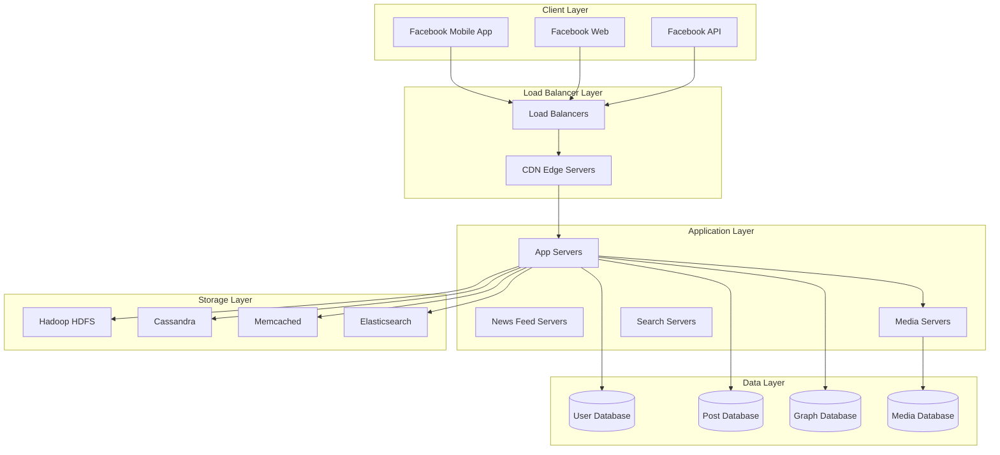

---
# Auto-generated front matter
Title: Facebook Technical Architecture
LastUpdated: 2025-11-06T20:45:57.730691
Tags: []
Status: draft
---

# Facebook Technical Architecture - Complete Case Study

## 🎯 Overview

Facebook is the world's largest social networking platform, handling over 2.9 billion monthly active users and processing massive amounts of data daily. This case study covers the complete technical architecture, data processing, and social graph systems.

## 📊 Scale & Statistics

- **Users**: 2.9+ billion monthly active users
- **Daily Active Users**: 1.9+ billion
- **Posts**: 500+ million posts daily
- **Photos**: 300+ million photos uploaded daily
- **Videos**: 8+ billion video views daily
- **Data**: 500+ terabytes processed daily
- **Servers**: 200+ data centers worldwide

## 🏗️ High-Level Architecture



## 🔧 Core Backend Components

### 1. Social Graph System

#### Graph Database Implementation
```go
type SocialGraph struct {
    neo4jClient Neo4jClient
    cache       RedisClient
    db          Database
}

func (sg *SocialGraph) AddFriend(userID1, userID2 string) error {
    // Create friendship relationship
    query := `
        MATCH (u1:User {id: $userID1})
        MATCH (u2:User {id: $userID2})
        CREATE (u1)-[:FRIENDS_WITH]->(u2)
        CREATE (u2)-[:FRIENDS_WITH]->(u1)
    `
    
    _, err := sg.neo4jClient.Exec(query, map[string]interface{}{
        "userID1": userID1,
        "userID2": userID2,
    })
    
    if err != nil {
        return err
    }
    
    // Update cache
    sg.cache.Del(fmt.Sprintf("friends:%s", userID1))
    sg.cache.Del(fmt.Sprintf("friends:%s", userID2))
    
    return nil
}

func (sg *SocialGraph) GetFriends(userID string, limit int) ([]User, error) {
    // Check cache first
    if cached, err := sg.cache.Get(fmt.Sprintf("friends:%s", userID)); err == nil {
        var friends []User
        json.Unmarshal([]byte(cached), &friends)
        return friends, nil
    }
    
    // Query graph database
    query := `
        MATCH (u:User {id: $userID})-[:FRIENDS_WITH]->(friend:User)
        RETURN friend
        LIMIT $limit
    `
    
    result, err := sg.neo4jClient.Query(query, map[string]interface{}{
        "userID": userID,
        "limit":  limit,
    })
    
    if err != nil {
        return nil, err
    }
    
    var friends []User
    for _, record := range result.Records {
        friend := record.GetByIndex(0).(neo4j.Node)
        friends = append(friends, User{
            ID:       friend.Props["id"].(string),
            Name:     friend.Props["name"].(string),
            Username: friend.Props["username"].(string),
        })
    }
    
    // Cache result
    friendsJSON, _ := json.Marshal(friends)
    sg.cache.Set(fmt.Sprintf("friends:%s", userID), friendsJSON, time.Hour)
    
    return friends, nil
}
```

#### News Feed Algorithm
```go
type NewsFeedGenerator struct {
    socialGraph    SocialGraph
    postService    PostService
    engagementService EngagementService
    cache         RedisClient
}

func (nfg *NewsFeedGenerator) GenerateFeed(userID string, limit int) ([]Post, error) {
    // Check cache first
    cacheKey := fmt.Sprintf("feed:%s", userID)
    if cached, err := nfg.cache.Get(cacheKey); err == nil {
        var posts []Post
        json.Unmarshal([]byte(cached), &posts)
        return posts, nil
    }
    
    // Get user's friends
    friends, err := nfg.socialGraph.GetFriends(userID, 1000)
    if err != nil {
        return nil, err
    }
    
    friendIDs := make([]string, len(friends))
    for i, friend := range friends {
        friendIDs[i] = friend.ID
    }
    
    // Get recent posts from friends
    posts, err := nfg.postService.GetRecentPosts(friendIDs, limit*2)
    if err != nil {
        return nil, err
    }
    
    // Apply ranking algorithm
    rankedPosts, err := nfg.rankPosts(userID, posts)
    if err != nil {
        return nil, err
    }
    
    // Take top posts
    topPosts := rankedPosts[:min(limit, len(rankedPosts))]
    
    // Cache result
    postsJSON, _ := json.Marshal(topPosts)
    nfg.cache.Set(cacheKey, postsJSON, 15*time.Minute)
    
    return topPosts, nil
}

func (nfg *NewsFeedGenerator) rankPosts(userID string, posts []Post) ([]Post, error) {
    for i := range posts {
        score := nfg.calculateScore(userID, &posts[i])
        posts[i].Score = score
    }
    
    // Sort by score
    sort.Slice(posts, func(i, j int) bool {
        return posts[i].Score > posts[j].Score
    })
    
    return posts, nil
}

func (nfg *NewsFeedGenerator) calculateScore(userID string, post *Post) float64 {
    baseScore := 0.0
    
    // Engagement score
    engagementScore := nfg.engagementService.GetEngagementScore(post.ID)
    baseScore += engagementScore * 0.4
    
    // Recency score
    recencyScore := nfg.calculateRecencyScore(post.CreatedAt)
    baseScore += recencyScore * 0.3
    
    // User relationship score
    relationshipScore := nfg.calculateRelationshipScore(userID, post.UserID)
    baseScore += relationshipScore * 0.2
    
    // Content type score
    contentTypeScore := nfg.calculateContentTypeScore(post.Type)
    baseScore += contentTypeScore * 0.1
    
    return baseScore
}
```

### 2. Data Processing Pipeline

#### Real-time Data Processing
```go
type DataProcessor struct {
    kafkaConsumer KafkaConsumer
    sparkStreaming SparkStreaming
    hdfsClient   HDFSClient
    elasticsearch ElasticsearchClient
}

func (dp *DataProcessor) ProcessUserActivity() error {
    // Consume from Kafka
    messages, err := dp.kafkaConsumer.Consume("user_activity")
    if err != nil {
        return err
    }
    
    for message := range messages {
        var activity UserActivity
        if err := json.Unmarshal(message.Value, &activity); err != nil {
            continue
        }
        
        // Process activity
        if err := dp.processActivity(activity); err != nil {
            log.Printf("Error processing activity: %v", err)
        }
    }
    
    return nil
}

func (dp *DataProcessor) processActivity(activity UserActivity) error {
    // Store in HDFS for batch processing
    if err := dp.hdfsClient.Store(activity); err != nil {
        return err
    }
    
    // Index in Elasticsearch for real-time queries
    if err := dp.elasticsearch.Index("user_activity", activity); err != nil {
        return err
    }
    
    // Update real-time counters
    if err := dp.updateCounters(activity); err != nil {
        return err
    }
    
    return nil
}
```

#### Batch Processing with Hadoop
```go
type BatchProcessor struct {
    hadoopClient HadoopClient
    sparkClient  SparkClient
}

func (bp *BatchProcessor) ProcessDailyData() error {
    // Run daily analytics job
    job := &HadoopJob{
        Name: "daily_analytics",
        InputPath: "/data/daily/",
        OutputPath: "/analytics/daily/",
        Mapper: "DailyAnalyticsMapper",
        Reducer: "DailyAnalyticsReducer",
    }
    
    if err := bp.hadoopClient.SubmitJob(job); err != nil {
        return err
    }
    
    // Wait for completion
    if err := bp.hadoopClient.WaitForCompletion(job.ID); err != nil {
        return err
    }
    
    // Process results with Spark
    if err := bp.sparkClient.ProcessResults(job.OutputPath); err != nil {
        return err
    }
    
    return nil
}
```

### 3. Media Processing System

#### Photo Processing Pipeline
```go
type PhotoProcessor struct {
    imageProcessor ImageProcessor
    cdnUploader   CDNUploader
    db           Database
    cache        RedisClient
}

func (pp *PhotoProcessor) ProcessPhoto(photoData []byte, userID string) (*PhotoResult, error) {
    // Validate photo
    if err := pp.validatePhoto(photoData); err != nil {
        return nil, err
    }
    
    // Generate multiple sizes
    sizes := []PhotoSize{
        {Width: 100, Height: 100, Quality: 80},   // Thumbnail
        {Width: 200, Height: 200, Quality: 85},   // Small
        {Width: 400, Height: 400, Quality: 90},   // Medium
        {Width: 800, Height: 800, Quality: 95},   // Large
        {Width: 1200, Height: 1200, Quality: 98}, // XLarge
    }
    
    var processedPhotos []ProcessedPhoto
    for _, size := range sizes {
        processed, err := pp.imageProcessor.Resize(photoData, size)
        if err != nil {
            return nil, err
        }
        
        // Upload to CDN
        cdnURL, err := pp.cdnUploader.Upload(processed.Data)
        if err != nil {
            return nil, err
        }
        
        processedPhotos = append(processedPhotos, ProcessedPhoto{
            Size:   size,
            CDNURL: cdnURL,
            Size:   len(processed.Data),
        })
    }
    
    // Store metadata
    photoID := generatePhotoID()
    err := pp.db.StorePhoto(photoID, userID, processedPhotos)
    if err != nil {
        return nil, err
    }
    
    // Cache for quick access
    pp.cache.Set(fmt.Sprintf("photo:%s", photoID), processedPhotos, time.Hour)
    
    return &PhotoResult{
        PhotoID: photoID,
        Photos:  processedPhotos,
    }, nil
}
```

#### Video Processing Pipeline
```go
type VideoProcessor struct {
    ffmpegClient FFmpegClient
    cdnUploader  CDNUploader
    db          Database
    cache       RedisClient
}

func (vp *VideoProcessor) ProcessVideo(videoData []byte, userID string) (*VideoResult, error) {
    // Validate video
    if err := vp.validateVideo(videoData); err != nil {
        return nil, err
    }
    
    // Generate multiple qualities
    qualities := []VideoQuality{
        {Resolution: "240p", Bitrate: "500k"},
        {Resolution: "360p", Bitrate: "1000k"},
        {Resolution: "480p", Bitrate: "2000k"},
        {Resolution: "720p", Bitrate: "4000k"},
        {Resolution: "1080p", Bitrate: "8000k"},
    }
    
    var processedVideos []ProcessedVideo
    for _, quality := range qualities {
        processed, err := vp.ffmpegClient.Transcode(videoData, quality)
        if err != nil {
            return nil, err
        }
        
        // Upload to CDN
        cdnURL, err := vp.cdnUploader.Upload(processed.Data)
        if err != nil {
            return nil, err
        }
        
        processedVideos = append(processedVideos, ProcessedVideo{
            Quality: quality,
            CDNURL:  cdnURL,
            Size:    len(processed.Data),
        })
    }
    
    // Generate thumbnail
    thumbnail, err := vp.ffmpegClient.GenerateThumbnail(videoData, 5) // 5 seconds
    if err != nil {
        return nil, err
    }
    
    thumbnailURL, err := vp.cdnUploader.Upload(thumbnail)
    if err != nil {
        return nil, err
    }
    
    // Store metadata
    videoID := generateVideoID()
    err = vp.db.StoreVideo(videoID, userID, processedVideos, thumbnailURL)
    if err != nil {
        return nil, err
    }
    
    return &VideoResult{
        VideoID:   videoID,
        Videos:    processedVideos,
        Thumbnail: thumbnailURL,
    }, nil
}
```

### 4. Search System

#### Search Implementation
```go
type SearchService struct {
    elasticsearch ElasticsearchClient
    cache        RedisClient
    db          Database
}

func (ss *SearchService) SearchUsers(query string, limit int) ([]User, error) {
    // Check cache first
    cacheKey := fmt.Sprintf("search:users:%s:%d", query, limit)
    if cached, err := ss.cache.Get(cacheKey); err == nil {
        var users []User
        json.Unmarshal([]byte(cached), &users)
        return users, nil
    }
    
    // Search in Elasticsearch
    searchQuery := map[string]interface{}{
        "query": map[string]interface{}{
            "multi_match": map[string]interface{}{
                "query":  query,
                "fields": []string{"name", "username", "bio"},
                "type":   "best_fields",
            },
        },
        "size": limit,
    }
    
    result, err := ss.elasticsearch.Search("users", searchQuery)
    if err != nil {
        return nil, err
    }
    
    var users []User
    for _, hit := range result.Hits.Hits {
        var user User
        json.Unmarshal(hit.Source, &user)
        users = append(users, user)
    }
    
    // Cache result
    usersJSON, _ := json.Marshal(users)
    ss.cache.Set(cacheKey, usersJSON, 15*time.Minute)
    
    return users, nil
}

func (ss *SearchService) SearchPosts(query string, limit int) ([]Post, error) {
    // Check cache first
    cacheKey := fmt.Sprintf("search:posts:%s:%d", query, limit)
    if cached, err := ss.cache.Get(cacheKey); err == nil {
        var posts []Post
        json.Unmarshal([]byte(cached), &posts)
        return posts, nil
    }
    
    // Search in Elasticsearch
    searchQuery := map[string]interface{}{
        "query": map[string]interface{}{
            "multi_match": map[string]interface{}{
                "query":  query,
                "fields": []string{"content", "hashtags"},
                "type":   "best_fields",
            },
        },
        "size": limit,
    }
    
    result, err := ss.elasticsearch.Search("posts", searchQuery)
    if err != nil {
        return nil, err
    }
    
    var posts []Post
    for _, hit := range result.Hits.Hits {
        var post Post
        json.Unmarshal(hit.Source, &post)
        posts = append(posts, post)
    }
    
    // Cache result
    postsJSON, _ := json.Marshal(posts)
    ss.cache.Set(cacheKey, postsJSON, 15*time.Minute)
    
    return posts, nil
}
```

### 5. Real-time Features

#### Live Streaming
```go
type LiveStreamManager struct {
    rtmpServer    RTMPServer
    hlsServer     HLSServer
    websocketManager WebSocketManager
    db           Database
}

func (lsm *LiveStreamManager) StartLiveStream(userID string) (*LiveStream, error) {
    streamID := generateStreamID()
    
    // Create stream record
    stream := &LiveStream{
        ID:        streamID,
        UserID:    userID,
        Status:    "starting",
        StartTime: time.Now(),
        Viewers:   0,
    }
    
    err := lsm.db.CreateLiveStream(stream)
    if err != nil {
        return nil, err
    }
    
    // Start RTMP server
    rtmpURL := fmt.Sprintf("rtmp://live.facebook.com/live/%s", streamID)
    err = lsm.rtmpServer.StartStream(streamID, rtmpURL)
    if err != nil {
        return nil, err
    }
    
    // Start HLS conversion
    hlsURL := fmt.Sprintf("https://live.facebook.com/hls/%s.m3u8", streamID)
    err = lsm.hlsServer.StartConversion(streamID, rtmpURL, hlsURL)
    if err != nil {
        return nil, err
    }
    
    stream.Status = "live"
    stream.RTMPURL = rtmpURL
    stream.HLSUrl = hlsURL
    
    return stream, nil
}
```

#### Real-time Comments
```go
type CommentManager struct {
    websocketManager WebSocketManager
    commentService   CommentService
    cache           RedisClient
}

func (cm *CommentManager) AddComment(postID string, userID string, text string) (*Comment, error) {
    comment := &Comment{
        ID:        generateCommentID(),
        PostID:    postID,
        UserID:    userID,
        Text:      text,
        CreatedAt: time.Now(),
    }
    
    // Store comment
    err := cm.commentService.CreateComment(comment)
    if err != nil {
        return nil, err
    }
    
    // Broadcast to viewers
    cm.websocketManager.BroadcastToPost(postID, "new_comment", comment)
    
    // Update comment count
    cm.cache.Incr(fmt.Sprintf("post:%s:comments", postID))
    
    return comment, nil
}
```

## 🔐 Security & Privacy

### Content Moderation
```go
type ContentModerator struct {
    mlService      MLService
    humanModerators HumanModeratorService
    cache         RedisClient
}

func (cm *ContentModerator) ModerateContent(content []byte, contentType string) (*ModerationResult, error) {
    // Check cache first
    contentHash := hashContent(content)
    if cached, err := cm.cache.Get(fmt.Sprintf("moderation:%s", contentHash)); err == nil {
        var result ModerationResult
        json.Unmarshal([]byte(cached), &result)
        return &result, nil
    }
    
    // ML-based moderation
    mlResult, err := cm.mlService.ModerateContent(content, contentType)
    if err != nil {
        return nil, err
    }
    
    result := &ModerationResult{
        IsApproved: mlResult.Confidence > 0.8,
        Confidence: mlResult.Confidence,
        Flags:      mlResult.Flags,
        Reason:     mlResult.Reason,
    }
    
    // If confidence is low, send to human moderators
    if mlResult.Confidence < 0.8 {
        go cm.humanModerators.QueueForReview(content, contentType, mlResult)
    }
    
    // Cache result
    resultJSON, _ := json.Marshal(result)
    cm.cache.Set(fmt.Sprintf("moderation:%s", contentHash), resultJSON, 24*time.Hour)
    
    return result, nil
}
```

### Privacy Controls
```go
type PrivacyManager struct {
    userService UserService
    postService PostService
    cache      RedisClient
}

func (pm *PrivacyManager) UpdatePrivacySettings(userID string, settings *PrivacySettings) error {
    // Update user's privacy settings
    err := pm.userService.UpdatePrivacySettings(userID, settings)
    if err != nil {
        return err
    }
    
    // Update existing posts if needed
    if settings.PostsVisibility != "" {
        err = pm.postService.UpdatePostsVisibility(userID, settings.PostsVisibility)
        if err != nil {
            return err
        }
    }
    
    // Clear relevant caches
    pm.cache.Del(fmt.Sprintf("user:%s:privacy", userID))
    pm.cache.Del(fmt.Sprintf("user:%s:posts", userID))
    
    return nil
}
```

## 📊 Analytics & Insights

### User Analytics
```go
type AnalyticsService struct {
    eventStore   EventStore
    aggregator   DataAggregator
    cache       RedisClient
}

func (as *AnalyticsService) TrackEvent(userID string, eventType string, data map[string]interface{}) error {
    event := &Event{
        ID:        generateEventID(),
        UserID:    userID,
        Type:      eventType,
        Data:      data,
        Timestamp: time.Now(),
    }
    
    // Store event
    err := as.eventStore.StoreEvent(event)
    if err != nil {
        return err
    }
    
    // Update real-time counters
    as.cache.Incr(fmt.Sprintf("events:%s:%s", userID, eventType))
    as.cache.Incr(fmt.Sprintf("events:global:%s", eventType))
    
    return nil
}
```

## 🚀 Performance Optimization

### Caching Strategy
```go
type CacheManager struct {
    l1Cache *sync.Map // In-memory cache
    l2Cache RedisClient // Redis cache
    l3Cache Database // Database
}

func (cm *CacheManager) GetUser(userID string) (*User, error) {
    // L1 Cache
    if value, ok := cm.l1Cache.Load(userID); ok {
        return value.(*User), nil
    }
    
    // L2 Cache
    if cached, err := cm.l2Cache.Get(fmt.Sprintf("user:%s", userID)); err == nil {
        var user User
        json.Unmarshal([]byte(cached), &user)
        cm.l1Cache.Store(userID, &user)
        return &user, nil
    }
    
    // L3 Cache (Database)
    user, err := cm.l3Cache.GetUser(userID)
    if err != nil {
        return nil, err
    }
    
    // Store in caches
    cm.l1Cache.Store(userID, user)
    userJSON, _ := json.Marshal(user)
    cm.l2Cache.Set(fmt.Sprintf("user:%s", userID), userJSON, time.Hour)
    
    return user, nil
}
```

## 🔍 Key Technical Challenges

### 1. Social Graph at Scale
- **Problem**: Managing billions of relationships
- **Solution**: Graph database with sharding
- **Implementation**: Neo4j with custom partitioning

### 2. News Feed Generation
- **Problem**: Generating personalized feeds for 2B+ users
- **Solution**: Pre-computed feeds with real-time updates
- **Implementation**: Redis + background workers

### 3. Data Processing
- **Problem**: Processing 500TB+ of data daily
- **Solution**: Hadoop + Spark for batch processing
- **Implementation**: Distributed processing with queues

### 4. Real-time Features
- **Problem**: Real-time updates for 2B+ users
- **Solution**: WebSockets with message queues
- **Implementation**: Socket.io + Redis pub/sub

## 📚 Interview Questions

### System Design Questions
1. How would you design Facebook's news feed system?
2. How does Facebook handle social graph queries at scale?
3. How would you implement Facebook's search functionality?
4. How does Facebook process massive amounts of data?
5. How would you design Facebook's real-time features?

### Technical Deep Dive
1. Explain Facebook's data processing pipeline
2. How does Facebook optimize for mobile performance?
3. Describe Facebook's caching strategy
4. How does Facebook handle content moderation?
5. Explain Facebook's recommendation system

## 🎯 Key Takeaways

1. **Social Graph**: Graph database for relationship management
2. **News Feed**: Personalized content ranking system
3. **Data Processing**: Hadoop + Spark for big data
4. **Real-time Features**: WebSocket-based live updates
5. **Search**: Elasticsearch-powered search
6. **Content Moderation**: ML + human moderation
7. **Performance**: Multi-level caching and CDN optimization

## 🔗 Additional Resources

- [Facebook Engineering Blog](https://engineering.fb.com/)
- [Big Data Processing](https://hadoop.apache.org/)
- [Graph Databases](https://neo4j.com/)
- [Real-time Web Applications](https://developer.mozilla.org/en-US/docs/Web/API/WebSockets_API)
- [Content Moderation Guidelines](https://transparency.fb.com/policies/community-standards/)
