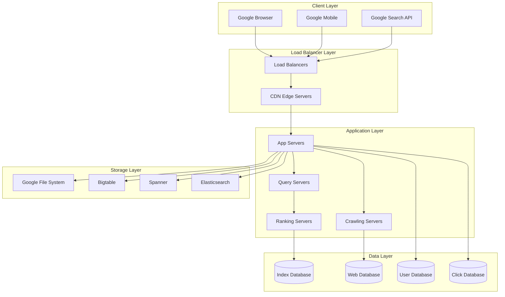

# Google Search Technical Architecture - Complete Case Study

## 🎯 Overview

Google Search is the world's most popular search engine, processing over 8.5 billion searches daily and indexing trillions of web pages. This case study covers the complete technical architecture, crawling, indexing, and ranking systems.

## 📊 Scale & Statistics

- **Daily Searches**: 8.5+ billion searches
- **Indexed Pages**: 100+ trillion web pages
- **Languages**: 100+ languages supported
- **Countries**: 190+ countries served
- **Data Centers**: 20+ regions worldwide
- **Response Time**: <200ms average
- **Uptime**: 99.9% availability

## 🏗️ High-Level Architecture



## 🔧 Core Backend Components

### 1. Web Crawling System

#### Distributed Crawler Architecture
```go
type WebCrawler struct {
    urlQueue      URLQueue
    crawlerWorkers []CrawlerWorker
    contentStore  ContentStore
    urlStore      URLStore
    rateLimiter   RateLimiter
}

func (wc *WebCrawler) StartCrawling() error {
    // Start crawler workers
    for i := 0; i < wc.numWorkers; i++ {
        go wc.crawlerWorker(i)
    }
    
    // Start URL discovery
    go wc.urlDiscoveryWorker()
    
    return nil
}

func (wc *WebCrawler) crawlerWorker(workerID int) {
    for {
        // Get URL from queue
        url, err := wc.urlQueue.Dequeue()
        if err != nil {
            time.Sleep(1 * time.Second)
            continue
        }
        
        // Check rate limit
        if !wc.rateLimiter.Allow(url.Domain) {
            wc.urlQueue.Enqueue(url, 5*time.Minute) // Retry later
            continue
        }
        
        // Crawl URL
        content, err := wc.crawlURL(url)
        if err != nil {
            log.Printf("Error crawling %s: %v", url.URL, err)
            continue
        }
        
        // Store content
        if err := wc.contentStore.Store(content); err != nil {
            log.Printf("Error storing content: %v", err)
            continue
        }
        
        // Extract new URLs
        newURLs := wc.extractURLs(content)
        for _, newURL := range newURLs {
            wc.urlQueue.Enqueue(newURL, 0)
        }
        
        // Update URL status
        wc.urlStore.MarkAsCrawled(url.URL)
    }
}

func (wc *WebCrawler) crawlURL(url *URL) (*Content, error) {
    // Create HTTP client
    client := &http.Client{
        Timeout: 30 * time.Second,
    }
    
    // Make request
    resp, err := client.Get(url.URL)
    if err != nil {
        return nil, err
    }
    defer resp.Body.Close()
    
    // Read content
    body, err := ioutil.ReadAll(resp.Body)
    if err != nil {
        return nil, err
    }
    
    // Parse HTML
    doc, err := goquery.NewDocumentFromReader(strings.NewReader(string(body)))
    if err != nil {
        return nil, err
    }
    
    // Extract content
    content := &Content{
        URL:         url.URL,
        Title:       doc.Find("title").Text(),
        Description: doc.Find("meta[name=description]").AttrOr("content", ""),
        Body:        doc.Find("body").Text(),
        Links:       wc.extractLinks(doc),
        Images:      wc.extractImages(doc),
        CrawledAt:   time.Now(),
    }
    
    return content, nil
}
```

#### URL Discovery and Prioritization
```go
type URLManager struct {
    urlQueue    URLQueue
    urlStore    URLStore
    priorityQueue PriorityQueue
    scheduler   Scheduler
}

func (um *URLManager) AddURL(url *URL) error {
    // Check if URL already exists
    exists, err := um.urlStore.Exists(url.URL)
    if err != nil {
        return err
    }
    
    if exists {
        return nil // Already exists
    }
    
    // Calculate priority
    priority := um.calculatePriority(url)
    url.Priority = priority
    
    // Add to priority queue
    um.priorityQueue.Push(url, priority)
    
    // Schedule crawling
    um.scheduler.Schedule(url, priority)
    
    return nil
}

func (um *URLManager) calculatePriority(url *URL) float64 {
    priority := 0.0
    
    // Domain authority
    priority += um.getDomainAuthority(url.Domain) * 0.3
    
    // URL structure
    priority += um.getURLStructureScore(url.URL) * 0.2
    
    // Content freshness
    priority += um.getContentFreshnessScore(url) * 0.2
    
    // User engagement
    priority += um.getUserEngagementScore(url) * 0.3
    
    return priority
}
```

### 2. Indexing System

#### Inverted Index Construction
```go
type IndexBuilder struct {
    contentStore ContentStore
    indexStore   IndexStore
    tokenizer    Tokenizer
    analyzer     Analyzer
}

func (ib *IndexBuilder) BuildIndex() error {
    // Get all content
    contents, err := ib.contentStore.GetAll()
    if err != nil {
        return err
    }
    
    // Build inverted index
    invertedIndex := make(map[string][]Posting)
    
    for _, content := range contents {
        // Tokenize content
        tokens := ib.tokenizer.Tokenize(content.Body)
        
        // Analyze tokens
        analyzedTokens := ib.analyzer.Analyze(tokens)
        
        // Add to inverted index
        for position, token := range analyzedTokens {
            posting := Posting{
                DocumentID: content.ID,
                Position:   position,
                Frequency:  1,
            }
            
            invertedIndex[token] = append(invertedIndex[token], posting)
        }
    }
    
    // Store index
    return ib.indexStore.Store(invertedIndex)
}

func (ib *IndexBuilder) Tokenize(text string) []string {
    // Convert to lowercase
    text = strings.ToLower(text)
    
    // Remove punctuation
    text = regexp.MustCompile(`[^\w\s]`).ReplaceAllString(text, " ")
    
    // Split by whitespace
    tokens := strings.Fields(text)
    
    // Remove stop words
    tokens = ib.removeStopWords(tokens)
    
    // Stem tokens
    tokens = ib.stemTokens(tokens)
    
    return tokens
}
```

#### Distributed Index Storage
```go
type DistributedIndex struct {
    shards       []IndexShard
    shardManager ShardManager
    replicas     []IndexReplica
}

func (di *DistributedIndex) Search(query string) ([]SearchResult, error) {
    // Parse query
    parsedQuery, err := di.parseQuery(query)
    if err != nil {
        return nil, err
    }
    
    // Determine relevant shards
    relevantShards := di.shardManager.GetRelevantShards(parsedQuery)
    
    // Search each shard
    var allResults []SearchResult
    for _, shard := range relevantShards {
        results, err := shard.Search(parsedQuery)
        if err != nil {
            continue
        }
        allResults = append(allResults, results...)
    }
    
    // Merge and rank results
    mergedResults := di.mergeResults(allResults)
    rankedResults := di.rankResults(mergedResults, parsedQuery)
    
    return rankedResults, nil
}

func (di *DistributedIndex) parseQuery(query string) (*ParsedQuery, error) {
    // Tokenize query
    tokens := di.tokenizeQuery(query)
    
    // Extract operators
    operators := di.extractOperators(tokens)
    
    // Extract phrases
    phrases := di.extractPhrases(tokens)
    
    // Extract filters
    filters := di.extractFilters(tokens)
    
    return &ParsedQuery{
        Tokens:    tokens,
        Operators: operators,
        Phrases:   phrases,
        Filters:   filters,
    }, nil
}
```

### 3. Ranking Algorithm

#### PageRank Implementation
```go
type PageRankCalculator struct {
    graph        LinkGraph
    dampingFactor float64
    maxIterations int
    tolerance    float64
}

func (prc *PageRankCalculator) CalculatePageRank() (map[string]float64, error) {
    // Initialize PageRank values
    pageRank := make(map[string]float64)
    for node := range prc.graph.Nodes {
        pageRank[node] = 1.0
    }
    
    // Iterate until convergence
    for iteration := 0; iteration < prc.maxIterations; iteration++ {
        newPageRank := make(map[string]float64)
        
        for node := range prc.graph.Nodes {
            newPageRank[node] = (1.0 - prc.dampingFactor)
            
            // Sum contributions from incoming links
            for _, incomingNode := range prc.graph.GetIncomingLinks(node) {
                outgoingCount := len(prc.graph.GetOutgoingLinks(incomingNode))
                if outgoingCount > 0 {
                    newPageRank[node] += prc.dampingFactor * pageRank[incomingNode] / float64(outgoingCount)
                }
            }
        }
        
        // Check convergence
        if prc.isConverged(pageRank, newPageRank) {
            break
        }
        
        pageRank = newPageRank
    }
    
    return pageRank, nil
}

func (prc *PageRankCalculator) isConverged(old, new map[string]float64) bool {
    maxDiff := 0.0
    for node := range old {
        diff := math.Abs(old[node] - new[node])
        if diff > maxDiff {
            maxDiff = diff
        }
    }
    return maxDiff < prc.tolerance
}
```

#### Ranking Factors
```go
type RankingEngine struct {
    pageRankCalculator PageRankCalculator
    contentAnalyzer    ContentAnalyzer
    userBehaviorAnalyzer UserBehaviorAnalyzer
    freshnessAnalyzer  FreshnessAnalyzer
}

func (re *RankingEngine) RankResults(query string, documents []Document) ([]RankedDocument, error) {
    var rankedDocs []RankedDocument
    
    for _, doc := range documents {
        score := re.calculateScore(query, doc)
        rankedDocs = append(rankedDocs, RankedDocument{
            Document: doc,
            Score:    score,
        })
    }
    
    // Sort by score
    sort.Slice(rankedDocs, func(i, j int) bool {
        return rankedDocs[i].Score > rankedDocs[j].Score
    })
    
    return rankedDocs, nil
}

func (re *RankingEngine) calculateScore(query string, doc Document) float64 {
    score := 0.0
    
    // PageRank score
    pageRankScore := re.pageRankCalculator.GetPageRank(doc.URL)
    score += pageRankScore * 0.3
    
    // Content relevance score
    contentScore := re.contentAnalyzer.CalculateRelevance(query, doc.Content)
    score += contentScore * 0.4
    
    // User behavior score
    behaviorScore := re.userBehaviorAnalyzer.GetBehaviorScore(doc.URL)
    score += behaviorScore * 0.2
    
    // Freshness score
    freshnessScore := re.freshnessAnalyzer.GetFreshnessScore(doc.CrawledAt)
    score += freshnessScore * 0.1
    
    return score
}
```

### 4. Query Processing

#### Query Parser
```go
type QueryParser struct {
    tokenizer    Tokenizer
    analyzer     Analyzer
    spellChecker SpellChecker
    synonymFinder SynonymFinder
}

func (qp *QueryParser) ParseQuery(query string) (*ParsedQuery, error) {
    // Clean query
    cleanedQuery := qp.cleanQuery(query)
    
    // Check spelling
    correctedQuery := qp.spellChecker.Correct(cleanedQuery)
    
    // Tokenize
    tokens := qp.tokenizer.Tokenize(correctedQuery)
    
    // Analyze tokens
    analyzedTokens := qp.analyzer.Analyze(tokens)
    
    // Find synonyms
    synonyms := qp.synonymFinder.FindSynonyms(analyzedTokens)
    
    // Extract entities
    entities := qp.extractEntities(analyzedTokens)
    
    // Extract intents
    intents := qp.extractIntents(analyzedTokens)
    
    return &ParsedQuery{
        Original:    query,
        Corrected:   correctedQuery,
        Tokens:      analyzedTokens,
        Synonyms:    synonyms,
        Entities:    entities,
        Intents:     intents,
    }, nil
}

func (qp *QueryParser) cleanQuery(query string) string {
    // Remove extra whitespace
    query = strings.TrimSpace(query)
    
    // Remove special characters
    query = regexp.MustCompile(`[^\w\s]`).ReplaceAllString(query, " ")
    
    // Convert to lowercase
    query = strings.ToLower(query)
    
    return query
}
```

#### Query Expansion
```go
type QueryExpander struct {
    synonymFinder SynonymFinder
    relatedTermFinder RelatedTermFinder
    entityExtractor EntityExtractor
}

func (qe *QueryExpander) ExpandQuery(query *ParsedQuery) (*ExpandedQuery, error) {
    var expandedTerms []string
    
    // Add original terms
    expandedTerms = append(expandedTerms, query.Tokens...)
    
    // Add synonyms
    for _, token := range query.Tokens {
        synonyms := qe.synonymFinder.FindSynonyms(token)
        expandedTerms = append(expandedTerms, synonyms...)
    }
    
    // Add related terms
    relatedTerms := qe.relatedTermFinder.FindRelatedTerms(query.Tokens)
    expandedTerms = append(expandedTerms, relatedTerms...)
    
    // Add entities
    entities := qe.entityExtractor.ExtractEntities(query.Tokens)
    expandedTerms = append(expandedTerms, entities...)
    
    // Remove duplicates
    expandedTerms = qe.removeDuplicates(expandedTerms)
    
    return &ExpandedQuery{
        Original: query,
        Expanded: expandedTerms,
    }, nil
}
```

### 5. Search Results

#### Result Aggregator
```go
type ResultAggregator struct {
    indexSearcher IndexSearcher
    imageSearcher ImageSearcher
    videoSearcher VideoSearcher
    newsSearcher  NewsSearcher
    mapSearcher   MapSearcher
}

func (ra *ResultAggregator) Search(query *ParsedQuery) (*SearchResults, error) {
    var results SearchResults
    
    // Web results
    webResults, err := ra.indexSearcher.Search(query)
    if err != nil {
        return nil, err
    }
    results.Web = webResults
    
    // Image results
    imageResults, err := ra.imageSearcher.Search(query)
    if err != nil {
        return nil, err
    }
    results.Images = imageResults
    
    // Video results
    videoResults, err := ra.videoSearcher.Search(query)
    if err != nil {
        return nil, err
    }
    results.Videos = videoResults
    
    // News results
    newsResults, err := ra.newsSearcher.Search(query)
    if err != nil {
        return nil, err
    }
    results.News = newsResults
    
    // Map results
    mapResults, err := ra.mapSearcher.Search(query)
    if err != nil {
        return nil, err
    }
    results.Maps = mapResults
    
    return &results, nil
}
```

#### Result Ranking
```go
type ResultRanker struct {
    rankingEngine RankingEngine
    personalizer  Personalizer
    freshnessRanker FreshnessRanker
}

func (rr *ResultRanker) RankResults(query *ParsedQuery, results *SearchResults, userID string) (*RankedResults, error) {
    var rankedResults RankedResults
    
    // Rank web results
    rankedWeb, err := rr.rankingEngine.RankResults(query.Original, results.Web)
    if err != nil {
        return nil, err
    }
    rankedResults.Web = rankedWeb
    
    // Personalize results
    if userID != "" {
        personalizedResults, err := rr.personalizer.Personalize(rankedWeb, userID)
        if err != nil {
            return nil, err
        }
        rankedResults.Web = personalizedResults
    }
    
    // Apply freshness ranking
    freshResults, err := rr.freshnessRanker.RankByFreshness(rankedResults.Web)
    if err != nil {
        return nil, err
    }
    rankedResults.Web = freshResults
    
    return &rankedResults, nil
}
```

## 🔍 Advanced Features

### 1. Machine Learning Integration

#### Neural Ranking
```go
type NeuralRanker struct {
    model        MLModel
    featureExtractor FeatureExtractor
    tokenizer    Tokenizer
}

func (nr *NeuralRanker) RankResults(query string, documents []Document) ([]RankedDocument, error) {
    var rankedDocs []RankedDocument
    
    for _, doc := range documents {
        // Extract features
        features := nr.featureExtractor.ExtractFeatures(query, doc)
        
        // Get model prediction
        score, err := nr.model.Predict(features)
        if err != nil {
            continue
        }
        
        rankedDocs = append(rankedDocs, RankedDocument{
            Document: doc,
            Score:    score,
        })
    }
    
    // Sort by score
    sort.Slice(rankedDocs, func(i, j int) bool {
        return rankedDocs[i].Score > rankedDocs[j].Score
    })
    
    return rankedDocs, nil
}
```

### 2. Real-time Search

#### Live Search Updates
```go
type LiveSearchManager struct {
    indexUpdater IndexUpdater
    cacheManager CacheManager
    websocketManager WebSocketManager
}

func (lsm *LiveSearchManager) UpdateIndex(content *Content) error {
    // Update index
    if err := lsm.indexUpdater.Update(content); err != nil {
        return err
    }
    
    // Invalidate cache
    lsm.cacheManager.Invalidate(content.URL)
    
    // Notify live search clients
    lsm.websocketManager.Broadcast("index_updated", content)
    
    return nil
}
```

## 📊 Performance Optimization

### 1. Caching Strategy

#### Multi-level Caching
```go
type CacheManager struct {
    l1Cache *sync.Map // In-memory cache
    l2Cache RedisClient // Redis cache
    l3Cache Database // Database
}

func (cm *CacheManager) GetSearchResults(query string) (*SearchResults, error) {
    // L1 Cache (In-memory)
    if value, ok := cm.l1Cache.Load(query); ok {
        return value.(*SearchResults), nil
    }
    
    // L2 Cache (Redis)
    if cached, err := cm.l2Cache.Get(fmt.Sprintf("search:%s", query)); err == nil {
        var results SearchResults
        json.Unmarshal([]byte(cached), &results)
        cm.l1Cache.Store(query, &results)
        return &results, nil
    }
    
    // L3 Cache (Database)
    results, err := cm.l3Cache.GetSearchResults(query)
    if err != nil {
        return nil, err
    }
    
    // Store in caches
    cm.l1Cache.Store(query, results)
    resultsJSON, _ := json.Marshal(results)
    cm.l2Cache.Set(fmt.Sprintf("search:%s", query), resultsJSON, 15*time.Minute)
    
    return results, nil
}
```

### 2. Database Optimization

#### Sharding Strategy
```go
type ShardManager struct {
    shards []IndexShard
    hashFunc func(string) int
}

func (sm *ShardManager) GetShard(query string) IndexShard {
    shardIndex := sm.hashFunc(query) % len(sm.shards)
    return sm.shards[shardIndex]
}

func (sm *ShardManager) Search(query string) ([]SearchResult, error) {
    shard := sm.GetShard(query)
    return shard.Search(query)
}
```

## 🔍 Key Technical Challenges

### 1. Scale and Performance
- **Problem**: Processing 8.5B+ searches daily
- **Solution**: Distributed architecture with caching
- **Implementation**: Microservices with Redis caching

### 2. Index Size
- **Problem**: Indexing 100+ trillion pages
- **Solution**: Distributed indexing with sharding
- **Implementation**: Bigtable with custom partitioning

### 3. Real-time Updates
- **Problem**: Keeping index up-to-date
- **Solution**: Incremental updates with real-time processing
- **Implementation**: Kafka + Spark Streaming

### 4. Query Understanding
- **Problem**: Understanding user intent
- **Solution**: ML-based query analysis
- **Implementation**: BERT models for query understanding

## 📚 Interview Questions

### System Design Questions
1. How would you design Google's search system?
2. How does Google handle web crawling at scale?
3. How would you implement Google's ranking algorithm?
4. How does Google handle real-time search updates?
5. How would you design Google's index storage system?

### Technical Deep Dive
1. Explain Google's PageRank algorithm
2. How does Google handle query processing?
3. Describe Google's distributed indexing system
4. How does Google optimize for performance?
5. Explain Google's machine learning integration

## 🎯 Key Takeaways

1. **Web Crawling**: Distributed crawler with rate limiting
2. **Indexing**: Inverted index with distributed storage
3. **Ranking**: PageRank + content relevance + user behavior
4. **Query Processing**: Natural language understanding
5. **Performance**: Multi-level caching and optimization
6. **Scalability**: Microservices with auto-scaling
7. **Real-time**: Live updates with streaming processing

## 🔗 Additional Resources

- [Google Research Papers](https://research.google/pubs/)
- [PageRank Algorithm](https://en.wikipedia.org/wiki/PageRank)
- [Inverted Index](https://en.wikipedia.org/wiki/Inverted_index)
- [Web Crawling Best Practices](https://developers.google.com/search/docs/crawling-indexing)
- [Search Engine Optimization](https://developers.google.com/search/docs)
