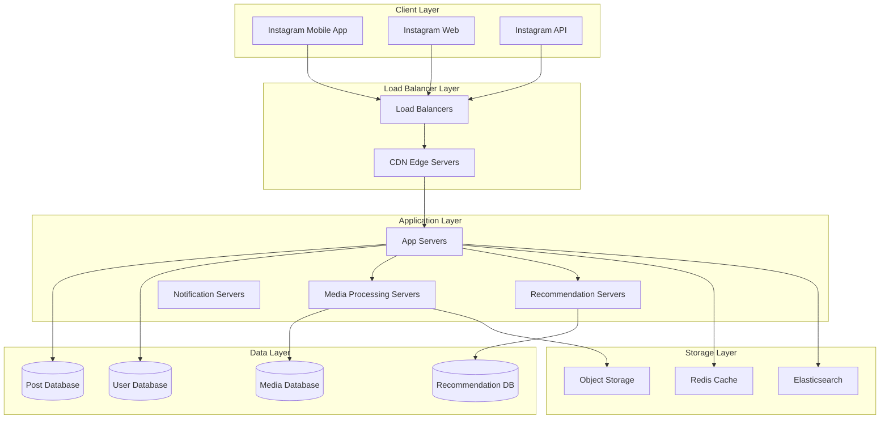

# Instagram Technical Architecture - Complete Case Study

## 🎯 Overview

Instagram is one of the world's largest photo and video sharing platforms, handling over 1 billion users and 500+ million daily active users. This case study covers the complete technical architecture, media processing, and recommendation systems.

## 📊 Scale & Statistics

- **Users**: 1+ billion monthly active users
- **Daily Active Users**: 500+ million
- **Photos**: 100+ million photos uploaded daily
- **Videos**: 1+ billion hours watched daily
- **Stories**: 500+ million stories shared daily
- **Storage**: 100+ petabytes of media
- **CDN**: 15+ edge locations worldwide

## 🏗️ High-Level Architecture



## 🔧 Core Backend Components

### 1. Media Processing Pipeline

#### Photo Processing Flow


#### Video Processing Pipeline


#### Media Processing Implementation
```go
type MediaProcessor struct {
    imageProcessor ImageProcessor
    videoProcessor VideoProcessor
    cdnUploader   CDNUploader
    db           Database
    redis        RedisClient
}

func (mp *MediaProcessor) ProcessPhoto(photoData []byte, userID string) (*PhotoResult, error) {
    // Validate photo
    if err := mp.validatePhoto(photoData); err != nil {
        return nil, err
    }
    
    // Generate multiple resolutions
    resolutions := []Resolution{
        {Width: 150, Height: 150, Quality: 80},  // Thumbnail
        {Width: 320, Height: 320, Quality: 85},  // Small
        {Width: 640, Height: 640, Quality: 90},  // Medium
        {Width: 1080, Height: 1080, Quality: 95}, // Large
    }
    
    var processedPhotos []ProcessedPhoto
    for _, res := range resolutions {
        processed, err := mp.imageProcessor.Resize(photoData, res)
        if err != nil {
            return nil, err
        }
        
        // Upload to CDN
        cdnURL, err := mp.cdnUploader.Upload(processed.Data)
        if err != nil {
            return nil, err
        }
        
        processedPhotos = append(processedPhotos, ProcessedPhoto{
            Resolution: res,
            CDNURL:     cdnURL,
            Size:       len(processed.Data),
        })
    }
    
    // Store metadata
    photoID := generatePhotoID()
    err := mp.db.StorePhoto(photoID, userID, processedPhotos)
    if err != nil {
        return nil, err
    }
    
    // Cache in Redis
    mp.redis.Set(fmt.Sprintf("photo:%s", photoID), processedPhotos, time.Hour)
    
    return &PhotoResult{
        PhotoID: photoID,
        Photos:  processedPhotos,
    }, nil
}
```

### 2. Feed Generation System

#### Feed Algorithm
```go
type FeedGenerator struct {
    userService     UserService
    postService     PostService
    recommendationService RecommendationService
    cache          RedisClient
}

func (fg *FeedGenerator) GenerateFeed(userID string, limit int) ([]Post, error) {
    // Check cache first
    cacheKey := fmt.Sprintf("feed:%s", userID)
    if cached, err := fg.cache.Get(cacheKey); err == nil {
        var posts []Post
        json.Unmarshal([]byte(cached), &posts)
        return posts, nil
    }
    
    // Get user's following list
    following, err := fg.userService.GetFollowing(userID)
    if err != nil {
        return nil, err
    }
    
    // Get recent posts from followed users
    posts, err := fg.postService.GetRecentPosts(following, limit)
    if err != nil {
        return nil, err
    }
    
    // Apply recommendation algorithm
    rankedPosts, err := fg.recommendationService.RankPosts(userID, posts)
    if err != nil {
        return nil, err
    }
    
    // Cache the result
    postsJSON, _ := json.Marshal(rankedPosts)
    fg.cache.Set(cacheKey, postsJSON, time.Hour)
    
    return rankedPosts, nil
}
```

#### Feed Ranking Algorithm
```go
type FeedRanker struct {
    engagementWeights map[string]float64
    timeDecayFactor   float64
}

func (fr *FeedRanker) CalculateScore(post *Post, userID string) float64 {
    baseScore := 0.0
    
    // Engagement score
    engagementScore := fr.calculateEngagementScore(post)
    baseScore += engagementScore * fr.engagementWeights["engagement"]
    
    // Recency score
    recencyScore := fr.calculateRecencyScore(post.CreatedAt)
    baseScore += recencyScore * fr.engagementWeights["recency"]
    
    // User relationship score
    relationshipScore := fr.calculateRelationshipScore(post.UserID, userID)
    baseScore += relationshipScore * fr.engagementWeights["relationship"]
    
    // Content type score
    contentTypeScore := fr.calculateContentTypeScore(post.Type)
    baseScore += contentTypeScore * fr.engagementWeights["content_type"]
    
    return baseScore
}

func (fr *FeedRanker) calculateEngagementScore(post *Post) float64 {
    likes := float64(post.LikesCount)
    comments := float64(post.CommentsCount)
    shares := float64(post.SharesCount)
    
    // Weighted engagement score
    return (likes * 1.0) + (comments * 2.0) + (shares * 3.0)
}

func (fr *FeedRanker) calculateRecencyScore(createdAt time.Time) float64 {
    hoursAgo := time.Since(createdAt).Hours()
    return math.Exp(-fr.timeDecayFactor * hoursAgo)
}
```

### 3. Stories System

#### Stories Architecture
```go
type StoriesManager struct {
    storyService   StoryService
    mediaProcessor MediaProcessor
    notificationService NotificationService
    cache         RedisClient
}

func (sm *StoriesManager) CreateStory(userID string, mediaData []byte, mediaType string) (*Story, error) {
    // Process media
    processedMedia, err := sm.mediaProcessor.ProcessMedia(mediaData, mediaType)
    if err != nil {
        return nil, err
    }
    
    // Create story
    story := &Story{
        ID:        generateStoryID(),
        UserID:    userID,
        MediaURL:  processedMedia.CDNURL,
        Type:      mediaType,
        CreatedAt: time.Now(),
        ExpiresAt: time.Now().Add(24 * time.Hour), // 24-hour expiry
    }
    
    // Store in database
    err = sm.storyService.CreateStory(story)
    if err != nil {
        return nil, err
    }
    
    // Cache for quick access
    sm.cache.Set(fmt.Sprintf("story:%s", story.ID), story, 24*time.Hour)
    
    // Notify followers
    go sm.notifyFollowers(userID, story)
    
    return story, nil
}

func (sm *StoriesManager) GetStories(userID string) ([]Story, error) {
    // Get user's following list
    following, err := sm.storyService.GetFollowing(userID)
    if err != nil {
        return nil, err
    }
    
    // Get active stories from followed users
    stories, err := sm.storyService.GetActiveStories(following)
    if err != nil {
        return nil, err
    }
    
    // Filter out viewed stories
    viewedStories, _ := sm.cache.Get(fmt.Sprintf("viewed_stories:%s", userID))
    var viewed map[string]bool
    json.Unmarshal([]byte(viewedStories), &viewed)
    
    var filteredStories []Story
    for _, story := range stories {
        if !viewed[story.ID] {
            filteredStories = append(filteredStories, story)
        }
    }
    
    return filteredStories, nil
}
```

### 4. Real-time Features

#### Live Streaming
```go
type LiveStreamManager struct {
    rtmpServer    RTMPServer
    hlsServer     HLSServer
    websocketManager WebSocketManager
    db           Database
}

func (lsm *LiveStreamManager) StartLiveStream(userID string) (*LiveStream, error) {
    streamID := generateStreamID()
    
    // Create stream record
    stream := &LiveStream{
        ID:        streamID,
        UserID:    userID,
        Status:    "starting",
        StartTime: time.Now(),
        Viewers:   0,
    }
    
    err := lsm.db.CreateLiveStream(stream)
    if err != nil {
        return nil, err
    }
    
    // Start RTMP server
    rtmpURL := fmt.Sprintf("rtmp://live.instagram.com/live/%s", streamID)
    err = lsm.rtmpServer.StartStream(streamID, rtmpURL)
    if err != nil {
        return nil, err
    }
    
    // Start HLS conversion
    hlsURL := fmt.Sprintf("https://live.instagram.com/hls/%s.m3u8", streamID)
    err = lsm.hlsServer.StartConversion(streamID, rtmpURL, hlsURL)
    if err != nil {
        return nil, err
    }
    
    stream.Status = "live"
    stream.RTMPURL = rtmpURL
    stream.HLSUrl = hlsURL
    
    return stream, nil
}
```

#### Real-time Comments
```go
type CommentManager struct {
    websocketManager WebSocketManager
    commentService   CommentService
    cache           RedisClient
}

func (cm *CommentManager) AddComment(postID string, userID string, text string) (*Comment, error) {
    comment := &Comment{
        ID:        generateCommentID(),
        PostID:    postID,
        UserID:    userID,
        Text:      text,
        CreatedAt: time.Now(),
    }
    
    // Store comment
    err := cm.commentService.CreateComment(comment)
    if err != nil {
        return nil, err
    }
    
    // Broadcast to viewers
    cm.websocketManager.BroadcastToPost(postID, "new_comment", comment)
    
    // Update comment count
    cm.cache.Incr(fmt.Sprintf("post:%s:comments", postID))
    
    return comment, nil
}
```

## 🔍 Search & Discovery

### Search Implementation
```go
type SearchService struct {
    elasticsearch ElasticsearchClient
    userService   UserService
    postService   PostService
}

func (ss *SearchService) SearchUsers(query string, limit int) ([]User, error) {
    searchQuery := map[string]interface{}{
        "query": map[string]interface{}{
            "multi_match": map[string]interface{}{
                "query":  query,
                "fields": []string{"username", "full_name", "bio"},
                "type":   "best_fields",
            },
        },
        "size": limit,
    }
    
    result, err := ss.elasticsearch.Search("users", searchQuery)
    if err != nil {
        return nil, err
    }
    
    var users []User
    for _, hit := range result.Hits.Hits {
        var user User
        json.Unmarshal(hit.Source, &user)
        users = append(users, user)
    }
    
    return users, nil
}

func (ss *SearchService) SearchPosts(query string, limit int) ([]Post, error) {
    searchQuery := map[string]interface{}{
        "query": map[string]interface{}{
            "multi_match": map[string]interface{}{
                "query":  query,
                "fields": []string{"caption", "hashtags"},
                "type":   "best_fields",
            },
        },
        "size": limit,
    }
    
    result, err := ss.elasticsearch.Search("posts", searchQuery)
    if err != nil {
        return nil, err
    }
    
    var posts []Post
    for _, hit := range result.Hits.Hits {
        var post Post
        json.Unmarshal(hit.Source, &post)
        posts = append(posts, post)
    }
    
    return posts, nil
}
```

### Hashtag System
```go
type HashtagManager struct {
    hashtagService HashtagService
    cache         RedisClient
    elasticsearch ElasticsearchClient
}

func (hm *HashtagManager) ProcessHashtags(postID string, caption string) error {
    hashtags := hm.extractHashtags(caption)
    
    for _, hashtag := range hashtags {
        // Update hashtag count
        hm.cache.Incr(fmt.Sprintf("hashtag:%s:count", hashtag))
        
        // Add to post's hashtags
        hm.cache.SAdd(fmt.Sprintf("post:%s:hashtags", postID), hashtag)
        
        // Index in Elasticsearch
        hm.elasticsearch.Index("hashtags", map[string]interface{}{
            "hashtag": hashtag,
            "post_id": postID,
            "created_at": time.Now(),
        })
    }
    
    return nil
}

func (hm *HashtagManager) extractHashtags(text string) []string {
    re := regexp.MustCompile(`#\w+`)
    matches := re.FindAllString(text, -1)
    
    var hashtags []string
    for _, match := range matches {
        hashtags = append(hashtags, strings.TrimPrefix(match, "#"))
    }
    
    return hashtags
}
```

## 🔐 Security & Privacy

### Content Moderation
```go
type ContentModerator struct {
    mlService      MLService
    humanModerators HumanModeratorService
    cache         RedisClient
}

func (cm *ContentModerator) ModerateContent(content []byte, contentType string) (*ModerationResult, error) {
    // Check cache first
    contentHash := hashContent(content)
    if cached, err := cm.cache.Get(fmt.Sprintf("moderation:%s", contentHash)); err == nil {
        var result ModerationResult
        json.Unmarshal([]byte(cached), &result)
        return &result, nil
    }
    
    // ML-based moderation
    mlResult, err := cm.mlService.ModerateContent(content, contentType)
    if err != nil {
        return nil, err
    }
    
    result := &ModerationResult{
        IsApproved: mlResult.Confidence > 0.8,
        Confidence: mlResult.Confidence,
        Flags:      mlResult.Flags,
        Reason:     mlResult.Reason,
    }
    
    // If confidence is low, send to human moderators
    if mlResult.Confidence < 0.8 {
        go cm.humanModerators.QueueForReview(content, contentType, mlResult)
    }
    
    // Cache result
    resultJSON, _ := json.Marshal(result)
    cm.cache.Set(fmt.Sprintf("moderation:%s", contentHash), resultJSON, 24*time.Hour)
    
    return result, nil
}
```

### Privacy Controls
```go
type PrivacyManager struct {
    userService UserService
    postService PostService
    cache      RedisClient
}

func (pm *PrivacyManager) UpdatePrivacySettings(userID string, settings *PrivacySettings) error {
    // Update user's privacy settings
    err := pm.userService.UpdatePrivacySettings(userID, settings)
    if err != nil {
        return err
    }
    
    // Update existing posts if needed
    if settings.PostsVisibility != "" {
        err = pm.postService.UpdatePostsVisibility(userID, settings.PostsVisibility)
        if err != nil {
            return err
        }
    }
    
    // Clear relevant caches
    pm.cache.Del(fmt.Sprintf("user:%s:privacy", userID))
    pm.cache.Del(fmt.Sprintf("user:%s:posts", userID))
    
    return nil
}

func (pm *PrivacyManager) CanUserViewPost(viewerID string, postID string) (bool, error) {
    // Get post owner
    post, err := pm.postService.GetPost(postID)
    if err != nil {
        return false, err
    }
    
    // Check if viewer is the owner
    if viewerID == post.UserID {
        return true, nil
    }
    
    // Get privacy settings
    privacy, err := pm.userService.GetPrivacySettings(post.UserID)
    if err != nil {
        return false, err
    }
    
    // Check if viewer is following the owner
    isFollowing, err := pm.userService.IsFollowing(viewerID, post.UserID)
    if err != nil {
        return false, err
    }
    
    // Apply privacy rules
    switch privacy.PostsVisibility {
    case "public":
        return true, nil
    case "followers":
        return isFollowing, nil
    case "close_friends":
        return isFollowing && privacy.CloseFriends[viewerID], nil
    default:
        return false, nil
    }
}
```

## 📊 Analytics & Insights

### User Analytics
```go
type AnalyticsService struct {
    eventStore   EventStore
    aggregator   DataAggregator
    cache       RedisClient
}

func (as *AnalyticsService) TrackEvent(userID string, eventType string, data map[string]interface{}) error {
    event := &Event{
        ID:        generateEventID(),
        UserID:    userID,
        Type:      eventType,
        Data:      data,
        Timestamp: time.Now(),
    }
    
    // Store event
    err := as.eventStore.StoreEvent(event)
    if err != nil {
        return err
    }
    
    // Update real-time counters
    as.cache.Incr(fmt.Sprintf("events:%s:%s", userID, eventType))
    as.cache.Incr(fmt.Sprintf("events:global:%s", eventType))
    
    return nil
}

func (as *AnalyticsService) GetUserInsights(userID string) (*UserInsights, error) {
    // Get cached insights
    if cached, err := as.cache.Get(fmt.Sprintf("insights:%s", userID)); err == nil {
        var insights UserInsights
        json.Unmarshal([]byte(cached), &insights)
        return &insights, nil
    }
    
    // Calculate insights
    insights, err := as.aggregator.CalculateUserInsights(userID)
    if err != nil {
        return nil, err
    }
    
    // Cache insights
    insightsJSON, _ := json.Marshal(insights)
    as.cache.Set(fmt.Sprintf("insights:%s", userID), insightsJSON, time.Hour)
    
    return insights, nil
}
```

## 🚀 Performance Optimization

### Caching Strategy
```go
type CacheManager struct {
    l1Cache *sync.Map // In-memory cache
    l2Cache RedisClient // Redis cache
    l3Cache Database // Database
}

func (cm *CacheManager) GetUser(userID string) (*User, error) {
    // L1 Cache
    if value, ok := cm.l1Cache.Load(userID); ok {
        return value.(*User), nil
    }
    
    // L2 Cache
    if cached, err := cm.l2Cache.Get(fmt.Sprintf("user:%s", userID)); err == nil {
        var user User
        json.Unmarshal([]byte(cached), &user)
        cm.l1Cache.Store(userID, &user)
        return &user, nil
    }
    
    // L3 Cache (Database)
    user, err := cm.l3Cache.GetUser(userID)
    if err != nil {
        return nil, err
    }
    
    // Store in caches
    cm.l1Cache.Store(userID, user)
    userJSON, _ := json.Marshal(user)
    cm.l2Cache.Set(fmt.Sprintf("user:%s", userID), userJSON, time.Hour)
    
    return user, nil
}
```

### Database Optimization
```go
type DatabaseOptimizer struct {
    db Database
    cache RedisClient
}

func (do *DatabaseOptimizer) OptimizeQueries() error {
    // Create indexes for common queries
    indexes := []string{
        "CREATE INDEX idx_posts_user_id ON posts(user_id)",
        "CREATE INDEX idx_posts_created_at ON posts(created_at)",
        "CREATE INDEX idx_comments_post_id ON comments(post_id)",
        "CREATE INDEX idx_follows_follower_id ON follows(follower_id)",
        "CREATE INDEX idx_follows_following_id ON follows(following_id)",
    }
    
    for _, index := range indexes {
        if err := do.db.Exec(index); err != nil {
            return err
        }
    }
    
    return nil
}
```

## 📈 Monitoring & Observability

### Custom Metrics
```go
type MetricsCollector struct {
    photoUploads    prometheus.Counter
    videoUploads    prometheus.Counter
    feedGenerations prometheus.Counter
    responseTime    prometheus.Histogram
    activeUsers     prometheus.Gauge
}

func (mc *MetricsCollector) RecordPhotoUpload() {
    mc.photoUploads.Inc()
}

func (mc *MetricsCollector) RecordVideoUpload() {
    mc.videoUploads.Inc()
}

func (mc *MetricsCollector) RecordFeedGeneration(duration time.Duration) {
    mc.feedGenerations.Inc()
    mc.responseTime.Observe(duration.Seconds())
}
```

## 🔍 Key Technical Challenges

### 1. Media Processing at Scale
- **Problem**: Processing millions of photos/videos daily
- **Solution**: Distributed processing with queues
- **Implementation**: Apache Kafka + Kubernetes jobs

### 2. Feed Generation Performance
- **Problem**: Generating personalized feeds for 500M+ users
- **Solution**: Pre-computed feeds with real-time updates
- **Implementation**: Redis + background workers

### 3. Real-time Features
- **Problem**: Real-time comments, likes, and notifications
- **Solution**: WebSockets with message queues
- **Implementation**: Socket.io + Redis pub/sub

### 4. Search and Discovery
- **Problem**: Fast search across billions of posts
- **Solution**: Elasticsearch with custom ranking
- **Implementation**: Multi-field search with ML ranking

## 📚 Interview Questions

### System Design Questions
1. How would you design Instagram's photo sharing system?
2. How does Instagram handle video processing at scale?
3. How would you implement Instagram's feed algorithm?
4. How does Instagram handle real-time features?
5. How would you design Instagram's search functionality?

### Technical Deep Dive
1. Explain Instagram's media processing pipeline
2. How does Instagram optimize for mobile performance?
3. Describe Instagram's caching strategy
4. How does Instagram handle content moderation?
5. Explain Instagram's recommendation system

## 🎯 Key Takeaways

1. **Media Processing**: Efficient photo/video processing pipeline
2. **Feed Algorithm**: Personalized content ranking system
3. **Real-time Features**: WebSocket-based live updates
4. **Search & Discovery**: Elasticsearch-powered search
5. **Content Moderation**: ML + human moderation
6. **Privacy Controls**: Granular privacy settings
7. **Performance**: Multi-level caching and CDN optimization

## 🔗 Additional Resources

- [Instagram Engineering Blog](https://engineering.fb.com/category/instagram/)
- [Media Processing Best Practices](https://cloud.google.com/solutions/media-processing)
- [Real-time Web Applications](https://developer.mozilla.org/en-US/docs/Web/API/WebSockets_API)
- [Content Moderation Guidelines](https://transparency.fb.com/policies/community-standards/)
- [Mobile App Performance](https://developer.android.com/topic/performance)
