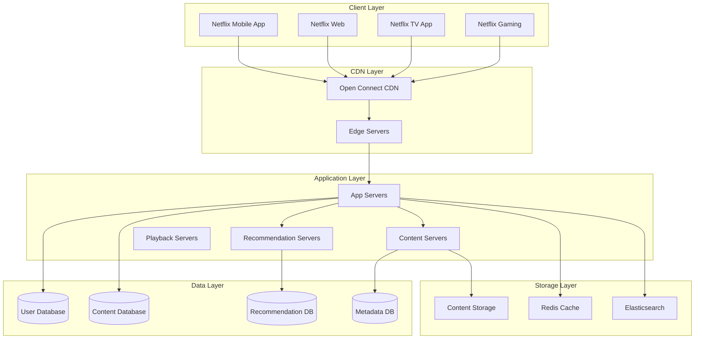

# Netflix Technical Architecture - Complete Case Study

## 🎯 Overview

Netflix is the world's leading streaming platform, serving over 230 million subscribers globally with 1+ billion hours of content watched weekly. This case study covers the complete technical architecture, content delivery, and recommendation systems.

## 📊 Scale & Statistics

- **Subscribers**: 230+ million globally
- **Content**: 15,000+ movies and TV shows
- **Streaming Hours**: 1+ billion hours weekly
- **Peak Traffic**: 15+ Tbps during peak hours
- **CDN**: 200+ edge locations worldwide
- **Data Centers**: 3 regions (US, EU, APAC)
- **Content Size**: 100+ petabytes of video content

## 🏗️ High-Level Architecture



## 🔧 Core Backend Components

### 1. Content Delivery Network (CDN)

#### Open Connect CDN Architecture
```go
type OpenConnectCDN struct {
    edgeServers    []EdgeServer
    originServers  []OriginServer
    loadBalancer   LoadBalancer
    cacheManager   CacheManager
}

func (oc *OpenConnectCDN) ServeContent(contentID string, userLocation string) (*ContentResponse, error) {
    // Find nearest edge server
    edgeServer, err := oc.findNearestEdgeServer(userLocation)
    if err != nil {
        return nil, err
    }
    
    // Check if content is cached
    if content, err := oc.cacheManager.Get(contentID); err == nil {
        return &ContentResponse{
            Content: content,
            Server:  edgeServer,
            Source:  "cache",
        }, nil
    }
    
    // Fetch from origin server
    content, err := oc.fetchFromOrigin(contentID)
    if err != nil {
        return nil, err
    }
    
    // Cache content
    oc.cacheManager.Set(contentID, content, 24*time.Hour)
    
    return &ContentResponse{
        Content: content,
        Server:  edgeServer,
        Source:  "origin",
    }, nil
}

func (oc *OpenConnectCDN) findNearestEdgeServer(userLocation string) (*EdgeServer, error) {
    // Use geolocation to find nearest server
    userLat, userLon := oc.getCoordinates(userLocation)
    
    var nearestServer *EdgeServer
    minDistance := math.MaxFloat64
    
    for _, server := range oc.edgeServers {
        distance := oc.calculateDistance(userLat, userLon, server.Lat, server.Lon)
        if distance < minDistance {
            minDistance = distance
            nearestServer = server
        }
    }
    
    return nearestServer, nil
}
```

#### Content Caching Strategy
```go
type CacheManager struct {
    l1Cache *sync.Map // In-memory cache
    l2Cache RedisClient // Redis cache
    l3Cache Database // Database
}

func (cm *CacheManager) GetContent(contentID string) (*Content, error) {
    // L1 Cache (In-memory)
    if value, ok := cm.l1Cache.Load(contentID); ok {
        return value.(*Content), nil
    }
    
    // L2 Cache (Redis)
    if cached, err := cm.l2Cache.Get(fmt.Sprintf("content:%s", contentID)); err == nil {
        var content Content
        json.Unmarshal([]byte(cached), &content)
        cm.l1Cache.Store(contentID, &content)
        return &content, nil
    }
    
    // L3 Cache (Database)
    content, err := cm.l3Cache.GetContent(contentID)
    if err != nil {
        return nil, err
    }
    
    // Store in caches
    cm.l1Cache.Store(contentID, content)
    contentJSON, _ := json.Marshal(content)
    cm.l2Cache.Set(fmt.Sprintf("content:%s", contentID), contentJSON, time.Hour)
    
    return content, nil
}
```

### 2. Recommendation System

#### Content-Based Filtering
```go
type ContentBasedRecommender struct {
    contentService ContentService
    userService    UserService
    mlService      MLService
    cache         RedisClient
}

func (cbr *ContentBasedRecommender) GetRecommendations(userID string, limit int) ([]Content, error) {
    // Check cache first
    cacheKey := fmt.Sprintf("recommendations:%s", userID)
    if cached, err := cbr.cache.Get(cacheKey); err == nil {
        var recommendations []Content
        json.Unmarshal([]byte(cached), &recommendations)
        return recommendations, nil
    }
    
    // Get user's watch history
    watchHistory, err := cbr.userService.GetWatchHistory(userID)
    if err != nil {
        return nil, err
    }
    
    // Extract user preferences
    preferences := cbr.extractPreferences(watchHistory)
    
    // Find similar content
    similarContent, err := cbr.findSimilarContent(preferences, limit)
    if err != nil {
        return nil, err
    }
    
    // Cache recommendations
    recommendationsJSON, _ := json.Marshal(similarContent)
    cbr.cache.Set(cacheKey, recommendationsJSON, 15*time.Minute)
    
    return similarContent, nil
}

func (cbr *ContentBasedRecommender) extractPreferences(watchHistory []WatchEvent) *UserPreferences {
    preferences := &UserPreferences{
        Genres:      make(map[string]float64),
        Actors:      make(map[string]float64),
        Directors:   make(map[string]float64),
        Languages:   make(map[string]float64),
        ReleaseYears: make(map[int]float64),
    }
    
    for _, event := range watchHistory {
        content := event.Content
        
        // Weight by watch duration
        weight := float64(event.WatchDuration) / float64(content.Duration)
        
        // Update genre preferences
        for _, genre := range content.Genres {
            preferences.Genres[genre] += weight
        }
        
        // Update actor preferences
        for _, actor := range content.Actors {
            preferences.Actors[actor] += weight
        }
        
        // Update director preferences
        preferences.Directors[content.Director] += weight
        
        // Update language preferences
        preferences.Languages[content.Language] += weight
        
        // Update release year preferences
        preferences.ReleaseYears[content.ReleaseYear] += weight
    }
    
    return preferences
}
```

#### Collaborative Filtering
```go
type CollaborativeFilteringRecommender struct {
    userService    UserService
    contentService ContentService
    mlService      MLService
    cache         RedisClient
}

func (cfr *CollaborativeFilteringRecommender) GetRecommendations(userID string, limit int) ([]Content, error) {
    // Check cache first
    cacheKey := fmt.Sprintf("collab_recommendations:%s", userID)
    if cached, err := cfr.cache.Get(cacheKey); err == nil {
        var recommendations []Content
        json.Unmarshal([]byte(cached), &recommendations)
        return recommendations, nil
    }
    
    // Find similar users
    similarUsers, err := cfr.findSimilarUsers(userID)
    if err != nil {
        return nil, err
    }
    
    // Get content from similar users
    recommendations, err := cfr.getContentFromSimilarUsers(similarUsers, userID, limit)
    if err != nil {
        return nil, err
    }
    
    // Cache recommendations
    recommendationsJSON, _ := json.Marshal(recommendations)
    cfr.cache.Set(cacheKey, recommendationsJSON, 15*time.Minute)
    
    return recommendations, nil
}

func (cfr *CollaborativeFilteringRecommender) findSimilarUsers(userID string) ([]SimilarUser, error) {
    // Get user's watch history
    userHistory, err := cfr.userService.GetWatchHistory(userID)
    if err != nil {
        return nil, err
    }
    
    // Create user vector
    userVector := cfr.createUserVector(userHistory)
    
    // Find similar users using cosine similarity
    similarUsers, err := cfr.mlService.FindSimilarUsers(userVector, 100)
    if err != nil {
        return nil, err
    }
    
    return similarUsers, nil
}
```

### 3. Video Streaming System

#### Adaptive Bitrate Streaming
```go
type AdaptiveBitrateStreamer struct {
    contentService ContentService
    cdnService     CDNService
    analyticsService AnalyticsService
}

func (abs *AdaptiveBitrateStreamer) GetStreamingURL(contentID string, userID string) (*StreamingResponse, error) {
    // Get user's network conditions
    networkConditions, err := abs.analyticsService.GetNetworkConditions(userID)
    if err != nil {
        return nil, err
    }
    
    // Get available bitrates for content
    bitrates, err := abs.contentService.GetAvailableBitrates(contentID)
    if err != nil {
        return nil, err
    }
    
    // Select optimal bitrate
    optimalBitrate := abs.selectOptimalBitrate(networkConditions, bitrates)
    
    // Get streaming URL
    streamingURL, err := abs.cdnService.GetStreamingURL(contentID, optimalBitrate)
    if err != nil {
        return nil, err
    }
    
    return &StreamingResponse{
        URL:      streamingURL,
        Bitrate:  optimalBitrate,
        Format:   "HLS",
        Segments: abs.generateSegments(contentID, optimalBitrate),
    }, nil
}

func (abs *AdaptiveBitrateStreamer) selectOptimalBitrate(conditions *NetworkConditions, bitrates []Bitrate) *Bitrate {
    // Calculate available bandwidth
    availableBandwidth := conditions.Bandwidth * 0.8 // Use 80% of available bandwidth
    
    // Find highest bitrate that fits
    var optimalBitrate *Bitrate
    for _, bitrate := range bitrates {
        if bitrate.Rate <= availableBandwidth {
            if optimalBitrate == nil || bitrate.Rate > optimalBitrate.Rate {
                optimalBitrate = &bitrate
            }
        }
    }
    
    return optimalBitrate
}
```

#### HLS (HTTP Live Streaming) Implementation
```go
type HLSStreamer struct {
    contentService ContentService
    cdnService     CDNService
    segmentDuration time.Duration
}

func (hs *HLSStreamer) GeneratePlaylist(contentID string, bitrate string) (*HLSPlaylist, error) {
    // Get content segments
    segments, err := hs.contentService.GetSegments(contentID, bitrate)
    if err != nil {
        return nil, err
    }
    
    // Generate playlist
    playlist := &HLSPlaylist{
        Version:     3,
        TargetDuration: int(hs.segmentDuration.Seconds()),
        MediaSequence: 0,
        Segments:    make([]HLSSegment, len(segments)),
    }
    
    for i, segment := range segments {
        playlist.Segments[i] = HLSSegment{
            Duration:   segment.Duration,
            URI:        segment.URI,
            Sequence:   i,
        }
    }
    
    return playlist, nil
}

func (hs *HLSStreamer) GenerateMasterPlaylist(contentID string) (*HLSMasterPlaylist, error) {
    // Get available bitrates
    bitrates, err := hs.contentService.GetAvailableBitrates(contentID)
    if err != nil {
        return nil, err
    }
    
    // Generate master playlist
    masterPlaylist := &HLSMasterPlaylist{
        Version: 3,
        Variants: make([]HLSVariant, len(bitrates)),
    }
    
    for i, bitrate := range bitrates {
        masterPlaylist.Variants[i] = HLSVariant{
            Bandwidth: bitrate.Rate,
            Resolution: bitrate.Resolution,
            URI:       fmt.Sprintf("%s_%s.m3u8", contentID, bitrate.Name),
        }
    }
    
    return masterPlaylist, nil
}
```

### 4. Content Management System

#### Content Ingestion Pipeline
```go
type ContentIngestionPipeline struct {
    contentService ContentService
    transcodingService TranscodingService
    cdnService     CDNService
    metadataService MetadataService
}

func (cip *ContentIngestionPipeline) IngestContent(content *Content) error {
    // Validate content
    if err := cip.validateContent(content); err != nil {
        return err
    }
    
    // Generate content ID
    contentID := cip.generateContentID(content)
    content.ID = contentID
    
    // Store metadata
    if err := cip.metadataService.StoreMetadata(content); err != nil {
        return err
    }
    
    // Transcode to multiple bitrates
    if err := cip.transcodeContent(content); err != nil {
        return err
    }
    
    // Upload to CDN
    if err := cip.uploadToCDN(content); err != nil {
        return err
    }
    
    // Update content status
    content.Status = "available"
    return cip.contentService.UpdateContent(content)
}

func (cip *ContentIngestionPipeline) transcodeContent(content *Content) error {
    bitrates := []Bitrate{
        {Name: "240p", Rate: 500000, Resolution: "426x240"},
        {Name: "360p", Rate: 1000000, Resolution: "640x360"},
        {Name: "480p", Rate: 2000000, Resolution: "854x480"},
        {Name: "720p", Rate: 4000000, Resolution: "1280x720"},
        {Name: "1080p", Rate: 8000000, Resolution: "1920x1080"},
        {Name: "4K", Rate: 15000000, Resolution: "3840x2160"},
    }
    
    for _, bitrate := range bitrates {
        if err := cip.transcodingService.Transcode(content, bitrate); err != nil {
            return err
        }
    }
    
    return nil
}
```

### 5. User Management System

#### User Authentication
```go
type AuthManager struct {
    userService UserService
    jwtService  JWTService
    cache      RedisClient
}

func (am *AuthManager) AuthenticateUser(email, password string) (*AuthResponse, error) {
    // Get user by email
    user, err := am.userService.GetUserByEmail(email)
    if err != nil {
        return nil, err
    }
    
    // Verify password
    if !am.verifyPassword(password, user.PasswordHash) {
        return nil, errors.New("invalid credentials")
    }
    
    // Generate JWT token
    token, err := am.jwtService.GenerateToken(user.ID)
    if err != nil {
        return nil, err
    }
    
    // Generate refresh token
    refreshToken, err := am.jwtService.GenerateRefreshToken(user.ID)
    if err != nil {
        return nil, err
    }
    
    // Cache user session
    session := &UserSession{
        UserID:       user.ID,
        Token:        token,
        RefreshToken: refreshToken,
        ExpiresAt:    time.Now().Add(24 * time.Hour),
    }
    
    am.cache.Set(fmt.Sprintf("session:%s", user.ID), session, 24*time.Hour)
    
    return &AuthResponse{
        User:         user,
        Token:        token,
        RefreshToken: refreshToken,
        ExpiresIn:    86400, // 24 hours
    }, nil
}
```

#### User Profile Management
```go
type ProfileManager struct {
    userService UserService
    contentService ContentService
    analyticsService AnalyticsService
    cache      RedisClient
}

func (pm *ProfileManager) GetUserProfile(userID string) (*UserProfile, error) {
    // Check cache first
    if cached, err := pm.cache.Get(fmt.Sprintf("profile:%s", userID)); err == nil {
        var profile UserProfile
        json.Unmarshal([]byte(cached), &profile)
        return &profile, nil
    }
    
    // Get user data
    user, err := pm.userService.GetUser(userID)
    if err != nil {
        return nil, err
    }
    
    // Get watch history
    watchHistory, err := pm.contentService.GetWatchHistory(userID)
    if err != nil {
        return nil, err
    }
    
    // Get recommendations
    recommendations, err := pm.contentService.GetRecommendations(userID, 10)
    if err != nil {
        return nil, err
    }
    
    // Get analytics
    analytics, err := pm.analyticsService.GetUserAnalytics(userID)
    if err != nil {
        return nil, err
    }
    
    profile := &UserProfile{
        User:            user,
        WatchHistory:    watchHistory,
        Recommendations: recommendations,
        Analytics:       analytics,
    }
    
    // Cache profile
    profileJSON, _ := json.Marshal(profile)
    pm.cache.Set(fmt.Sprintf("profile:%s", userID), profileJSON, time.Hour)
    
    return profile, nil
}
```

## 🔍 Search & Discovery

#### Content Search
```go
type SearchService struct {
    elasticsearch ElasticsearchClient
    contentService ContentService
    cache        RedisClient
}

func (ss *SearchService) SearchContent(query string, filters *SearchFilters, limit int) ([]Content, error) {
    // Check cache first
    cacheKey := fmt.Sprintf("search:%s:%s:%d", query, filters.String(), limit)
    if cached, err := ss.cache.Get(cacheKey); err == nil {
        var results []Content
        json.Unmarshal([]byte(cached), &results)
        return results, nil
    }
    
    // Build search query
    searchQuery := ss.buildSearchQuery(query, filters, limit)
    
    // Search in Elasticsearch
    result, err := ss.elasticsearch.Search("content", searchQuery)
    if err != nil {
        return nil, err
    }
    
    var contents []Content
    for _, hit := range result.Hits.Hits {
        var content Content
        json.Unmarshal(hit.Source, &content)
        contents = append(contents, content)
    }
    
    // Cache results
    resultsJSON, _ := json.Marshal(contents)
    ss.cache.Set(cacheKey, resultsJSON, 15*time.Minute)
    
    return contents, nil
}

func (ss *SearchService) buildSearchQuery(query string, filters *SearchFilters, limit int) map[string]interface{} {
    searchQuery := map[string]interface{}{
        "query": map[string]interface{}{
            "bool": map[string]interface{}{
                "must": []map[string]interface{}{
                    {
                        "multi_match": map[string]interface{}{
                            "query":  query,
                            "fields": []string{"title", "description", "genres", "actors", "directors"},
                            "type":   "best_fields",
                        },
                    },
                },
            },
        },
        "size": limit,
    }
    
    // Add filters
    if filters != nil {
        boolQuery := searchQuery["query"].(map[string]interface{})["bool"].(map[string]interface{})
        
        if len(filters.Genres) > 0 {
            boolQuery["filter"] = append(boolQuery["filter"].([]map[string]interface{}), map[string]interface{}{
                "terms": map[string]interface{}{
                    "genres": filters.Genres,
                },
            })
        }
        
        if filters.ReleaseYear != 0 {
            boolQuery["filter"] = append(boolQuery["filter"].([]map[string]interface{}), map[string]interface{}{
                "term": map[string]interface{}{
                    "release_year": filters.ReleaseYear,
                },
            })
        }
    }
    
    return searchQuery
}
```

## 📊 Analytics & Monitoring

#### Real-time Analytics
```go
type AnalyticsService struct {
    eventStore   EventStore
    aggregator   DataAggregator
    cache       RedisClient
}

func (as *AnalyticsService) TrackEvent(userID string, eventType string, data map[string]interface{}) error {
    event := &Event{
        ID:        generateEventID(),
        UserID:    userID,
        Type:      eventType,
        Data:      data,
        Timestamp: time.Now(),
    }
    
    // Store event
    err := as.eventStore.StoreEvent(event)
    if err != nil {
        return err
    }
    
    // Update real-time counters
    as.cache.Incr(fmt.Sprintf("events:%s:%s", userID, eventType))
    as.cache.Incr(fmt.Sprintf("events:global:%s", eventType))
    
    return nil
}

func (as *AnalyticsService) GetContentAnalytics(contentID string) (*ContentAnalytics, error) {
    // Check cache first
    if cached, err := as.cache.Get(fmt.Sprintf("analytics:content:%s", contentID)); err == nil {
        var analytics ContentAnalytics
        json.Unmarshal([]byte(cached), &analytics)
        return &analytics, nil
    }
    
    // Calculate analytics
    analytics, err := as.aggregator.CalculateContentAnalytics(contentID)
    if err != nil {
        return nil, err
    }
    
    // Cache analytics
    analyticsJSON, _ := json.Marshal(analytics)
    as.cache.Set(fmt.Sprintf("analytics:content:%s", contentID), analyticsJSON, time.Hour)
    
    return analytics, nil
}
```

## 🚀 Performance Optimization

#### Caching Strategy
```go
type CacheManager struct {
    l1Cache *sync.Map // In-memory cache
    l2Cache RedisClient // Redis cache
    l3Cache Database // Database
}

func (cm *CacheManager) GetContent(contentID string) (*Content, error) {
    // L1 Cache (In-memory)
    if value, ok := cm.l1Cache.Load(contentID); ok {
        return value.(*Content), nil
    }
    
    // L2 Cache (Redis)
    if cached, err := cm.l2Cache.Get(fmt.Sprintf("content:%s", contentID)); err == nil {
        var content Content
        json.Unmarshal([]byte(cached), &content)
        cm.l1Cache.Store(contentID, &content)
        return &content, nil
    }
    
    // L3 Cache (Database)
    content, err := cm.l3Cache.GetContent(contentID)
    if err != nil {
        return nil, err
    }
    
    // Store in caches
    cm.l1Cache.Store(contentID, content)
    contentJSON, _ := json.Marshal(content)
    cm.l2Cache.Set(fmt.Sprintf("content:%s", contentID), contentJSON, time.Hour)
    
    return content, nil
}
```

## 🔍 Key Technical Challenges

### 1. Content Delivery at Scale
- **Problem**: Delivering 1B+ hours of content weekly
- **Solution**: Global CDN with edge caching
- **Implementation**: Open Connect CDN with 200+ locations

### 2. Adaptive Bitrate Streaming
- **Problem**: Optimizing quality for different network conditions
- **Solution**: Dynamic bitrate selection based on network conditions
- **Implementation**: HLS with real-time network monitoring

### 3. Recommendation System
- **Problem**: Personalizing content for 230M+ users
- **Solution**: Hybrid recommendation system with ML
- **Implementation**: Content-based + collaborative filtering

### 4. Content Processing
- **Problem**: Processing massive amounts of video content
- **Solution**: Distributed transcoding pipeline
- **Implementation**: Kubernetes jobs with GPU acceleration

## 📚 Interview Questions

### System Design Questions
1. How would you design Netflix's streaming system?
2. How does Netflix handle content delivery at scale?
3. How would you implement Netflix's recommendation system?
4. How does Netflix optimize for different devices?
5. How would you design Netflix's content ingestion pipeline?

### Technical Deep Dive
1. Explain Netflix's CDN architecture
2. How does Netflix handle adaptive bitrate streaming?
3. Describe Netflix's recommendation algorithm
4. How does Netflix optimize for mobile performance?
5. Explain Netflix's content processing pipeline

## 🎯 Key Takeaways

1. **Content Delivery**: Global CDN with edge caching
2. **Adaptive Streaming**: Dynamic bitrate selection
3. **Recommendation System**: Hybrid ML-based approach
4. **Content Processing**: Distributed transcoding pipeline
5. **User Experience**: Seamless cross-device experience
6. **Performance**: Multi-level caching and optimization
7. **Scalability**: Microservices with auto-scaling

## 🔗 Additional Resources

- [Netflix Technology Blog](https://netflixtechblog.com/)
- [Open Connect CDN](https://openconnect.netflix.com/)
- [Adaptive Bitrate Streaming](https://developer.apple.com/streaming/)
- [Content Recommendation Systems](https://towardsdatascience.com/)
- [Video Processing Best Practices](https://cloud.google.com/solutions/media-processing)
