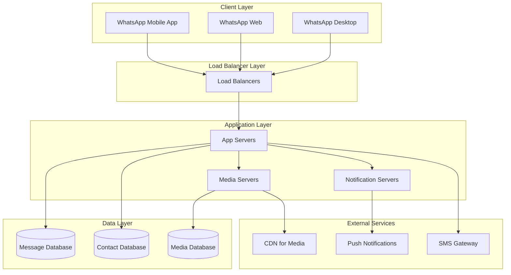
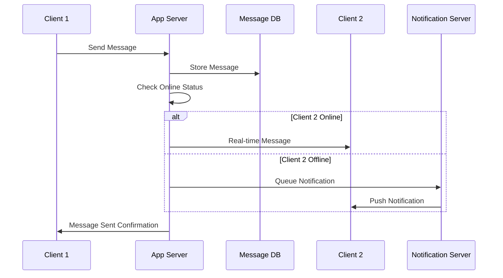
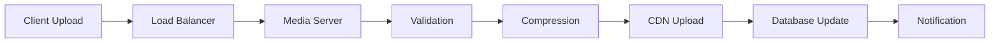

---
# Auto-generated front matter
Title: Whatsapp Technical Architecture
LastUpdated: 2025-11-06T20:45:57.733511
Tags: []
Status: draft
---

# WhatsApp Technical Architecture - Complete Case Study

## 🎯 Overview

WhatsApp is one of the world's largest messaging platforms, handling over 2 billion users and 100+ billion messages daily. This case study covers the complete technical architecture, protocols, and backend systems.

## 📊 Scale & Statistics

- **Users**: 2+ billion active users
- **Messages**: 100+ billion messages daily
- **Media**: 4+ billion photos shared daily
- **Countries**: 180+ countries
- **Languages**: 60+ languages supported
- **Uptime**: 99.9% availability

## 🏗️ High-Level Architecture



## 🔧 Core Backend Components

### 1. Message Handling System

#### Message Flow Architecture


#### Message Storage Strategy
- **Primary Storage**: MySQL with sharding
- **Sharding Key**: User ID hash
- **Replication**: Master-slave with read replicas
- **Retention**: 30 days for regular messages
- **Encryption**: End-to-end encryption at rest

### 2. Real-time Communication

#### WebSocket Implementation
```go
type WebSocketManager struct {
    connections map[string]*websocket.Conn
    mutex       sync.RWMutex
    hub         chan Message
}

func (wm *WebSocketManager) HandleConnection(conn *websocket.Conn, userID string) {
    wm.mutex.Lock()
    wm.connections[userID] = conn
    wm.mutex.Unlock()
    
    defer func() {
        wm.mutex.Lock()
        delete(wm.connections, userID)
        wm.mutex.Unlock()
        conn.Close()
    }()
    
    for {
        var msg Message
        err := conn.ReadJSON(&msg)
        if err != nil {
            break
        }
        
        wm.hub <- msg
    }
}
```

#### Message Broadcasting
```go
func (wm *WebSocketManager) BroadcastMessage(msg Message) {
    wm.mutex.RLock()
    defer wm.mutex.RUnlock()
    
    for userID, conn := range wm.connections {
        if msg.RecipientID == userID {
            conn.WriteJSON(msg)
        }
    }
}
```

### 3. Media Handling System

#### Media Upload Flow


#### Media Processing Pipeline
```go
type MediaProcessor struct {
    compressor   ImageCompressor
    validator    MediaValidator
    cdnUploader  CDNUploader
    db          Database
}

func (mp *MediaProcessor) ProcessMedia(mediaData []byte, mediaType string) (*MediaResult, error) {
    // Validate media
    if err := mp.validator.Validate(mediaData, mediaType); err != nil {
        return nil, err
    }
    
    // Compress if needed
    compressedData, err := mp.compressor.Compress(mediaData, mediaType)
    if err != nil {
        return nil, err
    }
    
    // Upload to CDN
    cdnURL, err := mp.cdnUploader.Upload(compressedData)
    if err != nil {
        return nil, err
    }
    
    // Store metadata in database
    mediaID := generateMediaID()
    err = mp.db.StoreMedia(mediaID, cdnURL, mediaType)
    if err != nil {
        return nil, err
    }
    
    return &MediaResult{
        MediaID: mediaID,
        CDNURL:  cdnURL,
    }, nil
}
```

## 🔐 Security Architecture

### End-to-End Encryption

#### Signal Protocol Implementation
```go
type SignalProtocol struct {
    identityKey    []byte
    signedPreKey   []byte
    oneTimeKeys    [][]byte
    sessionStore   SessionStore
}

func (sp *SignalProtocol) EncryptMessage(plaintext []byte, recipientID string) ([]byte, error) {
    // Get recipient's public keys
    recipientKeys, err := sp.sessionStore.GetKeys(recipientID)
    if err != nil {
        return nil, err
    }
    
    // Generate ephemeral key pair
    ephemeralKey := generateEphemeralKey()
    
    // Perform key agreement
    sharedSecret := sp.performKeyAgreement(ephemeralKey, recipientKeys)
    
    // Derive encryption key
    encryptionKey := sp.deriveKey(sharedSecret)
    
    // Encrypt message
    ciphertext := sp.encrypt(plaintext, encryptionKey)
    
    // Create message envelope
    envelope := &MessageEnvelope{
        EphemeralKey: ephemeralKey.PublicKey(),
        Ciphertext:   ciphertext,
        Timestamp:    time.Now().Unix(),
    }
    
    return json.Marshal(envelope)
}
```

### Authentication & Authorization

#### JWT Token Management
```go
type AuthManager struct {
    secretKey []byte
    tokenExpiry time.Duration
    userStore   UserStore
}

func (am *AuthManager) GenerateToken(userID string) (string, error) {
    claims := jwt.MapClaims{
        "user_id": userID,
        "exp":     time.Now().Add(am.tokenExpiry).Unix(),
        "iat":     time.Now().Unix(),
    }
    
    token := jwt.NewWithClaims(jwt.SigningMethodHS256, claims)
    return token.SignedString(am.secretKey)
}

func (am *AuthManager) ValidateToken(tokenString string) (string, error) {
    token, err := jwt.Parse(tokenString, func(token *jwt.Token) (interface{}, error) {
        return am.secretKey, nil
    })
    
    if err != nil {
        return "", err
    }
    
    if claims, ok := token.Claims.(jwt.MapClaims); ok && token.Valid {
        return claims["user_id"].(string), nil
    }
    
    return "", errors.New("invalid token")
}
```

## 📱 Mobile App Integration

### Push Notifications

#### FCM Integration
```go
type NotificationService struct {
    fcmClient *messaging.Client
    apnsClient *apns2.Client
}

func (ns *NotificationService) SendPushNotification(deviceToken string, message *PushMessage) error {
    // Determine platform
    if strings.HasPrefix(deviceToken, "ios_") {
        return ns.sendAPNS(deviceToken, message)
    } else {
        return ns.sendFCM(deviceToken, message)
    }
}

func (ns *NotificationService) sendFCM(deviceToken string, message *PushMessage) error {
    notification := &messaging.Notification{
        Title: message.Title,
        Body:  message.Body,
    }
    
    msg := &messaging.Message{
        Token:        deviceToken,
        Notification: notification,
        Data:         message.Data,
    }
    
    _, err := ns.fcmClient.Send(context.Background(), msg)
    return err
}
```

### Offline Message Sync

#### Sync Protocol
```go
type SyncManager struct {
    messageStore MessageStore
    lastSyncTime time.Time
}

func (sm *SyncManager) SyncMessages(userID string, lastSyncTimestamp int64) ([]Message, error) {
    // Get messages since last sync
    messages, err := sm.messageStore.GetMessagesSince(userID, lastSyncTimestamp)
    if err != nil {
        return nil, err
    }
    
    // Update last sync time
    sm.lastSyncTime = time.Now()
    
    return messages, nil
}
```

## 🌐 Web Application Architecture

### WhatsApp Web Implementation

#### WebSocket Connection Management
```javascript
class WhatsAppWebSocket {
    constructor() {
        this.socket = null;
        this.reconnectAttempts = 0;
        this.maxReconnectAttempts = 5;
    }
    
    connect() {
        this.socket = new WebSocket('wss://web.whatsapp.com/ws');
        
        this.socket.onopen = () => {
            console.log('Connected to WhatsApp Web');
            this.reconnectAttempts = 0;
        };
        
        this.socket.onmessage = (event) => {
            const message = JSON.parse(event.data);
            this.handleMessage(message);
        };
        
        this.socket.onclose = () => {
            this.handleReconnect();
        };
        
        this.socket.onerror = (error) => {
            console.error('WebSocket error:', error);
        };
    }
    
    handleReconnect() {
        if (this.reconnectAttempts < this.maxReconnectAttempts) {
            this.reconnectAttempts++;
            setTimeout(() => {
                this.connect();
            }, 1000 * this.reconnectAttempts);
        }
    }
}
```

## 📊 Performance Optimization

### Caching Strategy

#### Multi-Level Caching
```go
type CacheManager struct {
    l1Cache    *sync.Map // In-memory cache
    l2Cache    redis.Client // Redis cache
    l3Cache    Database // Database
}

func (cm *CacheManager) Get(key string) (interface{}, error) {
    // L1 Cache (In-memory)
    if value, ok := cm.l1Cache.Load(key); ok {
        return value, nil
    }
    
    // L2 Cache (Redis)
    value, err := cm.l2Cache.Get(key).Result()
    if err == nil {
        cm.l1Cache.Store(key, value)
        return value, nil
    }
    
    // L3 Cache (Database)
    value, err = cm.l3Cache.Get(key)
    if err == nil {
        cm.l2Cache.Set(key, value, time.Hour)
        cm.l1Cache.Store(key, value)
    }
    
    return value, err
}
```

### Database Optimization

#### Sharding Strategy
```go
type ShardManager struct {
    shards []Database
    hashFunc func(string) int
}

func (sm *ShardManager) GetShard(userID string) Database {
    shardIndex := sm.hashFunc(userID) % len(sm.shards)
    return sm.shards[shardIndex]
}

func (sm *ShardManager) StoreMessage(userID string, message *Message) error {
    shard := sm.GetShard(userID)
    return shard.StoreMessage(userID, message)
}
```

## 🔄 Scalability Patterns

### Horizontal Scaling

#### Load Balancing Strategy
```go
type LoadBalancer struct {
    servers []Server
    strategy LoadBalancingStrategy
    healthChecker HealthChecker
}

func (lb *LoadBalancer) GetServer() Server {
    healthyServers := lb.healthChecker.GetHealthyServers()
    return lb.strategy.SelectServer(healthyServers)
}
```

### Auto-scaling

#### Kubernetes HPA Configuration
```yaml
apiVersion: autoscaling/v2
kind: HorizontalPodAutoscaler
metadata:
  name: whatsapp-app-hpa
spec:
  scaleTargetRef:
    apiVersion: apps/v1
    kind: Deployment
    name: whatsapp-app
  minReplicas: 3
  maxReplicas: 100
  metrics:
  - type: Resource
    resource:
      name: cpu
      target:
        type: Utilization
        averageUtilization: 70
  - type: Resource
    resource:
      name: memory
      target:
        type: Utilization
        averageUtilization: 80
```

## 📈 Monitoring & Observability

### Metrics Collection

#### Custom Metrics
```go
type MetricsCollector struct {
    messageCounter   prometheus.Counter
    responseTime     prometheus.Histogram
    activeConnections prometheus.Gauge
}

func (mc *MetricsCollector) RecordMessage() {
    mc.messageCounter.Inc()
}

func (mc *MetricsCollector) RecordResponseTime(duration time.Duration) {
    mc.responseTime.Observe(duration.Seconds())
}
```

### Distributed Tracing

#### Jaeger Integration
```go
func (h *MessageHandler) HandleMessage(ctx context.Context, msg *Message) error {
    span, ctx := opentracing.StartSpanFromContext(ctx, "handle_message")
    defer span.Finish()
    
    span.SetTag("message_id", msg.ID)
    span.SetTag("user_id", msg.UserID)
    
    // Process message
    err := h.processMessage(ctx, msg)
    if err != nil {
        span.SetTag("error", true)
        span.LogFields(log.Error(err))
    }
    
    return err
}
```

## 🚀 Deployment Architecture

### Microservices Deployment

#### Service Mesh with Istio
```yaml
apiVersion: networking.istio.io/v1alpha3
kind: VirtualService
metadata:
  name: whatsapp-messaging
spec:
  http:
  - match:
    - uri:
        prefix: /api/messages
    route:
    - destination:
        host: whatsapp-messaging-service
        port:
          number: 8080
    timeout: 30s
    retries:
      attempts: 3
      perTryTimeout: 10s
```

### CI/CD Pipeline

#### GitHub Actions Workflow
```yaml
name: WhatsApp Backend CI/CD
on:
  push:
    branches: [main]
  pull_request:
    branches: [main]

jobs:
  test:
    runs-on: ubuntu-latest
    steps:
    - uses: actions/checkout@v2
    - name: Run Tests
      run: |
        go test ./...
        go test -race ./...
    
  build:
    needs: test
    runs-on: ubuntu-latest
    steps:
    - name: Build Docker Image
      run: |
        docker build -t whatsapp-backend:${{ github.sha }} .
        docker push ${{ secrets.REGISTRY }}/whatsapp-backend:${{ github.sha }}
    
  deploy:
    needs: build
    runs-on: ubuntu-latest
    steps:
    - name: Deploy to Kubernetes
      run: |
        kubectl set image deployment/whatsapp-backend \
          whatsapp-backend=${{ secrets.REGISTRY }}/whatsapp-backend:${{ github.sha }}
```

## 🔍 Key Technical Challenges

### 1. Message Ordering
- **Problem**: Ensuring messages arrive in correct order
- **Solution**: Vector clocks and sequence numbers
- **Implementation**: Lamport timestamps with user-specific counters

### 2. Offline Message Delivery
- **Problem**: Delivering messages when users come online
- **Solution**: Message queues with TTL
- **Implementation**: Redis Streams with message persistence

### 3. Media Optimization
- **Problem**: Efficient storage and delivery of media
- **Solution**: CDN with intelligent caching
- **Implementation**: AWS CloudFront with custom cache policies

### 4. Real-time Synchronization
- **Problem**: Keeping multiple devices in sync
- **Solution**: Event sourcing with conflict resolution
- **Implementation**: CRDTs for conflict-free replication

## 📚 Interview Questions

### System Design Questions
1. How would you design WhatsApp's message delivery system?
2. How does WhatsApp handle media sharing at scale?
3. How would you implement end-to-end encryption?
4. How does WhatsApp ensure message ordering?
5. How would you handle offline message delivery?

### Technical Deep Dive
1. Explain WhatsApp's WebSocket implementation
2. How does WhatsApp handle push notifications?
3. Describe WhatsApp's database sharding strategy
4. How does WhatsApp optimize for mobile networks?
5. Explain WhatsApp's media compression pipeline

## 🎯 Key Takeaways

1. **Real-time Communication**: WebSockets for instant messaging
2. **Security First**: End-to-end encryption with Signal Protocol
3. **Mobile Optimization**: Efficient battery and data usage
4. **Scalability**: Horizontal scaling with microservices
5. **Reliability**: 99.9% uptime with fault tolerance
6. **Performance**: Multi-level caching and CDN optimization
7. **Cross-platform**: Consistent experience across devices

## 🔗 Additional Resources

- [WhatsApp Engineering Blog](https://engineering.fb.com/category/whatsapp/)
- [Signal Protocol Specification](https://signal.org/docs/)
- [WebRTC for Real-time Communication](https://webrtc.org/)
- [End-to-End Encryption Best Practices](https://owasp.org/www-project-top-ten/)
- [Mobile App Performance Optimization](https://developer.android.com/topic/performance)
