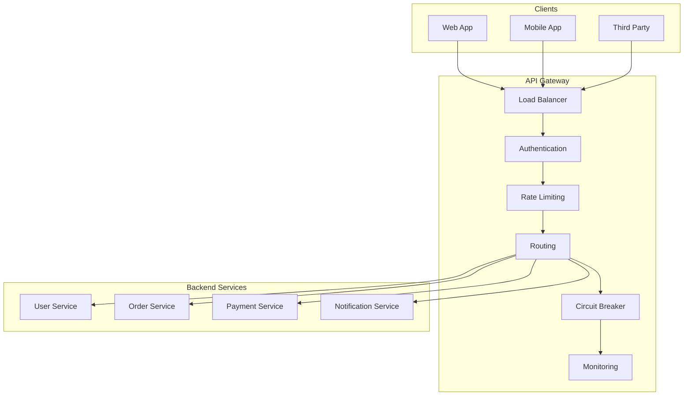
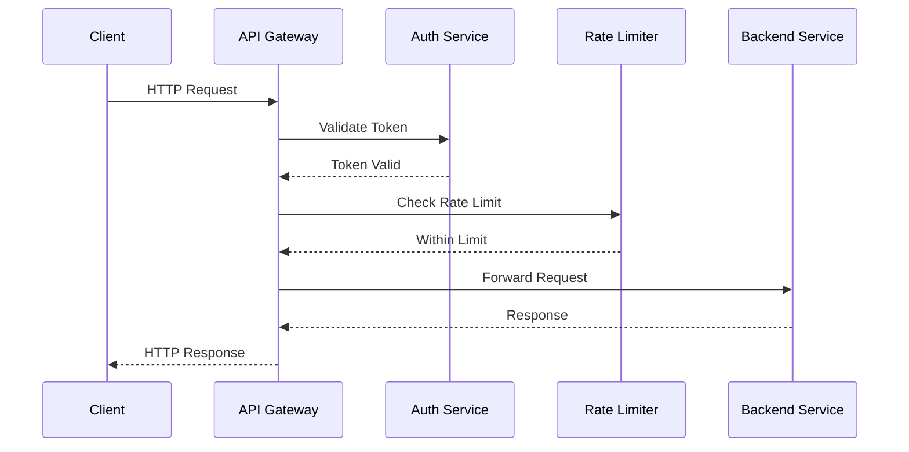

# 🌐 **API Gateway**

## 📘 **Theory**

An API Gateway is a server that acts as an intermediary between clients and backend services. It provides a single entry point for all client requests and handles cross-cutting concerns like authentication, rate limiting, logging, and routing.

### **Why API Gateway Matters**

- **Single Entry Point**: Provides a unified interface for all services
- **Cross-cutting Concerns**: Handles common functionality across services
- **Service Discovery**: Routes requests to appropriate backend services
- **Load Balancing**: Distributes traffic across multiple service instances
- **Security**: Centralizes authentication and authorization
- **Monitoring**: Provides centralized logging and metrics
- **Rate Limiting**: Protects backend services from overload
- **Protocol Translation**: Converts between different protocols

### **Key Components**

1. **Request Router**: Routes requests to appropriate services
2. **Authentication**: Validates client credentials
3. **Authorization**: Checks permissions for requests
4. **Rate Limiting**: Controls request frequency
5. **Load Balancer**: Distributes traffic across instances
6. **Circuit Breaker**: Prevents cascading failures
7. **Request/Response Transformation**: Modifies requests and responses
8. **Logging & Monitoring**: Records requests and metrics
9. **Caching**: Stores frequently accessed data
10. **SSL Termination**: Handles HTTPS encryption

### **Common Pitfalls and Best Practices**

- **Single Point of Failure**: Implement high availability
- **Performance Bottleneck**: Use caching and optimization
- **Configuration Management**: Centralize and version configurations
- **Service Discovery**: Implement dynamic service discovery
- **Error Handling**: Provide meaningful error responses
- **Security**: Implement proper authentication and authorization
- **Monitoring**: Monitor gateway performance and health
- **Scalability**: Design for horizontal scaling

## 📊 **Diagrams**

### **API Gateway Architecture**



### **Request Flow**



## 🧩 **Example**

**Scenario**: Design an API Gateway for an e-commerce platform

**Input**:

- Multiple microservices (User, Product, Order, Payment)
- Different client types (Web, Mobile, Admin)
- Various authentication methods
- Rate limiting requirements

**Expected Output**:

- Unified API interface
- Centralized authentication
- Rate limiting and monitoring
- Load balancing and failover

**Step-by-step**:

1. Design gateway architecture
2. Implement authentication middleware
3. Add rate limiting
4. Configure routing rules
5. Implement monitoring
6. Add caching layer
7. Test and optimize

## 💻 **Implementation (Golang)**

```go
package main

import (
    "context"
    "encoding/json"
    "fmt"
    "log"
    "net/http"
    "strings"
    "time"

    "github.com/gorilla/mux"
    "github.com/patrickmn/go-cache"
    "golang.org/x/time/rate"
)

// APIGateway represents the API Gateway
type APIGateway struct {
    router        *mux.Router
    services      map[string]*Service
    authService   *AuthService
    rateLimiter   *RateLimiter
    circuitBreaker *CircuitBreaker
    cache         *cache.Cache
    monitor       *Monitor
}

// Service represents a backend service
type Service struct {
    Name        string
    BaseURL     string
    Endpoints   []Endpoint
    HealthCheck string
    Timeout     time.Duration
}

// Endpoint represents a service endpoint
type Endpoint struct {
    Path        string
    Method      string
    AuthRequired bool
    RateLimit   int
    CacheTTL    time.Duration
}

// AuthService handles authentication
type AuthService struct {
    jwtSecret string
    cache     *cache.Cache
}

// RateLimiter handles rate limiting
type RateLimiter struct {
    limiters map[string]*rate.Limiter
    cache    *cache.Cache
}

// CircuitBreaker handles circuit breaking
type CircuitBreaker struct {
    services map[string]*ServiceBreaker
}

// ServiceBreaker represents a circuit breaker for a service
type ServiceBreaker struct {
    name            string
    failureCount    int
    lastFailureTime time.Time
    state           string // "closed", "open", "half-open"
    threshold       int
    timeout         time.Duration
}

// Monitor handles monitoring and metrics
type Monitor struct {
    requestCount    int64
    errorCount      int64
    responseTime    time.Duration
    activeRequests  int64
}

// NewAPIGateway creates a new API Gateway
func NewAPIGateway() *APIGateway {
    return &APIGateway{
        router:        mux.NewRouter(),
        services:      make(map[string]*Service),
        authService:   NewAuthService(),
        rateLimiter:   NewRateLimiter(),
        circuitBreaker: NewCircuitBreaker(),
        cache:         cache.New(5*time.Minute, 10*time.Minute),
        monitor:       NewMonitor(),
    }
}

// RegisterService registers a backend service
func (ag *APIGateway) RegisterService(service *Service) {
    ag.services[service.Name] = service
    ag.circuitBreaker.RegisterService(service.Name)
}

// AddRoute adds a route to the gateway
func (ag *APIGateway) AddRoute(serviceName, path, method string, authRequired bool, rateLimit int, cacheTTL time.Duration) {
    service, exists := ag.services[serviceName]
    if !exists {
        log.Printf("Service not found: %s", serviceName)
        return
    }

    endpoint := Endpoint{
        Path:        path,
        Method:      method,
        AuthRequired: authRequired,
        RateLimit:   rateLimit,
        CacheTTL:    cacheTTL,
    }

    service.Endpoints = append(service.Endpoints, endpoint)

    // Add route to router
    ag.router.HandleFunc(path, ag.handleRequest(serviceName, endpoint)).Methods(method)
}

// handleRequest handles incoming requests
func (ag *APIGateway) handleRequest(serviceName string, endpoint Endpoint) http.HandlerFunc {
    return func(w http.ResponseWriter, r *http.Request) {
        start := time.Now()
        ag.monitor.IncrementRequestCount()
        ag.monitor.IncrementActiveRequests()
        defer ag.monitor.DecrementActiveRequests()

        // Check authentication if required
        if endpoint.AuthRequired {
            if !ag.authService.ValidateToken(r) {
                http.Error(w, "Unauthorized", http.StatusUnauthorized)
                ag.monitor.IncrementErrorCount()
                return
            }
        }

        // Check rate limiting
        clientID := ag.getClientID(r)
        if !ag.rateLimiter.Allow(clientID, endpoint.RateLimit) {
            http.Error(w, "Rate limit exceeded", http.StatusTooManyRequests)
            ag.monitor.IncrementErrorCount()
            return
        }

        // Check circuit breaker
        if !ag.circuitBreaker.AllowRequest(serviceName) {
            http.Error(w, "Service unavailable", http.StatusServiceUnavailable)
            ag.monitor.IncrementErrorCount()
            return
        }

        // Check cache
        cacheKey := ag.getCacheKey(r)
        if cachedResponse := ag.getCachedResponse(cacheKey); cachedResponse != nil {
            w.Header().Set("Content-Type", "application/json")
            w.Write(cachedResponse)
            return
        }

        // Forward request to backend service
        response, err := ag.forwardRequest(serviceName, endpoint, r)
        if err != nil {
            ag.circuitBreaker.RecordFailure(serviceName)
            http.Error(w, "Internal server error", http.StatusInternalServerError)
            ag.monitor.IncrementErrorCount()
            return
        }

        // Record success
        ag.circuitBreaker.RecordSuccess(serviceName)

        // Cache response if TTL is set
        if endpoint.CacheTTL > 0 {
            ag.cacheResponse(cacheKey, response, endpoint.CacheTTL)
        }

        // Set response headers
        w.Header().Set("Content-Type", "application/json")
        w.WriteHeader(http.StatusOK)
        w.Write(response)

        // Record response time
        ag.monitor.RecordResponseTime(time.Since(start))
    }
}

// forwardRequest forwards a request to a backend service
func (ag *APIGateway) forwardRequest(serviceName string, endpoint Endpoint, r *http.Request) ([]byte, error) {
    service := ag.services[serviceName]

    // Build target URL
    targetURL := service.BaseURL + endpoint.Path

    // Create new request
    req, err := http.NewRequest(endpoint.Method, targetURL, r.Body)
    if err != nil {
        return nil, err
    }

    // Copy headers
    for key, values := range r.Header {
        for _, value := range values {
            req.Header.Add(key, value)
        }
    }

    // Set timeout
    client := &http.Client{
        Timeout: service.Timeout,
    }

    // Make request
    resp, err := client.Do(req)
    if err != nil {
        return nil, err
    }
    defer resp.Body.Close()

    // Read response
    var response map[string]interface{}
    if err := json.NewDecoder(resp.Body).Decode(&response); err != nil {
        return nil, err
    }

    // Convert to JSON
    jsonResponse, err := json.Marshal(response)
    if err != nil {
        return nil, err
    }

    return jsonResponse, nil
}

// getClientID extracts client ID from request
func (ag *APIGateway) getClientID(r *http.Request) string {
    // Try to get from header
    if clientID := r.Header.Get("X-Client-ID"); clientID != "" {
        return clientID
    }

    // Try to get from query parameter
    if clientID := r.URL.Query().Get("client_id"); clientID != "" {
        return clientID
    }

    // Use IP address as fallback
    return r.RemoteAddr
}

// getCacheKey generates cache key for request
func (ag *APIGateway) getCacheKey(r *http.Request) string {
    return fmt.Sprintf("%s:%s:%s", r.Method, r.URL.Path, r.URL.RawQuery)
}

// getCachedResponse retrieves cached response
func (ag *APIGateway) getCachedResponse(key string) []byte {
    if cached, found := ag.cache.Get(key); found {
        if response, ok := cached.([]byte); ok {
            return response
        }
    }
    return nil
}

// cacheResponse caches response
func (ag *APIGateway) cacheResponse(key string, response []byte, ttl time.Duration) {
    ag.cache.Set(key, response, ttl)
}

// NewAuthService creates a new auth service
func NewAuthService() *AuthService {
    return &AuthService{
        jwtSecret: "your-secret-key",
        cache:     cache.New(1*time.Hour, 2*time.Hour),
    }
}

// ValidateToken validates JWT token
func (as *AuthService) ValidateToken(r *http.Request) bool {
    // Get token from header
    authHeader := r.Header.Get("Authorization")
    if authHeader == "" {
        return false
    }

    // Check if it starts with "Bearer "
    if !strings.HasPrefix(authHeader, "Bearer ") {
        return false
    }

    // Extract token
    token := strings.TrimPrefix(authHeader, "Bearer ")

    // Check cache first
    if cached, found := as.cache.Get(token); found {
        if valid, ok := cached.(bool); ok {
            return valid
        }
    }

    // Validate token (simplified)
    valid := len(token) > 10 // Simple validation

    // Cache result
    as.cache.Set(token, valid, 1*time.Hour)

    return valid
}

// NewRateLimiter creates a new rate limiter
func NewRateLimiter() *RateLimiter {
    return &RateLimiter{
        limiters: make(map[string]*rate.Limiter),
        cache:    cache.New(1*time.Hour, 2*time.Hour),
    }
}

// Allow checks if request is allowed
func (rl *RateLimiter) Allow(clientID string, limit int) bool {
    // Get or create limiter for client
    limiter, exists := rl.limiters[clientID]
    if !exists {
        limiter = rate.NewLimiter(rate.Limit(limit), limit)
        rl.limiters[clientID] = limiter
    }

    return limiter.Allow()
}

// NewCircuitBreaker creates a new circuit breaker
func NewCircuitBreaker() *CircuitBreaker {
    return &CircuitBreaker{
        services: make(map[string]*ServiceBreaker),
    }
}

// RegisterService registers a service with circuit breaker
func (cb *CircuitBreaker) RegisterService(serviceName string) {
    cb.services[serviceName] = &ServiceBreaker{
        name:      serviceName,
        threshold: 5,
        timeout:   30 * time.Second,
        state:     "closed",
    }
}

// AllowRequest checks if request is allowed
func (cb *CircuitBreaker) AllowRequest(serviceName string) bool {
    breaker, exists := cb.services[serviceName]
    if !exists {
        return true
    }

    switch breaker.state {
    case "closed":
        return true
    case "open":
        if time.Since(breaker.lastFailureTime) > breaker.timeout {
            breaker.state = "half-open"
            return true
        }
        return false
    case "half-open":
        return true
    default:
        return true
    }
}

// RecordSuccess records successful request
func (cb *CircuitBreaker) RecordSuccess(serviceName string) {
    breaker, exists := cb.services[serviceName]
    if !exists {
        return
    }

    if breaker.state == "half-open" {
        breaker.state = "closed"
        breaker.failureCount = 0
    }
}

// RecordFailure records failed request
func (cb *CircuitBreaker) RecordFailure(serviceName string) {
    breaker, exists := cb.services[serviceName]
    if !exists {
        return
    }

    breaker.failureCount++
    breaker.lastFailureTime = time.Now()

    if breaker.failureCount >= breaker.threshold {
        breaker.state = "open"
    }
}

// NewMonitor creates a new monitor
func NewMonitor() *Monitor {
    return &Monitor{}
}

// IncrementRequestCount increments request count
func (m *Monitor) IncrementRequestCount() {
    m.requestCount++
}

// IncrementErrorCount increments error count
func (m *Monitor) IncrementErrorCount() {
    m.errorCount++
}

// IncrementActiveRequests increments active requests
func (m *Monitor) IncrementActiveRequests() {
    m.activeRequests++
}

// DecrementActiveRequests decrements active requests
func (m *Monitor) DecrementActiveRequests() {
    m.activeRequests--
}

// RecordResponseTime records response time
func (m *Monitor) RecordResponseTime(duration time.Duration) {
    m.responseTime = duration
}

// GetStats returns monitoring statistics
func (m *Monitor) GetStats() map[string]interface{} {
    return map[string]interface{}{
        "request_count":    m.requestCount,
        "error_count":      m.errorCount,
        "active_requests":  m.activeRequests,
        "response_time_ms": m.responseTime.Milliseconds(),
    }
}

// Example usage
func main() {
    // Create API Gateway
    gateway := NewAPIGateway()

    // Register services
    gateway.RegisterService(&Service{
        Name:        "user-service",
        BaseURL:     "http://localhost:8001",
        HealthCheck: "/health",
        Timeout:     5 * time.Second,
    })

    gateway.RegisterService(&Service{
        Name:        "order-service",
        BaseURL:     "http://localhost:8002",
        HealthCheck: "/health",
        Timeout:     5 * time.Second,
    })

    // Add routes
    gateway.AddRoute("user-service", "/api/users", "GET", true, 100, 5*time.Minute)
    gateway.AddRoute("user-service", "/api/users", "POST", true, 50, 0)
    gateway.AddRoute("order-service", "/api/orders", "GET", true, 200, 2*time.Minute)
    gateway.AddRoute("order-service", "/api/orders", "POST", true, 100, 0)

    // Add monitoring endpoint
    gateway.router.HandleFunc("/stats", func(w http.ResponseWriter, r *http.Request) {
        stats := gateway.monitor.GetStats()
        json.NewEncoder(w).Encode(stats)
    }).Methods("GET")

    // Start server
    log.Println("API Gateway starting on :8080")
    log.Fatal(http.ListenAndServe(":8080", gateway.router))
}
```

## 💻 **Implementation (Node.js)**

```javascript
const express = require("express");
const axios = require("axios");
const rateLimit = require("express-rate-limit");
const NodeCache = require("node-cache");
const CircuitBreaker = require("opossum");

// APIGateway represents the API Gateway
class APIGateway {
  constructor() {
    this.app = express();
    this.services = new Map();
    this.authService = new AuthService();
    this.rateLimiter = new RateLimiter();
    this.circuitBreaker = new CircuitBreaker();
    this.cache = new NodeCache({ stdTTL: 300 }); // 5 minutes default TTL
    this.monitor = new Monitor();

    this.setupMiddleware();
  }

  setupMiddleware() {
    this.app.use(express.json());
    this.app.use(express.urlencoded({ extended: true }));

    // Add monitoring middleware
    this.app.use((req, res, next) => {
      const start = Date.now();
      this.monitor.incrementRequestCount();
      this.monitor.incrementActiveRequests();

      res.on("finish", () => {
        this.monitor.decrementActiveRequests();
        this.monitor.recordResponseTime(Date.now() - start);
      });

      next();
    });
  }

  registerService(service) {
    this.services.set(service.name, service);
    this.circuitBreaker.registerService(service.name);
  }

  addRoute(serviceName, path, method, authRequired, rateLimit, cacheTTL) {
    const service = this.services.get(serviceName);
    if (!service) {
      console.error(`Service not found: ${serviceName}`);
      return;
    }

    const endpoint = {
      path,
      method,
      authRequired,
      rateLimit,
      cacheTTL,
    };

    service.endpoints = service.endpoints || [];
    service.endpoints.push(endpoint);

    // Add route to express
    this.app[method.toLowerCase()](README.md)
    );
  }

  handleRequest(serviceName, endpoint) {
    return async (req, res, next) => {
      try {
        // Check authentication if required
        if (endpoint.authRequired) {
          if (!this.authService.validateToken(req)) {
            return res.status(401).json({ error: "Unauthorized" });
          }
        }

        // Check rate limiting
        const clientID = this.getClientID(req);
        if (!this.rateLimiter.allow(clientID, endpoint.rateLimit)) {
          return res.status(429).json({ error: "Rate limit exceeded" });
        }

        // Check circuit breaker
        if (!this.circuitBreaker.allowRequest(serviceName)) {
          return res.status(503).json({ error: "Service unavailable" });
        }

        // Check cache
        const cacheKey = this.getCacheKey(req);
        const cachedResponse = this.getCachedResponse(cacheKey);
        if (cachedResponse) {
          return res.json(cachedResponse);
        }

        // Forward request to backend service
        const response = await this.forwardRequest(serviceName, endpoint, req);

        // Record success
        this.circuitBreaker.recordSuccess(serviceName);

        // Cache response if TTL is set
        if (endpoint.cacheTTL > 0) {
          this.cacheResponse(cacheKey, response, endpoint.cacheTTL);
        }

        res.json(response);
      } catch (error) {
        this.circuitBreaker.recordFailure(serviceName);
        this.monitor.incrementErrorCount();
        res.status(500).json({ error: "Internal server error" });
      }
    };
  }

  async forwardRequest(serviceName, endpoint, req) {
    const service = this.services.get(serviceName);

    // Build target URL
    const targetURL = `${service.baseURL}${endpoint.path}`;

    // Create request options
    const options = {
      method: endpoint.method,
      url: targetURL,
      data: req.body,
      headers: { ...req.headers },
      timeout: service.timeout,
    };

    // Make request
    const response = await axios(options);
    return response.data;
  }

  getClientID(req) {
    // Try to get from header
    if (req.headers["x-client-id"]) {
      return req.headers["x-client-id"];
    }

    // Try to get from query parameter
    if (req.query.client_id) {
      return req.query.client_id;
    }

    // Use IP address as fallback
    return req.ip;
  }

  getCacheKey(req) {
    return `${req.method}:${req.path}:${JSON.stringify(req.query)}`;
  }

  getCachedResponse(key) {
    return this.cache.get(key);
  }

  cacheResponse(key, response, ttl) {
    this.cache.set(key, response, ttl);
  }
}

// AuthService handles authentication
class AuthService {
  constructor() {
    this.cache = new NodeCache({ stdTTL: 3600 }); // 1 hour TTL
  }

  validateToken(req) {
    // Get token from header
    const authHeader = req.headers.authorization;
    if (!authHeader) {
      return false;
    }

    // Check if it starts with "Bearer "
    if (!authHeader.startsWith("Bearer ")) {
      return false;
    }

    // Extract token
    const token = authHeader.substring(7);

    // Check cache first
    const cached = this.cache.get(token);
    if (cached !== undefined) {
      return cached;
    }

    // Validate token (simplified)
    const valid = token.length > 10; // Simple validation

    // Cache result
    this.cache.set(token, valid);

    return valid;
  }
}

// RateLimiter handles rate limiting
class RateLimiter {
  constructor() {
    this.limiters = new Map();
    this.cache = new NodeCache({ stdTTL: 3600 }); // 1 hour TTL
  }

  allow(clientID, limit) {
    // Get or create limiter for client
    let limiter = this.limiters.get(clientID);
    if (!limiter) {
      limiter = rateLimit({
        windowMs: 60 * 1000, // 1 minute
        max: limit,
        keyGenerator: () => clientID,
      });
      this.limiters.set(clientID, limiter);
    }

    // Check if request is allowed
    const now = Date.now();
    const windowStart = now - 60000; // 1 minute ago

    // Simple rate limiting logic
    const requests = this.cache.get(clientID) || [];
    const recentRequests = requests.filter((time) => time > windowStart);

    if (recentRequests.length >= limit) {
      return false;
    }

    // Add current request
    recentRequests.push(now);
    this.cache.set(clientID, recentRequests);

    return true;
  }
}

// CircuitBreaker handles circuit breaking
class CircuitBreaker {
  constructor() {
    this.services = new Map();
  }

  registerService(serviceName) {
    this.services.set(serviceName, {
      name: serviceName,
      failureCount: 0,
      lastFailureTime: null,
      state: "closed", // 'closed', 'open', 'half-open'
      threshold: 5,
      timeout: 30000, // 30 seconds
    });
  }

  allowRequest(serviceName) {
    const breaker = this.services.get(serviceName);
    if (!breaker) {
      return true;
    }

    switch (breaker.state) {
      case "closed":
        return true;
      case "open":
        if (Date.now() - breaker.lastFailureTime > breaker.timeout) {
          breaker.state = "half-open";
          return true;
        }
        return false;
      case "half-open":
        return true;
      default:
        return true;
    }
  }

  recordSuccess(serviceName) {
    const breaker = this.services.get(serviceName);
    if (!breaker) {
      return;
    }

    if (breaker.state === "half-open") {
      breaker.state = "closed";
      breaker.failureCount = 0;
    }
  }

  recordFailure(serviceName) {
    const breaker = this.services.get(serviceName);
    if (!breaker) {
      return;
    }

    breaker.failureCount++;
    breaker.lastFailureTime = Date.now();

    if (breaker.failureCount >= breaker.threshold) {
      breaker.state = "open";
    }
  }
}

// Monitor handles monitoring and metrics
class Monitor {
  constructor() {
    this.requestCount = 0;
    this.errorCount = 0;
    this.activeRequests = 0;
    this.responseTime = 0;
  }

  incrementRequestCount() {
    this.requestCount++;
  }

  incrementErrorCount() {
    this.errorCount++;
  }

  incrementActiveRequests() {
    this.activeRequests++;
  }

  decrementActiveRequests() {
    this.activeRequests--;
  }

  recordResponseTime(duration) {
    this.responseTime = duration;
  }

  getStats() {
    return {
      request_count: this.requestCount,
      error_count: this.errorCount,
      active_requests: this.activeRequests,
      response_time_ms: this.responseTime,
    };
  }
}

// Example usage
async function main() {
  // Create API Gateway
  const gateway = new APIGateway();

  // Register services
  gateway.registerService({
    name: "user-service",
    baseURL: "http://localhost:8001",
    healthCheck: "/health",
    timeout: 5000,
  });

  gateway.registerService({
    name: "order-service",
    baseURL: "http://localhost:8002",
    healthCheck: "/health",
    timeout: 5000,
  });

  // Add routes
  gateway.addRoute("user-service", "/api/users", "GET", true, 100, 300000); // 5 minutes
  gateway.addRoute("user-service", "/api/users", "POST", true, 50, 0);
  gateway.addRoute("order-service", "/api/orders", "GET", true, 200, 120000); // 2 minutes
  gateway.addRoute("order-service", "/api/orders", "POST", true, 100, 0);

  // Add monitoring endpoint
  gateway.app.get("/stats", (req, res) => {
    res.json(gateway.monitor.getStats());
  });

  // Start server
  const port = process.env.PORT || 8080;
  gateway.app.listen(port, () => {
    console.log(`API Gateway running on port ${port}`);
  });
}

// Run the example
main().catch(console.error);
```

## ⏱ **Complexity Analysis**

### **Time Complexity**

- **Request Processing**: O(1) for each middleware step
- **Authentication**: O(1) for token validation
- **Rate Limiting**: O(1) for rate limit check
- **Circuit Breaking**: O(1) for state check
- **Caching**: O(1) for cache operations
- **Request Forwarding**: O(n) where n is response size

### **Space Complexity**

- **Service Storage**: O(s) where s is number of services
- **Rate Limiter Storage**: O(c) where c is number of clients
- **Cache Storage**: O(k) where k is number of cached items
- **Circuit Breaker Storage**: O(s) where s is number of services

## 🚀 **Optimal Solution**

The optimal API Gateway solution includes:

1. **High Availability**: Use multiple gateway instances
2. **Load Balancing**: Distribute traffic across instances
3. **Caching**: Implement intelligent caching strategies
4. **Monitoring**: Comprehensive monitoring and alerting
5. **Security**: Robust authentication and authorization
6. **Performance**: Optimize for low latency and high throughput
7. **Scalability**: Design for horizontal scaling
8. **Resilience**: Implement circuit breakers and retries

### **Production Considerations**

- Use appropriate caching strategies
- Implement proper error handling
- Monitor gateway performance
- Use service discovery
- Implement proper security measures
- Design for high availability
- Use appropriate timeouts and retries

## ❓ **Follow-up Questions**

### **How would this scale with X?**

- **High Traffic**: Use load balancing and caching
- **Many Services**: Use service discovery and dynamic routing
- **Global Distribution**: Use edge gateways and CDN

### **How can we optimize further if Y changes?**

- **Latency Requirements**: Use edge caching and optimization
- **Security Requirements**: Implement additional security measures
- **Cost Constraints**: Use efficient caching and resource management

### **What trade-offs exist in different approaches?**

- **Centralized vs Distributed**: Simplicity vs Scalability
- **Synchronous vs Asynchronous**: Simplicity vs Performance
- **Caching vs Freshness**: Performance vs Data accuracy
