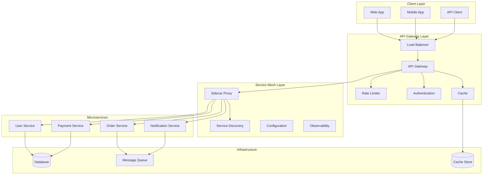

# API Gateway and Service Mesh Patterns - Comprehensive Guide

## 🎯 Overview

This comprehensive guide covers API Gateway patterns, Service Mesh architectures, and microservices communication patterns. Essential for building scalable, secure, and maintainable distributed systems.

## 📊 Architecture Overview



## 🔧 API Gateway Implementation

### 1. Core API Gateway

#### Gateway Server
```go
type APIGateway struct {
    server         *http.Server
    routes         map[string]*Route
    middleware     []Middleware
    rateLimiter    RateLimiter
    authService    AuthService
    serviceDiscovery ServiceDiscovery
    circuitBreaker CircuitBreaker
    metrics        MetricsCollector
}

type Route struct {
    Path        string
    Methods     []string
    Service     string
    Middleware  []Middleware
    RateLimit   *RateLimit
    Auth        bool
    Cache       *CacheConfig
}

func NewAPIGateway(config GatewayConfig) *APIGateway {
    gateway := &APIGateway{
        routes:         make(map[string]*Route),
        middleware:     make([]Middleware, 0),
        rateLimiter:    NewRateLimiter(config.RateLimit),
        authService:    NewAuthService(config.Auth),
        serviceDiscovery: NewServiceDiscovery(config.ServiceDiscovery),
        circuitBreaker: NewCircuitBreaker(config.CircuitBreaker),
        metrics:        NewMetricsCollector(),
    }
    
    // Setup routes
    gateway.setupRoutes()
    
    // Setup middleware
    gateway.setupMiddleware()
    
    // Setup server
    gateway.server = &http.Server{
        Addr:    config.Addr,
        Handler: gateway,
    }
    
    return gateway
}

func (gw *APIGateway) ServeHTTP(w http.ResponseWriter, r *http.Request) {
    // Start request timer
    start := time.Now()
    defer func() {
        duration := time.Since(start)
        gw.metrics.RecordRequestDuration(r.URL.Path, r.Method, duration)
    }()
    
    // Find route
    route := gw.findRoute(r.URL.Path, r.Method)
    if route == nil {
        http.NotFound(w, r)
        return
    }
    
    // Create request context
    ctx := &RequestContext{
        Request:  r,
        Response: w,
        Route:    route,
        StartTime: start,
    }
    
    // Execute middleware chain
    if err := gw.executeMiddleware(ctx); err != nil {
        gw.handleError(w, err)
        return
    }
    
    // Forward request to service
    if err := gw.forwardRequest(ctx); err != nil {
        gw.handleError(w, err)
        return
    }
}

func (gw *APIGateway) findRoute(path string, method string) *Route {
    for pattern, route := range gw.routes {
        if matched, _ := regexp.MatchString(pattern, path); matched {
            for _, m := range route.Methods {
                if m == method || m == "*" {
                    return route
                }
            }
        }
    }
    return nil
}
```

#### Request Forwarding
```go
func (gw *APIGateway) forwardRequest(ctx *RequestContext) error {
    // Get service instance
    service, err := gw.serviceDiscovery.GetService(ctx.Route.Service)
    if err != nil {
        return err
    }
    
    // Check circuit breaker
    if !gw.circuitBreaker.Allow(service.Name) {
        return errors.New("circuit breaker open")
    }
    
    // Create request
    req, err := gw.createRequest(ctx, service)
    if err != nil {
        return err
    }
    
    // Execute request
    resp, err := gw.executeRequest(req)
    if err != nil {
        gw.circuitBreaker.RecordFailure(service.Name)
        return err
    }
    
    gw.circuitBreaker.RecordSuccess(service.Name)
    
    // Process response
    return gw.processResponse(ctx, resp)
}

func (gw *APIGateway) createRequest(ctx *RequestContext, service *Service) (*http.Request, error) {
    // Build target URL
    targetURL := fmt.Sprintf("http://%s:%d%s", service.Host, service.Port, ctx.Request.URL.Path)
    
    // Create request
    req, err := http.NewRequest(ctx.Request.Method, targetURL, ctx.Request.Body)
    if err != nil {
        return nil, err
    }
    
    // Copy headers
    for key, values := range ctx.Request.Header {
        for _, value := range values {
            req.Header.Add(key, value)
        }
    }
    
    // Add gateway headers
    req.Header.Set("X-Gateway-Request-ID", generateRequestID())
    req.Header.Set("X-Forwarded-For", ctx.Request.RemoteAddr)
    
    return req, nil
}

func (gw *APIGateway) executeRequest(req *http.Request) (*http.Response, error) {
    client := &http.Client{
        Timeout: 30 * time.Second,
    }
    
    return client.Do(req)
}
```

### 2. Rate Limiting

#### Token Bucket Rate Limiter
```go
type TokenBucketRateLimiter struct {
    buckets map[string]*TokenBucket
    mutex   sync.RWMutex
}

type TokenBucket struct {
    capacity    int
    tokens      int
    refillRate  int
    lastRefill  time.Time
    mutex       sync.Mutex
}

func NewTokenBucketRateLimiter() *TokenBucketRateLimiter {
    return &TokenBucketRateLimiter{
        buckets: make(map[string]*TokenBucket),
    }
}

func (rl *TokenBucketRateLimiter) Allow(key string, limit int, window time.Duration) bool {
    rl.mutex.Lock()
    defer rl.mutex.Unlock()
    
    bucket, exists := rl.buckets[key]
    if !exists {
        bucket = &TokenBucket{
            capacity:   limit,
            tokens:     limit,
            refillRate: limit / int(window.Seconds()),
            lastRefill: time.Now(),
        }
        rl.buckets[key] = bucket
    }
    
    return bucket.allow()
}

func (tb *TokenBucket) allow() bool {
    tb.mutex.Lock()
    defer tb.mutex.Unlock()
    
    // Refill tokens
    now := time.Now()
    elapsed := now.Sub(tb.lastRefill)
    tokensToAdd := int(elapsed.Seconds()) * tb.refillRate
    
    if tokensToAdd > 0 {
        tb.tokens = min(tb.capacity, tb.tokens+tokensToAdd)
        tb.lastRefill = now
    }
    
    // Check if tokens available
    if tb.tokens > 0 {
        tb.tokens--
        return true
    }
    
    return false
}
```

#### Sliding Window Rate Limiter
```go
type SlidingWindowRateLimiter struct {
    windows map[string]*SlidingWindow
    mutex   sync.RWMutex
}

type SlidingWindow struct {
    requests []time.Time
    limit    int
    window   time.Duration
    mutex    sync.Mutex
}

func NewSlidingWindowRateLimiter() *SlidingWindowRateLimiter {
    return &SlidingWindowRateLimiter{
        windows: make(map[string]*SlidingWindow),
    }
}

func (rl *SlidingWindowRateLimiter) Allow(key string, limit int, window time.Duration) bool {
    rl.mutex.Lock()
    defer rl.mutex.Unlock()
    
    sw, exists := rl.windows[key]
    if !exists {
        sw = &SlidingWindow{
            requests: make([]time.Time, 0),
            limit:    limit,
            window:   window,
        }
        rl.windows[key] = sw
    }
    
    return sw.allow()
}

func (sw *SlidingWindow) allow() bool {
    sw.mutex.Lock()
    defer sw.mutex.Unlock()
    
    now := time.Now()
    cutoff := now.Add(-sw.window)
    
    // Remove old requests
    var validRequests []time.Time
    for _, req := range sw.requests {
        if req.After(cutoff) {
            validRequests = append(validRequests, req)
        }
    }
    sw.requests = validRequests
    
    // Check if under limit
    if len(sw.requests) < sw.limit {
        sw.requests = append(sw.requests, now)
        return true
    }
    
    return false
}
```

### 3. Authentication & Authorization

#### JWT Authentication
```go
type JWTAuthService struct {
    secretKey []byte
    issuer    string
    expiry    time.Duration
}

func NewJWTAuthService(secretKey string, issuer string, expiry time.Duration) *JWTAuthService {
    return &JWTAuthService{
        secretKey: []byte(secretKey),
        issuer:    issuer,
        expiry:    expiry,
    }
}

func (auth *JWTAuthService) GenerateToken(userID string, roles []string) (string, error) {
    claims := jwt.MapClaims{
        "user_id": userID,
        "roles":   roles,
        "iss":     auth.issuer,
        "exp":     time.Now().Add(auth.expiry).Unix(),
        "iat":     time.Now().Unix(),
    }
    
    token := jwt.NewWithClaims(jwt.SigningMethodHS256, claims)
    return token.SignedString(auth.secretKey)
}

func (auth *JWTAuthService) ValidateToken(tokenString string) (*Claims, error) {
    token, err := jwt.Parse(tokenString, func(token *jwt.Token) (interface{}, error) {
        if _, ok := token.Method.(*jwt.SigningMethodHMAC); !ok {
            return nil, fmt.Errorf("unexpected signing method: %v", token.Header["alg"])
        }
        return auth.secretKey, nil
    })
    
    if err != nil {
        return nil, err
    }
    
    if claims, ok := token.Claims.(jwt.MapClaims); ok && token.Valid {
        return &Claims{
            UserID: claims["user_id"].(string),
            Roles:  claims["roles"].([]string),
        }, nil
    }
    
    return nil, errors.New("invalid token")
}

type Claims struct {
    UserID string
    Roles  []string
}
```

#### RBAC Authorization
```go
type RBACAuthorizer struct {
    permissions map[string][]string
    roles       map[string][]string
}

func NewRBACAuthorizer() *RBACAuthorizer {
    return &RBACAuthorizer{
        permissions: make(map[string][]string),
        roles:       make(map[string][]string),
    }
}

func (rbac *RBACAuthorizer) AddRole(role string, permissions []string) {
    rbac.roles[role] = permissions
}

func (rbac *RBACAuthorizer) Authorize(userRoles []string, resource string, action string) bool {
    for _, role := range userRoles {
        permissions, exists := rbac.roles[role]
        if !exists {
            continue
        }
        
        for _, permission := range permissions {
            if permission == fmt.Sprintf("%s:%s", resource, action) {
                return true
            }
        }
    }
    
    return false
}
```

### 4. Caching

#### Redis Cache Implementation
```go
type RedisCache struct {
    client *redis.Client
    ttl    time.Duration
}

func NewRedisCache(addr string, password string, ttl time.Duration) *RedisCache {
    client := redis.NewClient(&redis.Options{
        Addr:     addr,
        Password: password,
        DB:       0,
    })
    
    return &RedisCache{
        client: client,
        ttl:    ttl,
    }
}

func (rc *RedisCache) Get(key string) ([]byte, error) {
    return rc.client.Get(key).Bytes()
}

func (rc *RedisCache) Set(key string, value []byte) error {
    return rc.client.Set(key, value, rc.ttl).Err()
}

func (rc *RedisCache) Delete(key string) error {
    return rc.client.Del(key).Err()
}

func (rc *RedisCache) GetOrSet(key string, fn func() ([]byte, error)) ([]byte, error) {
    // Try to get from cache
    value, err := rc.Get(key)
    if err == nil {
        return value, nil
    }
    
    // Generate value
    value, err = fn()
    if err != nil {
        return nil, err
    }
    
    // Set in cache
    rc.Set(key, value)
    
    return value, nil
}
```

## 🔧 Service Mesh Implementation

### 1. Sidecar Proxy

#### Envoy Proxy Configuration
```go
type EnvoyProxy struct {
    config     *EnvoyConfig
    xdsServer  XDSServer
    stats      StatsCollector
}

type EnvoyConfig struct {
    Listeners []Listener
    Clusters  []Cluster
    Routes    []Route
}

type Listener struct {
    Name    string
    Address string
    Port    int
    Filters []Filter
}

type Cluster struct {
    Name      string
    Type      string
    Endpoints []Endpoint
}

func (ep *EnvoyProxy) Start() error {
    // Load configuration
    config, err := ep.loadConfig()
    if err != nil {
        return err
    }
    
    // Start XDS server
    go ep.xdsServer.Start()
    
    // Start proxy
    return ep.startProxy(config)
}

func (ep *EnvoyProxy) UpdateConfig(config *EnvoyConfig) error {
    // Validate configuration
    if err := ep.validateConfig(config); err != nil {
        return err
    }
    
    // Update via XDS
    return ep.xdsServer.UpdateConfig(config)
}
```

### 2. Service Discovery

#### Consul Service Discovery
```go
type ConsulServiceDiscovery struct {
    client *consul.Client
    config *consul.Config
}

func NewConsulServiceDiscovery(addr string) (*ConsulServiceDiscovery, error) {
    config := consul.DefaultConfig()
    config.Address = addr
    
    client, err := consul.NewClient(config)
    if err != nil {
        return nil, err
    }
    
    return &ConsulServiceDiscovery{
        client: client,
        config: config,
    }, nil
}

func (csd *ConsulServiceDiscovery) RegisterService(service *Service) error {
    registration := &consul.AgentServiceRegistration{
        ID:      service.ID,
        Name:    service.Name,
        Tags:    service.Tags,
        Port:    service.Port,
        Address: service.Address,
        Check: &consul.AgentServiceCheck{
            HTTP:                           fmt.Sprintf("http://%s:%d/health", service.Address, service.Port),
            Timeout:                        "3s",
            Interval:                       "10s",
            DeregisterCriticalServiceAfter: "30s",
        },
    }
    
    return csd.client.Agent().ServiceRegister(registration)
}

func (csd *ConsulServiceDiscovery) GetService(name string) (*Service, error) {
    services, _, err := csd.client.Health().Service(name, "", true, nil)
    if err != nil {
        return nil, err
    }
    
    if len(services) == 0 {
        return nil, fmt.Errorf("no healthy services found for %s", name)
    }
    
    service := services[0].Service
    return &Service{
        ID:      service.ID,
        Name:    service.Service,
        Address: service.Address,
        Port:    service.Port,
        Tags:    service.Tags,
    }, nil
}

func (csd *ConsulServiceDiscovery) WatchService(name string, callback func(*Service)) error {
    queryOptions := &consul.QueryOptions{
        WaitIndex: 0,
    }
    
    go func() {
        for {
            services, meta, err := csd.client.Health().Service(name, "", true, queryOptions)
            if err != nil {
                log.Printf("Error watching service: %v", err)
                time.Sleep(5 * time.Second)
                continue
            }
            
            queryOptions.WaitIndex = meta.LastIndex
            
            if len(services) > 0 {
                service := services[0].Service
                callback(&Service{
                    ID:      service.ID,
                    Name:    service.Service,
                    Address: service.Address,
                    Port:    service.Port,
                    Tags:    service.Tags,
                })
            }
        }
    }()
    
    return nil
}
```

### 3. Circuit Breaker

#### Circuit Breaker Implementation
```go
type CircuitBreaker struct {
    name          string
    maxRequests   uint32
    interval      time.Duration
    timeout       time.Duration
    readyToTrip   func(counts Counts) bool
    onStateChange func(name string, from State, to State)
    
    mutex      sync.Mutex
    state      State
    generation uint64
    counts     Counts
    expiry     time.Time
}

type State int

const (
    StateClosed State = iota
    StateHalfOpen
    StateOpen
)

type Counts struct {
    Requests             uint32
    TotalSuccesses       uint32
    TotalFailures        uint32
    ConsecutiveSuccesses uint32
    ConsecutiveFailures  uint32
}

func NewCircuitBreaker(name string, maxRequests uint32, interval time.Duration, timeout time.Duration) *CircuitBreaker {
    return &CircuitBreaker{
        name:        name,
        maxRequests: maxRequests,
        interval:    interval,
        timeout:     timeout,
        readyToTrip: func(counts Counts) bool {
            return counts.ConsecutiveFailures >= 5
        },
        state: StateClosed,
    }
}

func (cb *CircuitBreaker) Allow() bool {
    cb.mutex.Lock()
    defer cb.mutex.Unlock()
    
    now := time.Now()
    state, generation := cb.currentState(now)
    
    if state == StateOpen {
        if now.After(cb.expiry) {
            cb.setState(StateHalfOpen, now)
            return true
        }
        return false
    }
    
    if state == StateHalfOpen {
        if cb.counts.Requests >= cb.maxRequests {
            return false
        }
    }
    
    cb.counts.onRequest()
    return true
}

func (cb *CircuitBreaker) RecordSuccess() {
    cb.mutex.Lock()
    defer cb.mutex.Unlock()
    
    cb.counts.onSuccess()
    cb.onStateChange(cb.name, cb.state, cb.state)
}

func (cb *CircuitBreaker) RecordFailure() {
    cb.mutex.Lock()
    defer cb.mutex.Unlock()
    
    cb.counts.onFailure()
    cb.onStateChange(cb.name, cb.state, cb.state)
}
```

### 4. Load Balancing

#### Load Balancer Implementation
```go
type LoadBalancer struct {
    services map[string][]*Service
    strategy LoadBalanceStrategy
    mutex    sync.RWMutex
}

type LoadBalanceStrategy interface {
    Select(services []*Service) *Service
}

type RoundRobinStrategy struct {
    current int
    mutex   sync.Mutex
}

func (rr *RoundRobinStrategy) Select(services []*Service) *Service {
    if len(services) == 0 {
        return nil
    }
    
    rr.mutex.Lock()
    defer rr.mutex.Unlock()
    
    service := services[rr.current]
    rr.current = (rr.current + 1) % len(services)
    
    return service
}

type LeastConnectionsStrategy struct{}

func (lc *LeastConnectionsStrategy) Select(services []*Service) *Service {
    if len(services) == 0 {
        return nil
    }
    
    var selected *Service
    minConnections := int(^uint(0) >> 1) // Max int
    
    for _, service := range services {
        if service.ActiveConnections < minConnections {
            minConnections = service.ActiveConnections
            selected = service
        }
    }
    
    return selected
}

type WeightedRoundRobinStrategy struct {
    weights map[string]int
    current map[string]int
    mutex   sync.Mutex
}

func (wrr *WeightedRoundRobinStrategy) Select(services []*Service) *Service {
    if len(services) == 0 {
        return nil
    }
    
    wrr.mutex.Lock()
    defer wrr.mutex.Unlock()
    
    var selected *Service
    maxWeight := 0
    
    for _, service := range services {
        weight := wrr.weights[service.ID]
        current := wrr.current[service.ID]
        
        if current+weight > maxWeight {
            maxWeight = current + weight
            selected = service
        }
    }
    
    if selected != nil {
        wrr.current[selected.ID] += wrr.weights[selected.ID]
    }
    
    return selected
}
```

## 📊 Observability

### 1. Metrics Collection

#### Prometheus Metrics
```go
type MetricsCollector struct {
    requestDuration *prometheus.HistogramVec
    requestCount    *prometheus.CounterVec
    activeRequests  prometheus.Gauge
    errorRate       *prometheus.CounterVec
}

func NewMetricsCollector() *MetricsCollector {
    return &MetricsCollector{
        requestDuration: prometheus.NewHistogramVec(
            prometheus.HistogramOpts{
                Name: "http_request_duration_seconds",
                Help: "HTTP request duration in seconds",
            },
            []string{"method", "path", "status"},
        ),
        requestCount: prometheus.NewCounterVec(
            prometheus.CounterOpts{
                Name: "http_requests_total",
                Help: "Total number of HTTP requests",
            },
            []string{"method", "path", "status"},
        ),
        activeRequests: prometheus.NewGauge(
            prometheus.GaugeOpts{
                Name: "http_active_requests",
                Help: "Number of active HTTP requests",
            },
        ),
        errorRate: prometheus.NewCounterVec(
            prometheus.CounterOpts{
                Name: "http_errors_total",
                Help: "Total number of HTTP errors",
            },
            []string{"method", "path", "error_type"},
        ),
    }
}

func (mc *MetricsCollector) RecordRequest(method, path, status string, duration time.Duration) {
    mc.requestDuration.WithLabelValues(method, path, status).Observe(duration.Seconds())
    mc.requestCount.WithLabelValues(method, path, status).Inc()
}

func (mc *MetricsCollector) RecordError(method, path, errorType string) {
    mc.errorRate.WithLabelValues(method, path, errorType).Inc()
}
```

### 2. Distributed Tracing

#### Jaeger Tracing
```go
type TracingService struct {
    tracer opentracing.Tracer
    closer io.Closer
}

func NewTracingService(serviceName string) (*TracingService, error) {
    cfg := jaegercfg.Configuration{
        ServiceName: serviceName,
        Sampler: &jaegercfg.SamplerConfig{
            Type:  jaeger.SamplerTypeConst,
            Param: 1,
        },
        Reporter: &jaegercfg.ReporterConfig{
            LogSpans: true,
        },
    }
    
    tracer, closer, err := cfg.NewTracer()
    if err != nil {
        return nil, err
    }
    
    return &TracingService{
        tracer: tracer,
        closer: closer,
    }, nil
}

func (ts *TracingService) StartSpan(operationName string) opentracing.Span {
    return ts.tracer.StartSpan(operationName)
}

func (ts *TracingService) StartSpanFromContext(ctx context.Context, operationName string) (opentracing.Span, context.Context) {
    return opentracing.StartSpanFromContext(ctx, operationName)
}
```

## 🔍 Key Technical Challenges

### 1. Service Discovery
- **Problem**: Finding healthy service instances
- **Solution**: Health checks and service registry
- **Implementation**: Consul with health monitoring

### 2. Load Balancing
- **Problem**: Distributing load evenly
- **Solution**: Multiple strategies (round-robin, least connections)
- **Implementation**: Weighted algorithms with health checks

### 3. Circuit Breaking
- **Problem**: Preventing cascade failures
- **Solution**: Circuit breaker pattern
- **Implementation**: State machine with configurable thresholds

### 4. Observability
- **Problem**: Monitoring distributed systems
- **Solution**: Metrics, logging, and tracing
- **Implementation**: Prometheus, ELK stack, Jaeger

## 📚 Interview Questions

### System Design Questions
1. How would you design an API Gateway?
2. How does service mesh work?
3. How would you implement service discovery?
4. How does circuit breaking prevent failures?
5. How would you handle API versioning?

### Technical Deep Dive
1. Explain the sidecar proxy pattern
2. How does load balancing work?
3. Describe the circuit breaker pattern
4. How does service mesh provide observability?
5. Explain API Gateway security features

## 🎯 Key Takeaways

1. **API Gateway**: Single entry point for microservices
2. **Service Mesh**: Infrastructure layer for service communication
3. **Service Discovery**: Dynamic service location
4. **Load Balancing**: Traffic distribution strategies
5. **Circuit Breaking**: Failure prevention and recovery
6. **Observability**: Monitoring, logging, and tracing
7. **Security**: Authentication, authorization, and encryption

## 🔗 Additional Resources

- [Envoy Proxy Documentation](https://www.envoyproxy.io/docs/)
- [Istio Service Mesh](https://istio.io/docs/)
- [Consul Service Discovery](https://www.consul.io/docs/)
- [API Gateway Patterns](https://microservices.io/patterns/apigateway.html)
- [Service Mesh Architecture](https://servicemesh.io/)
