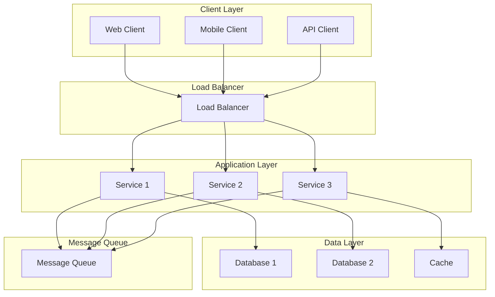
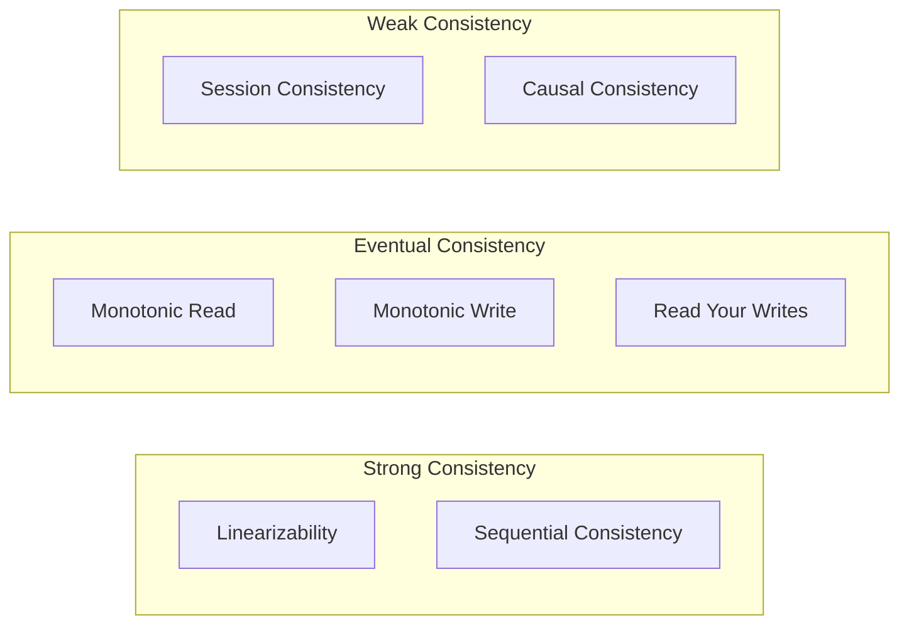
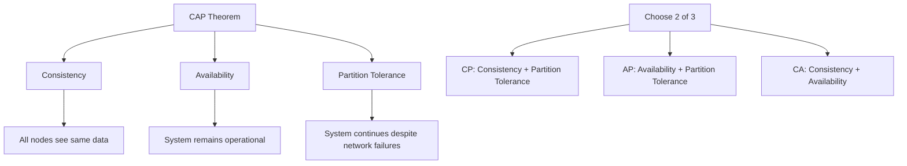

# 🌐 **Distributed Systems**

## 📘 **Theory**

Distributed systems are collections of independent computers that appear to users as a single coherent system. They enable scalability, fault tolerance, and resource sharing across multiple machines, making them essential for modern large-scale applications.

### **Why Distributed Systems Matter**

- **Scalability**: Scale horizontally across multiple machines
- **Fault Tolerance**: Continue operating despite individual component failures
- **Performance**: Distribute load and reduce latency
- **Resource Sharing**: Share resources across multiple applications
- **Geographic Distribution**: Serve users across different regions
- **Cost Efficiency**: Use commodity hardware instead of expensive mainframes
- **Availability**: Provide high availability through redundancy
- **Flexibility**: Add or remove components as needed

### **Key Concepts**

1. **Consistency**: Data consistency across distributed nodes
2. **Availability**: System availability despite failures
3. **Partition Tolerance**: System operation despite network partitions
4. **Replication**: Data replication across multiple nodes
5. **Sharding**: Data partitioning across multiple nodes
6. **Load Balancing**: Distributing load across multiple servers
7. **Service Discovery**: Finding and connecting to services
8. **Distributed Transactions**: Managing transactions across multiple nodes

### **Distributed System Challenges**

1. **Network Partitions**: Network failures that split the system
2. **Consistency vs Availability**: Trade-off between data consistency and availability
3. **Clock Synchronization**: Synchronizing clocks across distributed nodes
4. **Distributed Consensus**: Reaching agreement across distributed nodes
5. **Failure Detection**: Detecting and handling node failures
6. **Data Consistency**: Maintaining data consistency across replicas
7. **Security**: Securing communication and data across distributed nodes
8. **Monitoring**: Monitoring and debugging distributed systems

### **Common Pitfalls and Best Practices**

- **Network Assumptions**: Don't assume reliable network communication
- **Clock Dependencies**: Avoid relying on synchronized clocks
- **Single Points of Failure**: Design for fault tolerance
- **Data Consistency**: Choose appropriate consistency models
- **Monitoring**: Implement comprehensive monitoring and logging
- **Testing**: Test for network failures and partitions
- **Documentation**: Document system architecture and behavior
- **Security**: Implement proper security measures

## 📊 **Diagrams**

### **Distributed System Architecture**



### **Consistency Models**



### **CAP Theorem**



## 🧩 **Example**

**Scenario**: Design a distributed e-commerce system

**Input**:

- High traffic e-commerce platform
- Multiple services (User, Product, Order, Payment)
- Global user base
- High availability requirements

**Expected Output**:

- Distributed system architecture
- Service communication patterns
- Data consistency strategy
- Fault tolerance mechanisms
- Scalability approach

**Step-by-step**:

1. Design service architecture
2. Plan data partitioning and replication
3. Implement service communication
4. Add fault tolerance mechanisms
5. Implement monitoring and logging
6. Test and optimize performance

## 💻 **Implementation (Golang)**

```go
package main

import (
    "context"
    "encoding/json"
    "fmt"
    "log"
    "net/http"
    "sync"
    "time"

    "github.com/gorilla/mux"
    "github.com/patrickmn/go-cache"
)

// DistributedSystem represents a distributed system
type DistributedSystem struct {
    nodes      map[string]*Node
    services   map[string]*Service
    registry   *ServiceRegistry
    loadBalancer *LoadBalancer
    cache      *cache.Cache
    mutex      sync.RWMutex
}

// Node represents a node in the distributed system
type Node struct {
    ID          string
    Address     string
    Status      string
    LastSeen    time.Time
    Services    []string
    Load        float64
    Region      string
}

// Service represents a service in the distributed system
type Service struct {
    ID          string
    Name        string
    Version     string
    Endpoints   []string
    Dependencies []string
    HealthCheck string
    Replicas    int
    Status      string
}

// ServiceRegistry manages service discovery
type ServiceRegistry struct {
    services map[string][]*Service
    nodes    map[string]*Node
    mutex    sync.RWMutex
}

// LoadBalancer distributes load across services
type LoadBalancer struct {
    strategy string
    services map[string][]*Service
    mutex    sync.RWMutex
}

// NewDistributedSystem creates a new distributed system
func NewDistributedSystem() *DistributedSystem {
    return &DistributedSystem{
        nodes:        make(map[string]*Node),
        services:     make(map[string]*Service),
        registry:     NewServiceRegistry(),
        loadBalancer: NewLoadBalancer("round_robin"),
        cache:        cache.New(5*time.Minute, 10*time.Minute),
    }
}

// AddNode adds a node to the distributed system
func (ds *DistributedSystem) AddNode(node *Node) {
    ds.mutex.Lock()
    defer ds.mutex.Unlock()

    node.Status = "active"
    node.LastSeen = time.Now()
    ds.nodes[node.ID] = node

    // Register services on this node
    for _, serviceID := range node.Services {
        if service, exists := ds.services[serviceID]; exists {
            ds.registry.RegisterService(service, node)
        }
    }
}

// AddService adds a service to the distributed system
func (ds *DistributedSystem) AddService(service *Service) {
    ds.mutex.Lock()
    defer ds.mutex.Unlock()

    service.Status = "active"
    ds.services[service.ID] = service
}

// RegisterService registers a service with a node
func (ds *DistributedSystem) RegisterService(serviceID, nodeID string) error {
    ds.mutex.Lock()
    defer ds.mutex.Unlock()

    service, exists := ds.services[serviceID]
    if !exists {
        return fmt.Errorf("service not found: %s", serviceID)
    }

    node, exists := ds.nodes[nodeID]
    if !exists {
        return fmt.Errorf("node not found: %s", nodeID)
    }

    return ds.registry.RegisterService(service, node)
}

// DiscoverService discovers services by name
func (ds *DistributedSystem) DiscoverService(serviceName string) ([]*Service, error) {
    ds.mutex.RLock()
    defer ds.mutex.RUnlock()

    return ds.registry.DiscoverService(serviceName)
}

// LoadBalance distributes load across service instances
func (ds *DistributedSystem) LoadBalance(serviceName string) (*Service, error) {
    ds.mutex.RLock()
    defer ds.mutex.RUnlock()

    return ds.loadBalancer.Balance(serviceName)
}

// HealthCheck checks the health of all services
func (ds *DistributedSystem) HealthCheck() map[string]string {
    ds.mutex.RLock()
    defer ds.mutex.RUnlock()

    health := make(map[string]string)

    for _, node := range ds.nodes {
        if time.Since(node.LastSeen) > 30*time.Second {
            health[node.ID] = "unhealthy"
        } else {
            health[node.ID] = "healthy"
        }
    }

    for _, service := range ds.services {
        if service.Status == "active" {
            health[service.ID] = "healthy"
        } else {
            health[service.ID] = "unhealthy"
        }
    }

    return health
}

// NewServiceRegistry creates a new service registry
func NewServiceRegistry() *ServiceRegistry {
    return &ServiceRegistry{
        services: make(map[string][]*Service),
        nodes:    make(map[string]*Node),
    }
}

// RegisterService registers a service with a node
func (sr *ServiceRegistry) RegisterService(service *Service, node *Node) error {
    sr.mutex.Lock()
    defer sr.mutex.Unlock()

    // Add service to registry
    sr.services[service.Name] = append(sr.services[service.Name], service)

    // Add node to registry
    sr.nodes[node.ID] = node

    return nil
}

// DiscoverService discovers services by name
func (sr *ServiceRegistry) DiscoverService(serviceName string) ([]*Service, error) {
    sr.mutex.RLock()
    defer sr.mutex.RUnlock()

    services, exists := sr.services[serviceName]
    if !exists {
        return nil, fmt.Errorf("service not found: %s", serviceName)
    }

    return services, nil
}

// NewLoadBalancer creates a new load balancer
func NewLoadBalancer(strategy string) *LoadBalancer {
    return &LoadBalancer{
        strategy: strategy,
        services: make(map[string][]*Service),
    }
}

// Balance distributes load across service instances
func (lb *LoadBalancer) Balance(serviceName string) (*Service, error) {
    lb.mutex.RLock()
    defer lb.mutex.RUnlock()

    services, exists := lb.services[serviceName]
    if !exists || len(services) == 0 {
        return nil, fmt.Errorf("no services available: %s", serviceName)
    }

    switch lb.strategy {
    case "round_robin":
        return lb.roundRobin(services)
    case "least_connections":
        return lb.leastConnections(services)
    case "random":
        return lb.random(services)
    default:
        return lb.roundRobin(services)
    }
}

// roundRobin implements round-robin load balancing
func (lb *LoadBalancer) roundRobin(services []*Service) (*Service, error) {
    if len(services) == 0 {
        return nil, fmt.Errorf("no services available")
    }

    // Simple round-robin implementation
    index := time.Now().UnixNano() % int64(len(services))
    return services[index], nil
}

// leastConnections implements least connections load balancing
func (lb *LoadBalancer) leastConnections(services []*Service) (*Service, error) {
    if len(services) == 0 {
        return nil, fmt.Errorf("no services available")
    }

    // Simple least connections implementation
    // In practice, you'd track actual connection counts
    return services[0], nil
}

// random implements random load balancing
func (lb *LoadBalancer) random(services []*Service) (*Service, error) {
    if len(services) == 0 {
        return nil, fmt.Errorf("no services available")
    }

    index := time.Now().UnixNano() % int64(len(services))
    return services[index], nil
}

// DistributedCache represents a distributed cache
type DistributedCache struct {
    nodes   map[string]*CacheNode
    mutex   sync.RWMutex
    replicas int
}

// CacheNode represents a cache node
type CacheNode struct {
    ID      string
    Address string
    Cache   *cache.Cache
    Status  string
}

// NewDistributedCache creates a new distributed cache
func NewDistributedCache(replicas int) *DistributedCache {
    return &DistributedCache{
        nodes:    make(map[string]*CacheNode),
        replicas: replicas,
    }
}

// AddNode adds a cache node
func (dc *DistributedCache) AddNode(nodeID, address string) {
    dc.mutex.Lock()
    defer dc.mutex.Unlock()

    dc.nodes[nodeID] = &CacheNode{
        ID:      nodeID,
        Address: address,
        Cache:   cache.New(5*time.Minute, 10*time.Minute),
        Status:  "active",
    }
}

// Set sets a value in the distributed cache
func (dc *DistributedCache) Set(key string, value interface{}, expiration time.Duration) error {
    dc.mutex.RLock()
    defer dc.mutex.RUnlock()

    // Set value on all nodes for consistency
    for _, node := range dc.nodes {
        if node.Status == "active" {
            node.Cache.Set(key, value, expiration)
        }
    }

    return nil
}

// Get gets a value from the distributed cache
func (dc *DistributedCache) Get(key string) (interface{}, bool) {
    dc.mutex.RLock()
    defer dc.mutex.RUnlock()

    // Try to get value from any active node
    for _, node := range dc.nodes {
        if node.Status == "active" {
            if value, found := node.Cache.Get(key); found {
                return value, true
            }
        }
    }

    return nil, false
}

// DistributedLock represents a distributed lock
type DistributedLock struct {
    key      string
    value    string
    ttl      time.Duration
    acquired bool
    mutex    sync.Mutex
}

// NewDistributedLock creates a new distributed lock
func NewDistributedLock(key, value string, ttl time.Duration) *DistributedLock {
    return &DistributedLock{
        key:   key,
        value: value,
        ttl:   ttl,
    }
}

// Acquire acquires the distributed lock
func (dl *DistributedLock) Acquire() bool {
    dl.mutex.Lock()
    defer dl.mutex.Unlock()

    // Simple implementation - in practice, use Redis or etcd
    dl.acquired = true
    return true
}

// Release releases the distributed lock
func (dl *DistributedLock) Release() {
    dl.mutex.Lock()
    defer dl.mutex.Unlock()

    dl.acquired = false
}

// IsAcquired checks if the lock is acquired
func (dl *DistributedLock) IsAcquired() bool {
    dl.mutex.Lock()
    defer dl.mutex.Unlock()

    return dl.acquired
}

// Example usage
func main() {
    // Create distributed system
    ds := NewDistributedSystem()

    // Create services
    userService := &Service{
        ID:          "user-service-1",
        Name:        "user-service",
        Version:     "1.0.0",
        Endpoints:   []string{"/users", "/auth"},
        Dependencies: []string{},
        HealthCheck: "/health",
        Replicas:    3,
    }

    orderService := &Service{
        ID:          "order-service-1",
        Name:        "order-service",
        Version:     "1.0.0",
        Endpoints:   []string{"/orders", "/payments"},
        Dependencies: []string{"user-service"},
        HealthCheck: "/health",
        Replicas:    2,
    }

    // Add services to system
    ds.AddService(userService)
    ds.AddService(orderService)

    // Create nodes
    node1 := &Node{
        ID:       "node-1",
        Address:  "192.168.1.10:8080",
        Services: []string{"user-service-1"},
        Region:   "us-east-1",
    }

    node2 := &Node{
        ID:       "node-2",
        Address:  "192.168.1.11:8080",
        Services: []string{"order-service-1"},
        Region:   "us-east-1",
    }

    // Add nodes to system
    ds.AddNode(node1)
    ds.AddNode(node2)

    // Register services with nodes
    ds.RegisterService("user-service-1", "node-1")
    ds.RegisterService("order-service-1", "node-2")

    // Discover services
    services, err := ds.DiscoverService("user-service")
    if err != nil {
        log.Fatal(err)
    }

    fmt.Printf("Discovered %d user services\n", len(services))

    // Load balance
    service, err := ds.LoadBalance("user-service")
    if err != nil {
        log.Fatal(err)
    }

    fmt.Printf("Selected service: %s\n", service.ID)

    // Health check
    health := ds.HealthCheck()
    fmt.Printf("System health: %+v\n", health)

    // Create distributed cache
    cache := NewDistributedCache(3)
    cache.AddNode("cache-1", "192.168.1.20:6379")
    cache.AddNode("cache-2", "192.168.1.21:6379")
    cache.AddNode("cache-3", "192.168.1.22:6379")

    // Use distributed cache
    cache.Set("user:123", map[string]interface{}{
        "id":   123,
        "name": "John Doe",
        "email": "john@example.com",
    }, 5*time.Minute)

    if value, found := cache.Get("user:123"); found {
        fmt.Printf("Cached value: %+v\n", value)
    }

    // Create distributed lock
    lock := NewDistributedLock("resource:123", "node-1", 30*time.Second)

    if lock.Acquire() {
        fmt.Println("Lock acquired successfully")

        // Simulate work
        time.Sleep(1 * time.Second)

        lock.Release()
        fmt.Println("Lock released")
    }
}
```

## 💻 **Implementation (Node.js)**

```javascript
class Node {
  constructor(id, address, services = [], region = "us-east-1") {
    this.id = id;
    this.address = address;
    this.status = "active";
    this.lastSeen = new Date();
    this.services = services;
    this.load = 0;
    this.region = region;
  }
}

class Service {
  constructor(
    id,
    name,
    version,
    endpoints = [],
    dependencies = [],
    healthCheck = "/health",
    replicas = 1
  ) {
    this.id = id;
    this.name = name;
    this.version = version;
    this.endpoints = endpoints;
    this.dependencies = dependencies;
    this.healthCheck = healthCheck;
    this.replicas = replicas;
    this.status = "active";
  }
}

class ServiceRegistry {
  constructor() {
    this.services = new Map();
    this.nodes = new Map();
  }

  registerService(service, node) {
    if (!this.services.has(service.name)) {
      this.services.set(service.name, []);
    }

    this.services.get(service.name).push(service);
    this.nodes.set(node.id, node);
  }

  discoverService(serviceName) {
    const services = this.services.get(serviceName);
    if (!services || services.length === 0) {
      throw new Error(`Service not found: ${serviceName}`);
    }

    return services;
  }

  getNodes() {
    return Array.from(this.nodes.values());
  }

  getServices() {
    return Array.from(this.services.values()).flat();
  }
}

class LoadBalancer {
  constructor(strategy = "round_robin") {
    this.strategy = strategy;
    this.services = new Map();
    this.counters = new Map();
  }

  balance(serviceName, services) {
    if (!services || services.length === 0) {
      throw new Error(`No services available: ${serviceName}`);
    }

    switch (this.strategy) {
      case "round_robin":
        return this.roundRobin(serviceName, services);
      case "least_connections":
        return this.leastConnections(services);
      case "random":
        return this.random(services);
      default:
        return this.roundRobin(serviceName, services);
    }
  }

  roundRobin(serviceName, services) {
    if (!this.counters.has(serviceName)) {
      this.counters.set(serviceName, 0);
    }

    const counter = this.counters.get(serviceName);
    const index = counter % services.length;
    this.counters.set(serviceName, counter + 1);

    return services[index];
  }

  leastConnections(services) {
    // Simple implementation - in practice, track actual connection counts
    return services[0];
  }

  random(services) {
    const index = Math.floor(Math.random() * services.length);
    return services[index];
  }
}

class DistributedCache {
  constructor(replicas = 3) {
    this.nodes = new Map();
    this.replicas = replicas;
  }

  addNode(nodeId, address) {
    this.nodes.set(nodeId, {
      id: nodeId,
      address: address,
      cache: new Map(),
      status: "active",
    });
  }

  set(key, value, expiration = 300000) {
    // 5 minutes default
    const expirationTime = Date.now() + expiration;

    // Set value on all nodes for consistency
    for (const node of this.nodes.values()) {
      if (node.status === "active") {
        node.cache.set(key, {
          value,
          expiration: expirationTime,
        });
      }
    }
  }

  get(key) {
    // Try to get value from any active node
    for (const node of this.nodes.values()) {
      if (node.status === "active") {
        const cached = node.cache.get(key);
        if (cached && cached.expiration > Date.now()) {
          return cached.value;
        }
      }
    }

    return null;
  }

  delete(key) {
    // Delete value from all nodes
    for (const node of this.nodes.values()) {
      if (node.status === "active") {
        node.cache.delete(key);
      }
    }
  }
}

class DistributedLock {
  constructor(key, value, ttl = 30000) {
    // 30 seconds default
    this.key = key;
    this.value = value;
    this.ttl = ttl;
    this.acquired = false;
    this.expiration = 0;
  }

  acquire() {
    if (this.acquired) {
      return true;
    }

    // Simple implementation - in practice, use Redis or etcd
    this.acquired = true;
    this.expiration = Date.now() + this.ttl;

    // Auto-release after TTL
    setTimeout(() => {
      this.release();
    }, this.ttl);

    return true;
  }

  release() {
    this.acquired = false;
    this.expiration = 0;
  }

  isAcquired() {
    if (this.acquired && this.expiration > Date.now()) {
      return true;
    }

    if (this.acquired && this.expiration <= Date.now()) {
      this.release();
    }

    return false;
  }
}

class DistributedSystem {
  constructor() {
    this.nodes = new Map();
    this.services = new Map();
    this.registry = new ServiceRegistry();
    this.loadBalancer = new LoadBalancer("round_robin");
    this.cache = new DistributedCache(3);
  }

  addNode(node) {
    node.status = "active";
    node.lastSeen = new Date();
    this.nodes.set(node.id, node);

    // Register services on this node
    for (const serviceId of node.services) {
      const service = this.services.get(serviceId);
      if (service) {
        this.registry.registerService(service, node);
      }
    }
  }

  addService(service) {
    service.status = "active";
    this.services.set(service.id, service);
  }

  registerService(serviceId, nodeId) {
    const service = this.services.get(serviceId);
    if (!service) {
      throw new Error(`Service not found: ${serviceId}`);
    }

    const node = this.nodes.get(nodeId);
    if (!node) {
      throw new Error(`Node not found: ${nodeId}`);
    }

    this.registry.registerService(service, node);
  }

  discoverService(serviceName) {
    return this.registry.discoverService(serviceName);
  }

  loadBalance(serviceName) {
    const services = this.registry.discoverService(serviceName);
    return this.loadBalancer.balance(serviceName, services);
  }

  healthCheck() {
    const health = {};

    // Check node health
    for (const [nodeId, node] of this.nodes) {
      const timeSinceLastSeen = Date.now() - node.lastSeen.getTime();
      if (timeSinceLastSeen > 30000) {
        // 30 seconds
        health[nodeId] = "unhealthy";
      } else {
        health[nodeId] = "healthy";
      }
    }

    // Check service health
    for (const [serviceId, service] of this.services) {
      if (service.status === "active") {
        health[serviceId] = "healthy";
      } else {
        health[serviceId] = "unhealthy";
      }
    }

    return health;
  }
}

// Example usage
function main() {
  // Create distributed system
  const ds = new DistributedSystem();

  // Create services
  const userService = new Service(
    "user-service-1",
    "user-service",
    "1.0.0",
    ["/users", "/auth"],
    [],
    "/health",
    3
  );

  const orderService = new Service(
    "order-service-1",
    "order-service",
    "1.0.0",
    ["/orders", "/payments"],
    ["user-service"],
    "/health",
    2
  );

  // Add services to system
  ds.addService(userService);
  ds.addService(orderService);

  // Create nodes
  const node1 = new Node(
    "node-1",
    "192.168.1.10:8080",
    ["user-service-1"],
    "us-east-1"
  );
  const node2 = new Node(
    "node-2",
    "192.168.1.11:8080",
    ["order-service-1"],
    "us-east-1"
  );

  // Add nodes to system
  ds.addNode(node1);
  ds.addNode(node2);

  // Register services with nodes
  ds.registerService("user-service-1", "node-1");
  ds.registerService("order-service-1", "node-2");

  // Discover services
  try {
    const services = ds.discoverService("user-service");
    console.log(`Discovered ${services.length} user services`);
  } catch (error) {
    console.error("Service discovery failed:", error.message);
  }

  // Load balance
  try {
    const service = ds.loadBalance("user-service");
    console.log(`Selected service: ${service.id}`);
  } catch (error) {
    console.error("Load balancing failed:", error.message);
  }

  // Health check
  const health = ds.healthCheck();
  console.log("System health:", health);

  // Create distributed cache
  ds.cache.addNode("cache-1", "192.168.1.20:6379");
  ds.cache.addNode("cache-2", "192.168.1.21:6379");
  ds.cache.addNode("cache-3", "192.168.1.22:6379");

  // Use distributed cache
  ds.cache.set(
    "user:123",
    {
      id: 123,
      name: "John Doe",
      email: "john@example.com",
    },
    300000
  ); // 5 minutes

  const cachedValue = ds.cache.get("user:123");
  if (cachedValue) {
    console.log("Cached value:", cachedValue);
  }

  // Create distributed lock
  const lock = new DistributedLock("resource:123", "node-1", 30000);

  if (lock.acquire()) {
    console.log("Lock acquired successfully");

    // Simulate work
    setTimeout(() => {
      lock.release();
      console.log("Lock released");
    }, 1000);
  }
}

// Run the example
main();
```

## ⏱ **Complexity Analysis**

### **Time Complexity**

- **Service Discovery**: O(1) for direct lookup
- **Load Balancing**: O(1) for simple strategies
- **Health Check**: O(n) where n is number of nodes
- **Cache Operations**: O(1) for get/set operations
- **Lock Operations**: O(1) for acquire/release

### **Space Complexity**

- **Node Storage**: O(n) where n is number of nodes
- **Service Storage**: O(s) where s is number of services
- **Cache Storage**: O(c) where c is cache size
- **Registry Storage**: O(n + s) where n is nodes, s is services

## 🚀 **Optimal Solution**

The optimal distributed system solution includes:

1. **Service Discovery**: Implement efficient service discovery
2. **Load Balancing**: Use appropriate load balancing strategies
3. **Fault Tolerance**: Design for fault tolerance and recovery
4. **Consistency**: Choose appropriate consistency models
5. **Monitoring**: Implement comprehensive monitoring and logging
6. **Security**: Implement proper security measures
7. **Scalability**: Design for horizontal scaling
8. **Testing**: Test for network failures and partitions

### **Production Considerations**

- Use appropriate consistency models for your use case
- Implement proper fault tolerance and recovery mechanisms
- Use efficient service discovery and load balancing
- Implement comprehensive monitoring and logging
- Use appropriate security measures
- Test thoroughly for network failures and partitions
- Consider performance implications of distributed operations
- Use appropriate data partitioning and replication strategies

## ❓ **Follow-up Questions**

### **How would this scale with X?**

- **Large Scale**: Use advanced orchestration and management tools
- **Global Distribution**: Use edge computing and regional deployment
- **High Traffic**: Use efficient load balancing and caching strategies

### **How can we optimize further if Y changes?**

- **Performance Requirements**: Use optimized algorithms and data structures
- **Consistency Requirements**: Use appropriate consistency models
- **Availability Requirements**: Use redundancy and fault tolerance

### **What trade-offs exist in different approaches?**

- **Consistency vs Availability**: Strong consistency vs high availability
- **Performance vs Consistency**: Fast operations vs data consistency
- **Simplicity vs Features**: Simple implementation vs advanced features
