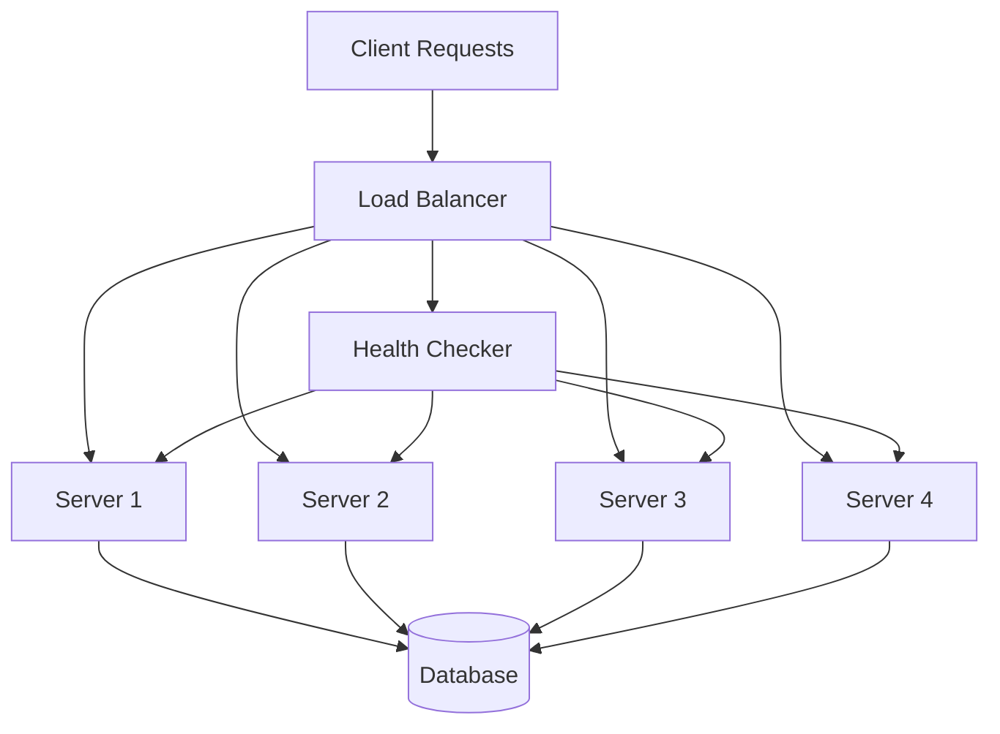
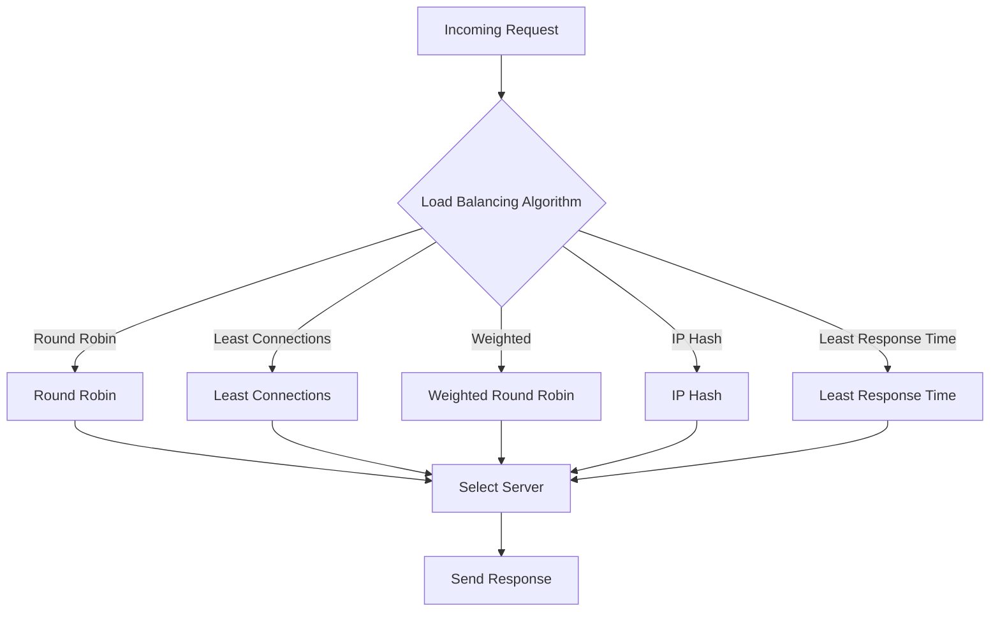

---
# Auto-generated front matter
Title: Load Balancing
LastUpdated: 2025-11-06T20:45:57.706373
Tags: []
Status: draft
---

# ⚖️ **Load Balancing**

## 📘 **Theory**

Load balancing is a critical component in distributed systems that distributes incoming network traffic across multiple servers to ensure high availability, reliability, and optimal resource utilization. It acts as a traffic director, ensuring no single server becomes overwhelmed while maintaining system performance.

### **Why Load Balancing Matters**

- **High Availability**: Prevents single points of failure
- **Scalability**: Allows horizontal scaling by adding more servers
- **Performance**: Distributes load evenly to prevent bottlenecks
- **Reliability**: Provides redundancy and fault tolerance
- **Resource Optimization**: Maximizes server utilization

### **Common Pitfalls and Best Practices**

- **Session Affinity**: Consider sticky sessions vs stateless design
- **Health Checks**: Implement proper health monitoring
- **Failover**: Plan for server failures and recovery
- **Monitoring**: Track performance metrics and bottlenecks
- **Security**: Implement proper authentication and rate limiting

## 📊 **Diagrams**

### **High-Level Architecture**



### **Load Balancing Algorithms Flow**



## 🧩 **Example**

**Scenario**: E-commerce website with 3 servers handling user requests

**Input**: 1000 concurrent requests
**Expected Output**: Requests distributed evenly across servers (333-334 requests each)

**Step-by-step**:

1. Load balancer receives request
2. Applies selected algorithm (e.g., Round Robin)
3. Selects target server
4. Forwards request to server
5. Server processes and returns response
6. Load balancer returns response to client

## 💻 **Implementation (Golang)**

```go
package main

import (
    "fmt"
    "math/rand"
    "sync"
    "time"
)

// LoadBalancer interface
type LoadBalancer interface {
    SelectServer() *Server
    AddServer(server *Server)
    RemoveServer(serverID string)
    GetServerCount() int
}

// Server represents a backend server
type Server struct {
    ID           string
    Address      string
    Weight       int
    ActiveConns  int
    ResponseTime time.Duration
    IsHealthy    bool
    mutex        sync.RWMutex
}

func (s *Server) UpdateConnections(delta int) {
    s.mutex.Lock()
    defer s.mutex.Unlock()
    s.ActiveConns += delta
}

func (s *Server) UpdateResponseTime(duration time.Duration) {
    s.mutex.Lock()
    defer s.mutex.Unlock()
    s.ResponseTime = duration
}

func (s *Server) SetHealth(healthy bool) {
    s.mutex.Lock()
    defer s.mutex.Unlock()
    s.IsHealthy = healthy
}

func (s *Server) GetActiveConnections() int {
    s.mutex.RLock()
    defer s.mutex.RUnlock()
    return s.ActiveConns
}

func (s *Server) GetResponseTime() time.Duration {
    s.mutex.RLock()
    defer s.mutex.RUnlock()
    return s.ResponseTime
}

func (s *Server) IsServerHealthy() bool {
    s.mutex.RLock()
    defer s.mutex.RUnlock()
    return s.IsHealthy
}

// Round Robin Load Balancer
type RoundRobinLB struct {
    servers []*Server
    current int
    mutex   sync.Mutex
}

func NewRoundRobinLB() *RoundRobinLB {
    return &RoundRobinLB{
        servers: make([]*Server, 0),
        current: 0,
    }
}

func (rr *RoundRobinLB) AddServer(server *Server) {
    rr.mutex.Lock()
    defer rr.mutex.Unlock()
    rr.servers = append(rr.servers, server)
}

func (rr *RoundRobinLB) RemoveServer(serverID string) {
    rr.mutex.Lock()
    defer rr.mutex.Unlock()

    for i, server := range rr.servers {
        if server.ID == serverID {
            rr.servers = append(rr.servers[:i], rr.servers[i+1:]...)
            break
        }
    }
}

func (rr *RoundRobinLB) SelectServer() *Server {
    rr.mutex.Lock()
    defer rr.mutex.Unlock()

    if len(rr.servers) == 0 {
        return nil
    }

    // Find next healthy server
    attempts := 0
    for attempts < len(rr.servers) {
        server := rr.servers[rr.current]
        rr.current = (rr.current + 1) % len(rr.servers)

        if server.IsServerHealthy() {
            return server
        }
        attempts++
    }

    return nil // No healthy servers
}

func (rr *RoundRobinLB) GetServerCount() int {
    rr.mutex.RLock()
    defer rr.mutex.RUnlock()
    return len(rr.servers)
}

// Least Connections Load Balancer
type LeastConnectionsLB struct {
    servers []*Server
    mutex   sync.RWMutex
}

func NewLeastConnectionsLB() *LeastConnectionsLB {
    return &LeastConnectionsLB{
        servers: make([]*Server, 0),
    }
}

func (lc *LeastConnectionsLB) AddServer(server *Server) {
    lc.mutex.Lock()
    defer lc.mutex.Unlock()
    lc.servers = append(lc.servers, server)
}

func (lc *LeastConnectionsLB) RemoveServer(serverID string) {
    lc.mutex.Lock()
    defer lc.mutex.Unlock()

    for i, server := range lc.servers {
        if server.ID == serverID {
            lc.servers = append(lc.servers[:i], lc.servers[i+1:]...)
            break
        }
    }
}

func (lc *LeastConnectionsLB) SelectServer() *Server {
    lc.mutex.RLock()
    defer lc.mutex.RUnlock()

    if len(lc.servers) == 0 {
        return nil
    }

    var selectedServer *Server
    minConns := int(^uint(0) >> 1) // Max int

    for _, server := range lc.servers {
        if !server.IsServerHealthy() {
            continue
        }

        conns := server.GetActiveConnections()
        if conns < minConns {
            minConns = conns
            selectedServer = server
        }
    }

    return selectedServer
}

func (lc *LeastConnectionsLB) GetServerCount() int {
    lc.mutex.RLock()
    defer lc.mutex.RUnlock()
    return len(lc.servers)
}

// Weighted Round Robin Load Balancer
type WeightedRoundRobinLB struct {
    servers    []*Server
    weights    []int
    current    int
    gcd        int
    maxWeight  int
    mutex      sync.Mutex
}

func NewWeightedRoundRobinLB() *WeightedRoundRobinLB {
    return &WeightedRoundRobinLB{
        servers: make([]*Server, 0),
        weights: make([]int, 0),
        current: 0,
    }
}

func (wrr *WeightedRoundRobinLB) AddServer(server *Server) {
    wrr.mutex.Lock()
    defer wrr.mutex.Unlock()

    wrr.servers = append(wrr.servers, server)
    wrr.weights = append(wrr.weights, server.Weight)
    wrr.updateGCD()
}

func (wrr *WeightedRoundRobinLB) RemoveServer(serverID string) {
    wrr.mutex.Lock()
    defer wrr.mutex.Unlock()

    for i, server := range wrr.servers {
        if server.ID == serverID {
            wrr.servers = append(wrr.servers[:i], wrr.servers[i+1:]...)
            wrr.weights = append(wrr.weights[:i], wrr.weights[i+1:]...)
            wrr.updateGCD()
            break
        }
    }
}

func (wrr *WeightedRoundRobinLB) updateGCD() {
    if len(wrr.weights) == 0 {
        return
    }

    wrr.gcd = wrr.weights[0]
    wrr.maxWeight = wrr.weights[0]

    for i := 1; i < len(wrr.weights); i++ {
        wrr.gcd = gcd(wrr.gcd, wrr.weights[i])
        if wrr.weights[i] > wrr.maxWeight {
            wrr.maxWeight = wrr.weights[i]
        }
    }
}

func gcd(a, b int) int {
    for b != 0 {
        a, b = b, a%b
    }
    return a
}

func (wrr *WeightedRoundRobinLB) SelectServer() *Server {
    wrr.mutex.Lock()
    defer wrr.mutex.Unlock()

    if len(wrr.servers) == 0 {
        return nil
    }

    for {
        wrr.current = (wrr.current + 1) % len(wrr.servers)

        if wrr.current == 0 {
            wrr.maxWeight -= wrr.gcd
            if wrr.maxWeight <= 0 {
                wrr.maxWeight = wrr.weights[0]
                for i := 1; i < len(wrr.weights); i++ {
                    if wrr.weights[i] > wrr.maxWeight {
                        wrr.maxWeight = wrr.weights[i]
                    }
                }
            }
        }

        server := wrr.servers[wrr.current]
        if server.IsServerHealthy() && wrr.weights[wrr.current] >= wrr.maxWeight {
            return server
        }
    }
}

func (wrr *WeightedRoundRobinLB) GetServerCount() int {
    wrr.mutex.RLock()
    defer wrr.mutex.RUnlock()
    return len(wrr.servers)
}

// IP Hash Load Balancer
type IPHashLB struct {
    servers []*Server
    mutex   sync.RWMutex
}

func NewIPHashLB() *IPHashLB {
    return &IPHashLB{
        servers: make([]*Server, 0),
    }
}

func (ih *IPHashLB) AddServer(server *Server) {
    ih.mutex.Lock()
    defer ih.mutex.Unlock()
    ih.servers = append(ih.servers, server)
}

func (ih *IPHashLB) RemoveServer(serverID string) {
    ih.mutex.Lock()
    defer ih.mutex.Unlock()

    for i, server := range ih.servers {
        if server.ID == serverID {
            ih.servers = append(ih.servers[:i], ih.servers[i+1:]...)
            break
        }
    }
}

func (ih *IPHashLB) SelectServer(clientIP string) *Server {
    ih.mutex.RLock()
    defer ih.mutex.RUnlock()

    if len(ih.servers) == 0 {
        return nil
    }

    // Simple hash function for IP
    hash := 0
    for _, char := range clientIP {
        hash = hash*31 + int(char)
    }

    // Find healthy server
    attempts := 0
    for attempts < len(ih.servers) {
        index := (hash + attempts) % len(ih.servers)
        server := ih.servers[index]

        if server.IsServerHealthy() {
            return server
        }
        attempts++
    }

    return nil
}

func (ih *IPHashLB) GetServerCount() int {
    ih.mutex.RLock()
    defer ih.mutex.RUnlock()
    return len(ih.servers)
}

// Least Response Time Load Balancer
type LeastResponseTimeLB struct {
    servers []*Server
    mutex   sync.RWMutex
}

func NewLeastResponseTimeLB() *LeastResponseTimeLB {
    return &LeastResponseTimeLB{
        servers: make([]*Server, 0),
    }
}

func (lrt *LeastResponseTimeLB) AddServer(server *Server) {
    lrt.mutex.Lock()
    defer lrt.mutex.Unlock()
    lrt.servers = append(lrt.servers, server)
}

func (lrt *LeastResponseTimeLB) RemoveServer(serverID string) {
    lrt.mutex.Lock()
    defer lrt.mutex.Unlock()

    for i, server := range lrt.servers {
        if server.ID == serverID {
            lrt.servers = append(lrt.servers[:i], lrt.servers[i+1:]...)
            break
        }
    }
}

func (lrt *LeastResponseTimeLB) SelectServer() *Server {
    lrt.mutex.RLock()
    defer lrt.mutex.RUnlock()

    if len(lrt.servers) == 0 {
        return nil
    }

    var selectedServer *Server
    minResponseTime := time.Duration(^uint64(0) >> 1) // Max duration

    for _, server := range lrt.servers {
        if !server.IsServerHealthy() {
            continue
        }

        responseTime := server.GetResponseTime()
        if responseTime < minResponseTime {
            minResponseTime = responseTime
            selectedServer = server
        }
    }

    return selectedServer
}

func (lrt *LeastResponseTimeLB) GetServerCount() int {
    lrt.mutex.RLock()
    defer lrt.mutex.RUnlock()
    return len(lrt.servers)
}

// Health Checker
type HealthChecker struct {
    servers []*Server
    interval time.Duration
    stop    chan bool
    mutex   sync.RWMutex
}

func NewHealthChecker(interval time.Duration) *HealthChecker {
    return &HealthChecker{
        servers: make([]*Server, 0),
        interval: interval,
        stop:    make(chan bool),
    }
}

func (hc *HealthChecker) AddServer(server *Server) {
    hc.mutex.Lock()
    defer hc.mutex.Unlock()
    hc.servers = append(hc.servers, server)
}

func (hc *HealthChecker) Start() {
    ticker := time.NewTicker(hc.interval)
    go func() {
        for {
            select {
            case <-ticker.C:
                hc.checkHealth()
            case <-hc.stop:
                ticker.Stop()
                return
            }
        }
    }()
}

func (hc *HealthChecker) Stop() {
    hc.stop <- true
}

func (hc *HealthChecker) checkHealth() {
    hc.mutex.RLock()
    servers := make([]*Server, len(hc.servers))
    copy(servers, hc.servers)
    hc.mutex.RUnlock()

    for _, server := range servers {
        go func(s *Server) {
            // Simulate health check (in real implementation, make HTTP request)
            start := time.Now()
            // Simulate network delay
            time.Sleep(time.Millisecond * time.Duration(rand.Intn(100)))
            duration := time.Since(start)

            s.UpdateResponseTime(duration)
            s.SetHealth(duration < 500*time.Millisecond) // Consider healthy if response < 500ms
        }(server)
    }
}

// Example usage
func main() {
    // Create servers
    servers := []*Server{
        {ID: "server1", Address: "192.168.1.1:8080", Weight: 3, IsHealthy: true},
        {ID: "server2", Address: "192.168.1.2:8080", Weight: 2, IsHealthy: true},
        {ID: "server3", Address: "192.168.1.3:8080", Weight: 1, IsHealthy: true},
    }

    // Test Round Robin
    fmt.Println("=== Round Robin Load Balancer ===")
    rrLB := NewRoundRobinLB()
    for _, server := range servers {
        rrLB.AddServer(server)
    }

    for i := 0; i < 10; i++ {
        server := rrLB.SelectServer()
        if server != nil {
            fmt.Printf("Request %d -> %s\n", i+1, server.ID)
            server.UpdateConnections(1)
        }
    }

    // Test Least Connections
    fmt.Println("\n=== Least Connections Load Balancer ===")
    lcLB := NewLeastConnectionsLB()
    for _, server := range servers {
        lcLB.AddServer(server)
    }

    for i := 0; i < 10; i++ {
        server := lcLB.SelectServer()
        if server != nil {
            fmt.Printf("Request %d -> %s (Connections: %d)\n", i+1, server.ID, server.GetActiveConnections())
            server.UpdateConnections(1)
        }
    }

    // Test Weighted Round Robin
    fmt.Println("\n=== Weighted Round Robin Load Balancer ===")
    wrrLB := NewWeightedRoundRobinLB()
    for _, server := range servers {
        wrrLB.AddServer(server)
    }

    for i := 0; i < 15; i++ {
        server := wrrLB.SelectServer()
        if server != nil {
            fmt.Printf("Request %d -> %s (Weight: %d)\n", i+1, server.ID, server.Weight)
        }
    }

    // Test IP Hash
    fmt.Println("\n=== IP Hash Load Balancer ===")
    ihLB := NewIPHashLB()
    for _, server := range servers {
        ihLB.AddServer(server)
    }

    clientIPs := []string{"192.168.1.100", "192.168.1.101", "192.168.1.102"}
    for _, ip := range clientIPs {
        server := ihLB.SelectServer(ip)
        if server != nil {
            fmt.Printf("Client %s -> %s\n", ip, server.ID)
        }
    }

    // Test Least Response Time
    fmt.Println("\n=== Least Response Time Load Balancer ===")
    lrtLB := NewLeastResponseTimeLB()
    for _, server := range servers {
        lrtLB.AddServer(server)
    }

    // Simulate different response times
    servers[0].UpdateResponseTime(100 * time.Millisecond)
    servers[1].UpdateResponseTime(50 * time.Millisecond)
    servers[2].UpdateResponseTime(200 * time.Millisecond)

    for i := 0; i < 5; i++ {
        server := lrtLB.SelectServer()
        if server != nil {
            fmt.Printf("Request %d -> %s (Response Time: %v)\n", i+1, server.ID, server.GetResponseTime())
        }
    }

    // Test Health Checker
    fmt.Println("\n=== Health Checker ===")
    healthChecker := NewHealthChecker(5 * time.Second)
    for _, server := range servers {
        healthChecker.AddServer(server)
    }

    healthChecker.Start()
    defer healthChecker.Stop()

    // Let health checker run for a bit
    time.Sleep(6 * time.Second)

    for _, server := range servers {
        fmt.Printf("Server %s - Healthy: %v, Response Time: %v\n",
            server.ID, server.IsServerHealthy(), server.GetResponseTime())
    }
}
```

## 💻 **Implementation (Node.js)**

```javascript
class Server {
  constructor(id, address, weight = 1) {
    this.id = id;
    this.address = address;
    this.weight = weight;
    this.activeConns = 0;
    this.responseTime = 0;
    this.isHealthy = true;
  }

  updateConnections(delta) {
    this.activeConns += delta;
  }

  updateResponseTime(duration) {
    this.responseTime = duration;
  }

  setHealth(healthy) {
    this.isHealthy = healthy;
  }

  getActiveConnections() {
    return this.activeConns;
  }

  getResponseTime() {
    return this.responseTime;
  }

  isServerHealthy() {
    return this.isHealthy;
  }
}

class RoundRobinLB {
  constructor() {
    this.servers = [];
    this.current = 0;
  }

  addServer(server) {
    this.servers.push(server);
  }

  removeServer(serverId) {
    this.servers = this.servers.filter((s) => s.id !== serverId);
  }

  selectServer() {
    if (this.servers.length === 0) return null;

    let attempts = 0;
    while (attempts < this.servers.length) {
      const server = this.servers[this.current];
      this.current = (this.current + 1) % this.servers.length;

      if (server.isServerHealthy()) {
        return server;
      }
      attempts++;
    }

    return null;
  }

  getServerCount() {
    return this.servers.length;
  }
}

class LeastConnectionsLB {
  constructor() {
    this.servers = [];
  }

  addServer(server) {
    this.servers.push(server);
  }

  removeServer(serverId) {
    this.servers = this.servers.filter((s) => s.id !== serverId);
  }

  selectServer() {
    if (this.servers.length === 0) return null;

    let selectedServer = null;
    let minConns = Infinity;

    for (const server of this.servers) {
      if (!server.isServerHealthy()) continue;

      const conns = server.getActiveConnections();
      if (conns < minConns) {
        minConns = conns;
        selectedServer = server;
      }
    }

    return selectedServer;
  }

  getServerCount() {
    return this.servers.length;
  }
}

class WeightedRoundRobinLB {
  constructor() {
    this.servers = [];
    this.weights = [];
    this.current = 0;
    this.gcd = 0;
    this.maxWeight = 0;
  }

  addServer(server) {
    this.servers.push(server);
    this.weights.push(server.weight);
    this.updateGCD();
  }

  removeServer(serverId) {
    const index = this.servers.findIndex((s) => s.id === serverId);
    if (index !== -1) {
      this.servers.splice(index, 1);
      this.weights.splice(index, 1);
      this.updateGCD();
    }
  }

  updateGCD() {
    if (this.weights.length === 0) return;

    this.gcd = this.weights[0];
    this.maxWeight = this.weights[0];

    for (let i = 1; i < this.weights.length; i++) {
      this.gcd = this.gcdFunction(this.gcd, this.weights[i]);
      if (this.weights[i] > this.maxWeight) {
        this.maxWeight = this.weights[i];
      }
    }
  }

  gcdFunction(a, b) {
    while (b !== 0) {
      [a, b] = [b, a % b];
    }
    return a;
  }

  selectServer() {
    if (this.servers.length === 0) return null;

    while (true) {
      this.current = (this.current + 1) % this.servers.length;

      if (this.current === 0) {
        this.maxWeight -= this.gcd;
        if (this.maxWeight <= 0) {
          this.maxWeight = Math.max(...this.weights);
        }
      }

      const server = this.servers[this.current];
      if (
        server.isServerHealthy() &&
        this.weights[this.current] >= this.maxWeight
      ) {
        return server;
      }
    }
  }

  getServerCount() {
    return this.servers.length;
  }
}

class IPHashLB {
  constructor() {
    this.servers = [];
  }

  addServer(server) {
    this.servers.push(server);
  }

  removeServer(serverId) {
    this.servers = this.servers.filter((s) => s.id !== serverId);
  }

  selectServer(clientIP) {
    if (this.servers.length === 0) return null;

    // Simple hash function for IP
    let hash = 0;
    for (let i = 0; i < clientIP.length; i++) {
      hash = hash * 31 + clientIP.charCodeAt(i);
    }

    // Find healthy server
    let attempts = 0;
    while (attempts < this.servers.length) {
      const index = (hash + attempts) % this.servers.length;
      const server = this.servers[index];

      if (server.isServerHealthy()) {
        return server;
      }
      attempts++;
    }

    return null;
  }

  getServerCount() {
    return this.servers.length;
  }
}

class LeastResponseTimeLB {
  constructor() {
    this.servers = [];
  }

  addServer(server) {
    this.servers.push(server);
  }

  removeServer(serverId) {
    this.servers = this.servers.filter((s) => s.id !== serverId);
  }

  selectServer() {
    if (this.servers.length === 0) return null;

    let selectedServer = null;
    let minResponseTime = Infinity;

    for (const server of this.servers) {
      if (!server.isServerHealthy()) continue;

      const responseTime = server.getResponseTime();
      if (responseTime < minResponseTime) {
        minResponseTime = responseTime;
        selectedServer = server;
      }
    }

    return selectedServer;
  }

  getServerCount() {
    return this.servers.length;
  }
}

class HealthChecker {
  constructor(interval = 5000) {
    this.servers = [];
    this.interval = interval;
    this.intervalId = null;
  }

  addServer(server) {
    this.servers.push(server);
  }

  start() {
    this.intervalId = setInterval(() => {
      this.checkHealth();
    }, this.interval);
  }

  stop() {
    if (this.intervalId) {
      clearInterval(this.intervalId);
      this.intervalId = null;
    }
  }

  checkHealth() {
    for (const server of this.servers) {
      // Simulate health check (in real implementation, make HTTP request)
      const start = Date.now();
      // Simulate network delay
      setTimeout(() => {
        const duration = Date.now() - start;
        server.updateResponseTime(duration);
        server.setHealth(duration < 500); // Consider healthy if response < 500ms
      }, Math.random() * 100);
    }
  }
}

// Example usage
function main() {
  // Create servers
  const servers = [
    new Server("server1", "192.168.1.1:8080", 3),
    new Server("server2", "192.168.1.2:8080", 2),
    new Server("server3", "192.168.1.3:8080", 1),
  ];

  // Test Round Robin
  console.log("=== Round Robin Load Balancer ===");
  const rrLB = new RoundRobinLB();
  servers.forEach((server) => rrLB.addServer(server));

  for (let i = 0; i < 10; i++) {
    const server = rrLB.selectServer();
    if (server) {
      console.log(`Request ${i + 1} -> ${server.id}`);
      server.updateConnections(1);
    }
  }

  // Test Least Connections
  console.log("\n=== Least Connections Load Balancer ===");
  const lcLB = new LeastConnectionsLB();
  servers.forEach((server) => lcLB.addServer(server));

  for (let i = 0; i < 10; i++) {
    const server = lcLB.selectServer();
    if (server) {
      console.log(
        `Request ${i + 1} -> ${
          server.id
        } (Connections: ${server.getActiveConnections()})`
      );
      server.updateConnections(1);
    }
  }

  // Test Weighted Round Robin
  console.log("\n=== Weighted Round Robin Load Balancer ===");
  const wrrLB = newWeightedRoundRobinLB();
  servers.forEach((server) => wrrLB.addServer(server));

  for (let i = 0; i < 15; i++) {
    const server = wrrLB.selectServer();
    if (server) {
      console.log(
        `Request ${i + 1} -> ${server.id} (Weight: ${server.weight})`
      );
    }
  }

  // Test IP Hash
  console.log("\n=== IP Hash Load Balancer ===");
  const ihLB = new IPHashLB();
  servers.forEach((server) => ihLB.addServer(server));

  const clientIPs = ["192.168.1.100", "192.168.1.101", "192.168.1.102"];
  clientIPs.forEach((ip) => {
    const server = ihLB.selectServer(ip);
    if (server) {
      console.log(`Client ${ip} -> ${server.id}`);
    }
  });

  // Test Least Response Time
  console.log("\n=== Least Response Time Load Balancer ===");
  const lrtLB = new LeastResponseTimeLB();
  servers.forEach((server) => lrtLB.addServer(server));

  // Simulate different response times
  servers[0].updateResponseTime(100);
  servers[1].updateResponseTime(50);
  servers[2].updateResponseTime(200);

  for (let i = 0; i < 5; i++) {
    const server = lrtLB.selectServer();
    if (server) {
      console.log(
        `Request ${i + 1} -> ${
          server.id
        } (Response Time: ${server.getResponseTime()}ms)`
      );
    }
  }

  // Test Health Checker
  console.log("\n=== Health Checker ===");
  const healthChecker = new HealthChecker(5000);
  servers.forEach((server) => healthChecker.addServer(server));

  healthChecker.start();

  // Let health checker run for a bit
  setTimeout(() => {
    servers.forEach((server) => {
      console.log(
        `Server ${
          server.id
        } - Healthy: ${server.isServerHealthy()}, Response Time: ${server.getResponseTime()}ms`
      );
    });
    healthChecker.stop();
  }, 6000);
}

main();
```

## ⏱ **Complexity Analysis**

### **Time Complexity**

- **Round Robin**: O(1) per request selection
- **Least Connections**: O(n) where n is number of servers
- **Weighted Round Robin**: O(1) per request selection
- **IP Hash**: O(1) per request selection
- **Least Response Time**: O(n) where n is number of servers

### **Space Complexity**

- **All Algorithms**: O(n) where n is number of servers

## 🚀 **Optimal Solution**

The most optimal approach depends on the use case:

1. **Round Robin**: Best for stateless applications with similar server capacities
2. **Least Connections**: Best for applications with varying request processing times
3. **Weighted Round Robin**: Best for servers with different capacities
4. **IP Hash**: Best for applications requiring session affinity
5. **Least Response Time**: Best for applications where response time is critical

### **Production Considerations**

- Implement health checks with configurable intervals
- Use circuit breakers for failed servers
- Monitor server metrics and adjust weights dynamically
- Implement graceful server removal and addition
- Use consistent hashing for better distribution

## ❓ **Follow-up Questions**

### **How would this scale with X?**

- **High Traffic**: Implement connection pooling and request queuing
- **Many Servers**: Use hierarchical load balancing with multiple tiers
- **Geographic Distribution**: Implement geo-based routing and CDN integration

### **How can we optimize further if Y changes?**

- **Server Capacity Changes**: Implement dynamic weight adjustment based on server metrics
- **Network Conditions**: Use adaptive algorithms that consider network latency
- **Request Patterns**: Implement predictive load balancing based on historical data

### **What trade-offs exist in different approaches?**

- **Round Robin vs Least Connections**: Simplicity vs Load Distribution
- **Weighted vs Unweighted**: Flexibility vs Complexity
- **Stateful vs Stateless**: Session Affinity vs Scalability
- **Centralized vs Distributed**: Control vs Resilience
