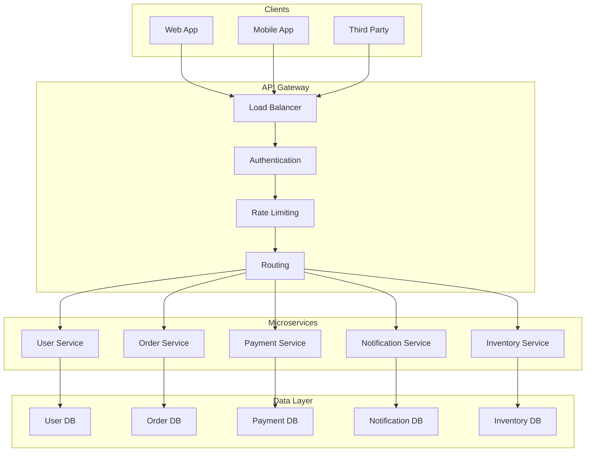
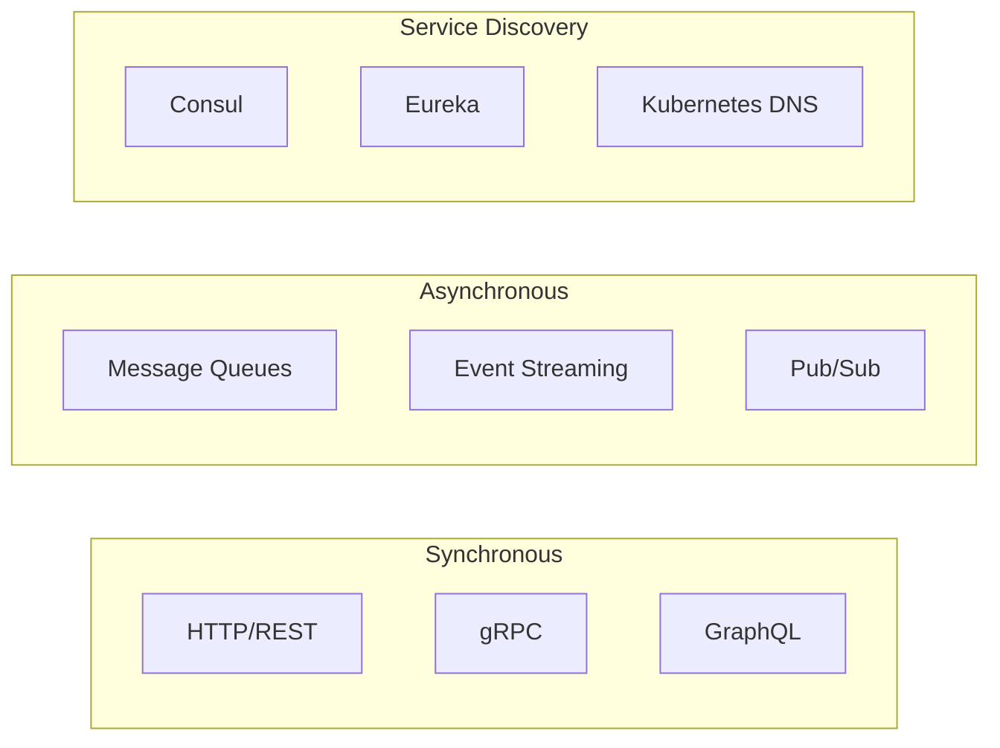
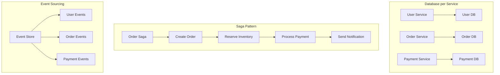

# 🏗️ **Microservices Architecture**

## 📘 **Theory**

Microservices architecture is a design approach where applications are built as a collection of loosely coupled, independently deployable services. Each service is responsible for a specific business capability and communicates with other services through well-defined APIs.

### **Why Microservices Architecture Matters**

- **Scalability**: Scale individual services independently
- **Flexibility**: Use different technologies for different services
- **Fault Isolation**: Failures in one service don't affect others
- **Team Autonomy**: Teams can work independently on different services
- **Deployment**: Deploy services independently without affecting others
- **Maintainability**: Easier to maintain and update individual services
- **Technology Diversity**: Use appropriate technology for each service
- **Business Alignment**: Services align with business capabilities

### **Key Concepts**

1. **Service Decomposition**: Breaking monolith into smaller services
2. **API Gateway**: Single entry point for all client requests
3. **Service Discovery**: Finding and connecting to services
4. **Load Balancing**: Distributing traffic across service instances
5. **Circuit Breaker**: Preventing cascading failures
6. **Distributed Data**: Each service manages its own data
7. **Event-Driven Communication**: Asynchronous communication between services
8. **Containerization**: Packaging services in containers

### **Microservices Patterns**

1. **Database per Service**: Each service has its own database
2. **Saga Pattern**: Managing distributed transactions
3. **CQRS**: Command Query Responsibility Segregation
4. **Event Sourcing**: Storing events instead of current state
5. **API Gateway**: Single entry point for clients
6. **Service Mesh**: Infrastructure layer for service communication
7. **Bulkhead Pattern**: Isolating resources for fault tolerance
8. **Sidecar Pattern**: Deploying supporting services alongside main service

### **Common Pitfalls and Best Practices**

- **Over-engineering**: Don't create microservices for simple applications
- **Data Consistency**: Handle distributed data challenges
- **Network Latency**: Minimize inter-service communication
- **Service Boundaries**: Define clear service boundaries
- **Monitoring**: Implement comprehensive monitoring
- **Testing**: Use appropriate testing strategies
- **Deployment**: Automate deployment and rollback
- **Documentation**: Maintain up-to-date service documentation

## 📊 **Diagrams**

### **Microservices Architecture Overview**



### **Service Communication Patterns**



### **Data Management Patterns**



## 🧩 **Example**

**Scenario**: Design a microservices architecture for an e-commerce platform

**Input**:

- Multiple business domains (User, Product, Order, Payment, Inventory)
- High traffic and scalability requirements
- Need for independent deployment and scaling
- Multiple client types (Web, Mobile, Admin)

**Expected Output**:

- Microservices architecture design
- Service boundaries and responsibilities
- Communication patterns
- Data management strategy
- Deployment and monitoring approach

**Step-by-step**:

1. Identify business domains and service boundaries
2. Design service APIs and communication patterns
3. Plan data management and consistency strategies
4. Design deployment and infrastructure
5. Implement monitoring and observability
6. Plan testing and deployment strategies

## 💻 **Implementation (Golang)**

```go
package main

import (
    "context"
    "encoding/json"
    "fmt"
    "log"
    "net/http"
    "time"

    "github.com/gorilla/mux"
    "github.com/patrickmn/go-cache"
)

// UserService represents the user microservice
type UserService struct {
    router *mux.Router
    cache  *cache.Cache
    db     *UserDB
}

// User represents a user entity
type User struct {
    ID        string    `json:"id"`
    Name      string    `json:"name"`
    Email     string    `json:"email"`
    CreatedAt time.Time `json:"created_at"`
}

// UserDB represents the user database
type UserDB struct {
    users map[string]*User
}

// NewUserDB creates a new user database
func NewUserDB() *UserDB {
    return &UserDB{
        users: make(map[string]*User),
    }
}

// CreateUser creates a new user
func (db *UserDB) CreateUser(user *User) error {
    db.users[user.ID] = user
    return nil
}

// GetUser retrieves a user by ID
func (db *UserDB) GetUser(id string) (*User, error) {
    user, exists := db.users[id]
    if !exists {
        return nil, fmt.Errorf("user not found")
    }
    return user, nil
}

// NewUserService creates a new user service
func NewUserService() *UserService {
    service := &UserService{
        router: mux.NewRouter(),
        cache:  cache.New(5*time.Minute, 10*time.Minute),
        db:     NewUserDB(),
    }

    service.setupRoutes()
    return service
}

// setupRoutes sets up the service routes
func (s *UserService) setupRoutes() {
    s.router.HandleFunc("/users", s.CreateUser).Methods("POST")
    s.router.HandleFunc("/users/{id}", s.GetUser).Methods("GET")
    s.router.HandleFunc("/users/{id}", s.UpdateUser).Methods("PUT")
    s.router.HandleFunc("/users/{id}", s.DeleteUser).Methods("DELETE")
    s.router.HandleFunc("/health", s.HealthCheck).Methods("GET")
}

// CreateUser handles user creation
func (s *UserService) CreateUser(w http.ResponseWriter, r *http.Request) {
    var user User
    if err := json.NewDecoder(r.Body).Decode(&user); err != nil {
        http.Error(w, "Invalid JSON", http.StatusBadRequest)
        return
    }

    user.ID = generateID()
    user.CreatedAt = time.Now()

    if err := s.db.CreateUser(&user); err != nil {
        http.Error(w, "Failed to create user", http.StatusInternalServerError)
        return
    }

    w.Header().Set("Content-Type", "application/json")
    json.NewEncoder(w).Encode(user)
}

// GetUser handles user retrieval
func (s *UserService) GetUser(w http.ResponseWriter, r *http.Request) {
    vars := mux.Vars(r)
    userID := vars["id"]

    // Check cache first
    if cached, found := s.cache.Get(userID); found {
        w.Header().Set("Content-Type", "application/json")
        json.NewEncoder(w).Encode(cached)
        return
    }

    user, err := s.db.GetUser(userID)
    if err != nil {
        http.Error(w, "User not found", http.StatusNotFound)
        return
    }

    // Cache the result
    s.cache.Set(userID, user, cache.DefaultExpiration)

    w.Header().Set("Content-Type", "application/json")
    json.NewEncoder(w).Encode(user)
}

// UpdateUser handles user updates
func (s *UserService) UpdateUser(w http.ResponseWriter, r *http.Request) {
    vars := mux.Vars(r)
    userID := vars["id"]

    var user User
    if err := json.NewDecoder(r.Body).Decode(&user); err != nil {
        http.Error(w, "Invalid JSON", http.StatusBadRequest)
        return
    }

    user.ID = userID

    if err := s.db.CreateUser(&user); err != nil {
        http.Error(w, "Failed to update user", http.StatusInternalServerError)
        return
    }

    // Invalidate cache
    s.cache.Delete(userID)

    w.Header().Set("Content-Type", "application/json")
    json.NewEncoder(w).Encode(user)
}

// DeleteUser handles user deletion
func (s *UserService) DeleteUser(w http.ResponseWriter, r *http.Request) {
    vars := mux.Vars(r)
    userID := vars["id"]

    if _, err := s.db.GetUser(userID); err != nil {
        http.Error(w, "User not found", http.StatusNotFound)
        return
    }

    delete(s.db.users, userID)
    s.cache.Delete(userID)

    w.WriteHeader(http.StatusNoContent)
}

// HealthCheck handles health check requests
func (s *UserService) HealthCheck(w http.ResponseWriter, r *http.Request) {
    w.Header().Set("Content-Type", "application/json")
    json.NewEncoder(w).Encode(map[string]string{
        "status": "healthy",
        "service": "user-service",
        "timestamp": time.Now().Format(time.RFC3339),
    })
}

// OrderService represents the order microservice
type OrderService struct {
    router     *mux.Router
    cache      *cache.Cache
    db         *OrderDB
    userClient *UserClient
}

// Order represents an order entity
type Order struct {
    ID        string    `json:"id"`
    UserID    string    `json:"user_id"`
    Items     []Item    `json:"items"`
    Total     float64   `json:"total"`
    Status    string    `json:"status"`
    CreatedAt time.Time `json:"created_at"`
}

// Item represents an order item
type Item struct {
    ProductID string  `json:"product_id"`
    Quantity  int     `json:"quantity"`
    Price     float64 `json:"price"`
}

// OrderDB represents the order database
type OrderDB struct {
    orders map[string]*Order
}

// NewOrderDB creates a new order database
func NewOrderDB() *OrderDB {
    return &OrderDB{
        orders: make(map[string]*Order),
    }
}

// CreateOrder creates a new order
func (db *OrderDB) CreateOrder(order *Order) error {
    db.orders[order.ID] = order
    return nil
}

// GetOrder retrieves an order by ID
func (db *OrderDB) GetOrder(id string) (*Order, error) {
    order, exists := db.orders[id]
    if !exists {
        return nil, fmt.Errorf("order not found")
    }
    return order, nil
}

// UserClient represents a client for the user service
type UserClient struct {
    baseURL string
    client  *http.Client
}

// NewUserClient creates a new user client
func NewUserClient(baseURL string) *UserClient {
    return &UserClient{
        baseURL: baseURL,
        client:  &http.Client{Timeout: 5 * time.Second},
    }
}

// GetUser retrieves a user from the user service
func (c *UserClient) GetUser(ctx context.Context, userID string) (*User, error) {
    url := fmt.Sprintf("%s/users/%s", c.baseURL, userID)

    req, err := http.NewRequestWithContext(ctx, "GET", url, nil)
    if err != nil {
        return nil, err
    }

    resp, err := c.client.Do(req)
    if err != nil {
        return nil, err
    }
    defer resp.Body.Close()

    if resp.StatusCode != http.StatusOK {
        return nil, fmt.Errorf("user service returned status %d", resp.StatusCode)
    }

    var user User
    if err := json.NewDecoder(resp.Body).Decode(&user); err != nil {
        return nil, err
    }

    return &user, nil
}

// NewOrderService creates a new order service
func NewOrderService(userServiceURL string) *OrderService {
    service := &OrderService{
        router:     mux.NewRouter(),
        cache:      cache.New(5*time.Minute, 10*time.Minute),
        db:         NewOrderDB(),
        userClient: NewUserClient(userServiceURL),
    }

    service.setupRoutes()
    return service
}

// setupRoutes sets up the service routes
func (s *OrderService) setupRoutes() {
    s.router.HandleFunc("/orders", s.CreateOrder).Methods("POST")
    s.router.HandleFunc("/orders/{id}", s.GetOrder).Methods("GET")
    s.router.HandleFunc("/orders/{id}", s.UpdateOrder).Methods("PUT")
    s.router.HandleFunc("/orders/{id}", s.DeleteOrder).Methods("DELETE")
    s.router.HandleFunc("/health", s.HealthCheck).Methods("GET")
}

// CreateOrder handles order creation
func (s *OrderService) CreateOrder(w http.ResponseWriter, r *http.Request) {
    var order Order
    if err := json.NewDecoder(r.Body).Decode(&order); err != nil {
        http.Error(w, "Invalid JSON", http.StatusBadRequest)
        return
    }

    // Validate user exists
    ctx := r.Context()
    if _, err := s.userClient.GetUser(ctx, order.UserID); err != nil {
        http.Error(w, "User not found", http.StatusBadRequest)
        return
    }

    order.ID = generateID()
    order.Status = "pending"
    order.CreatedAt = time.Now()

    if err := s.db.CreateOrder(&order); err != nil {
        http.Error(w, "Failed to create order", http.StatusInternalServerError)
        return
    }

    w.Header().Set("Content-Type", "application/json")
    json.NewEncoder(w).Encode(order)
}

// GetOrder handles order retrieval
func (s *OrderService) GetOrder(w http.ResponseWriter, r *http.Request) {
    vars := mux.Vars(r)
    orderID := vars["id"]

    // Check cache first
    if cached, found := s.cache.Get(orderID); found {
        w.Header().Set("Content-Type", "application/json")
        json.NewEncoder(w).Encode(cached)
        return
    }

    order, err := s.db.GetOrder(orderID)
    if err != nil {
        http.Error(w, "Order not found", http.StatusNotFound)
        return
    }

    // Cache the result
    s.cache.Set(orderID, order, cache.DefaultExpiration)

    w.Header().Set("Content-Type", "application/json")
    json.NewEncoder(w).Encode(order)
}

// UpdateOrder handles order updates
func (s *OrderService) UpdateOrder(w http.ResponseWriter, r *http.Request) {
    vars := mux.Vars(r)
    orderID := vars["id"]

    var order Order
    if err := json.NewDecoder(r.Body).Decode(&order); err != nil {
        http.Error(w, "Invalid JSON", http.StatusBadRequest)
        return
    }

    order.ID = orderID

    if err := s.db.CreateOrder(&order); err != nil {
        http.Error(w, "Failed to update order", http.StatusInternalServerError)
        return
    }

    // Invalidate cache
    s.cache.Delete(orderID)

    w.Header().Set("Content-Type", "application/json")
    json.NewEncoder(w).Encode(order)
}

// DeleteOrder handles order deletion
func (s *OrderService) DeleteOrder(w http.ResponseWriter, r *http.Request) {
    vars := mux.Vars(r)
    orderID := vars["id"]

    if _, err := s.db.GetOrder(orderID); err != nil {
        http.Error(w, "Order not found", http.StatusNotFound)
        return
    }

    delete(s.db.orders, orderID)
    s.cache.Delete(orderID)

    w.WriteHeader(http.StatusNoContent)
}

// HealthCheck handles health check requests
func (s *OrderService) HealthCheck(w http.ResponseWriter, r *http.Request) {
    w.Header().Set("Content-Type", "application/json")
    json.NewEncoder(w).Encode(map[string]string{
        "status": "healthy",
        "service": "order-service",
        "timestamp": time.Now().Format(time.RFC3339),
    })
}

// APIGateway represents the API Gateway
type APIGateway struct {
    router        *mux.Router
    userService   *UserService
    orderService  *OrderService
    rateLimiter   *RateLimiter
    circuitBreaker *CircuitBreaker
}

// RateLimiter handles rate limiting
type RateLimiter struct {
    limiters map[string]*time.Ticker
}

// NewRateLimiter creates a new rate limiter
func NewRateLimiter() *RateLimiter {
    return &RateLimiter{
        limiters: make(map[string]*time.Ticker),
    }
}

// Allow checks if request is allowed
func (rl *RateLimiter) Allow(clientID string) bool {
    // Simple rate limiting implementation
    return true
}

// CircuitBreaker handles circuit breaking
type CircuitBreaker struct {
    services map[string]*ServiceBreaker
}

// ServiceBreaker represents a circuit breaker for a service
type ServiceBreaker struct {
    name            string
    failureCount    int
    lastFailureTime time.Time
    state           string // "closed", "open", "half-open"
    threshold       int
    timeout         time.Duration
}

// NewCircuitBreaker creates a new circuit breaker
func NewCircuitBreaker() *CircuitBreaker {
    return &CircuitBreaker{
        services: make(map[string]*ServiceBreaker),
    }
}

// AllowRequest checks if request is allowed
func (cb *CircuitBreaker) AllowRequest(serviceName string) bool {
    breaker, exists := cb.services[serviceName]
    if !exists {
        return true
    }

    switch breaker.state {
    case "closed":
        return true
    case "open":
        if time.Since(breaker.lastFailureTime) > breaker.timeout {
            breaker.state = "half-open"
            return true
        }
        return false
    case "half-open":
        return true
    default:
        return true
    }
}

// NewAPIGateway creates a new API Gateway
func NewAPIGateway() *APIGateway {
    userService := NewUserService()
    orderService := NewOrderService("http://localhost:8001")

    gateway := &APIGateway{
        router:        mux.NewRouter(),
        userService:   userService,
        orderService:  orderService,
        rateLimiter:   NewRateLimiter(),
        circuitBreaker: NewCircuitBreaker(),
    }

    gateway.setupRoutes()
    return gateway
}

// setupRoutes sets up the gateway routes
func (g *APIGateway) setupRoutes() {
    // User service routes
    g.router.PathPrefix("/api/users").Handler(http.StripPrefix("/api/users", g.userService.router))

    // Order service routes
    g.router.PathPrefix("/api/orders").Handler(http.StripPrefix("/api/orders", g.orderService.router))

    // Health check
    g.router.HandleFunc("/health", g.HealthCheck).Methods("GET")
}

// HealthCheck handles health check requests
func (g *APIGateway) HealthCheck(w http.ResponseWriter, r *http.Request) {
    w.Header().Set("Content-Type", "application/json")
    json.NewEncoder(w).Encode(map[string]string{
        "status": "healthy",
        "gateway": "api-gateway",
        "timestamp": time.Now().Format(time.RFC3339),
    })
}

// Helper functions
func generateID() string {
    return fmt.Sprintf("%d", time.Now().UnixNano())
}

// Example usage
func main() {
    // Create API Gateway
    gateway := NewAPIGateway()

    // Start user service
    go func() {
        log.Println("User service starting on :8001")
        log.Fatal(http.ListenAndServe(":8001", gateway.userService.router))
    }()

    // Start order service
    go func() {
        log.Println("Order service starting on :8002")
        log.Fatal(http.ListenAndServe(":8002", gateway.orderService.router))
    }()

    // Start API Gateway
    log.Println("API Gateway starting on :8080")
    log.Fatal(http.ListenAndServe(":8080", gateway.router))
}
```

## 💻 **Implementation (Node.js)**

```javascript
const express = require("express");
const axios = require("axios");
const NodeCache = require("node-cache");

// UserService represents the user microservice
class UserService {
  constructor() {
    this.app = express();
    this.cache = new NodeCache({ stdTTL: 300 }); // 5 minutes
    this.db = new Map();
    this.setupRoutes();
  }

  setupRoutes() {
    this.app.use(express.json());

    this.app.post("/users", (req, res) => this.createUser(req, res));
    this.app.get("/users/:id", (req, res) => this.getUser(req, res));
    this.app.put("/users/:id", (req, res) => this.updateUser(req, res));
    this.app.delete("/users/:id", (req, res) => this.deleteUser(req, res));
    this.app.get("/health", (req, res) => this.healthCheck(req, res));
  }

  createUser(req, res) {
    const user = {
      id: this.generateID(),
      name: req.body.name,
      email: req.body.email,
      created_at: new Date().toISOString(),
    };

    this.db.set(user.id, user);
    res.json(user);
  }

  getUser(req, res) {
    const userId = req.params.id;

    // Check cache first
    const cached = this.cache.get(userId);
    if (cached) {
      return res.json(cached);
    }

    const user = this.db.get(userId);
    if (!user) {
      return res.status(404).json({ error: "User not found" });
    }

    // Cache the result
    this.cache.set(userId, user);
    res.json(user);
  }

  updateUser(req, res) {
    const userId = req.params.id;
    const user = this.db.get(userId);

    if (!user) {
      return res.status(404).json({ error: "User not found" });
    }

    const updatedUser = {
      ...user,
      ...req.body,
      id: userId,
    };

    this.db.set(userId, updatedUser);
    this.cache.del(userId); // Invalidate cache
    res.json(updatedUser);
  }

  deleteUser(req, res) {
    const userId = req.params.id;

    if (!this.db.has(userId)) {
      return res.status(404).json({ error: "User not found" });
    }

    this.db.delete(userId);
    this.cache.del(userId);
    res.status(204).send();
  }

  healthCheck(req, res) {
    res.json({
      status: "healthy",
      service: "user-service",
      timestamp: new Date().toISOString(),
    });
  }

  generateID() {
    return Date.now().toString();
  }
}

// OrderService represents the order microservice
class OrderService {
  constructor(userServiceURL) {
    this.app = express();
    this.cache = new NodeCache({ stdTTL: 300 }); // 5 minutes
    this.db = new Map();
    this.userServiceURL = userServiceURL;
    this.setupRoutes();
  }

  setupRoutes() {
    this.app.use(express.json());

    this.app.post("/orders", (req, res) => this.createOrder(req, res));
    this.app.get("/orders/:id", (req, res) => this.getOrder(req, res));
    this.app.put("/orders/:id", (req, res) => this.updateOrder(req, res));
    this.app.delete("/orders/:id", (req, res) => this.deleteOrder(req, res));
    this.app.get("/health", (req, res) => this.healthCheck(req, res));
  }

  async createOrder(req, res) {
    try {
      const order = {
        id: this.generateID(),
        user_id: req.body.user_id,
        items: req.body.items,
        total: req.body.total,
        status: "pending",
        created_at: new Date().toISOString(),
      };

      // Validate user exists
      await this.validateUser(order.user_id);

      this.db.set(order.id, order);
      res.json(order);
    } catch (error) {
      res.status(400).json({ error: error.message });
    }
  }

  getOrder(req, res) {
    const orderId = req.params.id;

    // Check cache first
    const cached = this.cache.get(orderId);
    if (cached) {
      return res.json(cached);
    }

    const order = this.db.get(orderId);
    if (!order) {
      return res.status(404).json({ error: "Order not found" });
    }

    // Cache the result
    this.cache.set(orderId, order);
    res.json(order);
  }

  updateOrder(req, res) {
    const orderId = req.params.id;
    const order = this.db.get(orderId);

    if (!order) {
      return res.status(404).json({ error: "Order not found" });
    }

    const updatedOrder = {
      ...order,
      ...req.body,
      id: orderId,
    };

    this.db.set(orderId, updatedOrder);
    this.cache.del(orderId); // Invalidate cache
    res.json(updatedOrder);
  }

  deleteOrder(req, res) {
    const orderId = req.params.id;

    if (!this.db.has(orderId)) {
      return res.status(404).json({ error: "Order not found" });
    }

    this.db.delete(orderId);
    this.cache.del(orderId);
    res.status(204).send();
  }

  async validateUser(userId) {
    try {
      const response = await axios.get(
        `${this.userServiceURL}/users/${userId}`
      );
      return response.data;
    } catch (error) {
      throw new Error("User not found");
    }
  }

  healthCheck(req, res) {
    res.json({
      status: "healthy",
      service: "order-service",
      timestamp: new Date().toISOString(),
    });
  }

  generateID() {
    return Date.now().toString();
  }
}

// APIGateway represents the API Gateway
class APIGateway {
  constructor() {
    this.app = express();
    this.userService = new UserService();
    this.orderService = new OrderService("http://localhost:8001");
    this.setupRoutes();
  }

  setupRoutes() {
    this.app.use(express.json());

    // User service routes
    this.app.use("/api/users", this.userService.app);

    // Order service routes
    this.app.use("/api/orders", this.orderService.app);

    // Health check
    this.app.get("/health", (req, res) => this.healthCheck(req, res));
  }

  healthCheck(req, res) {
    res.json({
      status: "healthy",
      gateway: "api-gateway",
      timestamp: new Date().toISOString(),
    });
  }
}

// Example usage
async function main() {
  // Create API Gateway
  const gateway = new APIGateway();

  // Start user service
  const userService = new UserService();
  userService.app.listen(8001, () => {
    console.log("User service running on port 8001");
  });

  // Start order service
  const orderService = new OrderService("http://localhost:8001");
  orderService.app.listen(8002, () => {
    console.log("Order service running on port 8002");
  });

  // Start API Gateway
  gateway.app.listen(8080, () => {
    console.log("API Gateway running on port 8080");
  });
}

// Run the example
main().catch(console.error);
```

## ⏱ **Complexity Analysis**

### **Time Complexity**

- **Service Creation**: O(1) for each service
- **Request Processing**: O(1) for each request
- **Service Communication**: O(1) for each service call
- **Cache Operations**: O(1) for cache operations

### **Space Complexity**

- **Service Storage**: O(n) where n is number of services
- **Cache Storage**: O(m) where m is number of cached items
- **Database Storage**: O(d) where d is data size
- **Memory Usage**: O(s) where s is service count

## 🚀 **Optimal Solution**

The optimal microservices architecture includes:

1. **Clear Service Boundaries**: Define services based on business capabilities
2. **API Gateway**: Use API Gateway for routing and cross-cutting concerns
3. **Service Discovery**: Implement service discovery for dynamic service location
4. **Circuit Breaker**: Use circuit breakers for fault tolerance
5. **Distributed Data**: Each service manages its own data
6. **Event-Driven Communication**: Use events for loose coupling
7. **Containerization**: Package services in containers
8. **Monitoring**: Implement comprehensive monitoring and observability

### **Production Considerations**

- Use appropriate service boundaries
- Implement proper error handling and resilience
- Use service mesh for advanced communication patterns
- Implement proper security and authentication
- Use appropriate data consistency patterns
- Monitor service health and performance
- Implement proper deployment and rollback strategies
- Use appropriate testing strategies

## ❓ **Follow-up Questions**

### **How would this scale with X?**

- **High Traffic**: Use load balancing and horizontal scaling
- **Many Services**: Use service mesh and advanced orchestration
- **Global Distribution**: Use edge services and regional deployment

### **How can we optimize further if Y changes?**

- **Performance Requirements**: Use caching and optimization techniques
- **Cost Constraints**: Use efficient resource allocation and optimization
- **Complexity Requirements**: Use appropriate architectural patterns

### **What trade-offs exist in different approaches?**

- **Monolith vs Microservices**: Simplicity vs Complexity
- **Synchronous vs Asynchronous**: Consistency vs Performance
- **Centralized vs Distributed**: Control vs Autonomy
