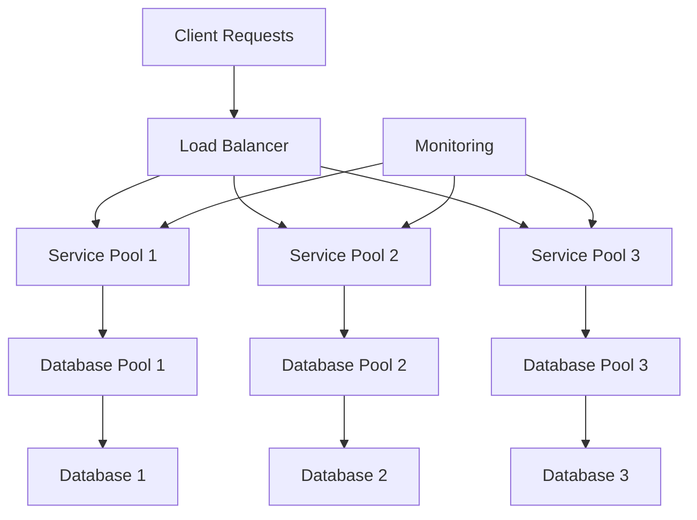

# Bulkhead Pattern - Resource Isolation and Fault Containment

## Overview

The Bulkhead pattern is a design pattern that isolates critical resources to prevent cascading failures. It's inspired by the watertight compartments (bulkheads) in ships that prevent the entire vessel from sinking if one compartment is breached.

## Key Concepts

- **Resource Isolation**: Separate resources into isolated pools
- **Fault Containment**: Prevent failures from spreading
- **Resource Pooling**: Manage resources in dedicated pools
- **Load Isolation**: Isolate different types of load
- **Failure Boundaries**: Create clear failure boundaries

## Bulkhead Architecture



## Go Implementation

```go
package main

import (
    "context"
    "fmt"
    "log"
    "sync"
    "time"
)

// ResourceType represents the type of resource
type ResourceType int

const (
    ResourceTypeCPU ResourceType = iota
    ResourceTypeMemory
    ResourceTypeDatabase
    ResourceTypeNetwork
)

// String returns the string representation
func (rt ResourceType) String() string {
    switch rt {
    case ResourceTypeCPU:
        return "CPU"
    case ResourceTypeMemory:
        return "Memory"
    case ResourceTypeDatabase:
        return "Database"
    case ResourceTypeNetwork:
        return "Network"
    default:
        return "Unknown"
    }
}

// ResourcePool represents a pool of resources
type ResourcePool struct {
    ID           string
    Type         ResourceType
    MaxResources int
    Resources    []Resource
    Available    chan Resource
    Mutex        sync.RWMutex
    Metrics      *PoolMetrics
}

// Resource represents a single resource
type Resource struct {
    ID        string
    Type      ResourceType
    PoolID    string
    InUse     bool
    CreatedAt time.Time
    LastUsed  time.Time
}

// PoolMetrics represents metrics for a resource pool
type PoolMetrics struct {
    TotalResources    int
    AvailableResources int
    InUseResources    int
    FailedResources   int
    TotalRequests     int64
    SuccessfulRequests int64
    FailedRequests    int64
    AverageLatency    time.Duration
    Mutex            sync.RWMutex
}

// NewResourcePool creates a new resource pool
func NewResourcePool(id string, resourceType ResourceType, maxResources int) *ResourcePool {
    pool := &ResourcePool{
        ID:           id,
        Type:         resourceType,
        MaxResources: maxResources,
        Resources:    make([]Resource, 0, maxResources),
        Available:    make(chan Resource, maxResources),
        Metrics:      &PoolMetrics{},
    }
    
    // Initialize resources
    for i := 0; i < maxResources; i++ {
        resource := Resource{
            ID:        fmt.Sprintf("%s-resource-%d", id, i),
            Type:      resourceType,
            PoolID:    id,
            CreatedAt: time.Now(),
        }
        pool.Resources = append(pool.Resources, resource)
        pool.Available <- resource
    }
    
    pool.Metrics.TotalResources = maxResources
    pool.Metrics.AvailableResources = maxResources
    
    return pool
}

// Acquire acquires a resource from the pool
func (rp *ResourcePool) Acquire(ctx context.Context) (*Resource, error) {
    rp.Metrics.Mutex.Lock()
    rp.Metrics.TotalRequests++
    rp.Metrics.Mutex.Unlock()
    
    select {
    case resource := <-rp.Available:
        resource.InUse = true
        resource.LastUsed = time.Now()
        
        rp.Metrics.Mutex.Lock()
        rp.Metrics.AvailableResources--
        rp.Metrics.InUseResources++
        rp.Metrics.SuccessfulRequests++
        rp.Metrics.Mutex.Unlock()
        
        return &resource, nil
    case <-ctx.Done():
        rp.Metrics.Mutex.Lock()
        rp.Metrics.FailedRequests++
        rp.Metrics.Mutex.Unlock()
        return nil, ctx.Err()
    }
}

// Release releases a resource back to the pool
func (rp *ResourcePool) Release(resource *Resource) {
    if resource == nil {
        return
    }
    
    resource.InUse = false
    resource.LastUsed = time.Now()
    
    rp.Metrics.Mutex.Lock()
    rp.Metrics.AvailableResources++
    rp.Metrics.InUseResources--
    rp.Metrics.Mutex.Unlock()
    
    select {
    case rp.Available <- *resource:
    default:
        log.Printf("Warning: Pool %s is full, resource %s discarded", rp.ID, resource.ID)
    }
}

// GetMetrics returns the current metrics
func (rp *ResourcePool) GetMetrics() PoolMetrics {
    rp.Metrics.Mutex.RLock()
    defer rp.Metrics.Mutex.RUnlock()
    return *rp.Metrics
}

// IsHealthy returns true if the pool is healthy
func (rp *ResourcePool) IsHealthy() bool {
    rp.Metrics.Mutex.RLock()
    defer rp.Metrics.Mutex.RUnlock()
    
    // Pool is healthy if it has available resources
    return rp.Metrics.AvailableResources > 0
}

// BulkheadManager manages multiple resource pools
type BulkheadManager struct {
    Pools map[string]*ResourcePool
    Mutex sync.RWMutex
}

// NewBulkheadManager creates a new bulkhead manager
func NewBulkheadManager() *BulkheadManager {
    return &BulkheadManager{
        Pools: make(map[string]*ResourcePool),
    }
}

// AddPool adds a resource pool to the manager
func (bm *BulkheadManager) AddPool(pool *ResourcePool) {
    bm.Mutex.Lock()
    defer bm.Mutex.Unlock()
    bm.Pools[pool.ID] = pool
}

// GetPool returns a resource pool by ID
func (bm *BulkheadManager) GetPool(id string) (*ResourcePool, bool) {
    bm.Mutex.RLock()
    defer bm.Mutex.RUnlock()
    pool, exists := bm.Pools[id]
    return pool, exists
}

// ExecuteWithPool executes a function with a resource from the specified pool
func (bm *BulkheadManager) ExecuteWithPool(ctx context.Context, poolID string, fn func(*Resource) error) error {
    pool, exists := bm.GetPool(poolID)
    if !exists {
        return fmt.Errorf("pool %s not found", poolID)
    }
    
    resource, err := pool.Acquire(ctx)
    if err != nil {
        return fmt.Errorf("failed to acquire resource from pool %s: %v", poolID, err)
    }
    
    defer pool.Release(resource)
    
    return fn(resource)
}

// GetHealthStatus returns the health status of all pools
func (bm *BulkheadManager) GetHealthStatus() map[string]bool {
    bm.Mutex.RLock()
    defer bm.Mutex.RUnlock()
    
    status := make(map[string]bool)
    for id, pool := range bm.Pools {
        status[id] = pool.IsHealthy()
    }
    return status
}

// GetMetrics returns metrics for all pools
func (bm *BulkheadManager) GetMetrics() map[string]PoolMetrics {
    bm.Mutex.RLock()
    defer bm.Mutex.RUnlock()
    
    metrics := make(map[string]PoolMetrics)
    for id, pool := range bm.Pools {
        metrics[id] = pool.GetMetrics()
    }
    return metrics
}

// Service represents a service that uses resources
type Service struct {
    ID       string
    PoolID   string
    Manager  *BulkheadManager
    Latency  time.Duration
    ErrorRate float64
}

// NewService creates a new service
func NewService(id, poolID string, manager *BulkheadManager, latency time.Duration, errorRate float64) *Service {
    return &Service{
        ID:       id,
        PoolID:   poolID,
        Manager:  manager,
        Latency:  latency,
        ErrorRate: errorRate,
    }
}

// Process processes a request using the service
func (s *Service) Process(ctx context.Context, requestID string) error {
    return s.Manager.ExecuteWithPool(ctx, s.PoolID, func(resource *Resource) error {
        // Simulate processing time
        time.Sleep(s.Latency)
        
        // Simulate error
        if s.ErrorRate > 0 && time.Now().UnixNano()%100 < int64(s.ErrorRate*100) {
            return fmt.Errorf("service %s failed for request %s", s.ID, requestID)
        }
        
        log.Printf("Service %s processed request %s using resource %s", s.ID, requestID, resource.ID)
        return nil
    })
}

// Example usage
func main() {
    // Create bulkhead manager
    manager := NewBulkheadManager()
    
    // Create resource pools
    cpuPool := NewResourcePool("cpu-pool", ResourceTypeCPU, 5)
    dbPool := NewResourcePool("db-pool", ResourceTypeDatabase, 3)
    networkPool := NewResourcePool("network-pool", ResourceTypeNetwork, 4)
    
    // Add pools to manager
    manager.AddPool(cpuPool)
    manager.AddPool(dbPool)
    manager.AddPool(networkPool)
    
    // Create services
    cpuService := NewService("cpu-service", "cpu-pool", manager, 100*time.Millisecond, 0.1)
    dbService := NewService("db-service", "db-pool", manager, 200*time.Millisecond, 0.2)
    networkService := NewService("network-service", "network-pool", manager, 150*time.Millisecond, 0.15)
    
    // Simulate requests
    var wg sync.WaitGroup
    
    // CPU service requests
    for i := 0; i < 10; i++ {
        wg.Add(1)
        go func(i int) {
            defer wg.Done()
            err := cpuService.Process(context.Background(), fmt.Sprintf("cpu-req-%d", i))
            if err != nil {
                log.Printf("CPU service error: %v", err)
            }
        }(i)
    }
    
    // Database service requests
    for i := 0; i < 8; i++ {
        wg.Add(1)
        go func(i int) {
            defer wg.Done()
            err := dbService.Process(context.Background(), fmt.Sprintf("db-req-%d", i))
            if err != nil {
                log.Printf("DB service error: %v", err)
            }
        }(i)
    }
    
    // Network service requests
    for i := 0; i < 12; i++ {
        wg.Add(1)
        go func(i int) {
            defer wg.Done()
            err := networkService.Process(context.Background(), fmt.Sprintf("network-req-%d", i))
            if err != nil {
                log.Printf("Network service error: %v", err)
            }
        }(i)
    }
    
    // Wait for all requests to complete
    wg.Wait()
    
    // Print metrics
    fmt.Println("\n=== Pool Metrics ===")
    metrics := manager.GetMetrics()
    for poolID, poolMetrics := range metrics {
        fmt.Printf("Pool %s:\n", poolID)
        fmt.Printf("  Total Resources: %d\n", poolMetrics.TotalResources)
        fmt.Printf("  Available: %d\n", poolMetrics.AvailableResources)
        fmt.Printf("  In Use: %d\n", poolMetrics.InUseResources)
        fmt.Printf("  Total Requests: %d\n", poolMetrics.TotalRequests)
        fmt.Printf("  Successful: %d\n", poolMetrics.SuccessfulRequests)
        fmt.Printf("  Failed: %d\n", poolMetrics.FailedRequests)
        fmt.Println()
    }
    
    // Print health status
    fmt.Println("=== Health Status ===")
    health := manager.GetHealthStatus()
    for poolID, isHealthy := range health {
        status := "Healthy"
        if !isHealthy {
            status = "Unhealthy"
        }
        fmt.Printf("Pool %s: %s\n", poolID, status)
    }
}
```

## Benefits

1. **Fault Isolation**: Prevents cascading failures
2. **Resource Management**: Efficient resource allocation
3. **Load Isolation**: Isolates different types of load
4. **Scalability**: Easy to scale individual pools
5. **Monitoring**: Built-in metrics and monitoring

## Trade-offs

1. **Complexity**: Adds complexity to the system
2. **Resource Overhead**: May lead to resource underutilization
3. **Configuration**: Requires careful pool sizing
4. **Coordination**: Need to coordinate between pools

## Use Cases

- **Microservices**: Isolate different services
- **Database Connections**: Separate read/write pools
- **CPU-Intensive Tasks**: Isolate CPU-bound operations
- **Memory-Intensive Tasks**: Isolate memory-bound operations
- **Network Operations**: Isolate network-bound operations

## Best Practices

1. **Pool Sizing**: Size pools based on expected load
2. **Monitoring**: Monitor pool health and metrics
3. **Resource Types**: Use appropriate resource types
4. **Failure Handling**: Handle pool failures gracefully
5. **Load Balancing**: Balance load across pools

## Common Pitfalls

1. **Over-Isolation**: Too many small pools
2. **Under-Isolation**: Too few large pools
3. **Resource Starvation**: Pools running out of resources
4. **No Monitoring**: Not monitoring pool health
5. **Poor Sizing**: Incorrect pool sizes

## Interview Questions

1. **What is the Bulkhead pattern?**
   - A pattern that isolates resources to prevent cascading failures

2. **How does it work?**
   - Separate resources into isolated pools with failure boundaries

3. **What are the benefits?**
   - Fault isolation, resource management, load isolation, scalability

4. **When would you use it?**
   - When you need to prevent cascading failures and isolate resources

## Time Complexity

- **Acquire**: O(1) with channel operations
- **Release**: O(1) with channel operations
- **Metrics**: O(1) for atomic operations

## Space Complexity

- **Resource Storage**: O(n) where n is total resources
- **Channel Storage**: O(n) where n is pool size

The optimal solution uses:
1. **Proper Pool Sizing**: Size pools based on expected load
2. **Resource Types**: Use appropriate resource types
3. **Monitoring**: Monitor pool health and metrics
4. **Failure Handling**: Handle pool failures gracefully
