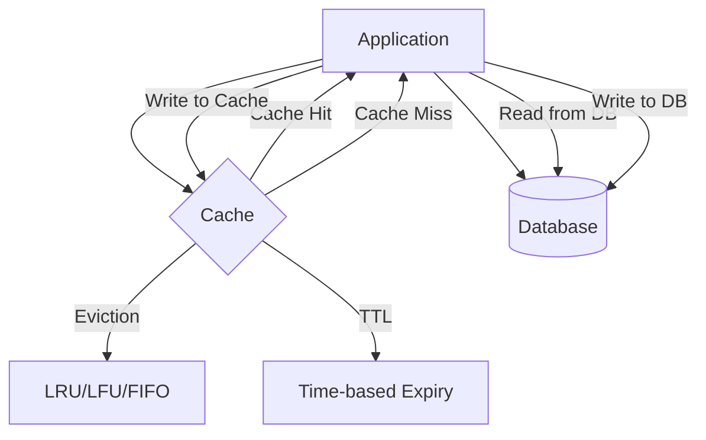
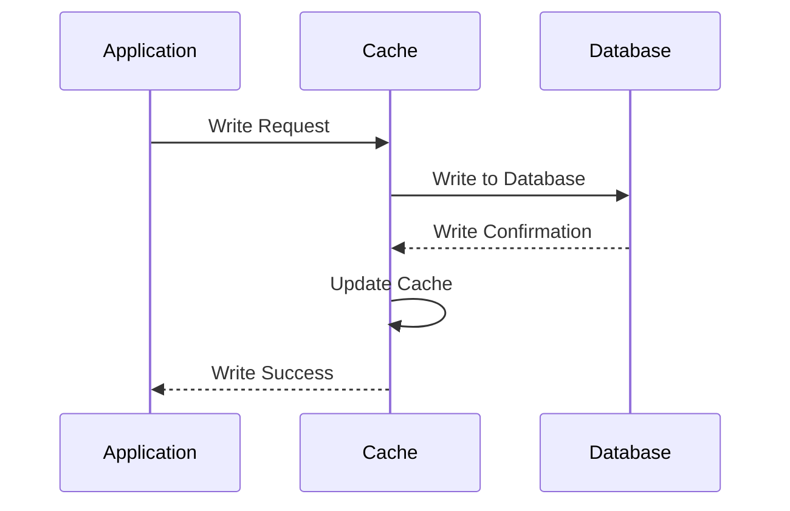
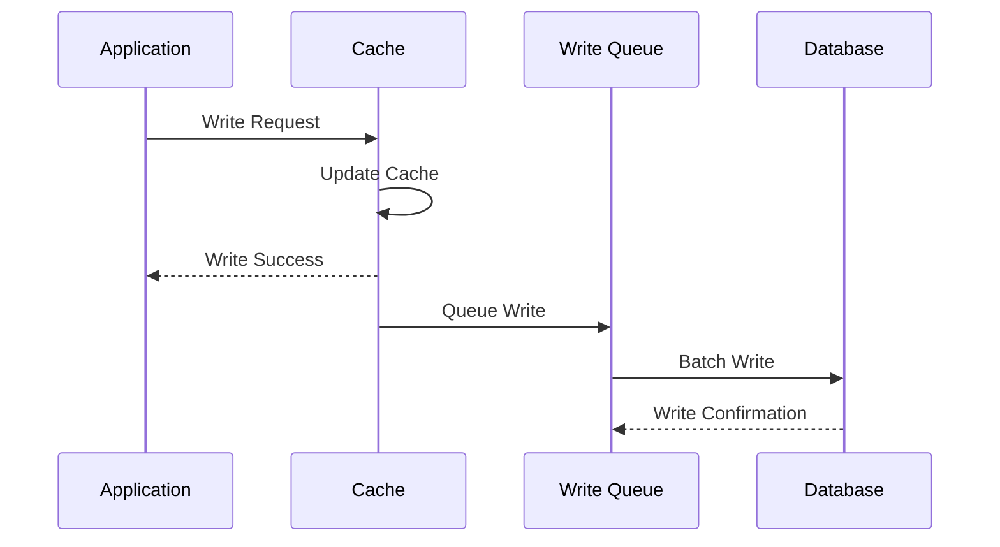

---
# Auto-generated front matter
Title: Caching Patterns
LastUpdated: 2025-11-06T20:45:57.710651
Tags: []
Status: draft
---

# 🗄️ **Caching Patterns**

## 📘 **Theory**

Caching is a fundamental technique in system design that stores frequently accessed data in fast storage to improve performance and reduce load on primary data sources. It acts as a buffer between applications and slower data stores, significantly reducing response times and improving user experience.

### **Why Caching Matters**

- **Performance**: Dramatically reduces response times (from milliseconds to microseconds)
- **Scalability**: Reduces load on primary data sources, allowing systems to handle more users
- **Cost Efficiency**: Reduces expensive database queries and API calls
- **Availability**: Provides data even when primary sources are temporarily unavailable
- **User Experience**: Faster page loads and smoother interactions

### **Common Pitfalls and Best Practices**

- **Cache Invalidation**: Implement proper cache invalidation strategies
- **Memory Management**: Monitor memory usage and implement eviction policies
- **Consistency**: Balance between performance and data consistency
- **Cache Warming**: Pre-populate cache with frequently accessed data
- **Monitoring**: Track hit rates, miss rates, and performance metrics

## 📊 **Diagrams**

### **Cache-Aside Pattern Architecture**



### **Write-Through Pattern Flow**



### **Write-Behind Pattern Flow**



## 🧩 **Example**

**Scenario**: E-commerce product catalog with 1M products, 10K daily active users

**Input**: Product lookup requests
**Expected Output**:

- Cache hit: < 1ms response time
- Cache miss: 50ms response time (database query)
- 90%+ cache hit rate

**Step-by-step**:

1. Application receives product lookup request
2. Check cache for product data
3. If cache hit: return cached data immediately
4. If cache miss: query database, store in cache, return data
5. Implement cache invalidation on product updates

## 💻 **Implementation (Golang)**

```go
package main

import (
    "context"
    "encoding/json"
    "fmt"
    "sync"
    "time"
)

// Cache interface
type Cache interface {
    Get(ctx context.Context, key string) (interface{}, bool)
    Set(ctx context.Context, key string, value interface{}, ttl time.Duration) error
    Delete(ctx context.Context, key string) error
    Clear(ctx context.Context) error
    GetStats() CacheStats
}

// Cache item
type CacheItem struct {
    Value     interface{}
    ExpiresAt time.Time
    CreatedAt time.Time
    AccessCount int64
}

func (item *CacheItem) IsExpired() bool {
    return time.Now().After(item.ExpiresAt)
}

// Cache statistics
type CacheStats struct {
    Hits       int64
    Misses     int64
    Evictions  int64
    Size       int64
    MaxSize    int64
}

func (stats *CacheStats) HitRate() float64 {
    total := stats.Hits + stats.Misses
    if total == 0 {
        return 0
    }
    return float64(stats.Hits) / float64(total)
}

// In-Memory Cache Implementation
type InMemoryCache struct {
    data      map[string]*CacheItem
    mutex     sync.RWMutex
    maxSize   int64
    stats     CacheStats
    evictionPolicy string
}

func NewInMemoryCache(maxSize int64, evictionPolicy string) *InMemoryCache {
    cache := &InMemoryCache{
        data:          make(map[string]*CacheItem),
        maxSize:       maxSize,
        evictionPolicy: evictionPolicy,
        stats:         CacheStats{MaxSize: maxSize},
    }

    // Start background cleanup
    go cache.startCleanup()

    return cache
}

func (c *InMemoryCache) Get(ctx context.Context, key string) (interface{}, bool) {
    c.mutex.RLock()
    item, exists := c.data[key]
    c.mutex.RUnlock()

    if !exists {
        c.mutex.Lock()
        c.stats.Misses++
        c.mutex.Unlock()
        return nil, false
    }

    if item.IsExpired() {
        c.mutex.Lock()
        delete(c.data, item)
        c.stats.Misses++
        c.stats.Size--
        c.mutex.Unlock()
        return nil, false
    }

    c.mutex.Lock()
    item.AccessCount++
    c.stats.Hits++
    c.mutex.Unlock()

    return item.Value, true
}

func (c *InMemoryCache) Set(ctx context.Context, key string, value interface{}, ttl time.Duration) error {
    c.mutex.Lock()
    defer c.mutex.Unlock()

    // Check if we need to evict
    if int64(len(c.data)) >= c.maxSize {
        if _, exists := c.data[key]; !exists {
            c.evict()
        }
    }

    item := &CacheItem{
        Value:     value,
        ExpiresAt: time.Now().Add(ttl),
        CreatedAt: time.Now(),
        AccessCount: 0,
    }

    c.data[key] = item
    c.stats.Size = int64(len(c.data))

    return nil
}

func (c *InMemoryCache) Delete(ctx context.Context, key string) error {
    c.mutex.Lock()
    defer c.mutex.Unlock()

    if _, exists := c.data[key]; exists {
        delete(c.data, key)
        c.stats.Size = int64(len(c.data))
    }

    return nil
}

func (c *InMemoryCache) Clear(ctx context.Context) error {
    c.mutex.Lock()
    defer c.mutex.Unlock()

    c.data = make(map[string]*CacheItem)
    c.stats.Size = 0

    return nil
}

func (c *InMemoryCache) GetStats() CacheStats {
    c.mutex.RLock()
    defer c.mutex.RUnlock()

    return c.stats
}

func (c *InMemoryCache) evict() {
    switch c.evictionPolicy {
    case "LRU":
        c.evictLRU()
    case "LFU":
        c.evictLFU()
    case "FIFO":
        c.evictFIFO()
    default:
        c.evictLRU()
    }
}

func (c *InMemoryCache) evictLRU() {
    var oldestKey string
    var oldestTime time.Time

    for key, item := range c.data {
        if oldestKey == "" || item.CreatedAt.Before(oldestTime) {
            oldestKey = key
            oldestTime = item.CreatedAt
        }
    }

    if oldestKey != "" {
        delete(c.data, oldestKey)
        c.stats.Evictions++
    }
}

func (c *InMemoryCache) evictLFU() {
    var leastUsedKey string
    var leastUsedCount int64 = -1

    for key, item := range c.data {
        if leastUsedKey == "" || item.AccessCount < leastUsedCount {
            leastUsedKey = key
            leastUsedCount = item.AccessCount
        }
    }

    if leastUsedKey != "" {
        delete(c.data, leastUsedKey)
        c.stats.Evictions++
    }
}

func (c *InMemoryCache) evictFIFO() {
    // For FIFO, we can use any key since we don't track insertion order
    for key := range c.data {
        delete(c.data, key)
        c.stats.Evictions++
        break
    }
}

func (c *InMemoryCache) startCleanup() {
    ticker := time.NewTicker(1 * time.Minute)
    defer ticker.Stop()

    for range ticker.C {
        c.cleanupExpired()
    }
}

func (c *InMemoryCache) cleanupExpired() {
    c.mutex.Lock()
    defer c.mutex.Unlock()

    for key, item := range c.data {
        if item.IsExpired() {
            delete(c.data, key)
            c.stats.Evictions++
        }
    }

    c.stats.Size = int64(len(c.data))
}

// Cache-Aside Pattern
type CacheAsideService struct {
    cache Cache
    db    Database
}

type Database interface {
    Get(ctx context.Context, key string) (interface{}, error)
    Set(ctx context.Context, key string, value interface{}) error
    Delete(ctx context.Context, key string) error
}

type MockDatabase struct {
    data map[string]interface{}
    mutex sync.RWMutex
}

func NewMockDatabase() *MockDatabase {
    return &MockDatabase{
        data: make(map[string]interface{}),
    }
}

func (db *MockDatabase) Get(ctx context.Context, key string) (interface{}, error) {
    db.mutex.RLock()
    defer db.mutex.RUnlock()

    value, exists := db.data[key]
    if !exists {
        return nil, fmt.Errorf("key not found")
    }

    // Simulate database delay
    time.Sleep(50 * time.Millisecond)

    return value, nil
}

func (db *MockDatabase) Set(ctx context.Context, key string, value interface{}) error {
    db.mutex.Lock()
    defer db.mutex.Unlock()

    db.data[key] = value

    // Simulate database delay
    time.Sleep(100 * time.Millisecond)

    return nil
}

func (db *MockDatabase) Delete(ctx context.Context, key string) error {
    db.mutex.Lock()
    defer db.mutex.Unlock()

    delete(db.data, key)

    // Simulate database delay
    time.Sleep(50 * time.Millisecond)

    return nil
}

func NewCacheAsideService(cache Cache, db Database) *CacheAsideService {
    return &CacheAsideService{
        cache: cache,
        db:    db,
    }
}

func (s *CacheAsideService) Get(ctx context.Context, key string) (interface{}, error) {
    // Try cache first
    if value, found := s.cache.Get(ctx, key); found {
        return value, nil
    }

    // Cache miss - get from database
    value, err := s.db.Get(ctx, key)
    if err != nil {
        return nil, err
    }

    // Store in cache for next time
    s.cache.Set(ctx, key, value, 5*time.Minute)

    return value, nil
}

func (s *CacheAsideService) Set(ctx context.Context, key string, value interface{}) error {
    // Write to database first
    if err := s.db.Set(ctx, key, value); err != nil {
        return err
    }

    // Update cache
    s.cache.Set(ctx, key, value, 5*time.Minute)

    return nil
}

func (s *CacheAsideService) Delete(ctx context.Context, key string) error {
    // Delete from database first
    if err := s.db.Delete(ctx, key); err != nil {
        return err
    }

    // Remove from cache
    s.cache.Delete(ctx, key)

    return nil
}

// Write-Through Pattern
type WriteThroughService struct {
    cache Cache
    db    Database
}

func NewWriteThroughService(cache Cache, db Database) *WriteThroughService {
    return &WriteThroughService{
        cache: cache,
        db:    db,
    }
}

func (s *WriteThroughService) Get(ctx context.Context, key string) (interface{}, error) {
    // Try cache first
    if value, found := s.cache.Get(ctx, key); found {
        return value, nil
    }

    // Cache miss - get from database
    value, err := s.db.Get(ctx, key)
    if err != nil {
        return nil, err
    }

    // Store in cache for next time
    s.cache.Set(ctx, key, value, 5*time.Minute)

    return value, nil
}

func (s *WriteThroughService) Set(ctx context.Context, key string, value interface{}) error {
    // Write to database first
    if err := s.db.Set(ctx, key, value); err != nil {
        return err
    }

    // Then write to cache
    s.cache.Set(ctx, key, value, 5*time.Minute)

    return nil
}

func (s *WriteThroughService) Delete(ctx context.Context, key string) error {
    // Delete from database first
    if err := s.db.Delete(ctx, key); err != nil {
        return err
    }

    // Then delete from cache
    s.cache.Delete(ctx, key)

    return nil
}

// Write-Behind Pattern
type WriteBehindService struct {
    cache     Cache
    db        Database
    writeQueue chan WriteOperation
    batchSize  int
    batchDelay time.Duration
}

type WriteOperation struct {
    Key   string
    Value interface{}
    Op    string // "set" or "delete"
}

func NewWriteBehindService(cache Cache, db Database, batchSize int, batchDelay time.Duration) *WriteBehindService {
    service := &WriteBehindService{
        cache:      cache,
        db:         db,
        writeQueue: make(chan WriteOperation, 1000),
        batchSize:  batchSize,
        batchDelay: batchDelay,
    }

    // Start background writer
    go service.startBackgroundWriter()

    return service
}

func (s *WriteBehindService) Get(ctx context.Context, key string) (interface{}, error) {
    // Try cache first
    if value, found := s.cache.Get(ctx, key); found {
        return value, nil
    }

    // Cache miss - get from database
    value, err := s.db.Get(ctx, key)
    if err != nil {
        return nil, err
    }

    // Store in cache for next time
    s.cache.Set(ctx, key, value, 5*time.Minute)

    return value, nil
}

func (s *WriteBehindService) Set(ctx context.Context, key string, value interface{}) error {
    // Write to cache immediately
    s.cache.Set(ctx, key, value, 5*time.Minute)

    // Queue write to database
    select {
    case s.writeQueue <- WriteOperation{Key: key, Value: value, Op: "set"}:
        return nil
    default:
        return fmt.Errorf("write queue full")
    }
}

func (s *WriteBehindService) Delete(ctx context.Context, key string) error {
    // Delete from cache immediately
    s.cache.Delete(ctx, key)

    // Queue delete from database
    select {
    case s.writeQueue <- WriteOperation{Key: key, Value: nil, Op: "delete"}:
        return nil
    default:
        return fmt.Errorf("write queue full")
    }
}

func (s *WriteBehindService) startBackgroundWriter() {
    ticker := time.NewTicker(s.batchDelay)
    defer ticker.Stop()

    batch := make([]WriteOperation, 0, s.batchSize)

    for {
        select {
        case op := <-s.writeQueue:
            batch = append(batch, op)

            if len(batch) >= s.batchSize {
                s.processBatch(batch)
                batch = batch[:0]
            }

        case <-ticker.C:
            if len(batch) > 0 {
                s.processBatch(batch)
                batch = batch[:0]
            }
        }
    }
}

func (s *WriteBehindService) processBatch(batch []WriteOperation) {
    for _, op := range batch {
        switch op.Op {
        case "set":
            s.db.Set(context.Background(), op.Key, op.Value)
        case "delete":
            s.db.Delete(context.Background(), op.Key)
        }
    }
}

// Cache Warming
type CacheWarmer struct {
    cache   Cache
    db      Database
    keys    []string
    ttl     time.Duration
}

func NewCacheWarmer(cache Cache, db Database, keys []string, ttl time.Duration) *CacheWarmer {
    return &CacheWarmer{
        cache: cache,
        db:    db,
        keys:  keys,
        ttl:   ttl,
    }
}

func (w *CacheWarmer) WarmCache(ctx context.Context) error {
    for _, key := range w.keys {
        // Check if already in cache
        if _, found := w.cache.Get(ctx, key); found {
            continue
        }

        // Get from database
        value, err := w.db.Get(ctx, key)
        if err != nil {
            continue // Skip failed keys
        }

        // Store in cache
        w.cache.Set(ctx, key, value, w.ttl)
    }

    return nil
}

// Example usage
func main() {
    // Create cache and database
    cache := NewInMemoryCache(1000, "LRU")
    db := NewMockDatabase()

    // Initialize database with some data
    ctx := context.Background()
    db.Set(ctx, "user:1", map[string]interface{}{"id": 1, "name": "John Doe", "email": "john@example.com"})
    db.Set(ctx, "user:2", map[string]interface{}{"id": 2, "name": "Jane Smith", "email": "jane@example.com"})
    db.Set(ctx, "product:1", map[string]interface{}{"id": 1, "name": "Laptop", "price": 999.99})

    // Test Cache-Aside Pattern
    fmt.Println("=== Cache-Aside Pattern ===")
    cacheAsideService := NewCacheAsideService(cache, db)

    // First access (cache miss)
    start := time.Now()
    user1, err := cacheAsideService.Get(ctx, "user:1")
    if err != nil {
        fmt.Printf("Error: %v\n", err)
    } else {
        fmt.Printf("User 1 (cache miss): %v (took %v)\n", user1, time.Since(start))
    }

    // Second access (cache hit)
    start = time.Now()
    user1, err = cacheAsideService.Get(ctx, "user:1")
    if err != nil {
        fmt.Printf("Error: %v\n", err)
    } else {
        fmt.Printf("User 1 (cache hit): %v (took %v)\n", user1, time.Since(start))
    }

    // Test Write-Through Pattern
    fmt.Println("\n=== Write-Through Pattern ===")
    writeThroughService := NewWriteThroughService(cache, db)

    // Write new user
    newUser := map[string]interface{}{"id": 3, "name": "Bob Johnson", "email": "bob@example.com"}
    err = writeThroughService.Set(ctx, "user:3", newUser)
    if err != nil {
        fmt.Printf("Error: %v\n", err)
    } else {
        fmt.Println("User 3 written successfully")
    }

    // Read back
    user3, err := writeThroughService.Get(ctx, "user:3")
    if err != nil {
        fmt.Printf("Error: %v\n", err)
    } else {
        fmt.Printf("User 3: %v\n", user3)
    }

    // Test Write-Behind Pattern
    fmt.Println("\n=== Write-Behind Pattern ===")
    writeBehindService := NewWriteBehindService(cache, db, 5, 2*time.Second)

    // Write multiple users
    for i := 4; i <= 8; i++ {
        user := map[string]interface{}{"id": i, "name": fmt.Sprintf("User %d", i), "email": fmt.Sprintf("user%d@example.com", i)}
        err = writeBehindService.Set(ctx, fmt.Sprintf("user:%d", i), user)
        if err != nil {
            fmt.Printf("Error writing user %d: %v\n", i, err)
        } else {
            fmt.Printf("User %d queued for write\n", i)
        }
    }

    // Wait for batch write
    time.Sleep(3 * time.Second)

    // Read back
    user5, err := writeBehindService.Get(ctx, "user:5")
    if err != nil {
        fmt.Printf("Error: %v\n", err)
    } else {
        fmt.Printf("User 5: %v\n", user5)
    }

    // Test Cache Warming
    fmt.Println("\n=== Cache Warming ===")
    warmer := NewCacheWarmer(cache, db, []string{"user:1", "user:2", "product:1"}, 5*time.Minute)
    err = warmer.WarmCache(ctx)
    if err != nil {
        fmt.Printf("Error warming cache: %v\n", err)
    } else {
        fmt.Println("Cache warmed successfully")
    }

    // Print cache statistics
    stats := cache.GetStats()
    fmt.Printf("\nCache Statistics:\n")
    fmt.Printf("Hits: %d\n", stats.Hits)
    fmt.Printf("Misses: %d\n", stats.Misses)
    fmt.Printf("Hit Rate: %.2f%%\n", stats.HitRate()*100)
    fmt.Printf("Size: %d/%d\n", stats.Size, stats.MaxSize)
    fmt.Printf("Evictions: %d\n", stats.Evictions)
}
```

## 💻 **Implementation (Node.js)**

```javascript
class CacheItem {
  constructor(value, ttl) {
    this.value = value;
    this.expiresAt = new Date(Date.now() + ttl);
    this.createdAt = new Date();
    this.accessCount = 0;
  }

  isExpired() {
    return new Date() > this.expiresAt;
  }
}

class CacheStats {
  constructor() {
    this.hits = 0;
    this.misses = 0;
    this.evictions = 0;
    this.size = 0;
    this.maxSize = 0;
  }

  hitRate() {
    const total = this.hits + this.misses;
    return total === 0 ? 0 : this.hits / total;
  }
}

class InMemoryCache {
  constructor(maxSize, evictionPolicy = "LRU") {
    this.data = new Map();
    this.maxSize = maxSize;
    this.evictionPolicy = evictionPolicy;
    this.stats = new CacheStats();
    this.stats.maxSize = maxSize;

    // Start background cleanup
    this.startCleanup();
  }

  get(key) {
    const item = this.data.get(key);

    if (!item) {
      this.stats.misses++;
      return null;
    }

    if (item.isExpired()) {
      this.data.delete(key);
      this.stats.misses++;
      this.stats.size--;
      return null;
    }

    item.accessCount++;
    this.stats.hits++;

    return item.value;
  }

  set(key, value, ttl) {
    // Check if we need to evict
    if (this.data.size >= this.maxSize && !this.data.has(key)) {
      this.evict();
    }

    const item = new CacheItem(value, ttl);
    this.data.set(key, item);
    this.stats.size = this.data.size;
  }

  delete(key) {
    if (this.data.has(key)) {
      this.data.delete(key);
      this.stats.size = this.data.size;
    }
  }

  clear() {
    this.data.clear();
    this.stats.size = 0;
  }

  getStats() {
    return { ...this.stats };
  }

  evict() {
    switch (this.evictionPolicy) {
      case "LRU":
        this.evictLRU();
        break;
      case "LFU":
        this.evictLFU();
        break;
      case "FIFO":
        this.evictFIFO();
        break;
      default:
        this.evictLRU();
    }
  }

  evictLRU() {
    let oldestKey = null;
    let oldestTime = new Date();

    for (const [key, item] of this.data) {
      if (item.createdAt < oldestTime) {
        oldestKey = key;
        oldestTime = item.createdAt;
      }
    }

    if (oldestKey) {
      this.data.delete(oldestKey);
      this.stats.evictions++;
    }
  }

  evictLFU() {
    let leastUsedKey = null;
    let leastUsedCount = Infinity;

    for (const [key, item] of this.data) {
      if (item.accessCount < leastUsedCount) {
        leastUsedKey = key;
        leastUsedCount = item.accessCount;
      }
    }

    if (leastUsedKey) {
      this.data.delete(leastUsedKey);
      this.stats.evictions++;
    }
  }

  evictFIFO() {
    // For FIFO, we can use any key since we don't track insertion order
    const firstKey = this.data.keys().next().value;
    if (firstKey) {
      this.data.delete(firstKey);
      this.stats.evictions++;
    }
  }

  startCleanup() {
    setInterval(() => {
      this.cleanupExpired();
    }, 60000); // 1 minute
  }

  cleanupExpired() {
    for (const [key, item] of this.data) {
      if (item.isExpired()) {
        this.data.delete(key);
        this.stats.evictions++;
      }
    }
    this.stats.size = this.data.size;
  }
}

class MockDatabase {
  constructor() {
    this.data = new Map();
  }

  async get(key) {
    // Simulate database delay
    await new Promise((resolve) => setTimeout(resolve, 50));

    const value = this.data.get(key);
    if (!value) {
      throw new Error("Key not found");
    }
    return value;
  }

  async set(key, value) {
    // Simulate database delay
    await new Promise((resolve) => setTimeout(resolve, 100));
    this.data.set(key, value);
  }

  async delete(key) {
    // Simulate database delay
    await new Promise((resolve) => setTimeout(resolve, 50));
    this.data.delete(key);
  }
}

class CacheAsideService {
  constructor(cache, db) {
    this.cache = cache;
    this.db = db;
  }

  async get(key) {
    // Try cache first
    const cachedValue = this.cache.get(key);
    if (cachedValue !== null) {
      return cachedValue;
    }

    // Cache miss - get from database
    const value = await this.db.get(key);

    // Store in cache for next time
    this.cache.set(key, value, 5 * 60 * 1000); // 5 minutes

    return value;
  }

  async set(key, value) {
    // Write to database first
    await this.db.set(key, value);

    // Update cache
    this.cache.set(key, value, 5 * 60 * 1000); // 5 minutes
  }

  async delete(key) {
    // Delete from database first
    await this.db.delete(key);

    // Remove from cache
    this.cache.delete(key);
  }
}

class WriteThroughService {
  constructor(cache, db) {
    this.cache = cache;
    this.db = db;
  }

  async get(key) {
    // Try cache first
    const cachedValue = this.cache.get(key);
    if (cachedValue !== null) {
      return cachedValue;
    }

    // Cache miss - get from database
    const value = await this.db.get(key);

    // Store in cache for next time
    this.cache.set(key, value, 5 * 60 * 1000); // 5 minutes

    return value;
  }

  async set(key, value) {
    // Write to database first
    await this.db.set(key, value);

    // Then write to cache
    this.cache.set(key, value, 5 * 60 * 1000); // 5 minutes
  }

  async delete(key) {
    // Delete from database first
    await this.db.delete(key);

    // Then delete from cache
    this.cache.delete(key);
  }
}

class WriteBehindService {
  constructor(cache, db, batchSize = 10, batchDelay = 2000) {
    this.cache = cache;
    this.db = db;
    this.writeQueue = [];
    this.batchSize = batchSize;
    this.batchDelay = batchDelay;

    // Start background writer
    this.startBackgroundWriter();
  }

  async get(key) {
    // Try cache first
    const cachedValue = this.cache.get(key);
    if (cachedValue !== null) {
      return cachedValue;
    }

    // Cache miss - get from database
    const value = await this.db.get(key);

    // Store in cache for next time
    this.cache.set(key, value, 5 * 60 * 1000); // 5 minutes

    return value;
  }

  async set(key, value) {
    // Write to cache immediately
    this.cache.set(key, value, 5 * 60 * 1000); // 5 minutes

    // Queue write to database
    this.writeQueue.push({ key, value, op: "set" });
  }

  async delete(key) {
    // Delete from cache immediately
    this.cache.delete(key);

    // Queue delete from database
    this.writeQueue.push({ key, value: null, op: "delete" });
  }

  startBackgroundWriter() {
    setInterval(() => {
      this.processBatch();
    }, this.batchDelay);
  }

  async processBatch() {
    if (this.writeQueue.length === 0) return;

    const batch = this.writeQueue.splice(0, this.batchSize);

    for (const operation of batch) {
      try {
        if (operation.op === "set") {
          await this.db.set(operation.key, operation.value);
        } else if (operation.op === "delete") {
          await this.db.delete(operation.key);
        }
      } catch (error) {
        console.error("Error processing batch operation:", error);
      }
    }
  }
}

class CacheWarmer {
  constructor(cache, db, keys, ttl) {
    this.cache = cache;
    this.db = db;
    this.keys = keys;
    this.ttl = ttl;
  }

  async warmCache() {
    for (const key of this.keys) {
      // Check if already in cache
      if (this.cache.get(key) !== null) {
        continue;
      }

      try {
        // Get from database
        const value = await this.db.get(key);

        // Store in cache
        this.cache.set(key, value, this.ttl);
      } catch (error) {
        console.error(`Error warming cache for key ${key}:`, error);
      }
    }
  }
}

// Example usage
async function main() {
  // Create cache and database
  const cache = new InMemoryCache(1000, "LRU");
  const db = new MockDatabase();

  // Initialize database with some data
  await db.set("user:1", {
    id: 1,
    name: "John Doe",
    email: "john@example.com",
  });
  await db.set("user:2", {
    id: 2,
    name: "Jane Smith",
    email: "jane@example.com",
  });
  await db.set("product:1", { id: 1, name: "Laptop", price: 999.99 });

  // Test Cache-Aside Pattern
  console.log("=== Cache-Aside Pattern ===");
  const cacheAsideService = new CacheAsideService(cache, db);

  // First access (cache miss)
  const start1 = Date.now();
  const user1 = await cacheAsideService.get("user:1");
  console.log(
    `User 1 (cache miss): ${JSON.stringify(user1)} (took ${
      Date.now() - start1
    }ms)`
  );

  // Second access (cache hit)
  const start2 = Date.now();
  const user1Again = await cacheAsideService.get("user:1");
  console.log(
    `User 1 (cache hit): ${JSON.stringify(user1Again)} (took ${
      Date.now() - start2
    }ms)`
  );

  // Test Write-Through Pattern
  console.log("\n=== Write-Through Pattern ===");
  const writeThroughService = new WriteThroughService(cache, db);

  // Write new user
  const newUser = { id: 3, name: "Bob Johnson", email: "bob@example.com" };
  await writeThroughService.set("user:3", newUser);
  console.log("User 3 written successfully");

  // Read back
  const user3 = await writeThroughService.get("user:3");
  console.log(`User 3: ${JSON.stringify(user3)}`);

  // Test Write-Behind Pattern
  console.log("\n=== Write-Behind Pattern ===");
  const writeBehindService = new WriteBehindService(cache, db, 5, 2000);

  // Write multiple users
  for (let i = 4; i <= 8; i++) {
    const user = { id: i, name: `User ${i}`, email: `user${i}@example.com` };
    await writeBehindService.set(`user:${i}`, user);
    console.log(`User ${i} queued for write`);
  }

  // Wait for batch write
  await new Promise((resolve) => setTimeout(resolve, 3000));

  // Read back
  const user5 = await writeBehindService.get("user:5");
  console.log(`User 5: ${JSON.stringify(user5)}`);

  // Test Cache Warming
  console.log("\n=== Cache Warming ===");
  const warmer = new CacheWarmer(
    cache,
    db,
    ["user:1", "user:2", "product:1"],
    5 * 60 * 1000
  );
  await warmer.warmCache();
  console.log("Cache warmed successfully");

  // Print cache statistics
  const stats = cache.getStats();
  console.log("\nCache Statistics:");
  console.log(`Hits: ${stats.hits}`);
  console.log(`Misses: ${stats.misses}`);
  console.log(`Hit Rate: ${(stats.hitRate() * 100).toFixed(2)}%`);
  console.log(`Size: ${stats.size}/${stats.maxSize}`);
  console.log(`Evictions: ${stats.evictions}`);
}

main().catch(console.error);
```

## ⏱ **Complexity Analysis**

### **Time Complexity**

- **Get Operation**: O(1) average case, O(n) worst case for eviction
- **Set Operation**: O(1) average case, O(n) worst case for eviction
- **Delete Operation**: O(1)
- **Cache Warming**: O(k) where k is number of keys to warm

### **Space Complexity**

- **All Operations**: O(n) where n is maximum cache size

## 🚀 **Optimal Solution**

The most optimal caching solution depends on the use case:

1. **Cache-Aside**: Best for read-heavy workloads with infrequent updates
2. **Write-Through**: Best for applications requiring strong consistency
3. **Write-Behind**: Best for write-heavy workloads with eventual consistency requirements

### **Production Considerations**

- Implement proper cache invalidation strategies
- Use appropriate eviction policies based on access patterns
- Monitor cache hit rates and adjust TTL accordingly
- Implement cache warming for critical data
- Use distributed caching for multi-instance deployments

## ❓ **Follow-up Questions**

### **How would this scale with X?**

- **High Traffic**: Implement distributed caching with Redis or Memcached
- **Large Datasets**: Use cache partitioning and hierarchical caching
- **Geographic Distribution**: Implement CDN and edge caching

### **How can we optimize further if Y changes?**

- **Access Patterns**: Implement adaptive eviction policies
- **Data Size**: Use compression and serialization optimization
- **Network Latency**: Implement local caching and prefetching

### **What trade-offs exist in different approaches?**

- **Consistency vs Performance**: Strong consistency vs eventual consistency
- **Memory vs CPU**: Cache size vs eviction algorithm complexity
- **Latency vs Throughput**: Synchronous vs asynchronous writes
