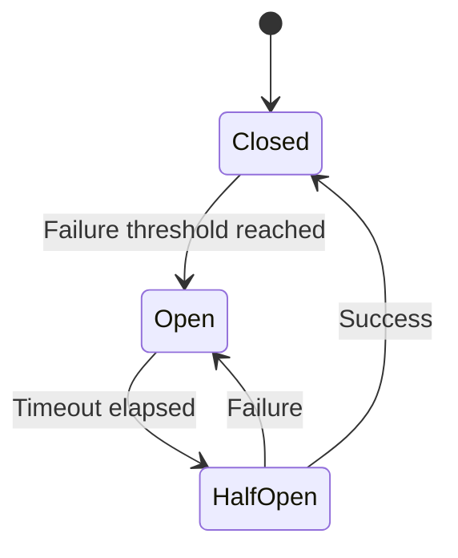

# Circuit Breaker Pattern - Fault Tolerance and Resilience

## Overview

The Circuit Breaker pattern prevents cascading failures in distributed systems by acting as a safety mechanism that stops calls to failing services and provides fallback behavior. It's inspired by electrical circuit breakers that protect electrical circuits from damage caused by overload or short circuits.

**Why Circuit Breaker is Important:**
- **Prevents Cascading Failures**: Stops one failing service from bringing down the entire system
- **Fast Failure**: Quickly detects and isolates failing services
- **Resource Protection**: Prevents wasted resources on calls that will likely fail
- **System Stability**: Maintains overall system stability during partial failures
- **Graceful Degradation**: Allows system to continue operating with reduced functionality

## Key Concepts

### **Closed State**: Normal operation, calls pass through
- **Description**: The circuit breaker is in its normal operating state
- **Behavior**: All calls to the protected service are allowed through
- **Monitoring**: Failure count is tracked and incremented on each failure
- **Transition**: Moves to Open state when failure threshold is reached
- **Performance**: No overhead on successful calls

### **Open State**: Service is failing, calls are blocked
- **Description**: The circuit breaker has detected too many failures and is blocking calls
- **Behavior**: All calls to the protected service are immediately rejected
- **Fallback**: Alternative behavior is provided (cached data, default values, error responses)
- **Duration**: Remains open for a configured timeout period
- **Transition**: Moves to Half-Open state after timeout expires

### **Half-Open State**: Testing if service has recovered
- **Description**: The circuit breaker is testing if the service has recovered
- **Behavior**: A limited number of calls are allowed through to test the service
- **Monitoring**: Success and failure counts are tracked
- **Transition**: Moves to Closed state on success, Open state on failure
- **Purpose**: Prevents immediate re-opening if service is still failing

### **Failure Threshold**: Number of failures before opening
- **Purpose**: Determines when to open the circuit breaker
- **Configuration**: Usually set based on expected failure rates
- **Types**: Can be consecutive failures or failures within a time window
- **Tuning**: Should be adjusted based on system characteristics and load

### **Timeout**: Time to wait before testing recovery
- **Purpose**: Determines how long to keep the circuit open
- **Configuration**: Should be long enough for the service to recover
- **Considerations**: Too short may not allow recovery, too long may impact user experience
- **Dynamic**: Can be adjusted based on service characteristics

### **Fallback**: Alternative behavior when circuit is open
- **Purpose**: Provides alternative behavior when the service is unavailable
- **Types**: Cached data, default values, error responses, alternative services
- **Design**: Should be designed to maintain system functionality
- **Performance**: Should be fast and reliable

## Circuit Breaker States



## Go Implementation

### **Detailed Implementation Explanation**

The Go implementation provides a thread-safe circuit breaker with configurable thresholds and timeouts. Here's a breakdown of the key components:

**Core Data Structures:**
- **CircuitState**: Enum representing the three states (Closed, Open, Half-Open)
- **CircuitBreakerConfig**: Configuration parameters for tuning the circuit breaker
- **CircuitBreaker**: Main struct containing state and configuration

**Thread Safety:**
- Uses `sync.RWMutex` for concurrent access protection
- Read locks for state queries, write locks for state changes
- Ensures atomic state transitions

**Configuration Parameters:**
- **FailureThreshold**: Number of consecutive failures before opening
- **SuccessThreshold**: Number of successes needed to close from half-open
- **Timeout**: Duration to wait before testing recovery
- **SleepWindow**: Time to wait before attempting recovery

```go
package main

import (
    "context"
    "fmt"
    "sync"
    "time"
)

// CircuitState represents the state of the circuit breaker
type CircuitState int

const (
    StateClosed CircuitState = iota
    StateOpen
    StateHalfOpen
)

// CircuitBreakerConfig represents the configuration
type CircuitBreakerConfig struct {
    FailureThreshold int           // Number of failures before opening
    SuccessThreshold int           // Number of successes to close from half-open
    Timeout         time.Duration // Timeout for individual calls
    SleepWindow     time.Duration // Time to wait before testing recovery
}

// CircuitBreaker represents a circuit breaker
type CircuitBreaker struct {
    config          *CircuitBreakerConfig
    state           CircuitState
    failureCount    int
    successCount    int
    lastFailureTime time.Time
    mutex           sync.RWMutex
}

// NewCircuitBreaker creates a new circuit breaker
func NewCircuitBreaker(config *CircuitBreakerConfig) *CircuitBreaker {
    return &CircuitBreaker{
        config: config,
        state:  StateClosed,
    }
}

// Execute executes a function with circuit breaker protection
// This is the main method that wraps function calls with circuit breaker logic
func (cb *CircuitBreaker) Execute(ctx context.Context, fn func() (interface{}, error)) (interface{}, error) {
    cb.mutex.Lock()
    defer cb.mutex.Unlock()
    
    // Check if circuit is open
    if cb.state == StateOpen {
        // If circuit is open, check if enough time has passed to test recovery
        if time.Since(cb.lastFailureTime) < cb.config.SleepWindow {
            return nil, fmt.Errorf("circuit breaker is open")
        }
        // Move to half-open state to test if service has recovered
        cb.state = StateHalfOpen
        cb.successCount = 0
    }
    
    // Execute the function with timeout protection
    result, err := fn()
    
    if err != nil {
        cb.onFailure()
        return nil, err
    }
    
    cb.onSuccess()
    return result, nil
}

// onSuccess handles successful execution
// This method is called when a function call succeeds
func (cb *CircuitBreaker) onSuccess() {
    cb.successCount++
    cb.failureCount = 0  // Reset failure count on success
    
    // If we're in half-open state and have enough successes, close the circuit
    if cb.state == StateHalfOpen && cb.successCount >= cb.config.SuccessThreshold {
        cb.state = StateClosed
        cb.successCount = 0  // Reset success count
    }
}

// onFailure handles failed execution
// This method is called when a function call fails
func (cb *CircuitBreaker) onFailure() {
    cb.failureCount++
    cb.successCount = 0  // Reset success count on failure
    cb.lastFailureTime = time.Now()
    
    // If we've reached the failure threshold, open the circuit
    if cb.failureCount >= cb.config.FailureThreshold {
        cb.state = StateOpen
        cb.failureCount = 0  // Reset failure count
    }
}

// GetState returns the current state
func (cb *CircuitBreaker) GetState() CircuitState {
    cb.mutex.RLock()
    defer cb.mutex.RUnlock()
    return cb.state
}

// Example usage
func main() {
    config := &CircuitBreakerConfig{
        FailureThreshold: 3,
        SuccessThreshold: 2,
        SleepWindow:      10 * time.Second,
    }
    
    cb := NewCircuitBreaker(config)
    
    // Simulate service calls
    for i := 0; i < 10; i++ {
        result, err := cb.Execute(context.Background(), func() (interface{}, error) {
            // Simulate service call
            if i < 5 {
                return nil, fmt.Errorf("service error")
            }
            return "success", nil
        })
        
        if err != nil {
            fmt.Printf("Attempt %d: Error - %v\n", i+1, err)
        } else {
            fmt.Printf("Attempt %d: Success - %v\n", i+1, result)
        }
        
        fmt.Printf("State: %v\n", cb.GetState())
    }
}
```

## Advanced Circuit Breaker Patterns

### **Hystrix-Style Circuit Breaker**
```go
// Advanced circuit breaker with Hystrix-style features
type HystrixCircuitBreaker struct {
    config          *CircuitBreakerConfig
    state           CircuitState
    failureCount    int
    successCount    int
    lastFailureTime time.Time
    requestCount    int64
    errorPercentage float64
    mutex           sync.RWMutex
}

// ExecuteWithFallback executes with fallback function
func (hcb *HystrixCircuitBreaker) ExecuteWithFallback(
    ctx context.Context,
    fn func() (interface{}, error),
    fallback func(error) (interface{}, error),
) (interface{}, error) {
    result, err := hcb.Execute(ctx, fn)
    if err != nil && fallback != nil {
        return fallback(err)
    }
    return result, err
}
```

### **Bulkhead Pattern Integration**
```go
// Circuit breaker with bulkhead pattern
type BulkheadCircuitBreaker struct {
    circuitBreakers map[string]*CircuitBreaker
    maxConcurrency  int
    semaphore       chan struct{}
    mutex           sync.RWMutex
}

// ExecuteWithBulkhead executes with concurrency control
func (bcb *BulkheadCircuitBreaker) ExecuteWithBulkhead(
    serviceName string,
    fn func() (interface{}, error),
) (interface{}, error) {
    // Acquire semaphore
    bcb.semaphore <- struct{}{}
    defer func() { <-bcb.semaphore }()
    
    // Get or create circuit breaker for service
    cb := bcb.getOrCreateCircuitBreaker(serviceName)
    return cb.Execute(context.Background(), fn)
}
```

### **Metrics and Monitoring**
```go
// Circuit breaker with metrics
type MetricsCircuitBreaker struct {
    *CircuitBreaker
    metrics *CircuitBreakerMetrics
}

type CircuitBreakerMetrics struct {
    TotalRequests     int64
    SuccessfulRequests int64
    FailedRequests    int64
    CircuitOpenTime   time.Duration
    LastFailureTime   time.Time
}

// GetMetrics returns current metrics
func (mcb *MetricsCircuitBreaker) GetMetrics() *CircuitBreakerMetrics {
    return mcb.metrics
}
```

## Benefits

### **Primary Benefits**
1. **Fault Tolerance**: Prevents cascading failures by isolating failing services
2. **Fast Failure**: Quickly detects and responds to failing services
3. **Recovery**: Automatic recovery testing through half-open state
4. **Fallback**: Provides alternative behavior when services are unavailable
5. **Resource Protection**: Prevents wasted resources on calls that will likely fail

### **Secondary Benefits**
- **System Stability**: Maintains overall system stability during partial failures
- **Graceful Degradation**: Allows system to continue operating with reduced functionality
- **Performance**: Reduces response times by avoiding calls to failing services
- **Monitoring**: Provides visibility into service health and failure patterns

## Use Cases

### **Microservices Architecture**
- **Service-to-Service Calls**: Protect against failing downstream services
- **API Gateway**: Protect against failing backend services
- **Load Balancing**: Handle unhealthy service instances
- **Service Mesh**: Implement circuit breaking at the network level

### **External Dependencies**
- **Third-Party APIs**: Handle external service failures
- **Payment Gateways**: Protect against payment service failures
- **Notification Services**: Handle email/SMS service failures
- **Data Providers**: Protect against external data source failures

### **Database Operations**
- **Database Connections**: Handle database connection failures
- **Query Timeouts**: Protect against slow or hanging queries
- **Connection Pool**: Handle connection pool exhaustion
- **Replica Failures**: Handle database replica failures

### **Network Operations**
- **HTTP Clients**: Handle network timeouts and failures
- **gRPC Calls**: Protect against gRPC service failures
- **Message Queues**: Handle message queue failures
- **Cache Operations**: Handle cache service failures

## Best Practices

### **Configuration Tuning**
1. **Failure Threshold**: Set based on expected failure rates and system characteristics
   - **Low Threshold (2-3)**: For critical services where failures are rare
   - **Medium Threshold (5-10)**: For services with occasional failures
   - **High Threshold (10+)**: For services with frequent transient failures

2. **Success Threshold**: Number of successes needed to close from half-open
   - **Conservative (1)**: Quick recovery but may reopen immediately
   - **Balanced (2-3)**: Good balance between recovery and stability
   - **Conservative (5+)**: Slower recovery but more stable

3. **Sleep Window**: Time to wait before testing recovery
   - **Short (5-10s)**: For services that recover quickly
   - **Medium (30-60s)**: For most services
   - **Long (2-5min)**: For services that take time to recover

### **Monitoring and Observability**
1. **Metrics Collection**: Track circuit breaker state, failure rates, and recovery times
2. **Alerting**: Set up alerts for circuit breaker state changes
3. **Dashboards**: Create dashboards to visualize circuit breaker health
4. **Logging**: Log state transitions and failure reasons

### **Testing Strategies**
1. **Unit Tests**: Test circuit breaker logic with mock failures
2. **Integration Tests**: Test with real service failures
3. **Chaos Engineering**: Intentionally fail services to test circuit breaker behavior
4. **Load Testing**: Test circuit breaker under high load conditions

### **Fallback Design**
1. **Cached Data**: Return cached data when service is unavailable
2. **Default Values**: Return sensible defaults for non-critical data
3. **Alternative Services**: Use backup services when primary is down
4. **Graceful Degradation**: Reduce functionality but maintain core features

## Common Pitfalls and Troubleshooting

### **Common Pitfalls**
1. **Incorrect Thresholds**: Setting thresholds too low or too high
   - **Solution**: Monitor failure patterns and adjust thresholds accordingly

2. **Poor Fallback Design**: Fallback behavior that doesn't maintain system functionality
   - **Solution**: Design fallbacks that provide meaningful alternatives

3. **Missing Monitoring**: Not tracking circuit breaker state and metrics
   - **Solution**: Implement comprehensive monitoring and alerting

4. **Inadequate Testing**: Not testing circuit breaker behavior under failure conditions
   - **Solution**: Implement chaos engineering and failure testing

### **Troubleshooting Guide**
1. **Circuit Stuck Open**: Circuit breaker remains open even when service recovers
   - **Check**: Sleep window configuration and success threshold
   - **Solution**: Adjust parameters or implement manual reset

2. **Circuit Opens Too Quickly**: Circuit breaker opens on transient failures
   - **Check**: Failure threshold and failure detection logic
   - **Solution**: Increase threshold or improve failure detection

3. **Circuit Doesn't Open**: Circuit breaker doesn't open when service fails
   - **Check**: Failure threshold and failure detection logic
   - **Solution**: Decrease threshold or improve failure detection

4. **Poor Performance**: Circuit breaker adds significant overhead
   - **Check**: Lock contention and state transition logic
   - **Solution**: Optimize locking and state management

## Interview Questions and Answers

### **Basic Questions**
1. **What is the Circuit Breaker pattern?**
   - **Answer**: A pattern that prevents cascading failures by blocking calls to failing services and providing fallback behavior. It acts as a safety mechanism in distributed systems.

2. **What are the three states of a circuit breaker?**
   - **Answer**: 
     - **Closed**: Normal operation, calls pass through
     - **Open**: Service is failing, calls are blocked
     - **Half-Open**: Testing if service has recovered

3. **How does a circuit breaker transition between states?**
   - **Answer**: 
     - Closed → Open: When failure threshold is reached
     - Open → Half-Open: After timeout period expires
     - Half-Open → Closed: When success threshold is reached
     - Half-Open → Open: When failure occurs during testing

### **Advanced Questions**
4. **How do you implement a circuit breaker in Go?**
   - **Answer**: Use a struct with state, counters, and mutex. Implement Execute method that checks state, executes function, and updates state based on success/failure.

5. **What are the key configuration parameters?**
   - **Answer**: Failure threshold, success threshold, timeout duration, and sleep window. These control when the circuit opens, closes, and how long to wait before testing recovery.

6. **How do you handle fallback behavior?**
   - **Answer**: Implement fallback functions that provide alternative behavior when the circuit is open. This can include cached data, default values, or alternative services.

7. **What are the trade-offs of using circuit breakers?**
   - **Answer**: 
     - **Pros**: Fault tolerance, fast failure, resource protection
     - **Cons**: Added complexity, potential for false positives, need for fallback design

8. **How do you monitor circuit breaker health?**
   - **Answer**: Track metrics like state transitions, failure rates, success rates, and recovery times. Use dashboards and alerting to monitor circuit breaker behavior.

### **Design Questions**
9. **How would you implement circuit breakers in a microservices architecture?**
   - **Answer**: Implement at service boundaries, use service mesh for network-level circuit breaking, and coordinate circuit breaker state across services.

10. **How do you handle circuit breaker state in a distributed system?**
    - **Answer**: Use distributed coordination mechanisms like etcd or Consul, or implement circuit breaker state sharing through service discovery.

## Performance Considerations

### **Time Complexity**
- **Execute**: O(1) for state checks and updates
- **State Transitions**: O(1) for state changes
- **Metrics Collection**: O(1) for metric updates

### **Space Complexity**
- **Circuit Breaker**: O(1) for basic implementation
- **Metrics**: O(1) for metric storage
- **Configuration**: O(1) for configuration storage

### **Optimization Tips**
1. **Minimize Lock Contention**: Use read locks for state queries, write locks only for state changes
2. **Efficient State Management**: Use atomic operations where possible
3. **Lazy Initialization**: Initialize circuit breakers only when needed
4. **Connection Pooling**: Reuse circuit breaker instances across requests