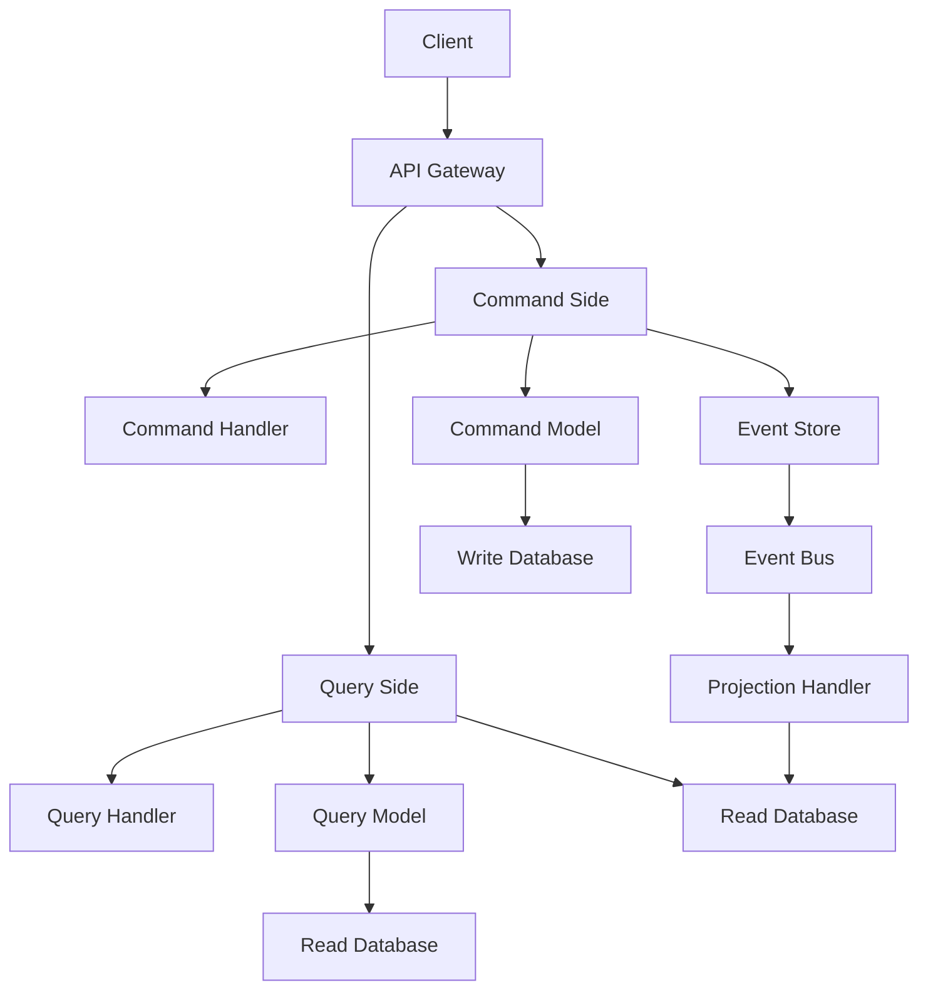

---
# Auto-generated front matter
Title: Cqrs Pattern
LastUpdated: 2025-11-06T20:45:57.711561
Tags: []
Status: draft
---

# CQRS Pattern - Command Query Responsibility Segregation

## Overview

CQRS (Command Query Responsibility Segregation) is a pattern that separates read and write operations for a data store. It allows for different models to be used for reading and writing, optimizing each for their specific use case.

## Key Concepts

- **Command**: Operations that modify data (writes)
- **Query**: Operations that retrieve data (reads)
- **Command Model**: Optimized for writes, maintains consistency
- **Query Model**: Optimized for reads, can be denormalized
- **Event Sourcing**: Often used with CQRS for event-driven architecture

## CQRS Architecture



## Go Implementation

```go
package main

import (
    "context"
    "encoding/json"
    "fmt"
    "log"
    "sync"
    "time"
)

// Command represents a write operation
type Command interface {
    GetType() string
    GetAggregateID() string
}

// Query represents a read operation
type Query interface {
    GetType() string
}

// Event represents a domain event
type Event interface {
    GetType() string
    GetAggregateID() string
    GetTimestamp() time.Time
}

// CommandHandler handles commands
type CommandHandler interface {
    Handle(ctx context.Context, cmd Command) error
}

// QueryHandler handles queries
type QueryHandler interface {
    Handle(ctx context.Context, query Query) (interface{}, error)
}

// EventHandler handles events
type EventHandler interface {
    Handle(ctx context.Context, event Event) error
}

// CommandBus routes commands to handlers
type CommandBus struct {
    handlers map[string]CommandHandler
    mutex    sync.RWMutex
}

// NewCommandBus creates a new command bus
func NewCommandBus() *CommandBus {
    return &CommandBus{
        handlers: make(map[string]CommandHandler),
    }
}

// RegisterHandler registers a command handler
func (cb *CommandBus) RegisterHandler(commandType string, handler CommandHandler) {
    cb.mutex.Lock()
    defer cb.mutex.Unlock()
    cb.handlers[commandType] = handler
}

// Handle handles a command
func (cb *CommandBus) Handle(ctx context.Context, cmd Command) error {
    cb.mutex.RLock()
    handler, exists := cb.handlers[cmd.GetType()]
    cb.mutex.RUnlock()
    
    if !exists {
        return fmt.Errorf("no handler found for command type: %s", cmd.GetType())
    }
    
    return handler.Handle(ctx, cmd)
}

// QueryBus routes queries to handlers
type QueryBus struct {
    handlers map[string]QueryHandler
    mutex    sync.RWMutex
}

// NewQueryBus creates a new query bus
func NewQueryBus() *QueryBus {
    return &QueryBus{
        handlers: make(map[string]QueryHandler),
    }
}

// RegisterHandler registers a query handler
func (qb *QueryBus) RegisterHandler(queryType string, handler QueryHandler) {
    qb.mutex.Lock()
    defer qb.mutex.Unlock()
    qb.handlers[queryType] = handler
}

// Handle handles a query
func (qb *QueryBus) Handle(ctx context.Context, query Query) (interface{}, error) {
    qb.mutex.RLock()
    handler, exists := qb.handlers[query.GetType()]
    qb.mutex.RUnlock()
    
    if !exists {
        return nil, fmt.Errorf("no handler found for query type: %s", query.GetType())
    }
    
    return handler.Handle(ctx, query)
}

// EventBus routes events to handlers
type EventBus struct {
    handlers map[string][]EventHandler
    mutex    sync.RWMutex
}

// NewEventBus creates a new event bus
func NewEventBus() *EventBus {
    return &EventBus{
        handlers: make(map[string][]EventHandler),
    }
}

// RegisterHandler registers an event handler
func (eb *EventBus) RegisterHandler(eventType string, handler EventHandler) {
    eb.mutex.Lock()
    defer eb.mutex.Unlock()
    eb.handlers[eventType] = append(eb.handlers[eventType], handler)
}

// Publish publishes an event
func (eb *EventBus) Publish(ctx context.Context, event Event) error {
    eb.mutex.RLock()
    handlers := eb.handlers[event.GetType()]
    eb.mutex.RUnlock()
    
    for _, handler := range handlers {
        if err := handler.Handle(ctx, event); err != nil {
            log.Printf("Error handling event %s: %v", event.GetType(), err)
        }
    }
    
    return nil
}

// Example: User Commands and Queries

// CreateUserCommand represents a command to create a user
type CreateUserCommand struct {
    UserID   string `json:"user_id"`
    Username string `json:"username"`
    Email    string `json:"email"`
}

func (c CreateUserCommand) GetType() string {
    return "CreateUser"
}

func (c CreateUserCommand) GetAggregateID() string {
    return c.UserID
}

// UpdateUserCommand represents a command to update a user
type UpdateUserCommand struct {
    UserID   string `json:"user_id"`
    Username string `json:"username"`
    Email    string `json:"email"`
}

func (c UpdateUserCommand) GetType() string {
    return "UpdateUser"
}

func (c UpdateUserCommand) GetAggregateID() string {
    return c.UserID
}

// GetUserQuery represents a query to get a user
type GetUserQuery struct {
    UserID string `json:"user_id"`
}

func (q GetUserQuery) GetType() string {
    return "GetUser"
}

// GetUsersQuery represents a query to get all users
type GetUsersQuery struct {
    Limit  int `json:"limit"`
    Offset int `json:"offset"`
}

func (q GetUsersQuery) GetType() string {
    return "GetUsers"
}

// UserCreatedEvent represents a user created event
type UserCreatedEvent struct {
    UserID    string    `json:"user_id"`
    Username  string    `json:"username"`
    Email     string    `json:"email"`
    Timestamp time.Time `json:"timestamp"`
}

func (e UserCreatedEvent) GetType() string {
    return "UserCreated"
}

func (e UserCreatedEvent) GetAggregateID() string {
    return e.UserID
}

func (e UserCreatedEvent) GetTimestamp() time.Time {
    return e.Timestamp
}

// UserUpdatedEvent represents a user updated event
type UserUpdatedEvent struct {
    UserID    string    `json:"user_id"`
    Username  string    `json:"username"`
    Email     string    `json:"email"`
    Timestamp time.Time `json:"timestamp"`
}

func (e UserUpdatedEvent) GetType() string {
    return "UserUpdated"
}

func (e UserUpdatedEvent) GetAggregateID() string {
    return e.UserID
}

func (e UserUpdatedEvent) GetTimestamp() time.Time {
    return e.Timestamp
}

// User represents a user aggregate
type User struct {
    UserID   string `json:"user_id"`
    Username string `json:"username"`
    Email    string `json:"email"`
    Version  int    `json:"version"`
}

// UserCommandHandler handles user commands
type UserCommandHandler struct {
    eventBus *EventBus
    users    map[string]*User
    mutex    sync.RWMutex
}

// NewUserCommandHandler creates a new user command handler
func NewUserCommandHandler(eventBus *EventBus) *UserCommandHandler {
    return &UserCommandHandler{
        eventBus: eventBus,
        users:    make(map[string]*User),
    }
}

// Handle handles user commands
func (h *UserCommandHandler) Handle(ctx context.Context, cmd Command) error {
    switch c := cmd.(type) {
    case CreateUserCommand:
        return h.handleCreateUser(ctx, c)
    case UpdateUserCommand:
        return h.handleUpdateUser(ctx, c)
    default:
        return fmt.Errorf("unknown command type: %T", cmd)
    }
}

// handleCreateUser handles create user command
func (h *UserCommandHandler) handleCreateUser(ctx context.Context, cmd CreateUserCommand) error {
    h.mutex.Lock()
    defer h.mutex.Unlock()
    
    // Check if user already exists
    if _, exists := h.users[cmd.UserID]; exists {
        return fmt.Errorf("user already exists")
    }
    
    // Create user
    user := &User{
        UserID:   cmd.UserID,
        Username: cmd.Username,
        Email:    cmd.Email,
        Version:  1,
    }
    
    h.users[cmd.UserID] = user
    
    // Publish event
    event := UserCreatedEvent{
        UserID:    cmd.UserID,
        Username:  cmd.Username,
        Email:     cmd.Email,
        Timestamp: time.Now(),
    }
    
    return h.eventBus.Publish(ctx, event)
}

// handleUpdateUser handles update user command
func (h *UserCommandHandler) handleUpdateUser(ctx context.Context, cmd UpdateUserCommand) error {
    h.mutex.Lock()
    defer h.mutex.Unlock()
    
    // Check if user exists
    user, exists := h.users[cmd.UserID]
    if !exists {
        return fmt.Errorf("user not found")
    }
    
    // Update user
    user.Username = cmd.Username
    user.Email = cmd.Email
    user.Version++
    
    // Publish event
    event := UserUpdatedEvent{
        UserID:    cmd.UserID,
        Username:  cmd.Username,
        Email:     cmd.Email,
        Timestamp: time.Now(),
    }
    
    return h.eventBus.Publish(ctx, event)
}

// UserQueryHandler handles user queries
type UserQueryHandler struct {
    users map[string]*User
    mutex sync.RWMutex
}

// NewUserQueryHandler creates a new user query handler
func NewUserQueryHandler() *UserQueryHandler {
    return &UserQueryHandler{
        users: make(map[string]*User),
    }
}

// Handle handles user queries
func (h *UserQueryHandler) Handle(ctx context.Context, query Query) (interface{}, error) {
    switch q := query.(type) {
    case GetUserQuery:
        return h.handleGetUser(ctx, q)
    case GetUsersQuery:
        return h.handleGetUsers(ctx, q)
    default:
        return nil, fmt.Errorf("unknown query type: %T", query)
    }
}

// handleGetUser handles get user query
func (h *UserQueryHandler) handleGetUser(ctx context.Context, query GetUserQuery) (*User, error) {
    h.mutex.RLock()
    defer h.mutex.RUnlock()
    
    user, exists := h.users[query.UserID]
    if !exists {
        return nil, fmt.Errorf("user not found")
    }
    
    return user, nil
}

// handleGetUsers handles get users query
func (h *UserQueryHandler) handleGetUsers(ctx context.Context, query GetUsersQuery) ([]*User, error) {
    h.mutex.RLock()
    defer h.mutex.RUnlock()
    
    var users []*User
    count := 0
    offset := query.Offset
    
    for _, user := range h.users {
        if count >= query.Limit {
            break
        }
        if offset > 0 {
            offset--
            continue
        }
        users = append(users, user)
        count++
    }
    
    return users, nil
}

// UserProjectionHandler handles user events for read model
type UserProjectionHandler struct {
    queryHandler *UserQueryHandler
}

// NewUserProjectionHandler creates a new user projection handler
func NewUserProjectionHandler(queryHandler *UserQueryHandler) *UserProjectionHandler {
    return &UserProjectionHandler{
        queryHandler: queryHandler,
    }
}

// Handle handles user events
func (h *UserProjectionHandler) Handle(ctx context.Context, event Event) error {
    switch e := event.(type) {
    case UserCreatedEvent:
        return h.handleUserCreated(ctx, e)
    case UserUpdatedEvent:
        return h.handleUserUpdated(ctx, e)
    default:
        return fmt.Errorf("unknown event type: %T", event)
    }
}

// handleUserCreated handles user created event
func (h *UserProjectionHandler) handleUserCreated(ctx context.Context, event UserCreatedEvent) error {
    h.queryHandler.mutex.Lock()
    defer h.queryHandler.mutex.Unlock()
    
    user := &User{
        UserID:   event.UserID,
        Username: event.Username,
        Email:    event.Email,
        Version:  1,
    }
    
    h.queryHandler.users[event.UserID] = user
    return nil
}

// handleUserUpdated handles user updated event
func (h *UserProjectionHandler) handleUserUpdated(ctx context.Context, event UserUpdatedEvent) error {
    h.queryHandler.mutex.Lock()
    defer h.queryHandler.mutex.Unlock()
    
    user, exists := h.queryHandler.users[event.UserID]
    if !exists {
        return fmt.Errorf("user not found in read model")
    }
    
    user.Username = event.Username
    user.Email = event.Email
    user.Version++
    
    return nil
}

// Example usage
func main() {
    // Create buses
    commandBus := NewCommandBus()
    queryBus := NewQueryBus()
    eventBus := NewEventBus()
    
    // Create handlers
    userCommandHandler := NewUserCommandHandler(eventBus)
    userQueryHandler := NewUserQueryHandler()
    userProjectionHandler := NewUserProjectionHandler(userQueryHandler)
    
    // Register handlers
    commandBus.RegisterHandler("CreateUser", userCommandHandler)
    commandBus.RegisterHandler("UpdateUser", userCommandHandler)
    queryBus.RegisterHandler("GetUser", userQueryHandler)
    queryBus.RegisterHandler("GetUsers", userQueryHandler)
    eventBus.RegisterHandler("UserCreated", userProjectionHandler)
    eventBus.RegisterHandler("UserUpdated", userProjectionHandler)
    
    ctx := context.Background()
    
    // Create a user
    createCmd := CreateUserCommand{
        UserID:   "user1",
        Username: "john_doe",
        Email:    "john@example.com",
    }
    
    if err := commandBus.Handle(ctx, createCmd); err != nil {
        log.Printf("Error creating user: %v", err)
    }
    
    // Update the user
    updateCmd := UpdateUserCommand{
        UserID:   "user1",
        Username: "john_doe_updated",
        Email:    "john.updated@example.com",
    }
    
    if err := commandBus.Handle(ctx, updateCmd); err != nil {
        log.Printf("Error updating user: %v", err)
    }
    
    // Query the user
    getUserQuery := GetUserQuery{UserID: "user1"}
    if user, err := queryBus.Handle(ctx, getUserQuery); err != nil {
        log.Printf("Error getting user: %v", err)
    } else {
        log.Printf("User: %+v", user)
    }
    
    // Query all users
    getUsersQuery := GetUsersQuery{Limit: 10, Offset: 0}
    if users, err := queryBus.Handle(ctx, getUsersQuery); err != nil {
        log.Printf("Error getting users: %v", err)
    } else {
        log.Printf("Users: %+v", users)
    }
}
```

## Node.js Implementation

```javascript
class CommandBus {
  constructor() {
    this.handlers = new Map();
  }

  registerHandler(commandType, handler) {
    this.handlers.set(commandType, handler);
  }

  async handle(command) {
    const handler = this.handlers.get(command.getType());
    if (!handler) {
      throw new Error(`No handler found for command type: ${command.getType()}`);
    }
    return await handler.handle(command);
  }
}

class QueryBus {
  constructor() {
    this.handlers = new Map();
  }

  registerHandler(queryType, handler) {
    this.handlers.set(queryType, handler);
  }

  async handle(query) {
    const handler = this.handlers.get(query.getType());
    if (!handler) {
      throw new Error(`No handler found for query type: ${query.getType()}`);
    }
    return await handler.handle(query);
  }
}

class EventBus {
  constructor() {
    this.handlers = new Map();
  }

  registerHandler(eventType, handler) {
    if (!this.handlers.has(eventType)) {
      this.handlers.set(eventType, []);
    }
    this.handlers.get(eventType).push(handler);
  }

  async publish(event) {
    const handlers = this.handlers.get(event.getType()) || [];
    for (const handler of handlers) {
      try {
        await handler.handle(event);
      } catch (error) {
        console.error(`Error handling event ${event.getType()}:`, error);
      }
    }
  }
}

// Example: User Commands and Queries
class CreateUserCommand {
  constructor(userId, username, email) {
    this.userId = userId;
    this.username = username;
    this.email = email;
  }

  getType() {
    return "CreateUser";
  }

  getAggregateId() {
    return this.userId;
  }
}

class UpdateUserCommand {
  constructor(userId, username, email) {
    this.userId = userId;
    this.username = username;
    this.email = email;
  }

  getType() {
    return "UpdateUser";
  }

  getAggregateId() {
    return this.userId;
  }
}

class GetUserQuery {
  constructor(userId) {
    this.userId = userId;
  }

  getType() {
    return "GetUser";
  }
}

class GetUsersQuery {
  constructor(limit, offset) {
    this.limit = limit;
    this.offset = offset;
  }

  getType() {
    return "GetUsers";
  }
}

class UserCreatedEvent {
  constructor(userId, username, email) {
    this.userId = userId;
    this.username = username;
    this.email = email;
    this.timestamp = new Date();
  }

  getType() {
    return "UserCreated";
  }

  getAggregateId() {
    return this.userId;
  }

  getTimestamp() {
    return this.timestamp;
  }
}

class UserUpdatedEvent {
  constructor(userId, username, email) {
    this.userId = userId;
    this.username = username;
    this.email = email;
    this.timestamp = new Date();
  }

  getType() {
    return "UserUpdated";
  }

  getAggregateId() {
    return this.userId;
  }

  getTimestamp() {
    return this.timestamp;
  }
}

class UserCommandHandler {
  constructor(eventBus) {
    this.eventBus = eventBus;
    this.users = new Map();
  }

  async handle(command) {
    switch (command.constructor.name) {
      case "CreateUserCommand":
        return await this.handleCreateUser(command);
      case "UpdateUserCommand":
        return await this.handleUpdateUser(command);
      default:
        throw new Error(`Unknown command type: ${command.constructor.name}`);
    }
  }

  async handleCreateUser(command) {
    if (this.users.has(command.userId)) {
      throw new Error("User already exists");
    }

    const user = {
      userId: command.userId,
      username: command.username,
      email: command.email,
      version: 1,
    };

    this.users.set(command.userId, user);

    const event = new UserCreatedEvent(
      command.userId,
      command.username,
      command.email
    );

    await this.eventBus.publish(event);
  }

  async handleUpdateUser(command) {
    if (!this.users.has(command.userId)) {
      throw new Error("User not found");
    }

    const user = this.users.get(command.userId);
    user.username = command.username;
    user.email = command.email;
    user.version++;

    const event = new UserUpdatedEvent(
      command.userId,
      command.username,
      command.email
    );

    await this.eventBus.publish(event);
  }
}

class UserQueryHandler {
  constructor() {
    this.users = new Map();
  }

  async handle(query) {
    switch (query.constructor.name) {
      case "GetUserQuery":
        return await this.handleGetUser(query);
      case "GetUsersQuery":
        return await this.handleGetUsers(query);
      default:
        throw new Error(`Unknown query type: ${query.constructor.name}`);
    }
  }

  async handleGetUser(query) {
    const user = this.users.get(query.userId);
    if (!user) {
      throw new Error("User not found");
    }
    return user;
  }

  async handleGetUsers(query) {
    const users = Array.from(this.users.values());
    return users.slice(query.offset, query.offset + query.limit);
  }
}

class UserProjectionHandler {
  constructor(queryHandler) {
    this.queryHandler = queryHandler;
  }

  async handle(event) {
    switch (event.constructor.name) {
      case "UserCreatedEvent":
        return await this.handleUserCreated(event);
      case "UserUpdatedEvent":
        return await this.handleUserUpdated(event);
      default:
        throw new Error(`Unknown event type: ${event.constructor.name}`);
    }
  }

  async handleUserCreated(event) {
    const user = {
      userId: event.userId,
      username: event.username,
      email: event.email,
      version: 1,
    };

    this.queryHandler.users.set(event.userId, user);
  }

  async handleUserUpdated(event) {
    const user = this.queryHandler.users.get(event.userId);
    if (!user) {
      throw new Error("User not found in read model");
    }

    user.username = event.username;
    user.email = event.email;
    user.version++;
  }
}

// Example usage
async function main() {
  const commandBus = new CommandBus();
  const queryBus = new QueryBus();
  const eventBus = new EventBus();

  const userCommandHandler = new UserCommandHandler(eventBus);
  const userQueryHandler = new UserQueryHandler();
  const userProjectionHandler = new UserProjectionHandler(userQueryHandler);

  commandBus.registerHandler("CreateUser", userCommandHandler);
  commandBus.registerHandler("UpdateUser", userCommandHandler);
  queryBus.registerHandler("GetUser", userQueryHandler);
  queryBus.registerHandler("GetUsers", userQueryHandler);
  eventBus.registerHandler("UserCreated", userProjectionHandler);
  eventBus.registerHandler("UserUpdated", userProjectionHandler);

  try {
    // Create a user
    const createCmd = new CreateUserCommand("user1", "john_doe", "john@example.com");
    await commandBus.handle(createCmd);

    // Update the user
    const updateCmd = new UpdateUserCommand("user1", "john_doe_updated", "john.updated@example.com");
    await commandBus.handle(updateCmd);

    // Query the user
    const getUserQuery = new GetUserQuery("user1");
    const user = await queryBus.handle(getUserQuery);
    console.log("User:", user);

    // Query all users
    const getUsersQuery = new GetUsersQuery(10, 0);
    const users = await queryBus.handle(getUsersQuery);
    console.log("Users:", users);
  } catch (error) {
    console.error("Error:", error.message);
  }
}

if (require.main === module) {
  main().catch(console.error);
}
```

## Benefits

1. **Separation of Concerns**: Clear separation between read and write operations
2. **Optimization**: Different models optimized for their specific use case
3. **Scalability**: Can scale read and write sides independently
4. **Flexibility**: Can use different databases for read and write models

## Trade-offs

1. **Complexity**: More complex than simple CRUD operations
2. **Consistency**: Eventual consistency between read and write models
3. **Data Duplication**: Data is duplicated between read and write models
4. **Eventual Consistency**: Read model may be slightly behind write model

## Use Cases

- **High-Read Applications**: Applications with many more reads than writes
- **Complex Queries**: Applications with complex read requirements
- **Microservices**: When different services have different data needs
- **Event-Driven Architecture**: When using event sourcing

## Best Practices

1. **Event Sourcing**: Use event sourcing for command side
2. **Projections**: Use projections to build read models
3. **Eventual Consistency**: Accept eventual consistency for better performance
4. **Monitoring**: Monitor both command and query sides
5. **Testing**: Test both sides independently

## Common Pitfalls

1. **Over-Engineering**: Don't use CQRS for simple applications
2. **Data Synchronization**: Ensure read and write models stay in sync
3. **Event Ordering**: Handle event ordering correctly
4. **Error Handling**: Handle errors in both command and query sides

## Interview Questions

1. **When would you use CQRS?**
   - When you have different read and write requirements
   - When you need to optimize for different use cases
   - When you have complex query requirements

2. **How do you handle consistency between read and write models?**
   - Use eventual consistency
   - Implement proper event handling
   - Use projections to build read models

3. **What are the challenges of implementing CQRS?**
   - Complexity of implementation
   - Data synchronization
   - Event ordering
   - Error handling

4. **How do you test CQRS systems?**
   - Test command and query sides independently
   - Test event handling
   - Test consistency between models

## Time Complexity

- **Command Processing**: O(1) for simple commands
- **Query Processing**: O(1) for simple queries
- **Event Processing**: O(n) where n is number of handlers

## Space Complexity

- **Command Storage**: O(n) where n is number of commands
- **Query Storage**: O(n) where n is number of queries
- **Event Storage**: O(n) where n is number of events

The optimal solution uses:
1. **Event Sourcing**: Use events for command side
2. **Projections**: Use projections for read side
3. **Proper Error Handling**: Handle errors gracefully
4. **Monitoring**: Monitor both sides for performance
