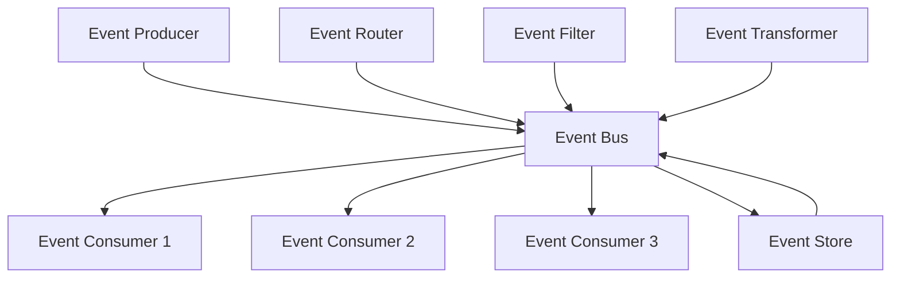

# Event-Driven Architecture - Asynchronous Communication Pattern

## Overview

Event-Driven Architecture (EDA) is a design pattern where the flow of the application is determined by events. It enables loose coupling between components and provides better scalability and responsiveness.

## Key Concepts

- **Event**: A significant change in state that other components need to know about
- **Event Producer**: Component that generates events
- **Event Consumer**: Component that processes events
- **Event Bus**: Central component that routes events
- **Event Store**: Persistent storage for events
- **Event Sourcing**: Storing events as the source of truth

## Event-Driven Architecture Types

### 1. Event Notification
- Simple event notifications
- Fire-and-forget pattern
- Minimal coupling
- No event persistence

### 2. Event Carrying State Transfer
- Events carry state information
- More coupling between components
- Better for data synchronization
- Requires event persistence

### 3. Event Sourcing
- Events are the source of truth
- Complete audit trail
- Time travel capabilities
- Complex to implement

## Event-Driven Architecture Flow



## Go Implementation

```go
package main

import (
    "context"
    "encoding/json"
    "fmt"
    "log"
    "sync"
    "time"
)

// Event represents a domain event
type Event struct {
    ID          string                 `json:"id"`
    Type        string                 `json:"type"`
    Source      string                 `json:"source"`
    Data        map[string]interface{} `json:"data"`
    Timestamp   time.Time              `json:"timestamp"`
    Version     int                    `json:"version"`
    CorrelationID string              `json:"correlation_id"`
}

// EventHandler handles events
type EventHandler interface {
    Handle(ctx context.Context, event Event) error
    GetEventType() string
}

// EventBus manages event routing
type EventBus struct {
    handlers    map[string][]EventHandler
    subscribers map[string][]string
    mutex       sync.RWMutex
    eventStore  EventStore
}

// EventStore stores events
type EventStore interface {
    Save(event Event) error
    GetByID(id string) (Event, error)
    GetByType(eventType string) ([]Event, error)
    GetByCorrelationID(correlationID string) ([]Event, error)
}

// InMemoryEventStore implements EventStore in memory
type InMemoryEventStore struct {
    events map[string]Event
    mutex  sync.RWMutex
}

// NewInMemoryEventStore creates a new in-memory event store
func NewInMemoryEventStore() *InMemoryEventStore {
    return &InMemoryEventStore{
        events: make(map[string]Event),
    }
}

// Save saves an event
func (es *InMemoryEventStore) Save(event Event) error {
    es.mutex.Lock()
    defer es.mutex.Unlock()
    
    es.events[event.ID] = event
    return nil
}

// GetByID gets an event by ID
func (es *InMemoryEventStore) GetByID(id string) (Event, error) {
    es.mutex.RLock()
    defer es.mutex.RUnlock()
    
    event, exists := es.events[id]
    if !exists {
        return Event{}, fmt.Errorf("event %s not found", id)
    }
    
    return event, nil
}

// GetByType gets events by type
func (es *InMemoryEventStore) GetByType(eventType string) ([]Event, error) {
    es.mutex.RLock()
    defer es.mutex.RUnlock()
    
    var events []Event
    for _, event := range es.events {
        if event.Type == eventType {
            events = append(events, event)
        }
    }
    
    return events, nil
}

// GetByCorrelationID gets events by correlation ID
func (es *InMemoryEventStore) GetByCorrelationID(correlationID string) ([]Event, error) {
    es.mutex.RLock()
    defer es.mutex.RUnlock()
    
    var events []Event
    for _, event := range es.events {
        if event.CorrelationID == correlationID {
            events = append(events, event)
        }
    }
    
    return events, nil
}

// NewEventBus creates a new event bus
func NewEventBus(eventStore EventStore) *EventBus {
    return &EventBus{
        handlers:    make(map[string][]EventHandler),
        subscribers: make(map[string][]string),
        eventStore:  eventStore,
    }
}

// Subscribe subscribes a handler to an event type
func (eb *EventBus) Subscribe(eventType string, handler EventHandler) {
    eb.mutex.Lock()
    defer eb.mutex.Unlock()
    
    eb.handlers[eventType] = append(eb.handlers[eventType], handler)
}

// Publish publishes an event
func (eb *EventBus) Publish(ctx context.Context, event Event) error {
    // Save event to store
    if err := eb.eventStore.Save(event); err != nil {
        return fmt.Errorf("failed to save event: %v", err)
    }
    
    // Get handlers for event type
    eb.mutex.RLock()
    handlers := eb.handlers[event.Type]
    eb.mutex.RUnlock()
    
    // Process event with handlers
    for _, handler := range handlers {
        go func(h EventHandler) {
            if err := h.Handle(ctx, event); err != nil {
                log.Printf("Error handling event %s: %v", event.ID, err)
            }
        }(handler)
    }
    
    log.Printf("Event %s published successfully", event.ID)
    return nil
}

// EventProducer produces events
type EventProducer struct {
    eventBus *EventBus
    source   string
}

// NewEventProducer creates a new event producer
func NewEventProducer(eventBus *EventBus, source string) *EventProducer {
    return &EventProducer{
        eventBus: eventBus,
        source:   source,
    }
}

// ProduceEvent produces an event
func (ep *EventProducer) ProduceEvent(ctx context.Context, eventType string, data map[string]interface{}, correlationID string) error {
    event := Event{
        ID:            fmt.Sprintf("event_%d", time.Now().UnixNano()),
        Type:          eventType,
        Source:        ep.source,
        Data:          data,
        Timestamp:     time.Now(),
        Version:       1,
        CorrelationID: correlationID,
    }
    
    return ep.eventBus.Publish(ctx, event)
}

// Example: User Events and Handlers

// UserCreatedEvent represents a user created event
type UserCreatedEvent struct {
    UserID   string `json:"user_id"`
    Username string `json:"username"`
    Email    string `json:"email"`
}

// UserUpdatedEvent represents a user updated event
type UserUpdatedEvent struct {
    UserID   string `json:"user_id"`
    Username string `json:"username"`
    Email    string `json:"email"`
}

// UserDeletedEvent represents a user deleted event
type UserDeletedEvent struct {
    UserID string `json:"user_id"`
}

// UserEventHandler handles user events
type UserEventHandler struct {
    name string
}

// NewUserEventHandler creates a new user event handler
func NewUserEventHandler(name string) *UserEventHandler {
    return &UserEventHandler{name: name}
}

// Handle handles user events
func (h *UserEventHandler) Handle(ctx context.Context, event Event) error {
    log.Printf("Handler %s processing event %s of type %s", h.name, event.ID, event.Type)
    
    switch event.Type {
    case "UserCreated":
        return h.handleUserCreated(event)
    case "UserUpdated":
        return h.handleUserUpdated(event)
    case "UserDeleted":
        return h.handleUserDeleted(event)
    default:
        log.Printf("Unknown event type: %s", event.Type)
        return nil
    }
}

// GetEventType returns the event type this handler processes
func (h *UserEventHandler) GetEventType() string {
    return "UserEvent"
}

// handleUserCreated handles user created events
func (h *UserEventHandler) handleUserCreated(event Event) error {
    log.Printf("Handler %s: User created - %+v", h.name, event.Data)
    
    // Simulate some processing
    time.Sleep(100 * time.Millisecond)
    
    return nil
}

// handleUserUpdated handles user updated events
func (h *UserEventHandler) handleUserUpdated(event Event) error {
    log.Printf("Handler %s: User updated - %+v", h.name, event.Data)
    
    // Simulate some processing
    time.Sleep(100 * time.Millisecond)
    
    return nil
}

// handleUserDeleted handles user deleted events
func (h *UserEventHandler) handleUserDeleted(event Event) error {
    log.Printf("Handler %s: User deleted - %+v", h.name, event.Data)
    
    // Simulate some processing
    time.Sleep(100 * time.Millisecond)
    
    return nil
}

// EmailEventHandler handles email events
type EmailEventHandler struct {
    name string
}

// NewEmailEventHandler creates a new email event handler
func NewEmailEventHandler(name string) *EmailEventHandler {
    return &EmailEventHandler{name: name}
}

// Handle handles email events
func (h *EmailEventHandler) Handle(ctx context.Context, event Event) error {
    log.Printf("Email handler %s processing event %s of type %s", h.name, event.ID, event.Type)
    
    switch event.Type {
    case "UserCreated":
        return h.sendWelcomeEmail(event)
    case "UserUpdated":
        return h.sendUpdateEmail(event)
    case "UserDeleted":
        return h.sendGoodbyeEmail(event)
    default:
        log.Printf("Unknown event type: %s", event.Type)
        return nil
    }
}

// GetEventType returns the event type this handler processes
func (h *EmailEventHandler) GetEventType() string {
    return "EmailEvent"
}

// sendWelcomeEmail sends a welcome email
func (h *EmailEventHandler) sendWelcomeEmail(event Event) error {
    log.Printf("Email handler %s: Sending welcome email to %s", h.name, event.Data["email"])
    
    // Simulate email sending
    time.Sleep(200 * time.Millisecond)
    
    return nil
}

// sendUpdateEmail sends an update email
func (h *EmailEventHandler) sendUpdateEmail(event Event) error {
    log.Printf("Email handler %s: Sending update email to %s", h.name, event.Data["email"])
    
    // Simulate email sending
    time.Sleep(200 * time.Millisecond)
    
    return nil
}

// sendGoodbyeEmail sends a goodbye email
func (h *EmailEventHandler) sendGoodbyeEmail(event Event) error {
    log.Printf("Email handler %s: Sending goodbye email to %s", h.name, event.Data["email"])
    
    // Simulate email sending
    time.Sleep(200 * time.Millisecond)
    
    return nil
}

// EventRouter routes events based on rules
type EventRouter struct {
    rules map[string][]string
    mutex sync.RWMutex
}

// NewEventRouter creates a new event router
func NewEventRouter() *EventRouter {
    return &EventRouter{
        rules: make(map[string][]string),
    }
}

// AddRule adds a routing rule
func (er *EventRouter) AddRule(eventType string, handlerTypes []string) {
    er.mutex.Lock()
    defer er.mutex.Unlock()
    
    er.rules[eventType] = handlerTypes
}

// GetHandlersForEvent gets handlers for an event type
func (er *EventRouter) GetHandlersForEvent(eventType string) []string {
    er.mutex.RLock()
    defer er.mutex.RUnlock()
    
    return er.rules[eventType]
}

// Example usage
func main() {
    // Create event store
    eventStore := NewInMemoryEventStore()
    
    // Create event bus
    eventBus := NewEventBus(eventStore)
    
    // Create event producer
    producer := NewEventProducer(eventBus, "user-service")
    
    // Create event handlers
    userHandler1 := NewUserEventHandler("user-handler-1")
    userHandler2 := NewUserEventHandler("user-handler-2")
    emailHandler := NewEmailEventHandler("email-handler")
    
    // Subscribe handlers to events
    eventBus.Subscribe("UserCreated", userHandler1)
    eventBus.Subscribe("UserCreated", userHandler2)
    eventBus.Subscribe("UserCreated", emailHandler)
    
    eventBus.Subscribe("UserUpdated", userHandler1)
    eventBus.Subscribe("UserUpdated", emailHandler)
    
    eventBus.Subscribe("UserDeleted", userHandler1)
    eventBus.Subscribe("UserDeleted", emailHandler)
    
    // Create event router
    router := NewEventRouter()
    router.AddRule("UserCreated", []string{"user-handler-1", "user-handler-2", "email-handler"})
    router.AddRule("UserUpdated", []string{"user-handler-1", "email-handler"})
    router.AddRule("UserDeleted", []string{"user-handler-1", "email-handler"})
    
    ctx := context.Background()
    
    // Produce events
    log.Println("Producing events...")
    
    // User created event
    err := producer.ProduceEvent(ctx, "UserCreated", map[string]interface{}{
        "user_id": "user1",
        "username": "john_doe",
        "email": "john@example.com",
    }, "correlation-1")
    if err != nil {
        log.Printf("Error producing event: %v", err)
    }
    
    // User updated event
    err = producer.ProduceEvent(ctx, "UserUpdated", map[string]interface{}{
        "user_id": "user1",
        "username": "john_doe_updated",
        "email": "john.updated@example.com",
    }, "correlation-1")
    if err != nil {
        log.Printf("Error producing event: %v", err)
    }
    
    // User deleted event
    err = producer.ProduceEvent(ctx, "UserDeleted", map[string]interface{}{
        "user_id": "user1",
    }, "correlation-1")
    if err != nil {
        log.Printf("Error producing event: %v", err)
    }
    
    // Wait for events to be processed
    time.Sleep(2 * time.Second)
    
    // Query events from store
    log.Println("Querying events from store...")
    
    events, err := eventStore.GetByType("UserCreated")
    if err != nil {
        log.Printf("Error querying events: %v", err)
    } else {
        log.Printf("Found %d UserCreated events", len(events))
    }
    
    events, err = eventStore.GetByCorrelationID("correlation-1")
    if err != nil {
        log.Printf("Error querying events: %v", err)
    } else {
        log.Printf("Found %d events with correlation ID correlation-1", len(events))
    }
}
```

## Node.js Implementation

```javascript
class Event {
  constructor(id, type, source, data, correlationId) {
    this.id = id;
    this.type = type;
    this.source = source;
    this.data = data;
    this.timestamp = new Date();
    this.version = 1;
    this.correlationId = correlationId;
  }
}

class EventStore {
  constructor() {
    this.events = new Map();
  }

  save(event) {
    this.events.set(event.id, event);
  }

  getById(id) {
    return this.events.get(id);
  }

  getByType(type) {
    const events = [];
    for (const event of this.events.values()) {
      if (event.type === type) {
        events.push(event);
      }
    }
    return events;
  }

  getByCorrelationId(correlationId) {
    const events = [];
    for (const event of this.events.values()) {
      if (event.correlationId === correlationId) {
        events.push(event);
      }
    }
    return events;
  }
}

class EventBus {
  constructor(eventStore) {
    this.handlers = new Map();
    this.eventStore = eventStore;
  }

  subscribe(eventType, handler) {
    if (!this.handlers.has(eventType)) {
      this.handlers.set(eventType, []);
    }
    this.handlers.get(eventType).push(handler);
  }

  async publish(event) {
    // Save event to store
    this.eventStore.save(event);

    // Get handlers for event type
    const handlers = this.handlers.get(event.type) || [];

    // Process event with handlers
    for (const handler of handlers) {
      try {
        await handler.handle(event);
      } catch (error) {
        console.error(`Error handling event ${event.id}:`, error);
      }
    }

    console.log(`Event ${event.id} published successfully`);
  }
}

class EventProducer {
  constructor(eventBus, source) {
    this.eventBus = eventBus;
    this.source = source;
  }

  async produceEvent(eventType, data, correlationId) {
    const event = new Event(
      `event_${Date.now()}`,
      eventType,
      this.source,
      data,
      correlationId
    );

    await this.eventBus.publish(event);
  }
}

class UserEventHandler {
  constructor(name) {
    this.name = name;
  }

  async handle(event) {
    console.log(`Handler ${this.name} processing event ${event.id} of type ${event.type}`);

    switch (event.type) {
      case 'UserCreated':
        return await this.handleUserCreated(event);
      case 'UserUpdated':
        return await this.handleUserUpdated(event);
      case 'UserDeleted':
        return await this.handleUserDeleted(event);
      default:
        console.log(`Unknown event type: ${event.type}`);
        return;
    }
  }

  async handleUserCreated(event) {
    console.log(`Handler ${this.name}: User created -`, event.data);
    await new Promise(resolve => setTimeout(resolve, 100));
  }

  async handleUserUpdated(event) {
    console.log(`Handler ${this.name}: User updated -`, event.data);
    await new Promise(resolve => setTimeout(resolve, 100));
  }

  async handleUserDeleted(event) {
    console.log(`Handler ${this.name}: User deleted -`, event.data);
    await new Promise(resolve => setTimeout(resolve, 100));
  }
}

class EmailEventHandler {
  constructor(name) {
    this.name = name;
  }

  async handle(event) {
    console.log(`Email handler ${this.name} processing event ${event.id} of type ${event.type}`);

    switch (event.type) {
      case 'UserCreated':
        return await this.sendWelcomeEmail(event);
      case 'UserUpdated':
        return await this.sendUpdateEmail(event);
      case 'UserDeleted':
        return await this.sendGoodbyeEmail(event);
      default:
        console.log(`Unknown event type: ${event.type}`);
        return;
    }
  }

  async sendWelcomeEmail(event) {
    console.log(`Email handler ${this.name}: Sending welcome email to ${event.data.email}`);
    await new Promise(resolve => setTimeout(resolve, 200));
  }

  async sendUpdateEmail(event) {
    console.log(`Email handler ${this.name}: Sending update email to ${event.data.email}`);
    await new Promise(resolve => setTimeout(resolve, 200));
  }

  async sendGoodbyeEmail(event) {
    console.log(`Email handler ${this.name}: Sending goodbye email to ${event.data.email}`);
    await new Promise(resolve => setTimeout(resolve, 200));
  }
}

// Example usage
async function main() {
  // Create event store
  const eventStore = new EventStore();

  // Create event bus
  const eventBus = new EventBus(eventStore);

  // Create event producer
  const producer = new EventProducer(eventBus, 'user-service');

  // Create event handlers
  const userHandler1 = new UserEventHandler('user-handler-1');
  const userHandler2 = new UserEventHandler('user-handler-2');
  const emailHandler = new EmailEventHandler('email-handler');

  // Subscribe handlers to events
  eventBus.subscribe('UserCreated', userHandler1);
  eventBus.subscribe('UserCreated', userHandler2);
  eventBus.subscribe('UserCreated', emailHandler);

  eventBus.subscribe('UserUpdated', userHandler1);
  eventBus.subscribe('UserUpdated', emailHandler);

  eventBus.subscribe('UserDeleted', userHandler1);
  eventBus.subscribe('UserDeleted', emailHandler);

  // Produce events
  console.log('Producing events...');

  // User created event
  await producer.produceEvent('UserCreated', {
    user_id: 'user1',
    username: 'john_doe',
    email: 'john@example.com',
  }, 'correlation-1');

  // User updated event
  await producer.produceEvent('UserUpdated', {
    user_id: 'user1',
    username: 'john_doe_updated',
    email: 'john.updated@example.com',
  }, 'correlation-1');

  // User deleted event
  await producer.produceEvent('UserDeleted', {
    user_id: 'user1',
  }, 'correlation-1');

  // Wait for events to be processed
  await new Promise(resolve => setTimeout(resolve, 2000));

  // Query events from store
  console.log('Querying events from store...');

  const events = eventStore.getByType('UserCreated');
  console.log(`Found ${events.length} UserCreated events`);

  const correlationEvents = eventStore.getByCorrelationId('correlation-1');
  console.log(`Found ${correlationEvents.length} events with correlation ID correlation-1`);
}

if (require.main === module) {
  main().catch(console.error);
}
```

## Benefits

1. **Loose Coupling**: Components are decoupled from each other
2. **Scalability**: Easy to add new consumers
3. **Flexibility**: Easy to change event processing logic
4. **Auditability**: Complete event history
5. **Resilience**: Fault tolerance through event replay

## Trade-offs

1. **Complexity**: More complex than synchronous communication
2. **Eventual Consistency**: Not immediately consistent
3. **Debugging**: Harder to debug due to asynchronous nature
4. **Event Ordering**: May need to handle event ordering

## Use Cases

- **Microservices**: Communication between services
- **Event Sourcing**: Storing events as source of truth
- **Real-time Systems**: Processing real-time events
- **Integration**: Integrating different systems

## Best Practices

1. **Event Design**: Design events carefully
2. **Idempotency**: Make event handlers idempotent
3. **Error Handling**: Handle errors gracefully
4. **Monitoring**: Monitor event processing
5. **Testing**: Test event handlers thoroughly

## Common Pitfalls

1. **Event Spaghetti**: Too many events and handlers
2. **Event Ordering**: Not handling event ordering correctly
3. **Error Handling**: Not handling errors properly
4. **Performance**: Not considering performance implications

## Interview Questions

1. **What are the benefits of event-driven architecture?**
   - Loose coupling, scalability, flexibility, auditability

2. **How do you handle event ordering?**
   - Use event versioning, timestamps, or sequence numbers

3. **What's the difference between event notification and event sourcing?**
   - Event notification is fire-and-forget, event sourcing stores events as source of truth

4. **How do you ensure event delivery?**
   - Use message queues, acknowledgments, and retry mechanisms

## Time Complexity

- **Event Publishing**: O(1) for simple events
- **Event Processing**: O(n) where n is number of handlers
- **Event Querying**: O(n) where n is number of events

## Space Complexity

- **Event Storage**: O(n) where n is number of events
- **Handler Storage**: O(m) where m is number of handlers
- **Event Bus**: O(1) for basic operations

The optimal solution uses:
1. **Proper Event Design**: Design events with clear structure
2. **Idempotent Handlers**: Make handlers idempotent
3. **Error Handling**: Handle errors gracefully
4. **Monitoring**: Monitor event processing and performance
