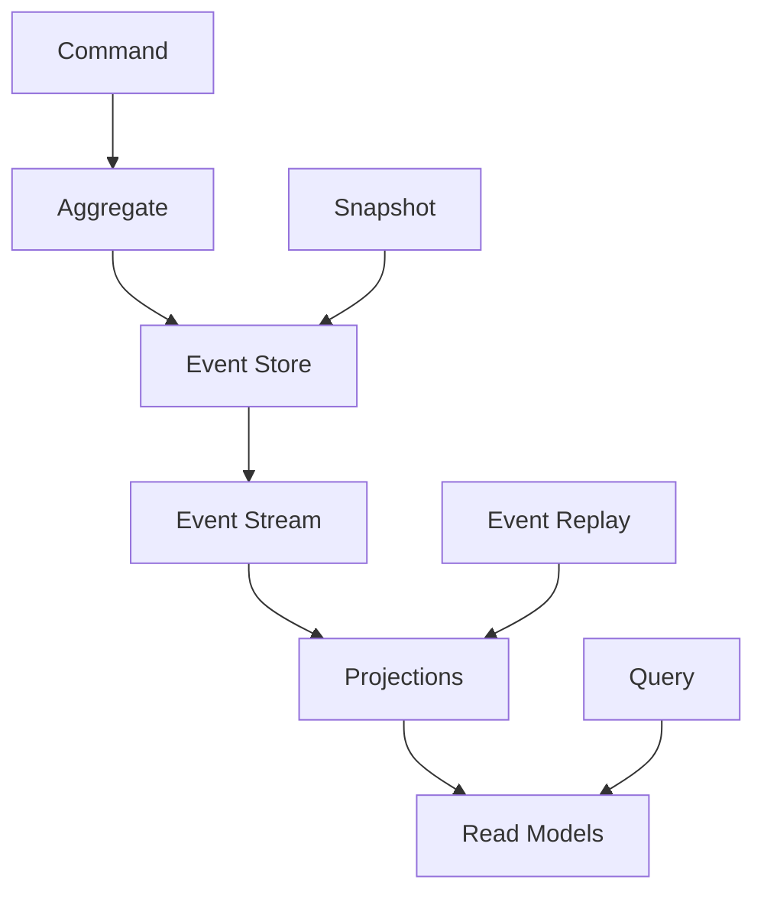
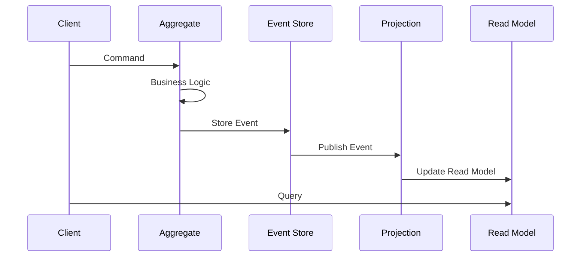

# Event Sourcing Pattern

## 📘 Theory

Event Sourcing is a design pattern that stores the state of an application as a sequence of events rather than storing the current state. Instead of updating records in a database, you append events to an event store. This provides a complete audit trail and enables time-travel debugging.

### Key Concepts:

- **Event Store**: Immutable log of all events
- **Aggregates**: Domain objects that handle business logic
- **Projections**: Read models built from events
- **Snapshots**: Periodic state captures for performance
- **Event Replay**: Rebuilding state from events
- **CQRS**: Command Query Responsibility Segregation

### Benefits:

- Complete audit trail
- Time-travel debugging
- Scalable read models
- Event replay capabilities
- Decoupled systems

## 📊 Diagrams

### Event Sourcing Architecture



### Event Flow



## 🧩 Example

E-commerce order management system:

**Events:**

- OrderCreated
- OrderItemAdded
- OrderItemRemoved
- OrderConfirmed
- OrderShipped
- OrderDelivered

**Commands:**

- CreateOrder
- AddItem
- RemoveItem
- ConfirmOrder
- ShipOrder

## 💻 Implementation (Golang)

```go
package main

import (
    "encoding/json"
    "fmt"
    "time"
    "sync"
)

// Event represents a domain event
type Event struct {
    ID        string    `json:"id"`
    Type      string    `json:"type"`
    AggregateID string  `json:"aggregate_id"`
    Version   int       `json:"version"`
    Data      json.RawMessage `json:"data"`
    Timestamp time.Time `json:"timestamp"`
}

// EventStore interface for storing events
type EventStore interface {
    SaveEvents(aggregateID string, events []Event, expectedVersion int) error
    GetEvents(aggregateID string) ([]Event, error)
    GetEventsFromVersion(aggregateID string, fromVersion int) ([]Event, error)
}

// InMemoryEventStore implements EventStore
type InMemoryEventStore struct {
    events map[string][]Event
    mutex  sync.RWMutex
}

func NewInMemoryEventStore() *InMemoryEventStore {
    return &InMemoryEventStore{
        events: make(map[string][]Event),
    }
}

func (es *InMemoryEventStore) SaveEvents(aggregateID string, events []Event, expectedVersion int) error {
    es.mutex.Lock()
    defer es.mutex.Unlock()

    existingEvents := es.events[aggregateID]
    if len(existingEvents) != expectedVersion {
        return fmt.Errorf("concurrent modification detected")
    }

    for i, event := range events {
        event.Version = expectedVersion + i + 1
        event.Timestamp = time.Now()
    }

    es.events[aggregateID] = append(existingEvents, events...)
    return nil
}

func (es *InMemoryEventStore) GetEvents(aggregateID string) ([]Event, error) {
    es.mutex.RLock()
    defer es.mutex.RUnlock()

    events := es.events[aggregateID]
    return events, nil
}

func (es *InMemoryEventStore) GetEventsFromVersion(aggregateID string, fromVersion int) ([]Event, error) {
    es.mutex.RLock()
    defer es.mutex.RUnlock()

    events := es.events[aggregateID]
    if fromVersion >= len(events) {
        return []Event{}, nil
    }

    return events[fromVersion:], nil
}

// Order aggregate
type Order struct {
    ID          string
    CustomerID  string
    Items       []OrderItem
    Status      string
    Version     int
    eventStore  EventStore
}

type OrderItem struct {
    ProductID string
    Quantity  int
    Price     float64
}

// Order events
type OrderCreated struct {
    OrderID    string `json:"order_id"`
    CustomerID string `json:"customer_id"`
}

type OrderItemAdded struct {
    ProductID string  `json:"product_id"`
    Quantity  int     `json:"quantity"`
    Price     float64 `json:"price"`
}

type OrderItemRemoved struct {
    ProductID string `json:"product_id"`
}

type OrderConfirmed struct {
    ConfirmedAt time.Time `json:"confirmed_at"`
}

type OrderShipped struct {
    TrackingNumber string    `json:"tracking_number"`
    ShippedAt      time.Time `json:"shipped_at"`
}

// Order commands
type CreateOrderCommand struct {
    OrderID    string
    CustomerID string
}

type AddItemCommand struct {
    ProductID string
    Quantity  int
    Price     float64
}

type RemoveItemCommand struct {
    ProductID string
}

type ConfirmOrderCommand struct{}

type ShipOrderCommand struct {
    TrackingNumber string
}

// NewOrder creates a new order aggregate
func NewOrder(id, customerID string, eventStore EventStore) *Order {
    return &Order{
        ID:         id,
        CustomerID: customerID,
        Items:      []OrderItem{},
        Status:     "Draft",
        Version:    0,
        eventStore: eventStore,
    }
}

// LoadOrder loads an order from events
func LoadOrder(id string, eventStore EventStore) (*Order, error) {
    events, err := eventStore.GetEvents(id)
    if err != nil {
        return nil, err
    }

    order := &Order{
        ID:         id,
        Items:      []OrderItem{},
        Status:     "Draft",
        Version:    0,
        eventStore: eventStore,
    }

    for _, event := range events {
        order.applyEvent(event)
    }

    return order, nil
}

// CreateOrder creates a new order
func (o *Order) CreateOrder(cmd CreateOrderCommand) error {
    if o.Status != "" {
        return fmt.Errorf("order already exists")
    }

    event := Event{
        ID:          fmt.Sprintf("order-created-%d", time.Now().UnixNano()),
        Type:        "OrderCreated",
        AggregateID: o.ID,
        Data:        marshalEvent(OrderCreated{
            OrderID:    cmd.OrderID,
            CustomerID: cmd.CustomerID,
        }),
    }

    return o.saveEvent(event)
}

// AddItem adds an item to the order
func (o *Order) AddItem(cmd AddItemCommand) error {
    if o.Status != "Draft" {
        return fmt.Errorf("cannot add items to non-draft order")
    }

    event := Event{
        ID:          fmt.Sprintf("order-item-added-%d", time.Now().UnixNano()),
        Type:        "OrderItemAdded",
        AggregateID: o.ID,
        Data:        marshalEvent(OrderItemAdded{
            ProductID: cmd.ProductID,
            Quantity:  cmd.Quantity,
            Price:     cmd.Price,
        }),
    }

    return o.saveEvent(event)
}

// RemoveItem removes an item from the order
func (o *Order) RemoveItem(cmd RemoveItemCommand) error {
    if o.Status != "Draft" {
        return fmt.Errorf("cannot remove items from non-draft order")
    }

    // Check if item exists
    found := false
    for _, item := range o.Items {
        if item.ProductID == cmd.ProductID {
            found = true
            break
        }
    }

    if !found {
        return fmt.Errorf("item not found in order")
    }

    event := Event{
        ID:          fmt.Sprintf("order-item-removed-%d", time.Now().UnixNano()),
        Type:        "OrderItemRemoved",
        AggregateID: o.ID,
        Data:        marshalEvent(OrderItemRemoved{
            ProductID: cmd.ProductID,
        }),
    }

    return o.saveEvent(event)
}

// ConfirmOrder confirms the order
func (o *Order) ConfirmOrder(cmd ConfirmOrderCommand) error {
    if o.Status != "Draft" {
        return fmt.Errorf("order is not in draft status")
    }

    if len(o.Items) == 0 {
        return fmt.Errorf("cannot confirm empty order")
    }

    event := Event{
        ID:          fmt.Sprintf("order-confirmed-%d", time.Now().UnixNano()),
        Type:        "OrderConfirmed",
        AggregateID: o.ID,
        Data:        marshalEvent(OrderConfirmed{
            ConfirmedAt: time.Now(),
        }),
    }

    return o.saveEvent(event)
}

// ShipOrder ships the order
func (o *Order) ShipOrder(cmd ShipOrderCommand) error {
    if o.Status != "Confirmed" {
        return fmt.Errorf("order must be confirmed before shipping")
    }

    event := Event{
        ID:          fmt.Sprintf("order-shipped-%d", time.Now().UnixNano()),
        Type:        "OrderShipped",
        AggregateID: o.ID,
        Data:        marshalEvent(OrderShipped{
            TrackingNumber: cmd.TrackingNumber,
            ShippedAt:      time.Now(),
        }),
    }

    return o.saveEvent(event)
}

// applyEvent applies an event to the aggregate
func (o *Order) applyEvent(event Event) {
    switch event.Type {
    case "OrderCreated":
        var data OrderCreated
        unmarshalEvent(event.Data, &data)
        o.CustomerID = data.CustomerID
        o.Status = "Draft"

    case "OrderItemAdded":
        var data OrderItemAdded
        unmarshalEvent(event.Data, &data)
        o.Items = append(o.Items, OrderItem{
            ProductID: data.ProductID,
            Quantity:  data.Quantity,
            Price:     data.Price,
        })

    case "OrderItemRemoved":
        var data OrderItemRemoved
        unmarshalEvent(event.Data, &data)
        for i, item := range o.Items {
            if item.ProductID == data.ProductID {
                o.Items = append(o.Items[:i], o.Items[i+1:]...)
                break
            }
        }

    case "OrderConfirmed":
        o.Status = "Confirmed"

    case "OrderShipped":
        o.Status = "Shipped"
    }

    o.Version = event.Version
}

// saveEvent saves an event to the event store
func (o *Order) saveEvent(event Event) error {
    return o.eventStore.SaveEvents(o.ID, []Event{event}, o.Version)
}

// Helper functions
func marshalEvent(data interface{}) json.RawMessage {
    bytes, _ := json.Marshal(data)
    return json.RawMessage(bytes)
}

func unmarshalEvent(data json.RawMessage, target interface{}) {
    json.Unmarshal(data, target)
}

// Projection for read models
type OrderProjection struct {
    eventStore EventStore
    orders     map[string]*OrderReadModel
    mutex      sync.RWMutex
}

type OrderReadModel struct {
    ID            string
    CustomerID    string
    Items         []OrderItem
    Status        string
    TotalAmount   float64
    CreatedAt     time.Time
    ConfirmedAt   *time.Time
    ShippedAt     *time.Time
}

func NewOrderProjection(eventStore EventStore) *OrderProjection {
    return &OrderProjection{
        eventStore: eventStore,
        orders:     make(map[string]*OrderReadModel),
    }
}

func (p *OrderProjection) ProcessEvent(event Event) {
    p.mutex.Lock()
    defer p.mutex.Unlock()

    order, exists := p.orders[event.AggregateID]
    if !exists {
        order = &OrderReadModel{
            ID: event.AggregateID,
        }
        p.orders[event.AggregateID] = order
    }

    switch event.Type {
    case "OrderCreated":
        var data OrderCreated
        unmarshalEvent(event.Data, &data)
        order.CustomerID = data.CustomerID
        order.Status = "Draft"
        order.CreatedAt = event.Timestamp

    case "OrderItemAdded":
        var data OrderItemAdded
        unmarshalEvent(event.Data, &data)
        order.Items = append(order.Items, OrderItem{
            ProductID: data.ProductID,
            Quantity:  data.Quantity,
            Price:     data.Price,
        })
        order.TotalAmount += float64(data.Quantity) * data.Price

    case "OrderItemRemoved":
        var data OrderItemRemoved
        unmarshalEvent(event.Data, &data)
        for i, item := range order.Items {
            if item.ProductID == data.ProductID {
                order.TotalAmount -= float64(item.Quantity) * item.Price
                order.Items = append(order.Items[:i], order.Items[i+1:]...)
                break
            }
        }

    case "OrderConfirmed":
        order.Status = "Confirmed"
        confirmedAt := event.Timestamp
        order.ConfirmedAt = &confirmedAt

    case "OrderShipped":
        order.Status = "Shipped"
        shippedAt := event.Timestamp
        order.ShippedAt = &shippedAt
    }
}

func (p *OrderProjection) GetOrder(id string) (*OrderReadModel, bool) {
    p.mutex.RLock()
    defer p.mutex.RUnlock()

    order, exists := p.orders[id]
    return order, exists
}

func main() {
    // Create event store and projection
    eventStore := NewInMemoryEventStore()
    projection := NewOrderProjection(eventStore)

    // Create order
    order := NewOrder("order-1", "customer-1", eventStore)

    // Create order
    err := order.CreateOrder(CreateOrderCommand{
        OrderID:    "order-1",
        CustomerID: "customer-1",
    })
    if err != nil {
        fmt.Printf("Error creating order: %v\n", err)
        return
    }

    // Add items
    order.AddItem(AddItemCommand{
        ProductID: "product-1",
        Quantity:  2,
        Price:     10.0,
    })

    order.AddItem(AddItemCommand{
        ProductID: "product-2",
        Quantity:  1,
        Price:     15.0,
    })

    // Confirm order
    order.ConfirmOrder(ConfirmOrderCommand{})

    // Ship order
    order.ShipOrder(ShipOrderCommand{
        TrackingNumber: "TRK123456",
    })

    // Process events for projection
    events, _ := eventStore.GetEvents("order-1")
    for _, event := range events {
        projection.ProcessEvent(event)
    }

    // Query read model
    readModel, exists := projection.GetOrder("order-1")
    if exists {
        fmt.Printf("Order Status: %s\n", readModel.Status)
        fmt.Printf("Total Amount: $%.2f\n", readModel.TotalAmount)
        fmt.Printf("Items Count: %d\n", len(readModel.Items))
    }
}
```

## 💻 Implementation (Node.js)

```javascript
class EventStore {
  constructor() {
    this.events = new Map();
  }

  async saveEvents(aggregateId, events, expectedVersion) {
    const existingEvents = this.events.get(aggregateId) || [];

    if (existingEvents.length !== expectedVersion) {
      throw new Error("Concurrent modification detected");
    }

    events.forEach((event, index) => {
      event.version = expectedVersion + index + 1;
      event.timestamp = new Date();
    });

    this.events.set(aggregateId, [...existingEvents, ...events]);
  }

  async getEvents(aggregateId) {
    return this.events.get(aggregateId) || [];
  }

  async getEventsFromVersion(aggregateId, fromVersion) {
    const events = this.events.get(aggregateId) || [];
    return events.slice(fromVersion);
  }
}

class Order {
  constructor(id, customerId, eventStore) {
    this.id = id;
    this.customerId = customerId;
    this.items = [];
    this.status = "";
    this.version = 0;
    this.eventStore = eventStore;
  }

  static async load(id, eventStore) {
    const events = await eventStore.getEvents(id);
    const order = new Order(id, "", eventStore);

    for (const event of events) {
      order.applyEvent(event);
    }

    return order;
  }

  async createOrder(orderId, customerId) {
    if (this.status !== "") {
      throw new Error("Order already exists");
    }

    const event = {
      id: `order-created-${Date.now()}`,
      type: "OrderCreated",
      aggregateId: this.id,
      data: {
        orderId,
        customerId,
      },
    };

    await this.saveEvent(event);
  }

  async addItem(productId, quantity, price) {
    if (this.status !== "Draft") {
      throw new Error("Cannot add items to non-draft order");
    }

    const event = {
      id: `order-item-added-${Date.now()}`,
      type: "OrderItemAdded",
      aggregateId: this.id,
      data: {
        productId,
        quantity,
        price,
      },
    };

    await this.saveEvent(event);
  }

  async removeItem(productId) {
    if (this.status !== "Draft") {
      throw new Error("Cannot remove items from non-draft order");
    }

    const found = this.items.some((item) => item.productId === productId);
    if (!found) {
      throw new Error("Item not found in order");
    }

    const event = {
      id: `order-item-removed-${Date.now()}`,
      type: "OrderItemRemoved",
      aggregateId: this.id,
      data: { productId },
    };

    await this.saveEvent(event);
  }

  async confirmOrder() {
    if (this.status !== "Draft") {
      throw new Error("Order is not in draft status");
    }

    if (this.items.length === 0) {
      throw new Error("Cannot confirm empty order");
    }

    const event = {
      id: `order-confirmed-${Date.now()}`,
      type: "OrderConfirmed",
      aggregateId: this.id,
      data: {
        confirmedAt: new Date(),
      },
    };

    await this.saveEvent(event);
  }

  async shipOrder(trackingNumber) {
    if (this.status !== "Confirmed") {
      throw new Error("Order must be confirmed before shipping");
    }

    const event = {
      id: `order-shipped-${Date.now()}`,
      type: "OrderShipped",
      aggregateId: this.id,
      data: {
        trackingNumber,
        shippedAt: new Date(),
      },
    };

    await this.saveEvent(event);
  }

  applyEvent(event) {
    switch (event.type) {
      case "OrderCreated":
        this.customerId = event.data.customerId;
        this.status = "Draft";
        break;

      case "OrderItemAdded":
        this.items.push({
          productId: event.data.productId,
          quantity: event.data.quantity,
          price: event.data.price,
        });
        break;

      case "OrderItemRemoved":
        this.items = this.items.filter(
          (item) => item.productId !== event.data.productId
        );
        break;

      case "OrderConfirmed":
        this.status = "Confirmed";
        break;

      case "OrderShipped":
        this.status = "Shipped";
        break;
    }

    this.version = event.version;
  }

  async saveEvent(event) {
    await this.eventStore.saveEvents(this.id, [event], this.version);
    this.applyEvent(event);
  }
}

class OrderProjection {
  constructor(eventStore) {
    this.eventStore = eventStore;
    this.orders = new Map();
  }

  processEvent(event) {
    let order = this.orders.get(event.aggregateId);
    if (!order) {
      order = {
        id: event.aggregateId,
        items: [],
        totalAmount: 0,
      };
      this.orders.set(event.aggregateId, order);
    }

    switch (event.type) {
      case "OrderCreated":
        order.customerId = event.data.customerId;
        order.status = "Draft";
        order.createdAt = event.timestamp;
        break;

      case "OrderItemAdded":
        order.items.push({
          productId: event.data.productId,
          quantity: event.data.quantity,
          price: event.data.price,
        });
        order.totalAmount += event.data.quantity * event.data.price;
        break;

      case "OrderItemRemoved":
        const itemIndex = order.items.findIndex(
          (item) => item.productId === event.data.productId
        );
        if (itemIndex !== -1) {
          const item = order.items[itemIndex];
          order.totalAmount -= item.quantity * item.price;
          order.items.splice(itemIndex, 1);
        }
        break;

      case "OrderConfirmed":
        order.status = "Confirmed";
        order.confirmedAt = event.timestamp;
        break;

      case "OrderShipped":
        order.status = "Shipped";
        order.shippedAt = event.timestamp;
        break;
    }
  }

  getOrder(id) {
    return this.orders.get(id);
  }
}

// Usage example
async function main() {
  const eventStore = new EventStore();
  const projection = new OrderProjection(eventStore);

  // Create order
  const order = new Order("order-1", "customer-1", eventStore);

  // Create order
  await order.createOrder("order-1", "customer-1");

  // Add items
  await order.addItem("product-1", 2, 10.0);
  await order.addItem("product-2", 1, 15.0);

  // Confirm order
  await order.confirmOrder();

  // Ship order
  await order.shipOrder("TRK123456");

  // Process events for projection
  const events = await eventStore.getEvents("order-1");
  for (const event of events) {
    projection.processEvent(event);
  }

  // Query read model
  const readModel = projection.getOrder("order-1");
  if (readModel) {
    console.log(`Order Status: ${readModel.status}`);
    console.log(`Total Amount: $${readModel.totalAmount.toFixed(2)}`);
    console.log(`Items Count: ${readModel.items.length}`);
  }
}

main().catch(console.error);
```

## ⏱ Complexity Analysis

**Time Complexity:**

- Event Storage: O(1) for append operations
- Event Retrieval: O(n) where n is number of events
- State Rebuild: O(n) where n is number of events
- Space Complexity: O(n) for storing all events

## 🚀 Optimal Solution

The optimal solution uses:

1. **Snapshots**: Periodic state captures to avoid full replay
2. **Event Versioning**: Handle schema evolution
3. **Event Partitioning**: Distribute events across multiple stores
4. **CQRS**: Separate read and write models
5. **Event Sourcing with CQRS**: Combine both patterns for scalability

## ❓ Follow-up Questions

1. **How would this scale with 1 million events per day?**

   - Use event partitioning by aggregate ID
   - Implement event archiving strategies
   - Consider event store clustering

2. **How can we optimize further if events are large?**

   - Use event compression
   - Implement event serialization optimization
   - Consider event splitting strategies

3. **What trade-offs exist in different approaches?**
   - Event Store vs Database: Event store is optimized for append, database is general-purpose
   - Snapshot Frequency: More snapshots = faster rebuild, more storage
   - Event Replay vs Projections: Replay is accurate but slow, projections are fast but may be inconsistent
