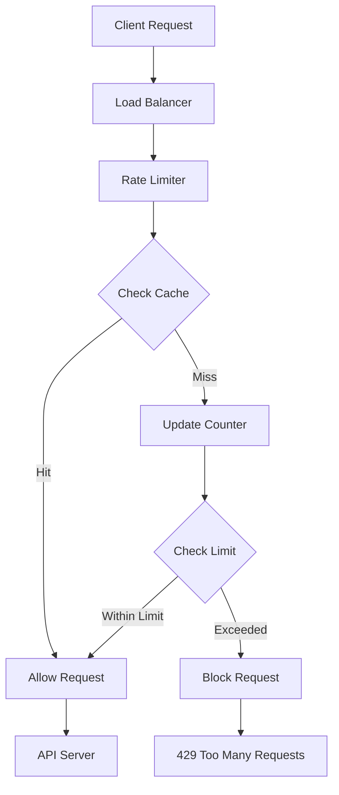
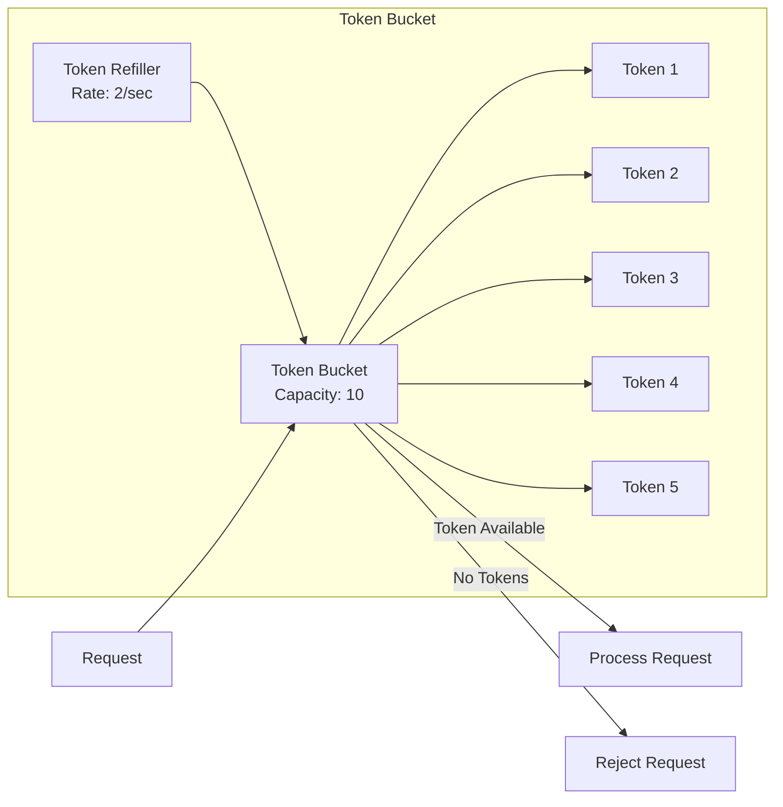
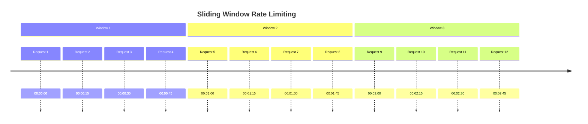

# 🚦 **Rate Limiting Patterns**

## 📘 **Theory**

Rate limiting is a technique used to control the rate of requests sent or received by a client or service. It helps prevent abuse, ensures fair resource usage, and maintains system stability by limiting the number of requests a client can make within a specific time window.

### **Why Rate Limiting Matters**

- **Prevent Abuse**: Protect against DDoS attacks and API abuse
- **Fair Resource Usage**: Ensure equitable access to shared resources
- **System Stability**: Prevent system overload and maintain performance
- **Cost Control**: Manage infrastructure costs by limiting resource consumption
- **Quality of Service**: Maintain consistent performance for all users
- **Compliance**: Meet regulatory requirements for API usage

### **Key Concepts**

1. **Rate Limit**: Maximum number of requests allowed per time window
2. **Time Window**: Duration over which the rate limit is applied
3. **Burst Capacity**: Ability to handle sudden spikes in requests
4. **Sliding Window**: Continuous time window that moves with each request
5. **Fixed Window**: Fixed time intervals (e.g., per minute, per hour)
6. **Token Bucket**: Tokens are added at a fixed rate and consumed by requests
7. **Leaky Bucket**: Requests are processed at a constant rate

### **Common Pitfalls and Best Practices**

- **Race Conditions**: Use atomic operations for distributed rate limiting
- **Memory Usage**: Implement efficient data structures for large-scale systems
- **Accuracy vs Performance**: Balance between precise counting and fast operations
- **Distributed Systems**: Ensure consistency across multiple servers
- **Graceful Degradation**: Provide meaningful error messages when limits are exceeded
- **Monitoring**: Track rate limit metrics and adjust limits based on usage patterns

## 📊 **Diagrams**

### **Rate Limiting Architecture**



### **Token Bucket Algorithm**



### **Sliding Window Rate Limiting**



## 🧩 **Example**

**Scenario**: Implement rate limiting for an API that allows 100 requests per minute per user

**Input**: User requests with user ID and timestamp
**Expected Output**: Allow or block requests based on rate limit

**Step-by-step**:

1. Extract user ID from request
2. Check current request count for user in time window
3. If under limit, allow request and increment counter
4. If at limit, block request and return 429 error
5. Reset counter when time window expires
6. Log rate limit violations for monitoring

## 💻 **Implementation (Golang)**

```go
package main

import (
    "context"
    "fmt"
    "sync"
    "time"
)

// Rate limiter interfaces
type RateLimiter interface {
    Allow(ctx context.Context, key string) (bool, error)
    GetRemaining(key string) (int, error)
    GetResetTime(key string) (time.Time, error)
}

// Token bucket rate limiter
type TokenBucketLimiter struct {
    capacity     int
    refillRate   int
    tokens       map[string]*TokenBucket
    mutex        sync.RWMutex
    refillTicker *time.Ticker
}

type TokenBucket struct {
    tokens     int
    lastRefill time.Time
    capacity   int
    refillRate int
}

func NewTokenBucketLimiter(capacity, refillRate int) *TokenBucketLimiter {
    limiter := &TokenBucketLimiter{
        capacity:   capacity,
        refillRate: refillRate,
        tokens:     make(map[string]*TokenBucket),
    }

    // Start background refill process
    go limiter.startRefillProcess()

    return limiter
}

func (tbl *TokenBucketLimiter) startRefillProcess() {
    ticker := time.NewTicker(time.Second)
    defer ticker.Stop()

    for range ticker.C {
        tbl.mutex.Lock()
        now := time.Now()

        for key, bucket := range tbl.tokens {
            if now.Sub(bucket.lastRefill) >= time.Second {
                tokensToAdd := int(now.Sub(bucket.lastRefill).Seconds()) * bucket.refillRate
                bucket.tokens = min(bucket.capacity, bucket.tokens+tokensToAdd)
                bucket.lastRefill = now
            }
        }

        tbl.mutex.Unlock()
    }
}

func (tbl *TokenBucketLimiter) Allow(ctx context.Context, key string) (bool, error) {
    tbl.mutex.Lock()
    defer tbl.mutex.Unlock()

    bucket, exists := tbl.tokens[key]
    if !exists {
        bucket = &TokenBucket{
            tokens:     tbl.capacity,
            lastRefill: time.Now(),
            capacity:   tbl.capacity,
            refillRate: tbl.refillRate,
        }
        tbl.tokens[key] = bucket
    }

    // Refill tokens if needed
    now := time.Now()
    if now.Sub(bucket.lastRefill) >= time.Second {
        tokensToAdd := int(now.Sub(bucket.lastRefill).Seconds()) * bucket.refillRate
        bucket.tokens = min(bucket.capacity, bucket.tokens+tokensToAdd)
        bucket.lastRefill = now
    }

    if bucket.tokens > 0 {
        bucket.tokens--
        return true, nil
    }

    return false, nil
}

func (tbl *TokenBucketLimiter) GetRemaining(key string) (int, error) {
    tbl.mutex.RLock()
    defer tbl.mutex.RUnlock()

    bucket, exists := tbl.tokens[key]
    if !exists {
        return tbl.capacity, nil
    }

    return bucket.tokens, nil
}

func (tbl *TokenBucketLimiter) GetResetTime(key string) (time.Time, error) {
    tbl.mutex.RLock()
    defer tbl.mutex.RUnlock()

    bucket, exists := tbl.tokens[key]
    if !exists {
        return time.Now(), nil
    }

    // Calculate when bucket will be full
    tokensNeeded := bucket.capacity - bucket.tokens
    if tokensNeeded == 0 {
        return time.Now(), nil
    }

    secondsToFull := float64(tokensNeeded) / float64(bucket.refillRate)
    return bucket.lastRefill.Add(time.Duration(secondsToFull) * time.Second), nil
}

// Sliding window rate limiter
type SlidingWindowLimiter struct {
    windowSize time.Duration
    maxRequests int
    requests    map[string][]time.Time
    mutex       sync.RWMutex
}

func NewSlidingWindowLimiter(windowSize time.Duration, maxRequests int) *SlidingWindowLimiter {
    return &SlidingWindowLimiter{
        windowSize:   windowSize,
        maxRequests:  maxRequests,
        requests:     make(map[string][]time.Time),
    }
}

func (swl *SlidingWindowLimiter) Allow(ctx context.Context, key string) (bool, error) {
    swl.mutex.Lock()
    defer swl.mutex.Unlock()

    now := time.Now()
    cutoff := now.Add(-swl.windowSize)

    // Get or create request history for key
    requests, exists := swl.requests[key]
    if !exists {
        requests = make([]time.Time, 0)
    }

    // Remove old requests outside the window
    var validRequests []time.Time
    for _, reqTime := range requests {
        if reqTime.After(cutoff) {
            validRequests = append(validRequests, reqTime)
        }
    }

    // Check if we can add another request
    if len(validRequests) >= swl.maxRequests {
        swl.requests[key] = validRequests
        return false, nil
    }

    // Add current request
    validRequests = append(validRequests, now)
    swl.requests[key] = validRequests

    return true, nil
}

func (swl *SlidingWindowLimiter) GetRemaining(key string) (int, error) {
    swl.mutex.RLock()
    defer swl.mutex.RUnlock()

    now := time.Now()
    cutoff := now.Add(-swl.windowSize)

    requests, exists := swl.requests[key]
    if !exists {
        return swl.maxRequests, nil
    }

    // Count valid requests
    validCount := 0
    for _, reqTime := range requests {
        if reqTime.After(cutoff) {
            validCount++
        }
    }

    return swl.maxRequests - validCount, nil
}

func (swl *SlidingWindowLimiter) GetResetTime(key string) (time.Time, error) {
    swl.mutex.RLock()
    defer swl.mutex.RUnlock()

    requests, exists := swl.requests[key]
    if !exists {
        return time.Now(), nil
    }

    if len(requests) == 0 {
        return time.Now(), nil
    }

    // Find oldest request in current window
    now := time.Now()
    cutoff := now.Add(-swl.windowSize)
    oldestRequest := now

    for _, reqTime := range requests {
        if reqTime.After(cutoff) && reqTime.Before(oldestRequest) {
            oldestRequest = reqTime
        }
    }

    // Reset time is when the oldest request will fall out of the window
    return oldestRequest.Add(swl.windowSize), nil
}

// Fixed window rate limiter
type FixedWindowLimiter struct {
    windowSize   time.Duration
    maxRequests  int
    windows      map[string]*FixedWindow
    mutex        sync.RWMutex
    cleanupTicker *time.Ticker
}

type FixedWindow struct {
    count     int
    startTime time.Time
}

func NewFixedWindowLimiter(windowSize time.Duration, maxRequests int) *FixedWindowLimiter {
    limiter := &FixedWindowLimiter{
        windowSize:   windowSize,
        maxRequests:  maxRequests,
        windows:      make(map[string]*FixedWindow),
    }

    // Start cleanup process
    go limiter.startCleanupProcess()

    return limiter
}

func (fwl *FixedWindowLimiter) startCleanupProcess() {
    fwl.cleanupTicker = time.NewTicker(fwl.windowSize)
    defer fwl.cleanupTicker.Stop()

    for range fwl.cleanupTicker.C {
        fwl.mutex.Lock()
        now := time.Now()

        for key, window := range fwl.windows {
            if now.Sub(window.startTime) >= fwl.windowSize {
                delete(fwl.windows, key)
            }
        }

        fwl.mutex.Unlock()
    }
}

func (fwl *FixedWindowLimiter) Allow(ctx context.Context, key string) (bool, error) {
    fwl.mutex.Lock()
    defer fwl.mutex.Unlock()

    now := time.Now()
    window, exists := fwl.windows[key]

    if !exists || now.Sub(window.startTime) >= fwl.windowSize {
        // Create new window
        window = &FixedWindow{
            count:     0,
            startTime: now,
        }
        fwl.windows[key] = window
    }

    if window.count >= fwl.maxRequests {
        return false, nil
    }

    window.count++
    return true, nil
}

func (fwl *FixedWindowLimiter) GetRemaining(key string) (int, error) {
    fwl.mutex.RLock()
    defer fwl.mutex.RUnlock()

    now := time.Now()
    window, exists := fwl.windows[key]

    if !exists || now.Sub(window.startTime) >= fwl.windowSize {
        return fwl.maxRequests, nil
    }

    return fwl.maxRequests - window.count, nil
}

func (fwl *FixedWindowLimiter) GetResetTime(key string) (time.Time, error) {
    fwl.mutex.RLock()
    defer fwl.mutex.RUnlock()

    window, exists := fwl.windows[key]
    if !exists {
        return time.Now(), nil
    }

    return window.startTime.Add(fwl.windowSize), nil
}

// Distributed rate limiter using Redis
type RedisRateLimiter struct {
    client      RedisClient
    windowSize  time.Duration
    maxRequests int
}

type RedisClient interface {
    Incr(ctx context.Context, key string) (int64, error)
    Expire(ctx context.Context, key string, expiration time.Duration) error
    Get(ctx context.Context, key string) (string, error)
    Set(ctx context.Context, key string, value interface{}, expiration time.Duration) error
}

func NewRedisRateLimiter(client RedisClient, windowSize time.Duration, maxRequests int) *RedisRateLimiter {
    return &RedisRateLimiter{
        client:      client,
        windowSize:  windowSize,
        maxRequests: maxRequests,
    }
}

func (rrl *RedisRateLimiter) Allow(ctx context.Context, key string) (bool, error) {
    // Use sliding window with Redis
    now := time.Now()
    windowStart := now.Add(-rrl.windowSize)

    // Remove old entries
    pipe := rrl.client.Pipeline()
    pipe.ZRemRangeByScore(ctx, key, "0", fmt.Sprintf("%d", windowStart.Unix()))
    pipe.ZCard(ctx, key)
    pipe.ZAdd(ctx, key, now.Unix(), now.Unix())
    pipe.Expire(ctx, key, rrl.windowSize)

    results, err := pipe.Exec(ctx)
    if err != nil {
        return false, err
    }

    count := results[1].(*redis.IntCmd).Val()

    if count >= int64(rrl.maxRequests) {
        return false, nil
    }

    return true, nil
}

func (rrl *RedisRateLimiter) GetRemaining(key string) (int, error) {
    ctx := context.Background()
    count, err := rrl.client.ZCard(ctx, key)
    if err != nil {
        return 0, err
    }

    remaining := rrl.maxRequests - int(count)
    if remaining < 0 {
        remaining = 0
    }

    return remaining, nil
}

func (rrl *RedisRateLimiter) GetResetTime(key string) (time.Time, error) {
    ctx := context.Background()
    now := time.Now()
    windowStart := now.Add(-rrl.windowSize)

    // Get oldest entry
    oldest, err := rrl.client.ZRangeByScore(ctx, key, "0", fmt.Sprintf("%d", windowStart.Unix()), &redis.ZRangeBy{
        Offset: 0,
        Count:  1,
    })
    if err != nil {
        return now, err
    }

    if len(oldest) == 0 {
        return now, nil
    }

    oldestTime, err := strconv.ParseInt(oldest[0], 10, 64)
    if err != nil {
        return now, err
    }

    return time.Unix(oldestTime, 0).Add(rrl.windowSize), nil
}

// Rate limiter middleware
type RateLimiterMiddleware struct {
    limiter RateLimiter
    keyFunc func(r *http.Request) string
}

func NewRateLimiterMiddleware(limiter RateLimiter, keyFunc func(r *http.Request) string) *RateLimiterMiddleware {
    return &RateLimiterMiddleware{
        limiter: limiter,
        keyFunc: keyFunc,
    }
}

func (rlm *RateLimiterMiddleware) Middleware(next http.Handler) http.Handler {
    return http.HandlerFunc(func(w http.ResponseWriter, r *http.Request) {
        key := rlm.keyFunc(r)

        allowed, err := rlm.limiter.Allow(r.Context(), key)
        if err != nil {
            http.Error(w, "Internal Server Error", http.StatusInternalServerError)
            return
        }

        if !allowed {
            remaining, _ := rlm.limiter.GetRemaining(key)
            resetTime, _ := rlm.limiter.GetResetTime(key)

            w.Header().Set("X-RateLimit-Limit", fmt.Sprintf("%d", rlm.limiter.GetMaxRequests()))
            w.Header().Set("X-RateLimit-Remaining", fmt.Sprintf("%d", remaining))
            w.Header().Set("X-RateLimit-Reset", fmt.Sprintf("%d", resetTime.Unix()))

            http.Error(w, "Too Many Requests", http.StatusTooManyRequests)
            return
        }

        // Add rate limit headers
        remaining, _ := rlm.limiter.GetRemaining(key)
        resetTime, _ := rlm.limiter.GetResetTime(key)

        w.Header().Set("X-RateLimit-Limit", fmt.Sprintf("%d", rlm.limiter.GetMaxRequests()))
        w.Header().Set("X-RateLimit-Remaining", fmt.Sprintf("%d", remaining))
        w.Header().Set("X-RateLimit-Reset", fmt.Sprintf("%d", resetTime.Unix()))

        next.ServeHTTP(w, r)
    })
}

// Helper functions
func min(a, b int) int {
    if a < b {
        return a
    }
    return b
}

func max(a, b int) int {
    if a > b {
        return a
    }
    return b
}

// Example usage
func main() {
    // Create different rate limiters
    tokenBucketLimiter := NewTokenBucketLimiter(10, 2) // 10 tokens, refill 2 per second
    slidingWindowLimiter := NewSlidingWindowLimiter(time.Minute, 100) // 100 requests per minute
    fixedWindowLimiter := NewFixedWindowLimiter(time.Minute, 100) // 100 requests per minute

    // Test token bucket limiter
    fmt.Println("=== Token Bucket Limiter ===")
    for i := 0; i < 15; i++ {
        allowed, _ := tokenBucketLimiter.Allow(context.Background(), "user1")
        remaining, _ := tokenBucketLimiter.GetRemaining("user1")
        fmt.Printf("Request %d: Allowed=%v, Remaining=%d\n", i+1, allowed, remaining)
        time.Sleep(100 * time.Millisecond)
    }

    // Test sliding window limiter
    fmt.Println("\n=== Sliding Window Limiter ===")
    for i := 0; i < 5; i++ {
        allowed, _ := slidingWindowLimiter.Allow(context.Background(), "user2")
        remaining, _ := slidingWindowLimiter.GetRemaining("user2")
        fmt.Printf("Request %d: Allowed=%v, Remaining=%d\n", i+1, allowed, remaining)
        time.Sleep(100 * time.Millisecond)
    }

    // Test fixed window limiter
    fmt.Println("\n=== Fixed Window Limiter ===")
    for i := 0; i < 5; i++ {
        allowed, _ := fixedWindowLimiter.Allow(context.Background(), "user3")
        remaining, _ := fixedWindowLimiter.GetRemaining("user3")
        fmt.Printf("Request %d: Allowed=%v, Remaining=%d\n", i+1, allowed, remaining)
        time.Sleep(100 * time.Millisecond)
    }

    // HTTP server example
    fmt.Println("\n=== HTTP Server with Rate Limiting ===")

    // Create HTTP server with rate limiting middleware
    mux := http.NewServeMux()
    mux.HandleFunc("/api/data", func(w http.ResponseWriter, r *http.Request) {
        w.WriteHeader(http.StatusOK)
        w.Write([]byte("Data response"))
    })

    // Add rate limiting middleware
    keyFunc := func(r *http.Request) string {
        // Use IP address as key (in production, use user ID or API key)
        return r.RemoteAddr
    }

    middleware := NewRateLimiterMiddleware(slidingWindowLimiter, keyFunc)
    handler := middleware.Middleware(mux)

    server := &http.Server{
        Addr:    ":8080",
        Handler: handler,
    }

    fmt.Println("Server starting on :8080")
    go server.ListenAndServe()

    // Test the server
    time.Sleep(1 * time.Second)

    client := &http.Client{}
    for i := 0; i < 5; i++ {
        resp, err := client.Get("http://localhost:8080/api/data")
        if err != nil {
            fmt.Printf("Request %d: Error=%v\n", i+1, err)
            continue
        }

        fmt.Printf("Request %d: Status=%d, Remaining=%s\n",
            i+1, resp.StatusCode, resp.Header.Get("X-RateLimit-Remaining"))
        resp.Body.Close()

        time.Sleep(100 * time.Millisecond)
    }
}
```

## 💻 **Implementation (Node.js)**

```javascript
const Redis = require("redis");
const express = require("express");

// Rate limiter interfaces
class RateLimiter {
  async allow(key) {
    throw new Error("Not implemented");
  }

  async getRemaining(key) {
    throw new Error("Not implemented");
  }

  async getResetTime(key) {
    throw new Error("Not implemented");
  }
}

// Token bucket rate limiter
class TokenBucketLimiter extends RateLimiter {
  constructor(capacity, refillRate) {
    super();
    this.capacity = capacity;
    this.refillRate = refillRate;
    this.buckets = new Map();
    this.startRefillProcess();
  }

  startRefillProcess() {
    setInterval(() => {
      const now = Date.now();

      for (const [key, bucket] of this.buckets.entries()) {
        const timePassed = (now - bucket.lastRefill) / 1000;
        const tokensToAdd = Math.floor(timePassed * this.refillRate);

        bucket.tokens = Math.min(this.capacity, bucket.tokens + tokensToAdd);
        bucket.lastRefill = now;
      }
    }, 1000);
  }

  async allow(key) {
    const bucket = this.buckets.get(key) || {
      tokens: this.capacity,
      lastRefill: Date.now(),
    };

    // Refill tokens if needed
    const now = Date.now();
    const timePassed = (now - bucket.lastRefill) / 1000;
    const tokensToAdd = Math.floor(timePassed * this.refillRate);
    bucket.tokens = Math.min(this.capacity, bucket.tokens + tokensToAdd);
    bucket.lastRefill = now;

    if (bucket.tokens > 0) {
      bucket.tokens--;
      this.buckets.set(key, bucket);
      return true;
    }

    return false;
  }

  async getRemaining(key) {
    const bucket = this.buckets.get(key);
    return bucket ? bucket.tokens : this.capacity;
  }

  async getResetTime(key) {
    const bucket = this.buckets.get(key);
    if (!bucket) {
      return new Date();
    }

    const tokensNeeded = this.capacity - bucket.tokens;
    if (tokensNeeded === 0) {
      return new Date();
    }

    const secondsToFull = tokensNeeded / this.refillRate;
    return new Date(bucket.lastRefill + secondsToFull * 1000);
  }
}

// Sliding window rate limiter
class SlidingWindowLimiter extends RateLimiter {
  constructor(windowSizeMs, maxRequests) {
    super();
    this.windowSizeMs = windowSizeMs;
    this.maxRequests = maxRequests;
    this.requests = new Map();
  }

  async allow(key) {
    const now = Date.now();
    const cutoff = now - this.windowSizeMs;

    let requests = this.requests.get(key) || [];

    // Remove old requests
    requests = requests.filter((time) => time > cutoff);

    if (requests.length >= this.maxRequests) {
      this.requests.set(key, requests);
      return false;
    }

    // Add current request
    requests.push(now);
    this.requests.set(key, requests);

    return true;
  }

  async getRemaining(key) {
    const now = Date.now();
    const cutoff = now - this.windowSizeMs;

    const requests = this.requests.get(key) || [];
    const validRequests = requests.filter((time) => time > cutoff);

    return this.maxRequests - validRequests.length;
  }

  async getResetTime(key) {
    const now = Date.now();
    const cutoff = now - this.windowSizeMs;

    const requests = this.requests.get(key) || [];
    const validRequests = requests.filter((time) => time > cutoff);

    if (validRequests.length === 0) {
      return new Date();
    }

    const oldestRequest = Math.min(...validRequests);
    return new Date(oldestRequest + this.windowSizeMs);
  }
}

// Fixed window rate limiter
class FixedWindowLimiter extends RateLimiter {
  constructor(windowSizeMs, maxRequests) {
    super();
    this.windowSizeMs = windowSizeMs;
    this.maxRequests = maxRequests;
    this.windows = new Map();
    this.startCleanupProcess();
  }

  startCleanupProcess() {
    setInterval(() => {
      const now = Date.now();

      for (const [key, window] of this.windows.entries()) {
        if (now - window.startTime >= this.windowSizeMs) {
          this.windows.delete(key);
        }
      }
    }, this.windowSizeMs);
  }

  async allow(key) {
    const now = Date.now();
    let window = this.windows.get(key);

    if (!window || now - window.startTime >= this.windowSizeMs) {
      window = {
        count: 0,
        startTime: now,
      };
      this.windows.set(key, window);
    }

    if (window.count >= this.maxRequests) {
      return false;
    }

    window.count++;
    return true;
  }

  async getRemaining(key) {
    const now = Date.now();
    const window = this.windows.get(key);

    if (!window || now - window.startTime >= this.windowSizeMs) {
      return this.maxRequests;
    }

    return this.maxRequests - window.count;
  }

  async getResetTime(key) {
    const window = this.windows.get(key);
    if (!window) {
      return new Date();
    }

    return new Date(window.startTime + this.windowSizeMs);
  }
}

// Redis-based distributed rate limiter
class RedisRateLimiter extends RateLimiter {
  constructor(redisClient, windowSizeMs, maxRequests) {
    super();
    this.redis = redisClient;
    this.windowSizeMs = windowSizeMs;
    this.maxRequests = maxRequests;
  }

  async allow(key) {
    const now = Date.now();
    const windowStart = now - this.windowSizeMs;

    const pipeline = this.redis.pipeline();

    // Remove old entries
    pipeline.zremrangebyscore(key, 0, windowStart);

    // Count current requests
    pipeline.zcard(key);

    // Add current request
    pipeline.zadd(key, now, now);

    // Set expiration
    pipeline.expire(key, Math.ceil(this.windowSizeMs / 1000));

    const results = await pipeline.exec();
    const count = results[1][1];

    return count < this.maxRequests;
  }

  async getRemaining(key) {
    const count = await this.redis.zcard(key);
    return Math.max(0, this.maxRequests - count);
  }

  async getResetTime(key) {
    const now = Date.now();
    const windowStart = now - this.windowSizeMs;

    const oldest = await this.redis.zrangebyscore(
      key,
      windowStart,
      "+inf",
      "LIMIT",
      0,
      1
    );

    if (oldest.length === 0) {
      return new Date();
    }

    const oldestTime = parseInt(oldest[0]);
    return new Date(oldestTime + this.windowSizeMs);
  }
}

// Rate limiter middleware
class RateLimiterMiddleware {
  constructor(limiter, keyFunc) {
    this.limiter = limiter;
    this.keyFunc = keyFunc;
  }

  middleware() {
    return async (req, res, next) => {
      try {
        const key = this.keyFunc(req);

        const allowed = await this.limiter.allow(key);

        if (!allowed) {
          const remaining = await this.limiter.getRemaining(key);
          const resetTime = await this.limiter.getResetTime(key);

          res.set("X-RateLimit-Limit", this.limiter.maxRequests.toString());
          res.set("X-RateLimit-Remaining", remaining.toString());
          res.set(
            "X-RateLimit-Reset",
            Math.ceil(resetTime.getTime() / 1000).toString()
          );

          return res.status(429).json({ error: "Too Many Requests" });
        }

        // Add rate limit headers
        const remaining = await this.limiter.getRemaining(key);
        const resetTime = await this.limiter.getResetTime(key);

        res.set("X-RateLimit-Limit", this.limiter.maxRequests.toString());
        res.set("X-RateLimit-Remaining", remaining.toString());
        res.set(
          "X-RateLimit-Reset",
          Math.ceil(resetTime.getTime() / 1000).toString()
        );

        next();
      } catch (error) {
        console.error("Rate limiter error:", error);
        res.status(500).json({ error: "Internal Server Error" });
      }
    };
  }
}

// Example usage
async function main() {
  // Create different rate limiters
  const tokenBucketLimiter = new TokenBucketLimiter(10, 2); // 10 tokens, refill 2 per second
  const slidingWindowLimiter = new SlidingWindowLimiter(60000, 100); // 100 requests per minute
  const fixedWindowLimiter = new FixedWindowLimiter(60000, 100); // 100 requests per minute

  // Test token bucket limiter
  console.log("=== Token Bucket Limiter ===");
  for (let i = 0; i < 15; i++) {
    const allowed = await tokenBucketLimiter.allow("user1");
    const remaining = await tokenBucketLimiter.getRemaining("user1");
    console.log(`Request ${i + 1}: Allowed=${allowed}, Remaining=${remaining}`);
    await new Promise((resolve) => setTimeout(resolve, 100));
  }

  // Test sliding window limiter
  console.log("\n=== Sliding Window Limiter ===");
  for (let i = 0; i < 5; i++) {
    const allowed = await slidingWindowLimiter.allow("user2");
    const remaining = await slidingWindowLimiter.getRemaining("user2");
    console.log(`Request ${i + 1}: Allowed=${allowed}, Remaining=${remaining}`);
    await new Promise((resolve) => setTimeout(resolve, 100));
  }

  // Test fixed window limiter
  console.log("\n=== Fixed Window Limiter ===");
  for (let i = 0; i < 5; i++) {
    const allowed = await fixedWindowLimiter.allow("user3");
    const remaining = await fixedWindowLimiter.getRemaining("user3");
    console.log(`Request ${i + 1}: Allowed=${allowed}, Remaining=${remaining}`);
    await new Promise((resolve) => setTimeout(resolve, 100));
  }

  // HTTP server example
  console.log("\n=== HTTP Server with Rate Limiting ===");

  const app = express();

  // Add rate limiting middleware
  const keyFunc = (req) => {
    // Use IP address as key (in production, use user ID or API key)
    return req.ip || req.connection.remoteAddress;
  };

  const middleware = new RateLimiterMiddleware(slidingWindowLimiter, keyFunc);
  app.use(middleware.middleware());

  app.get("/api/data", (req, res) => {
    res.json({ message: "Data response" });
  });

  const server = app.listen(8080, () => {
    console.log("Server running on port 8080");
  });

  // Test the server
  await new Promise((resolve) => setTimeout(resolve, 1000));

  const axios = require("axios");
  for (let i = 0; i < 5; i++) {
    try {
      const response = await axios.get("http://localhost:8080/api/data");
      console.log(
        `Request ${i + 1}: Status=${response.status}, Remaining=${
          response.headers["x-ratelimit-remaining"]
        }`
      );
    } catch (error) {
      console.log(
        `Request ${i + 1}: Error=${error.response?.status || error.message}`
      );
    }

    await new Promise((resolve) => setTimeout(resolve, 100));
  }

  server.close();
}

// Run the example
main().catch(console.error);
```

## ⏱ **Complexity Analysis**

### **Time Complexity**

- **Token Bucket**: O(1) for allow/deny operations
- **Sliding Window**: O(n) where n is number of requests in window
- **Fixed Window**: O(1) for allow/deny operations
- **Redis Implementation**: O(log n) for sorted set operations

### **Space Complexity**

- **Token Bucket**: O(k) where k is number of unique keys
- **Sliding Window**: O(k×n) where k is keys and n is requests per window
- **Fixed Window**: O(k) where k is number of unique keys
- **Redis Implementation**: O(k×n) where k is keys and n is requests per window

## 🚀 **Optimal Solution**

The optimal rate limiting solution includes:

1. **Algorithm Selection**: Choose based on use case requirements
2. **Distributed Implementation**: Use Redis for multi-server deployments
3. **Monitoring**: Track rate limit metrics and violations
4. **Graceful Degradation**: Provide meaningful error messages
5. **Configuration**: Make limits configurable per user/endpoint
6. **Caching**: Use efficient data structures for performance

### **Production Considerations**

- Implement proper error handling and logging
- Use distributed rate limiting for multi-server deployments
- Monitor rate limit violations and adjust limits
- Implement different limits for different user tiers
- Use circuit breakers for downstream services
- Implement rate limit bypass for admin users

## ❓ **Follow-up Questions**

### **How would this scale with X?**

- **High Traffic**: Use Redis clustering and efficient algorithms
- **Many Users**: Implement user-based rate limiting with efficient storage
- **Global Distribution**: Use edge-based rate limiting

### **How can we optimize further if Y changes?**

- **Memory Usage**: Use probabilistic data structures like HyperLogLog
- **Accuracy**: Use more precise algorithms like sliding window
- **Performance**: Use in-memory caching with Redis

### **What trade-offs exist in different approaches?**

- **Token Bucket vs Sliding Window**: Burst capacity vs Precise counting
- **Fixed Window vs Sliding Window**: Simplicity vs Accuracy
- **In-Memory vs Redis**: Performance vs Scalability
