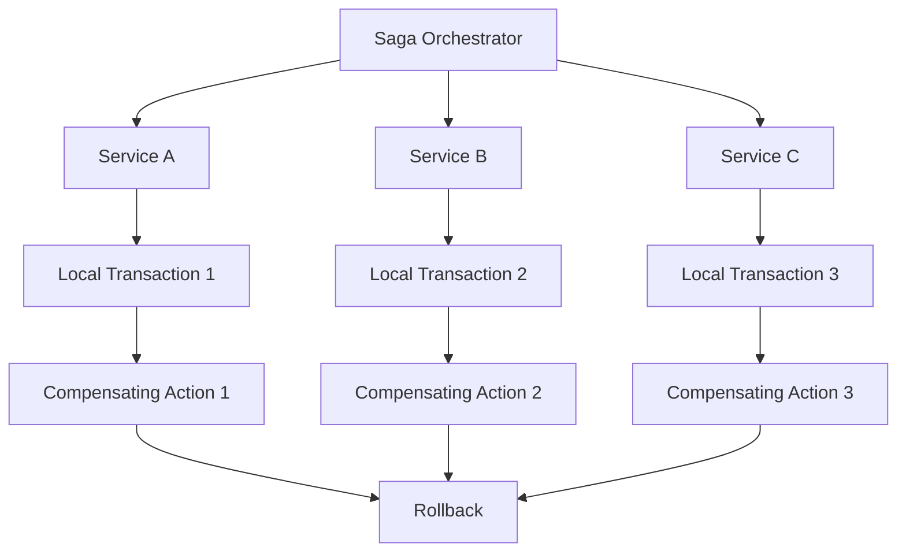

# Saga Pattern - Distributed Transaction Management

## Overview

The Saga Pattern is a design pattern for managing distributed transactions across multiple services. It provides a way to maintain data consistency in microservices architectures without using traditional two-phase commit (2PC) protocols.

## Key Concepts

- **Saga**: A sequence of local transactions that together form a distributed transaction
- **Compensating Actions**: Operations that undo the effects of previous transactions
- **Orchestration**: Centralized coordination of saga execution
- **Choreography**: Decentralized coordination through events

## Saga Pattern Types

### 1. Orchestration Pattern
- Centralized saga orchestrator
- Single point of control
- Easier to understand and debug
- Can become a bottleneck

### 2. Choreography Pattern
- Decentralized coordination
- Services communicate via events
- More scalable and resilient
- Harder to understand and debug

## Saga Pattern Architecture



## Go Implementation

```go
package main

import (
    "context"
    "fmt"
    "log"
    "sync"
    "time"
)

// SagaStep represents a single step in a saga
type SagaStep struct {
    ID          string
    Name        string
    Execute     func(ctx context.Context) error
    Compensate  func(ctx context.Context) error
    Status      string
    Error       error
}

// Saga represents a distributed transaction saga
type Saga struct {
    ID          string
    Steps       []*SagaStep
    Status      string
    CreatedAt   time.Time
    UpdatedAt   time.Time
}

// SagaOrchestrator manages saga execution
type SagaOrchestrator struct {
    sagas map[string]*Saga
    mutex sync.RWMutex
}

// NewSagaOrchestrator creates a new saga orchestrator
func NewSagaOrchestrator() *SagaOrchestrator {
    return &SagaOrchestrator{
        sagas: make(map[string]*Saga),
    }
}

// CreateSaga creates a new saga
func (so *SagaOrchestrator) CreateSaga(id string, steps []*SagaStep) *Saga {
    saga := &Saga{
        ID:        id,
        Steps:     steps,
        Status:    "created",
        CreatedAt: time.Now(),
        UpdatedAt: time.Now(),
    }
    
    so.mutex.Lock()
    so.sagas[id] = saga
    so.mutex.Unlock()
    
    return saga
}

// ExecuteSaga executes a saga with compensation on failure
func (so *SagaOrchestrator) ExecuteSaga(ctx context.Context, sagaID string) error {
    so.mutex.RLock()
    saga, exists := so.sagas[sagaID]
    so.mutex.RUnlock()
    
    if !exists {
        return fmt.Errorf("saga %s not found", sagaID)
    }
    
    saga.Status = "running"
    saga.UpdatedAt = time.Now()
    
    log.Printf("Starting saga execution: %s", sagaID)
    
    // Execute steps in order
    for i, step := range saga.Steps {
        log.Printf("Executing step %d: %s", i+1, step.Name)
        
        step.Status = "running"
        err := step.Execute(ctx)
        
        if err != nil {
            log.Printf("Step %s failed: %v", step.Name, err)
            step.Status = "failed"
            step.Error = err
            saga.Status = "failed"
            saga.UpdatedAt = time.Now()
            
            // Compensate for all executed steps
            return so.compensateSaga(ctx, saga, i)
        }
        
        step.Status = "completed"
        log.Printf("Step %s completed successfully", step.Name)
    }
    
    saga.Status = "completed"
    saga.UpdatedAt = time.Now()
    log.Printf("Saga %s completed successfully", sagaID)
    
    return nil
}

// compensateSaga compensates for all executed steps
func (so *SagaOrchestrator) compensateSaga(ctx context.Context, saga *Saga, failedStepIndex int) error {
    log.Printf("Starting compensation for saga %s", saga.ID)
    
    // Compensate in reverse order
    for i := failedStepIndex; i >= 0; i-- {
        step := saga.Steps[i]
        if step.Status == "completed" {
            log.Printf("Compensating step: %s", step.Name)
            
            step.Status = "compensating"
            err := step.Compensate(ctx)
            
            if err != nil {
                log.Printf("Compensation failed for step %s: %v", step.Name, err)
                step.Status = "compensation_failed"
                return fmt.Errorf("compensation failed for step %s: %v", step.Name, err)
            }
            
            step.Status = "compensated"
            log.Printf("Step %s compensated successfully", step.Name)
        }
    }
    
    saga.Status = "compensated"
    saga.UpdatedAt = time.Now()
    log.Printf("Saga %s compensation completed", saga.ID)
    
    return nil
}

// GetSagaStatus returns the current status of a saga
func (so *SagaOrchestrator) GetSagaStatus(sagaID string) (*Saga, error) {
    so.mutex.RLock()
    defer so.mutex.RUnlock()
    
    saga, exists := so.sagas[sagaID]
    if !exists {
        return nil, fmt.Errorf("saga %s not found", sagaID)
    }
    
    return saga, nil
}

// Example usage
func main() {
    orchestrator := NewSagaOrchestrator()
    
    // Create saga steps for an e-commerce order
    steps := []*SagaStep{
        {
            ID:   "reserve_inventory",
            Name: "Reserve Inventory",
            Execute: func(ctx context.Context) error {
                log.Println("Reserving inventory...")
                time.Sleep(100 * time.Millisecond)
                return nil
            },
            Compensate: func(ctx context.Context) error {
                log.Println("Releasing inventory...")
                time.Sleep(100 * time.Millisecond)
                return nil
            },
        },
        {
            ID:   "charge_payment",
            Name: "Charge Payment",
            Execute: func(ctx context.Context) error {
                log.Println("Charging payment...")
                time.Sleep(100 * time.Millisecond)
                return nil
            },
            Compensate: func(ctx context.Context) error {
                log.Println("Refunding payment...")
                time.Sleep(100 * time.Millisecond)
                return nil
            },
        },
        {
            ID:   "create_shipment",
            Name: "Create Shipment",
            Execute: func(ctx context.Context) error {
                log.Println("Creating shipment...")
                time.Sleep(100 * time.Millisecond)
                return nil
            },
            Compensate: func(ctx context.Context) error {
                log.Println("Canceling shipment...")
                time.Sleep(100 * time.Millisecond)
                return nil
            },
        },
    }
    
    // Create and execute saga
    saga := orchestrator.CreateSaga("order_123", steps)
    
    ctx := context.Background()
    err := orchestrator.ExecuteSaga(ctx, saga.ID)
    
    if err != nil {
        log.Printf("Saga execution failed: %v", err)
    }
    
    // Get saga status
    status, err := orchestrator.GetSagaStatus(saga.ID)
    if err != nil {
        log.Printf("Error getting saga status: %v", err)
    } else {
        log.Printf("Saga status: %+v", status)
    }
}
```

## Node.js Implementation

```javascript
class SagaStep {
  constructor(id, name, execute, compensate) {
    this.id = id;
    this.name = name;
    this.execute = execute;
    this.compensate = compensate;
    this.status = "pending";
    this.error = null;
  }
}

class Saga {
  constructor(id, steps) {
    this.id = id;
    this.steps = steps;
    this.status = "created";
    this.createdAt = new Date();
    this.updatedAt = new Date();
  }
}

class SagaOrchestrator {
  constructor() {
    this.sagas = new Map();
  }

  createSaga(id, steps) {
    const saga = new Saga(id, steps);
    this.sagas.set(id, saga);
    return saga;
  }

  async executeSaga(sagaId) {
    const saga = this.sagas.get(sagaId);
    if (!saga) {
      throw new Error(`Saga ${sagaId} not found`);
    }

    saga.status = "running";
    saga.updatedAt = new Date();

    console.log(`Starting saga execution: ${sagaId}`);

    try {
      // Execute steps in order
      for (let i = 0; i < saga.steps.length; i++) {
        const step = saga.steps[i];
        console.log(`Executing step ${i + 1}: ${step.name}`);

        step.status = "running";
        try {
          await step.execute();
          step.status = "completed";
          console.log(`Step ${step.name} completed successfully`);
        } catch (error) {
          console.log(`Step ${step.name} failed: ${error.message}`);
          step.status = "failed";
          step.error = error;
          saga.status = "failed";
          saga.updatedAt = new Date();

          // Compensate for all executed steps
          await this.compensateSaga(saga, i);
          throw error;
        }
      }

      saga.status = "completed";
      saga.updatedAt = new Date();
      console.log(`Saga ${sagaId} completed successfully`);
    } catch (error) {
      console.log(`Saga ${sagaId} execution failed: ${error.message}`);
      throw error;
    }
  }

  async compensateSaga(saga, failedStepIndex) {
    console.log(`Starting compensation for saga ${saga.id}`);

    // Compensate in reverse order
    for (let i = failedStepIndex; i >= 0; i--) {
      const step = saga.steps[i];
      if (step.status === "completed") {
        console.log(`Compensating step: ${step.name}`);

        step.status = "compensating";
        try {
          await step.compensate();
          step.status = "compensated";
          console.log(`Step ${step.name} compensated successfully`);
        } catch (error) {
          console.log(`Compensation failed for step ${step.name}: ${error.message}`);
          step.status = "compensation_failed";
          throw new Error(`Compensation failed for step ${step.name}: ${error.message}`);
        }
      }
    }

    saga.status = "compensated";
    saga.updatedAt = new Date();
    console.log(`Saga ${saga.id} compensation completed`);
  }

  getSagaStatus(sagaId) {
    const saga = this.sagas.get(sagaId);
    if (!saga) {
      throw new Error(`Saga ${sagaId} not found`);
    }
    return saga;
  }
}

// Example usage
async function main() {
  const orchestrator = new SagaOrchestrator();

  // Create saga steps for an e-commerce order
  const steps = [
    new SagaStep(
      "reserve_inventory",
      "Reserve Inventory",
      async () => {
        console.log("Reserving inventory...");
        await new Promise(resolve => setTimeout(resolve, 100));
      },
      async () => {
        console.log("Releasing inventory...");
        await new Promise(resolve => setTimeout(resolve, 100));
      }
    ),
    new SagaStep(
      "charge_payment",
      "Charge Payment",
      async () => {
        console.log("Charging payment...");
        await new Promise(resolve => setTimeout(resolve, 100));
      },
      async () => {
        console.log("Refunding payment...");
        await new Promise(resolve => setTimeout(resolve, 100));
      }
    ),
    new SagaStep(
      "create_shipment",
      "Create Shipment",
      async () => {
        console.log("Creating shipment...");
        await new Promise(resolve => setTimeout(resolve, 100));
      },
      async () => {
        console.log("Canceling shipment...");
        await new Promise(resolve => setTimeout(resolve, 100));
      }
    ),
  ];

  // Create and execute saga
  const saga = orchestrator.createSaga("order_123", steps);

  try {
    await orchestrator.executeSaga(saga.id);
  } catch (error) {
    console.log(`Saga execution failed: ${error.message}`);
  }

  // Get saga status
  const status = orchestrator.getSagaStatus(saga.id);
  console.log("Saga status:", status);
}

if (require.main === module) {
  main().catch(console.error);
}
```

## Benefits

1. **Eventual Consistency**: Provides a way to maintain consistency across services
2. **Fault Tolerance**: Can handle partial failures gracefully
3. **Scalability**: No single point of failure like 2PC
4. **Flexibility**: Can handle complex business logic

## Trade-offs

1. **Complexity**: More complex than simple local transactions
2. **Eventual Consistency**: Not immediately consistent
3. **Compensation Logic**: Requires careful design of compensating actions
4. **Debugging**: Can be harder to debug than simple transactions

## Use Cases

- **E-commerce Orders**: Order processing across multiple services
- **Financial Transactions**: Money transfers between accounts
- **Inventory Management**: Stock updates across multiple systems
- **User Registration**: Account creation across multiple services

## Best Practices

1. **Idempotent Operations**: Make all operations idempotent
2. **Compensation Design**: Design compensating actions carefully
3. **Monitoring**: Implement comprehensive monitoring and logging
4. **Testing**: Thoroughly test both happy path and failure scenarios
5. **Documentation**: Document saga flows and compensation logic

## Common Pitfalls

1. **Incomplete Compensation**: Not handling all failure scenarios
2. **Non-idempotent Operations**: Causing issues during retries
3. **Poor Error Handling**: Not properly handling and logging errors
4. **Missing Monitoring**: Not tracking saga execution and failures

## Interview Questions

1. **How does the Saga pattern differ from 2PC?**
   - Saga uses local transactions and compensation
   - 2PC uses a coordinator and voting mechanism
   - Saga is more scalable but less immediately consistent

2. **When would you use orchestration vs choreography?**
   - Orchestration: When you need centralized control and easier debugging
   - Choreography: When you need high scalability and loose coupling

3. **How do you handle partial failures in a saga?**
   - Implement compensation logic for each step
   - Execute compensation in reverse order
   - Handle compensation failures gracefully

4. **What are the challenges of implementing sagas?**
   - Designing compensating actions
   - Ensuring idempotency
   - Handling complex business logic
   - Monitoring and debugging

## Time Complexity

- **Saga Execution**: O(n) where n is number of steps
- **Compensation**: O(n) where n is number of executed steps
- **Status Lookup**: O(1)

## Space Complexity

- **Saga Storage**: O(n) where n is number of sagas
- **Step Storage**: O(m) where m is number of steps per saga

The optimal solution uses:
1. **Idempotent Operations**: Ensure operations can be safely retried
2. **Proper Error Handling**: Handle all failure scenarios gracefully
3. **Monitoring**: Track saga execution and performance
4. **Testing**: Comprehensive testing of all scenarios
