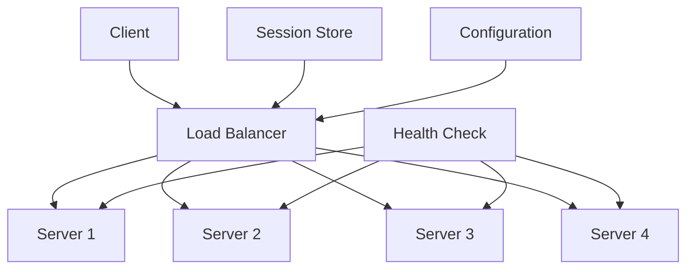

# Load Balancer Patterns - Scaling Applications

## Overview

Load balancing is the process of distributing incoming network traffic across multiple servers to ensure optimal resource utilization, maximize throughput, minimize response time, and avoid overload on any single server.

## Key Concepts

- **Load Balancer**: Distributes traffic across servers
- **Backend Servers**: Actual application servers
- **Health Checks**: Monitor server health and availability
- **Load Balancing Algorithms**: Methods for distributing traffic
- **Session Persistence**: Maintaining user sessions
- **Failover**: Automatic switching to healthy servers

## Load Balancer Architecture



## Go Implementation

```go
package main

import (
    "context"
    "fmt"
    "log"
    "math/rand"
    "net/http"
    "sync"
    "time"
)

// Server represents a backend server
type Server struct {
    ID          string
    URL         string
    Weight      int
    IsHealthy   bool
    ResponseTime time.Duration
    ActiveConnections int
    mutex       sync.RWMutex
}

// NewServer creates a new server
func NewServer(id, url string, weight int) *Server {
    return &Server{
        ID:        id,
        URL:       url,
        Weight:    weight,
        IsHealthy: true,
        ResponseTime: 0,
        ActiveConnections: 0,
    }
}

// SetHealth sets the server health status
func (s *Server) SetHealth(healthy bool) {
    s.mutex.Lock()
    defer s.mutex.Unlock()
    s.IsHealthy = healthy
}

// GetHealth returns the server health status
func (s *Server) GetHealth() bool {
    s.mutex.RLock()
    defer s.mutex.RUnlock()
    return s.IsHealthy
}

// SetResponseTime sets the server response time
func (s *Server) SetResponseTime(duration time.Duration) {
    s.mutex.Lock()
    defer s.mutex.Unlock()
    s.ResponseTime = duration
}

// GetResponseTime returns the server response time
func (s *Server) GetResponseTime() time.Duration {
    s.mutex.RLock()
    defer s.mutex.RUnlock()
    return s.ResponseTime
}

// IncrementConnections increments active connections
func (s *Server) IncrementConnections() {
    s.mutex.Lock()
    defer s.mutex.Unlock()
    s.ActiveConnections++
}

// DecrementConnections decrements active connections
func (s *Server) DecrementConnections() {
    s.mutex.Lock()
    defer s.mutex.Unlock()
    s.ActiveConnections--
}

// GetActiveConnections returns active connections
func (s *Server) GetActiveConnections() int {
    s.mutex.RLock()
    defer s.mutex.RUnlock()
    return s.ActiveConnections
}

// LoadBalancer represents a load balancer
type LoadBalancer struct {
    servers    []*Server
    algorithm  LoadBalancingAlgorithm
    mutex      sync.RWMutex
    healthChecker *HealthChecker
}

// LoadBalancingAlgorithm represents a load balancing algorithm
type LoadBalancingAlgorithm int

const (
    RoundRobin LoadBalancingAlgorithm = iota
    WeightedRoundRobin
    LeastConnections
    LeastResponseTime
    Random
    IPHash
)

// NewLoadBalancer creates a new load balancer
func NewLoadBalancer(algorithm LoadBalancingAlgorithm) *LoadBalancer {
    lb := &LoadBalancer{
        servers:   make([]*Server, 0),
        algorithm: algorithm,
        healthChecker: NewHealthChecker(),
    }
    
    // Start health checking
    go lb.healthChecker.Start(lb.servers)
    
    return lb
}

// AddServer adds a server to the load balancer
func (lb *LoadBalancer) AddServer(server *Server) {
    lb.mutex.Lock()
    defer lb.mutex.Unlock()
    lb.servers = append(lb.servers, server)
}

// RemoveServer removes a server from the load balancer
func (lb *LoadBalancer) RemoveServer(serverID string) {
    lb.mutex.Lock()
    defer lb.mutex.Unlock()
    
    for i, server := range lb.servers {
        if server.ID == serverID {
            lb.servers = append(lb.servers[:i], lb.servers[i+1:]...)
            break
        }
    }
}

// GetServer selects a server based on the load balancing algorithm
func (lb *LoadBalancer) GetServer() (*Server, error) {
    lb.mutex.RLock()
    defer lb.mutex.RUnlock()
    
    if len(lb.servers) == 0 {
        return nil, fmt.Errorf("no servers available")
    }
    
    // Filter healthy servers
    healthyServers := make([]*Server, 0)
    for _, server := range lb.servers {
        if server.GetHealth() {
            healthyServers = append(healthyServers, server)
        }
    }
    
    if len(healthyServers) == 0 {
        return nil, fmt.Errorf("no healthy servers available")
    }
    
    // Select server based on algorithm
    switch lb.algorithm {
    case RoundRobin:
        return lb.roundRobin(healthyServers)
    case WeightedRoundRobin:
        return lb.weightedRoundRobin(healthyServers)
    case LeastConnections:
        return lb.leastConnections(healthyServers)
    case LeastResponseTime:
        return lb.leastResponseTime(healthyServers)
    case Random:
        return lb.random(healthyServers)
    case IPHash:
        return lb.ipHash(healthyServers, "")
    default:
        return lb.roundRobin(healthyServers)
    }
}

// roundRobin implements round-robin load balancing
func (lb *LoadBalancer) roundRobin(servers []*Server) (*Server, error) {
    if len(servers) == 0 {
        return nil, fmt.Errorf("no servers available")
    }
    
    // Simple round-robin (in production, use atomic counter)
    index := rand.Intn(len(servers))
    return servers[index], nil
}

// weightedRoundRobin implements weighted round-robin load balancing
func (lb *LoadBalancer) weightedRoundRobin(servers []*Server) (*Server, error) {
    if len(servers) == 0 {
        return nil, fmt.Errorf("no servers available")
    }
    
    totalWeight := 0
    for _, server := range servers {
        totalWeight += server.Weight
    }
    
    if totalWeight == 0 {
        return lb.roundRobin(servers)
    }
    
    random := rand.Intn(totalWeight)
    currentWeight := 0
    
    for _, server := range servers {
        currentWeight += server.Weight
        if random < currentWeight {
            return server, nil
        }
    }
    
    return servers[len(servers)-1], nil
}

// leastConnections implements least connections load balancing
func (lb *LoadBalancer) leastConnections(servers []*Server) (*Server, error) {
    if len(servers) == 0 {
        return nil, fmt.Errorf("no servers available")
    }
    
    minConnections := servers[0].GetActiveConnections()
    selectedServer := servers[0]
    
    for _, server := range servers[1:] {
        connections := server.GetActiveConnections()
        if connections < minConnections {
            minConnections = connections
            selectedServer = server
        }
    }
    
    return selectedServer, nil
}

// leastResponseTime implements least response time load balancing
func (lb *LoadBalancer) leastResponseTime(servers []*Server) (*Server, error) {
    if len(servers) == 0 {
        return nil, fmt.Errorf("no servers available")
    }
    
    minResponseTime := servers[0].GetResponseTime()
    selectedServer := servers[0]
    
    for _, server := range servers[1:] {
        responseTime := server.GetResponseTime()
        if responseTime < minResponseTime {
            minResponseTime = responseTime
            selectedServer = server
        }
    }
    
    return selectedServer, nil
}

// random implements random load balancing
func (lb *LoadBalancer) random(servers []*Server) (*Server, error) {
    if len(servers) == 0 {
        return nil, fmt.Errorf("no servers available")
    }
    
    index := rand.Intn(len(servers))
    return servers[index], nil
}

// ipHash implements IP hash load balancing
func (lb *LoadBalancer) ipHash(servers []*Server, clientIP string) (*Server, error) {
    if len(servers) == 0 {
        return nil, fmt.Errorf("no servers available")
    }
    
    // Simple hash function (in production, use better hash)
    hash := 0
    for _, char := range clientIP {
        hash = hash*31 + int(char)
    }
    
    index := hash % len(servers)
    if index < 0 {
        index = -index
    }
    
    return servers[index], nil
}

// HealthChecker represents a health checker
type HealthChecker struct {
    interval time.Duration
    timeout  time.Duration
    stopChan chan bool
}

// NewHealthChecker creates a new health checker
func NewHealthChecker() *HealthChecker {
    return &HealthChecker{
        interval: 30 * time.Second,
        timeout:  5 * time.Second,
        stopChan: make(chan bool),
    }
}

// Start starts the health checker
func (hc *HealthChecker) Start(servers []*Server) {
    ticker := time.NewTicker(hc.interval)
    defer ticker.Stop()
    
    for {
        select {
        case <-ticker.C:
            hc.checkServers(servers)
        case <-hc.stopChan:
            return
        }
    }
}

// Stop stops the health checker
func (hc *HealthChecker) Stop() {
    hc.stopChan <- true
}

// checkServers checks the health of all servers
func (hc *HealthChecker) checkServers(servers []*Server) {
    for _, server := range servers {
        go hc.checkServer(server)
    }
}

// checkServer checks the health of a single server
func (hc *HealthChecker) checkServer(server *Server) {
    start := time.Now()
    
    // Simulate health check (in production, make actual HTTP request)
    client := &http.Client{Timeout: hc.timeout}
    resp, err := client.Get(server.URL + "/health")
    
    responseTime := time.Since(start)
    server.SetResponseTime(responseTime)
    
    if err != nil || resp.StatusCode != http.StatusOK {
        server.SetHealth(false)
        log.Printf("Server %s is unhealthy: %v", server.ID, err)
    } else {
        server.SetHealth(true)
        log.Printf("Server %s is healthy (response time: %v)", server.ID, responseTime)
    }
    
    if resp != nil {
        resp.Body.Close()
    }
}

// LoadBalancerHandler represents an HTTP handler for load balancing
type LoadBalancerHandler struct {
    loadBalancer *LoadBalancer
    httpClient   *http.Client
}

// NewLoadBalancerHandler creates a new load balancer handler
func NewLoadBalancerHandler(loadBalancer *LoadBalancer) *LoadBalancerHandler {
    return &LoadBalancerHandler{
        loadBalancer: loadBalancer,
        httpClient:   &http.Client{Timeout: 30 * time.Second},
    }
}

// ServeHTTP implements the http.Handler interface
func (lbh *LoadBalancerHandler) ServeHTTP(w http.ResponseWriter, r *http.Request) {
    // Get server from load balancer
    server, err := lbh.loadBalancer.GetServer()
    if err != nil {
        http.Error(w, "No servers available", http.StatusServiceUnavailable)
        return
    }
    
    // Increment connection count
    server.IncrementConnections()
    defer server.DecrementConnections()
    
    // Forward request to selected server
    lbh.forwardRequest(w, r, server)
}

// forwardRequest forwards the request to the selected server
func (lbh *LoadBalancerHandler) forwardRequest(w http.ResponseWriter, r *http.Request, server *Server) {
    // Create new request
    targetURL := server.URL + r.URL.Path
    if r.URL.RawQuery != "" {
        targetURL += "?" + r.URL.RawQuery
    }
    
    req, err := http.NewRequest(r.Method, targetURL, r.Body)
    if err != nil {
        http.Error(w, "Failed to create request", http.StatusInternalServerError)
        return
    }
    
    // Copy headers
    for key, values := range r.Header {
        for _, value := range values {
            req.Header.Add(key, value)
        }
    }
    
    // Make request
    resp, err := lbh.httpClient.Do(req)
    if err != nil {
        http.Error(w, "Failed to forward request", http.StatusBadGateway)
        return
    }
    defer resp.Body.Close()
    
    // Copy response headers
    for key, values := range resp.Header {
        for _, value := range values {
            w.Header().Add(key, value)
        }
    }
    
    // Set status code
    w.WriteHeader(resp.StatusCode)
    
    // Copy response body
    if _, err := w.Write([]byte("Response from " + server.ID)); err != nil {
        log.Printf("Failed to write response: %v", err)
    }
}

// Example usage
func main() {
    // Create load balancer
    lb := NewLoadBalancer(WeightedRoundRobin)
    
    // Add servers
    lb.AddServer(NewServer("server1", "http://localhost:8081", 3))
    lb.AddServer(NewServer("server2", "http://localhost:8082", 2))
    lb.AddServer(NewServer("server3", "http://localhost:8083", 1))
    lb.AddServer(NewServer("server4", "http://localhost:8084", 4))
    
    // Create load balancer handler
    handler := NewLoadBalancerHandler(lb)
    
    // Start HTTP server
    server := &http.Server{
        Addr:    ":8080",
        Handler: handler,
    }
    
    log.Println("Load balancer starting on :8080")
    log.Fatal(server.ListenAndServe())
}
```

## Load Balancing Algorithms

### 1. Round Robin
- **Description**: Distributes requests evenly across servers
- **Use Case**: When all servers have similar capacity
- **Pros**: Simple, fair distribution
- **Cons**: Doesn't consider server load or capacity

### 2. Weighted Round Robin
- **Description**: Distributes requests based on server weights
- **Use Case**: When servers have different capacities
- **Pros**: Considers server capacity
- **Cons**: Doesn't consider current load

### 3. Least Connections
- **Description**: Routes to server with fewest active connections
- **Use Case**: When connection count indicates load
- **Pros**: Considers current load
- **Cons**: Doesn't consider connection duration

### 4. Least Response Time
- **Description**: Routes to server with fastest response time
- **Use Case**: When response time indicates performance
- **Pros**: Considers server performance
- **Cons**: Requires continuous monitoring

### 5. Random
- **Description**: Randomly selects a server
- **Use Case**: When distribution doesn't matter
- **Pros**: Simple, no state required
- **Cons**: Unpredictable distribution

### 6. IP Hash
- **Description**: Routes based on client IP hash
- **Use Case**: When session persistence is needed
- **Pros**: Ensures same client goes to same server
- **Cons**: Uneven distribution if IPs are clustered

## Load Balancer Types

### 1. Layer 4 (Transport Layer)
- **Protocol**: TCP/UDP
- **Decision**: Based on IP and port
- **Use Case**: High performance, simple routing
- **Examples**: HAProxy, F5, AWS NLB

### 2. Layer 7 (Application Layer)
- **Protocol**: HTTP/HTTPS
- **Decision**: Based on content, headers, cookies
- **Use Case**: Advanced routing, SSL termination
- **Examples**: NGINX, HAProxy, AWS ALB

### 3. Hardware Load Balancer
- **Type**: Physical appliance
- **Pros**: High performance, reliability
- **Cons**: Expensive, less flexible
- **Examples**: F5, Citrix, A10

### 4. Software Load Balancer
- **Type**: Software application
- **Pros**: Cost-effective, flexible
- **Cons**: Lower performance than hardware
- **Examples**: HAProxy, NGINX, Envoy

## Benefits

1. **High Availability**: Automatic failover
2. **Scalability**: Easy to add/remove servers
3. **Performance**: Distributes load evenly
4. **Reliability**: Reduces single point of failure
5. **Flexibility**: Multiple algorithms and configurations

## Common Pitfalls

1. **Session Sticky**: Not handling session persistence
2. **Health Checks**: Inadequate health monitoring
3. **Configuration**: Complex configuration management
4. **Monitoring**: Lack of proper monitoring
5. **Security**: Not considering security implications

## Interview Questions

1. **What is load balancing?**
   - Distributing incoming traffic across multiple servers

2. **What are the different load balancing algorithms?**
   - Round robin, weighted round robin, least connections, etc.

3. **What's the difference between Layer 4 and Layer 7 load balancing?**
   - Layer 4 works at transport layer, Layer 7 at application layer

4. **How do you handle session persistence?**
   - Use IP hash, sticky sessions, or external session store

## Time Complexity

- **Server Selection**: O(n) where n is number of servers
- **Health Checking**: O(n) where n is number of servers
- **Request Forwarding**: O(1) for single request

## Space Complexity

- **Server Storage**: O(n) where n is number of servers
- **Health Check Data**: O(n) where n is number of servers
- **Connection Tracking**: O(m) where m is number of connections

The optimal solution uses:
1. **Appropriate Algorithm**: Choose based on use case
2. **Health Monitoring**: Implement proper health checks
3. **Session Management**: Handle session persistence
4. **Monitoring**: Track performance and availability
