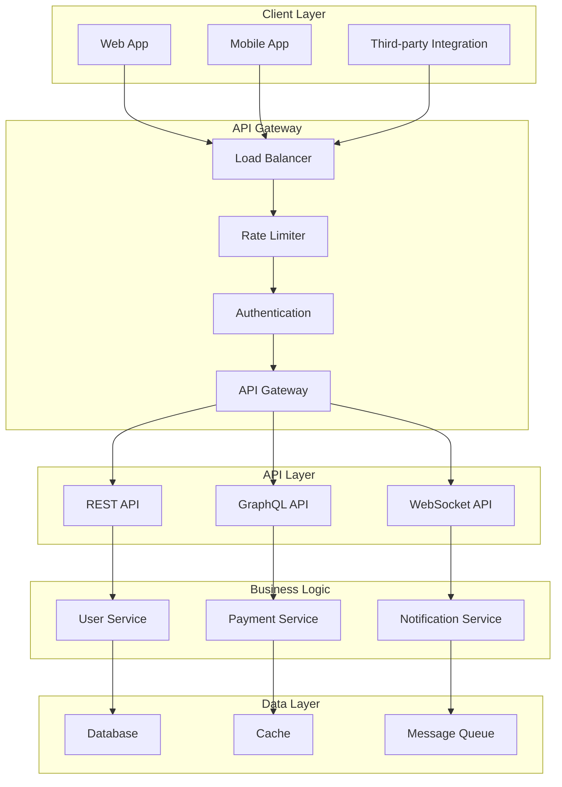
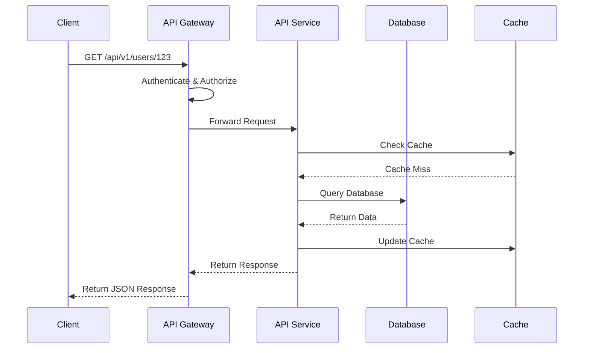

# 🌐 **API Design Comprehensive Guide**

## 📘 **Theory**

API Design is a critical skill for backend engineers, especially in fintech and payment systems. Well-designed APIs are the foundation of scalable, maintainable, and user-friendly systems.

### **Why API Design Matters**

- **Developer Experience**: Good APIs are easy to understand and use
- **System Integration**: APIs enable different systems to communicate
- **Scalability**: Well-designed APIs can handle growth and changes
- **Maintainability**: Clean APIs are easier to maintain and debug
- **Security**: Proper API design includes security considerations
- **Performance**: Efficient APIs reduce latency and resource usage
- **Business Value**: APIs enable new features and business opportunities

### **Key Concepts**

1. **RESTful Design**: Representational State Transfer principles
2. **GraphQL**: Query language for APIs with flexible data fetching
3. **API Versioning**: Managing changes and backward compatibility
4. **Authentication & Authorization**: Securing API access
5. **Rate Limiting**: Controlling API usage
6. **Error Handling**: Consistent error responses
7. **Documentation**: Clear API documentation
8. **Testing**: API testing strategies

### **API Design Principles**

- **Consistency**: Uniform patterns across all endpoints
- **Simplicity**: Easy to understand and use
- **Flexibility**: Adaptable to different use cases
- **Reliability**: Consistent behavior and error handling
- **Security**: Built-in security measures
- **Performance**: Optimized for speed and efficiency
- **Documentation**: Well-documented and self-explanatory

## 📊 **Diagrams**

### **API Architecture Overview**



### **API Versioning Strategies**

```mermaid
graph LR
    subgraph "URL Versioning"
        A[/api/v1/users]
        B[/api/v2/users]
    end

    subgraph "Header Versioning"
        C[Accept: application/vnd.api+json;version=1]
        D[Accept: application/vnd.api+json;version=2]
    end

    subgraph "Query Parameter"
        E[/api/users?version=1]
        F[/api/users?version=2]
    end

    subgraph "Content Negotiation"
        G[Accept: application/json]
        H[Accept: application/xml]
    end
```

### **RESTful API Design Flow**



## 🧩 **Example**

**Scenario**: Design a payment API for a fintech application

**Input**:
- User payment requests
- Multiple payment methods (card, UPI, net banking)
- Transaction history queries
- Refund processing

**Expected Output**:
- RESTful API endpoints
- GraphQL schema
- API versioning strategy
- Error handling
- Rate limiting
- Authentication

**Step-by-step**:
1. Design RESTful endpoints
2. Create GraphQL schema
3. Implement API versioning
4. Add authentication/authorization
5. Implement error handling
6. Add rate limiting
7. Create comprehensive documentation

## 💻 **Implementation (Golang)**

### **RESTful API Implementation**

```go
package main

import (
    "encoding/json"
    "fmt"
    "log"
    "net/http"
    "strconv"
    "time"

    "github.com/gorilla/mux"
    "github.com/gorilla/handlers"
)

// Payment represents a payment transaction
type Payment struct {
    ID          string    `json:"id"`
    UserID      string    `json:"user_id"`
    Amount      float64   `json:"amount"`
    Currency    string    `json:"currency"`
    Method      string    `json:"method"`
    Status      string    `json:"status"`
    CreatedAt   time.Time `json:"created_at"`
    UpdatedAt   time.Time `json:"updated_at"`
}

// PaymentRequest represents a payment request
type PaymentRequest struct {
    UserID      string  `json:"user_id"`
    Amount      float64 `json:"amount"`
    Currency    string  `json:"currency"`
    Method      string  `json:"method"`
    CardNumber  string  `json:"card_number,omitempty"`
    UPIID       string  `json:"upi_id,omitempty"`
    BankCode    string  `json:"bank_code,omitempty"`
}

// APIResponse represents a standard API response
type APIResponse struct {
    Success bool        `json:"success"`
    Data    interface{} `json:"data,omitempty"`
    Error   *APIError   `json:"error,omitempty"`
    Meta    *Meta       `json:"meta,omitempty"`
}

// APIError represents an API error
type APIError struct {
    Code    string `json:"code"`
    Message string `json:"message"`
    Details string `json:"details,omitempty"`
}

// Meta represents response metadata
type Meta struct {
    Page       int `json:"page,omitempty"`
    Limit      int `json:"limit,omitempty"`
    Total      int `json:"total,omitempty"`
    TotalPages int `json:"total_pages,omitempty"`
}

// PaymentService handles payment operations
type PaymentService struct {
    payments map[string]*Payment
    nextID   int
}

// NewPaymentService creates a new payment service
func NewPaymentService() *PaymentService {
    return &PaymentService{
        payments: make(map[string]*Payment),
        nextID:   1,
    }
}

// CreatePayment creates a new payment
func (ps *PaymentService) CreatePayment(req PaymentRequest) (*Payment, error) {
    // Validate request
    if req.Amount <= 0 {
        return nil, fmt.Errorf("amount must be positive")
    }

    if req.Currency == "" {
        return nil, fmt.Errorf("currency is required")
    }

    if req.Method == "" {
        return nil, fmt.Errorf("payment method is required")
    }

    // Create payment
    payment := &Payment{
        ID:        fmt.Sprintf("pay_%d", ps.nextID),
        UserID:    req.UserID,
        Amount:    req.Amount,
        Currency:  req.Currency,
        Method:    req.Method,
        Status:    "pending",
        CreatedAt: time.Now(),
        UpdatedAt: time.Now(),
    }

    ps.payments[payment.ID] = payment
    ps.nextID++

    // Simulate payment processing
    go ps.processPayment(payment)

    return payment, nil
}

// processPayment simulates payment processing
func (ps *PaymentService) processPayment(payment *Payment) {
    time.Sleep(2 * time.Second) // Simulate processing time

    // Simulate success/failure
    if payment.Amount > 1000 {
        payment.Status = "failed"
    } else {
        payment.Status = "completed"
    }
    payment.UpdatedAt = time.Now()
}

// GetPayment retrieves a payment by ID
func (ps *PaymentService) GetPayment(id string) (*Payment, error) {
    payment, exists := ps.payments[id]
    if !exists {
        return nil, fmt.Errorf("payment not found")
    }
    return payment, nil
}

// GetPayments retrieves payments with pagination
func (ps *PaymentService) GetPayments(userID string, page, limit int) ([]*Payment, int, error) {
    var userPayments []*Payment
    for _, payment := range ps.payments {
        if userID == "" || payment.UserID == userID {
            userPayments = append(userPayments, payment)
        }
    }

    total := len(userPayments)
    start := (page - 1) * limit
    end := start + limit

    if start >= total {
        return []*Payment{}, total, nil
    }

    if end > total {
        end = total
    }

    return userPayments[start:end], total, nil
}

// UpdatePaymentStatus updates payment status
func (ps *PaymentService) UpdatePaymentStatus(id, status string) error {
    payment, exists := ps.payments[id]
    if !exists {
        return fmt.Errorf("payment not found")
    }

    payment.Status = status
    payment.UpdatedAt = time.Now()
    return nil
}

// PaymentHandler handles payment HTTP requests
type PaymentHandler struct {
    service *PaymentService
}

// NewPaymentHandler creates a new payment handler
func NewPaymentHandler(service *PaymentService) *PaymentHandler {
    return &PaymentHandler{service: service}
}

// CreatePayment handles payment creation
func (ph *PaymentHandler) CreatePayment(w http.ResponseWriter, r *http.Request) {
    var req PaymentRequest
    if err := json.NewDecoder(r.Body).Decode(&req); err != nil {
        ph.writeErrorResponse(w, http.StatusBadRequest, "INVALID_REQUEST", "Invalid JSON", err.Error())
        return
    }

    payment, err := ph.service.CreatePayment(req)
    if err != nil {
        ph.writeErrorResponse(w, http.StatusBadRequest, "PAYMENT_CREATION_FAILED", "Failed to create payment", err.Error())
        return
    }

    ph.writeSuccessResponse(w, http.StatusCreated, payment)
}

// GetPayment handles payment retrieval
func (ph *PaymentHandler) GetPayment(w http.ResponseWriter, r *http.Request) {
    vars := mux.Vars(r)
    id := vars["id"]

    payment, err := ph.service.GetPayment(id)
    if err != nil {
        ph.writeErrorResponse(w, http.StatusNotFound, "PAYMENT_NOT_FOUND", "Payment not found", err.Error())
        return
    }

    ph.writeSuccessResponse(w, http.StatusOK, payment)
}

// GetPayments handles payments listing
func (ph *PaymentHandler) GetPayments(w http.ResponseWriter, r *http.Request) {
    userID := r.URL.Query().Get("user_id")
    page, _ := strconv.Atoi(r.URL.Query().Get("page"))
    limit, _ := strconv.Atoi(r.URL.Query().Get("limit"))

    if page <= 0 {
        page = 1
    }
    if limit <= 0 || limit > 100 {
        limit = 20
    }

    payments, total, err := ph.service.GetPayments(userID, page, limit)
    if err != nil {
        ph.writeErrorResponse(w, http.StatusInternalServerError, "PAYMENT_RETRIEVAL_FAILED", "Failed to retrieve payments", err.Error())
        return
    }

    totalPages := (total + limit - 1) / limit

    response := map[string]interface{}{
        "payments": payments,
        "meta": Meta{
            Page:       page,
            Limit:      limit,
            Total:      total,
            TotalPages: totalPages,
        },
    }

    ph.writeSuccessResponse(w, http.StatusOK, response)
}

// UpdatePaymentStatus handles payment status updates
func (ph *PaymentHandler) UpdatePaymentStatus(w http.ResponseWriter, r *http.Request) {
    vars := mux.Vars(r)
    id := vars["id"]

    var req struct {
        Status string `json:"status"`
    }

    if err := json.NewDecoder(r.Body).Decode(&req); err != nil {
        ph.writeErrorResponse(w, http.StatusBadRequest, "INVALID_REQUEST", "Invalid JSON", err.Error())
        return
    }

    err := ph.service.UpdatePaymentStatus(id, req.Status)
    if err != nil {
        ph.writeErrorResponse(w, http.StatusNotFound, "PAYMENT_NOT_FOUND", "Payment not found", err.Error())
        return
    }

    ph.writeSuccessResponse(w, http.StatusOK, map[string]string{"message": "Payment status updated"})
}

// writeSuccessResponse writes a success response
func (ph *PaymentHandler) writeSuccessResponse(w http.ResponseWriter, status int, data interface{}) {
    w.Header().Set("Content-Type", "application/json")
    w.WriteHeader(status)

    response := APIResponse{
        Success: true,
        Data:    data,
    }

    json.NewEncoder(w).Encode(response)
}

// writeErrorResponse writes an error response
func (ph *PaymentHandler) writeErrorResponse(w http.ResponseWriter, status int, code, message, details string) {
    w.Header().Set("Content-Type", "application/json")
    w.WriteHeader(status)

    response := APIResponse{
        Success: false,
        Error: &APIError{
            Code:    code,
            Message: message,
            Details: details,
        },
    }

    json.NewEncoder(w).Encode(response)
}

// Middleware for logging
func loggingMiddleware(next http.Handler) http.Handler {
    return http.HandlerFunc(func(w http.ResponseWriter, r *http.Request) {
        start := time.Now()
        next.ServeHTTP(w, r)
        log.Printf("%s %s %s %v", r.Method, r.RequestURI, r.RemoteAddr, time.Since(start))
    })
}

// Middleware for CORS
func corsMiddleware(next http.Handler) http.Handler {
    return handlers.CORS(
        handlers.AllowedOrigins([]string{"*"}),
        handlers.AllowedMethods([]string{"GET", "POST", "PUT", "DELETE", "OPTIONS"}),
        handlers.AllowedHeaders([]string{"Content-Type", "Authorization"}),
    )(next)
}

// Rate limiting middleware
func rateLimitMiddleware(next http.Handler) http.Handler {
    return http.HandlerFunc(func(w http.ResponseWriter, r *http.Request) {
        // Simple rate limiting implementation
        // In production, use Redis or similar
        w.Header().Set("X-RateLimit-Limit", "100")
        w.Header().Set("X-RateLimit-Remaining", "99")
        next.ServeHTTP(w, r)
    })
}

// API versioning middleware
func versionMiddleware(next http.Handler) http.Handler {
    return http.HandlerFunc(func(w http.ResponseWriter, r *http.Request) {
        version := r.Header.Get("API-Version")
        if version == "" {
            version = "v1" // Default version
        }
        w.Header().Set("API-Version", version)
        next.ServeHTTP(w, r)
    })
}

func main() {
    // Create services
    paymentService := NewPaymentService()
    paymentHandler := NewPaymentHandler(paymentService)

    // Create router
    r := mux.NewRouter()

    // API versioning
    v1 := r.PathPrefix("/api/v1").Subrouter()
    v2 := r.PathPrefix("/api/v2").Subrouter()

    // Payment routes
    v1.HandleFunc("/payments", paymentHandler.CreatePayment).Methods("POST")
    v1.HandleFunc("/payments/{id}", paymentHandler.GetPayment).Methods("GET")
    v1.HandleFunc("/payments", paymentHandler.GetPayments).Methods("GET")
    v1.HandleFunc("/payments/{id}/status", paymentHandler.UpdatePaymentStatus).Methods("PUT")

    // Health check
    r.HandleFunc("/health", func(w http.ResponseWriter, r *http.Request) {
        w.Header().Set("Content-Type", "application/json")
        json.NewEncoder(w).Encode(map[string]string{"status": "healthy"})
    }).Methods("GET")

    // Apply middleware
    r.Use(loggingMiddleware)
    r.Use(corsMiddleware)
    r.Use(rateLimitMiddleware)
    r.Use(versionMiddleware)

    // Start server
    log.Println("Starting API server on :8080")
    log.Fatal(http.ListenAndServe(":8080", r))
}
```

### **GraphQL Implementation**

```go
package main

import (
    "context"
    "encoding/json"
    "fmt"
    "log"
    "net/http"
    "time"

    "github.com/graphql-go/graphql"
    "github.com/graphql-go/handler"
)

// GraphQL schema definition
var paymentType = graphql.NewObject(
    graphql.ObjectConfig{
        Name: "Payment",
        Fields: graphql.Fields{
            "id": &graphql.Field{
                Type: graphql.String,
            },
            "userId": &graphql.Field{
                Type: graphql.String,
            },
            "amount": &graphql.Field{
                Type: graphql.Float,
            },
            "currency": &graphql.Field{
                Type: graphql.String,
            },
            "method": &graphql.Field{
                Type: graphql.String,
            },
            "status": &graphql.Field{
                Type: graphql.String,
            },
            "createdAt": &graphql.Field{
                Type: graphql.DateTime,
            },
            "updatedAt": &graphql.Field{
                Type: graphql.DateTime,
            },
        },
    },
)

var paymentInputType = graphql.NewInputObject(
    graphql.InputObjectConfig{
        Name: "PaymentInput",
        Fields: graphql.InputObjectConfigFieldMap{
            "userId": &graphql.InputObjectFieldConfig{
                Type: graphql.NewNonNull(graphql.String),
            },
            "amount": &graphql.InputObjectFieldConfig{
                Type: graphql.NewNonNull(graphql.Float),
            },
            "currency": &graphql.InputObjectFieldConfig{
                Type: graphql.NewNonNull(graphql.String),
            },
            "method": &graphql.InputObjectFieldConfig{
                Type: graphql.NewNonNull(graphql.String),
            },
            "cardNumber": &graphql.InputObjectFieldConfig{
                Type: graphql.String,
            },
            "upiId": &graphql.InputObjectFieldConfig{
                Type: graphql.String,
            },
            "bankCode": &graphql.InputObjectFieldConfig{
                Type: graphql.String,
            },
        },
    },
)

var statusUpdateInputType = graphql.NewInputObject(
    graphql.InputObjectConfig{
        Name: "StatusUpdateInput",
        Fields: graphql.InputObjectConfigFieldMap{
            "status": &graphql.InputObjectFieldConfig{
                Type: graphql.NewNonNull(graphql.String),
            },
        },
    },
)

// GraphQL resolvers
func createPaymentResolver(params graphql.ResolveParams) (interface{}, error) {
    input, ok := params.Args["input"].(map[string]interface{})
    if !ok {
        return nil, fmt.Errorf("invalid input")
    }

    // Convert input to PaymentRequest
    req := PaymentRequest{
        UserID:     input["userId"].(string),
        Amount:     input["amount"].(float64),
        Currency:   input["currency"].(string),
        Method:     input["method"].(string),
    }

    if cardNumber, ok := input["cardNumber"].(string); ok {
        req.CardNumber = cardNumber
    }
    if upiID, ok := input["upiId"].(string); ok {
        req.UPIID = upiID
    }
    if bankCode, ok := input["bankCode"].(string); ok {
        req.BankCode = bankCode
    }

    // Get service from context
    service := params.Context.Value("paymentService").(*PaymentService)
    return service.CreatePayment(req)
}

func getPaymentResolver(params graphql.ResolveParams) (interface{}, error) {
    id, ok := params.Args["id"].(string)
    if !ok {
        return nil, fmt.Errorf("id is required")
    }

    service := params.Context.Value("paymentService").(*PaymentService)
    return service.GetPayment(id)
}

func getPaymentsResolver(params graphql.ResolveParams) (interface{}, error) {
    userID, _ := params.Args["userId"].(string)
    page, _ := params.Args["page"].(int)
    limit, _ := params.Args["limit"].(int)

    if page <= 0 {
        page = 1
    }
    if limit <= 0 || limit > 100 {
        limit = 20
    }

    service := params.Context.Value("paymentService").(*PaymentService)
    payments, total, err := service.GetPayments(userID, page, limit)
    if err != nil {
        return nil, err
    }

    return map[string]interface{}{
        "payments": payments,
        "total":    total,
        "page":     page,
        "limit":    limit,
    }, nil
}

func updatePaymentStatusResolver(params graphql.ResolveParams) (interface{}, error) {
    id, ok := params.Args["id"].(string)
    if !ok {
        return nil, fmt.Errorf("id is required")
    }

    input, ok := params.Args["input"].(map[string]interface{})
    if !ok {
        return nil, fmt.Errorf("invalid input")
    }

    status, ok := input["status"].(string)
    if !ok {
        return nil, fmt.Errorf("status is required")
    }

    service := params.Context.Value("paymentService").(*PaymentService)
    err := service.UpdatePaymentStatus(id, status)
    if err != nil {
        return nil, err
    }

    return map[string]string{"message": "Payment status updated"}, nil
}

// Create GraphQL schema
func createSchema() *graphql.Schema {
    queryType := graphql.NewObject(
        graphql.ObjectConfig{
            Name: "Query",
            Fields: graphql.Fields{
                "payment": &graphql.Field{
                    Type:        paymentType,
                    Description: "Get payment by ID",
                    Args: graphql.FieldConfigArgument{
                        "id": &graphql.ArgumentConfig{
                            Type: graphql.NewNonNull(graphql.String),
                        },
                    },
                    Resolve: getPaymentResolver,
                },
                "payments": &graphql.Field{
                    Type: graphql.NewObject(
                        graphql.ObjectConfig{
                            Name: "PaymentsResponse",
                            Fields: graphql.Fields{
                                "payments": &graphql.Field{
                                    Type: graphql.NewList(paymentType),
                                },
                                "total": &graphql.Field{
                                    Type: graphql.Int,
                                },
                                "page": &graphql.Field{
                                    Type: graphql.Int,
                                },
                                "limit": &graphql.Field{
                                    Type: graphql.Int,
                                },
                            },
                        },
                    ),
                    Description: "Get payments with pagination",
                    Args: graphql.FieldConfigArgument{
                        "userId": &graphql.ArgumentConfig{
                            Type: graphql.String,
                        },
                        "page": &graphql.ArgumentConfig{
                            Type:         graphql.Int,
                            DefaultValue: 1,
                        },
                        "limit": &graphql.ArgumentConfig{
                            Type:         graphql.Int,
                            DefaultValue: 20,
                        },
                    },
                    Resolve: getPaymentsResolver,
                },
            },
        },
    )

    mutationType := graphql.NewObject(
        graphql.ObjectConfig{
            Name: "Mutation",
            Fields: graphql.Fields{
                "createPayment": &graphql.Field{
                    Type:        paymentType,
                    Description: "Create a new payment",
                    Args: graphql.FieldConfigArgument{
                        "input": &graphql.ArgumentConfig{
                            Type: graphql.NewNonNull(paymentInputType),
                        },
                    },
                    Resolve: createPaymentResolver,
                },
                "updatePaymentStatus": &graphql.Field{
                    Type:        graphql.String,
                    Description: "Update payment status",
                    Args: graphql.FieldConfigArgument{
                        "id": &graphql.ArgumentConfig{
                            Type: graphql.NewNonNull(graphql.String),
                        },
                        "input": &graphql.ArgumentConfig{
                            Type: graphql.NewNonNull(statusUpdateInputType),
                        },
                    },
                    Resolve: updatePaymentStatusResolver,
                },
            },
        },
    )

    schema, err := graphql.NewSchema(
        graphql.SchemaConfig{
            Query:    queryType,
            Mutation: mutationType,
        },
    )

    if err != nil {
        log.Fatal(err)
    }

    return &schema
}

// GraphQL handler with context
func graphqlHandler(schema *graphql.Schema, service *PaymentService) http.Handler {
    h := handler.New(&handler.Config{
        Schema:   schema,
        Pretty:   true,
        GraphiQL: true,
    })

    return http.HandlerFunc(func(w http.ResponseWriter, r *http.Request) {
        ctx := context.WithValue(r.Context(), "paymentService", service)
        h.ServeHTTP(w, r.WithContext(ctx))
    })
}

func main() {
    // Create services
    paymentService := NewPaymentService()

    // Create GraphQL schema
    schema := createSchema()

    // Create GraphQL handler
    graphqlHandler := graphqlHandler(schema, paymentService)

    // Setup routes
    http.Handle("/graphql", graphqlHandler)

    // Start server
    log.Println("Starting GraphQL server on :8080")
    log.Fatal(http.ListenAndServe(":8080", nil))
}
```

## 💻 **Implementation (Node.js)**

```javascript
const express = require('express');
const { ApolloServer, gql } = require('apollo-server-express');
const { buildSchema } = require('graphql');
const rateLimit = require('express-rate-limit');

// Payment model
class Payment {
  constructor(id, userId, amount, currency, method, status) {
    this.id = id;
    this.userId = userId;
    this.amount = amount;
    this.currency = currency;
    this.method = method;
    this.status = status;
    this.createdAt = new Date();
    this.updatedAt = new Date();
  }
}

// Payment service
class PaymentService {
  constructor() {
    this.payments = new Map();
    this.nextId = 1;
  }

  createPayment(paymentData) {
    const id = `pay_${this.nextId++}`;
    const payment = new Payment(
      id,
      paymentData.userId,
      paymentData.amount,
      paymentData.currency,
      paymentData.method,
      'pending'
    );

    this.payments.set(id, payment);

    // Simulate async processing
    setTimeout(() => {
      payment.status = payment.amount > 1000 ? 'failed' : 'completed';
      payment.updatedAt = new Date();
    }, 2000);

    return payment;
  }

  getPayment(id) {
    return this.payments.get(id);
  }

  getPayments(userId, page = 1, limit = 20) {
    let filteredPayments = Array.from(this.payments.values());

    if (userId) {
      filteredPayments = filteredPayments.filter(p => p.userId === userId);
    }

    const total = filteredPayments.length;
    const start = (page - 1) * limit;
    const end = start + limit;

    return {
      payments: filteredPayments.slice(start, end),
      total,
      page,
      limit,
      totalPages: Math.ceil(total / limit)
    };
  }

  updatePaymentStatus(id, status) {
    const payment = this.payments.get(id);
    if (!payment) {
      throw new Error('Payment not found');
    }

    payment.status = status;
    payment.updatedAt = new Date();
    return payment;
  }
}

// REST API Implementation
const app = express();
const paymentService = new PaymentService();

// Middleware
app.use(express.json());
app.use(express.urlencoded({ extended: true }));

// Rate limiting
const limiter = rateLimit({
  windowMs: 15 * 60 * 1000, // 15 minutes
  max: 100, // limit each IP to 100 requests per windowMs
  message: 'Too many requests from this IP, please try again later.'
});
app.use('/api/', limiter);

// CORS middleware
app.use((req, res, next) => {
  res.header('Access-Control-Allow-Origin', '*');
  res.header('Access-Control-Allow-Methods', 'GET, POST, PUT, DELETE, OPTIONS');
  res.header('Access-Control-Allow-Headers', 'Origin, X-Requested-With, Content-Type, Accept, Authorization, API-Version');
  
  if (req.method === 'OPTIONS') {
    res.sendStatus(200);
  } else {
    next();
  }
});

// API versioning middleware
app.use('/api/v1', (req, res, next) => {
  req.apiVersion = 'v1';
  next();
});

app.use('/api/v2', (req, res, next) => {
  req.apiVersion = 'v2';
  next();
});

// Error handling middleware
const errorHandler = (err, req, res, next) => {
  console.error(err.stack);
  res.status(500).json({
    success: false,
    error: {
      code: 'INTERNAL_SERVER_ERROR',
      message: 'Internal server error',
      details: process.env.NODE_ENV === 'development' ? err.message : undefined
    }
  });
};

// REST API Routes
app.post('/api/v1/payments', (req, res) => {
  try {
    const { userId, amount, currency, method, cardNumber, upiId, bankCode } = req.body;

    // Validation
    if (!userId || !amount || !currency || !method) {
      return res.status(400).json({
        success: false,
        error: {
          code: 'INVALID_REQUEST',
          message: 'Missing required fields',
          details: 'userId, amount, currency, and method are required'
        }
      });
    }

    if (amount <= 0) {
      return res.status(400).json({
        success: false,
        error: {
          code: 'INVALID_AMOUNT',
          message: 'Amount must be positive',
          details: 'Payment amount must be greater than 0'
        }
      });
    }

    const payment = paymentService.createPayment({
      userId,
      amount,
      currency,
      method,
      cardNumber,
      upiId,
      bankCode
    });

    res.status(201).json({
      success: true,
      data: payment
    });
  } catch (error) {
    res.status(500).json({
      success: false,
      error: {
        code: 'PAYMENT_CREATION_FAILED',
        message: 'Failed to create payment',
        details: error.message
      }
    });
  }
});

app.get('/api/v1/payments/:id', (req, res) => {
  try {
    const { id } = req.params;
    const payment = paymentService.getPayment(id);

    if (!payment) {
      return res.status(404).json({
        success: false,
        error: {
          code: 'PAYMENT_NOT_FOUND',
          message: 'Payment not found',
          details: `No payment found with ID: ${id}`
        }
      });
    }

    res.json({
      success: true,
      data: payment
    });
  } catch (error) {
    res.status(500).json({
      success: false,
      error: {
        code: 'PAYMENT_RETRIEVAL_FAILED',
        message: 'Failed to retrieve payment',
        details: error.message
      }
    });
  }
});

app.get('/api/v1/payments', (req, res) => {
  try {
    const { userId, page = 1, limit = 20 } = req.query;
    const result = paymentService.getPayments(userId, parseInt(page), parseInt(limit));

    res.json({
      success: true,
      data: result.payments,
      meta: {
        page: result.page,
        limit: result.limit,
        total: result.total,
        totalPages: result.totalPages
      }
    });
  } catch (error) {
    res.status(500).json({
      success: false,
      error: {
        code: 'PAYMENTS_RETRIEVAL_FAILED',
        message: 'Failed to retrieve payments',
        details: error.message
      }
    });
  }
});

app.put('/api/v1/payments/:id/status', (req, res) => {
  try {
    const { id } = req.params;
    const { status } = req.body;

    if (!status) {
      return res.status(400).json({
        success: false,
        error: {
          code: 'INVALID_REQUEST',
          message: 'Status is required',
          details: 'Payment status must be provided'
        }
      });
    }

    const payment = paymentService.updatePaymentStatus(id, status);

    res.json({
      success: true,
      data: { message: 'Payment status updated' }
    });
  } catch (error) {
    if (error.message === 'Payment not found') {
      return res.status(404).json({
        success: false,
        error: {
          code: 'PAYMENT_NOT_FOUND',
          message: 'Payment not found',
          details: error.message
        }
      });
    }

    res.status(500).json({
      success: false,
      error: {
        code: 'STATUS_UPDATE_FAILED',
        message: 'Failed to update payment status',
        details: error.message
      }
    });
  }
});

// Health check
app.get('/health', (req, res) => {
  res.json({ status: 'healthy', timestamp: new Date().toISOString() });
});

// GraphQL Schema
const typeDefs = gql`
  type Payment {
    id: ID!
    userId: String!
    amount: Float!
    currency: String!
    method: String!
    status: String!
    createdAt: String!
    updatedAt: String!
  }

  input PaymentInput {
    userId: String!
    amount: Float!
    currency: String!
    method: String!
    cardNumber: String
    upiId: String
    bankCode: String
  }

  input StatusUpdateInput {
    status: String!
  }

  type PaymentsResponse {
    payments: [Payment!]!
    total: Int!
    page: Int!
    limit: Int!
    totalPages: Int!
  }

  type Query {
    payment(id: ID!): Payment
    payments(userId: String, page: Int, limit: Int): PaymentsResponse!
  }

  type Mutation {
    createPayment(input: PaymentInput!): Payment!
    updatePaymentStatus(id: ID!, input: StatusUpdateInput!): Payment!
  }
`;

// GraphQL Resolvers
const resolvers = {
  Query: {
    payment: (_, { id }) => paymentService.getPayment(id),
    payments: (_, { userId, page = 1, limit = 20 }) => 
      paymentService.getPayments(userId, page, limit)
  },
  Mutation: {
    createPayment: (_, { input }) => paymentService.createPayment(input),
    updatePaymentStatus: (_, { id, input }) => 
      paymentService.updatePaymentStatus(id, input.status)
  }
};

// Apollo Server setup
const server = new ApolloServer({
  typeDefs,
  resolvers,
  context: ({ req }) => ({
    paymentService
  })
});

// Apply Apollo GraphQL middleware
server.applyMiddleware({ app, path: '/graphql' });

// Error handling
app.use(errorHandler);

// Start server
const PORT = process.env.PORT || 8080;
app.listen(PORT, () => {
  console.log(`Server running on port ${PORT}`);
  console.log(`GraphQL endpoint: http://localhost:${PORT}/graphql`);
  console.log(`REST API: http://localhost:${PORT}/api/v1`);
});
```

## ⏱ **Complexity Analysis**

### **Time Complexity**

- **REST API**: O(1) for single operations, O(n) for listing with pagination
- **GraphQL**: O(1) for single queries, O(n) for complex queries
- **Authentication**: O(1) for token validation
- **Rate Limiting**: O(1) for rate limit checks

### **Space Complexity**

- **API Response**: O(n) where n is number of records
- **Caching**: O(m) where m is cache size
- **Rate Limiting**: O(k) where k is number of unique clients

## 🚀 **Optimal Solution**

The optimal API design includes:

1. **RESTful Design**: Follow REST principles for consistency
2. **GraphQL Integration**: Use GraphQL for complex queries
3. **API Versioning**: Implement proper versioning strategy
4. **Authentication**: Secure API access
5. **Rate Limiting**: Control API usage
6. **Error Handling**: Consistent error responses
7. **Documentation**: Comprehensive API documentation
8. **Testing**: Thorough API testing

### **Production Considerations**

- Use API Gateway for routing and middleware
- Implement proper authentication and authorization
- Add comprehensive logging and monitoring
- Use caching for performance optimization
- Implement proper error handling and recovery
- Add API documentation and testing tools

## ❓ **Follow-up Questions**

### **How would this scale with X requests per second?**

- **Load Balancing**: Use multiple API servers behind a load balancer
- **Caching**: Implement Redis caching for frequently accessed data
- **Database Optimization**: Use read replicas and connection pooling
- **CDN**: Use CDN for static content and API responses

### **How can we optimize further if Y changes?**

- **Response Size**: Use compression and field selection
- **Latency**: Use edge computing and regional deployments
- **Throughput**: Use async processing and message queues
- **Security**: Implement advanced authentication and encryption

### **What trade-offs exist in different approaches?**

- **REST vs GraphQL**: REST is simpler, GraphQL is more flexible
- **Synchronous vs Asynchronous**: Sync is simpler, async is more scalable
- **Monolithic vs Microservices**: Monolithic is simpler, microservices are more scalable
