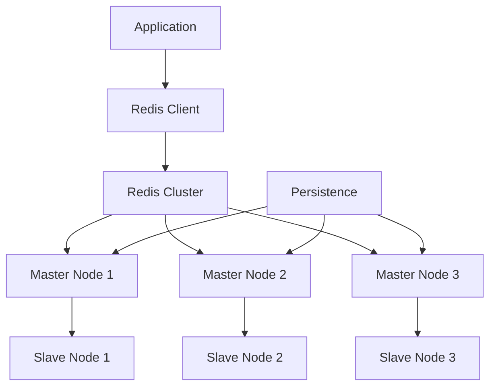

# Redis Caching Patterns - High-Performance Caching

## Overview

Redis is an in-memory data structure store that can be used as a database, cache, and message broker. It provides high-performance caching with various data structures and patterns.

## Key Concepts

- **Cache-Aside**: Application manages cache
- **Write-Through**: Write to cache and database
- **Write-Behind**: Write to cache, async to database
- **Refresh-Ahead**: Proactively refresh cache
- **TTL**: Time-to-live for cache entries
- **Eviction**: Removing entries when cache is full

## Redis Architecture



## Go Implementation

```go
package main

import (
    "context"
    "encoding/json"
    "fmt"
    "log"
    "time"

    "github.com/go-redis/redis/v8"
)

// CacheConfig represents Redis cache configuration
type CacheConfig struct {
    Addr     string
    Password string
    DB       int
    PoolSize int
    MinIdleConns int
    MaxRetries   int
    DialTimeout  time.Duration
    ReadTimeout  time.Duration
    WriteTimeout time.Duration
}

// DefaultConfig returns default Redis configuration
func DefaultConfig() *CacheConfig {
    return &CacheConfig{
        Addr:         "localhost:6379",
        Password:     "",
        DB:           0,
        PoolSize:     10,
        MinIdleConns: 5,
        MaxRetries:   3,
        DialTimeout:  5 * time.Second,
        ReadTimeout:  3 * time.Second,
        WriteTimeout: 3 * time.Second,
    }
}

// RedisCache represents a Redis cache client
type RedisCache struct {
    client *redis.Client
    config *CacheConfig
}

// NewRedisCache creates a new Redis cache client
func NewRedisCache(config *CacheConfig) (*RedisCache, error) {
    if config == nil {
        config = DefaultConfig()
    }

    client := redis.NewClient(&redis.Options{
        Addr:         config.Addr,
        Password:     config.Password,
        DB:           config.DB,
        PoolSize:     config.PoolSize,
        MinIdleConns: config.MinIdleConns,
        MaxRetries:   config.MaxRetries,
        DialTimeout:  config.DialTimeout,
        ReadTimeout:  config.ReadTimeout,
        WriteTimeout: config.WriteTimeout,
    })

    // Test connection
    ctx := context.Background()
    if err := client.Ping(ctx).Err(); err != nil {
        return nil, fmt.Errorf("failed to connect to Redis: %v", err)
    }

    return &RedisCache{
        client: client,
        config: config,
    }, nil
}

// Set sets a key-value pair with TTL
func (c *RedisCache) Set(ctx context.Context, key string, value interface{}, ttl time.Duration) error {
    data, err := json.Marshal(value)
    if err != nil {
        return fmt.Errorf("failed to marshal value: %v", err)
    }

    return c.client.Set(ctx, key, data, ttl).Err()
}

// Get gets a value by key
func (c *RedisCache) Get(ctx context.Context, key string, dest interface{}) error {
    val, err := c.client.Get(ctx, key).Result()
    if err != nil {
        if err == redis.Nil {
            return fmt.Errorf("key not found: %s", key)
        }
        return fmt.Errorf("failed to get key: %v", err)
    }

    return json.Unmarshal([]byte(val), dest)
}

// Delete deletes a key
func (c *RedisCache) Delete(ctx context.Context, key string) error {
    return c.client.Del(ctx, key).Err()
}

// Exists checks if a key exists
func (c *RedisCache) Exists(ctx context.Context, key string) (bool, error) {
    result, err := c.client.Exists(ctx, key).Result()
    if err != nil {
        return false, err
    }
    return result > 0, nil
}

// SetNX sets a key only if it doesn't exist
func (c *RedisCache) SetNX(ctx context.Context, key string, value interface{}, ttl time.Duration) (bool, error) {
    data, err := json.Marshal(value)
    if err != nil {
        return false, fmt.Errorf("failed to marshal value: %v", err)
    }

    return c.client.SetNX(ctx, key, data, ttl).Result()
}

// Increment increments a counter
func (c *RedisCache) Increment(ctx context.Context, key string) (int64, error) {
    return c.client.Incr(ctx, key).Result()
}

// Decrement decrements a counter
func (c *RedisCache) Decrement(ctx context.Context, key string) (int64, error) {
    return c.client.Decr(ctx, key).Result()
}

// Expire sets expiration for a key
func (c *RedisCache) Expire(ctx context.Context, key string, ttl time.Duration) error {
    return c.client.Expire(ctx, key, ttl).Err()
}

// TTL gets time to live for a key
func (c *RedisCache) TTL(ctx context.Context, key string) (time.Duration, error) {
    return c.client.TTL(ctx, key).Result()
}

// Close closes the Redis client
func (c *RedisCache) Close() error {
    return c.client.Close()
}

// CacheAsidePattern implements cache-aside pattern
type CacheAsidePattern struct {
    cache *RedisCache
    db    *MockDatabase
}

// NewCacheAsidePattern creates a new cache-aside pattern
func NewCacheAsidePattern(cache *RedisCache, db *MockDatabase) *CacheAsidePattern {
    return &CacheAsidePattern{
        cache: cache,
        db:    db,
    }
}

// Get gets data using cache-aside pattern
func (cap *CacheAsidePattern) Get(ctx context.Context, key string, dest interface{}) error {
    // Try to get from cache first
    if err := cap.cache.Get(ctx, key, dest); err == nil {
        log.Printf("Cache hit for key: %s", key)
        return nil
    }

    log.Printf("Cache miss for key: %s", key)

    // Get from database
    data, err := cap.db.Get(key)
    if err != nil {
        return fmt.Errorf("failed to get from database: %v", err)
    }

    // Store in cache
    if err := cap.cache.Set(ctx, key, data, 5*time.Minute); err != nil {
        log.Printf("Failed to store in cache: %v", err)
    }

    // Set the data in dest
    if err := json.Unmarshal([]byte(data), dest); err != nil {
        return fmt.Errorf("failed to unmarshal data: %v", err)
    }

    return nil
}

// Set sets data using cache-aside pattern
func (cap *CacheAsidePattern) Set(ctx context.Context, key string, value interface{}) error {
    // Update database
    data, err := json.Marshal(value)
    if err != nil {
        return fmt.Errorf("failed to marshal value: %v", err)
    }

    if err := cap.db.Set(key, string(data)); err != nil {
        return fmt.Errorf("failed to set in database: %v", err)
    }

    // Update cache
    if err := cap.cache.Set(ctx, key, value, 5*time.Minute); err != nil {
        log.Printf("Failed to update cache: %v", err)
    }

    return nil
}

// WriteThroughPattern implements write-through pattern
type WriteThroughPattern struct {
    cache *RedisCache
    db    *MockDatabase
}

// NewWriteThroughPattern creates a new write-through pattern
func NewWriteThroughPattern(cache *RedisCache, db *MockDatabase) *WriteThroughPattern {
    return &WriteThroughPattern{
        cache: cache,
        db:    db,
    }
}

// Set sets data using write-through pattern
func (wtp *WriteThroughPattern) Set(ctx context.Context, key string, value interface{}) error {
    // Update cache first
    if err := wtp.cache.Set(ctx, key, value, 5*time.Minute); err != nil {
        return fmt.Errorf("failed to set in cache: %v", err)
    }

    // Update database
    data, err := json.Marshal(value)
    if err != nil {
        return fmt.Errorf("failed to marshal value: %v", err)
    }

    if err := wtp.db.Set(key, string(data)); err != nil {
        // Rollback cache update
        wtp.cache.Delete(ctx, key)
        return fmt.Errorf("failed to set in database: %v", err)
    }

    return nil
}

// Get gets data using write-through pattern
func (wtp *WriteThroughPattern) Get(ctx context.Context, key string, dest interface{}) error {
    return wtp.cache.Get(ctx, key, dest)
}

// WriteBehindPattern implements write-behind pattern
type WriteBehindPattern struct {
    cache     *RedisCache
    db        *MockDatabase
    writeChan chan WriteOperation
}

// WriteOperation represents a write operation
type WriteOperation struct {
    Key   string
    Value interface{}
}

// NewWriteBehindPattern creates a new write-behind pattern
func NewWriteBehindPattern(cache *RedisCache, db *MockDatabase) *WriteBehindPattern {
    wtp := &WriteBehindPattern{
        cache:     cache,
        db:        db,
        writeChan: make(chan WriteOperation, 1000),
    }

    // Start background writer
    go wtp.backgroundWriter()

    return wtp
}

// Set sets data using write-behind pattern
func (wbp *WriteBehindPattern) Set(ctx context.Context, key string, value interface{}) error {
    // Update cache immediately
    if err := wbp.cache.Set(ctx, key, value, 5*time.Minute); err != nil {
        return fmt.Errorf("failed to set in cache: %v", err)
    }

    // Queue for database write
    select {
    case wbp.writeChan <- WriteOperation{Key: key, Value: value}:
    default:
        log.Printf("Write queue full, dropping write for key: %s", key)
    }

    return nil
}

// Get gets data using write-behind pattern
func (wbp *WriteBehindPattern) Get(ctx context.Context, key string, dest interface{}) error {
    return wbp.cache.Get(ctx, key, dest)
}

// backgroundWriter handles background database writes
func (wbp *WriteBehindPattern) backgroundWriter() {
    for op := range wbp.writeChan {
        data, err := json.Marshal(op.Value)
        if err != nil {
            log.Printf("Failed to marshal value for key %s: %v", op.Key, err)
            continue
        }

        if err := wbp.db.Set(op.Key, string(data)); err != nil {
            log.Printf("Failed to write to database for key %s: %v", op.Key, err)
        }
    }
}

// MockDatabase represents a mock database
type MockDatabase struct {
    data map[string]string
}

// NewMockDatabase creates a new mock database
func NewMockDatabase() *MockDatabase {
    return &MockDatabase{
        data: make(map[string]string),
    }
}

// Get gets data from database
func (db *MockDatabase) Get(key string) (string, error) {
    if data, exists := db.data[key]; exists {
        return data, nil
    }
    return "", fmt.Errorf("key not found: %s", key)
}

// Set sets data in database
func (db *MockDatabase) Set(key, value string) error {
    db.data[key] = value
    return nil
}

// Example usage
func main() {
    // Create Redis cache
    cache, err := NewRedisCache(DefaultConfig())
    if err != nil {
        log.Fatalf("Failed to create Redis cache: %v", err)
    }
    defer cache.Close()

    // Create mock database
    db := NewMockDatabase()

    // Test cache-aside pattern
    fmt.Println("=== Cache-Aside Pattern ===")
    cacheAside := NewCacheAsidePattern(cache, db)

    // Set some data in database
    db.Set("user:1", `{"id": 1, "name": "John Doe", "email": "john@example.com"}`)
    db.Set("user:2", `{"id": 2, "name": "Jane Smith", "email": "jane@example.com"}`)

    // Get data using cache-aside
    ctx := context.Background()
    var user1 map[string]interface{}
    if err := cacheAside.Get(ctx, "user:1", &user1); err != nil {
        log.Printf("Error getting user:1: %v", err)
    } else {
        fmt.Printf("User 1: %+v\n", user1)
    }

    // Test write-through pattern
    fmt.Println("\n=== Write-Through Pattern ===")
    writeThrough := NewWriteThroughPattern(cache, db)

    user3 := map[string]interface{}{
        "id":    3,
        "name":  "Bob Johnson",
        "email": "bob@example.com",
    }

    if err := writeThrough.Set(ctx, "user:3", user3); err != nil {
        log.Printf("Error setting user:3: %v", err)
    }

    var retrievedUser3 map[string]interface{}
    if err := writeThrough.Get(ctx, "user:3", &retrievedUser3); err != nil {
        log.Printf("Error getting user:3: %v", err)
    } else {
        fmt.Printf("User 3: %+v\n", retrievedUser3)
    }

    // Test write-behind pattern
    fmt.Println("\n=== Write-Behind Pattern ===")
    writeBehind := NewWriteBehindPattern(cache, db)

    user4 := map[string]interface{}{
        "id":    4,
        "name":  "Alice Brown",
        "email": "alice@example.com",
    }

    if err := writeBehind.Set(ctx, "user:4", user4); err != nil {
        log.Printf("Error setting user:4: %v", err)
    }

    var retrievedUser4 map[string]interface{}
    if err := writeBehind.Get(ctx, "user:4", &retrievedUser4); err != nil {
        log.Printf("Error getting user:4: %v", err)
    } else {
        fmt.Printf("User 4: %+v\n", retrievedUser4)
    }

    // Test counter operations
    fmt.Println("\n=== Counter Operations ===")
    if count, err := cache.Increment(ctx, "page_views"); err != nil {
        log.Printf("Error incrementing counter: %v", err)
    } else {
        fmt.Printf("Page views: %d\n", count)
    }

    // Test TTL
    fmt.Println("\n=== TTL Operations ===")
    if err := cache.Set(ctx, "temp_key", "temporary_value", 10*time.Second); err != nil {
        log.Printf("Error setting temp key: %v", err)
    }

    if ttl, err := cache.TTL(ctx, "temp_key"); err != nil {
        log.Printf("Error getting TTL: %v", err)
    } else {
        fmt.Printf("TTL for temp_key: %v\n", ttl)
    }

    // Wait for background writes to complete
    time.Sleep(2 * time.Second)
}
```

## Caching Patterns

### 1. Cache-Aside Pattern
- Application manages cache
- Check cache first, then database
- Update cache after database read

### 2. Write-Through Pattern
- Write to cache and database simultaneously
- Ensures data consistency
- Higher write latency

### 3. Write-Behind Pattern
- Write to cache immediately
- Async write to database
- Better write performance

### 4. Refresh-Ahead Pattern
- Proactively refresh cache
- Predict when data will be needed
- Reduces cache misses

### 5. Write-Around Pattern
- Write directly to database
- Cache only on read
- Good for write-heavy workloads

## Benefits

1. **Performance**: Faster data access
2. **Scalability**: Reduces database load
3. **Availability**: Cached data available during outages
4. **Cost**: Reduces database costs
5. **Flexibility**: Multiple caching strategies

## Trade-offs

1. **Consistency**: Cache and database may be out of sync
2. **Memory Usage**: Requires additional memory
3. **Complexity**: Adds complexity to the system
4. **Cache Invalidation**: Need to handle cache invalidation

## Use Cases

- **Web Applications**: Page caching, session storage
- **APIs**: Response caching, rate limiting
- **Databases**: Query result caching
- **CDNs**: Content delivery networks
- **Real-time Systems**: Session management

## Best Practices

1. **Cache Key Design**: Design meaningful cache keys
2. **TTL Strategy**: Set appropriate expiration times
3. **Cache Invalidation**: Implement proper invalidation
4. **Monitoring**: Monitor cache hit rates
5. **Memory Management**: Monitor memory usage

## Common Pitfalls

1. **Cache Stampede**: Multiple requests for same data
2. **Memory Leaks**: Not setting TTL
3. **Inconsistent Data**: Not handling invalidation
4. **Over-caching**: Caching unnecessary data
5. **Under-caching**: Not caching frequently accessed data

## Interview Questions

1. **What is Redis?**
   - An in-memory data structure store used for caching and messaging

2. **What are the different caching patterns?**
   - Cache-aside, write-through, write-behind, refresh-ahead, write-around

3. **How do you handle cache invalidation?**
   - Use TTL, event-based invalidation, or manual invalidation

4. **What are the benefits of caching?**
   - Performance, scalability, availability, cost reduction

## Time Complexity

- **Set**: O(1) for simple operations
- **Get**: O(1) for simple operations
- **Delete**: O(1) for simple operations
- **Complex Operations**: Varies by operation type

## Space Complexity

- **Memory Usage**: O(n) where n is number of cached items
- **Data Structures**: Varies by Redis data type

The optimal solution uses:
1. **Proper Pattern Selection**: Choose appropriate caching pattern
2. **Key Design**: Design meaningful and consistent cache keys
3. **TTL Strategy**: Set appropriate expiration times
4. **Monitoring**: Monitor cache performance and hit rates
