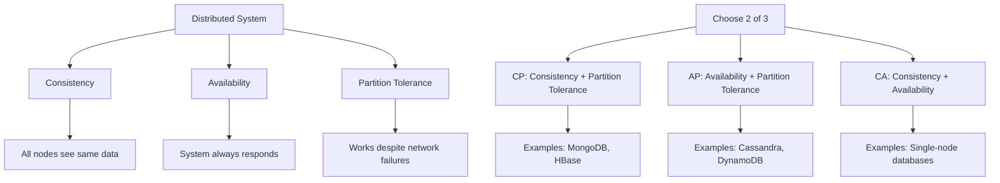

---
# Auto-generated front matter
Title: Cap Theorem
LastUpdated: 2025-11-06T20:45:58.288332
Tags: []
Status: draft
---

# CAP Theorem - Distributed System Trade-offs

## Overview

The CAP theorem states that in a distributed system, you can only guarantee two out of three properties: Consistency, Availability, and Partition tolerance. This is fundamental to understanding distributed database design and system architecture.

## Key Concepts

- **Consistency**: All nodes see the same data at the same time
- **Availability**: System remains operational and responsive
- **Partition Tolerance**: System continues to work despite network failures
- **Trade-offs**: Must choose which two properties to prioritize
- **Real-world**: All distributed systems must handle partitions

## CAP Theorem Visualization



## CAP Properties Deep Dive

### 1. Consistency (C)
- **Definition**: All nodes see the same data simultaneously
- **Implementation**: Synchronous replication, consensus protocols
- **Trade-off**: May sacrifice availability during partitions
- **Example**: Financial systems where data must be consistent

### 2. Availability (A)
- **Definition**: System remains operational and responsive
- **Implementation**: Asynchronous replication, eventual consistency
- **Trade-off**: May serve stale data during partitions
- **Example**: Social media feeds, content delivery

### 3. Partition Tolerance (P)
- **Definition**: System continues working despite network failures
- **Implementation**: Multiple data centers, redundancy
- **Reality**: All distributed systems must handle partitions
- **Example**: Global systems with multiple regions

## Go Implementation - CAP Theorem Examples

```go
package main

import (
    "context"
    "fmt"
    "log"
    "sync"
    "time"
)

// Node represents a distributed system node
type Node struct {
    ID       string
    Data     map[string]interface{}
    IsOnline bool
    Mutex    sync.RWMutex
}

// NewNode creates a new node
func NewNode(id string) *Node {
    return &Node{
        ID:       id,
        Data:     make(map[string]interface{}),
        IsOnline: true,
    }
}

// Set sets a key-value pair
func (n *Node) Set(key string, value interface{}) {
    n.Mutex.Lock()
    defer n.Mutex.Unlock()
    n.Data[key] = value
}

// Get gets a value by key
func (n *Node) Get(key string) (interface{}, bool) {
    n.Mutex.RLock()
    defer n.Mutex.RUnlock()
    value, exists := n.Data[key]
    return value, exists
}

// SetOffline sets the node offline
func (n *Node) SetOffline() {
    n.Mutex.Lock()
    defer n.Mutex.Unlock()
    n.IsOnline = false
}

// SetOnline sets the node online
func (n *Node) SetOnline() {
    n.Mutex.Lock()
    defer n.Mutex.Unlock()
    n.IsOnline = true
}

// IsAvailable checks if the node is available
func (n *Node) IsAvailable() bool {
    n.Mutex.RLock()
    defer n.Mutex.RUnlock()
    return n.IsOnline
}

// CP System - Consistency + Partition Tolerance
type CPSystem struct {
    nodes []*Node
    mutex sync.RWMutex
}

// NewCPSystem creates a new CP system
func NewCPSystem(nodeIDs []string) *CPSystem {
    nodes := make([]*Node, len(nodeIDs))
    for i, id := range nodeIDs {
        nodes[i] = NewNode(id)
    }
    return &CPSystem{nodes: nodes}
}

// Write writes data with strong consistency
func (cp *CPSystem) Write(key string, value interface{}) error {
    cp.mutex.Lock()
    defer cp.mutex.Unlock()
    
    // Write to all available nodes synchronously
    var errors []error
    for _, node := range cp.nodes {
        if node.IsAvailable() {
            node.Set(key, value)
        } else {
            errors = append(errors, fmt.Errorf("node %s is offline", node.ID))
        }
    }
    
    // If any node is offline, consider write failed (strong consistency)
    if len(errors) > 0 {
        return fmt.Errorf("write failed due to offline nodes: %v", errors)
    }
    
    return nil
}

// Read reads data with strong consistency
func (cp *CPSystem) Read(key string) (interface{}, error) {
    cp.mutex.RLock()
    defer cp.mutex.RUnlock()
    
    // Read from first available node
    for _, node := range cp.nodes {
        if node.IsAvailable() {
            if value, exists := node.Get(key); exists {
                return value, nil
            }
        }
    }
    
    return nil, fmt.Errorf("key not found or no nodes available")
}

// AP System - Availability + Partition Tolerance
type APSystem struct {
    nodes []*Node
    mutex sync.RWMutex
}

// NewAPSystem creates a new AP system
func NewAPSystem(nodeIDs []string) *APSystem {
    nodes := make([]*Node, len(nodeIDs))
    for i, id := range nodeIDs {
        nodes[i] = NewNode(id)
    }
    return &APSystem{nodes: nodes}
}

// Write writes data with eventual consistency
func (ap *APSystem) Write(key string, value interface{}) error {
    ap.mutex.Lock()
    defer ap.mutex.Unlock()
    
    // Write to any available node (eventual consistency)
    for _, node := range ap.nodes {
        if node.IsAvailable() {
            node.Set(key, value)
            // Asynchronously replicate to other nodes
            go ap.replicateAsync(key, value)
            return nil
        }
    }
    
    return fmt.Errorf("no nodes available")
}

// Read reads data with eventual consistency
func (ap *APSystem) Read(key string) (interface{}, error) {
    ap.mutex.RLock()
    defer ap.mutex.RUnlock()
    
    // Read from any available node
    for _, node := range ap.nodes {
        if node.IsAvailable() {
            if value, exists := node.Get(key); exists {
                return value, nil
            }
        }
    }
    
    return nil, fmt.Errorf("key not found or no nodes available")
}

// replicateAsync replicates data to other nodes asynchronously
func (ap *APSystem) replicateAsync(key string, value interface{}) {
    for _, node := range ap.nodes {
        if node.IsAvailable() {
            node.Set(key, value)
        }
    }
}

// CA System - Consistency + Availability (Single Node)
type CASystem struct {
    node *Node
}

// NewCASystem creates a new CA system
func NewCASystem(nodeID string) *CASystem {
    return &CASystem{node: NewNode(nodeID)}
}

// Write writes data with strong consistency
func (ca *CASystem) Write(key string, value interface{}) error {
    if !ca.node.IsAvailable() {
        return fmt.Errorf("node is offline")
    }
    ca.node.Set(key, value)
    return nil
}

// Read reads data with strong consistency
func (ca *CASystem) Read(key string) (interface{}, error) {
    if !ca.node.IsAvailable() {
        return nil, fmt.Errorf("node is offline")
    }
    if value, exists := ca.node.Get(key); exists {
        return value, nil
    }
    return nil, fmt.Errorf("key not found")
}

// DistributedSystem represents a generic distributed system
type DistributedSystem interface {
    Write(key string, value interface{}) error
    Read(key string) (interface{}, error)
    GetSystemType() string
}

// GetSystemType returns the system type
func (cp *CPSystem) GetSystemType() string { return "CP" }
func (ap *APSystem) GetSystemType() string { return "AP" }
func (ca *CASystem) GetSystemType() string { return "CA" }

// TestCAPTheorem tests different CAP theorem scenarios
func TestCAPTheorem() {
    fmt.Println("=== CAP Theorem Demonstration ===\n")
    
    // Create systems
    cpSystem := NewCPSystem([]string{"node1", "node2", "node3"})
    apSystem := NewAPSystem([]string{"node1", "node2", "node3"})
    caSystem := NewCASystem("single-node")
    
    systems := []DistributedSystem{cpSystem, apSystem, caSystem}
    
    // Test normal operation
    fmt.Println("1. Normal Operation (All nodes online):")
    for _, system := range systems {
        err := system.Write("test-key", "test-value")
        if err != nil {
            fmt.Printf("  %s System: Write failed - %v\n", system.GetSystemType(), err)
        } else {
            value, err := system.Read("test-key")
            if err != nil {
                fmt.Printf("  %s System: Read failed - %v\n", system.GetSystemType(), err)
            } else {
                fmt.Printf("  %s System: Write/Read successful - %v\n", system.GetSystemType(), value)
            }
        }
    }
    
    // Simulate partition (take one node offline)
    fmt.Println("\n2. Partition Scenario (One node offline):")
    cpSystem.nodes[0].SetOffline()
    apSystem.nodes[0].SetOffline()
    
    for _, system := range systems {
        err := system.Write("partition-key", "partition-value")
        if err != nil {
            fmt.Printf("  %s System: Write failed - %v\n", system.GetSystemType(), err)
        } else {
            value, err := system.Read("partition-key")
            if err != nil {
                fmt.Printf("  %s System: Read failed - %v\n", system.GetSystemType(), err)
            } else {
                fmt.Printf("  %s System: Write/Read successful - %v\n", system.GetSystemType(), value)
            }
        }
    }
    
    // Simulate complete partition (all nodes offline)
    fmt.Println("\n3. Complete Partition (All nodes offline):")
    for _, node := range cpSystem.nodes {
        node.SetOffline()
    }
    for _, node := range apSystem.nodes {
        node.SetOffline()
    }
    caSystem.node.SetOffline()
    
    for _, system := range systems {
        err := system.Write("complete-partition-key", "complete-partition-value")
        if err != nil {
            fmt.Printf("  %s System: Write failed - %v\n", system.GetSystemType(), err)
        } else {
            value, err := system.Read("complete-partition-key")
            if err != nil {
                fmt.Printf("  %s System: Read failed - %v\n", system.GetSystemType(), err)
            } else {
                fmt.Printf("  %s System: Write/Read successful - %v\n", system.GetSystemType(), value)
            }
        }
    }
}

// Example usage
func main() {
    TestCAPTheorem()
    
    fmt.Println("\n=== CAP Theorem Analysis ===")
    fmt.Println("CP System (Consistency + Partition Tolerance):")
    fmt.Println("  - Prioritizes data consistency over availability")
    fmt.Println("  - May become unavailable during partitions")
    fmt.Println("  - Examples: MongoDB, HBase, traditional RDBMS")
    
    fmt.Println("\nAP System (Availability + Partition Tolerance):")
    fmt.Println("  - Prioritizes availability over consistency")
    fmt.Println("  - May serve stale data during partitions")
    fmt.Println("  - Examples: Cassandra, DynamoDB, CouchDB")
    
    fmt.Println("\nCA System (Consistency + Availability):")
    fmt.Println("  - Single-node system")
    fmt.Println("  - Cannot handle network partitions")
    fmt.Println("  - Examples: Single MySQL instance, SQLite")
    
    fmt.Println("\nReal-world Considerations:")
    fmt.Println("  - All distributed systems must handle partitions (P)")
    fmt.Println("  - Choose between CP and AP based on requirements")
    fmt.Println("  - Many systems use different strategies for different data")
    fmt.Println("  - Consider eventual consistency and conflict resolution")
}
```

## Real-world Examples

### CP Systems (Consistency + Partition Tolerance)
- **MongoDB**: Strong consistency within replica sets
- **HBase**: Consistent reads and writes
- **Traditional RDBMS**: ACID properties with replication

### AP Systems (Availability + Partition Tolerance)
- **Cassandra**: High availability with eventual consistency
- **DynamoDB**: Always available with eventual consistency
- **CouchDB**: Multi-master replication

### CA Systems (Consistency + Availability)
- **Single MySQL**: No network partitions
- **SQLite**: Local database
- **In-memory databases**: Single process

## CAP Theorem in Practice

### 1. Financial Systems
- **Priority**: Consistency (CP)
- **Reason**: Data accuracy is critical
- **Trade-off**: May sacrifice availability during partitions

### 2. Social Media
- **Priority**: Availability (AP)
- **Reason**: User experience is critical
- **Trade-off**: May serve stale data

### 3. Content Delivery
- **Priority**: Availability (AP)
- **Reason**: Global accessibility is critical
- **Trade-off**: Content may be slightly outdated

### 4. E-commerce
- **Mixed Approach**: Different strategies for different data
- **Inventory**: Consistency (CP)
- **Product Catalog**: Availability (AP)
- **User Sessions**: Availability (AP)

## Benefits

1. **Clear Trade-offs**: Understand system limitations
2. **Design Decisions**: Make informed architectural choices
3. **System Selection**: Choose appropriate technologies
4. **Performance Optimization**: Balance consistency and availability
5. **Fault Tolerance**: Design for network partitions

## Common Misconceptions

1. **"Choose 2 of 3"**: Actually, you must choose between CP and AP
2. **"Partition Tolerance is Optional"**: All distributed systems must handle partitions
3. **"Consistency vs Availability"**: It's about consistency vs availability during partitions
4. **"Perfect Consistency"**: Even CP systems may have eventual consistency
5. **"Always Available"**: Even AP systems may have downtime

## Interview Questions

1. **What is the CAP theorem?**
   - In distributed systems, you can only guarantee 2 of 3: Consistency, Availability, Partition Tolerance

2. **Can you have all three CAP properties?**
   - No, you must choose between CP and AP in distributed systems

3. **What's the difference between CP and AP systems?**
   - CP prioritizes consistency, AP prioritizes availability during partitions

4. **How do you choose between CP and AP?**
   - Based on business requirements: data accuracy vs user experience

## Best Practices

1. **Understand Requirements**: Know what's most important for your use case
2. **Design for Partitions**: All distributed systems must handle network failures
3. **Consider Eventual Consistency**: Many systems use eventual consistency
4. **Monitor and Measure**: Track consistency and availability metrics
5. **Plan for Failures**: Design graceful degradation strategies

## Time Complexity

- **CP Systems**: O(n) where n is number of nodes (synchronous)
- **AP Systems**: O(1) for writes, O(n) for reads (asynchronous)
- **CA Systems**: O(1) for all operations (single node)

## Space Complexity

- **Replication**: O(n) where n is number of nodes
- **Conflict Resolution**: O(m) where m is number of conflicts
- **Metadata**: O(n) where n is number of nodes

The optimal solution uses:
1. **Clear Requirements**: Understand what's most important
2. **Appropriate Trade-offs**: Choose CP or AP based on needs
3. **Graceful Degradation**: Handle partitions gracefully
4. **Monitoring**: Track system behavior and performance
