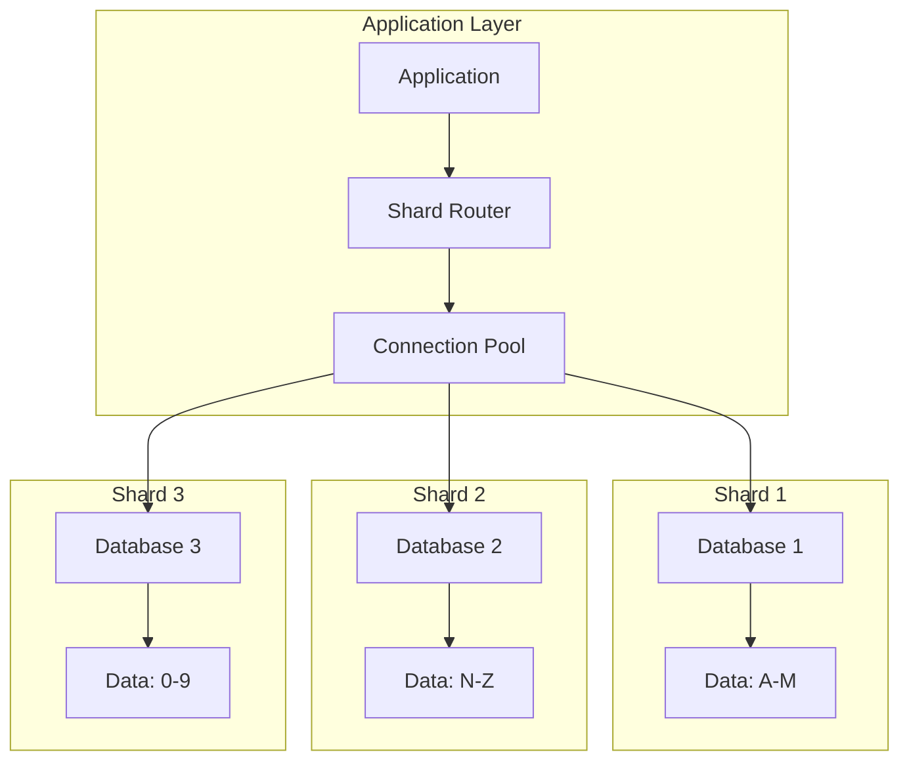
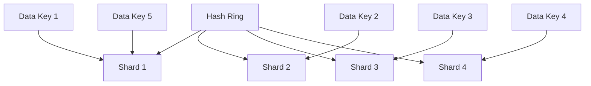
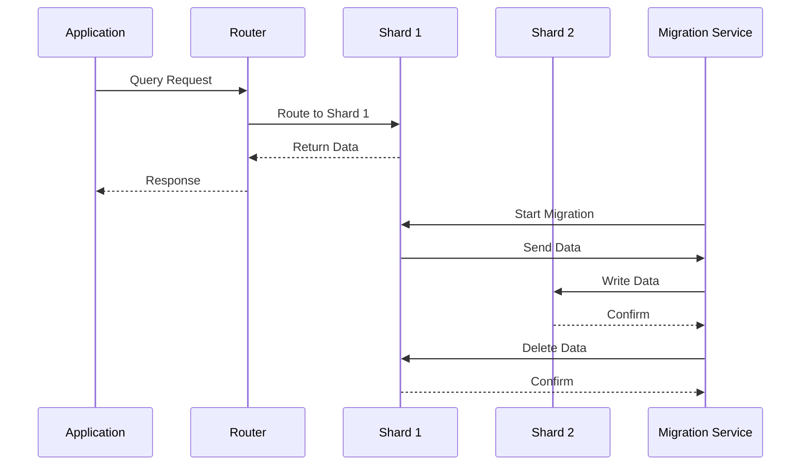

# 🗄️ **Database Sharding**

## 📘 **Theory**

Database sharding is a horizontal partitioning strategy that distributes data across multiple database instances or servers. It's a critical technique for scaling databases beyond the capacity of a single machine while maintaining performance and availability.

### **Why Database Sharding Matters**

- **Horizontal Scaling**: Scale beyond single machine limits
- **Performance**: Distribute load across multiple servers
- **Availability**: Reduce impact of single point of failure
- **Geographic Distribution**: Place data closer to users
- **Cost Efficiency**: Use commodity hardware instead of expensive servers
- **Maintenance**: Easier maintenance and upgrades
- **Compliance**: Meet data residency requirements
- **Load Distribution**: Balance read/write operations

### **Key Concepts**

1. **Shard Key**: Field used to determine which shard stores data
2. **Sharding Strategy**: Method for distributing data across shards
3. **Consistent Hashing**: Hash-based sharding for even distribution
4. **Range Sharding**: Range-based sharding for ordered data
5. **Directory-Based Sharding**: Lookup table for shard assignment
6. **Cross-Shard Queries**: Queries spanning multiple shards
7. **Data Rebalancing**: Moving data between shards
8. **Shard Monitoring**: Tracking shard health and performance

### **Sharding Strategies**

1. **Hash-Based Sharding**: Use hash function on shard key
2. **Range-Based Sharding**: Partition by value ranges
3. **Directory-Based Sharding**: Use lookup table for shard assignment
4. **Composite Sharding**: Combine multiple sharding strategies
5. **Consistent Hashing**: Ring-based sharding for dynamic scaling
6. **Geographic Sharding**: Partition by geographic location
7. **Tenant-Based Sharding**: Separate shards for different tenants
8. **Time-Based Sharding**: Partition by time periods

### **Common Pitfalls and Best Practices**

- **Hot Spots**: Avoid uneven data distribution
- **Cross-Shard Queries**: Minimize queries spanning multiple shards
- **Data Consistency**: Handle consistency across shards
- **Shard Rebalancing**: Plan for data movement between shards
- **Monitoring**: Monitor shard health and performance
- **Backup Strategy**: Implement proper backup and recovery
- **Schema Changes**: Handle schema evolution across shards
- **Testing**: Test sharding logic thoroughly

## 📊 **Diagrams**

### **Sharding Architecture**



### **Consistent Hashing Ring**



### **Shard Rebalancing Process**



## 🧩 **Example**

**Scenario**: Implement database sharding for a user management system

**Input**:

- User data with user_id as shard key
- 3 database shards
- Hash-based sharding strategy
- Need to support cross-shard queries

**Expected Output**:

- Sharded database system
- Automatic shard routing
- Cross-shard query support
- Data rebalancing capability

**Step-by-step**:

1. Design sharding strategy
2. Implement shard router
3. Create database connections
4. Implement data routing logic
5. Add cross-shard query support
6. Implement monitoring and rebalancing

## 💻 **Implementation (Golang)**

```go
package main

import (
    "context"
    "crypto/md5"
    "database/sql"
    "encoding/hex"
    "fmt"
    "log"
    "strconv"
    "sync"
    "time"

    _ "github.com/go-sql-driver/mysql"
)

// Shard represents a database shard
type Shard struct {
    ID       int
    Host     string
    Port     int
    Database string
    Username string
    Password string
    DB       *sql.DB
    Status   string
    Load     float64
}

// ShardRouter routes queries to appropriate shards
type ShardRouter struct {
    shards      map[int]*Shard
    shardCount  int
    strategy    string
    mutex       sync.RWMutex
    consistentHash *ConsistentHash
}

// ConsistentHash implements consistent hashing
type ConsistentHash struct {
    ring     map[uint32]int
    sortedKeys []uint32
    shards   map[int]*Shard
    mutex    sync.RWMutex
}

// User represents a user entity
type User struct {
    ID       int    `json:"id"`
    Username string `json:"username"`
    Email    string `json:"email"`
    Name     string `json:"name"`
    ShardID  int    `json:"shard_id"`
}

// QueryResult represents a query result
type QueryResult struct {
    Data  []map[string]interface{}
    Error error
    ShardID int
}

// NewShardRouter creates a new shard router
func NewShardRouter(strategy string) *ShardRouter {
    return &ShardRouter{
        shards:      make(map[int]*Shard),
        shardCount:  0,
        strategy:    strategy,
        consistentHash: NewConsistentHash(),
    }
}

// AddShard adds a shard to the router
func (sr *ShardRouter) AddShard(shard *Shard) error {
    sr.mutex.Lock()
    defer sr.mutex.Unlock()

    // Connect to database
    dsn := fmt.Sprintf("%s:%s@tcp(%s:%d)/%s?charset=utf8mb4&parseTime=True&loc=Local",
        shard.Username, shard.Password, shard.Host, shard.Port, shard.Database)

    db, err := sql.Open("mysql", dsn)
    if err != nil {
        return fmt.Errorf("failed to connect to shard %d: %v", shard.ID, err)
    }

    // Test connection
    if err := db.Ping(); err != nil {
        return fmt.Errorf("failed to ping shard %d: %v", shard.ID, err)
    }

    shard.DB = db
    shard.Status = "active"
    sr.shards[shard.ID] = shard
    sr.shardCount++

    // Add to consistent hash
    sr.consistentHash.AddShard(shard.ID, shard)

    return nil
}

// GetShard returns the shard for a given key
func (sr *ShardRouter) GetShard(key string) (*Shard, error) {
    sr.mutex.RLock()
    defer sr.mutex.RUnlock()

    switch sr.strategy {
    case "hash":
        return sr.getShardByHash(key)
    case "range":
        return sr.getShardByRange(key)
    case "consistent":
        return sr.consistentHash.GetShard(key)
    default:
        return sr.getShardByHash(key)
    }
}

// getShardByHash returns shard using hash-based strategy
func (sr *ShardRouter) getShardByHash(key string) (*Shard, error) {
    if sr.shardCount == 0 {
        return nil, fmt.Errorf("no shards available")
    }

    hash := md5.Sum([]byte(key))
    hashInt := int(hash[0]) % sr.shardCount

    // Find shard by hash
    for _, shard := range sr.shards {
        if shard.ID == hashInt {
            return shard, nil
        }
    }

    return nil, fmt.Errorf("shard not found for key: %s", key)
}

// getShardByRange returns shard using range-based strategy
func (sr *ShardRouter) getShardByRange(key string) (*Shard, error) {
    if sr.shardCount == 0 {
        return nil, fmt.Errorf("no shards available")
    }

    // Simple range-based sharding
    // In practice, you'd use more sophisticated range logic
    keyInt, err := strconv.Atoi(key)
    if err != nil {
        return nil, fmt.Errorf("invalid key for range sharding: %s", key)
    }

    shardID := keyInt % sr.shardCount
    shard, exists := sr.shards[shardID]
    if !exists {
        return nil, fmt.Errorf("shard not found: %d", shardID)
    }

    return shard, nil
}

// ExecuteQuery executes a query on the appropriate shard
func (sr *ShardRouter) ExecuteQuery(ctx context.Context, query string, args ...interface{}) (*QueryResult, error) {
    // Extract shard key from query (simplified)
    shardKey := sr.extractShardKey(query, args...)

    shard, err := sr.GetShard(shardKey)
    if err != nil {
        return nil, err
    }

    rows, err := shard.DB.QueryContext(ctx, query, args...)
    if err != nil {
        return &QueryResult{Error: err, ShardID: shard.ID}, err
    }
    defer rows.Close()

    columns, err := rows.Columns()
    if err != nil {
        return &QueryResult{Error: err, ShardID: shard.ID}, err
    }

    var results []map[string]interface{}

    for rows.Next() {
        values := make([]interface{}, len(columns))
        valuePtrs := make([]interface{}, len(columns))

        for i := range values {
            valuePtrs[i] = &values[i]
        }

        if err := rows.Scan(valuePtrs...); err != nil {
            return &QueryResult{Error: err, ShardID: shard.ID}, err
        }

        row := make(map[string]interface{})
        for i, col := range columns {
            row[col] = values[i]
        }
        results = append(results, row)
    }

    return &QueryResult{Data: results, ShardID: shard.ID}, nil
}

// ExecuteCrossShardQuery executes a query across all shards
func (sr *ShardRouter) ExecuteCrossShardQuery(ctx context.Context, query string, args ...interface{}) ([]*QueryResult, error) {
    sr.mutex.RLock()
    defer sr.mutex.RUnlock()

    var results []*QueryResult
    var wg sync.WaitGroup
    var mutex sync.Mutex

    for _, shard := range sr.shards {
        if shard.Status != "active" {
            continue
        }

        wg.Add(1)
        go func(s *Shard) {
            defer wg.Done()

            rows, err := s.DB.QueryContext(ctx, query, args...)
            if err != nil {
                mutex.Lock()
                results = append(results, &QueryResult{Error: err, ShardID: s.ID})
                mutex.Unlock()
                return
            }
            defer rows.Close()

            columns, err := rows.Columns()
            if err != nil {
                mutex.Lock()
                results = append(results, &QueryResult{Error: err, ShardID: s.ID})
                mutex.Unlock()
                return
            }

            var shardResults []map[string]interface{}

            for rows.Next() {
                values := make([]interface{}, len(columns))
                valuePtrs := make([]interface{}, len(columns))

                for i := range values {
                    valuePtrs[i] = &values[i]
                }

                if err := rows.Scan(valuePtrs...); err != nil {
                    mutex.Lock()
                    results = append(results, &QueryResult{Error: err, ShardID: s.ID})
                    mutex.Unlock()
                    return
                }

                row := make(map[string]interface{})
                for i, col := range columns {
                    row[col] = values[i]
                }
                shardResults = append(shardResults, row)
            }

            mutex.Lock()
            results = append(results, &QueryResult{Data: shardResults, ShardID: s.ID})
            mutex.Unlock()
        }(shard)
    }

    wg.Wait()
    return results, nil
}

// extractShardKey extracts shard key from query (simplified)
func (sr *ShardRouter) extractShardKey(query string, args ...interface{}) string {
    // In practice, you'd parse the query to extract the shard key
    // For this example, we'll use the first argument as the shard key
    if len(args) > 0 {
        return fmt.Sprintf("%v", args[0])
    }
    return "default"
}

// InsertUser inserts a user into the appropriate shard
func (sr *ShardRouter) InsertUser(ctx context.Context, user *User) error {
    shard, err := sr.GetShard(fmt.Sprintf("%d", user.ID))
    if err != nil {
        return err
    }

    query := "INSERT INTO users (id, username, email, name) VALUES (?, ?, ?, ?)"
    _, err = shard.DB.ExecContext(ctx, query, user.ID, user.Username, user.Email, user.Name)
    if err != nil {
        return err
    }

    user.ShardID = shard.ID
    return nil
}

// GetUser retrieves a user from the appropriate shard
func (sr *ShardRouter) GetUser(ctx context.Context, userID int) (*User, error) {
    shard, err := sr.GetShard(fmt.Sprintf("%d", userID))
    if err != nil {
        return nil, err
    }

    query := "SELECT id, username, email, name FROM users WHERE id = ?"
    row := shard.DB.QueryRowContext(ctx, query, userID)

    var user User
    err = row.Scan(&user.ID, &user.Username, &user.Email, &user.Name)
    if err != nil {
        return nil, err
    }

    user.ShardID = shard.ID
    return &user, nil
}

// GetAllUsers retrieves all users from all shards
func (sr *ShardRouter) GetAllUsers(ctx context.Context) ([]*User, error) {
    results, err := sr.ExecuteCrossShardQuery(ctx, "SELECT id, username, email, name FROM users")
    if err != nil {
        return nil, err
    }

    var users []*User
    for _, result := range results {
        if result.Error != nil {
            log.Printf("Error querying shard %d: %v", result.ShardID, result.Error)
            continue
        }

        for _, row := range result.Data {
            user := &User{
                ID:       int(row["id"].(int64)),
                Username: row["username"].(string),
                Email:    row["email"].(string),
                Name:     row["name"].(string),
                ShardID:  result.ShardID,
            }
            users = append(users, user)
        }
    }

    return users, nil
}

// GetShardStats returns statistics for all shards
func (sr *ShardRouter) GetShardStats() map[int]map[string]interface{} {
    sr.mutex.RLock()
    defer sr.mutex.RUnlock()

    stats := make(map[int]map[string]interface{})

    for id, shard := range sr.shards {
        shardStats := map[string]interface{}{
            "id":       shard.ID,
            "host":     shard.Host,
            "port":     shard.Port,
            "status":   shard.Status,
            "load":     shard.Load,
        }

        // Get row count
        if shard.Status == "active" {
            var count int
            err := shard.DB.QueryRow("SELECT COUNT(*) FROM users").Scan(&count)
            if err == nil {
                shardStats["row_count"] = count
            }
        }

        stats[id] = shardStats
    }

    return stats
}

// NewConsistentHash creates a new consistent hash
func NewConsistentHash() *ConsistentHash {
    return &ConsistentHash{
        ring:   make(map[uint32]int),
        shards: make(map[int]*Shard),
    }
}

// AddShard adds a shard to the consistent hash
func (ch *ConsistentHash) AddShard(shardID int, shard *Shard) {
    ch.mutex.Lock()
    defer ch.mutex.Unlock()

    ch.shards[shardID] = shard

    // Add multiple virtual nodes for better distribution
    for i := 0; i < 100; i++ {
        key := fmt.Sprintf("%d:%d", shardID, i)
        hash := md5.Sum([]byte(key))
        hashInt := uint32(hash[0])<<24 | uint32(hash[1])<<16 | uint32(hash[2])<<8 | uint32(hash[3])
        ch.ring[hashInt] = shardID
    }

    // Rebuild sorted keys
    ch.rebuildSortedKeys()
}

// GetShard returns the shard for a given key
func (ch *ConsistentHash) GetShard(key string) (*Shard, error) {
    ch.mutex.RLock()
    defer ch.mutex.RUnlock()

    if len(ch.ring) == 0 {
        return nil, fmt.Errorf("no shards available")
    }

    hash := md5.Sum([]byte(key))
    hashInt := uint32(hash[0])<<24 | uint32(hash[1])<<16 | uint32(hash[2])<<8 | uint32(hash[3])

    // Find the first shard with hash >= hashInt
    for _, ringHash := range ch.sortedKeys {
        if ringHash >= hashInt {
            shardID := ch.ring[ringHash]
            return ch.shards[shardID], nil
        }
    }

    // Wrap around to the first shard
    shardID := ch.ring[ch.sortedKeys[0]]
    return ch.shards[shardID], nil
}

// rebuildSortedKeys rebuilds the sorted keys array
func (ch *ConsistentHash) rebuildSortedKeys() {
    ch.sortedKeys = make([]uint32, 0, len(ch.ring))
    for hash := range ch.ring {
        ch.sortedKeys = append(ch.sortedKeys, hash)
    }

    // Sort keys
    for i := 0; i < len(ch.sortedKeys); i++ {
        for j := i + 1; j < len(ch.sortedKeys); j++ {
            if ch.sortedKeys[i] > ch.sortedKeys[j] {
                ch.sortedKeys[i], ch.sortedKeys[j] = ch.sortedKeys[j], ch.sortedKeys[i]
            }
        }
    }
}

// Example usage
func main() {
    // Create shard router
    router := NewShardRouter("hash")

    // Create shards
    shards := []*Shard{
        {
            ID:       0,
            Host:     "localhost",
            Port:     3306,
            Database: "shard_0",
            Username: "root",
            Password: "password",
        },
        {
            ID:       1,
            Host:     "localhost",
            Port:     3307,
            Database: "shard_1",
            Username: "root",
            Password: "password",
        },
        {
            ID:       2,
            Host:     "localhost",
            Port:     3308,
            Database: "shard_2",
            Username: "root",
            Password: "password",
        },
    }

    // Add shards to router
    for _, shard := range shards {
        if err := router.AddShard(shard); err != nil {
            log.Printf("Failed to add shard %d: %v", shard.ID, err)
        } else {
            log.Printf("Added shard %d successfully", shard.ID)
        }
    }

    // Create users
    users := []*User{
        {ID: 1, Username: "user1", Email: "user1@example.com", Name: "User One"},
        {ID: 2, Username: "user2", Email: "user2@example.com", Name: "User Two"},
        {ID: 3, Username: "user3", Email: "user3@example.com", Name: "User Three"},
        {ID: 4, Username: "user4", Email: "user4@example.com", Name: "User Four"},
        {ID: 5, Username: "user5", Email: "user5@example.com", Name: "User Five"},
    }

    // Insert users
    ctx := context.Background()
    for _, user := range users {
        if err := router.InsertUser(ctx, user); err != nil {
            log.Printf("Failed to insert user %d: %v", user.ID, err)
        } else {
            log.Printf("Inserted user %d into shard %d", user.ID, user.ShardID)
        }
    }

    // Retrieve users
    for _, user := range users {
        retrievedUser, err := router.GetUser(ctx, user.ID)
        if err != nil {
            log.Printf("Failed to retrieve user %d: %v", user.ID, err)
        } else {
            log.Printf("Retrieved user %d from shard %d: %+v", retrievedUser.ID, retrievedUser.ShardID, retrievedUser)
        }
    }

    // Get all users
    allUsers, err := router.GetAllUsers(ctx)
    if err != nil {
        log.Printf("Failed to get all users: %v", err)
    } else {
        log.Printf("Retrieved %d users from all shards", len(allUsers))
    }

    // Get shard statistics
    stats := router.GetShardStats()
    log.Printf("Shard statistics: %+v", stats)
}
```

## 💻 **Implementation (Node.js)**

```javascript
const mysql = require("mysql2/promise");
const crypto = require("crypto");

class Shard {
  constructor(id, host, port, database, username, password) {
    this.id = id;
    this.host = host;
    this.port = port;
    this.database = database;
    this.username = username;
    this.password = password;
    this.db = null;
    this.status = "inactive";
    this.load = 0;
  }

  async connect() {
    try {
      this.db = await mysql.createConnection({
        host: this.host,
        port: this.port,
        database: this.database,
        user: this.username,
        password: this.password,
      });

      this.status = "active";
      return true;
    } catch (error) {
      console.error(`Failed to connect to shard ${this.id}:`, error.message);
      return false;
    }
  }

  async disconnect() {
    if (this.db) {
      await this.db.end();
      this.db = null;
      this.status = "inactive";
    }
  }
}

class ConsistentHash {
  constructor() {
    this.ring = new Map();
    this.sortedKeys = [];
    this.shards = new Map();
  }

  addShard(shardId, shard) {
    this.shards.set(shardId, shard);

    // Add multiple virtual nodes for better distribution
    for (let i = 0; i < 100; i++) {
      const key = `${shardId}:${i}`;
      const hash = crypto.createHash("md5").update(key).digest("hex");
      const hashInt = parseInt(hash.substring(0, 8), 16);
      this.ring.set(hashInt, shardId);
    }

    this.rebuildSortedKeys();
  }

  getShard(key) {
    if (this.ring.size === 0) {
      throw new Error("No shards available");
    }

    const hash = crypto.createHash("md5").update(key).digest("hex");
    const hashInt = parseInt(hash.substring(0, 8), 16);

    // Find the first shard with hash >= hashInt
    for (const ringHash of this.sortedKeys) {
      if (ringHash >= hashInt) {
        const shardId = this.ring.get(ringHash);
        return this.shards.get(shardId);
      }
    }

    // Wrap around to the first shard
    const shardId = this.ring.get(this.sortedKeys[0]);
    return this.shards.get(shardId);
  }

  rebuildSortedKeys() {
    this.sortedKeys = Array.from(this.ring.keys()).sort((a, b) => a - b);
  }
}

class ShardRouter {
  constructor(strategy = "hash") {
    this.shards = new Map();
    this.shardCount = 0;
    this.strategy = strategy;
    this.consistentHash = new ConsistentHash();
  }

  async addShard(shard) {
    const connected = await shard.connect();
    if (!connected) {
      throw new Error(`Failed to connect to shard ${shard.id}`);
    }

    this.shards.set(shard.id, shard);
    this.shardCount++;

    // Add to consistent hash
    this.consistentHash.addShard(shard.id, shard);

    console.log(`Added shard ${shard.id} successfully`);
  }

  getShard(key) {
    switch (this.strategy) {
      case "hash":
        return this.getShardByHash(key);
      case "range":
        return this.getShardByRange(key);
      case "consistent":
        return this.consistentHash.getShard(key);
      default:
        return this.getShardByHash(key);
    }
  }

  getShardByHash(key) {
    if (this.shardCount === 0) {
      throw new Error("No shards available");
    }

    const hash = crypto.createHash("md5").update(key).digest("hex");
    const hashInt = parseInt(hash.substring(0, 8), 16);
    const shardId = hashInt % this.shardCount;

    const shard = this.shards.get(shardId);
    if (!shard) {
      throw new Error(`Shard not found: ${shardId}`);
    }

    return shard;
  }

  getShardByRange(key) {
    if (this.shardCount === 0) {
      throw new Error("No shards available");
    }

    const keyInt = parseInt(key);
    if (isNaN(keyInt)) {
      throw new Error(`Invalid key for range sharding: ${key}`);
    }

    const shardId = keyInt % this.shardCount;
    const shard = this.shards.get(shardId);
    if (!shard) {
      throw new Error(`Shard not found: ${shardId}`);
    }

    return shard;
  }

  async executeQuery(query, args = []) {
    // Extract shard key from query (simplified)
    const shardKey = this.extractShardKey(query, args);

    const shard = this.getShard(shardKey);

    try {
      const [rows] = await shard.db.execute(query, args);
      return {
        data: rows,
        shardId: shard.id,
        error: null,
      };
    } catch (error) {
      return {
        data: null,
        shardId: shard.id,
        error: error,
      };
    }
  }

  async executeCrossShardQuery(query, args = []) {
    const results = [];

    for (const [shardId, shard] of this.shards) {
      if (shard.status !== "active") {
        continue;
      }

      try {
        const [rows] = await shard.db.execute(query, args);
        results.push({
          data: rows,
          shardId: shardId,
          error: null,
        });
      } catch (error) {
        results.push({
          data: null,
          shardId: shardId,
          error: error,
        });
      }
    }

    return results;
  }

  extractShardKey(query, args) {
    // In practice, you'd parse the query to extract the shard key
    // For this example, we'll use the first argument as the shard key
    if (args.length > 0) {
      return String(args[0]);
    }
    return "default";
  }

  async insertUser(user) {
    const shard = this.getShard(String(user.id));

    const query =
      "INSERT INTO users (id, username, email, name) VALUES (?, ?, ?, ?)";
    const args = [user.id, user.username, user.email, user.name];

    try {
      await shard.db.execute(query, args);
      user.shardId = shard.id;
      return true;
    } catch (error) {
      console.error(`Failed to insert user ${user.id}:`, error.message);
      return false;
    }
  }

  async getUser(userId) {
    const shard = this.getShard(String(userId));

    const query = "SELECT id, username, email, name FROM users WHERE id = ?";
    const args = [userId];

    try {
      const [rows] = await shard.db.execute(query, args);
      if (rows.length === 0) {
        return null;
      }

      const user = rows[0];
      user.shardId = shard.id;
      return user;
    } catch (error) {
      console.error(`Failed to get user ${userId}:`, error.message);
      return null;
    }
  }

  async getAllUsers() {
    const results = await this.executeCrossShardQuery(
      "SELECT id, username, email, name FROM users"
    );
    const users = [];

    for (const result of results) {
      if (result.error) {
        console.error(
          `Error querying shard ${result.shardId}:`,
          result.error.message
        );
        continue;
      }

      for (const row of result.data) {
        row.shardId = result.shardId;
        users.push(row);
      }
    }

    return users;
  }

  getShardStats() {
    const stats = {};

    for (const [id, shard] of this.shards) {
      stats[id] = {
        id: shard.id,
        host: shard.host,
        port: shard.port,
        status: shard.status,
        load: shard.load,
      };
    }

    return stats;
  }

  async close() {
    for (const [id, shard] of this.shards) {
      await shard.disconnect();
    }
  }
}

// Example usage
async function main() {
  // Create shard router
  const router = new ShardRouter("hash");

  // Create shards
  const shards = [
    new Shard(0, "localhost", 3306, "shard_0", "root", "password"),
    new Shard(1, "localhost", 3307, "shard_1", "root", "password"),
    new Shard(2, "localhost", 3308, "shard_2", "root", "password"),
  ];

  // Add shards to router
  for (const shard of shards) {
    try {
      await router.addShard(shard);
    } catch (error) {
      console.error(`Failed to add shard ${shard.id}:`, error.message);
    }
  }

  // Create users
  const users = [
    { id: 1, username: "user1", email: "user1@example.com", name: "User One" },
    { id: 2, username: "user2", email: "user2@example.com", name: "User Two" },
    {
      id: 3,
      username: "user3",
      email: "user3@example.com",
      name: "User Three",
    },
    { id: 4, username: "user4", email: "user4@example.com", name: "User Four" },
    { id: 5, username: "user5", email: "user5@example.com", name: "User Five" },
  ];

  // Insert users
  for (const user of users) {
    const success = await router.insertUser(user);
    if (success) {
      console.log(`Inserted user ${user.id} into shard ${user.shardId}`);
    }
  }

  // Retrieve users
  for (const user of users) {
    const retrievedUser = await router.getUser(user.id);
    if (retrievedUser) {
      console.log(
        `Retrieved user ${retrievedUser.id} from shard ${retrievedUser.shardId}:`,
        retrievedUser
      );
    }
  }

  // Get all users
  const allUsers = await router.getAllUsers();
  console.log(`Retrieved ${allUsers.length} users from all shards`);

  // Get shard statistics
  const stats = router.getShardStats();
  console.log("Shard statistics:", stats);

  // Close connections
  await router.close();
}

// Run the example
main().catch(console.error);
```

## ⏱ **Complexity Analysis**

### **Time Complexity**

- **Shard Lookup**: O(1) for hash-based, O(log n) for consistent hashing
- **Query Execution**: O(1) for single shard, O(n) for cross-shard
- **Data Insertion**: O(1) for single shard
- **Data Retrieval**: O(1) for single shard, O(n) for cross-shard

### **Space Complexity**

- **Shard Storage**: O(n) where n is number of shards
- **Hash Ring**: O(n \* v) where n is shards, v is virtual nodes
- **Query Results**: O(m) where m is result size
- **Overall**: O(n + m) where n is shards, m is data size

## 🚀 **Optimal Solution**

The optimal database sharding solution includes:

1. **Appropriate Sharding Strategy**: Choose strategy based on data patterns
2. **Consistent Hashing**: Use consistent hashing for dynamic scaling
3. **Load Balancing**: Distribute load evenly across shards
4. **Cross-Shard Queries**: Minimize cross-shard operations
5. **Data Rebalancing**: Plan for data movement between shards
6. **Monitoring**: Monitor shard health and performance
7. **Backup Strategy**: Implement proper backup and recovery
8. **Testing**: Test sharding logic thoroughly

### **Production Considerations**

- Use appropriate sharding strategy for your data patterns
- Implement proper load balancing and monitoring
- Plan for data rebalancing and schema changes
- Use consistent hashing for dynamic scaling
- Implement proper error handling and recovery
- Test thoroughly with various data patterns
- Consider performance implications of cross-shard queries
- Use appropriate backup and recovery strategies

## ❓ **Follow-up Questions**

### **How would this scale with X?**

- **Large Scale**: Use advanced sharding strategies and monitoring
- **High Traffic**: Use efficient load balancing and caching
- **Global Distribution**: Use geographic sharding strategies

### **How can we optimize further if Y changes?**

- **Performance Requirements**: Use optimized sharding strategies
- **Data Patterns**: Use appropriate sharding keys and strategies
- **Consistency Requirements**: Use appropriate consistency models

### **What trade-offs exist in different approaches?**

- **Consistency vs Performance**: Strong consistency vs high performance
- **Simplicity vs Features**: Simple sharding vs advanced features
- **Cost vs Performance**: Expensive solutions vs performance optimization
