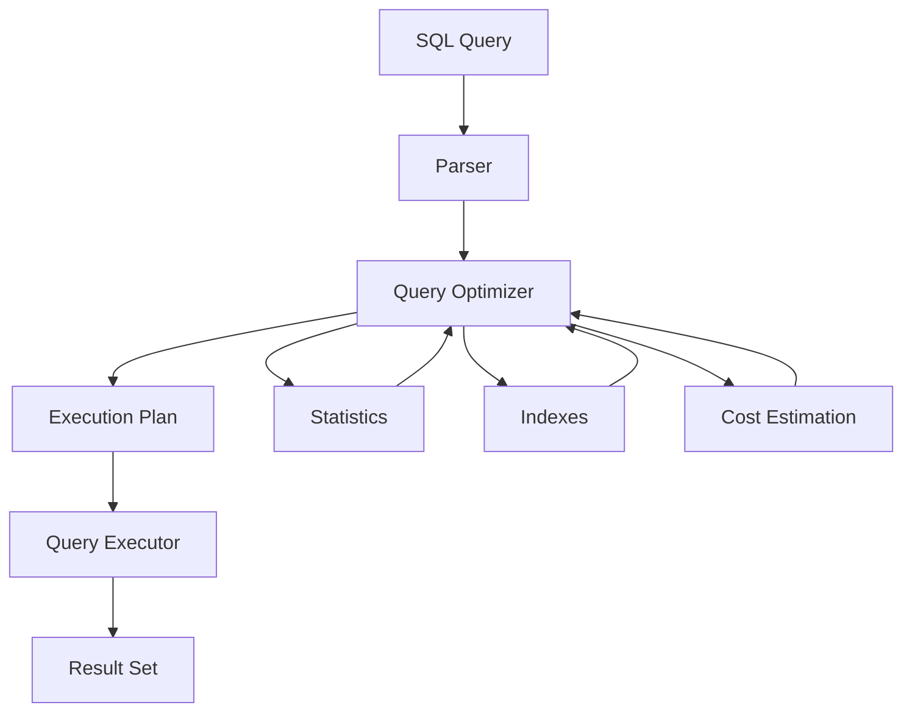
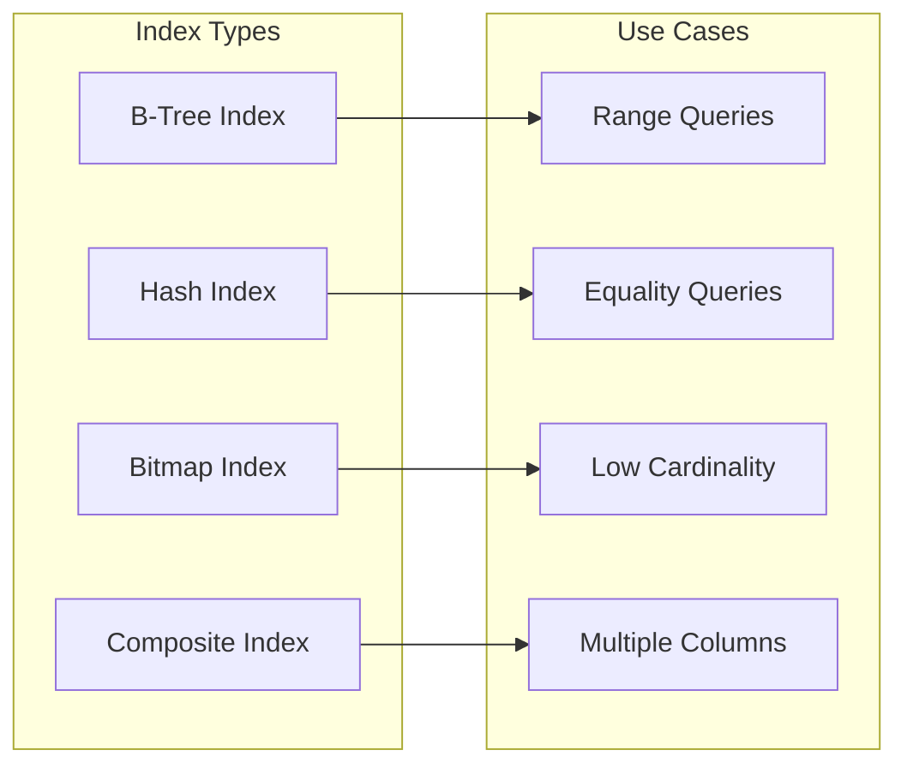
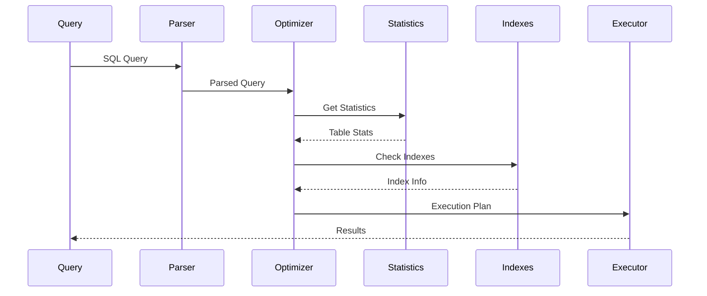

---
# Auto-generated front matter
Title: Query Optimization
LastUpdated: 2025-11-06T20:45:58.288009
Tags: []
Status: draft
---

# 🚀 **Database Query Optimization**

## 📘 **Theory**

Database query optimization is the process of improving the performance of database queries by analyzing execution plans, optimizing indexes, and restructuring queries. It's crucial for maintaining high performance in database-driven applications.

### **Why Query Optimization Matters**

- **Performance**: Faster query execution improves user experience
- **Scalability**: Optimized queries handle more concurrent users
- **Resource Efficiency**: Reduces CPU, memory, and I/O usage
- **Cost Savings**: Lower hardware requirements and operational costs
- **User Experience**: Faster response times improve user satisfaction
- **System Stability**: Prevents database bottlenecks and timeouts
- **Competitive Advantage**: Better performance than competitors
- **Maintenance**: Easier to maintain and debug optimized systems

### **Key Concepts**

1. **Query Execution Plan**: Step-by-step plan for executing a query
2. **Indexes**: Data structures that speed up data retrieval
3. **Statistics**: Database statistics used for optimization
4. **Join Algorithms**: Different methods for joining tables
5. **Query Rewriting**: Transforming queries for better performance
6. **Partitioning**: Dividing large tables into smaller, manageable pieces
7. **Caching**: Storing frequently accessed data in memory
8. **Connection Pooling**: Reusing database connections efficiently

### **Optimization Techniques**

1. **Index Optimization**: Create appropriate indexes
2. **Query Rewriting**: Rewrite queries for better performance
3. **Join Optimization**: Optimize join operations
4. **Subquery Optimization**: Convert subqueries to joins
5. **Statistics Updates**: Keep database statistics current
6. **Partitioning**: Partition large tables
7. **Caching**: Implement query result caching
8. **Connection Pooling**: Optimize database connections

### **Common Pitfalls and Best Practices**

- **Missing Indexes**: Create indexes for frequently queried columns
- **Over-indexing**: Too many indexes can slow down writes
- **Outdated Statistics**: Keep database statistics current
- **Inefficient Joins**: Use appropriate join types and conditions
- **N+1 Queries**: Avoid multiple queries in loops
- **Large Result Sets**: Use pagination and LIMIT clauses
- **Missing WHERE Clauses**: Always use appropriate WHERE conditions
- **Poor Data Types**: Use appropriate data types for columns

## 📊 **Diagrams**

### **Query Execution Process**



### **Index Types and Usage**



### **Query Optimization Flow**



## 🧩 **Example**

**Scenario**: Optimize a slow query that joins multiple tables

**Input**:

```sql
SELECT u.name, o.total, p.name as product_name
FROM users u
JOIN orders o ON u.id = o.user_id
JOIN order_items oi ON o.id = oi.order_id
JOIN products p ON oi.product_id = p.id
WHERE u.created_at > '2023-01-01'
AND o.status = 'completed'
ORDER BY o.total DESC
LIMIT 100;
```

**Expected Output**:

- Optimized query with proper indexes
- Execution plan analysis
- Performance improvements
- Monitoring and maintenance recommendations

**Step-by-step**:

1. Analyze current query performance
2. Identify bottlenecks and missing indexes
3. Rewrite query for better performance
4. Create appropriate indexes
5. Test and measure improvements
6. Set up monitoring and maintenance

## 💻 **Implementation (Golang)**

```go
package main

import (
    "database/sql"
    "fmt"
    "log"
    "time"

    _ "github.com/go-sql-driver/mysql"
)

// QueryOptimizer handles database query optimization
type QueryOptimizer struct {
    db *sql.DB
}

// QueryStats represents query performance statistics
type QueryStats struct {
    QueryID      string
    QueryText    string
    ExecutionTime time.Duration
    RowsExamined int64
    RowsReturned int64
    IndexUsed    string
    Cost         float64
}

// IndexRecommendation represents an index recommendation
type IndexRecommendation struct {
    TableName    string
    ColumnNames  []string
    IndexType    string
    Priority     int
    EstimatedGain float64
    SQL          string
}

// QueryPlan represents a query execution plan
type QueryPlan struct {
    ID           int
    SelectType   string
    Table        string
    Partitions    string
    Type         string
    PossibleKeys string
    Key          string
    KeyLen       int
    Ref          string
    Rows         int64
    Filtered     float64
    Extra        string
}

// NewQueryOptimizer creates a new query optimizer
func NewQueryOptimizer(db *sql.DB) *QueryOptimizer {
    return &QueryOptimizer{db: db}
}

// AnalyzeQuery analyzes a query and returns optimization recommendations
func (qo *QueryOptimizer) AnalyzeQuery(query string) (*QueryStats, []IndexRecommendation, error) {
    // Get query execution plan
    plan, err := qo.getExecutionPlan(query)
    if err != nil {
        return nil, nil, err
    }

    // Analyze execution plan
    stats := qo.analyzeExecutionPlan(plan, query)

    // Generate index recommendations
    recommendations := qo.generateIndexRecommendations(plan)

    return stats, recommendations, nil
}

// getExecutionPlan gets the execution plan for a query
func (qo *QueryOptimizer) getExecutionPlan(query string) ([]QueryPlan, error) {
    explainQuery := fmt.Sprintf("EXPLAIN %s", query)

    rows, err := qo.db.Query(explainQuery)
    if err != nil {
        return nil, err
    }
    defer rows.Close()

    var plans []QueryPlan
    for rows.Next() {
        var plan QueryPlan
        err := rows.Scan(
            &plan.ID,
            &plan.SelectType,
            &plan.Table,
            &plan.Partitions,
            &plan.Type,
            &plan.PossibleKeys,
            &plan.Key,
            &plan.KeyLen,
            &plan.Ref,
            &plan.Rows,
            &plan.Filtered,
            &plan.Extra,
        )
        if err != nil {
            return nil, err
        }
        plans = append(plans, plan)
    }

    return plans, nil
}

// analyzeExecutionPlan analyzes the execution plan and returns statistics
func (qo *QueryOptimizer) analyzeExecutionPlan(plan []QueryPlan, query string) *QueryStats {
    stats := &QueryStats{
        QueryText: query,
    }

    // Calculate total rows examined
    for _, step := range plan {
        stats.RowsExamined += step.Rows
    }

    // Estimate execution time (simplified)
    stats.ExecutionTime = time.Duration(stats.RowsExamined) * time.Microsecond

    // Check for index usage
    for _, step := range plan {
        if step.Key != "" {
            stats.IndexUsed = step.Key
            break
        }
    }

    // Calculate cost (simplified)
    stats.Cost = float64(stats.RowsExamined) * 0.1

    return stats
}

// generateIndexRecommendations generates index recommendations based on execution plan
func (qo *QueryOptimizer) generateIndexRecommendations(plan []QueryPlan) []IndexRecommendation {
    var recommendations []IndexRecommendation

    for _, step := range plan {
        if step.Type == "ALL" && step.PossibleKeys == "" {
            // Full table scan - recommend index
            recommendation := IndexRecommendation{
                TableName:   step.Table,
                ColumnNames: []string{"id"}, // Default to primary key
                IndexType:   "BTREE",
                Priority:    1,
                EstimatedGain: float64(step.Rows) * 0.8,
                SQL:        fmt.Sprintf("CREATE INDEX idx_%s_id ON %s (id)", step.Table, step.Table),
            }
            recommendations = append(recommendations, recommendation)
        }
    }

    return recommendations
}

// OptimizeQuery optimizes a query by rewriting it
func (qo *QueryOptimizer) OptimizeQuery(query string) (string, error) {
    // This is a simplified example - in practice, you'd use a proper SQL parser
    optimizedQuery := query

    // Add common optimizations
    optimizedQuery = qo.addLimitClause(optimizedQuery)
    optimizedQuery = qo.optimizeJoins(optimizedQuery)
    optimizedQuery = qo.optimizeWhereClause(optimizedQuery)

    return optimizedQuery, nil
}

// addLimitClause adds LIMIT clause if missing
func (qo *QueryOptimizer) addLimitClause(query string) string {
    // Check if LIMIT is already present
    if contains(query, "LIMIT") {
        return query
    }

    // Add LIMIT 1000 as default
    return query + " LIMIT 1000"
}

// optimizeJoins optimizes JOIN operations
func (qo *QueryOptimizer) optimizeJoins(query string) string {
    // This is a simplified example
    // In practice, you'd analyze the query structure and optimize joins
    return query
}

// optimizeWhereClause optimizes WHERE clause
func (qo *QueryOptimizer) optimizeWhereClause(query string) string {
    // This is a simplified example
    // In practice, you'd analyze the WHERE clause and optimize it
    return query
}

// CreateIndex creates an index on a table
func (qo *QueryOptimizer) CreateIndex(tableName, indexName string, columns []string) error {
    sql := fmt.Sprintf("CREATE INDEX %s ON %s (%s)", indexName, tableName, joinStrings(columns, ", "))

    _, err := qo.db.Exec(sql)
    if err != nil {
        return fmt.Errorf("failed to create index: %v", err)
    }

    return nil
}

// DropIndex drops an index
func (qo *QueryOptimizer) DropIndex(tableName, indexName string) error {
    sql := fmt.Sprintf("DROP INDEX %s ON %s", indexName, tableName)

    _, err := qo.db.Exec(sql)
    if err != nil {
        return fmt.Errorf("failed to drop index: %v", err)
    }

    return nil
}

// GetTableStats gets statistics for a table
func (qo *QueryOptimizer) GetTableStats(tableName string) (map[string]interface{}, error) {
    stats := make(map[string]interface{})

    // Get row count
    var rowCount int64
    err := qo.db.QueryRow(fmt.Sprintf("SELECT COUNT(*) FROM %s", tableName)).Scan(&rowCount)
    if err != nil {
        return nil, err
    }
    stats["row_count"] = rowCount

    // Get table size
    var tableSize int64
    err = qo.db.QueryRow(fmt.Sprintf("SELECT data_length + index_length FROM information_schema.tables WHERE table_name = '%s'", tableName)).Scan(&tableSize)
    if err != nil {
        return nil, err
    }
    stats["table_size"] = tableSize

    // Get index count
    var indexCount int64
    err = qo.db.QueryRow(fmt.Sprintf("SELECT COUNT(*) FROM information_schema.statistics WHERE table_name = '%s'", tableName)).Scan(&indexCount)
    if err != nil {
        return nil, err
    }
    stats["index_count"] = indexCount

    return stats, nil
}

// MonitorQueryPerformance monitors query performance
func (qo *QueryOptimizer) MonitorQueryPerformance(query string, duration time.Duration) error {
    // Log query performance
    log.Printf("Query executed in %v: %s", duration, query)

    // Store in performance log (simplified)
    // In practice, you'd store this in a database or monitoring system

    return nil
}

// Helper functions
func contains(s, substr string) bool {
    return len(s) >= len(substr) && s[:len(substr)] == substr
}

func joinStrings(strs []string, sep string) string {
    if len(strs) == 0 {
        return ""
    }

    result := strs[0]
    for i := 1; i < len(strs); i++ {
        result += sep + strs[i]
    }

    return result
}

// Example usage
func main() {
    // Connect to database
    db, err := sql.Open("mysql", "user:password@tcp(localhost:3306)/database")
    if err != nil {
        log.Fatal(err)
    }
    defer db.Close()

    // Create query optimizer
    optimizer := NewQueryOptimizer(db)

    // Example query to optimize
    query := `
        SELECT u.name, o.total, p.name as product_name
        FROM users u
        JOIN orders o ON u.id = o.user_id
        JOIN order_items oi ON o.id = oi.order_id
        JOIN products p ON oi.product_id = p.id
        WHERE u.created_at > '2023-01-01'
        AND o.status = 'completed'
        ORDER BY o.total DESC
        LIMIT 100
    `

    // Analyze query
    stats, recommendations, err := optimizer.AnalyzeQuery(query)
    if err != nil {
        log.Fatal(err)
    }

    // Print analysis results
    fmt.Printf("Query Analysis:\n")
    fmt.Printf("Execution Time: %v\n", stats.ExecutionTime)
    fmt.Printf("Rows Examined: %d\n", stats.RowsExamined)
    fmt.Printf("Index Used: %s\n", stats.IndexUsed)
    fmt.Printf("Cost: %.2f\n", stats.Cost)

    // Print recommendations
    fmt.Printf("\nIndex Recommendations:\n")
    for i, rec := range recommendations {
        fmt.Printf("%d. %s\n", i+1, rec.SQL)
        fmt.Printf("   Priority: %d, Estimated Gain: %.2f\n", rec.Priority, rec.EstimatedGain)
    }

    // Optimize query
    optimizedQuery, err := optimizer.OptimizeQuery(query)
    if err != nil {
        log.Fatal(err)
    }

    fmt.Printf("\nOptimized Query:\n%s\n", optimizedQuery)

    // Get table statistics
    stats, err := optimizer.GetTableStats("users")
    if err != nil {
        log.Fatal(err)
    }

    fmt.Printf("\nTable Statistics:\n")
    for key, value := range stats {
        fmt.Printf("%s: %v\n", key, value)
    }
}
```

## 💻 **Implementation (Node.js)**

```javascript
const mysql = require("mysql2/promise");

class QueryOptimizer {
  constructor(db) {
    this.db = db;
  }

  async analyzeQuery(query) {
    // Get query execution plan
    const plan = await this.getExecutionPlan(query);

    // Analyze execution plan
    const stats = this.analyzeExecutionPlan(plan, query);

    // Generate index recommendations
    const recommendations = this.generateIndexRecommendations(plan);

    return { stats, recommendations };
  }

  async getExecutionPlan(query) {
    const explainQuery = `EXPLAIN ${query}`;
    const [rows] = await this.db.execute(explainQuery);
    return rows;
  }

  analyzeExecutionPlan(plan, query) {
    const stats = {
      queryText: query,
      rowsExamined: 0,
      executionTime: 0,
      indexUsed: null,
      cost: 0,
    };

    // Calculate total rows examined
    for (const step of plan) {
      stats.rowsExamined += parseInt(step.rows) || 0;
    }

    // Estimate execution time (simplified)
    stats.executionTime = stats.rowsExamined * 0.001; // 1ms per 1000 rows

    // Check for index usage
    for (const step of plan) {
      if (step.key) {
        stats.indexUsed = step.key;
        break;
      }
    }

    // Calculate cost (simplified)
    stats.cost = stats.rowsExamined * 0.1;

    return stats;
  }

  generateIndexRecommendations(plan) {
    const recommendations = [];

    for (const step of plan) {
      if (step.type === "ALL" && !step.possible_keys) {
        // Full table scan - recommend index
        const recommendation = {
          tableName: step.table,
          columnNames: ["id"], // Default to primary key
          indexType: "BTREE",
          priority: 1,
          estimatedGain: (parseInt(step.rows) || 0) * 0.8,
          sql: `CREATE INDEX idx_${step.table}_id ON ${step.table} (id)`,
        };
        recommendations.push(recommendation);
      }
    }

    return recommendations;
  }

  async optimizeQuery(query) {
    // This is a simplified example - in practice, you'd use a proper SQL parser
    let optimizedQuery = query;

    // Add common optimizations
    optimizedQuery = this.addLimitClause(optimizedQuery);
    optimizedQuery = this.optimizeJoins(optimizedQuery);
    optimizedQuery = this.optimizeWhereClause(optimizedQuery);

    return optimizedQuery;
  }

  addLimitClause(query) {
    // Check if LIMIT is already present
    if (query.toUpperCase().includes("LIMIT")) {
      return query;
    }

    // Add LIMIT 1000 as default
    return query + " LIMIT 1000";
  }

  optimizeJoins(query) {
    // This is a simplified example
    // In practice, you'd analyze the query structure and optimize joins
    return query;
  }

  optimizeWhereClause(query) {
    // This is a simplified example
    // In practice, you'd analyze the WHERE clause and optimize it
    return query;
  }

  async createIndex(tableName, indexName, columns) {
    const sql = `CREATE INDEX ${indexName} ON ${tableName} (${columns.join(
      ", "
    )})`;

    try {
      await this.db.execute(sql);
      console.log(`Index ${indexName} created successfully`);
    } catch (error) {
      throw new Error(`Failed to create index: ${error.message}`);
    }
  }

  async dropIndex(tableName, indexName) {
    const sql = `DROP INDEX ${indexName} ON ${tableName}`;

    try {
      await this.db.execute(sql);
      console.log(`Index ${indexName} dropped successfully`);
    } catch (error) {
      throw new Error(`Failed to drop index: ${error.message}`);
    }
  }

  async getTableStats(tableName) {
    const stats = {};

    try {
      // Get row count
      const [rowCountResult] = await this.db.execute(
        `SELECT COUNT(*) as count FROM ${tableName}`
      );
      stats.rowCount = rowCountResult[0].count;

      // Get table size
      const [sizeResult] = await this.db.execute(`
        SELECT data_length + index_length as size 
        FROM information_schema.tables 
        WHERE table_name = '${tableName}'
      `);
      stats.tableSize = sizeResult[0].size;

      // Get index count
      const [indexCountResult] = await this.db.execute(`
        SELECT COUNT(*) as count 
        FROM information_schema.statistics 
        WHERE table_name = '${tableName}'
      `);
      stats.indexCount = indexCountResult[0].count;
    } catch (error) {
      throw new Error(`Failed to get table stats: ${error.message}`);
    }

    return stats;
  }

  async monitorQueryPerformance(query, duration) {
    // Log query performance
    console.log(`Query executed in ${duration}ms: ${query}`);

    // Store in performance log (simplified)
    // In practice, you'd store this in a database or monitoring system
  }
}

// Example usage
async function main() {
  try {
    // Connect to database
    const db = await mysql.createConnection({
      host: "localhost",
      user: "user",
      password: "password",
      database: "database",
    });

    // Create query optimizer
    const optimizer = new QueryOptimizer(db);

    // Example query to optimize
    const query = `
      SELECT u.name, o.total, p.name as product_name
      FROM users u
      JOIN orders o ON u.id = o.user_id
      JOIN order_items oi ON o.id = oi.order_id
      JOIN products p ON oi.product_id = p.id
      WHERE u.created_at > '2023-01-01'
      AND o.status = 'completed'
      ORDER BY o.total DESC
      LIMIT 100
    `;

    // Analyze query
    const { stats, recommendations } = await optimizer.analyzeQuery(query);

    // Print analysis results
    console.log("Query Analysis:");
    console.log(`Execution Time: ${stats.executionTime}ms`);
    console.log(`Rows Examined: ${stats.rowsExamined}`);
    console.log(`Index Used: ${stats.indexUsed || "None"}`);
    console.log(`Cost: ${stats.cost.toFixed(2)}`);

    // Print recommendations
    console.log("\nIndex Recommendations:");
    recommendations.forEach((rec, i) => {
      console.log(`${i + 1}. ${rec.sql}`);
      console.log(
        `   Priority: ${
          rec.priority
        }, Estimated Gain: ${rec.estimatedGain.toFixed(2)}`
      );
    });

    // Optimize query
    const optimizedQuery = await optimizer.optimizeQuery(query);
    console.log("\nOptimized Query:");
    console.log(optimizedQuery);

    // Get table statistics
    const tableStats = await optimizer.getTableStats("users");
    console.log("\nTable Statistics:");
    Object.entries(tableStats).forEach(([key, value]) => {
      console.log(`${key}: ${value}`);
    });

    // Close database connection
    await db.end();
  } catch (error) {
    console.error("Error:", error.message);
  }
}

// Run the example
main();
```

## ⏱ **Complexity Analysis**

### **Time Complexity**

- **Query Analysis**: O(n) where n is number of tables in query
- **Index Creation**: O(m log m) where m is number of rows in table
- **Statistics Collection**: O(n) where n is number of tables
- **Query Optimization**: O(1) for simple optimizations

### **Space Complexity**

- **Execution Plan Storage**: O(n) where n is number of query steps
- **Index Storage**: O(m) where m is number of indexed rows
- **Statistics Storage**: O(1) for fixed-size statistics
- **Recommendations Storage**: O(n) where n is number of recommendations

## 🚀 **Optimal Solution**

The optimal query optimization solution includes:

1. **Comprehensive Analysis**: Analyze all aspects of query performance
2. **Intelligent Indexing**: Create indexes based on query patterns
3. **Query Rewriting**: Transform queries for better performance
4. **Statistics Management**: Keep database statistics current
5. **Monitoring**: Continuously monitor query performance
6. **Automation**: Automate optimization processes
7. **Testing**: Test optimizations before production deployment
8. **Documentation**: Document optimization decisions and results

### **Production Considerations**

- Use appropriate indexing strategies
- Monitor query performance continuously
- Test optimizations in staging environment
- Keep database statistics current
- Use query caching where appropriate
- Implement proper error handling
- Consider database-specific optimizations
- Use connection pooling for better performance

## ❓ **Follow-up Questions**

### **How would this scale with X?**

- **Large Databases**: Use partitioning and distributed optimization
- **High Traffic**: Use caching and query result optimization
- **Complex Queries**: Use advanced optimization techniques

### **How can we optimize further if Y changes?**

- **Hardware Constraints**: Use memory and CPU optimization
- **Network Latency**: Use connection pooling and caching
- **Data Growth**: Use partitioning and archiving strategies

### **What trade-offs exist in different approaches?**

- **Index vs Storage**: More indexes vs more storage space
- **Query Complexity vs Performance**: Simple queries vs complex optimizations
- **Real-time vs Batch**: Immediate optimization vs batch processing
