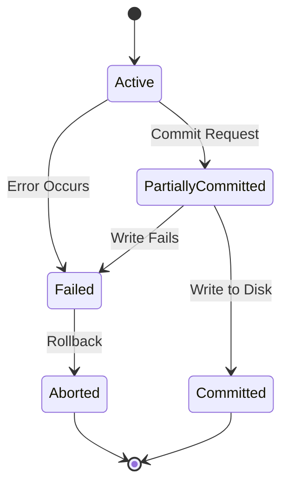
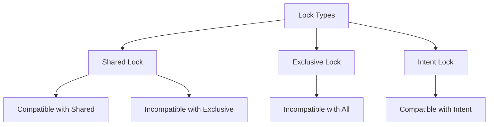

---
# Auto-generated front matter
Title: Transaction Management
LastUpdated: 2025-11-06T20:45:58.289335
Tags: []
Status: draft
---

# Database Transaction Management

## 📘 Theory

Transaction management is a critical aspect of database systems that ensures data consistency, integrity, and reliability. A transaction is a sequence of database operations that must be executed as a single unit of work, following the ACID properties.

### Key Concepts:

- **ACID Properties**: Atomicity, Consistency, Isolation, Durability
- **Transaction States**: Active, Partially Committed, Committed, Failed, Aborted
- **Concurrency Control**: Managing simultaneous transactions
- **Locking Mechanisms**: Shared locks, exclusive locks, intent locks
- **Deadlock Detection**: Identifying and resolving circular waits
- **Isolation Levels**: Read Uncommitted, Read Committed, Repeatable Read, Serializable

### ACID Properties:

1. **Atomicity**: All operations succeed or all fail
2. **Consistency**: Database remains in valid state
3. **Isolation**: Concurrent transactions don't interfere
4. **Durability**: Committed changes persist

## 📊 Diagrams

### Transaction Lifecycle



### Lock Compatibility Matrix



## 🧩 Example

Bank transfer transaction:

**Transaction: Transfer $100 from Account A to Account B**

1. BEGIN TRANSACTION
2. SELECT balance FROM accounts WHERE id = 'A' FOR UPDATE
3. UPDATE accounts SET balance = balance - 100 WHERE id = 'A'
4. SELECT balance FROM accounts WHERE id = 'B' FOR UPDATE
5. UPDATE accounts SET balance = balance + 100 WHERE id = 'B'
6. COMMIT

**Rollback Scenario:**

- If step 4 fails, rollback to step 1
- All changes are undone

## 💻 Implementation (Golang)

```go
package main

import (
    "database/sql"
    "fmt"
    "log"
    "sync"
    "time"

    _ "github.com/lib/pq"
)

// TransactionManager manages database transactions
type TransactionManager struct {
    db        *sql.DB
    lockTable map[string]*LockInfo
    mutex     sync.RWMutex
    deadlockDetector *DeadlockDetector
}

// LockInfo represents a lock on a resource
type LockInfo struct {
    ResourceID    string
    LockType      LockType
    TransactionID string
    Timestamp     time.Time
    WaitList      []string // Transactions waiting for this lock
}

// LockType represents the type of lock
type LockType int

const (
    SharedLock LockType = iota
    ExclusiveLock
    IntentSharedLock
    IntentExclusiveLock
)

// Transaction represents a database transaction
type Transaction struct {
    ID        string
    StartTime time.Time
    State     TransactionState
    Locks     map[string]LockType
    Operations []Operation
}

// TransactionState represents the state of a transaction
type TransactionState int

const (
    Active TransactionState = iota
    PartiallyCommitted
    Committed
    Failed
    Aborted
)

// Operation represents a database operation
type Operation struct {
    Type      string
    Table     string
    Key       string
    Value     interface{}
    Timestamp time.Time
}

// DeadlockDetector detects deadlocks in the system
type DeadlockDetector struct {
    waitForGraph map[string][]string
    mutex        sync.RWMutex
}

// NewTransactionManager creates a new transaction manager
func NewTransactionManager(db *sql.DB) *TransactionManager {
    return &TransactionManager{
        db:        db,
        lockTable: make(map[string]*LockInfo),
        deadlockDetector: NewDeadlockDetector(),
    }
}

// BeginTransaction starts a new transaction
func (tm *TransactionManager) BeginTransaction() *Transaction {
    transactionID := fmt.Sprintf("txn_%d", time.Now().UnixNano())

    return &Transaction{
        ID:        transactionID,
        StartTime: time.Now(),
        State:     Active,
        Locks:     make(map[string]LockType),
        Operations: make([]Operation, 0),
    }
}

// AcquireLock acquires a lock on a resource
func (tm *TransactionManager) AcquireLock(transaction *Transaction, resourceID string, lockType LockType) error {
    tm.mutex.Lock()
    defer tm.mutex.Unlock()

    // Check if lock is already held
    if lockInfo, exists := tm.lockTable[resourceID]; exists {
        if lockInfo.TransactionID == transaction.ID {
            // Same transaction, upgrade lock if necessary
            if lockType > lockInfo.LockType {
                lockInfo.LockType = lockType
            }
            return nil
        }

        // Check lock compatibility
        if !tm.isLockCompatible(lockInfo.LockType, lockType) {
            // Add to wait list
            lockInfo.WaitList = append(lockInfo.WaitList, transaction.ID)

            // Check for deadlock
            if tm.deadlockDetector.DetectDeadlock(transaction.ID, lockInfo.TransactionID) {
                return fmt.Errorf("deadlock detected")
            }

            return fmt.Errorf("lock not available, waiting")
        }
    }

    // Acquire lock
    tm.lockTable[resourceID] = &LockInfo{
        ResourceID:    resourceID,
        LockType:      lockType,
        TransactionID: transaction.ID,
        Timestamp:     time.Now(),
        WaitList:      make([]string, 0),
    }

    transaction.Locks[resourceID] = lockType
    return nil
}

// ReleaseLock releases a lock on a resource
func (tm *TransactionManager) ReleaseLock(transaction *Transaction, resourceID string) error {
    tm.mutex.Lock()
    defer tm.mutex.Unlock()

    if lockInfo, exists := tm.lockTable[resourceID]; exists {
        if lockInfo.TransactionID == transaction.ID {
            // Grant lock to next waiting transaction
            if len(lockInfo.WaitList) > 0 {
                nextTxnID := lockInfo.WaitList[0]
                lockInfo.TransactionID = nextTxnID
                lockInfo.WaitList = lockInfo.WaitList[1:]
                lockInfo.Timestamp = time.Now()
            } else {
                delete(tm.lockTable, resourceID)
            }

            delete(transaction.Locks, resourceID)
            return nil
        }
    }

    return fmt.Errorf("lock not held by transaction")
}

// isLockCompatible checks if two lock types are compatible
func (tm *TransactionManager) isLockCompatible(held, requested LockType) bool {
    compatibilityMatrix := map[LockType]map[LockType]bool{
        SharedLock: {
            SharedLock: true,
            ExclusiveLock: false,
            IntentSharedLock: true,
            IntentExclusiveLock: false,
        },
        ExclusiveLock: {
            SharedLock: false,
            ExclusiveLock: false,
            IntentSharedLock: false,
            IntentExclusiveLock: false,
        },
        IntentSharedLock: {
            SharedLock: true,
            ExclusiveLock: false,
            IntentSharedLock: true,
            IntentExclusiveLock: true,
        },
        IntentExclusiveLock: {
            SharedLock: false,
            ExclusiveLock: false,
            IntentSharedLock: true,
            IntentExclusiveLock: true,
        },
    }

    return compatibilityMatrix[held][requested]
}

// ExecuteOperation executes a database operation within a transaction
func (tm *TransactionManager) ExecuteOperation(transaction *Transaction, operation Operation) error {
    if transaction.State != Active {
        return fmt.Errorf("transaction not active")
    }

    // Acquire necessary locks
    resourceID := fmt.Sprintf("%s:%s", operation.Table, operation.Key)
    lockType := tm.getRequiredLockType(operation.Type)

    err := tm.AcquireLock(transaction, resourceID, lockType)
    if err != nil {
        return err
    }

    // Execute operation
    switch operation.Type {
    case "SELECT":
        return tm.executeSelect(transaction, operation)
    case "UPDATE":
        return tm.executeUpdate(transaction, operation)
    case "INSERT":
        return tm.executeInsert(transaction, operation)
    case "DELETE":
        return tm.executeDelete(transaction, operation)
    default:
        return fmt.Errorf("unknown operation type")
    }
}

// getRequiredLockType determines the lock type needed for an operation
func (tm *TransactionManager) getRequiredLockType(operationType string) LockType {
    switch operationType {
    case "SELECT":
        return SharedLock
    case "UPDATE", "INSERT", "DELETE":
        return ExclusiveLock
    default:
        return SharedLock
    }
}

// executeSelect executes a SELECT operation
func (tm *TransactionManager) executeSelect(transaction *Transaction, operation Operation) error {
    query := fmt.Sprintf("SELECT * FROM %s WHERE id = $1", operation.Table)
    row := tm.db.QueryRow(query, operation.Key)

    var result interface{}
    err := row.Scan(&result)
    if err != nil {
        return err
    }

    // Log operation
    transaction.Operations = append(transaction.Operations, operation)
    return nil
}

// executeUpdate executes an UPDATE operation
func (tm *TransactionManager) executeUpdate(transaction *Transaction, operation Operation) error {
    query := fmt.Sprintf("UPDATE %s SET value = $1 WHERE id = $2", operation.Table)
    _, err := tm.db.Exec(query, operation.Value, operation.Key)
    if err != nil {
        return err
    }

    // Log operation
    transaction.Operations = append(transaction.Operations, operation)
    return nil
}

// executeInsert executes an INSERT operation
func (tm *TransactionManager) executeInsert(transaction *Transaction, operation Operation) error {
    query := fmt.Sprintf("INSERT INTO %s (id, value) VALUES ($1, $2)", operation.Table)
    _, err := tm.db.Exec(query, operation.Key, operation.Value)
    if err != nil {
        return err
    }

    // Log operation
    transaction.Operations = append(transaction.Operations, operation)
    return nil
}

// executeDelete executes a DELETE operation
func (tm *TransactionManager) executeDelete(transaction *Transaction, operation Operation) error {
    query := fmt.Sprintf("DELETE FROM %s WHERE id = $1", operation.Table)
    _, err := tm.db.Exec(query, operation.Key)
    if err != nil {
        return err
    }

    // Log operation
    transaction.Operations = append(transaction.Operations, operation)
    return nil
}

// Commit commits a transaction
func (tm *TransactionManager) Commit(transaction *Transaction) error {
    if transaction.State != Active {
        return fmt.Errorf("transaction not active")
    }

    // Change state to partially committed
    transaction.State = PartiallyCommitted

    // Write to transaction log
    err := tm.writeToTransactionLog(transaction)
    if err != nil {
        transaction.State = Failed
        return err
    }

    // Release all locks
    for resourceID := range transaction.Locks {
        tm.ReleaseLock(transaction, resourceID)
    }

    // Change state to committed
    transaction.State = Committed
    return nil
}

// Rollback rolls back a transaction
func (tm *TransactionManager) Rollback(transaction *Transaction) error {
    if transaction.State == Committed {
        return fmt.Errorf("cannot rollback committed transaction")
    }

    // Undo all operations
    for i := len(transaction.Operations) - 1; i >= 0; i-- {
        operation := transaction.Operations[i]
        err := tm.undoOperation(operation)
        if err != nil {
            return err
        }
    }

    // Release all locks
    for resourceID := range transaction.Locks {
        tm.ReleaseLock(transaction, resourceID)
    }

    // Change state to aborted
    transaction.State = Aborted
    return nil
}

// writeToTransactionLog writes transaction to log
func (tm *TransactionManager) writeToTransactionLog(transaction *Transaction) error {
    // In a real implementation, this would write to a transaction log
    log.Printf("Transaction %s committed with %d operations",
        transaction.ID, len(transaction.Operations))
    return nil
}

// undoOperation undoes a database operation
func (tm *TransactionManager) undoOperation(operation Operation) error {
    // In a real implementation, this would undo the operation
    log.Printf("Undoing operation: %s on %s.%s",
        operation.Type, operation.Table, operation.Key)
    return nil
}

// NewDeadlockDetector creates a new deadlock detector
func NewDeadlockDetector() *DeadlockDetector {
    return &DeadlockDetector{
        waitForGraph: make(map[string][]string),
    }
}

// DetectDeadlock detects if adding a wait relationship would cause a deadlock
func (dd *DeadlockDetector) DetectDeadlock(waiter, holder string) bool {
    dd.mutex.Lock()
    defer dd.mutex.Unlock()

    // Add wait relationship
    dd.waitForGraph[waiter] = append(dd.waitForGraph[waiter], holder)

    // Check for cycle using DFS
    visited := make(map[string]bool)
    recStack := make(map[string]bool)

    for node := range dd.waitForGraph {
        if !visited[node] {
            if dd.hasCycle(node, visited, recStack) {
                return true
            }
        }
    }

    return false
}

// hasCycle checks if there's a cycle in the wait-for graph
func (dd *DeadlockDetector) hasCycle(node string, visited, recStack map[string]bool) bool {
    visited[node] = true
    recStack[node] = true

    for _, neighbor := range dd.waitForGraph[node] {
        if !visited[neighbor] {
            if dd.hasCycle(neighbor, visited, recStack) {
                return true
            }
        } else if recStack[neighbor] {
            return true
        }
    }

    recStack[node] = false
    return false
}

// Two-Phase Locking Protocol
type TwoPhaseLocking struct {
    tm *TransactionManager
}

// NewTwoPhaseLocking creates a new 2PL protocol
func NewTwoPhaseLocking(tm *TransactionManager) *TwoPhaseLocking {
    return &TwoPhaseLocking{tm: tm}
}

// ExecuteTransaction executes a transaction using 2PL
func (tpl *TwoPhaseLocking) ExecuteTransaction(operations []Operation) error {
    transaction := tpl.tm.BeginTransaction()

    // Growing phase - acquire locks
    for _, operation := range operations {
        err := tpl.tm.ExecuteOperation(transaction, operation)
        if err != nil {
            tpl.tm.Rollback(transaction)
            return err
        }
    }

    // Shrinking phase - release locks and commit
    return tpl.tm.Commit(transaction)
}

// Optimistic Concurrency Control
type OptimisticConcurrencyControl struct {
    tm *TransactionManager
}

// NewOptimisticConcurrencyControl creates a new OCC protocol
func NewOptimisticConcurrencyControl(tm *TransactionManager) *OptimisticConcurrencyControl {
    return &OptimisticConcurrencyControl{tm: tm}
}

// ExecuteTransaction executes a transaction using OCC
func (occ *OptimisticConcurrencyControl) ExecuteTransaction(operations []Operation) error {
    transaction := occ.tm.BeginTransaction()

    // Read phase - execute operations without locks
    for _, operation := range operations {
        err := occ.tm.ExecuteOperation(transaction, operation)
        if err != nil {
            occ.tm.Rollback(transaction)
            return err
        }
    }

    // Validation phase - check for conflicts
    if occ.validateTransaction(transaction) {
        return occ.tm.Commit(transaction)
    } else {
        occ.tm.Rollback(transaction)
        return fmt.Errorf("validation failed, transaction aborted")
    }
}

// validateTransaction validates a transaction for conflicts
func (occ *OptimisticConcurrencyControl) validateTransaction(transaction *Transaction) bool {
    // In a real implementation, this would check for read-write conflicts
    // For simplicity, we'll always return true
    return true
}

func main() {
    // Example usage
    db, err := sql.Open("postgres", "user=postgres dbname=test sslmode=disable")
    if err != nil {
        log.Fatal(err)
    }
    defer db.Close()

    // Create transaction manager
    tm := NewTransactionManager(db)

    // Example 1: Two-Phase Locking
    fmt.Println("=== Two-Phase Locking Example ===")
    tpl := NewTwoPhaseLocking(tm)

    operations := []Operation{
        {Type: "SELECT", Table: "accounts", Key: "A", Value: nil},
        {Type: "UPDATE", Table: "accounts", Key: "A", Value: 100},
        {Type: "SELECT", Table: "accounts", Key: "B", Value: nil},
        {Type: "UPDATE", Table: "accounts", Key: "B", Value: 200},
    }

    err = tpl.ExecuteTransaction(operations)
    if err != nil {
        fmt.Printf("2PL Transaction failed: %v\n", err)
    } else {
        fmt.Println("2PL Transaction committed successfully")
    }

    // Example 2: Optimistic Concurrency Control
    fmt.Println("\n=== Optimistic Concurrency Control Example ===")
    occ := NewOptimisticConcurrencyControl(tm)

    err = occ.ExecuteTransaction(operations)
    if err != nil {
        fmt.Printf("OCC Transaction failed: %v\n", err)
    } else {
        fmt.Println("OCC Transaction committed successfully")
    }

    // Example 3: Deadlock Detection
    fmt.Println("\n=== Deadlock Detection Example ===")
    txn1 := tm.BeginTransaction()
    txn2 := tm.BeginTransaction()

    // Transaction 1 acquires lock on resource A
    err = tm.AcquireLock(txn1, "A", ExclusiveLock)
    if err != nil {
        fmt.Printf("Txn1 lock A failed: %v\n", err)
    }

    // Transaction 2 acquires lock on resource B
    err = tm.AcquireLock(txn2, "B", ExclusiveLock)
    if err != nil {
        fmt.Printf("Txn2 lock B failed: %v\n", err)
    }

    // Transaction 1 tries to acquire lock on resource B (held by Txn2)
    err = tm.AcquireLock(txn1, "B", ExclusiveLock)
    if err != nil {
        fmt.Printf("Txn1 lock B failed: %v\n", err)
    }

    // Transaction 2 tries to acquire lock on resource A (held by Txn1)
    err = tm.AcquireLock(txn2, "A", ExclusiveLock)
    if err != nil {
        fmt.Printf("Txn2 lock A failed: %v\n", err)
    }

    // Check for deadlock
    if tm.deadlockDetector.DetectDeadlock(txn2.ID, txn1.ID) {
        fmt.Println("Deadlock detected!")
    } else {
        fmt.Println("No deadlock detected")
    }
}
```

## 💻 Implementation (Node.js)

```javascript
class TransactionManager {
  constructor(db) {
    this.db = db;
    this.lockTable = new Map();
    this.deadlockDetector = new DeadlockDetector();
    this.mutex = new Mutex();
  }

  async beginTransaction() {
    const transactionId = `txn_${Date.now()}`;

    return {
      id: transactionId,
      startTime: new Date(),
      state: "Active",
      locks: new Map(),
      operations: [],
    };
  }

  async acquireLock(transaction, resourceId, lockType) {
    await this.mutex.acquire();

    try {
      // Check if lock is already held
      if (this.lockTable.has(resourceId)) {
        const lockInfo = this.lockTable.get(resourceId);

        if (lockInfo.transactionId === transaction.id) {
          // Same transaction, upgrade lock if necessary
          if (lockType > lockInfo.lockType) {
            lockInfo.lockType = lockType;
          }
          return;
        }

        // Check lock compatibility
        if (!this.isLockCompatible(lockInfo.lockType, lockType)) {
          // Add to wait list
          lockInfo.waitList.push(transaction.id);

          // Check for deadlock
          if (
            this.deadlockDetector.detectDeadlock(
              transaction.id,
              lockInfo.transactionId
            )
          ) {
            throw new Error("Deadlock detected");
          }

          throw new Error("Lock not available, waiting");
        }
      }

      // Acquire lock
      this.lockTable.set(resourceId, {
        resourceId,
        lockType,
        transactionId: transaction.id,
        timestamp: new Date(),
        waitList: [],
      });

      transaction.locks.set(resourceId, lockType);
    } finally {
      this.mutex.release();
    }
  }

  async releaseLock(transaction, resourceId) {
    await this.mutex.acquire();

    try {
      if (this.lockTable.has(resourceId)) {
        const lockInfo = this.lockTable.get(resourceId);

        if (lockInfo.transactionId === transaction.id) {
          // Grant lock to next waiting transaction
          if (lockInfo.waitList.length > 0) {
            const nextTxnId = lockInfo.waitList[0];
            lockInfo.transactionId = nextTxnId;
            lockInfo.waitList = lockInfo.waitList.slice(1);
            lockInfo.timestamp = new Date();
          } else {
            this.lockTable.delete(resourceId);
          }

          transaction.locks.delete(resourceId);
          return;
        }
      }

      throw new Error("Lock not held by transaction");
    } finally {
      this.mutex.release();
    }
  }

  isLockCompatible(held, requested) {
    const compatibilityMatrix = {
      SharedLock: {
        SharedLock: true,
        ExclusiveLock: false,
        IntentSharedLock: true,
        IntentExclusiveLock: false,
      },
      ExclusiveLock: {
        SharedLock: false,
        ExclusiveLock: false,
        IntentSharedLock: false,
        IntentExclusiveLock: false,
      },
      IntentSharedLock: {
        SharedLock: true,
        ExclusiveLock: false,
        IntentSharedLock: true,
        IntentExclusiveLock: true,
      },
      IntentExclusiveLock: {
        SharedLock: false,
        ExclusiveLock: false,
        IntentSharedLock: true,
        IntentExclusiveLock: true,
      },
    };

    return compatibilityMatrix[held][requested];
  }

  async executeOperation(transaction, operation) {
    if (transaction.state !== "Active") {
      throw new Error("Transaction not active");
    }

    // Acquire necessary locks
    const resourceId = `${operation.table}:${operation.key}`;
    const lockType = this.getRequiredLockType(operation.type);

    await this.acquireLock(transaction, resourceId, lockType);

    // Execute operation
    switch (operation.type) {
      case "SELECT":
        return await this.executeSelect(transaction, operation);
      case "UPDATE":
        return await this.executeUpdate(transaction, operation);
      case "INSERT":
        return await this.executeInsert(transaction, operation);
      case "DELETE":
        return await this.executeDelete(transaction, operation);
      default:
        throw new Error("Unknown operation type");
    }
  }

  getRequiredLockType(operationType) {
    switch (operationType) {
      case "SELECT":
        return "SharedLock";
      case "UPDATE":
      case "INSERT":
      case "DELETE":
        return "ExclusiveLock";
      default:
        return "SharedLock";
    }
  }

  async executeSelect(transaction, operation) {
    const query = `SELECT * FROM ${operation.table} WHERE id = $1`;
    const result = await this.db.query(query, [operation.key]);

    // Log operation
    transaction.operations.push(operation);
    return result.rows[0];
  }

  async executeUpdate(transaction, operation) {
    const query = `UPDATE ${operation.table} SET value = $1 WHERE id = $2`;
    await this.db.query(query, [operation.value, operation.key]);

    // Log operation
    transaction.operations.push(operation);
  }

  async executeInsert(transaction, operation) {
    const query = `INSERT INTO ${operation.table} (id, value) VALUES ($1, $2)`;
    await this.db.query(query, [operation.key, operation.value]);

    // Log operation
    transaction.operations.push(operation);
  }

  async executeDelete(transaction, operation) {
    const query = `DELETE FROM ${operation.table} WHERE id = $1`;
    await this.db.query(query, [operation.key]);

    // Log operation
    transaction.operations.push(operation);
  }

  async commit(transaction) {
    if (transaction.state !== "Active") {
      throw new Error("Transaction not active");
    }

    // Change state to partially committed
    transaction.state = "PartiallyCommitted";

    // Write to transaction log
    await this.writeToTransactionLog(transaction);

    // Release all locks
    for (const resourceId of transaction.locks.keys()) {
      await this.releaseLock(transaction, resourceId);
    }

    // Change state to committed
    transaction.state = "Committed";
  }

  async rollback(transaction) {
    if (transaction.state === "Committed") {
      throw new Error("Cannot rollback committed transaction");
    }

    // Undo all operations
    for (let i = transaction.operations.length - 1; i >= 0; i--) {
      const operation = transaction.operations[i];
      await this.undoOperation(operation);
    }

    // Release all locks
    for (const resourceId of transaction.locks.keys()) {
      await this.releaseLock(transaction, resourceId);
    }

    // Change state to aborted
    transaction.state = "Aborted";
  }

  async writeToTransactionLog(transaction) {
    console.log(
      `Transaction ${transaction.id} committed with ${transaction.operations.length} operations`
    );
  }

  async undoOperation(operation) {
    console.log(
      `Undoing operation: ${operation.type} on ${operation.table}.${operation.key}`
    );
  }
}

class DeadlockDetector {
  constructor() {
    this.waitForGraph = new Map();
    this.mutex = new Mutex();
  }

  async detectDeadlock(waiter, holder) {
    await this.mutex.acquire();

    try {
      // Add wait relationship
      if (!this.waitForGraph.has(waiter)) {
        this.waitForGraph.set(waiter, []);
      }
      this.waitForGraph.get(waiter).push(holder);

      // Check for cycle using DFS
      const visited = new Set();
      const recStack = new Set();

      for (const node of this.waitForGraph.keys()) {
        if (!visited.has(node)) {
          if (this.hasCycle(node, visited, recStack)) {
            return true;
          }
        }
      }

      return false;
    } finally {
      this.mutex.release();
    }
  }

  hasCycle(node, visited, recStack) {
    visited.add(node);
    recStack.add(node);

    const neighbors = this.waitForGraph.get(node) || [];
    for (const neighbor of neighbors) {
      if (!visited.has(neighbor)) {
        if (this.hasCycle(neighbor, visited, recStack)) {
          return true;
        }
      } else if (recStack.has(neighbor)) {
        return true;
      }
    }

    recStack.delete(node);
    return false;
  }
}

class TwoPhaseLocking {
  constructor(tm) {
    this.tm = tm;
  }

  async executeTransaction(operations) {
    const transaction = await this.tm.beginTransaction();

    try {
      // Growing phase - acquire locks
      for (const operation of operations) {
        await this.tm.executeOperation(transaction, operation);
      }

      // Shrinking phase - release locks and commit
      await this.tm.commit(transaction);
    } catch (error) {
      await this.tm.rollback(transaction);
      throw error;
    }
  }
}

class OptimisticConcurrencyControl {
  constructor(tm) {
    this.tm = tm;
  }

  async executeTransaction(operations) {
    const transaction = await this.tm.beginTransaction();

    try {
      // Read phase - execute operations without locks
      for (const operation of operations) {
        await this.tm.executeOperation(transaction, operation);
      }

      // Validation phase - check for conflicts
      if (await this.validateTransaction(transaction)) {
        await this.tm.commit(transaction);
      } else {
        await this.tm.rollback(transaction);
        throw new Error("Validation failed, transaction aborted");
      }
    } catch (error) {
      await this.tm.rollback(transaction);
      throw error;
    }
  }

  async validateTransaction(transaction) {
    // In a real implementation, this would check for read-write conflicts
    // For simplicity, we'll always return true
    return true;
  }
}

// Mutex implementation for JavaScript
class Mutex {
  constructor() {
    this.locked = false;
    this.waiting = [];
  }

  async acquire() {
    return new Promise((resolve) => {
      if (!this.locked) {
        this.locked = true;
        resolve();
      } else {
        this.waiting.push(resolve);
      }
    });
  }

  release() {
    if (this.waiting.length > 0) {
      const next = this.waiting.shift();
      next();
    } else {
      this.locked = false;
    }
  }
}

// Example usage
async function main() {
  // Example usage would go here
  console.log("Transaction Management Example");
}

main().catch(console.error);
```

## ⏱ Complexity Analysis

**Time Complexity:**

- Lock Acquisition: O(1) average, O(n) worst case
- Deadlock Detection: O(V + E) where V is vertices, E is edges
- Transaction Commit: O(k) where k is number of operations
- Rollback: O(k) where k is number of operations

**Space Complexity:**

- Lock Table: O(n) where n is number of resources
- Wait-for Graph: O(m) where m is number of transactions
- Transaction Log: O(k) where k is total operations

## 🚀 Optimal Solution

The optimal solution uses:

1. **Multi-Version Concurrency Control (MVCC)**: Avoid read locks
2. **Timestamp Ordering**: Use timestamps for ordering
3. **Deadlock Prevention**: Order resources to prevent cycles
4. **Lock Escalation**: Convert multiple locks to table lock
5. **Snapshot Isolation**: Read consistent snapshots

## ❓ Follow-up Questions

1. **How would this scale with 1 million concurrent transactions?**

   - Use distributed transaction management
   - Implement sharding strategies
   - Consider eventual consistency

2. **How can we optimize further if deadlocks are frequent?**

   - Use deadlock prevention algorithms
   - Implement timeout-based detection
   - Consider lock-free data structures

3. **What trade-offs exist in different approaches?**
   - 2PL vs OCC: 2PL is simpler but may have more conflicts
   - Pessimistic vs Optimistic: Pessimistic is safer but slower
   - Lock Granularity: Fine-grained locks reduce conflicts but increase overhead
