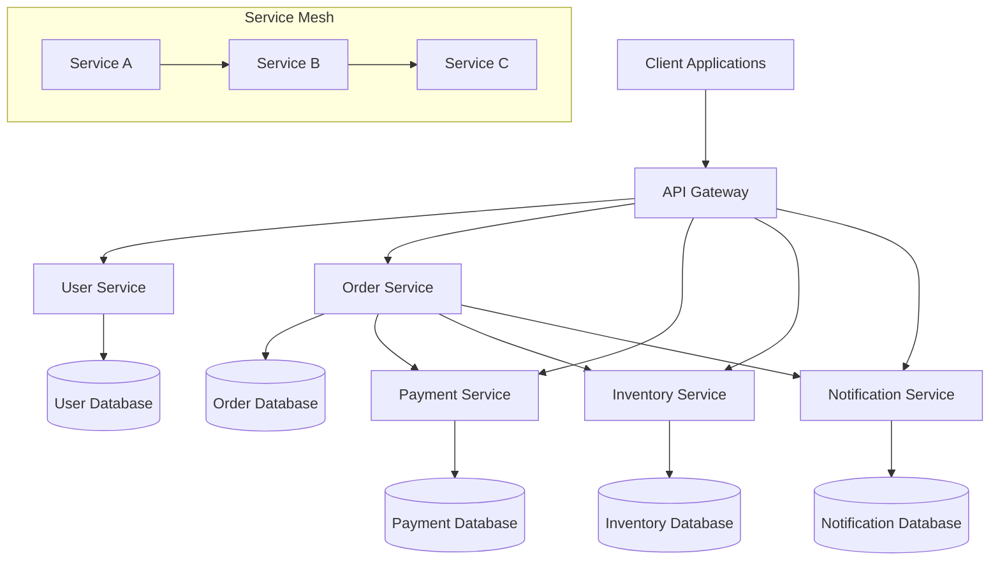
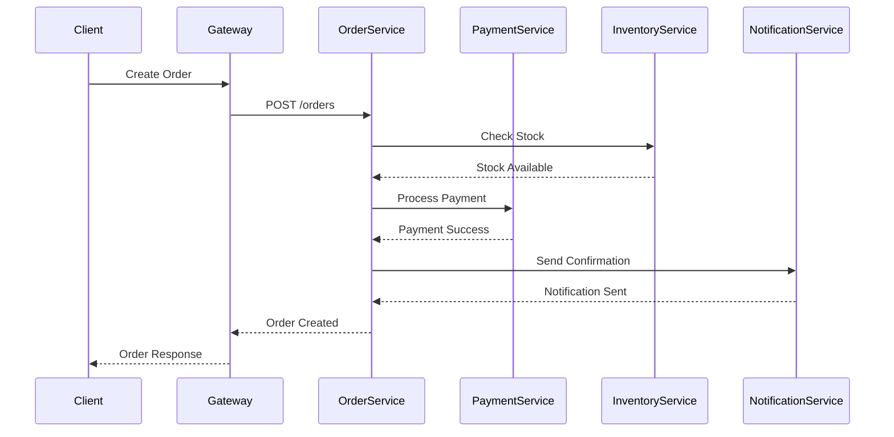
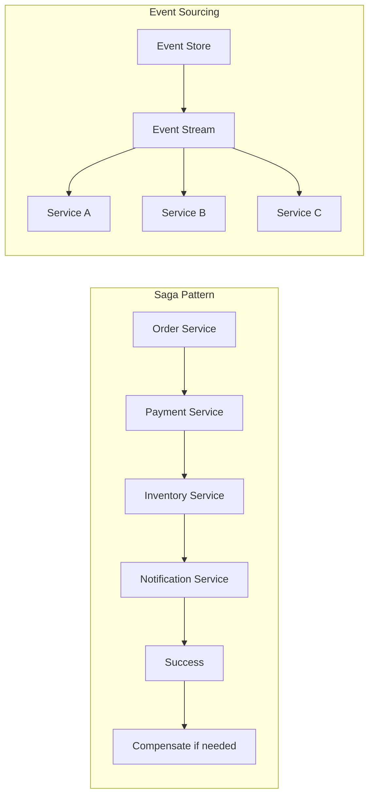

---
# Auto-generated front matter
Title: Microservices
LastUpdated: 2025-11-06T20:45:58.293120
Tags: []
Status: draft
---

# 🏗️ **Microservices Architecture**

## 📘 **Theory**

Microservices architecture is a design approach where applications are built as a collection of loosely coupled, independently deployable services. Each service is responsible for a specific business capability and communicates with other services through well-defined APIs.

### **Why Microservices Matter**

- **Scalability**: Scale individual services based on demand
- **Technology Diversity**: Use different technologies for different services
- **Fault Isolation**: Failure of one service doesn't bring down the entire system
- **Team Autonomy**: Teams can work independently on different services
- **Deployment Independence**: Deploy services independently without affecting others

### **Microservices vs Monolith**

- **Monolith**: Single deployable unit, shared database, tight coupling
- **Microservices**: Multiple deployable units, service-specific databases, loose coupling
- **Trade-offs**: Complexity vs Flexibility, Network latency vs Independence

### **Common Pitfalls and Best Practices**

- **Data Consistency**: Use eventual consistency and distributed transactions carefully
- **Service Communication**: Implement proper retry, circuit breaker, and timeout patterns
- **Service Discovery**: Use service registries for dynamic service location
- **Monitoring**: Implement comprehensive logging, metrics, and tracing
- **Security**: Implement proper authentication, authorization, and data encryption

## 📊 **Diagrams**

### **Microservices Architecture Overview**



### **Service Communication Patterns**



### **Data Consistency Patterns**



## 🧩 **Example**

**Scenario**: E-commerce platform with microservices for user management, orders, payments, inventory, and notifications

**Input**: User places an order for a product
**Expected Output**: Order created, payment processed, inventory updated, notification sent

**Step-by-step**:

1. User service validates user authentication
2. Order service creates order and validates request
3. Inventory service checks product availability
4. Payment service processes payment
5. Inventory service updates stock levels
6. Notification service sends order confirmation
7. Order service updates order status

## 💻 **Implementation (Golang)**

```go
package main

import (
    "context"
    "encoding/json"
    "fmt"
    "log"
    "net/http"
    "time"

    "github.com/gorilla/mux"
    "github.com/gorilla/handlers"
    "go.uber.org/zap"
)

// Service interfaces
type UserService interface {
    ValidateUser(ctx context.Context, userID string) (*User, error)
    GetUser(ctx context.Context, userID string) (*User, error)
}

type OrderService interface {
    CreateOrder(ctx context.Context, req *CreateOrderRequest) (*Order, error)
    GetOrder(ctx context.Context, orderID string) (*Order, error)
    UpdateOrderStatus(ctx context.Context, orderID string, status string) error
}

type PaymentService interface {
    ProcessPayment(ctx context.Context, req *PaymentRequest) (*PaymentResponse, error)
    RefundPayment(ctx context.Context, paymentID string) error
}

type InventoryService interface {
    CheckStock(ctx context.Context, productID string, quantity int) (*StockInfo, error)
    UpdateStock(ctx context.Context, productID string, quantity int) error
    ReserveStock(ctx context.Context, productID string, quantity int) error
}

type NotificationService interface {
    SendNotification(ctx context.Context, req *NotificationRequest) error
}

// Data models
type User struct {
    ID       string `json:"id"`
    Name     string `json:"name"`
    Email    string `json:"email"`
    IsActive bool   `json:"is_active"`
}

type Order struct {
    ID          string    `json:"id"`
    UserID      string    `json:"user_id"`
    Items       []Item    `json:"items"`
    TotalAmount float64   `json:"total_amount"`
    Status      string    `json:"status"`
    CreatedAt   time.Time `json:"created_at"`
    UpdatedAt   time.Time `json:"updated_at"`
}

type Item struct {
    ProductID string  `json:"product_id"`
    Quantity  int     `json:"quantity"`
    Price     float64 `json:"price"`
}

type Payment struct {
    ID        string    `json:"id"`
    OrderID   string    `json:"order_id"`
    Amount    float64   `json:"amount"`
    Status    string    `json:"status"`
    CreatedAt time.Time `json:"created_at"`
}

type StockInfo struct {
    ProductID string `json:"product_id"`
    Available int    `json:"available"`
    Reserved  int    `json:"reserved"`
}

// Request/Response models
type CreateOrderRequest struct {
    UserID string `json:"user_id"`
    Items  []Item `json:"items"`
}

type PaymentRequest struct {
    OrderID string  `json:"order_id"`
    Amount  float64 `json:"amount"`
    Method  string  `json:"method"`
}

type PaymentResponse struct {
    PaymentID string `json:"payment_id"`
    Status    string `json:"status"`
}

type NotificationRequest struct {
    UserID  string `json:"user_id"`
    Type    string `json:"type"`
    Message string `json:"message"`
}

// HTTP Client for service communication
type HTTPClient struct {
    baseURL string
    client  *http.Client
    logger  *zap.Logger
}

func NewHTTPClient(baseURL string, logger *zap.Logger) *HTTPClient {
    return &HTTPClient{
        baseURL: baseURL,
        client: &http.Client{
            Timeout: 30 * time.Second,
        },
        logger: logger,
    }
}

func (c *HTTPClient) Get(ctx context.Context, path string, result interface{}) error {
    url := c.baseURL + path
    req, err := http.NewRequestWithContext(ctx, "GET", url, nil)
    if err != nil {
        return err
    }

    resp, err := c.client.Do(req)
    if err != nil {
        return err
    }
    defer resp.Body.Close()

    if resp.StatusCode != http.StatusOK {
        return fmt.Errorf("HTTP %d: %s", resp.StatusCode, resp.Status)
    }

    return json.NewDecoder(resp.Body).Decode(result)
}

func (c *HTTPClient) Post(ctx context.Context, path string, data interface{}, result interface{}) error {
    jsonData, err := json.Marshal(data)
    if err != nil {
        return err
    }

    url := c.baseURL + path
    req, err := http.NewRequestWithContext(ctx, "POST", url, bytes.NewBuffer(jsonData))
    if err != nil {
        return err
    }
    req.Header.Set("Content-Type", "application/json")

    resp, err := c.client.Do(req)
    if err != nil {
        return err
    }
    defer resp.Body.Close()

    if resp.StatusCode != http.StatusOK && resp.StatusCode != http.StatusCreated {
        return fmt.Errorf("HTTP %d: %s", resp.StatusCode, resp.Status)
    }

    if result != nil {
        return json.NewDecoder(resp.Body).Decode(result)
    }

    return nil
}

// Service implementations
type UserServiceImpl struct {
    client *HTTPClient
}

func NewUserService(baseURL string, logger *zap.Logger) UserService {
    return &UserServiceImpl{
        client: NewHTTPClient(baseURL, logger),
    }
}

func (s *UserServiceImpl) ValidateUser(ctx context.Context, userID string) (*User, error) {
    var user User
    err := s.client.Get(ctx, "/users/"+userID, &user)
    if err != nil {
        return nil, err
    }

    if !user.IsActive {
        return nil, fmt.Errorf("user is not active")
    }

    return &user, nil
}

func (s *UserServiceImpl) GetUser(ctx context.Context, userID string) (*User, error) {
    var user User
    err := s.client.Get(ctx, "/users/"+userID, &user)
    if err != nil {
        return nil, err
    }
    return &user, nil
}

type OrderServiceImpl struct {
    client           *HTTPClient
    userService      UserService
    paymentService   PaymentService
    inventoryService InventoryService
    notificationService NotificationService
    logger           *zap.Logger
}

func NewOrderService(
    baseURL string,
    userService UserService,
    paymentService PaymentService,
    inventoryService InventoryService,
    notificationService NotificationService,
    logger *zap.Logger,
) OrderService {
    return &OrderServiceImpl{
        client:              NewHTTPClient(baseURL, logger),
        userService:         userService,
        paymentService:      paymentService,
        inventoryService:    inventoryService,
        notificationService: notificationService,
        logger:              logger,
    }
}

func (s *OrderServiceImpl) CreateOrder(ctx context.Context, req *CreateOrderRequest) (*Order, error) {
    // Validate user
    user, err := s.userService.ValidateUser(ctx, req.UserID)
    if err != nil {
        s.logger.Error("Failed to validate user", zap.Error(err))
        return nil, fmt.Errorf("invalid user: %w", err)
    }

    // Check inventory for all items
    for _, item := range req.Items {
        stock, err := s.inventoryService.CheckStock(ctx, item.ProductID, item.Quantity)
        if err != nil {
            s.logger.Error("Failed to check stock", zap.Error(err))
            return nil, fmt.Errorf("failed to check stock: %w", err)
        }

        if stock.Available < item.Quantity {
            return nil, fmt.Errorf("insufficient stock for product %s", item.ProductID)
        }
    }

    // Reserve stock
    for _, item := range req.Items {
        err := s.inventoryService.ReserveStock(ctx, item.ProductID, item.Quantity)
        if err != nil {
            s.logger.Error("Failed to reserve stock", zap.Error(err))
            return nil, fmt.Errorf("failed to reserve stock: %w", err)
        }
    }

    // Calculate total amount
    totalAmount := 0.0
    for _, item := range req.Items {
        totalAmount += item.Price * float64(item.Quantity)
    }

    // Create order
    order := &Order{
        ID:          generateID(),
        UserID:      req.UserID,
        Items:       req.Items,
        TotalAmount: totalAmount,
        Status:      "pending",
        CreatedAt:   time.Now(),
        UpdatedAt:   time.Now(),
    }

    // Process payment
    paymentResp, err := s.paymentService.ProcessPayment(ctx, &PaymentRequest{
        OrderID: order.ID,
        Amount:  order.TotalAmount,
        Method:  "credit_card",
    })
    if err != nil {
        s.logger.Error("Payment failed", zap.Error(err))
        // Release reserved stock
        for _, item := range req.Items {
            s.inventoryService.UpdateStock(ctx, item.ProductID, item.Quantity)
        }
        return nil, fmt.Errorf("payment failed: %w", err)
    }

    // Update order status
    order.Status = "confirmed"
    order.UpdatedAt = time.Now()

    // Update inventory
    for _, item := range req.Items {
        err := s.inventoryService.UpdateStock(ctx, item.ProductID, -item.Quantity)
        if err != nil {
            s.logger.Error("Failed to update stock", zap.Error(err))
            // Continue processing - stock is already reserved
        }
    }

    // Send notification
    err = s.notificationService.SendNotification(ctx, &NotificationRequest{
        UserID:  user.ID,
        Type:    "order_confirmation",
        Message: fmt.Sprintf("Your order %s has been confirmed", order.ID),
    })
    if err != nil {
        s.logger.Error("Failed to send notification", zap.Error(err))
        // Don't fail the order for notification failure
    }

    s.logger.Info("Order created successfully", zap.String("order_id", order.ID))
    return order, nil
}

func (s *OrderServiceImpl) GetOrder(ctx context.Context, orderID string) (*Order, error) {
    var order Order
    err := s.client.Get(ctx, "/orders/"+orderID, &order)
    if err != nil {
        return nil, err
    }
    return &order, nil
}

func (s *OrderServiceImpl) UpdateOrderStatus(ctx context.Context, orderID string, status string) error {
    return s.client.Post(ctx, "/orders/"+orderID+"/status", map[string]string{"status": status}, nil)
}

type PaymentServiceImpl struct {
    client *HTTPClient
    logger *zap.Logger
}

func NewPaymentService(baseURL string, logger *zap.Logger) PaymentService {
    return &PaymentServiceImpl{
        client: NewHTTPClient(baseURL, logger),
        logger: logger,
    }
}

func (s *PaymentServiceImpl) ProcessPayment(ctx context.Context, req *PaymentRequest) (*PaymentResponse, error) {
    var resp PaymentResponse
    err := s.client.Post(ctx, "/payments", req, &resp)
    if err != nil {
        return nil, err
    }

    s.logger.Info("Payment processed", zap.String("payment_id", resp.PaymentID))
    return &resp, nil
}

func (s *PaymentServiceImpl) RefundPayment(ctx context.Context, paymentID string) error {
    return s.client.Post(ctx, "/payments/"+paymentID+"/refund", nil, nil)
}

type InventoryServiceImpl struct {
    client *HTTPClient
    logger *zap.Logger
}

func NewInventoryService(baseURL string, logger *zap.Logger) InventoryService {
    return &InventoryServiceImpl{
        client: NewHTTPClient(baseURL, logger),
        logger: logger,
    }
}

func (s *InventoryServiceImpl) CheckStock(ctx context.Context, productID string, quantity int) (*StockInfo, error) {
    var stock StockInfo
    err := s.client.Get(ctx, "/inventory/"+productID+"/stock", &stock)
    if err != nil {
        return nil, err
    }
    return &stock, nil
}

func (s *InventoryServiceImpl) UpdateStock(ctx context.Context, productID string, quantity int) error {
    return s.client.Post(ctx, "/inventory/"+productID+"/stock", map[string]int{"quantity": quantity}, nil)
}

func (s *InventoryServiceImpl) ReserveStock(ctx context.Context, productID string, quantity int) error {
    return s.client.Post(ctx, "/inventory/"+productID+"/reserve", map[string]int{"quantity": quantity}, nil)
}

type NotificationServiceImpl struct {
    client *HTTPClient
    logger *zap.Logger
}

func NewNotificationService(baseURL string, logger *zap.Logger) NotificationService {
    return &NotificationServiceImpl{
        client: NewHTTPClient(baseURL, logger),
        logger: logger,
    }
}

func (s *NotificationServiceImpl) SendNotification(ctx context.Context, req *NotificationRequest) error {
    err := s.client.Post(ctx, "/notifications", req, nil)
    if err != nil {
        return err
    }

    s.logger.Info("Notification sent", zap.String("user_id", req.UserID), zap.String("type", req.Type))
    return nil
}

// API Gateway
type APIGateway struct {
    orderService OrderService
    logger       *zap.Logger
}

func NewAPIGateway(orderService OrderService, logger *zap.Logger) *APIGateway {
    return &APIGateway{
        orderService: orderService,
        logger:       logger,
    }
}

func (g *APIGateway) CreateOrderHandler(w http.ResponseWriter, r *http.Request) {
    var req CreateOrderRequest
    if err := json.NewDecoder(r.Body).Decode(&req); err != nil {
        http.Error(w, "Invalid request body", http.StatusBadRequest)
        return
    }

    order, err := g.orderService.CreateOrder(r.Context(), &req)
    if err != nil {
        g.logger.Error("Failed to create order", zap.Error(err))
        http.Error(w, err.Error(), http.StatusInternalServerError)
        return
    }

    w.Header().Set("Content-Type", "application/json")
    json.NewEncoder(w).Encode(order)
}

func (g *APIGateway) GetOrderHandler(w http.ResponseWriter, r *http.Request) {
    vars := mux.Vars(r)
    orderID := vars["id"]

    order, err := g.orderService.GetOrder(r.Context(), orderID)
    if err != nil {
        g.logger.Error("Failed to get order", zap.Error(err))
        http.Error(w, err.Error(), http.StatusInternalServerError)
        return
    }

    w.Header().Set("Content-Type", "application/json")
    json.NewEncoder(w).Encode(order)
}

// Service Registry
type ServiceRegistry struct {
    services map[string]string
    mutex    sync.RWMutex
}

func NewServiceRegistry() *ServiceRegistry {
    return &ServiceRegistry{
        services: make(map[string]string),
    }
}

func (r *ServiceRegistry) Register(serviceName, address string) {
    r.mutex.Lock()
    defer r.mutex.Unlock()
    r.services[serviceName] = address
}

func (r *ServiceRegistry) Get(serviceName string) (string, bool) {
    r.mutex.RLock()
    defer r.mutex.RUnlock()
    address, exists := r.services[serviceName]
    return address, exists
}

// Circuit Breaker
type CircuitBreaker struct {
    failureCount int
    threshold    int
    timeout      time.Duration
    lastFailTime time.Time
    state        string // "closed", "open", "half-open"
    mutex        sync.RWMutex
}

func NewCircuitBreaker(threshold int, timeout time.Duration) *CircuitBreaker {
    return &CircuitBreaker{
        threshold: threshold,
        timeout:   timeout,
        state:     "closed",
    }
}

func (cb *CircuitBreaker) Call(fn func() error) error {
    cb.mutex.Lock()
    defer cb.mutex.Unlock()

    if cb.state == "open" {
        if time.Since(cb.lastFailTime) > cb.timeout {
            cb.state = "half-open"
        } else {
            return fmt.Errorf("circuit breaker is open")
        }
    }

    err := fn()
    if err != nil {
        cb.failureCount++
        cb.lastFailTime = time.Now()
        if cb.failureCount >= cb.threshold {
            cb.state = "open"
        }
        return err
    }

    if cb.state == "half-open" {
        cb.state = "closed"
        cb.failureCount = 0
    }

    return nil
}

// Helper functions
func generateID() string {
    return fmt.Sprintf("%d", time.Now().UnixNano())
}

// Main function
func main() {
    // Initialize logger
    logger, _ := zap.NewProduction()
    defer logger.Sync()

    // Initialize service registry
    registry := NewServiceRegistry()
    registry.Register("user-service", "http://localhost:8001")
    registry.Register("payment-service", "http://localhost:8002")
    registry.Register("inventory-service", "http://localhost:8003")
    registry.Register("notification-service", "http://localhost:8004")

    // Initialize services
    userService := NewUserService("http://localhost:8001", logger)
    paymentService := NewPaymentService("http://localhost:8002", logger)
    inventoryService := NewInventoryService("http://localhost:8003", logger)
    notificationService := NewNotificationService("http://localhost:8004", logger)
    orderService := NewOrderService("http://localhost:8005", userService, paymentService, inventoryService, notificationService, logger)

    // Initialize API Gateway
    gateway := NewAPIGateway(orderService, logger)

    // Setup routes
    r := mux.NewRouter()
    r.HandleFunc("/orders", gateway.CreateOrderHandler).Methods("POST")
    r.HandleFunc("/orders/{id}", gateway.GetOrderHandler).Methods("GET")

    // Add CORS middleware
    corsHandler := handlers.CORS(
        handlers.AllowedOrigins([]string{"*"}),
        handlers.AllowedMethods([]string{"GET", "POST", "PUT", "DELETE", "OPTIONS"}),
        handlers.AllowedHeaders([]string{"Content-Type", "Authorization"}),
    )(r)

    // Start server
    logger.Info("Starting API Gateway on port 8080")
    log.Fatal(http.ListenAndServe(":8080", corsHandler))
}
```

## 💻 **Implementation (Node.js)**

```javascript
const express = require("express");
const axios = require("axios");
const winston = require("winston");

// Logger configuration
const logger = winston.createLogger({
  level: "info",
  format: winston.format.combine(
    winston.format.timestamp(),
    winston.format.json()
  ),
  transports: [
    new winston.transports.Console(),
    new winston.transports.File({ filename: "microservices.log" }),
  ],
});

// HTTP Client for service communication
class HTTPClient {
  constructor(baseURL, logger) {
    this.baseURL = baseURL;
    this.client = axios.create({
      baseURL,
      timeout: 30000,
      headers: {
        "Content-Type": "application/json",
      },
    });
    this.logger = logger;
  }

  async get(path) {
    try {
      const response = await this.client.get(path);
      return response.data;
    } catch (error) {
      this.logger.error("HTTP GET failed", { path, error: error.message });
      throw error;
    }
  }

  async post(path, data) {
    try {
      const response = await this.client.post(path, data);
      return response.data;
    } catch (error) {
      this.logger.error("HTTP POST failed", { path, error: error.message });
      throw error;
    }
  }
}

// Service implementations
class UserService {
  constructor(baseURL, logger) {
    this.client = new HTTPClient(baseURL, logger);
  }

  async validateUser(userId) {
    const user = await this.client.get(`/users/${userId}`);
    if (!user.is_active) {
      throw new Error("User is not active");
    }
    return user;
  }

  async getUser(userId) {
    return await this.client.get(`/users/${userId}`);
  }
}

class OrderService {
  constructor(
    baseURL,
    userService,
    paymentService,
    inventoryService,
    notificationService,
    logger
  ) {
    this.client = new HTTPClient(baseURL, logger);
    this.userService = userService;
    this.paymentService = paymentService;
    this.inventoryService = inventoryService;
    this.notificationService = notificationService;
    this.logger = logger;
  }

  async createOrder(request) {
    try {
      // Validate user
      const user = await this.userService.validateUser(request.user_id);
      this.logger.info("User validated", { userId: user.id });

      // Check inventory for all items
      for (const item of request.items) {
        const stock = await this.inventoryService.checkStock(
          item.product_id,
          item.quantity
        );
        if (stock.available < item.quantity) {
          throw new Error(`Insufficient stock for product ${item.product_id}`);
        }
      }

      // Reserve stock
      for (const item of request.items) {
        await this.inventoryService.reserveStock(
          item.product_id,
          item.quantity
        );
      }

      // Calculate total amount
      const totalAmount = request.items.reduce(
        (sum, item) => sum + item.price * item.quantity,
        0
      );

      // Create order
      const order = {
        id: this.generateId(),
        user_id: request.user_id,
        items: request.items,
        total_amount: totalAmount,
        status: "pending",
        created_at: new Date(),
        updated_at: new Date(),
      };

      // Process payment
      const paymentResponse = await this.paymentService.processPayment({
        order_id: order.id,
        amount: order.total_amount,
        method: "credit_card",
      });

      // Update order status
      order.status = "confirmed";
      order.updated_at = new Date();

      // Update inventory
      for (const item of request.items) {
        await this.inventoryService.updateStock(
          item.product_id,
          -item.quantity
        );
      }

      // Send notification
      try {
        await this.notificationService.sendNotification({
          user_id: user.id,
          type: "order_confirmation",
          message: `Your order ${order.id} has been confirmed`,
        });
      } catch (error) {
        this.logger.error("Failed to send notification", {
          error: error.message,
        });
        // Don't fail the order for notification failure
      }

      this.logger.info("Order created successfully", { orderId: order.id });
      return order;
    } catch (error) {
      this.logger.error("Failed to create order", { error: error.message });
      throw error;
    }
  }

  async getOrder(orderId) {
    return await this.client.get(`/orders/${orderId}`);
  }

  async updateOrderStatus(orderId, status) {
    return await this.client.post(`/orders/${orderId}/status`, { status });
  }

  generateId() {
    return Date.now().toString();
  }
}

class PaymentService {
  constructor(baseURL, logger) {
    this.client = new HTTPClient(baseURL, logger);
  }

  async processPayment(request) {
    const response = await this.client.post("/payments", request);
    this.logger.info("Payment processed", { paymentId: response.payment_id });
    return response;
  }

  async refundPayment(paymentId) {
    return await this.client.post(`/payments/${paymentId}/refund`);
  }
}

class InventoryService {
  constructor(baseURL, logger) {
    this.client = new HTTPClient(baseURL, logger);
  }

  async checkStock(productId, quantity) {
    return await this.client.get(`/inventory/${productId}/stock`);
  }

  async updateStock(productId, quantity) {
    return await this.client.post(`/inventory/${productId}/stock`, {
      quantity,
    });
  }

  async reserveStock(productId, quantity) {
    return await this.client.post(`/inventory/${productId}/reserve`, {
      quantity,
    });
  }
}

class NotificationService {
  constructor(baseURL, logger) {
    this.client = new HTTPClient(baseURL, logger);
  }

  async sendNotification(request) {
    await this.client.post("/notifications", request);
    this.logger.info("Notification sent", {
      userId: request.user_id,
      type: request.type,
    });
  }
}

// Circuit Breaker
class CircuitBreaker {
  constructor(threshold = 5, timeout = 60000) {
    this.failureCount = 0;
    this.threshold = threshold;
    this.timeout = timeout;
    this.lastFailTime = null;
    this.state = "closed"; // 'closed', 'open', 'half-open'
  }

  async call(fn) {
    if (this.state === "open") {
      if (Date.now() - this.lastFailTime > this.timeout) {
        this.state = "half-open";
      } else {
        throw new Error("Circuit breaker is open");
      }
    }

    try {
      const result = await fn();
      if (this.state === "half-open") {
        this.state = "closed";
        this.failureCount = 0;
      }
      return result;
    } catch (error) {
      this.failureCount++;
      this.lastFailTime = Date.now();
      if (this.failureCount >= this.threshold) {
        this.state = "open";
      }
      throw error;
    }
  }
}

// Service Registry
class ServiceRegistry {
  constructor() {
    this.services = new Map();
  }

  register(serviceName, address) {
    this.services.set(serviceName, address);
  }

  get(serviceName) {
    return this.services.get(serviceName);
  }
}

// API Gateway
class APIGateway {
  constructor(orderService, logger) {
    this.orderService = orderService;
    this.logger = logger;
  }

  async createOrderHandler(req, res) {
    try {
      const order = await this.orderService.createOrder(req.body);
      res.json(order);
    } catch (error) {
      this.logger.error("Failed to create order", { error: error.message });
      res.status(500).json({ error: error.message });
    }
  }

  async getOrderHandler(req, res) {
    try {
      const order = await this.orderService.getOrder(req.params.id);
      res.json(order);
    } catch (error) {
      this.logger.error("Failed to get order", { error: error.message });
      res.status(500).json({ error: error.message });
    }
  }
}

// Main application
async function main() {
  const app = express();
  app.use(express.json());

  // Initialize service registry
  const registry = new ServiceRegistry();
  registry.register("user-service", "http://localhost:8001");
  registry.register("payment-service", "http://localhost:8002");
  registry.register("inventory-service", "http://localhost:8003");
  registry.register("notification-service", "http://localhost:8004");

  // Initialize services
  const userService = new UserService("http://localhost:8001", logger);
  const paymentService = new PaymentService("http://localhost:8002", logger);
  const inventoryService = new InventoryService(
    "http://localhost:8003",
    logger
  );
  const notificationService = new NotificationService(
    "http://localhost:8004",
    logger
  );
  const orderService = new OrderService(
    "http://localhost:8005",
    userService,
    paymentService,
    inventoryService,
    notificationService,
    logger
  );

  // Initialize API Gateway
  const gateway = new APIGateway(orderService, logger);

  // Setup routes
  app.post("/orders", gateway.createOrderHandler.bind(gateway));
  app.get("/orders/:id", gateway.getOrderHandler.bind(gateway));

  // Start server
  const port = process.env.PORT || 8080;
  app.listen(port, () => {
    logger.info(`API Gateway started on port ${port}`);
  });
}

// Error handling
process.on("unhandledRejection", (reason, promise) => {
  logger.error("Unhandled Rejection at:", promise, "reason:", reason);
});

process.on("uncaughtException", (error) => {
  logger.error("Uncaught Exception:", error);
  process.exit(1);
});

main().catch(console.error);
```

## ⏱ **Complexity Analysis**

### **Time Complexity**

- **Service Communication**: O(1) per request (with proper connection pooling)
- **Order Creation**: O(n) where n is number of items in order
- **Service Discovery**: O(1) with proper registry implementation
- **Circuit Breaker**: O(1) for state checks

### **Space Complexity**

- **Service Storage**: O(n) where n is number of services
- **Request Processing**: O(1) per request
- **Service Registry**: O(n) where n is number of registered services

## 🚀 **Optimal Solution**

The optimal microservices solution includes:

1. **Service Mesh**: Use Istio or similar for service communication
2. **API Gateway**: Centralized entry point with rate limiting and authentication
3. **Service Discovery**: Dynamic service registration and discovery
4. **Circuit Breaker**: Prevent cascade failures
5. **Distributed Tracing**: Monitor requests across services
6. **Event-Driven Architecture**: Use message queues for async communication

### **Production Considerations**

- Implement proper service monitoring and alerting
- Use container orchestration (Kubernetes)
- Implement proper security and authentication
- Use database per service pattern
- Implement proper logging and tracing
- Use message queues for async communication

## ❓ **Follow-up Questions**

### **How would this scale with X?**

- **High Traffic**: Use load balancers and auto-scaling
- **Many Services**: Use service mesh and proper monitoring
- **Global Distribution**: Use CDN and edge computing

### **How can we optimize further if Y changes?**

- **Data Consistency**: Use event sourcing and CQRS
- **Service Communication**: Use gRPC for better performance
- **Deployment**: Use blue-green or canary deployments

### **What trade-offs exist in different approaches?**

- **Monolith vs Microservices**: Simplicity vs Flexibility
- **Synchronous vs Asynchronous**: Consistency vs Performance
- **Database per Service vs Shared Database**: Independence vs Consistency
