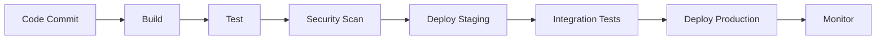
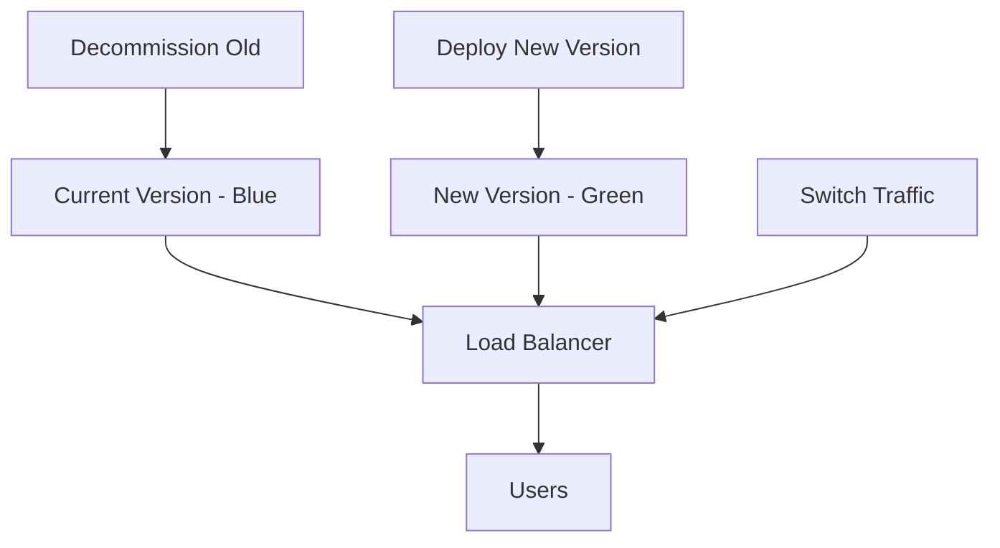

---
# Auto-generated front matter
Title: Ci Cd Pipelines
LastUpdated: 2025-11-06T20:45:59.125856
Tags: []
Status: draft
---

# CI/CD Pipelines

## 📘 Theory

CI/CD (Continuous Integration/Continuous Deployment) is a set of practices that automate the software development lifecycle. CI focuses on integrating code changes frequently, while CD automates the deployment process to various environments.

### Key Concepts:

- **Continuous Integration**: Automatically build, test, and validate code changes
- **Continuous Deployment**: Automatically deploy code to production
- **Continuous Delivery**: Automatically prepare code for deployment
- **Pipeline as Code**: Define pipelines using version-controlled configuration files
- **Infrastructure as Code**: Manage infrastructure through code
- **Blue-Green Deployment**: Zero-downtime deployment strategy
- **Canary Deployment**: Gradual rollout of new features

### Pipeline Stages:

1. **Source**: Code repository triggers
2. **Build**: Compile and package application
3. **Test**: Run automated tests
4. **Security**: Security scanning and compliance checks
5. **Deploy**: Deploy to target environments
6. **Monitor**: Monitor application health

## 📊 Diagrams

### CI/CD Pipeline Flow



### Blue-Green Deployment



## 🧩 Example

Complete CI/CD pipeline for a Go microservice:

**Pipeline Stages:**

1. Trigger on push to main branch
2. Build Go binary with version tag
3. Run unit tests and coverage
4. Security scan with Snyk
5. Build Docker image
6. Deploy to staging
7. Run integration tests
8. Deploy to production with blue-green strategy

## 💻 Implementation (Golang)

```go
package main

import (
    "bytes"
    "encoding/json"
    "fmt"
    "io"
    "log"
    "net/http"
    "os"
    "os/exec"
    "path/filepath"
    "strings"
    "time"
)

// Pipeline represents a CI/CD pipeline
type Pipeline struct {
    Name        string
    Stages      []Stage
    Environment string
    Status      string
    StartTime   time.Time
    EndTime     time.Time
}

// Stage represents a pipeline stage
type Stage struct {
    Name        string
    Type        string
    Commands    []string
    Dependencies []string
    Status      string
    StartTime   time.Time
    EndTime     time.Time
    Output      string
}

// BuildInfo contains build metadata
type BuildInfo struct {
    Version     string
    CommitHash  string
    Branch      string
    BuildTime   time.Time
    BuildNumber int
}

// DeploymentConfig contains deployment configuration
type DeploymentConfig struct {
    Environment string
    Replicas    int
    ImageTag    string
    Resources   ResourceConfig
    HealthCheck HealthCheckConfig
}

type ResourceConfig struct {
    CPU    string
    Memory string
}

type HealthCheckConfig struct {
    Path     string
    Interval int
    Timeout  int
}

// CICDManager manages CI/CD pipelines
type CICDManager struct {
    pipelines map[string]*Pipeline
    builds    map[string]*BuildInfo
    deployments map[string]*DeploymentConfig
}

// NewCICDManager creates a new CI/CD manager
func NewCICDManager() *CICDManager {
    return &CICDManager{
        pipelines:   make(map[string]*Pipeline),
        builds:      make(map[string]*BuildInfo),
        deployments: make(map[string]*DeploymentConfig),
    }
}

// CreatePipeline creates a new pipeline
func (cm *CICDManager) CreatePipeline(name string, stages []Stage) *Pipeline {
    pipeline := &Pipeline{
        Name:        name,
        Stages:      stages,
        Environment: "default",
        Status:      "created",
        StartTime:   time.Now(),
    }

    cm.pipelines[name] = pipeline
    return pipeline
}

// ExecutePipeline executes a pipeline
func (cm *CICDManager) ExecutePipeline(name string) error {
    pipeline, exists := cm.pipelines[name]
    if !exists {
        return fmt.Errorf("pipeline %s not found", name)
    }

    pipeline.Status = "running"
    pipeline.StartTime = time.Now()

    log.Printf("Starting pipeline: %s", name)

    for i, stage := range pipeline.Stages {
        log.Printf("Executing stage: %s", stage.Name)

        stage.StartTime = time.Now()
        stage.Status = "running"

        err := cm.executeStage(&pipeline.Stages[i])
        if err != nil {
            stage.Status = "failed"
            stage.EndTime = time.Now()
            pipeline.Status = "failed"
            pipeline.EndTime = time.Now()
            return fmt.Errorf("stage %s failed: %v", stage.Name, err)
        }

        stage.Status = "success"
        stage.EndTime = time.Now()
        log.Printf("Stage %s completed successfully", stage.Name)
    }

    pipeline.Status = "success"
    pipeline.EndTime = time.Now()
    log.Printf("Pipeline %s completed successfully", name)

    return nil
}

// executeStage executes a single stage
func (cm *CICDManager) executeStage(stage *Stage) error {
    var output bytes.Buffer

    for _, command := range stage.Commands {
        log.Printf("Executing command: %s", command)

        cmd := exec.Command("bash", "-c", command)
        cmd.Stdout = &output
        cmd.Stderr = &output

        err := cmd.Run()
        if err != nil {
            stage.Output = output.String()
            return fmt.Errorf("command failed: %v", err)
        }
    }

    stage.Output = output.String()
    return nil
}

// BuildApplication builds the application
func (cm *CICDManager) BuildApplication(projectPath string) (*BuildInfo, error) {
    // Get git information
    commitHash, err := cm.getGitCommitHash(projectPath)
    if err != nil {
        return nil, err
    }

    branch, err := cm.getGitBranch(projectPath)
    if err != nil {
        return nil, err
    }

    // Generate version
    version := fmt.Sprintf("%s-%s", branch, commitHash[:8])

    // Build Go application
    buildCmd := exec.Command("go", "build", "-o", "app", "-ldflags",
        fmt.Sprintf("-X main.version=%s -X main.commit=%s", version, commitHash))
    buildCmd.Dir = projectPath

    err = buildCmd.Run()
    if err != nil {
        return nil, fmt.Errorf("build failed: %v", err)
    }

    buildInfo := &BuildInfo{
        Version:     version,
        CommitHash:  commitHash,
        Branch:      branch,
        BuildTime:   time.Now(),
        BuildNumber: cm.getNextBuildNumber(),
    }

    cm.builds[version] = buildInfo
    return buildInfo, nil
}

// RunTests runs automated tests
func (cm *CICDManager) RunTests(projectPath string) error {
    // Run unit tests
    testCmd := exec.Command("go", "test", "-v", "-cover", "./...")
    testCmd.Dir = projectPath

    output, err := testCmd.CombinedOutput()
    if err != nil {
        return fmt.Errorf("tests failed: %v\n%s", err, string(output))
    }

    log.Printf("Tests passed:\n%s", string(output))
    return nil
}

// RunSecurityScan runs security scanning
func (cm *CICDManager) RunSecurityScan(projectPath string) error {
    // Check if gosec is installed
    if !cm.isCommandAvailable("gosec") {
        log.Println("gosec not available, skipping security scan")
        return nil
    }

    // Run gosec security scan
    scanCmd := exec.Command("gosec", "-fmt", "json", "./...")
    scanCmd.Dir = projectPath

    output, err := scanCmd.CombinedOutput()
    if err != nil {
        // gosec returns non-zero exit code for vulnerabilities
        log.Printf("Security scan found issues:\n%s", string(output))
        // In a real pipeline, you might want to fail on high severity issues
    } else {
        log.Println("Security scan passed")
    }

    return nil
}

// BuildDockerImage builds a Docker image
func (cm *CICDManager) BuildDockerImage(imageName, tag string, projectPath string) error {
    // Create Dockerfile if it doesn't exist
    dockerfilePath := filepath.Join(projectPath, "Dockerfile")
    if !cm.fileExists(dockerfilePath) {
        err := cm.createDockerfile(dockerfilePath)
        if err != nil {
            return err
        }
    }

    // Build Docker image
    imageTag := fmt.Sprintf("%s:%s", imageName, tag)
    buildCmd := exec.Command("docker", "build", "-t", imageTag, projectPath)

    output, err := buildCmd.CombinedOutput()
    if err != nil {
        return fmt.Errorf("Docker build failed: %v\n%s", err, string(output))
    }

    log.Printf("Docker image built: %s", imageTag)
    return nil
}

// DeployApplication deploys the application
func (cm *CICDManager) DeployApplication(environment string, imageTag string) error {
    config := &DeploymentConfig{
        Environment: environment,
        Replicas:    3,
        ImageTag:    imageTag,
        Resources: ResourceConfig{
            CPU:    "100m",
            Memory: "256Mi",
        },
        HealthCheck: HealthCheckConfig{
            Path:     "/health",
            Interval: 30,
            Timeout:  5,
        },
    }

    cm.deployments[environment] = config

    // In a real implementation, this would deploy to Kubernetes, Docker Swarm, etc.
    log.Printf("Deployed to %s environment with image %s", environment, imageTag)

    return nil
}

// BlueGreenDeploy performs blue-green deployment
func (cm *CICDManager) BlueGreenDeploy(newImageTag string) error {
    log.Println("Starting blue-green deployment")

    // Deploy new version to green environment
    err := cm.DeployApplication("green", newImageTag)
    if err != nil {
        return fmt.Errorf("green deployment failed: %v", err)
    }

    // Wait for green environment to be healthy
    err = cm.waitForHealthy("green")
    if err != nil {
        return fmt.Errorf("green environment not healthy: %v", err)
    }

    // Switch traffic to green
    err = cm.switchTraffic("green")
    if err != nil {
        return fmt.Errorf("traffic switch failed: %v", err)
    }

    // Wait and verify
    time.Sleep(30 * time.Second)

    // Decommission blue environment
    err = cm.decommissionEnvironment("blue")
    if err != nil {
        log.Printf("Warning: failed to decommission blue environment: %v", err)
    }

    log.Println("Blue-green deployment completed")
    return nil
}

// CanaryDeploy performs canary deployment
func (cm *CICDManager) CanaryDeploy(newImageTag string, percentage int) error {
    log.Printf("Starting canary deployment with %d%% traffic", percentage)

    // Deploy canary version
    err := cm.DeployApplication("canary", newImageTag)
    if err != nil {
        return fmt.Errorf("canary deployment failed: %v", err)
    }

    // Gradually increase traffic
    for i := 10; i <= percentage; i += 10 {
        log.Printf("Routing %d%% traffic to canary", i)
        err = cm.setTrafficSplit("canary", i)
        if err != nil {
            return fmt.Errorf("traffic split failed: %v", err)
        }

        // Wait and monitor
        time.Sleep(2 * time.Minute)

        // Check metrics
        if !cm.isCanaryHealthy() {
            log.Println("Canary deployment unhealthy, rolling back")
            return cm.rollbackCanary()
        }
    }

    // Promote canary to production
    err = cm.promoteCanary()
    if err != nil {
        return fmt.Errorf("canary promotion failed: %v", err)
    }

    log.Println("Canary deployment completed")
    return nil
}

// Helper methods
func (cm *CICDManager) getGitCommitHash(path string) (string, error) {
    cmd := exec.Command("git", "rev-parse", "HEAD")
    cmd.Dir = path
    output, err := cmd.Output()
    if err != nil {
        return "", err
    }
    return strings.TrimSpace(string(output)), nil
}

func (cm *CICDManager) getGitBranch(path string) (string, error) {
    cmd := exec.Command("git", "rev-parse", "--abbrev-ref", "HEAD")
    cmd.Dir = path
    output, err := cmd.Output()
    if err != nil {
        return "", err
    }
    return strings.TrimSpace(string(output)), nil
}

func (cm *CICDManager) getNextBuildNumber() int {
    return len(cm.builds) + 1
}

func (cm *CICDManager) isCommandAvailable(command string) bool {
    _, err := exec.LookPath(command)
    return err == nil
}

func (cm *CICDManager) fileExists(path string) bool {
    _, err := os.Stat(path)
    return !os.IsNotExist(err)
}

func (cm *CICDManager) createDockerfile(path string) error {
    dockerfile := `FROM golang:1.21-alpine AS builder

WORKDIR /app
COPY . .
RUN go mod download
RUN go build -o app .

FROM alpine:latest
RUN apk --no-cache add ca-certificates
WORKDIR /root/
COPY --from=builder /app/app .
EXPOSE 8080
CMD ["./app"]`

    return os.WriteFile(path, []byte(dockerfile), 0644)
}

func (cm *CICDManager) waitForHealthy(environment string) error {
    // Simulate health check
    time.Sleep(5 * time.Second)
    return nil
}

func (cm *CICDManager) switchTraffic(environment string) error {
    log.Printf("Switching traffic to %s environment", environment)
    // Simulate traffic switch
    time.Sleep(2 * time.Second)
    return nil
}

func (cm *CICDManager) decommissionEnvironment(environment string) error {
    log.Printf("Decommissioning %s environment", environment)
    // Simulate decommissioning
    time.Sleep(2 * time.Second)
    return nil
}

func (cm *CICDManager) setTrafficSplit(environment string, percentage int) error {
    log.Printf("Setting %d%% traffic to %s", percentage, environment)
    // Simulate traffic split
    time.Sleep(1 * time.Second)
    return nil
}

func (cm *CICDManager) isCanaryHealthy() bool {
    // Simulate health check
    return true
}

func (cm *CICDManager) rollbackCanary() error {
    log.Println("Rolling back canary deployment")
    // Simulate rollback
    time.Sleep(2 * time.Second)
    return nil
}

func (cm *CICDManager) promoteCanary() error {
    log.Println("Promoting canary to production")
    // Simulate promotion
    time.Sleep(2 * time.Second)
    return nil
}

// GetPipelineStatus returns the status of a pipeline
func (cm *CICDManager) GetPipelineStatus(name string) (*Pipeline, error) {
    pipeline, exists := cm.pipelines[name]
    if !exists {
        return nil, fmt.Errorf("pipeline %s not found", name)
    }
    return pipeline, nil
}

// GetBuildInfo returns build information
func (cm *CICDManager) GetBuildInfo(version string) (*BuildInfo, error) {
    buildInfo, exists := cm.builds[version]
    if !exists {
        return nil, fmt.Errorf("build %s not found", version)
    }
    return buildInfo, nil
}

func main() {
    // Create CI/CD manager
    cicd := NewCICDManager()

    // Define pipeline stages
    stages := []Stage{
        {
            Name: "Build",
            Type: "build",
            Commands: []string{
                "go mod download",
                "go build -o app .",
            },
        },
        {
            Name: "Test",
            Type: "test",
            Commands: []string{
                "go test -v -cover ./...",
            },
        },
        {
            Name: "Security Scan",
            Type: "security",
            Commands: []string{
                "gosec ./... || true", // Don't fail on security issues for demo
            },
        },
        {
            Name: "Docker Build",
            Type: "docker",
            Commands: []string{
                "docker build -t myapp:latest .",
            },
        },
    }

    // Create and execute pipeline
    pipeline := cicd.CreatePipeline("main", stages)

    err := cicd.ExecutePipeline("main")
    if err != nil {
        log.Fatalf("Pipeline failed: %v", err)
    }

    // Build application
    buildInfo, err := cicd.BuildApplication(".")
    if err != nil {
        log.Fatalf("Build failed: %v", err)
    }

    log.Printf("Build completed: %+v", buildInfo)

    // Run tests
    err = cicd.RunTests(".")
    if err != nil {
        log.Fatalf("Tests failed: %v", err)
    }

    // Run security scan
    err = cicd.RunSecurityScan(".")
    if err != nil {
        log.Printf("Security scan warning: %v", err)
    }

    // Build Docker image
    err = cicd.BuildDockerImage("myapp", "latest", ".")
    if err != nil {
        log.Fatalf("Docker build failed: %v", err)
    }

    // Deploy to staging
    err = cicd.DeployApplication("staging", "myapp:latest")
    if err != nil {
        log.Fatalf("Staging deployment failed: %v", err)
    }

    // Blue-green deployment to production
    err = cicd.BlueGreenDeploy("myapp:latest")
    if err != nil {
        log.Fatalf("Blue-green deployment failed: %v", err)
    }

    // Canary deployment
    err = cicd.CanaryDeploy("myapp:v2", 50)
    if err != nil {
        log.Printf("Canary deployment warning: %v", err)
    }

    log.Println("CI/CD pipeline completed successfully")
}
```

## 💻 Implementation (Node.js)

```javascript
class CICDManager {
  constructor() {
    this.pipelines = new Map();
    this.builds = new Map();
    this.deployments = new Map();
  }

  createPipeline(name, stages) {
    const pipeline = {
      name,
      stages,
      environment: "default",
      status: "created",
      startTime: new Date(),
      endTime: null,
    };

    this.pipelines.set(name, pipeline);
    return pipeline;
  }

  async executePipeline(name) {
    const pipeline = this.pipelines.get(name);
    if (!pipeline) {
      throw new Error(`Pipeline ${name} not found`);
    }

    pipeline.status = "running";
    pipeline.startTime = new Date();

    console.log(`Starting pipeline: ${name}`);

    for (let i = 0; i < pipeline.stages.length; i++) {
      const stage = pipeline.stages[i];
      console.log(`Executing stage: ${stage.name}`);

      stage.startTime = new Date();
      stage.status = "running";

      try {
        await this.executeStage(stage);
        stage.status = "success";
        stage.endTime = new Date();
        console.log(`Stage ${stage.name} completed successfully`);
      } catch (error) {
        stage.status = "failed";
        stage.endTime = new Date();
        pipeline.status = "failed";
        pipeline.endTime = new Date();
        throw new Error(`Stage ${stage.name} failed: ${error.message}`);
      }
    }

    pipeline.status = "success";
    pipeline.endTime = new Date();
    console.log(`Pipeline ${name} completed successfully`);
  }

  async executeStage(stage) {
    const { exec } = require("child_process");
    const { promisify } = require("util");
    const execAsync = promisify(exec);

    let output = "";

    for (const command of stage.commands) {
      console.log(`Executing command: ${command}`);

      try {
        const { stdout, stderr } = await execAsync(command);
        output += stdout + stderr;
      } catch (error) {
        stage.output = output;
        throw new Error(`Command failed: ${error.message}`);
      }
    }

    stage.output = output;
  }

  async buildApplication(projectPath) {
    const { exec } = require("child_process");
    const { promisify } = require("util");
    const execAsync = promisify(exec);

    // Get git information
    const { stdout: commitHash } = await execAsync("git rev-parse HEAD", {
      cwd: projectPath,
    });
    const { stdout: branch } = await execAsync(
      "git rev-parse --abbrev-ref HEAD",
      { cwd: projectPath }
    );

    const version = `${branch.trim()}-${commitHash.trim().substring(0, 8)}`;

    // Build application
    await execAsync("npm install", { cwd: projectPath });
    await execAsync("npm run build", { cwd: projectPath });

    const buildInfo = {
      version,
      commitHash: commitHash.trim(),
      branch: branch.trim(),
      buildTime: new Date(),
      buildNumber: this.builds.size + 1,
    };

    this.builds.set(version, buildInfo);
    return buildInfo;
  }

  async runTests(projectPath) {
    const { exec } = require("child_process");
    const { promisify } = require("util");
    const execAsync = promisify(exec);

    try {
      const { stdout } = await execAsync("npm test", { cwd: projectPath });
      console.log("Tests passed:", stdout);
    } catch (error) {
      throw new Error(`Tests failed: ${error.message}`);
    }
  }

  async runSecurityScan(projectPath) {
    const { exec } = require("child_process");
    const { promisify } = require("util");
    const execAsync = promisify(exec);

    try {
      // Check if npm audit is available
      await execAsync("npm audit --audit-level moderate", { cwd: projectPath });
      console.log("Security scan passed");
    } catch (error) {
      console.log("Security scan found issues:", error.message);
      // In a real pipeline, you might want to fail on high severity issues
    }
  }

  async buildDockerImage(imageName, tag, projectPath) {
    const { exec } = require("child_process");
    const { promisify } = require("util");
    const execAsync = promisify(exec);

    // Create Dockerfile if it doesn't exist
    const fs = require("fs");
    const path = require("path");
    const dockerfilePath = path.join(projectPath, "Dockerfile");

    if (!fs.existsSync(dockerfilePath)) {
      await this.createDockerfile(dockerfilePath);
    }

    // Build Docker image
    const imageTag = `${imageName}:${tag}`;
    const { stdout } = await execAsync(
      `docker build -t ${imageTag} ${projectPath}`
    );

    console.log(`Docker image built: ${imageTag}`);
    console.log(stdout);
  }

  async createDockerfile(path) {
    const fs = require("fs");
    const dockerfile = `FROM node:18-alpine

WORKDIR /app
COPY package*.json ./
RUN npm ci --only=production

COPY . .
RUN npm run build

EXPOSE 3000
CMD ["npm", "start"]`;

    fs.writeFileSync(path, dockerfile);
  }

  async deployApplication(environment, imageTag) {
    const config = {
      environment,
      replicas: 3,
      imageTag,
      resources: {
        cpu: "100m",
        memory: "256Mi",
      },
      healthCheck: {
        path: "/health",
        interval: 30,
        timeout: 5,
      },
    };

    this.deployments.set(environment, config);

    // In a real implementation, this would deploy to Kubernetes, Docker Swarm, etc.
    console.log(
      `Deployed to ${environment} environment with image ${imageTag}`
    );
  }

  async blueGreenDeploy(newImageTag) {
    console.log("Starting blue-green deployment");

    // Deploy new version to green environment
    await this.deployApplication("green", newImageTag);

    // Wait for green environment to be healthy
    await this.waitForHealthy("green");

    // Switch traffic to green
    await this.switchTraffic("green");

    // Wait and verify
    await new Promise((resolve) => setTimeout(resolve, 30000));

    // Decommission blue environment
    try {
      await this.decommissionEnvironment("blue");
    } catch (error) {
      console.log(
        `Warning: failed to decommission blue environment: ${error.message}`
      );
    }

    console.log("Blue-green deployment completed");
  }

  async canaryDeploy(newImageTag, percentage) {
    console.log(`Starting canary deployment with ${percentage}% traffic`);

    // Deploy canary version
    await this.deployApplication("canary", newImageTag);

    // Gradually increase traffic
    for (let i = 10; i <= percentage; i += 10) {
      console.log(`Routing ${i}% traffic to canary`);
      await this.setTrafficSplit("canary", i);

      // Wait and monitor
      await new Promise((resolve) => setTimeout(resolve, 120000));

      // Check metrics
      if (!(await this.isCanaryHealthy())) {
        console.log("Canary deployment unhealthy, rolling back");
        return await this.rollbackCanary();
      }
    }

    // Promote canary to production
    await this.promoteCanary();

    console.log("Canary deployment completed");
  }

  async waitForHealthy(environment) {
    // Simulate health check
    await new Promise((resolve) => setTimeout(resolve, 5000));
  }

  async switchTraffic(environment) {
    console.log(`Switching traffic to ${environment} environment`);
    // Simulate traffic switch
    await new Promise((resolve) => setTimeout(resolve, 2000));
  }

  async decommissionEnvironment(environment) {
    console.log(`Decommissioning ${environment} environment`);
    // Simulate decommissioning
    await new Promise((resolve) => setTimeout(resolve, 2000));
  }

  async setTrafficSplit(environment, percentage) {
    console.log(`Setting ${percentage}% traffic to ${environment}`);
    // Simulate traffic split
    await new Promise((resolve) => setTimeout(resolve, 1000));
  }

  async isCanaryHealthy() {
    // Simulate health check
    return true;
  }

  async rollbackCanary() {
    console.log("Rolling back canary deployment");
    // Simulate rollback
    await new Promise((resolve) => setTimeout(resolve, 2000));
  }

  async promoteCanary() {
    console.log("Promoting canary to production");
    // Simulate promotion
    await new Promise((resolve) => setTimeout(resolve, 2000));
  }

  getPipelineStatus(name) {
    const pipeline = this.pipelines.get(name);
    if (!pipeline) {
      throw new Error(`Pipeline ${name} not found`);
    }
    return pipeline;
  }

  getBuildInfo(version) {
    const buildInfo = this.builds.get(version);
    if (!buildInfo) {
      throw new Error(`Build ${version} not found`);
    }
    return buildInfo;
  }
}

// Example usage
async function main() {
  const cicd = new CICDManager();

  // Define pipeline stages
  const stages = [
    {
      name: "Build",
      type: "build",
      commands: ["npm install", "npm run build"],
    },
    {
      name: "Test",
      type: "test",
      commands: ["npm test"],
    },
    {
      name: "Security Scan",
      type: "security",
      commands: ["npm audit --audit-level moderate || true"],
    },
    {
      name: "Docker Build",
      type: "docker",
      commands: ["docker build -t myapp:latest ."],
    },
  ];

  try {
    // Create and execute pipeline
    const pipeline = cicd.createPipeline("main", stages);
    await cicd.executePipeline("main");

    // Build application
    const buildInfo = await cicd.buildApplication(".");
    console.log("Build completed:", buildInfo);

    // Run tests
    await cicd.runTests(".");

    // Run security scan
    await cicd.runSecurityScan(".");

    // Build Docker image
    await cicd.buildDockerImage("myapp", "latest", ".");

    // Deploy to staging
    await cicd.deployApplication("staging", "myapp:latest");

    // Blue-green deployment to production
    await cicd.blueGreenDeploy("myapp:latest");

    // Canary deployment
    await cicd.canaryDeploy("myapp:v2", 50);

    console.log("CI/CD pipeline completed successfully");
  } catch (error) {
    console.error("Pipeline failed:", error.message);
    process.exit(1);
  }
}

if (require.main === module) {
  main().catch(console.error);
}

module.exports = CICDManager;
```

## ⏱ Complexity Analysis

**Time Complexity:**

- Pipeline Execution: O(n × m) where n is stages, m is commands per stage
- Build Process: O(k) where k is build time
- Deployment: O(d) where d is deployment time
- Space Complexity: O(b + p) where b is builds, p is pipelines

## 🚀 Optimal Solution

The optimal solution uses:

1. **Parallel Execution**: Run independent stages in parallel
2. **Caching**: Cache dependencies and build artifacts
3. **Incremental Builds**: Only rebuild changed components
4. **Resource Optimization**: Use appropriate resource limits
5. **Monitoring**: Real-time pipeline monitoring and alerting

## ❓ Follow-up Questions

1. **How would this scale with 1000+ developers?**

   - Use distributed build systems
   - Implement pipeline queuing
   - Consider microservices architecture

2. **How can we optimize further if builds are slow?**

   - Use build caching strategies
   - Implement incremental builds
   - Consider build parallelization

3. **What trade-offs exist in different approaches?**
   - Blue-Green vs Canary: Blue-Green is simpler but uses more resources
   - Manual vs Automatic: Manual gives control but reduces speed
   - Monolithic vs Microservices: Monolithic is simpler but harder to scale
