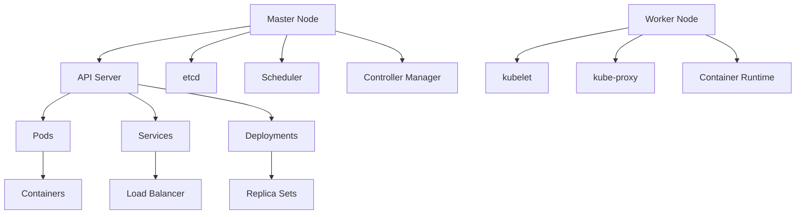

# Container Orchestration - Kubernetes and Docker Swarm

## Overview

Container orchestration is the process of managing and coordinating multiple containers across multiple hosts. It provides automation for deployment, scaling, networking, and monitoring of containerized applications.

## Key Concepts

- **Container**: Lightweight, portable unit of software
- **Orchestration**: Automated management of containers
- **Scaling**: Adjusting resources based on demand
- **Service Discovery**: Finding and connecting to services
- **Load Balancing**: Distributing traffic across instances
- **Health Checks**: Monitoring container health

## Container Orchestration Platforms

### 1. Kubernetes
- Most popular container orchestration platform
- Open-source, originally developed by Google
- Highly scalable and feature-rich
- Complex but powerful

### 2. Docker Swarm
- Built into Docker Engine
- Simpler than Kubernetes
- Good for smaller deployments
- Less feature-rich

### 3. Apache Mesos
- Distributed systems kernel
- Can run multiple frameworks
- More complex setup
- Less commonly used

## Kubernetes Architecture



## Go Implementation - Kubernetes Client

```go
package main

import (
    "context"
    "fmt"
    "log"
    "time"

    "k8s.io/api/apps/v1"
    corev1 "k8s.io/api/core/v1"
    metav1 "k8s.io/apimachinery/pkg/apis/meta/v1"
    "k8s.io/client-go/kubernetes"
    "k8s.io/client-go/rest"
    "k8s.io/client-go/tools/clientcmd"
)

// KubernetesManager manages Kubernetes resources
type KubernetesManager struct {
    clientset *kubernetes.Clientset
    namespace string
}

// NewKubernetesManager creates a new Kubernetes manager
func NewKubernetesManager(kubeconfig string, namespace string) (*KubernetesManager, error) {
    var config *rest.Config
    var err error

    if kubeconfig != "" {
        config, err = clientcmd.BuildConfigFromFlags("", kubeconfig)
    } else {
        config, err = rest.InClusterConfig()
    }

    if err != nil {
        return nil, fmt.Errorf("failed to create config: %v", err)
    }

    clientset, err := kubernetes.NewForConfig(config)
    if err != nil {
        return nil, fmt.Errorf("failed to create clientset: %v", err)
    }

    return &KubernetesManager{
        clientset: clientset,
        namespace: namespace,
    }, nil
}

// CreateDeployment creates a deployment
func (km *KubernetesManager) CreateDeployment(name, image string, replicas int32) error {
    deployment := &v1.Deployment{
        ObjectMeta: metav1.ObjectMeta{
            Name:      name,
            Namespace: km.namespace,
        },
        Spec: v1.DeploymentSpec{
            Replicas: &replicas,
            Selector: &metav1.LabelSelector{
                MatchLabels: map[string]string{
                    "app": name,
                },
            },
            Template: corev1.PodTemplateSpec{
                ObjectMeta: metav1.ObjectMeta{
                    Labels: map[string]string{
                        "app": name,
                    },
                },
                Spec: corev1.PodSpec{
                    Containers: []corev1.Container{
                        {
                            Name:  name,
                            Image: image,
                            Ports: []corev1.ContainerPort{
                                {
                                    ContainerPort: 8080,
                                },
                            },
                            Resources: corev1.ResourceRequirements{
                                Requests: corev1.ResourceList{
                                    "cpu":    resource.MustParse("100m"),
                                    "memory": resource.MustParse("128Mi"),
                                },
                                Limits: corev1.ResourceList{
                                    "cpu":    resource.MustParse("500m"),
                                    "memory": resource.MustParse("512Mi"),
                                },
                            },
                            LivenessProbe: &corev1.Probe{
                                HTTPGet: &corev1.HTTPGetAction{
                                    Path: "/health",
                                    Port: intstr.FromInt(8080),
                                },
                                InitialDelaySeconds: 30,
                                PeriodSeconds:       10,
                            },
                            ReadinessProbe: &corev1.Probe{
                                HTTPGet: &corev1.HTTPGetAction{
                                    Path: "/ready",
                                    Port: intstr.FromInt(8080),
                                },
                                InitialDelaySeconds: 5,
                                PeriodSeconds:       5,
                            },
                        },
                    },
                },
            },
        },
    }

    _, err := km.clientset.AppsV1().Deployments(km.namespace).Create(context.TODO(), deployment, metav1.CreateOptions{})
    if err != nil {
        return fmt.Errorf("failed to create deployment: %v", err)
    }

    log.Printf("Deployment %s created successfully", name)
    return nil
}

// CreateService creates a service
func (km *KubernetesManager) CreateService(name string, port int32, targetPort int32) error {
    service := &corev1.Service{
        ObjectMeta: metav1.ObjectMeta{
            Name:      name,
            Namespace: km.namespace,
        },
        Spec: corev1.ServiceSpec{
            Selector: map[string]string{
                "app": name,
            },
            Ports: []corev1.ServicePort{
                {
                    Port:       port,
                    TargetPort: intstr.FromInt(int(targetPort)),
                },
            },
            Type: corev1.ServiceTypeClusterIP,
        },
    }

    _, err := km.clientset.CoreV1().Services(km.namespace).Create(context.TODO(), service, metav1.CreateOptions{})
    if err != nil {
        return fmt.Errorf("failed to create service: %v", err)
    }

    log.Printf("Service %s created successfully", name)
    return nil
}

// ScaleDeployment scales a deployment
func (km *KubernetesManager) ScaleDeployment(name string, replicas int32) error {
    deployment, err := km.clientset.AppsV1().Deployments(km.namespace).Get(context.TODO(), name, metav1.GetOptions{})
    if err != nil {
        return fmt.Errorf("failed to get deployment: %v", err)
    }

    deployment.Spec.Replicas = &replicas

    _, err = km.clientset.AppsV1().Deployments(km.namespace).Update(context.TODO(), deployment, metav1.UpdateOptions{})
    if err != nil {
        return fmt.Errorf("failed to scale deployment: %v", err)
    }

    log.Printf("Deployment %s scaled to %d replicas", name, replicas)
    return nil
}

// GetDeploymentStatus gets the status of a deployment
func (km *KubernetesManager) GetDeploymentStatus(name string) (*v1.Deployment, error) {
    deployment, err := km.clientset.AppsV1().Deployments(km.namespace).Get(context.TODO(), name, metav1.GetOptions{})
    if err != nil {
        return nil, fmt.Errorf("failed to get deployment: %v", err)
    }

    return deployment, nil
}

// ListPods lists pods in the namespace
func (km *KubernetesManager) ListPods() ([]corev1.Pod, error) {
    pods, err := km.clientset.CoreV1().Pods(km.namespace).List(context.TODO(), metav1.ListOptions{})
    if err != nil {
        return nil, fmt.Errorf("failed to list pods: %v", err)
    }

    return pods.Items, nil
}

// DeleteDeployment deletes a deployment
func (km *KubernetesManager) DeleteDeployment(name string) error {
    err := km.clientset.AppsV1().Deployments(km.namespace).Delete(context.TODO(), name, metav1.DeleteOptions{})
    if err != nil {
        return fmt.Errorf("failed to delete deployment: %v", err)
    }

    log.Printf("Deployment %s deleted successfully", name)
    return nil
}

// WaitForDeployment waits for a deployment to be ready
func (km *KubernetesManager) WaitForDeployment(name string, timeout time.Duration) error {
    ctx, cancel := context.WithTimeout(context.Background(), timeout)
    defer cancel()

    for {
        select {
        case <-ctx.Done():
            return fmt.Errorf("timeout waiting for deployment %s", name)
        default:
            deployment, err := km.GetDeploymentStatus(name)
            if err != nil {
                return err
            }

            if deployment.Status.ReadyReplicas == *deployment.Spec.Replicas {
                log.Printf("Deployment %s is ready", name)
                return nil
            }

            time.Sleep(5 * time.Second)
        }
    }
}

// Example usage
func main() {
    // Create Kubernetes manager
    km, err := NewKubernetesManager("", "default")
    if err != nil {
        log.Fatalf("Failed to create Kubernetes manager: %v", err)
    }

    // Create deployment
    err = km.CreateDeployment("my-app", "nginx:latest", 3)
    if err != nil {
        log.Fatalf("Failed to create deployment: %v", err)
    }

    // Create service
    err = km.CreateService("my-app-service", 80, 8080)
    if err != nil {
        log.Fatalf("Failed to create service: %v", err)
    }

    // Wait for deployment to be ready
    err = km.WaitForDeployment("my-app", 5*time.Minute)
    if err != nil {
        log.Fatalf("Failed to wait for deployment: %v", err)
    }

    // Scale deployment
    err = km.ScaleDeployment("my-app", 5)
    if err != nil {
        log.Fatalf("Failed to scale deployment: %v", err)
    }

    // List pods
    pods, err := km.ListPods()
    if err != nil {
        log.Fatalf("Failed to list pods: %v", err)
    }

    log.Printf("Found %d pods", len(pods))
    for _, pod := range pods {
        log.Printf("Pod: %s, Status: %s", pod.Name, pod.Status.Phase)
    }

    // Clean up
    err = km.DeleteDeployment("my-app")
    if err != nil {
        log.Fatalf("Failed to delete deployment: %v", err)
    }
}
```

## Node.js Implementation - Docker Swarm

```javascript
const Docker = require('dockerode');
const { promisify } = require('util');

class DockerSwarmManager {
  constructor() {
    this.docker = new Docker();
    this.swarm = null;
  }

  async initializeSwarm() {
    try {
      this.swarm = await this.docker.swarmInspect();
      console.log('Swarm already initialized');
    } catch (error) {
      try {
        this.swarm = await this.docker.swarmInit({
          ListenAddr: '0.0.0.0:2377',
          AdvertiseAddr: '0.0.0.0:2377',
        });
        console.log('Swarm initialized successfully');
      } catch (initError) {
        throw new Error(`Failed to initialize swarm: ${initError.message}`);
      }
    }
  }

  async createService(name, image, replicas = 1, ports = []) {
    const serviceSpec = {
      Name: name,
      TaskTemplate: {
        ContainerSpec: {
          Image: image,
          Ports: ports.map(port => ({
            PublishedPort: port.published,
            TargetPort: port.target,
            Protocol: 'tcp',
          })),
        },
        Resources: {
          Limits: {
            MemoryBytes: 512 * 1024 * 1024, // 512MB
            NanoCPUs: 500000000, // 0.5 CPU
          },
          Reservations: {
            MemoryBytes: 128 * 1024 * 1024, // 128MB
            NanoCPUs: 100000000, // 0.1 CPU
          },
        },
        RestartPolicy: {
          Condition: 'on-failure',
          Delay: 5 * 1000000000, // 5 seconds
          MaxAttempts: 3,
        },
      },
      Mode: {
        Replicated: {
          Replicas: replicas,
        },
      },
      EndpointSpec: {
        Ports: ports.map(port => ({
          PublishedPort: port.published,
          TargetPort: port.target,
          Protocol: 'tcp',
        })),
      },
    };

    try {
      const service = await this.docker.createService(serviceSpec);
      console.log(`Service ${name} created successfully`);
      return service;
    } catch (error) {
      throw new Error(`Failed to create service: ${error.message}`);
    }
  }

  async listServices() {
    try {
      const services = await this.docker.listServices();
      return services;
    } catch (error) {
      throw new Error(`Failed to list services: ${error.message}`);
    }
  }

  async getService(name) {
    try {
      const services = await this.listServices();
      return services.find(service => service.Spec.Name === name);
    } catch (error) {
      throw new Error(`Failed to get service: ${error.message}`);
    }
  }

  async scaleService(name, replicas) {
    try {
      const service = await this.getService(name);
      if (!service) {
        throw new Error(`Service ${name} not found`);
      }

      const serviceSpec = service.Spec;
      serviceSpec.Mode.Replicated.Replicas = replicas;

      await this.docker.updateService(service.ID, serviceSpec);
      console.log(`Service ${name} scaled to ${replicas} replicas`);
    } catch (error) {
      throw new Error(`Failed to scale service: ${error.message}`);
    }
  }

  async removeService(name) {
    try {
      const service = await this.getService(name);
      if (!service) {
        throw new Error(`Service ${name} not found`);
      }

      await this.docker.removeService(service.ID);
      console.log(`Service ${name} removed successfully`);
    } catch (error) {
      throw new Error(`Failed to remove service: ${error.message}`);
    }
  }

  async listTasks(serviceName = null) {
    try {
      const tasks = await this.docker.listTasks();
      if (serviceName) {
        const service = await this.getService(serviceName);
        if (!service) {
          throw new Error(`Service ${serviceName} not found`);
        }
        return tasks.filter(task => task.ServiceID === service.ID);
      }
      return tasks;
    } catch (error) {
      throw new Error(`Failed to list tasks: ${error.message}`);
    }
  }

  async getServiceLogs(name, tail = 100) {
    try {
      const service = await this.getService(name);
      if (!service) {
        throw new Error(`Service ${name} not found`);
      }

      const logs = await this.docker.getServiceLogs(service.ID, {
        stdout: true,
        stderr: true,
        tail: tail,
      });

      return logs;
    } catch (error) {
      throw new Error(`Failed to get service logs: ${error.message}`);
    }
  }

  async updateService(name, newImage) {
    try {
      const service = await this.getService(name);
      if (!service) {
        throw new Error(`Service ${name} not found`);
      }

      const serviceSpec = service.Spec;
      serviceSpec.TaskTemplate.ContainerSpec.Image = newImage;

      await this.docker.updateService(service.ID, serviceSpec);
      console.log(`Service ${name} updated with image ${newImage}`);
    } catch (error) {
      throw new Error(`Failed to update service: ${error.message}`);
    }
  }

  async rollbackService(name) {
    try {
      const service = await this.getService(name);
      if (!service) {
        throw new Error(`Service ${name} not found`);
      }

      await this.docker.rollbackService(service.ID);
      console.log(`Service ${name} rolled back successfully`);
    } catch (error) {
      throw new Error(`Failed to rollback service: ${error.message}`);
    }
  }

  async getServiceStatus(name) {
    try {
      const service = await this.getService(name);
      if (!service) {
        throw new Error(`Service ${name} not found`);
      }

      const tasks = await this.listTasks(name);
      const runningTasks = tasks.filter(task => task.Status.State === 'running');
      const desiredReplicas = service.Spec.Mode.Replicated.Replicas;

      return {
        name: service.Spec.Name,
        image: service.Spec.TaskTemplate.ContainerSpec.Image,
        desiredReplicas: desiredReplicas,
        runningReplicas: runningTasks.length,
        status: runningTasks.length === desiredReplicas ? 'healthy' : 'unhealthy',
        tasks: tasks.map(task => ({
          id: task.ID,
          state: task.Status.State,
          node: task.NodeID,
        })),
      };
    } catch (error) {
      throw new Error(`Failed to get service status: ${error.message}`);
    }
  }
}

// Example usage
async function main() {
  const swarmManager = new DockerSwarmManager();

  try {
    // Initialize swarm
    await swarmManager.initializeSwarm();

    // Create service
    await swarmManager.createService('my-app', 'nginx:latest', 3, [
      { published: 8080, target: 80 },
    ]);

    // Wait a bit for service to start
    await new Promise(resolve => setTimeout(resolve, 5000));

    // Get service status
    const status = await swarmManager.getServiceStatus('my-app');
    console.log('Service status:', status);

    // Scale service
    await swarmManager.scaleService('my-app', 5);

    // Wait a bit for scaling
    await new Promise(resolve => setTimeout(resolve, 5000));

    // Get updated status
    const updatedStatus = await swarmManager.getServiceStatus('my-app');
    console.log('Updated service status:', updatedStatus);

    // List all services
    const services = await swarmManager.listServices();
    console.log('All services:', services.map(s => s.Spec.Name));

    // Get service logs
    const logs = await swarmManager.getServiceLogs('my-app', 50);
    console.log('Service logs:', logs);

    // Update service
    await swarmManager.updateService('my-app', 'nginx:alpine');

    // Wait a bit for update
    await new Promise(resolve => setTimeout(resolve, 5000));

    // Get final status
    const finalStatus = await swarmManager.getServiceStatus('my-app');
    console.log('Final service status:', finalStatus);

    // Clean up
    await swarmManager.removeService('my-app');
    console.log('Service removed successfully');
  } catch (error) {
    console.error('Error:', error.message);
  }
}

if (require.main === module) {
  main().catch(console.error);
}
```

## Benefits

1. **Automation**: Automated deployment and management
2. **Scaling**: Easy horizontal and vertical scaling
3. **High Availability**: Built-in redundancy and failover
4. **Service Discovery**: Automatic service discovery and load balancing
5. **Rolling Updates**: Zero-downtime deployments

## Trade-offs

1. **Complexity**: More complex than simple container deployment
2. **Resource Overhead**: Additional resources for orchestration
3. **Learning Curve**: Requires understanding of orchestration concepts
4. **Vendor Lock-in**: May be tied to specific platforms

## Use Cases

- **Microservices**: Managing multiple microservices
- **High Availability**: Applications requiring high uptime
- **Auto-scaling**: Applications with variable load
- **CI/CD**: Automated deployment pipelines

## Best Practices

1. **Resource Limits**: Set appropriate resource limits
2. **Health Checks**: Implement proper health checks
3. **Monitoring**: Use comprehensive monitoring
4. **Security**: Implement proper security measures
5. **Backup**: Regular backup of configurations

## Common Pitfalls

1. **Resource Over-provisioning**: Setting limits too high
2. **Poor Health Checks**: Inadequate health monitoring
3. **Security Gaps**: Not implementing proper security
4. **Configuration Drift**: Not managing configurations properly

## Interview Questions

1. **What's the difference between Kubernetes and Docker Swarm?**
   - Kubernetes is more feature-rich but complex, Swarm is simpler but less powerful

2. **How do you handle rolling updates?**
   - Use rolling update strategies to minimize downtime

3. **What are the benefits of container orchestration?**
   - Automation, scaling, high availability, service discovery

4. **How do you monitor containerized applications?**
   - Use monitoring tools like Prometheus, Grafana, and logging solutions

## Time Complexity

- **Service Creation**: O(1) for simple services
- **Scaling**: O(1) for scaling operations
- **Service Discovery**: O(1) for service lookup

## Space Complexity

- **Service Storage**: O(n) where n is number of services
- **Task Storage**: O(m) where m is number of tasks
- **Configuration Storage**: O(k) where k is configuration size

The optimal solution uses:
1. **Proper Resource Management**: Set appropriate limits and requests
2. **Health Monitoring**: Implement comprehensive health checks
3. **Security**: Use proper authentication and authorization
4. **Monitoring**: Implement comprehensive monitoring and logging
