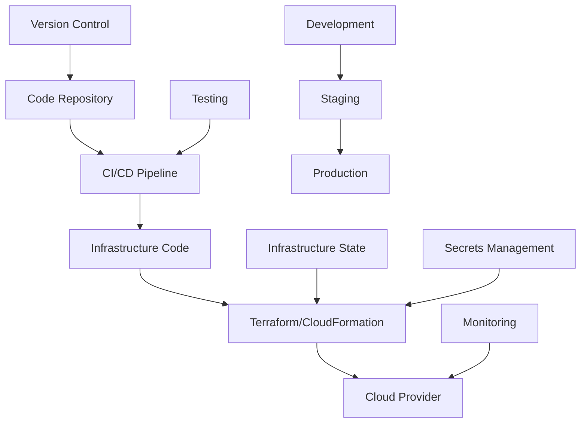

# Infrastructure as Code - Automated Infrastructure Management

## Overview

Infrastructure as Code (IaC) is the practice of managing and provisioning infrastructure through machine-readable definition files, rather than through physical hardware configuration or interactive configuration tools. It enables version control, consistency, and automation of infrastructure.

## Key Concepts

- **Declarative Configuration**: Define desired state, not steps to achieve it
- **Idempotency**: Running the same configuration multiple times produces the same result
- **Version Control**: Track changes to infrastructure configurations
- **Automation**: Automate infrastructure provisioning and management
- **Consistency**: Ensure consistent environments across different stages

## Infrastructure as Code Tools

### 1. Terraform
- HashiCorp's infrastructure provisioning tool
- Supports multiple cloud providers
- Declarative configuration language
- State management and planning

### 2. AWS CloudFormation
- AWS-native infrastructure provisioning
- JSON/YAML templates
- Stack-based management
- Integrated with AWS services

### 3. Ansible
- Configuration management and automation
- Agentless architecture
- YAML-based playbooks
- Idempotent operations

### 4. Kubernetes
- Container orchestration platform
- Declarative API
- YAML/JSON manifests
- Self-healing capabilities

## Infrastructure as Code Architecture



## Go Implementation - Infrastructure Manager

```go
package main

import (
    "context"
    "encoding/json"
    "fmt"
    "log"
    "os"
    "path/filepath"
    "time"
    
    "github.com/hashicorp/terraform-exec/tfexec"
    "gopkg.in/yaml.v2"
)

// InfrastructureConfig represents infrastructure configuration
type InfrastructureConfig struct {
    Name        string                 `yaml:"name"`
    Environment string                 `yaml:"environment"`
    Provider    string                 `yaml:"provider"`
    Resources   []ResourceConfig       `yaml:"resources"`
    Variables   map[string]interface{} `yaml:"variables"`
    Outputs     map[string]interface{} `yaml:"outputs"`
}

// ResourceConfig represents a resource configuration
type ResourceConfig struct {
    Type       string                 `yaml:"type"`
    Name       string                 `yaml:"name"`
    Properties map[string]interface{} `yaml:"properties"`
    Dependencies []string             `yaml:"dependencies"`
}

// InfrastructureManager manages infrastructure
type InfrastructureManager struct {
    config     *InfrastructureConfig
    workingDir string
    tf         *tfexec.Terraform
}

// NewInfrastructureManager creates a new infrastructure manager
func NewInfrastructureManager(configPath string) (*InfrastructureManager, error) {
    // Read configuration
    config, err := loadConfig(configPath)
    if err != nil {
        return nil, fmt.Errorf("failed to load config: %v", err)
    }
    
    // Create working directory
    workingDir := filepath.Join("/tmp", config.Name, config.Environment)
    if err := os.MkdirAll(workingDir, 0755); err != nil {
        return nil, fmt.Errorf("failed to create working directory: %v", err)
    }
    
    // Initialize Terraform
    tf, err := tfexec.NewTerraform(workingDir, "terraform")
    if err != nil {
        return nil, fmt.Errorf("failed to create terraform instance: %v", err)
    }
    
    return &InfrastructureManager{
        config:     config,
        workingDir: workingDir,
        tf:         tf,
    }, nil
}

// loadConfig loads configuration from file
func loadConfig(configPath string) (*InfrastructureConfig, error) {
    data, err := os.ReadFile(configPath)
    if err != nil {
        return nil, err
    }
    
    var config InfrastructureConfig
    if err := yaml.Unmarshal(data, &config); err != nil {
        return nil, err
    }
    
    return &config, nil
}

// GenerateTerraform generates Terraform configuration
func (im *InfrastructureManager) GenerateTerraform() error {
    // Generate main.tf
    if err := im.generateMainTf(); err != nil {
        return fmt.Errorf("failed to generate main.tf: %v", err)
    }
    
    // Generate variables.tf
    if err := im.generateVariablesTf(); err != nil {
        return fmt.Errorf("failed to generate variables.tf: %v", err)
    }
    
    // Generate outputs.tf
    if err := im.generateOutputsTf(); err != nil {
        return fmt.Errorf("failed to generate outputs.tf: %v", err)
    }
    
    // Generate terraform.tfvars
    if err := im.generateTfvars(); err != nil {
        return fmt.Errorf("failed to generate terraform.tfvars: %v", err)
    }
    
    return nil
}

// generateMainTf generates main.tf file
func (im *InfrastructureManager) generateMainTf() error {
    content := fmt.Sprintf(`
terraform {
  required_version = ">= 1.0"
  required_providers {
    aws = {
      source  = "hashicorp/aws"
      version = "~> 5.0"
    }
  }
}

provider "aws" {
  region = var.aws_region
}

%s
`, im.generateResources())
    
    return os.WriteFile(filepath.Join(im.workingDir, "main.tf"), []byte(content), 0644)
}

// generateResources generates resource configurations
func (im *InfrastructureManager) generateResources() string {
    var resources string
    
    for _, resource := range im.config.Resources {
        resources += fmt.Sprintf(`
resource "%s" "%s" {
%s
}
`, resource.Type, resource.Name, im.generateResourceProperties(resource))
    }
    
    return resources
}

// generateResourceProperties generates resource properties
func (im *InfrastructureManager) generateResourceProperties(resource ResourceConfig) string {
    var properties string
    
    for key, value := range resource.Properties {
        switch v := value.(type) {
        case string:
            properties += fmt.Sprintf("  %s = %q\n", key, v)
        case int, float64:
            properties += fmt.Sprintf("  %s = %v\n", key, v)
        case bool:
            properties += fmt.Sprintf("  %s = %t\n", key, v)
        case []interface{}:
            properties += fmt.Sprintf("  %s = %s\n", key, im.generateArray(v))
        case map[string]interface{}:
            properties += fmt.Sprintf("  %s = %s\n", key, im.generateMap(v))
        default:
            properties += fmt.Sprintf("  %s = %q\n", key, fmt.Sprintf("%v", v))
        }
    }
    
    return properties
}

// generateArray generates array representation
func (im *InfrastructureManager) generateArray(arr []interface{}) string {
    var result string
    for i, item := range arr {
        if i > 0 {
            result += ", "
        }
        switch v := item.(type) {
        case string:
            result += fmt.Sprintf("%q", v)
        case int, float64:
            result += fmt.Sprintf("%v", v)
        case bool:
            result += fmt.Sprintf("%t", v)
        default:
            result += fmt.Sprintf("%q", fmt.Sprintf("%v", v))
        }
    }
    return "[" + result + "]"
}

// generateMap generates map representation
func (im *InfrastructureManager) generateMap(m map[string]interface{}) string {
    var result string
    first := true
    for key, value := range m {
        if !first {
            result += ", "
        }
        first = false
        
        switch v := value.(type) {
        case string:
            result += fmt.Sprintf("%s = %q", key, v)
        case int, float64:
            result += fmt.Sprintf("%s = %v", key, v)
        case bool:
            result += fmt.Sprintf("%s = %t", key, v)
        default:
            result += fmt.Sprintf("%s = %q", key, fmt.Sprintf("%v", v))
        }
    }
    return "{" + result + "}"
}

// generateVariablesTf generates variables.tf file
func (im *InfrastructureManager) generateVariablesTf() error {
    content := `
variable "aws_region" {
  description = "AWS region"
  type        = string
  default     = "us-west-2"
}

variable "environment" {
  description = "Environment name"
  type        = string
}

variable "project_name" {
  description = "Project name"
  type        = string
}
`
    
    return os.WriteFile(filepath.Join(im.workingDir, "variables.tf"), []byte(content), 0644)
}

// generateOutputsTf generates outputs.tf file
func (im *InfrastructureManager) generateOutputsTf() error {
    var content string
    
    for name, value := range im.config.Outputs {
        content += fmt.Sprintf(`
output "%s" {
  description = "%s"
  value       = %s
}
`, name, name, im.generateOutputValue(value))
    }
    
    return os.WriteFile(filepath.Join(im.workingDir, "outputs.tf"), []byte(content), 0644)
}

// generateOutputValue generates output value
func (im *InfrastructureManager) generateOutputValue(value interface{}) string {
    switch v := value.(type) {
    case string:
        return fmt.Sprintf("%q", v)
    case int, float64:
        return fmt.Sprintf("%v", v)
    case bool:
        return fmt.Sprintf("%t", v)
    default:
        return fmt.Sprintf("%q", fmt.Sprintf("%v", v))
    }
}

// generateTfvars generates terraform.tfvars file
func (im *InfrastructureManager) generateTfvars() error {
    content := fmt.Sprintf(`
aws_region   = "us-west-2"
environment  = "%s"
project_name = "%s"
`, im.config.Environment, im.config.Name)
    
    return os.WriteFile(filepath.Join(im.workingDir, "terraform.tfvars"), []byte(content), 0644)
}

// Plan creates a Terraform plan
func (im *InfrastructureManager) Plan() error {
    // Initialize Terraform
    if err := im.tf.Init(context.Background()); err != nil {
        return fmt.Errorf("failed to initialize terraform: %v", err)
    }
    
    // Create plan
    plan, err := im.tf.Plan(context.Background())
    if err != nil {
        return fmt.Errorf("failed to create plan: %v", err)
    }
    
    log.Printf("Terraform plan created: %s", plan)
    return nil
}

// Apply applies the Terraform configuration
func (im *InfrastructureManager) Apply() error {
    // Initialize Terraform
    if err := im.tf.Init(context.Background()); err != nil {
        return fmt.Errorf("failed to initialize terraform: %v", err)
    }
    
    // Apply configuration
    if err := im.tf.Apply(context.Background()); err != nil {
        return fmt.Errorf("failed to apply configuration: %v", err)
    }
    
    log.Printf("Infrastructure applied successfully")
    return nil
}

// Destroy destroys the infrastructure
func (im *InfrastructureManager) Destroy() error {
    // Initialize Terraform
    if err := im.tf.Init(context.Background()); err != nil {
        return fmt.Errorf("failed to initialize terraform: %v", err)
    }
    
    // Destroy infrastructure
    if err := im.tf.Destroy(context.Background()); err != nil {
        return fmt.Errorf("failed to destroy infrastructure: %v", err)
    }
    
    log.Printf("Infrastructure destroyed successfully")
    return nil
}

// GetState returns the current state
func (im *InfrastructureManager) GetState() (map[string]interface{}, error) {
    // Initialize Terraform
    if err := im.tf.Init(context.Background()); err != nil {
        return nil, fmt.Errorf("failed to initialize terraform: %v", err)
    }
    
    // Show state
    state, err := im.tf.Show(context.Background())
    if err != nil {
        return nil, fmt.Errorf("failed to get state: %v", err)
    }
    
    var stateMap map[string]interface{}
    if err := json.Unmarshal(state, &stateMap); err != nil {
        return nil, fmt.Errorf("failed to unmarshal state: %v", err)
    }
    
    return stateMap, nil
}

// Validate validates the configuration
func (im *InfrastructureManager) Validate() error {
    // Initialize Terraform
    if err := im.tf.Init(context.Background()); err != nil {
        return fmt.Errorf("failed to initialize terraform: %v", err)
    }
    
    // Validate configuration
    if err := im.tf.Validate(context.Background()); err != nil {
        return fmt.Errorf("configuration validation failed: %v", err)
    }
    
    log.Printf("Configuration is valid")
    return nil
}

// GetOutputs returns the outputs
func (im *InfrastructureManager) GetOutputs() (map[string]interface{}, error) {
    // Initialize Terraform
    if err := im.tf.Init(context.Background()); err != nil {
        return nil, fmt.Errorf("failed to initialize terraform: %v", err)
    }
    
    // Get outputs
    outputs, err := im.tf.Output(context.Background())
    if err != nil {
        return nil, fmt.Errorf("failed to get outputs: %v", err)
    }
    
    return outputs, nil
}

// Example usage
func main() {
    // Create sample configuration
    config := &InfrastructureConfig{
        Name:        "my-app",
        Environment: "dev",
        Provider:    "aws",
        Resources: []ResourceConfig{
            {
                Type: "aws_instance",
                Name: "web_server",
                Properties: map[string]interface{}{
                    "ami":           "ami-0c55b159cbfafe1d0",
                    "instance_type": "t2.micro",
                    "tags": map[string]interface{}{
                        "Name": "web-server",
                        "Environment": "dev",
                    },
                },
            },
            {
                Type: "aws_security_group",
                Name: "web_sg",
                Properties: map[string]interface{}{
                    "name": "web-security-group",
                    "ingress": []map[string]interface{}{
                        {
                            "from_port":   80,
                            "to_port":     80,
                            "protocol":    "tcp",
                            "cidr_blocks": []string{"0.0.0.0/0"},
                        },
                    },
                },
            },
        },
        Variables: map[string]interface{}{
            "aws_region": "us-west-2",
        },
        Outputs: map[string]interface{}{
            "instance_id": "aws_instance.web_server.id",
            "public_ip":   "aws_instance.web_server.public_ip",
        },
    }
    
    // Save configuration to file
    configData, err := yaml.Marshal(config)
    if err != nil {
        log.Fatalf("Failed to marshal config: %v", err)
    }
    
    configPath := "/tmp/infrastructure.yaml"
    if err := os.WriteFile(configPath, configData, 0644); err != nil {
        log.Fatalf("Failed to write config: %v", err)
    }
    
    // Create infrastructure manager
    im, err := NewInfrastructureManager(configPath)
    if err != nil {
        log.Fatalf("Failed to create infrastructure manager: %v", err)
    }
    
    // Generate Terraform configuration
    if err := im.GenerateTerraform(); err != nil {
        log.Fatalf("Failed to generate terraform: %v", err)
    }
    
    // Validate configuration
    if err := im.Validate(); err != nil {
        log.Fatalf("Validation failed: %v", err)
    }
    
    // Create plan
    if err := im.Plan(); err != nil {
        log.Fatalf("Failed to create plan: %v", err)
    }
    
    // Apply configuration (commented out for safety)
    // if err := im.Apply(); err != nil {
    //     log.Fatalf("Failed to apply: %v", err)
    // }
    
    // Get state
    state, err := im.GetState()
    if err != nil {
        log.Printf("Failed to get state: %v", err)
    } else {
        log.Printf("Current state: %+v", state)
    }
    
    // Get outputs
    outputs, err := im.GetOutputs()
    if err != nil {
        log.Printf("Failed to get outputs: %v", err)
    } else {
        log.Printf("Outputs: %+v", outputs)
    }
}
```

## Node.js Implementation

```javascript
const fs = require('fs');
const path = require('path');
const { execSync } = require('child_process');
const yaml = require('js-yaml');

class InfrastructureManager {
  constructor(configPath) {
    this.config = this.loadConfig(configPath);
    this.workingDir = path.join('/tmp', this.config.name, this.config.environment);
    this.ensureWorkingDir();
  }

  loadConfig(configPath) {
    const data = fs.readFileSync(configPath, 'utf8');
    return yaml.load(data);
  }

  ensureWorkingDir() {
    if (!fs.existsSync(this.workingDir)) {
      fs.mkdirSync(this.workingDir, { recursive: true });
    }
  }

  generateTerraform() {
    this.generateMainTf();
    this.generateVariablesTf();
    this.generateOutputsTf();
    this.generateTfvars();
  }

  generateMainTf() {
    const content = `
terraform {
  required_version = ">= 1.0"
  required_providers {
    aws = {
      source  = "hashicorp/aws"
      version = "~> 5.0"
    }
  }
}

provider "aws" {
  region = var.aws_region
}

${this.generateResources()}
`;
    
    fs.writeFileSync(path.join(this.workingDir, 'main.tf'), content);
  }

  generateResources() {
    let resources = '';
    
    for (const resource of this.config.resources) {
      resources += `
resource "${resource.type}" "${resource.name}" {
${this.generateResourceProperties(resource)}
}
`;
    }
    
    return resources;
  }

  generateResourceProperties(resource) {
    let properties = '';
    
    for (const [key, value] of Object.entries(resource.properties)) {
      if (typeof value === 'string') {
        properties += `  ${key} = "${value}"\n`;
      } else if (typeof value === 'number' || typeof value === 'boolean') {
        properties += `  ${key} = ${value}\n`;
      } else if (Array.isArray(value)) {
        properties += `  ${key} = ${this.generateArray(value)}\n`;
      } else if (typeof value === 'object' && value !== null) {
        properties += `  ${key} = ${this.generateMap(value)}\n`;
      } else {
        properties += `  ${key} = "${String(value)}"\n`;
      }
    }
    
    return properties;
  }

  generateArray(arr) {
    const items = arr.map(item => {
      if (typeof item === 'string') {
        return `"${item}"`;
      } else if (typeof item === 'number' || typeof item === 'boolean') {
        return String(item);
      } else if (typeof item === 'object' && item !== null) {
        return this.generateMap(item);
      } else {
        return `"${String(item)}"`;
      }
    });
    
    return `[${items.join(', ')}]`;
  }

  generateMap(obj) {
    const pairs = Object.entries(obj).map(([key, value]) => {
      if (typeof value === 'string') {
        return `${key} = "${value}"`;
      } else if (typeof value === 'number' || typeof value === 'boolean') {
        return `${key} = ${value}`;
      } else if (Array.isArray(value)) {
        return `${key} = ${this.generateArray(value)}`;
      } else if (typeof value === 'object' && value !== null) {
        return `${key} = ${this.generateMap(value)}`;
      } else {
        return `${key} = "${String(value)}"`;
      }
    });
    
    return `{${pairs.join(', ')}}`;
  }

  generateVariablesTf() {
    const content = `
variable "aws_region" {
  description = "AWS region"
  type        = string
  default     = "us-west-2"
}

variable "environment" {
  description = "Environment name"
  type        = string
}

variable "project_name" {
  description = "Project name"
  type        = string
}
`;
    
    fs.writeFileSync(path.join(this.workingDir, 'variables.tf'), content);
  }

  generateOutputsTf() {
    let content = '';
    
    for (const [name, value] of Object.entries(this.config.outputs)) {
      content += `
output "${name}" {
  description = "${name}"
  value       = ${this.generateOutputValue(value)}
}
`;
    }
    
    fs.writeFileSync(path.join(this.workingDir, 'outputs.tf'), content);
  }

  generateOutputValue(value) {
    if (typeof value === 'string') {
      return `"${value}"`;
    } else if (typeof value === 'number' || typeof value === 'boolean') {
      return String(value);
    } else {
      return `"${String(value)}"`;
    }
  }

  generateTfvars() {
    const content = `
aws_region   = "us-west-2"
environment  = "${this.config.environment}"
project_name = "${this.config.name}"
`;
    
    fs.writeFileSync(path.join(this.workingDir, 'terraform.tfvars'), content);
  }

  async plan() {
    try {
      // Initialize Terraform
      execSync('terraform init', { cwd: this.workingDir, stdio: 'inherit' });
      
      // Create plan
      execSync('terraform plan', { cwd: this.workingDir, stdio: 'inherit' });
      
      console.log('Terraform plan created successfully');
    } catch (error) {
      throw new Error(`Failed to create plan: ${error.message}`);
    }
  }

  async apply() {
    try {
      // Initialize Terraform
      execSync('terraform init', { cwd: this.workingDir, stdio: 'inherit' });
      
      // Apply configuration
      execSync('terraform apply -auto-approve', { cwd: this.workingDir, stdio: 'inherit' });
      
      console.log('Infrastructure applied successfully');
    } catch (error) {
      throw new Error(`Failed to apply: ${error.message}`);
    }
  }

  async destroy() {
    try {
      // Initialize Terraform
      execSync('terraform init', { cwd: this.workingDir, stdio: 'inherit' });
      
      // Destroy infrastructure
      execSync('terraform destroy -auto-approve', { cwd: this.workingDir, stdio: 'inherit' });
      
      console.log('Infrastructure destroyed successfully');
    } catch (error) {
      throw new Error(`Failed to destroy: ${error.message}`);
    }
  }

  async getState() {
    try {
      // Initialize Terraform
      execSync('terraform init', { cwd: this.workingDir, stdio: 'inherit' });
      
      // Show state
      const state = execSync('terraform show -json', { cwd: this.workingDir, encoding: 'utf8' });
      
      return JSON.parse(state);
    } catch (error) {
      throw new Error(`Failed to get state: ${error.message}`);
    }
  }

  async validate() {
    try {
      // Initialize Terraform
      execSync('terraform init', { cwd: this.workingDir, stdio: 'inherit' });
      
      // Validate configuration
      execSync('terraform validate', { cwd: this.workingDir, stdio: 'inherit' });
      
      console.log('Configuration is valid');
    } catch (error) {
      throw new Error(`Configuration validation failed: ${error.message}`);
    }
  }

  async getOutputs() {
    try {
      // Initialize Terraform
      execSync('terraform init', { cwd: this.workingDir, stdio: 'inherit' });
      
      // Get outputs
      const outputs = execSync('terraform output -json', { cwd: this.workingDir, encoding: 'utf8' });
      
      return JSON.parse(outputs);
    } catch (error) {
      throw new Error(`Failed to get outputs: ${error.message}`);
    }
  }
}

// Example usage
async function main() {
  // Create sample configuration
  const config = {
    name: 'my-app',
    environment: 'dev',
    provider: 'aws',
    resources: [
      {
        type: 'aws_instance',
        name: 'web_server',
        properties: {
          ami: 'ami-0c55b159cbfafe1d0',
          instance_type: 't2.micro',
          tags: {
            Name: 'web-server',
            Environment: 'dev',
          },
        },
      },
      {
        type: 'aws_security_group',
        name: 'web_sg',
        properties: {
          name: 'web-security-group',
          ingress: [
            {
              from_port: 80,
              to_port: 80,
              protocol: 'tcp',
              cidr_blocks: ['0.0.0.0/0'],
            },
          ],
        },
      },
    ],
    variables: {
      aws_region: 'us-west-2',
    },
    outputs: {
      instance_id: 'aws_instance.web_server.id',
      public_ip: 'aws_instance.web_server.public_ip',
    },
  };
  
  // Save configuration to file
  const configPath = '/tmp/infrastructure.yaml';
  fs.writeFileSync(configPath, yaml.dump(config));
  
  // Create infrastructure manager
  const im = new InfrastructureManager(configPath);
  
  // Generate Terraform configuration
  im.generateTerraform();
  
  // Validate configuration
  await im.validate();
  
  // Create plan
  await im.plan();
  
  // Apply configuration (commented out for safety)
  // await im.apply();
  
  // Get state
  try {
    const state = await im.getState();
    console.log('Current state:', state);
  } catch (error) {
    console.log('Failed to get state:', error.message);
  }
  
  // Get outputs
  try {
    const outputs = await im.getOutputs();
    console.log('Outputs:', outputs);
  } catch (error) {
    console.log('Failed to get outputs:', error.message);
  }
}

if (require.main === module) {
  main().catch(console.error);
}
```

## Benefits

1. **Version Control**: Track changes to infrastructure
2. **Consistency**: Ensure consistent environments
3. **Automation**: Automate infrastructure provisioning
4. **Reproducibility**: Recreate environments easily
5. **Collaboration**: Team collaboration on infrastructure

## Trade-offs

1. **Learning Curve**: Requires learning new tools and concepts
2. **Complexity**: More complex than manual provisioning
3. **State Management**: Requires careful state management
4. **Tool Dependencies**: Depends on specific tools

## Use Cases

- **Cloud Infrastructure**: Provision cloud resources
- **Development Environments**: Consistent dev environments
- **CI/CD Pipelines**: Automated infrastructure deployment
- **Disaster Recovery**: Quick infrastructure recovery

## Best Practices

1. **Version Control**: Use Git for infrastructure code
2. **Modularity**: Break down into modules
3. **Testing**: Test infrastructure code
4. **Documentation**: Document infrastructure decisions
5. **Security**: Secure infrastructure configurations

## Common Pitfalls

1. **State Drift**: Infrastructure changes outside of code
2. **Hardcoded Values**: Avoid hardcoded values
3. **Poor Naming**: Use consistent naming conventions
4. **Missing Dependencies**: Handle resource dependencies

## Interview Questions

1. **What's the difference between declarative and imperative approaches?**
   - Declarative defines desired state, imperative defines steps

2. **How do you handle state management in IaC?**
   - Use state files, remote state storage, and state locking

3. **What are the benefits of Infrastructure as Code?**
   - Version control, consistency, automation, reproducibility

4. **How do you test infrastructure code?**
   - Use unit tests, integration tests, and validation tools

## Time Complexity

- **Configuration Generation**: O(n) where n is number of resources
- **Plan Creation**: O(n) where n is number of resources
- **Apply/Destroy**: O(n) where n is number of resources

## Space Complexity

- **Configuration Storage**: O(n) where n is number of resources
- **State Storage**: O(n) where n is number of resources
- **Working Directory**: O(n) where n is number of files

The optimal solution uses:
1. **Modular Design**: Break down into reusable modules
2. **State Management**: Use remote state storage
3. **Testing**: Implement comprehensive testing
4. **Documentation**: Maintain clear documentation
