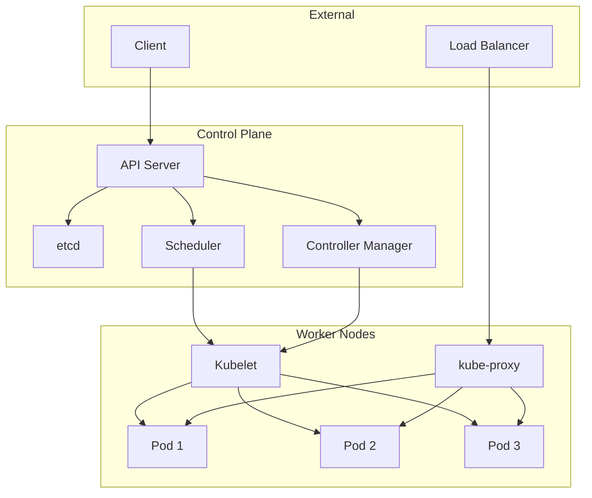
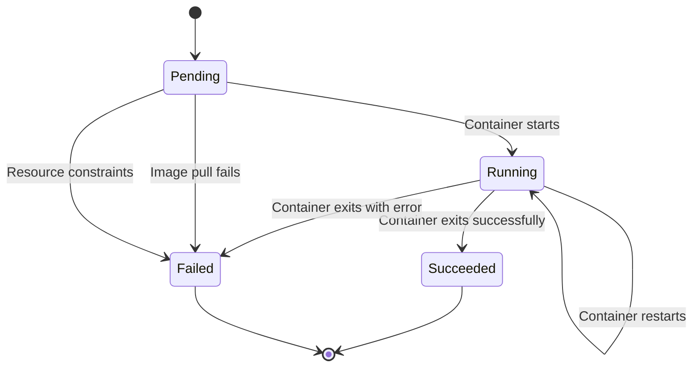
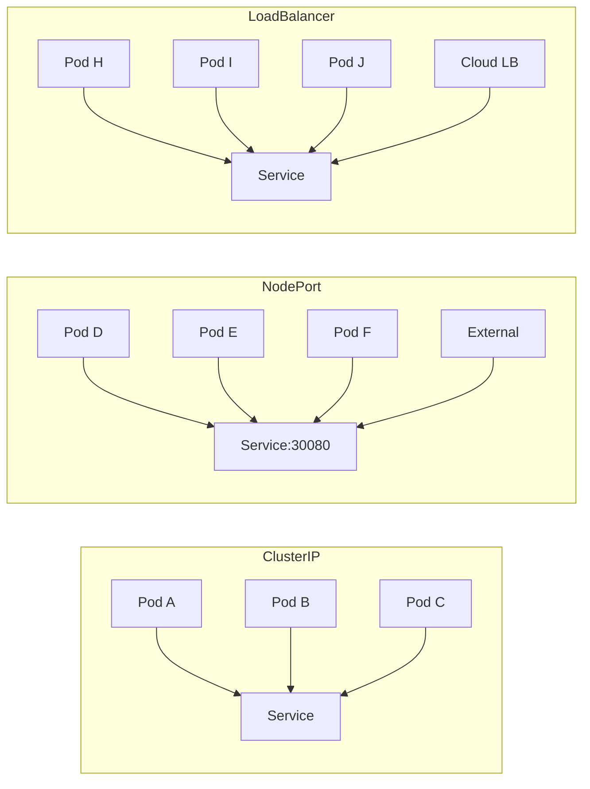

---
# Auto-generated front matter
Title: Kubernetes
LastUpdated: 2025-11-06T20:45:59.125225
Tags: []
Status: draft
---

# ☸️ **Kubernetes**

## 📘 **Theory**

Kubernetes (K8s) is an open-source container orchestration platform that automates the deployment, scaling, and management of containerized applications. It provides a robust framework for running distributed systems resiliently, handling failures, and scaling applications based on demand.

### **Why Kubernetes Matters**

- **Container Orchestration**: Manages containerized applications across clusters
- **Auto-scaling**: Automatically scales applications based on resource usage
- **Service Discovery**: Provides built-in service discovery and load balancing
- **Rolling Updates**: Enables zero-downtime deployments
- **Resource Management**: Efficiently manages compute resources across nodes
- **Fault Tolerance**: Automatically restarts failed containers and replaces unhealthy nodes

### **Key Concepts**

1. **Pods**: Smallest deployable units that can contain one or more containers
2. **Services**: Stable network endpoints for accessing pods
3. **Deployments**: Manages replica sets and rolling updates
4. **ConfigMaps**: Store configuration data separately from application code
5. **Secrets**: Store sensitive data like passwords and API keys
6. **Namespaces**: Virtual clusters within a physical cluster
7. **Nodes**: Worker machines that run pods
8. **Control Plane**: Manages the cluster and makes decisions about placement

### **Common Pitfalls and Best Practices**

- **Resource Limits**: Always set CPU and memory limits for containers
- **Health Checks**: Implement proper liveness and readiness probes
- **Security**: Use RBAC, network policies, and pod security policies
- **Monitoring**: Implement comprehensive logging and monitoring
- **Backup**: Regular backup of etcd and persistent volumes
- **Updates**: Use rolling updates for zero-downtime deployments

## 📊 **Diagrams**

### **Kubernetes Architecture**



### **Pod Lifecycle**



### **Service Types**



## 🧩 **Example**

**Scenario**: Deploy a web application with a database backend using Kubernetes

**Input**: Web application container image and database configuration
**Expected Output**: Running web application accessible via load balancer

**Step-by-step**:

1. Create namespace for the application
2. Deploy database with persistent volume
3. Deploy web application with environment variables
4. Create service for database (ClusterIP)
5. Create service for web application (LoadBalancer)
6. Configure ingress for external access
7. Set up monitoring and logging

## 💻 **Implementation (Golang)**

```go
package main

import (
    "context"
    "fmt"
    "log"
    "time"

    "k8s.io/api/apps/v1"
    "k8s.io/api/core/v1"
    metav1 "k8s.io/apimachinery/pkg/apis/meta/v1"
    "k8s.io/apimachinery/pkg/util/intstr"
    "k8s.io/client-go/kubernetes"
    "k8s.io/client-go/rest"
    "k8s.io/client-go/tools/clientcmd"
)

// Kubernetes client wrapper
type K8sClient struct {
    clientset *kubernetes.Clientset
    namespace string
}

func NewK8sClient(kubeconfig string, namespace string) (*K8sClient, error) {
    var config *rest.Config
    var err error

    if kubeconfig == "" {
        // In-cluster config
        config, err = rest.InClusterConfig()
    } else {
        // Out-of-cluster config
        config, err = clientcmd.BuildConfigFromFlags("", kubeconfig)
    }

    if err != nil {
        return nil, err
    }

    clientset, err := kubernetes.NewForConfig(config)
    if err != nil {
        return nil, err
    }

    return &K8sClient{
        clientset: clientset,
        namespace: namespace,
    }, nil
}

// Create namespace
func (k *K8sClient) CreateNamespace(name string) error {
    namespace := &v1.Namespace{
        ObjectMeta: metav1.ObjectMeta{
            Name: name,
        },
    }

    _, err := k.clientset.CoreV1().Namespaces().Create(context.TODO(), namespace, metav1.CreateOptions{})
    return err
}

// Create deployment
func (k *K8sClient) CreateDeployment(name, image string, replicas int32, envVars map[string]string) error {
    // Convert env vars to Kubernetes format
    var env []v1.EnvVar
    for key, value := range envVars {
        env = append(env, v1.EnvVar{
            Name:  key,
            Value: value,
        })
    }

    deployment := &v1.Deployment{
        ObjectMeta: metav1.ObjectMeta{
            Name:      name,
            Namespace: k.namespace,
        },
        Spec: v1.DeploymentSpec{
            Replicas: &replicas,
            Selector: &metav1.LabelSelector{
                MatchLabels: map[string]string{
                    "app": name,
                },
            },
            Template: v1.PodTemplateSpec{
                ObjectMeta: metav1.ObjectMeta{
                    Labels: map[string]string{
                        "app": name,
                    },
                },
                Spec: v1.PodSpec{
                    Containers: []v1.Container{
                        {
                            Name:  name,
                            Image: image,
                            Ports: []v1.ContainerPort{
                                {
                                    ContainerPort: 8080,
                                },
                            },
                            Env: env,
                            Resources: v1.ResourceRequirements{
                                Requests: v1.ResourceList{
                                    "cpu":    resource.MustParse("100m"),
                                    "memory": resource.MustParse("128Mi"),
                                },
                                Limits: v1.ResourceList{
                                    "cpu":    resource.MustParse("500m"),
                                    "memory": resource.MustParse("512Mi"),
                                },
                            },
                            LivenessProbe: &v1.Probe{
                                HTTPGet: &v1.HTTPGetAction{
                                    Path: "/health",
                                    Port: intstr.FromInt(8080),
                                },
                                InitialDelaySeconds: 30,
                                PeriodSeconds:       10,
                            },
                            ReadinessProbe: &v1.Probe{
                                HTTPGet: &v1.HTTPGetAction{
                                    Path: "/ready",
                                    Port: intstr.FromInt(8080),
                                },
                                InitialDelaySeconds: 5,
                                PeriodSeconds:       5,
                            },
                        },
                    },
                },
            },
        },
    }

    _, err := k.clientset.AppsV1().Deployments(k.namespace).Create(context.TODO(), deployment, metav1.CreateOptions{})
    return err
}

// Create service
func (k *K8sClient) CreateService(name string, serviceType v1.ServiceType, port int32) error {
    service := &v1.Service{
        ObjectMeta: metav1.ObjectMeta{
            Name:      name,
            Namespace: k.namespace,
        },
        Spec: v1.ServiceSpec{
            Selector: map[string]string{
                "app": name,
            },
            Ports: []v1.ServicePort{
                {
                    Port:       port,
                    TargetPort: intstr.FromInt(8080),
                    Protocol:   v1.ProtocolTCP,
                },
            },
            Type: serviceType,
        },
    }

    _, err := k.clientset.CoreV1().Services(k.namespace).Create(context.TODO(), service, metav1.CreateOptions{})
    return err
}

// Create config map
func (k *K8sClient) CreateConfigMap(name string, data map[string]string) error {
    configMap := &v1.ConfigMap{
        ObjectMeta: metav1.ObjectMeta{
            Name:      name,
            Namespace: k.namespace,
        },
        Data: data,
    }

    _, err := k.clientset.CoreV1().ConfigMaps(k.namespace).Create(context.TODO(), configMap, metav1.CreateOptions{})
    return err
}

// Create secret
func (k *K8sClient) CreateSecret(name string, data map[string][]byte) error {
    secret := &v1.Secret{
        ObjectMeta: metav1.ObjectMeta{
            Name:      name,
            Namespace: k.namespace,
        },
        Data: data,
    }

    _, err := k.clientset.CoreV1().Secrets(k.namespace).Create(context.TODO(), secret, metav1.CreateOptions{})
    return err
}

// Create persistent volume claim
func (k *K8sClient) CreatePVC(name string, size string) error {
    pvc := &v1.PersistentVolumeClaim{
        ObjectMeta: metav1.ObjectMeta{
            Name:      name,
            Namespace: k.namespace,
        },
        Spec: v1.PersistentVolumeClaimSpec{
            AccessModes: []v1.PersistentVolumeAccessMode{
                v1.ReadWriteOnce,
            },
            Resources: v1.ResourceRequirements{
                Requests: v1.ResourceList{
                    "storage": resource.MustParse(size),
                },
            },
        },
    }

    _, err := k.clientset.CoreV1().PersistentVolumeClaims(k.namespace).Create(context.TODO(), pvc, metav1.CreateOptions{})
    return err
}

// Scale deployment
func (k *K8sClient) ScaleDeployment(name string, replicas int32) error {
    deployment, err := k.clientset.AppsV1().Deployments(k.namespace).Get(context.TODO(), name, metav1.GetOptions{})
    if err != nil {
        return err
    }

    deployment.Spec.Replicas = &replicas
    _, err = k.clientset.AppsV1().Deployments(k.namespace).Update(context.TODO(), deployment, metav1.UpdateOptions{})
    return err
}

// Get pod status
func (k *K8sClient) GetPodStatus(labelSelector string) ([]v1.Pod, error) {
    pods, err := k.clientset.CoreV1().Pods(k.namespace).List(context.TODO(), metav1.ListOptions{
        LabelSelector: labelSelector,
    })
    if err != nil {
        return nil, err
    }

    return pods.Items, nil
}

// Wait for deployment to be ready
func (k *K8sClient) WaitForDeployment(name string, timeout time.Duration) error {
    for start := time.Now(); time.Since(start) < timeout; time.Sleep(5 * time.Second) {
        deployment, err := k.clientset.AppsV1().Deployments(k.namespace).Get(context.TODO(), name, metav1.GetOptions{})
        if err != nil {
            continue
        }

        if deployment.Status.ReadyReplicas == *deployment.Spec.Replicas {
            return nil
        }
    }

    return fmt.Errorf("deployment %s not ready within timeout", name)
}

// Delete deployment
func (k *K8sClient) DeleteDeployment(name string) error {
    return k.clientset.AppsV1().Deployments(k.namespace).Delete(context.TODO(), name, metav1.DeleteOptions{})
}

// Delete service
func (k *K8sClient) DeleteService(name string) error {
    return k.clientset.CoreV1().Services(k.namespace).Delete(context.TODO(), name, metav1.DeleteOptions{})
}

// Delete namespace
func (k *K8sClient) DeleteNamespace(name string) error {
    return k.clientset.CoreV1().Namespaces().Delete(context.TODO(), name, metav1.DeleteOptions{})
}

// Example usage
func main() {
    // Initialize Kubernetes client
    client, err := NewK8sClient("", "webapp")
    if err != nil {
        log.Fatal("Failed to create Kubernetes client:", err)
    }

    // Create namespace
    err = client.CreateNamespace("webapp")
    if err != nil {
        log.Printf("Failed to create namespace: %v", err)
    }

    // Create config map
    configData := map[string]string{
        "DATABASE_HOST": "postgres-service",
        "DATABASE_PORT": "5432",
        "DATABASE_NAME": "webapp",
    }
    err = client.CreateConfigMap("webapp-config", configData)
    if err != nil {
        log.Printf("Failed to create config map: %v", err)
    }

    // Create secret
    secretData := map[string][]byte{
        "DATABASE_PASSWORD": []byte("secretpassword"),
        "API_KEY":           []byte("secretapikey"),
    }
    err = client.CreateSecret("webapp-secrets", secretData)
    if err != nil {
        log.Printf("Failed to create secret: %v", err)
    }

    // Create persistent volume claim for database
    err = client.CreatePVC("postgres-pvc", "10Gi")
    if err != nil {
        log.Printf("Failed to create PVC: %v", err)
    }

    // Create database deployment
    dbEnvVars := map[string]string{
        "POSTGRES_DB":       "webapp",
        "POSTGRES_USER":     "postgres",
        "POSTGRES_PASSWORD": "secretpassword",
    }
    err = client.CreateDeployment("postgres", "postgres:13", 1, dbEnvVars)
    if err != nil {
        log.Printf("Failed to create database deployment: %v", err)
    }

    // Create database service
    err = client.CreateService("postgres-service", v1.ServiceTypeClusterIP, 5432)
    if err != nil {
        log.Printf("Failed to create database service: %v", err)
    }

    // Create web application deployment
    webappEnvVars := map[string]string{
        "DATABASE_HOST":     "postgres-service",
        "DATABASE_PORT":     "5432",
        "DATABASE_NAME":     "webapp",
        "DATABASE_USER":     "postgres",
        "DATABASE_PASSWORD": "secretpassword",
    }
    err = client.CreateDeployment("webapp", "webapp:latest", 3, webappEnvVars)
    if err != nil {
        log.Printf("Failed to create webapp deployment: %v", err)
    }

    // Create web application service
    err = client.CreateService("webapp-service", v1.ServiceTypeLoadBalancer, 80)
    if err != nil {
        log.Printf("Failed to create webapp service: %v", err)
    }

    // Wait for deployments to be ready
    err = client.WaitForDeployment("postgres", 5*time.Minute)
    if err != nil {
        log.Printf("Database deployment not ready: %v", err)
    }

    err = client.WaitForDeployment("webapp", 5*time.Minute)
    if err != nil {
        log.Printf("Webapp deployment not ready: %v", err)
    }

    // Get pod status
    pods, err := client.GetPodStatus("app=webapp")
    if err != nil {
        log.Printf("Failed to get pod status: %v", err)
    } else {
        fmt.Printf("Found %d webapp pods\n", len(pods))
        for _, pod := range pods {
            fmt.Printf("Pod: %s, Status: %s\n", pod.Name, pod.Status.Phase)
        }
    }

    // Scale webapp deployment
    err = client.ScaleDeployment("webapp", 5)
    if err != nil {
        log.Printf("Failed to scale deployment: %v", err)
    }

    fmt.Println("Kubernetes deployment completed successfully!")
}
```

## 💻 **Implementation (Node.js)**

```javascript
const k8s = require("@kubernetes/client-node");
const fs = require("fs");

// Kubernetes client wrapper
class K8sClient {
  constructor(kubeconfig, namespace) {
    this.kc = new k8s.KubeConfig();

    if (kubeconfig) {
      this.kc.loadFromFile(kubeconfig);
    } else {
      this.kc.loadFromCluster();
    }

    this.k8sApi = this.kc.makeApiClient(k8s.CoreV1Api);
    this.appsV1Api = this.kc.makeApiClient(k8s.AppsV1Api);
    this.namespace = namespace;
  }

  // Create namespace
  async createNamespace(name) {
    const namespace = {
      metadata: {
        name: name,
      },
    };

    try {
      await this.k8sApi.createNamespace(namespace);
      console.log(`Namespace ${name} created successfully`);
    } catch (error) {
      if (error.statusCode === 409) {
        console.log(`Namespace ${name} already exists`);
      } else {
        throw error;
      }
    }
  }

  // Create deployment
  async createDeployment(name, image, replicas = 1, envVars = {}) {
    const env = Object.entries(envVars).map(([key, value]) => ({
      name: key,
      value: value,
    }));

    const deployment = {
      metadata: {
        name: name,
        namespace: this.namespace,
      },
      spec: {
        replicas: replicas,
        selector: {
          matchLabels: {
            app: name,
          },
        },
        template: {
          metadata: {
            labels: {
              app: name,
            },
          },
          spec: {
            containers: [
              {
                name: name,
                image: image,
                ports: [
                  {
                    containerPort: 8080,
                  },
                ],
                env: env,
                resources: {
                  requests: {
                    cpu: "100m",
                    memory: "128Mi",
                  },
                  limits: {
                    cpu: "500m",
                    memory: "512Mi",
                  },
                },
                livenessProbe: {
                  httpGet: {
                    path: "/health",
                    port: 8080,
                  },
                  initialDelaySeconds: 30,
                  periodSeconds: 10,
                },
                readinessProbe: {
                  httpGet: {
                    path: "/ready",
                    port: 8080,
                  },
                  initialDelaySeconds: 5,
                  periodSeconds: 5,
                },
              },
            ],
          },
        },
      },
    };

    try {
      await this.appsV1Api.createNamespacedDeployment(
        this.namespace,
        deployment
      );
      console.log(`Deployment ${name} created successfully`);
    } catch (error) {
      if (error.statusCode === 409) {
        console.log(`Deployment ${name} already exists`);
      } else {
        throw error;
      }
    }
  }

  // Create service
  async createService(name, serviceType = "ClusterIP", port = 80) {
    const service = {
      metadata: {
        name: name,
        namespace: this.namespace,
      },
      spec: {
        selector: {
          app: name,
        },
        ports: [
          {
            port: port,
            targetPort: 8080,
            protocol: "TCP",
          },
        ],
        type: serviceType,
      },
    };

    try {
      await this.k8sApi.createNamespacedService(this.namespace, service);
      console.log(`Service ${name} created successfully`);
    } catch (error) {
      if (error.statusCode === 409) {
        console.log(`Service ${name} already exists`);
      } else {
        throw error;
      }
    }
  }

  // Create config map
  async createConfigMap(name, data) {
    const configMap = {
      metadata: {
        name: name,
        namespace: this.namespace,
      },
      data: data,
    };

    try {
      await this.k8sApi.createNamespacedConfigMap(this.namespace, configMap);
      console.log(`ConfigMap ${name} created successfully`);
    } catch (error) {
      if (error.statusCode === 409) {
        console.log(`ConfigMap ${name} already exists`);
      } else {
        throw error;
      }
    }
  }

  // Create secret
  async createSecret(name, data) {
    const secret = {
      metadata: {
        name: name,
        namespace: this.namespace,
      },
      data: data,
    };

    try {
      await this.k8sApi.createNamespacedSecret(this.namespace, secret);
      console.log(`Secret ${name} created successfully`);
    } catch (error) {
      if (error.statusCode === 409) {
        console.log(`Secret ${name} already exists`);
      } else {
        throw error;
      }
    }
  }

  // Create persistent volume claim
  async createPVC(name, size) {
    const pvc = {
      metadata: {
        name: name,
        namespace: this.namespace,
      },
      spec: {
        accessModes: ["ReadWriteOnce"],
        resources: {
          requests: {
            storage: size,
          },
        },
      },
    };

    try {
      await this.k8sApi.createNamespacedPersistentVolumeClaim(
        this.namespace,
        pvc
      );
      console.log(`PVC ${name} created successfully`);
    } catch (error) {
      if (error.statusCode === 409) {
        console.log(`PVC ${name} already exists`);
      } else {
        throw error;
      }
    }
  }

  // Scale deployment
  async scaleDeployment(name, replicas) {
    const deployment = await this.appsV1Api.readNamespacedDeployment(
      name,
      this.namespace
    );
    deployment.body.spec.replicas = replicas;

    await this.appsV1Api.replaceNamespacedDeployment(
      name,
      this.namespace,
      deployment.body
    );
    console.log(`Deployment ${name} scaled to ${replicas} replicas`);
  }

  // Get pod status
  async getPodStatus(labelSelector) {
    const pods = await this.k8sApi.listNamespacedPod(
      this.namespace,
      undefined,
      undefined,
      undefined,
      undefined,
      labelSelector
    );

    return pods.body.items;
  }

  // Wait for deployment to be ready
  async waitForDeployment(name, timeout = 300000) {
    const start = Date.now();

    while (Date.now() - start < timeout) {
      try {
        const deployment = await this.appsV1Api.readNamespacedDeployment(
          name,
          this.namespace
        );
        const readyReplicas = deployment.body.status.readyReplicas || 0;
        const desiredReplicas = deployment.body.spec.replicas;

        if (readyReplicas === desiredReplicas) {
          console.log(`Deployment ${name} is ready`);
          return;
        }

        console.log(
          `Waiting for deployment ${name} to be ready (${readyReplicas}/${desiredReplicas})`
        );
        await new Promise((resolve) => setTimeout(resolve, 5000));
      } catch (error) {
        console.log(`Error checking deployment status: ${error.message}`);
        await new Promise((resolve) => setTimeout(resolve, 5000));
      }
    }

    throw new Error(`Deployment ${name} not ready within timeout`);
  }

  // Delete deployment
  async deleteDeployment(name) {
    await this.appsV1Api.deleteNamespacedDeployment(name, this.namespace);
    console.log(`Deployment ${name} deleted`);
  }

  // Delete service
  async deleteService(name) {
    await this.k8sApi.deleteNamespacedService(name, this.namespace);
    console.log(`Service ${name} deleted`);
  }

  // Delete namespace
  async deleteNamespace(name) {
    await this.k8sApi.deleteNamespace(name);
    console.log(`Namespace ${name} deleted`);
  }
}

// Example usage
async function main() {
  try {
    // Initialize Kubernetes client
    const client = new K8sClient(null, "webapp");

    // Create namespace
    await client.createNamespace("webapp");

    // Create config map
    const configData = {
      DATABASE_HOST: "postgres-service",
      DATABASE_PORT: "5432",
      DATABASE_NAME: "webapp",
    };
    await client.createConfigMap("webapp-config", configData);

    // Create secret
    const secretData = {
      DATABASE_PASSWORD: Buffer.from("secretpassword").toString("base64"),
      API_KEY: Buffer.from("secretapikey").toString("base64"),
    };
    await client.createSecret("webapp-secrets", secretData);

    // Create persistent volume claim for database
    await client.createPVC("postgres-pvc", "10Gi");

    // Create database deployment
    const dbEnvVars = {
      POSTGRES_DB: "webapp",
      POSTGRES_USER: "postgres",
      POSTGRES_PASSWORD: "secretpassword",
    };
    await client.createDeployment("postgres", "postgres:13", 1, dbEnvVars);

    // Create database service
    await client.createService("postgres-service", "ClusterIP", 5432);

    // Create web application deployment
    const webappEnvVars = {
      DATABASE_HOST: "postgres-service",
      DATABASE_PORT: "5432",
      DATABASE_NAME: "webapp",
      DATABASE_USER: "postgres",
      DATABASE_PASSWORD: "secretpassword",
    };
    await client.createDeployment("webapp", "webapp:latest", 3, webappEnvVars);

    // Create web application service
    await client.createService("webapp-service", "LoadBalancer", 80);

    // Wait for deployments to be ready
    await client.waitForDeployment("postgres", 300000);
    await client.waitForDeployment("webapp", 300000);

    // Get pod status
    const pods = await client.getPodStatus("app=webapp");
    console.log(`Found ${pods.length} webapp pods`);
    pods.forEach((pod) => {
      console.log(`Pod: ${pod.metadata.name}, Status: ${pod.status.phase}`);
    });

    // Scale webapp deployment
    await client.scaleDeployment("webapp", 5);

    console.log("Kubernetes deployment completed successfully!");
  } catch (error) {
    console.error("Error:", error.message);
    process.exit(1);
  }
}

// Run the example
main();
```

## ⏱ **Complexity Analysis**

### **Time Complexity**

- **Deployment Creation**: O(1) - Single API call
- **Pod Scheduling**: O(n) where n is number of nodes
- **Service Discovery**: O(1) - DNS-based lookup
- **Scaling**: O(1) - Update replica count
- **Rolling Updates**: O(n) where n is number of replicas

### **Space Complexity**

- **Resource Storage**: O(n) where n is number of resources
- **Pod Management**: O(n) where n is number of pods
- **Service Management**: O(n) where n is number of services

## 🚀 **Optimal Solution**

The optimal Kubernetes solution includes:

1. **Resource Management**: Set proper CPU and memory limits
2. **Health Checks**: Implement liveness and readiness probes
3. **Security**: Use RBAC, network policies, and pod security policies
4. **Monitoring**: Implement comprehensive logging and metrics
5. **Backup**: Regular backup of etcd and persistent volumes
6. **Updates**: Use rolling updates for zero-downtime deployments

### **Production Considerations**

- Use proper resource quotas and limits
- Implement horizontal pod autoscaling
- Use persistent volumes for stateful applications
- Implement proper security policies
- Use service mesh for advanced networking
- Implement proper monitoring and alerting

## ❓ **Follow-up Questions**

### **How would this scale with X?**

- **High Traffic**: Use horizontal pod autoscaling and load balancers
- **Many Services**: Use service mesh and proper namespace organization
- **Large Clusters**: Use multiple node pools and proper resource management

### **How can we optimize further if Y changes?**

- **Resource Constraints**: Use resource quotas and limits
- **Security Requirements**: Use network policies and pod security policies
- **Performance**: Use node affinity and anti-affinity rules

### **What trade-offs exist in different approaches?**

- **Deployment vs StatefulSet**: Stateless vs Stateful applications
- **Service Types**: ClusterIP vs NodePort vs LoadBalancer
- **Storage**: Local vs Network-attached storage
