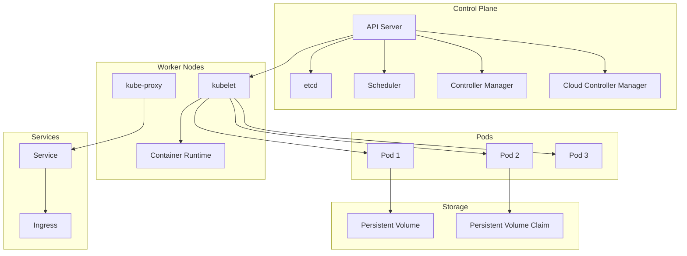

# Kubernetes and Container Orchestration - Comprehensive Guide

## 🎯 Overview

This comprehensive guide covers Kubernetes architecture, container orchestration, deployment strategies, and advanced Kubernetes patterns. Essential for backend engineers working with containerized applications and microservices.

## 📊 Kubernetes Architecture Overview



## 🔧 Core Kubernetes Components

### 1. Pod Management

#### Pod Controller Implementation
```go
package main

import (
    "context"
    "fmt"
    "time"
    
    metav1 "k8s.io/apimachinery/pkg/apis/meta/v1"
    "k8s.io/apimachinery/pkg/apis/meta/v1/unstructured"
    "k8s.io/apimachinery/pkg/runtime/schema"
    "k8s.io/client-go/dynamic"
    "k8s.io/client-go/rest"
    "k8s.io/client-go/tools/clientcmd"
)

type PodController struct {
    client    dynamic.Interface
    namespace string
}

func NewPodController(kubeconfig string, namespace string) (*PodController, error) {
    var config *rest.Config
    var err error
    
    if kubeconfig != "" {
        config, err = clientcmd.BuildConfigFromFlags("", kubeconfig)
    } else {
        config, err = rest.InClusterConfig()
    }
    
    if err != nil {
        return nil, err
    }
    
    client, err := dynamic.NewForConfig(config)
    if err != nil {
        return nil, err
    }
    
    return &PodController{
        client:    client,
        namespace: namespace,
    }, nil
}

func (pc *PodController) CreatePod(podSpec *PodSpec) error {
    pod := &unstructured.Unstructured{
        Object: map[string]interface{}{
            "apiVersion": "v1",
            "kind":       "Pod",
            "metadata": map[string]interface{}{
                "name":      podSpec.Name,
                "namespace": pc.namespace,
                "labels":    podSpec.Labels,
            },
            "spec": map[string]interface{}{
                "containers": []map[string]interface{}{
                    {
                        "name":  podSpec.ContainerName,
                        "image": podSpec.Image,
                        "ports": []map[string]interface{}{
                            {
                                "containerPort": podSpec.Port,
                            },
                        },
                        "resources": map[string]interface{}{
                            "requests": map[string]interface{}{
                                "memory": podSpec.MemoryRequest,
                                "cpu":    podSpec.CPURequest,
                            },
                            "limits": map[string]interface{}{
                                "memory": podSpec.MemoryLimit,
                                "cpu":    podSpec.CPULimit,
                            },
                        },
                        "env": podSpec.Environment,
                    },
                },
                "restartPolicy": "Always",
            },
        },
    }
    
    _, err := pc.client.Resource(schema.GroupVersionResource{
        Group:    "",
        Version:  "v1",
        Resource: "pods",
    }).Namespace(pc.namespace).Create(context.TODO(), pod, metav1.CreateOptions{})
    
    return err
}

func (pc *PodController) GetPod(name string) (*unstructured.Unstructured, error) {
    return pc.client.Resource(schema.GroupVersionResource{
        Group:    "",
        Version:  "v1",
        Resource: "pods",
    }).Namespace(pc.namespace).Get(context.TODO(), name, metav1.GetOptions{})
}

func (pc *PodController) ListPods() (*unstructured.UnstructuredList, error) {
    return pc.client.Resource(schema.GroupVersionResource{
        Group:    "",
        Version:  "v1",
        Resource: "pods",
    }).Namespace(pc.namespace).List(context.TODO(), metav1.ListOptions{})
}

func (pc *PodController) DeletePod(name string) error {
    return pc.client.Resource(schema.GroupVersionResource{
        Group:    "",
        Version:  "v1",
        Resource: "pods",
    }).Namespace(pc.namespace).Delete(context.TODO(), name, metav1.DeleteOptions{})
}

type PodSpec struct {
    Name          string
    ContainerName string
    Image         string
    Port          int32
    MemoryRequest string
    CPURequest    string
    MemoryLimit   string
    CPULimit      string
    Labels        map[string]string
    Environment   []map[string]interface{}
}
```

### 2. Deployment Management

#### Deployment Controller
```go
type DeploymentController struct {
    client    dynamic.Interface
    namespace string
}

func NewDeploymentController(kubeconfig string, namespace string) (*DeploymentController, error) {
    var config *rest.Config
    var err error
    
    if kubeconfig != "" {
        config, err = clientcmd.BuildConfigFromFlags("", kubeconfig)
    } else {
        config, err = rest.InClusterConfig()
    }
    
    if err != nil {
        return nil, err
    }
    
    client, err := dynamic.NewForConfig(config)
    if err != nil {
        return nil, err
    }
    
    return &DeploymentController{
        client:    client,
        namespace: namespace,
    }, nil
}

func (dc *DeploymentController) CreateDeployment(deploymentSpec *DeploymentSpec) error {
    deployment := &unstructured.Unstructured{
        Object: map[string]interface{}{
            "apiVersion": "apps/v1",
            "kind":       "Deployment",
            "metadata": map[string]interface{}{
                "name":      deploymentSpec.Name,
                "namespace": dc.namespace,
                "labels":    deploymentSpec.Labels,
            },
            "spec": map[string]interface{}{
                "replicas": deploymentSpec.Replicas,
                "selector": map[string]interface{}{
                    "matchLabels": deploymentSpec.Selector,
                },
                "template": map[string]interface{}{
                    "metadata": map[string]interface{}{
                        "labels": deploymentSpec.Selector,
                    },
                    "spec": map[string]interface{}{
                        "containers": []map[string]interface{}{
                            {
                                "name":  deploymentSpec.ContainerName,
                                "image": deploymentSpec.Image,
                                "ports": []map[string]interface{}{
                                    {
                                        "containerPort": deploymentSpec.Port,
                                    },
                                },
                                "resources": map[string]interface{}{
                                    "requests": map[string]interface{}{
                                        "memory": deploymentSpec.MemoryRequest,
                                        "cpu":    deploymentSpec.CPURequest,
                                    },
                                    "limits": map[string]interface{}{
                                        "memory": deploymentSpec.MemoryLimit,
                                        "cpu":    deploymentSpec.CPULimit,
                                    },
                                },
                                "livenessProbe": map[string]interface{}{
                                    "httpGet": map[string]interface{}{
                                        "path": "/health",
                                        "port": deploymentSpec.Port,
                                    },
                                    "initialDelaySeconds": 30,
                                    "periodSeconds":       10,
                                },
                                "readinessProbe": map[string]interface{}{
                                    "httpGet": map[string]interface{}{
                                        "path": "/ready",
                                        "port": deploymentSpec.Port,
                                    },
                                    "initialDelaySeconds": 5,
                                    "periodSeconds":       5,
                                },
                            },
                        },
                    },
                },
            },
        },
    }
    
    _, err := dc.client.Resource(schema.GroupVersionResource{
        Group:    "apps",
        Version:  "v1",
        Resource: "deployments",
    }).Namespace(dc.namespace).Create(context.TODO(), deployment, metav1.CreateOptions{})
    
    return err
}

func (dc *DeploymentController) ScaleDeployment(name string, replicas int32) error {
    deployment, err := dc.GetDeployment(name)
    if err != nil {
        return err
    }
    
    // Update replicas
    spec := deployment.Object["spec"].(map[string]interface{})
    spec["replicas"] = replicas
    
    _, err = dc.client.Resource(schema.GroupVersionResource{
        Group:    "apps",
        Version:  "v1",
        Resource: "deployments",
    }).Namespace(dc.namespace).Update(context.TODO(), deployment, metav1.UpdateOptions{})
    
    return err
}

func (dc *DeploymentController) GetDeployment(name string) (*unstructured.Unstructured, error) {
    return dc.client.Resource(schema.GroupVersionResource{
        Group:    "apps",
        Version:  "v1",
        Resource: "deployments",
    }).Namespace(dc.namespace).Get(context.TODO(), name, metav1.GetOptions{})
}

type DeploymentSpec struct {
    Name          string
    Replicas      int32
    ContainerName string
    Image         string
    Port          int32
    MemoryRequest string
    CPURequest    string
    MemoryLimit   string
    CPULimit      string
    Labels        map[string]string
    Selector      map[string]string
}
```

### 3. Service Management

#### Service Controller
```go
type ServiceController struct {
    client    dynamic.Interface
    namespace string
}

func NewServiceController(kubeconfig string, namespace string) (*ServiceController, error) {
    var config *rest.Config
    var err error
    
    if kubeconfig != "" {
        config, err = clientcmd.BuildConfigFromFlags("", kubeconfig)
    } else {
        config, err = rest.InClusterConfig()
    }
    
    if err != nil {
        return nil, err
    }
    
    client, err := dynamic.NewForConfig(config)
    if err != nil {
        return nil, err
    }
    
    return &ServiceController{
        client:    client,
        namespace: namespace,
    }, nil
}

func (sc *ServiceController) CreateService(serviceSpec *ServiceSpec) error {
    service := &unstructured.Unstructured{
        Object: map[string]interface{}{
            "apiVersion": "v1",
            "kind":       "Service",
            "metadata": map[string]interface{}{
                "name":      serviceSpec.Name,
                "namespace": sc.namespace,
                "labels":    serviceSpec.Labels,
            },
            "spec": map[string]interface{}{
                "selector": serviceSpec.Selector,
                "ports": []map[string]interface{}{
                    {
                        "name":       serviceSpec.PortName,
                        "port":       serviceSpec.Port,
                        "targetPort": serviceSpec.TargetPort,
                        "protocol":   "TCP",
                    },
                },
                "type": serviceSpec.Type,
            },
        },
    }
    
    _, err := sc.client.Resource(schema.GroupVersionResource{
        Group:    "",
        Version:  "v1",
        Resource: "services",
    }).Namespace(sc.namespace).Create(context.TODO(), service, metav1.CreateOptions{})
    
    return err
}

func (sc *ServiceController) CreateLoadBalancerService(serviceSpec *ServiceSpec) error {
    service := &unstructured.Unstructured{
        Object: map[string]interface{}{
            "apiVersion": "v1",
            "kind":       "Service",
            "metadata": map[string]interface{}{
                "name:      serviceSpec.Name,
                "namespace": sc.namespace,
                "labels":    serviceSpec.Labels,
                "annotations": map[string]interface{}{
                    "service.beta.kubernetes.io/aws-load-balancer-type": "nlb",
                },
            },
            "spec": map[string]interface{}{
                "selector": serviceSpec.Selector,
                "ports": []map[string]interface{}{
                    {
                        "name":       serviceSpec.PortName,
                        "port":       serviceSpec.Port,
                        "targetPort": serviceSpec.TargetPort,
                        "protocol":   "TCP",
                    },
                },
                "type": "LoadBalancer",
            },
        },
    }
    
    _, err := sc.client.Resource(schema.GroupVersionResource{
        Group:    "",
        Version:  "v1",
        Resource: "services",
    }).Namespace(sc.namespace).Create(context.TODO(), service, metav1.CreateOptions{})
    
    return err
}

type ServiceSpec struct {
    Name       string
    Port       int32
    TargetPort int32
    PortName   string
    Type       string
    Labels     map[string]string
    Selector   map[string]string
}
```

### 4. Ingress Management

#### Ingress Controller
```go
type IngressController struct {
    client    dynamic.Interface
    namespace string
}

func NewIngressController(kubeconfig string, namespace string) (*IngressController, error) {
    var config *rest.Config
    var err error
    
    if kubeconfig != "" {
        config, err = clientcmd.BuildConfigFromFlags("", kubeconfig)
    } else {
        config, err = rest.InClusterConfig()
    }
    
    if err != nil {
        return nil, err
    }
    
    client, err := dynamic.NewForConfig(config)
    if err != nil {
        return nil, err
    }
    
    return &IngressController{
        client:    client,
        namespace: namespace,
    }, nil
}

func (ic *IngressController) CreateIngress(ingressSpec *IngressSpec) error {
    ingress := &unstructured.Unstructured{
        Object: map[string]interface{}{
            "apiVersion": "networking.k8s.io/v1",
            "kind":       "Ingress",
            "metadata": map[string]interface{}{
                "name":      ingressSpec.Name,
                "namespace": ic.namespace,
                "labels":    ingressSpec.Labels,
                "annotations": map[string]interface{}{
                    "kubernetes.io/ingress.class":                "nginx",
                    "nginx.ingress.kubernetes.io/rewrite-target": "/",
                    "nginx.ingress.kubernetes.io/ssl-redirect":   "true",
                },
            },
            "spec": map[string]interface{}{
                "tls": []map[string]interface{}{
                    {
                        "hosts":      ingressSpec.Hosts,
                        "secretName": ingressSpec.TLSSecret,
                    },
                },
                "rules": ic.buildRules(ingressSpec),
            },
        },
    }
    
    _, err := ic.client.Resource(schema.GroupVersionResource{
        Group:    "networking.k8s.io",
        Version:  "v1",
        Resource: "ingresses",
    }).Namespace(ic.namespace).Create(context.TODO(), ingress, metav1.CreateOptions{})
    
    return err
}

func (ic *IngressController) buildRules(ingressSpec *IngressSpec) []map[string]interface{} {
    var rules []map[string]interface{}
    
    for _, host := range ingressSpec.Hosts {
        rule := map[string]interface{}{
            "host": host,
            "http": map[string]interface{}{
                "paths": []map[string]interface{}{
                    {
                        "path":     ingressSpec.Path,
                        "pathType": "Prefix",
                        "backend": map[string]interface{}{
                            "service": map[string]interface{}{
                                "name": ingressSpec.ServiceName,
                                "port": map[string]interface{}{
                                    "number": ingressSpec.ServicePort,
                                },
                            },
                        },
                    },
                },
            },
        }
        rules = append(rules, rule)
    }
    
    return rules
}

type IngressSpec struct {
    Name         string
    Hosts        []string
    Path         string
    ServiceName  string
    ServicePort  int32
    TLSSecret    string
    Labels       map[string]string
}
```

## 🔧 Advanced Kubernetes Patterns

### 1. Custom Resource Definitions (CRD)

#### CRD Controller
```go
type CRDController struct {
    client    dynamic.Interface
    namespace string
    gvr       schema.GroupVersionResource
}

func NewCRDController(kubeconfig string, namespace string) (*CRDController, error) {
    var config *rest.Config
    var err error
    
    if kubeconfig != "" {
        config, err = clientcmd.BuildConfigFromFlags("", kubeconfig)
    } else {
        config, err = rest.InClusterConfig()
    }
    
    if err != nil {
        return nil, err
    }
    
    client, err := dynamic.NewForConfig(config)
    if err != nil {
        return nil, err
    }
    
    return &CRDController{
        client:    client,
        namespace: namespace,
        gvr: schema.GroupVersionResource{
            Group:    "example.com",
            Version:  "v1",
            Resource: "customresources",
        },
    }, nil
}

func (cc *CRDController) CreateCustomResource(crSpec *CustomResourceSpec) error {
    cr := &unstructured.Unstructured{
        Object: map[string]interface{}{
            "apiVersion": "example.com/v1",
            "kind":       "CustomResource",
            "metadata": map[string]interface{}{
                "name":      crSpec.Name,
                "namespace": cc.namespace,
                "labels":    crSpec.Labels,
            },
            "spec": map[string]interface{}{
                "replicas": crSpec.Replicas,
                "image":    crSpec.Image,
                "port":     crSpec.Port,
            },
        },
    }
    
    _, err := cc.client.Resource(cc.gvr).Namespace(cc.namespace).Create(context.TODO(), cr, metav1.CreateOptions{})
    
    return err
}

func (cc *CRDController) WatchCustomResources() (<-chan Event, error) {
    watcher, err := cc.client.Resource(cc.gvr).Namespace(cc.namespace).Watch(context.TODO(), metav1.ListOptions{})
    if err != nil {
        return nil, err
    }
    
    eventChan := make(chan Event, 100)
    
    go func() {
        defer close(eventChan)
        for event := range watcher.ResultChan() {
            eventChan <- Event{
                Type:   event.Type,
                Object: event.Object.(*unstructured.Unstructured),
            }
        }
    }()
    
    return eventChan, nil
}

type CustomResourceSpec struct {
    Name     string
    Replicas int32
    Image    string
    Port     int32
    Labels   map[string]string
}

type Event struct {
    Type   string
    Object *unstructured.Unstructured
}
```

### 2. Operator Pattern

#### Operator Implementation
```go
type Operator struct {
    client    dynamic.Interface
    namespace string
    gvr       schema.GroupVersionResource
    stopCh    chan struct{}
}

func NewOperator(kubeconfig string, namespace string) (*Operator, error) {
    var config *rest.Config
    var err error
    
    if kubeconfig != "" {
        config, err = clientcmd.BuildConfigFromFlags("", kubeconfig)
    } else {
        config, err = rest.InClusterConfig()
    }
    
    if err != nil {
        return nil, err
    }
    
    client, err := dynamic.NewForConfig(config)
    if err != nil {
        return nil, err
    }
    
    return &Operator{
        client:    client,
        namespace: namespace,
        gvr: schema.GroupVersionResource{
            Group:    "example.com",
            Version:  "v1",
            Resource: "customresources",
        },
        stopCh: make(chan struct{}),
    }, nil
}

func (o *Operator) Start() error {
    // Start watching for custom resources
    watcher, err := o.client.Resource(o.gvr).Namespace(o.namespace).Watch(context.TODO(), metav1.ListOptions{})
    if err != nil {
        return err
    }
    
    go o.reconcileLoop(watcher)
    
    return nil
}

func (o *Operator) Stop() {
    close(o.stopCh)
}

func (o *Operator) reconcileLoop(watcher watch.Interface) {
    defer watcher.Stop()
    
    for {
        select {
        case event := <-watcher.ResultChan():
            o.handleEvent(event)
        case <-o.stopCh:
            return
        }
    }
}

func (o *Operator) handleEvent(event watch.Event) {
    cr := event.Object.(*unstructured.Unstructured)
    
    switch event.Type {
    case watch.Added, watch.Modified:
        o.reconcile(cr)
    case watch.Deleted:
        o.cleanup(cr)
    }
}

func (o *Operator) reconcile(cr *unstructured.Unstructured) error {
    spec := cr.Object["spec"].(map[string]interface{})
    
    // Get desired state
    desiredReplicas := spec["replicas"].(int64)
    image := spec["image"].(string)
    port := spec["port"].(int64)
    
    // Create or update deployment
    deploymentName := cr.GetName() + "-deployment"
    deployment := o.buildDeployment(deploymentName, int32(desiredReplicas), image, int32(port))
    
    // Apply deployment
    _, err := o.client.Resource(schema.GroupVersionResource{
        Group:    "apps",
        Version:  "v1",
        Resource: "deployments",
    }).Namespace(o.namespace).Apply(context.TODO(), deploymentName, deployment, metav1.ApplyOptions{})
    
    if err != nil {
        return err
    }
    
    // Create or update service
    serviceName := cr.GetName() + "-service"
    service := o.buildService(serviceName, int32(port))
    
    _, err = o.client.Resource(schema.GroupVersionResource{
        Group:    "",
        Version:  "v1",
        Resource: "services",
    }).Namespace(o.namespace).Apply(context.TODO(), serviceName, service, metav1.ApplyOptions{})
    
    return err
}

func (o *Operator) cleanup(cr *unstructured.Unstructured) error {
    name := cr.GetName()
    
    // Delete deployment
    deploymentName := name + "-deployment"
    err := o.client.Resource(schema.GroupVersionResource{
        Group:    "apps",
        Version:  "v1",
        Resource: "deployments",
    }).Namespace(o.namespace).Delete(context.TODO(), deploymentName, metav1.DeleteOptions{})
    
    if err != nil {
        log.Printf("Error deleting deployment: %v", err)
    }
    
    // Delete service
    serviceName := name + "-service"
    err = o.client.Resource(schema.GroupVersionResource{
        Group:    "",
        Version:  "v1",
        Resource: "services",
    }).Namespace(o.namespace).Delete(context.TODO(), serviceName, metav1.DeleteOptions{})
    
    if err != nil {
        log.Printf("Error deleting service: %v", err)
    }
    
    return nil
}
```

### 3. Helm Chart Management

#### Helm Client
```go
type HelmClient struct {
    settings *cli.EnvSettings
    action   *action.Install
}

func NewHelmClient() *HelmClient {
    settings := cli.New()
    
    actionConfig := new(action.Configuration)
    actionConfig.Init(settings.RESTClientGetter(), settings.Namespace(), "secret", func(format string, v ...interface{}) {
        log.Printf(format, v...)
    })
    
    action := action.NewInstall(actionConfig)
    action.Namespace = "default"
    action.ReleaseName = "my-release"
    action.CreateNamespace = true
    
    return &HelmClient{
        settings: settings,
        action:   action,
    }
}

func (hc *HelmClient) InstallChart(chartPath string, values map[string]interface{}) (*release.Release, error) {
    chart, err := loader.Load(chartPath)
    if err != nil {
        return nil, err
    }
    
    hc.action.Values = values
    
    return hc.action.Run(chart, nil)
}

func (hc *HelmClient) UpgradeChart(releaseName string, chartPath string, values map[string]interface{}) (*release.Release, error) {
    actionConfig := new(action.Configuration)
    actionConfig.Init(hc.settings.RESTClientGetter(), hc.settings.Namespace(), "secret", func(format string, v ...interface{}) {
        log.Printf(format, v...)
    })
    
    upgradeAction := action.NewUpgrade(actionConfig)
    upgradeAction.Namespace = hc.settings.Namespace()
    upgradeAction.Values = values
    
    chart, err := loader.Load(chartPath)
    if err != nil {
        return nil, err
    }
    
    return upgradeAction.RunWithContext(context.TODO(), releaseName, chart, values)
}

func (hc *HelmClient) UninstallChart(releaseName string) error {
    actionConfig := new(action.Configuration)
    actionConfig.Init(hc.settings.RESTClientGetter(), hc.settings.Namespace(), "secret", func(format string, v ...interface{}) {
        log.Printf(format, v...)
    })
    
    uninstallAction := action.NewUninstall(actionConfig)
    
    _, err := uninstallAction.Run(releaseName)
    return err
}
```

## 📊 Monitoring and Observability

### 1. Prometheus Integration

#### Metrics Exporter
```go
type MetricsExporter struct {
    registry prometheus.Registerer
    metrics  map[string]prometheus.Collector
}

func NewMetricsExporter() *MetricsExporter {
    registry := prometheus.NewRegistry()
    
    return &MetricsExporter{
        registry: registry,
        metrics:  make(map[string]prometheus.Collector),
    }
}

func (me *MetricsExporter) RegisterCounter(name string, help string, labels []string) {
    counter := prometheus.NewCounterVec(
        prometheus.CounterOpts{
            Name: name,
            Help: help,
        },
        labels,
    )
    
    me.registry.MustRegister(counter)
    me.metrics[name] = counter
}

func (me *MetricsExporter) RegisterGauge(name string, help string, labels []string) {
    gauge := prometheus.NewGaugeVec(
        prometheus.GaugeOpts{
            Name: name,
            Help: help,
        },
        labels,
    )
    
    me.registry.MustRegister(gauge)
    me.metrics[name] = gauge
}

func (me *MetricsExporter) RegisterHistogram(name string, help string, labels []string) {
    histogram := prometheus.NewHistogramVec(
        prometheus.HistogramOpts{
            Name:    name,
            Help:    help,
            Buckets: prometheus.DefBuckets,
        },
        labels,
    )
    
    me.registry.MustRegister(histogram)
    me.metrics[name] = histogram
}

func (me *MetricsExporter) IncrementCounter(name string, labels map[string]string) {
    if counter, exists := me.metrics[name]; exists {
        if counterVec, ok := counter.(*prometheus.CounterVec); ok {
            counterVec.With(labels).Inc()
        }
    }
}

func (me *MetricsExporter) SetGauge(name string, value float64, labels map[string]string) {
    if gauge, exists := me.metrics[name]; exists {
        if gaugeVec, ok := gauge.(*prometheus.GaugeVec); ok {
            gaugeVec.With(labels).Set(value)
        }
    }
}

func (me *MetricsExporter) ObserveHistogram(name string, value float64, labels map[string]string) {
    if histogram, exists := me.metrics[name]; exists {
        if histogramVec, ok := histogram.(*prometheus.HistogramVec); ok {
            histogramVec.With(labels).Observe(value)
        }
    }
}
```

### 2. Health Checks

#### Health Check Handler
```go
type HealthChecker struct {
    checks map[string]HealthCheck
    mutex  sync.RWMutex
}

type HealthCheck func() error

func NewHealthChecker() *HealthChecker {
    return &HealthChecker{
        checks: make(map[string]HealthCheck),
    }
}

func (hc *HealthChecker) AddCheck(name string, check HealthCheck) {
    hc.mutex.Lock()
    defer hc.mutex.Unlock()
    
    hc.checks[name] = check
}

func (hc *HealthChecker) RemoveCheck(name string) {
    hc.mutex.Lock()
    defer hc.mutex.Unlock()
    
    delete(hc.checks, name)
}

func (hc *HealthChecker) CheckHealth() map[string]string {
    hc.mutex.RLock()
    defer hc.mutex.RUnlock()
    
    results := make(map[string]string)
    
    for name, check := range hc.checks {
        if err := check(); err != nil {
            results[name] = "FAIL: " + err.Error()
        } else {
            results[name] = "OK"
        }
    }
    
    return results
}

func (hc *HealthChecker) IsHealthy() bool {
    results := hc.CheckHealth()
    
    for _, status := range results {
        if !strings.HasPrefix(status, "OK") {
            return false
        }
    }
    
    return true
}

// HTTP handler for health checks
func (hc *HealthChecker) HealthHandler(w http.ResponseWriter, r *http.Request) {
    results := hc.CheckHealth()
    isHealthy := hc.IsHealthy()
    
    statusCode := http.StatusOK
    if !isHealthy {
        statusCode = http.StatusServiceUnavailable
    }
    
    w.Header().Set("Content-Type", "application/json")
    w.WriteHeader(statusCode)
    
    response := map[string]interface{}{
        "status":  "healthy",
        "checks":  results,
        "healthy": isHealthy,
    }
    
    if !isHealthy {
        response["status"] = "unhealthy"
    }
    
    json.NewEncoder(w).Encode(response)
}
```

## 🔍 Key Technical Challenges

### 1. Resource Management
- **Problem**: Efficient resource allocation and scheduling
- **Solution**: Resource quotas and limits
- **Implementation**: Resource requests and limits in pod specs

### 2. Service Discovery
- **Problem**: Dynamic service location in distributed systems
- **Solution**: Kubernetes DNS and service abstraction
- **Implementation**: Service objects with selectors

### 3. Rolling Updates
- **Problem**: Zero-downtime deployments
- **Solution**: Rolling update strategy
- **Implementation**: Deployment controllers with update strategies

### 4. Monitoring and Debugging
- **Problem**: Observability in containerized environments
- **Solution**: Comprehensive logging and metrics
- **Implementation**: Prometheus, Grafana, and ELK stack

## 📚 Interview Questions

### System Design Questions
1. How would you design a Kubernetes cluster?
2. How does Kubernetes handle service discovery?
3. How would you implement zero-downtime deployments?
4. How does Kubernetes manage resource allocation?
5. How would you monitor a Kubernetes cluster?

### Technical Deep Dive
1. Explain Kubernetes architecture components
2. How does the scheduler work?
3. Describe the etcd data store
4. How does kube-proxy handle load balancing?
5. Explain custom resource definitions

## 🎯 Key Takeaways

1. **Container Orchestration**: Automated container management
2. **Service Discovery**: Dynamic service location
3. **Resource Management**: Efficient resource allocation
4. **Rolling Updates**: Zero-downtime deployments
5. **Monitoring**: Comprehensive observability
6. **Scalability**: Horizontal and vertical scaling
7. **Security**: RBAC and network policies

## 🔗 Additional Resources

- [Kubernetes Documentation](https://kubernetes.io/docs/)
- [Kubernetes API Reference](https://kubernetes.io/docs/reference/generated/kubernetes-api/)
- [Helm Documentation](https://helm.sh/docs/)
- [Prometheus Operator](https://github.com/prometheus-operator/prometheus-operator)
- [Kubernetes Best Practices](https://kubernetes.io/docs/concepts/configuration/overview/)
