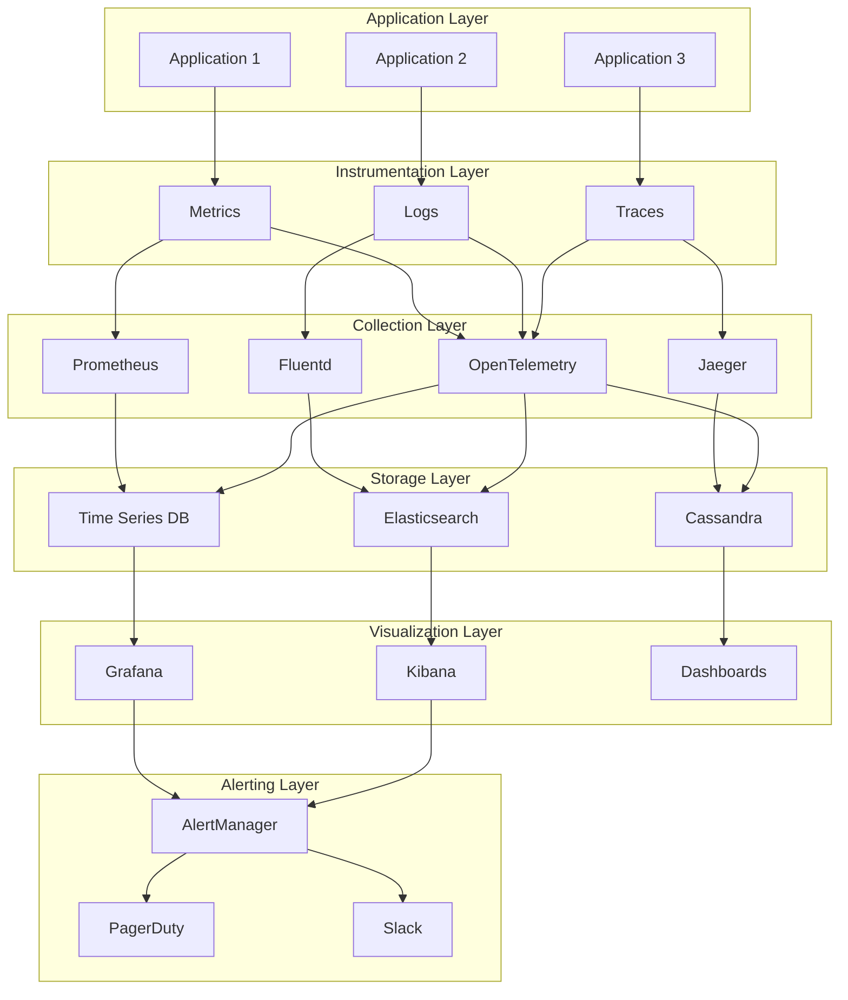

# Monitoring and Observability - Comprehensive Guide

## 🎯 Overview

This comprehensive guide covers monitoring, observability, logging, metrics, tracing, and alerting systems. Essential for backend engineers to build reliable, observable, and maintainable systems.

## 📊 Observability Architecture Overview



## 🔧 Metrics Collection

### 1. Prometheus Metrics

#### Metrics Collector
```go
package main

import (
    "context"
    "net/http"
    "time"
    
    "github.com/prometheus/client_golang/prometheus"
    "github.com/prometheus/client_golang/prometheus/promhttp"
)

type MetricsCollector struct {
    // HTTP metrics
    httpRequestsTotal     *prometheus.CounterVec
    httpRequestDuration   *prometheus.HistogramVec
    httpRequestsInFlight  prometheus.Gauge
    
    // Business metrics
    ordersTotal          *prometheus.CounterVec
    revenueTotal         *prometheus.CounterVec
    activeUsers          prometheus.Gauge
    
    // System metrics
    memoryUsage          prometheus.Gauge
    cpuUsage             prometheus.Gauge
    diskUsage            prometheus.Gauge
    
    // Custom metrics
    customMetrics        map[string]prometheus.Collector
    registry             *prometheus.Registry
}

func NewMetricsCollector() *MetricsCollector {
    registry := prometheus.NewRegistry()
    
    mc := &MetricsCollector{
        httpRequestsTotal: prometheus.NewCounterVec(
            prometheus.CounterOpts{
                Name: "http_requests_total",
                Help: "Total number of HTTP requests",
            },
            []string{"method", "endpoint", "status_code"},
        ),
        httpRequestDuration: prometheus.NewHistogramVec(
            prometheus.HistogramOpts{
                Name:    "http_request_duration_seconds",
                Help:    "HTTP request duration in seconds",
                Buckets: prometheus.DefBuckets,
            },
            []string{"method", "endpoint"},
        ),
        httpRequestsInFlight: prometheus.NewGauge(
            prometheus.GaugeOpts{
                Name: "http_requests_in_flight",
                Help: "Number of HTTP requests currently being processed",
            },
        ),
        ordersTotal: prometheus.NewCounterVec(
            prometheus.CounterOpts{
                Name: "orders_total",
                Help: "Total number of orders",
            },
            []string{"status", "payment_method"},
        ),
        revenueTotal: prometheus.NewCounterVec(
            prometheus.CounterOpts{
                Name: "revenue_total",
                Help: "Total revenue in dollars",
            },
            []string{"currency", "payment_method"},
        ),
        activeUsers: prometheus.NewGauge(
            prometheus.GaugeOpts{
                Name: "active_users",
                Help: "Number of active users",
            },
        ),
        memoryUsage: prometheus.NewGauge(
            prometheus.GaugeOpts{
                Name: "memory_usage_bytes",
                Help: "Memory usage in bytes",
            },
        ),
        cpuUsage: prometheus.NewGauge(
            prometheus.GaugeOpts{
                Name: "cpu_usage_percent",
                Help: "CPU usage percentage",
            },
        ),
        diskUsage: prometheus.NewGauge(
            prometheus.GaugeOpts{
                Name: "disk_usage_percent",
                Help: "Disk usage percentage",
            },
        ),
        customMetrics: make(map[string]prometheus.Collector),
        registry:      registry,
    }
    
    // Register all metrics
    registry.MustRegister(
        mc.httpRequestsTotal,
        mc.httpRequestDuration,
        mc.httpRequestsInFlight,
        mc.ordersTotal,
        mc.revenueTotal,
        mc.activeUsers,
        mc.memoryUsage,
        mc.cpuUsage,
        mc.diskUsage,
    )
    
    return mc
}

func (mc *MetricsCollector) RecordHTTPRequest(method, endpoint, statusCode string, duration time.Duration) {
    mc.httpRequestsTotal.WithLabelValues(method, endpoint, statusCode).Inc()
    mc.httpRequestDuration.WithLabelValues(method, endpoint).Observe(duration.Seconds())
}

func (mc *MetricsCollector) IncrementHTTPRequestsInFlight() {
    mc.httpRequestsInFlight.Inc()
}

func (mc *MetricsCollector) DecrementHTTPRequestsInFlight() {
    mc.httpRequestsInFlight.Dec()
}

func (mc *MetricsCollector) RecordOrder(status, paymentMethod string) {
    mc.ordersTotal.WithLabelValues(status, paymentMethod).Inc()
}

func (mc *MetricsCollector) RecordRevenue(amount float64, currency, paymentMethod string) {
    mc.revenueTotal.WithLabelValues(currency, paymentMethod).Add(amount)
}

func (mc *MetricsCollector) SetActiveUsers(count float64) {
    mc.activeUsers.Set(count)
}

func (mc *MetricsCollector) SetMemoryUsage(bytes float64) {
    mc.memoryUsage.Set(bytes)
}

func (mc *MetricsCollector) SetCPUUsage(percent float64) {
    mc.cpuUsage.Set(percent)
}

func (mc *MetricsCollector) SetDiskUsage(percent float64) {
    mc.diskUsage.Set(percent)
}

func (mc *MetricsCollector) AddCustomCounter(name, help string, labels []string) {
    counter := prometheus.NewCounterVec(
        prometheus.CounterOpts{
            Name: name,
            Help: help,
        },
        labels,
    )
    
    mc.registry.MustRegister(counter)
    mc.customMetrics[name] = counter
}

func (mc *MetricsCollector) AddCustomGauge(name, help string, labels []string) {
    gauge := prometheus.NewGaugeVec(
        prometheus.GaugeOpts{
            Name: name,
            Help: help,
        },
        labels,
    )
    
    mc.registry.MustRegister(gauge)
    mc.customMetrics[name] = gauge
}

func (mc *MetricsCollector) AddCustomHistogram(name, help string, labels []string) {
    histogram := prometheus.NewHistogramVec(
        prometheus.HistogramOpts{
            Name:    name,
            Help:    help,
            Buckets: prometheus.DefBuckets,
        },
        labels,
    )
    
    mc.registry.MustRegister(histogram)
    mc.customMetrics[name] = histogram
}

func (mc *MetricsCollector) GetHandler() http.Handler {
    return promhttp.HandlerFor(mc.registry, promhttp.HandlerOpts{})
}
```

#### HTTP Middleware for Metrics
```go
type MetricsMiddleware struct {
    collector *MetricsCollector
    next      http.Handler
}

func NewMetricsMiddleware(collector *MetricsCollector, next http.Handler) *MetricsMiddleware {
    return &MetricsMiddleware{
        collector: collector,
        next:      next,
    }
}

func (mm *MetricsMiddleware) ServeHTTP(w http.ResponseWriter, r *http.Request) {
    start := time.Now()
    
    // Increment in-flight requests
    mm.collector.IncrementHTTPRequestsInFlight()
    defer mm.collector.DecrementHTTPRequestsInFlight()
    
    // Wrap response writer to capture status code
    wrapped := &responseWriter{ResponseWriter: w, statusCode: http.StatusOK}
    
    // Call next handler
    mm.next.ServeHTTP(wrapped, r)
    
    // Record metrics
    duration := time.Since(start)
    mm.collector.RecordHTTPRequest(
        r.Method,
        r.URL.Path,
        fmt.Sprintf("%d", wrapped.statusCode),
        duration,
    )
}

type responseWriter struct {
    http.ResponseWriter
    statusCode int
}

func (rw *responseWriter) WriteHeader(code int) {
    rw.statusCode = code
    rw.ResponseWriter.WriteHeader(code)
}
```

### 2. Custom Metrics

#### Business Metrics
```go
type BusinessMetrics struct {
    collector *MetricsCollector
}

func NewBusinessMetrics(collector *MetricsCollector) *BusinessMetrics {
    // Add business-specific metrics
    collector.AddCustomCounter("user_registrations_total", "Total user registrations", []string{"source"})
    collector.AddCustomCounter("email_sent_total", "Total emails sent", []string{"type", "status"})
    collector.AddCustomGauge("queue_size", "Current queue size", []string{"queue_name"})
    collector.AddCustomHistogram("payment_processing_duration", "Payment processing duration", []string{"payment_method"})
    
    return &BusinessMetrics{
        collector: collector,
    }
}

func (bm *BusinessMetrics) RecordUserRegistration(source string) {
    if counter, exists := bm.collector.customMetrics["user_registrations_total"]; exists {
        if counterVec, ok := counter.(*prometheus.CounterVec); ok {
            counterVec.WithLabelValues(source).Inc()
        }
    }
}

func (bm *BusinessMetrics) RecordEmailSent(emailType, status string) {
    if counter, exists := bm.collector.customMetrics["email_sent_total"]; exists {
        if counterVec, ok := counter.(*prometheus.CounterVec); ok {
            counterVec.WithLabelValues(emailType, status).Inc()
        }
    }
}

func (bm *BusinessMetrics) SetQueueSize(queueName string, size float64) {
    if gauge, exists := bm.collector.customMetrics["queue_size"]; exists {
        if gaugeVec, ok := gauge.(*prometheus.GaugeVec); ok {
            gaugeVec.WithLabelValues(queueName).Set(size)
        }
    }
}

func (bm *BusinessMetrics) RecordPaymentProcessing(duration time.Duration, paymentMethod string) {
    if histogram, exists := bm.collector.customMetrics["payment_processing_duration"]; exists {
        if histogramVec, ok := histogram.(*prometheus.HistogramVec); ok {
            histogramVec.WithLabelValues(paymentMethod).Observe(duration.Seconds())
        }
    }
}
```

## 🔧 Logging Systems

### 1. Structured Logging

#### Logger Implementation
```go
package main

import (
    "context"
    "encoding/json"
    "os"
    "time"
    
    "github.com/sirupsen/logrus"
)

type Logger struct {
    logger *logrus.Logger
    fields logrus.Fields
}

type LogLevel string

const (
    LogLevelDebug LogLevel = "debug"
    LogLevelInfo  LogLevel = "info"
    LogLevelWarn  LogLevel = "warn"
    LogLevelError LogLevel = "error"
    LogLevelFatal LogLevel = "fatal"
)

func NewLogger(level LogLevel) *Logger {
    logger := logrus.New()
    
    // Set log level
    switch level {
    case LogLevelDebug:
        logger.SetLevel(logrus.DebugLevel)
    case LogLevelInfo:
        logger.SetLevel(logrus.InfoLevel)
    case LogLevelWarn:
        logger.SetLevel(logrus.WarnLevel)
    case LogLevelError:
        logger.SetLevel(logrus.ErrorLevel)
    case LogLevelFatal:
        logger.SetLevel(logrus.FatalLevel)
    }
    
    // Set JSON formatter for structured logging
    logger.SetFormatter(&logrus.JSONFormatter{
        TimestampFormat: time.RFC3339,
        FieldMap: logrus.FieldMap{
            logrus.FieldKeyTime:  "timestamp",
            logrus.FieldKeyLevel: "level",
            logrus.FieldKeyMsg:   "message",
            logrus.FieldKeyFunc:  "function",
        },
    })
    
    // Set output to stdout
    logger.SetOutput(os.Stdout)
    
    return &Logger{
        logger: logger,
        fields: make(logrus.Fields),
    }
}

func (l *Logger) WithField(key string, value interface{}) *Logger {
    newFields := make(logrus.Fields)
    for k, v := range l.fields {
        newFields[k] = v
    }
    newFields[key] = value
    
    return &Logger{
        logger: l.logger,
        fields: newFields,
    }
}

func (l *Logger) WithFields(fields map[string]interface{}) *Logger {
    newFields := make(logrus.Fields)
    for k, v := range l.fields {
        newFields[k] = v
    }
    for k, v := range fields {
        newFields[k] = v
    }
    
    return &Logger{
        logger: l.logger,
        fields: newFields,
    }
}

func (l *Logger) WithContext(ctx context.Context) *Logger {
    newFields := make(logrus.Fields)
    for k, v := range l.fields {
        newFields[k] = v
    }
    
    // Extract trace ID from context
    if traceID := ctx.Value("trace_id"); traceID != nil {
        newFields["trace_id"] = traceID
    }
    
    // Extract user ID from context
    if userID := ctx.Value("user_id"); userID != nil {
        newFields["user_id"] = userID
    }
    
    return &Logger{
        logger: l.logger,
        fields: newFields,
    }
}

func (l *Logger) Debug(msg string) {
    l.logger.WithFields(l.fields).Debug(msg)
}

func (l *Logger) Info(msg string) {
    l.logger.WithFields(l.fields).Info(msg)
}

func (l *Logger) Warn(msg string) {
    l.logger.WithFields(l.fields).Warn(msg)
}

func (l *Logger) Error(msg string) {
    l.logger.WithFields(l.fields).Error(msg)
}

func (l *Logger) Fatal(msg string) {
    l.logger.WithFields(l.fields).Fatal(msg)
}

func (l *Logger) Debugf(format string, args ...interface{}) {
    l.logger.WithFields(l.fields).Debugf(format, args...)
}

func (l *Logger) Infof(format string, args ...interface{}) {
    l.logger.WithFields(l.fields).Infof(format, args...)
}

func (l *Logger) Warnf(format string, args ...interface{}) {
    l.logger.WithFields(l.fields).Warnf(format, args...)
}

func (l *Logger) Errorf(format string, args ...interface{}) {
    l.logger.WithFields(l.fields).Errorf(format, args...)
}

func (l *Logger) Fatalf(format string, args ...interface{}) {
    l.logger.WithFields(l.fields).Fatalf(format, args...)
}
```

#### Log Aggregation
```go
type LogAggregator struct {
    logger    *Logger
    buffer    []LogEntry
    bufferSize int
    flushInterval time.Duration
    output    chan LogEntry
    done      chan struct{}
}

type LogEntry struct {
    Timestamp time.Time              `json:"timestamp"`
    Level     string                 `json:"level"`
    Message   string                 `json:"message"`
    Fields    map[string]interface{} `json:"fields"`
    Service   string                 `json:"service"`
    Host      string                 `json:"host"`
}

func NewLogAggregator(logger *Logger, bufferSize int, flushInterval time.Duration) *LogAggregator {
    return &LogAggregator{
        logger:        logger,
        buffer:        make([]LogEntry, 0, bufferSize),
        bufferSize:    bufferSize,
        flushInterval: flushInterval,
        output:        make(chan LogEntry, 1000),
        done:          make(chan struct{}),
    }
}

func (la *LogAggregator) Start() {
    go la.flushLoop()
    go la.processLogs()
}

func (la *LogAggregator) Stop() {
    close(la.done)
    la.flush()
}

func (la *LogAggregator) AddLog(entry LogEntry) {
    la.output <- entry
}

func (la *LogAggregator) flushLoop() {
    ticker := time.NewTicker(la.flushInterval)
    defer ticker.Stop()
    
    for {
        select {
        case <-ticker.C:
            la.flush()
        case <-la.done:
            return
        }
    }
}

func (la *LogAggregator) processLogs() {
    for {
        select {
        case entry := <-la.output:
            la.buffer = append(la.buffer, entry)
            
            if len(la.buffer) >= la.bufferSize {
                la.flush()
            }
        case <-la.done:
            return
        }
    }
}

func (la *LogAggregator) flush() {
    if len(la.buffer) == 0 {
        return
    }
    
    // Send logs to external system (e.g., Elasticsearch, Fluentd)
    la.sendLogs(la.buffer)
    
    // Clear buffer
    la.buffer = la.buffer[:0]
}

func (la *LogAggregator) sendLogs(logs []LogEntry) {
    // Implementation would send to external logging system
    for _, log := range logs {
        la.logger.Info("Sending log to external system")
        // Send to Elasticsearch, Fluentd, etc.
    }
}
```

## 🔧 Distributed Tracing

### 1. OpenTelemetry Integration

#### Tracer Implementation
```go
package main

import (
    "context"
    "fmt"
    "time"
    
    "go.opentelemetry.io/otel"
    "go.opentelemetry.io/otel/attribute"
    "go.opentelemetry.io/otel/exporters/jaeger"
    "go.opentelemetry.io/otel/propagation"
    "go.opentelemetry.io/otel/sdk/resource"
    "go.opentelemetry.io/otel/sdk/trace"
    semconv "go.opentelemetry.io/otel/semconv/v1.4.0"
    "go.opentelemetry.io/otel/trace"
)

type Tracer struct {
    tracer trace.Tracer
}

func NewTracer(serviceName string, jaegerEndpoint string) (*Tracer, error) {
    // Create Jaeger exporter
    exp, err := jaeger.New(jaeger.WithCollectorEndpoint(jaeger.WithEndpoint(jaegerEndpoint)))
    if err != nil {
        return nil, err
    }
    
    // Create resource
    res, err := resource.New(context.Background(),
        resource.WithAttributes(
            semconv.ServiceNameKey.String(serviceName),
            semconv.ServiceVersionKey.String("1.0.0"),
        ),
    )
    if err != nil {
        return nil, err
    }
    
    // Create trace provider
    tp := trace.NewTracerProvider(
        trace.WithBatcher(exp),
        trace.WithResource(res),
    )
    
    // Set global trace provider
    otel.SetTracerProvider(tp)
    
    // Set global propagator
    otel.SetTextMapPropagator(propagation.NewCompositeTextMapPropagator(
        propagation.TraceContext{},
        propagation.Baggage{},
    ))
    
    return &Tracer{
        tracer: tp.Tracer(serviceName),
    }, nil
}

func (t *Tracer) StartSpan(ctx context.Context, name string, opts ...trace.SpanStartOption) (context.Context, trace.Span) {
    return t.tracer.Start(ctx, name, opts...)
}

func (t *Tracer) StartSpanWithAttributes(ctx context.Context, name string, attrs map[string]interface{}, opts ...trace.SpanStartOption) (context.Context, trace.Span) {
    var attributes []attribute.KeyValue
    for key, value := range attrs {
        attributes = append(attributes, attribute.String(key, fmt.Sprintf("%v", value)))
    }
    
    opts = append(opts, trace.WithAttributes(attributes...))
    return t.tracer.Start(ctx, name, opts...)
}

func (t *Tracer) AddSpanEvent(span trace.Span, name string, attrs map[string]interface{}) {
    var attributes []attribute.KeyValue
    for key, value := range attrs {
        attributes = append(attributes, attribute.String(key, fmt.Sprintf("%v", value)))
    }
    
    span.AddEvent(name, trace.WithAttributes(attributes...))
}

func (t *Tracer) SetSpanStatus(span trace.Span, err error) {
    if err != nil {
        span.RecordError(err)
        span.SetStatus(trace.StatusError, err.Error())
    } else {
        span.SetStatus(trace.StatusOK, "")
    }
}

func (t *Tracer) InjectTraceContext(ctx context.Context, headers map[string]string) {
    propagator := otel.GetTextMapPropagator()
    propagator.Inject(ctx, &headerCarrier{headers: headers})
}

func (t *Tracer) ExtractTraceContext(ctx context.Context, headers map[string]string) context.Context {
    propagator := otel.GetTextMapPropagator()
    return propagator.Extract(ctx, &headerCarrier{headers: headers})
}

type headerCarrier struct {
    headers map[string]string
}

func (hc *headerCarrier) Get(key string) string {
    return hc.headers[key]
}

func (hc *headerCarrier) Set(key, value string) {
    hc.headers[key] = value
}

func (hc *headerCarrier) Keys() []string {
    keys := make([]string, 0, len(hc.headers))
    for key := range hc.headers {
        keys = append(keys, key)
    }
    return keys
}
```

#### HTTP Middleware for Tracing
```go
type TracingMiddleware struct {
    tracer *Tracer
    next   http.Handler
}

func NewTracingMiddleware(tracer *Tracer, next http.Handler) *TracingMiddleware {
    return &TracingMiddleware{
        tracer: tracer,
        next:   next,
    }
}

func (tm *TracingMiddleware) ServeHTTP(w http.ResponseWriter, r *http.Request) {
    // Extract trace context from headers
    ctx := tm.tracer.ExtractTraceContext(r.Context(), extractHeaders(r))
    
    // Start span
    spanName := fmt.Sprintf("%s %s", r.Method, r.URL.Path)
    ctx, span := tm.tracer.StartSpanWithAttributes(ctx, spanName, map[string]interface{}{
        "http.method":     r.Method,
        "http.url":        r.URL.String(),
        "http.user_agent": r.UserAgent(),
        "http.remote_addr": r.RemoteAddr,
    })
    defer span.End()
    
    // Add trace ID to response headers
    traceID := span.SpanContext().TraceID().String()
    w.Header().Set("X-Trace-ID", traceID)
    
    // Wrap response writer
    wrapped := &tracingResponseWriter{
        ResponseWriter: w,
        statusCode:     http.StatusOK,
    }
    
    // Call next handler
    tm.next.ServeHTTP(wrapped, r.WithContext(ctx))
    
    // Set span attributes
    span.SetAttributes(
        attribute.Int("http.status_code", wrapped.statusCode),
        attribute.Int("http.response_size", wrapped.responseSize),
    )
    
    // Set span status
    if wrapped.statusCode >= 400 {
        span.SetStatus(trace.StatusError, fmt.Sprintf("HTTP %d", wrapped.statusCode))
    }
}

func extractHeaders(r *http.Request) map[string]string {
    headers := make(map[string]string)
    for key, values := range r.Header {
        if len(values) > 0 {
            headers[key] = values[0]
        }
    }
    return headers
}

type tracingResponseWriter struct {
    http.ResponseWriter
    statusCode   int
    responseSize int
}

func (trw *tracingResponseWriter) WriteHeader(code int) {
    trw.statusCode = code
    trw.ResponseWriter.WriteHeader(code)
}

func (trw *tracingResponseWriter) Write(b []byte) (int, error) {
    n, err := trw.ResponseWriter.Write(b)
    trw.responseSize += n
    return n, err
}
```

## 🔧 Alerting Systems

### 1. Alert Manager

#### Alert Manager Implementation
```go
type AlertManager struct {
    rules    []AlertRule
    channels []AlertChannel
    mutex    sync.RWMutex
}

type AlertRule struct {
    Name        string
    Condition   string
    Severity    string
    Duration    time.Duration
    Labels      map[string]string
    Annotations map[string]string
}

type AlertChannel interface {
    Send(alert Alert) error
}

type Alert struct {
    ID          string
    RuleName    string
    Severity    string
    Message     string
    Labels      map[string]string
    Annotations map[string]string
    StartsAt    time.Time
    EndsAt      time.Time
}

func NewAlertManager() *AlertManager {
    return &AlertManager{
        rules:    make([]AlertRule, 0),
        channels: make([]AlertChannel, 0),
    }
}

func (am *AlertManager) AddRule(rule AlertRule) {
    am.mutex.Lock()
    defer am.mutex.Unlock()
    
    am.rules = append(am.rules, rule)
}

func (am *AlertManager) AddChannel(channel AlertChannel) {
    am.mutex.Lock()
    defer am.mutex.Unlock()
    
    am.channels = append(am.channels, channel)
}

func (am *AlertManager) EvaluateRules(metrics map[string]float64) {
    am.mutex.RLock()
    rules := make([]AlertRule, len(am.rules))
    copy(rules, am.rules)
    am.mutex.RUnlock()
    
    for _, rule := range rules {
        if am.evaluateRule(rule, metrics) {
            alert := Alert{
                ID:          generateAlertID(),
                RuleName:    rule.Name,
                Severity:    rule.Severity,
                Message:     rule.Annotations["summary"],
                Labels:      rule.Labels,
                Annotations: rule.Annotations,
                StartsAt:    time.Now(),
            }
            
            am.sendAlert(alert)
        }
    }
}

func (am *AlertManager) evaluateRule(rule AlertRule, metrics map[string]float64) bool {
    // Simple rule evaluation - in practice, this would use a proper expression evaluator
    switch rule.Condition {
    case "cpu_usage > 80":
        return metrics["cpu_usage"] > 80
    case "memory_usage > 90":
        return metrics["memory_usage"] > 90
    case "error_rate > 5":
        return metrics["error_rate"] > 5
    default:
        return false
    }
}

func (am *AlertManager) sendAlert(alert Alert) {
    am.mutex.RLock()
    channels := make([]AlertChannel, len(am.channels))
    copy(channels, am.channels)
    am.mutex.RUnlock()
    
    for _, channel := range channels {
        go func(ch AlertChannel) {
            if err := ch.Send(alert); err != nil {
                log.Printf("Error sending alert: %v", err)
            }
        }(channel)
    }
}
```

#### Alert Channels
```go
// Slack Alert Channel
type SlackAlertChannel struct {
    webhookURL string
    client     *http.Client
}

func NewSlackAlertChannel(webhookURL string) *SlackAlertChannel {
    return &SlackAlertChannel{
        webhookURL: webhookURL,
        client:     &http.Client{Timeout: 10 * time.Second},
    }
}

func (sac *SlackAlertChannel) Send(alert Alert) error {
    payload := map[string]interface{}{
        "text": fmt.Sprintf("🚨 Alert: %s", alert.Message),
        "attachments": []map[string]interface{}{
            {
                "color":    sac.getColor(alert.Severity),
                "fields":   sac.buildFields(alert),
                "footer":   "Alert Manager",
                "ts":       alert.StartsAt.Unix(),
            },
        },
    }
    
    jsonData, err := json.Marshal(payload)
    if err != nil {
        return err
    }
    
    resp, err := sac.client.Post(sac.webhookURL, "application/json", bytes.NewBuffer(jsonData))
    if err != nil {
        return err
    }
    defer resp.Body.Close()
    
    if resp.StatusCode != http.StatusOK {
        return fmt.Errorf("slack webhook returned status %d", resp.StatusCode)
    }
    
    return nil
}

func (sac *SlackAlertChannel) getColor(severity string) string {
    switch severity {
    case "critical":
        return "danger"
    case "warning":
        return "warning"
    case "info":
        return "good"
    default:
        return "#36a64f"
    }
}

func (sac *SlackAlertChannel) buildFields(alert Alert) []map[string]interface{} {
    fields := []map[string]interface{}{
        {"title": "Rule", "value": alert.RuleName, "short": true},
        {"title": "Severity", "value": alert.Severity, "short": true},
    }
    
    for key, value := range alert.Labels {
        fields = append(fields, map[string]interface{}{
            "title": key,
            "value": value,
            "short": true,
        })
    }
    
    return fields
}

// Email Alert Channel
type EmailAlertChannel struct {
    smtpHost     string
    smtpPort     int
    username     string
    password     string
    fromEmail    string
    toEmails     []string
}

func NewEmailAlertChannel(smtpHost string, smtpPort int, username, password, fromEmail string, toEmails []string) *EmailAlertChannel {
    return &EmailAlertChannel{
        smtpHost:  smtpHost,
        smtpPort:  smtpPort,
        username:  username,
        password:  password,
        fromEmail: fromEmail,
        toEmails:  toEmails,
    }
}

func (eac *EmailAlertChannel) Send(alert Alert) error {
    auth := smtp.PlainAuth("", eac.username, eac.password, eac.smtpHost)
    
    subject := fmt.Sprintf("Alert: %s", alert.Message)
    body := eac.buildEmailBody(alert)
    
    msg := fmt.Sprintf("From: %s\r\nTo: %s\r\nSubject: %s\r\n\r\n%s",
        eac.fromEmail,
        strings.Join(eac.toEmails, ","),
        subject,
        body,
    )
    
    return smtp.SendMail(
        fmt.Sprintf("%s:%d", eac.smtpHost, eac.smtpPort),
        auth,
        eac.fromEmail,
        eac.toEmails,
        []byte(msg),
    )
}

func (eac *EmailAlertChannel) buildEmailBody(alert Alert) string {
    body := fmt.Sprintf("Alert Details:\n\n")
    body += fmt.Sprintf("Rule: %s\n", alert.RuleName)
    body += fmt.Sprintf("Severity: %s\n", alert.Severity)
    body += fmt.Sprintf("Message: %s\n", alert.Message)
    body += fmt.Sprintf("Time: %s\n\n", alert.StartsAt.Format(time.RFC3339))
    
    if len(alert.Labels) > 0 {
        body += "Labels:\n"
        for key, value := range alert.Labels {
            body += fmt.Sprintf("  %s: %s\n", key, value)
        }
    }
    
    if len(alert.Annotations) > 0 {
        body += "\nAnnotations:\n"
        for key, value := range alert.Annotations {
            body += fmt.Sprintf("  %s: %s\n", key, value)
        }
    }
    
    return body
}
```

## 🔍 Key Technical Challenges

### 1. High Cardinality Metrics
- **Problem**: Too many unique metric combinations
- **Solution**: Metric aggregation and sampling
- **Implementation**: Histogram bucketing and label filtering

### 2. Log Volume Management
- **Problem**: Massive log volumes overwhelming systems
- **Solution**: Log sampling and retention policies
- **Implementation**: Structured logging with log levels

### 3. Trace Propagation
- **Problem**: Maintaining trace context across services
- **Solution**: Distributed tracing with context propagation
- **Implementation**: OpenTelemetry with correlation IDs

### 4. Alert Fatigue
- **Problem**: Too many false positive alerts
- **Solution**: Intelligent alerting with thresholds
- **Implementation**: Alert rules with proper conditions

## 📚 Interview Questions

### System Design Questions
1. How would you design a monitoring system?
2. How does distributed tracing work?
3. How would you handle high-cardinality metrics?
4. How does log aggregation work?
5. How would you implement alerting?

### Technical Deep Dive
1. Explain the three pillars of observability
2. How does Prometheus work?
3. Describe OpenTelemetry architecture
4. How does Jaeger tracing work?
5. Explain alert rule evaluation

## 🎯 Key Takeaways

1. **Three Pillars**: Metrics, Logs, and Traces
2. **Metrics Collection**: Prometheus with custom metrics
3. **Structured Logging**: JSON format with context
4. **Distributed Tracing**: OpenTelemetry with correlation
5. **Alerting**: Intelligent rules with multiple channels
6. **Observability**: Comprehensive system visibility
7. **Performance**: Efficient collection and storage

## 🔗 Additional Resources

- [Prometheus Documentation](https://prometheus.io/docs/)
- [OpenTelemetry Documentation](https://opentelemetry.io/docs/)
- [Jaeger Documentation](https://www.jaegertracing.io/docs/)
- [Grafana Documentation](https://grafana.com/docs/)
- [ELK Stack Documentation](https://www.elastic.co/guide/)
