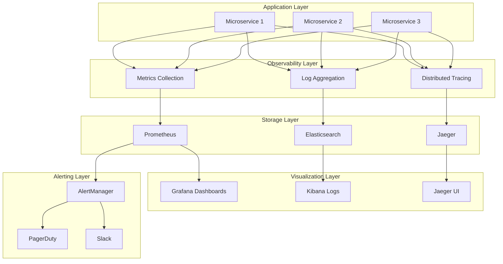
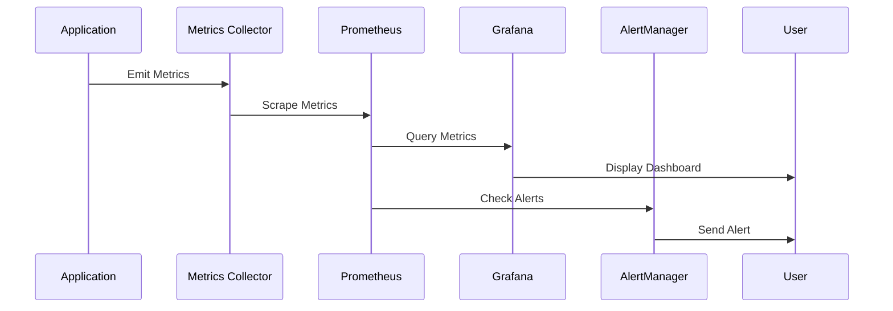
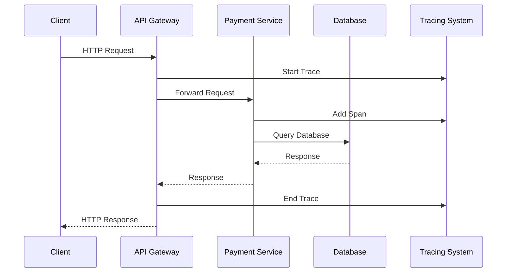

---
# Auto-generated front matter
Title: Monitoring Observability Comprehensive Guide
LastUpdated: 2025-11-06T20:45:59.157984
Tags: []
Status: draft
---

# 📊 **Monitoring & Observability Comprehensive Guide**

## 📘 **Theory**

Monitoring and observability are critical for maintaining reliable, performant systems, especially in fintech and payment processing where downtime can result in significant financial losses. Observability provides insights into system behavior, performance, and health.

### **Why Monitoring & Observability Matter**

- **System Health**: Monitor system status and performance in real-time
- **Issue Detection**: Identify problems before they impact users
- **Performance Optimization**: Track and improve system performance
- **Capacity Planning**: Understand resource usage and plan for growth
- **Compliance**: Meet regulatory requirements for financial systems
- **Debugging**: Quickly identify and resolve issues
- **Business Intelligence**: Understand user behavior and system usage

### **Key Concepts**

1. **Three Pillars of Observability**: Metrics, Logs, Traces
2. **Monitoring Types**: Infrastructure, Application, Business, Security
3. **Alerting**: Proactive notification of issues
4. **Dashboards**: Visual representation of system state
5. **SLIs/SLOs**: Service Level Indicators and Objectives
6. **Error Budgets**: Balancing reliability and feature velocity
7. **Distributed Tracing**: Following requests across services
8. **APM**: Application Performance Monitoring

### **Observability Stack**

- **Metrics**: Prometheus, InfluxDB, CloudWatch
- **Logging**: ELK Stack, Fluentd, CloudWatch Logs
- **Tracing**: Jaeger, Zipkin, X-Ray
- **APM**: New Relic, Datadog, AppDynamics
- **Dashboards**: Grafana, Kibana, CloudWatch Dashboards
- **Alerting**: PagerDuty, OpsGenie, Slack

## 📊 **Diagrams**

### **Observability Architecture**



### **Monitoring Data Flow**



### **Distributed Tracing Flow**



## 🧩 **Example**

**Scenario**: Implement comprehensive monitoring for a payment processing system

**Input**:
- Payment processing microservices
- Database operations
- External API integrations
- High transaction volume

**Expected Output**:
- Real-time metrics dashboard
- Centralized logging system
- Distributed tracing
- Alerting for critical issues

**Step-by-step**:
1. Set up metrics collection
2. Implement centralized logging
3. Add distributed tracing
4. Create monitoring dashboards
5. Configure alerting rules
6. Set up SLIs and SLOs

## 💻 **Implementation (Golang)**

### **Metrics Collection with Prometheus**

```go
package main

import (
    "context"
    "fmt"
    "net/http"
    "time"

    "github.com/prometheus/client_golang/prometheus"
    "github.com/prometheus/client_golang/prometheus/promhttp"
    "github.com/sirupsen/logrus"
)

// MetricsCollector handles Prometheus metrics
type MetricsCollector struct {
    // Counter metrics
    httpRequestsTotal     *prometheus.CounterVec
    paymentProcessedTotal *prometheus.CounterVec
    errorsTotal           *prometheus.CounterVec

    // Gauge metrics
    activeConnections     prometheus.Gauge
    paymentAmountGauge    *prometheus.GaugeVec
    systemUptime         prometheus.Gauge

    // Histogram metrics
    httpRequestDuration   *prometheus.HistogramVec
    paymentProcessDuration prometheus.Histogram

    // Summary metrics
    paymentAmountSummary  *prometheus.SummaryVec
}

// NewMetricsCollector creates a new metrics collector
func NewMetricsCollector() *MetricsCollector {
    return &MetricsCollector{
        httpRequestsTotal: prometheus.NewCounterVec(
            prometheus.CounterOpts{
                Name: "http_requests_total",
                Help: "Total number of HTTP requests",
            },
            []string{"method", "endpoint", "status_code"},
        ),
        paymentProcessedTotal: prometheus.NewCounterVec(
            prometheus.CounterOpts{
                Name: "payments_processed_total",
                Help: "Total number of payments processed",
            },
            []string{"status", "currency", "method"},
        ),
        errorsTotal: prometheus.NewCounterVec(
            prometheus.CounterOpts{
                Name: "errors_total",
                Help: "Total number of errors",
            },
            []string{"service", "error_type"},
        ),
        activeConnections: prometheus.NewGauge(
            prometheus.GaugeOpts{
                Name: "active_connections",
                Help: "Number of active connections",
            },
        ),
        paymentAmountGauge: prometheus.NewGaugeVec(
            prometheus.GaugeOpts{
                Name: "payment_amount_current",
                Help: "Current payment amount being processed",
            },
            []string{"currency"},
        ),
        systemUptime: prometheus.NewGauge(
            prometheus.GaugeOpts{
                Name: "system_uptime_seconds",
                Help: "System uptime in seconds",
            },
        ),
        httpRequestDuration: prometheus.NewHistogramVec(
            prometheus.HistogramOpts{
                Name:    "http_request_duration_seconds",
                Help:    "HTTP request duration in seconds",
                Buckets: prometheus.DefBuckets,
            },
            []string{"method", "endpoint"},
        ),
        paymentProcessDuration: prometheus.NewHistogram(
            prometheus.HistogramOpts{
                Name:    "payment_process_duration_seconds",
                Help:    "Payment processing duration in seconds",
                Buckets: []float64{0.1, 0.5, 1.0, 2.0, 5.0, 10.0},
            },
        ),
        paymentAmountSummary: prometheus.NewSummaryVec(
            prometheus.SummaryOpts{
                Name:       "payment_amount_summary",
                Help:       "Payment amount summary statistics",
                Objectives: map[float64]float64{0.5: 0.05, 0.9: 0.01, 0.99: 0.001},
            },
            []string{"currency"},
        ),
    }
}

// Register registers all metrics with Prometheus
func (mc *MetricsCollector) Register() {
    prometheus.MustRegister(
        mc.httpRequestsTotal,
        mc.paymentProcessedTotal,
        mc.errorsTotal,
        mc.activeConnections,
        mc.paymentAmountGauge,
        mc.systemUptime,
        mc.httpRequestDuration,
        mc.paymentProcessDuration,
        mc.paymentAmountSummary,
    )
}

// RecordHTTPRequest records an HTTP request
func (mc *MetricsCollector) RecordHTTPRequest(method, endpoint, statusCode string, duration float64) {
    mc.httpRequestsTotal.WithLabelValues(method, endpoint, statusCode).Inc()
    mc.httpRequestDuration.WithLabelValues(method, endpoint).Observe(duration)
}

// RecordPaymentProcessed records a payment processing
func (mc *MetricsCollector) RecordPaymentProcessed(status, currency, method string, amount float64, duration float64) {
    mc.paymentProcessedTotal.WithLabelValues(status, currency, method).Inc()
    mc.paymentProcessDuration.Observe(duration)
    mc.paymentAmountGauge.WithLabelValues(currency).Set(amount)
    mc.paymentAmountSummary.WithLabelValues(currency).Observe(amount)
}

// RecordError records an error
func (mc *MetricsCollector) RecordError(service, errorType string) {
    mc.errorsTotal.WithLabelValues(service, errorType).Inc()
}

// SetActiveConnections sets the number of active connections
func (mc *MetricsCollector) SetActiveConnections(count float64) {
    mc.activeConnections.Set(count)
}

// SetSystemUptime sets the system uptime
func (mc *MetricsCollector) SetSystemUptime(uptime float64) {
    mc.systemUptime.Set(uptime)
}

// PaymentService with monitoring
type PaymentService struct {
    metrics *MetricsCollector
    logger  *logrus.Logger
}

// NewPaymentService creates a new payment service
func NewPaymentService(metrics *MetricsCollector, logger *logrus.Logger) *PaymentService {
    return &PaymentService{
        metrics: metrics,
        logger:  logger,
    }
}

// ProcessPayment processes a payment with monitoring
func (ps *PaymentService) ProcessPayment(payment *Payment) error {
    startTime := time.Now()
    
    // Log payment processing start
    ps.logger.WithFields(logrus.Fields{
        "payment_id": payment.ID,
        "user_id":    payment.UserID,
        "amount":     payment.Amount,
        "currency":   payment.Currency,
    }).Info("Processing payment")

    // Simulate payment processing
    time.Sleep(time.Duration(payment.Amount/100) * time.Millisecond)

    // Determine status based on amount
    status := "completed"
    if payment.Amount > 1000 {
        status = "failed"
        ps.metrics.RecordError("payment_service", "high_amount")
    }

    // Record metrics
    duration := time.Since(startTime).Seconds()
    ps.metrics.RecordPaymentProcessed(status, payment.Currency, "card", payment.Amount, duration)

    // Log result
    ps.logger.WithFields(logrus.Fields{
        "payment_id": payment.ID,
        "status":     status,
        "duration":   duration,
    }).Info("Payment processing completed")

    return nil
}

// HTTP middleware for metrics
func metricsMiddleware(metrics *MetricsCollector) func(http.Handler) http.Handler {
    return func(next http.Handler) http.Handler {
        return http.HandlerFunc(func(w http.ResponseWriter, r *http.Request) {
            startTime := time.Now()
            
            // Wrap response writer to capture status code
            wrapped := &responseWriter{ResponseWriter: w, statusCode: 200}
            
            next.ServeHTTP(wrapped, r)
            
            // Record metrics
            duration := time.Since(startTime).Seconds()
            metrics.RecordHTTPRequest(r.Method, r.URL.Path, fmt.Sprintf("%d", wrapped.statusCode), duration)
        })
    }
}

// responseWriter wraps http.ResponseWriter to capture status code
type responseWriter struct {
    http.ResponseWriter
    statusCode int
}

func (rw *responseWriter) WriteHeader(code int) {
    rw.statusCode = code
    rw.ResponseWriter.WriteHeader(code)
}

// Payment represents a payment transaction
type Payment struct {
    ID       string  `json:"id"`
    UserID   string  `json:"user_id"`
    Amount   float64 `json:"amount"`
    Currency string  `json:"currency"`
}

func main() {
    // Initialize metrics collector
    metrics := NewMetricsCollector()
    metrics.Register()

    // Initialize logger
    logger := logrus.New()
    logger.SetFormatter(&logrus.JSONFormatter{})

    // Create payment service
    paymentService := NewPaymentService(metrics, logger)

    // Create HTTP server
    mux := http.NewServeMux()
    
    // Add metrics endpoint
    mux.Handle("/metrics", promhttp.Handler())
    
    // Add payment endpoint
    mux.HandleFunc("/payments", func(w http.ResponseWriter, r *http.Request) {
        if r.Method != http.MethodPost {
            http.Error(w, "Method not allowed", http.StatusMethodNotAllowed)
            return
        }

        // Parse payment data
        var payment Payment
        if err := json.NewDecoder(r.Body).Decode(&payment); err != nil {
            http.Error(w, "Invalid JSON", http.StatusBadRequest)
            return
        }

        // Process payment
        if err := paymentService.ProcessPayment(&payment); err != nil {
            http.Error(w, "Payment processing failed", http.StatusInternalServerError)
            return
        }

        w.Header().Set("Content-Type", "application/json")
        json.NewEncoder(w).Encode(map[string]string{"status": "success"})
    })

    // Add health check endpoint
    mux.HandleFunc("/health", func(w http.ResponseWriter, r *http.Request) {
        w.Header().Set("Content-Type", "application/json")
        json.NewEncoder(w).Encode(map[string]string{"status": "healthy"})
    })

    // Apply middleware
    handler := metricsMiddleware(metrics)(mux)

    // Start server
    logger.Info("Starting server on :8080")
    logger.Fatal(http.ListenAndServe(":8080", handler))
}
```

### **Distributed Tracing with Jaeger**

```go
package main

import (
    "context"
    "fmt"
    "net/http"
    "time"

    "github.com/opentracing/opentracing-go"
    "github.com/opentracing/opentracing-go/ext"
    "github.com/uber/jaeger-client-go"
    "github.com/uber/jaeger-client-go/config"
)

// TracingService handles distributed tracing
type TracingService struct {
    tracer opentracing.Tracer
    closer jaeger.Closer
}

// NewTracingService creates a new tracing service
func NewTracingService(serviceName string) (*TracingService, error) {
    cfg := config.Configuration{
        ServiceName: serviceName,
        Sampler: &config.SamplerConfig{
            Type:  jaeger.SamplerTypeConst,
            Param: 1,
        },
        Reporter: &config.ReporterConfig{
            LogSpans: true,
        },
    }

    tracer, closer, err := cfg.NewTracer()
    if err != nil {
        return nil, err
    }

    opentracing.SetGlobalTracer(tracer)

    return &TracingService{
        tracer: tracer,
        closer: closer,
    }, nil
}

// Close closes the tracing service
func (ts *TracingService) Close() {
    ts.closer.Close()
}

// StartSpan starts a new span
func (ts *TracingService) StartSpan(operationName string, parentSpan opentracing.Span) opentracing.Span {
    var span opentracing.Span
    if parentSpan != nil {
        span = ts.tracer.StartSpan(operationName, opentracing.ChildOf(parentSpan.Context()))
    } else {
        span = ts.tracer.StartSpan(operationName)
    }
    return span
}

// PaymentService with tracing
type PaymentService struct {
    tracing *TracingService
    logger  *logrus.Logger
}

// NewPaymentService creates a new payment service with tracing
func NewPaymentService(tracing *TracingService, logger *logrus.Logger) *PaymentService {
    return &PaymentService{
        tracing: tracing,
        logger:  logger,
    }
}

// ProcessPayment processes a payment with tracing
func (ps *PaymentService) ProcessPayment(ctx context.Context, payment *Payment) error {
    span, ctx := opentracing.StartSpanFromContext(ctx, "process_payment")
    defer span.Finish()

    // Add tags to span
    span.SetTag("payment.id", payment.ID)
    span.SetTag("payment.user_id", payment.UserID)
    span.SetTag("payment.amount", payment.Amount)
    span.SetTag("payment.currency", payment.Currency)

    // Validate payment
    if err := ps.validatePayment(ctx, payment); err != nil {
        span.SetTag("error", true)
        span.LogKV("error", err.Error())
        return err
    }

    // Process payment
    if err := ps.processPaymentInternal(ctx, payment); err != nil {
        span.SetTag("error", true)
        span.LogKV("error", err.Error())
        return err
    }

    span.SetTag("payment.status", "completed")
    return nil
}

// validatePayment validates payment with tracing
func (ps *PaymentService) validatePayment(ctx context.Context, payment *Payment) error {
    span, ctx := opentracing.StartSpanFromContext(ctx, "validate_payment")
    defer span.Finish()

    // Simulate validation
    time.Sleep(10 * time.Millisecond)

    if payment.Amount <= 0 {
        span.SetTag("error", true)
        span.LogKV("error", "invalid amount")
        return fmt.Errorf("invalid amount: %f", payment.Amount)
    }

    span.SetTag("validation.result", "success")
    return nil
}

// processPaymentInternal processes payment internally with tracing
func (ps *PaymentService) processPaymentInternal(ctx context.Context, payment *Payment) error {
    span, ctx := opentracing.StartSpanFromContext(ctx, "process_payment_internal")
    defer span.Finish()

    // Simulate database operation
    if err := ps.savePayment(ctx, payment); err != nil {
        span.SetTag("error", true)
        span.LogKV("error", err.Error())
        return err
    }

    // Simulate external API call
    if err := ps.callPaymentGateway(ctx, payment); err != nil {
        span.SetTag("error", true)
        span.LogKV("error", err.Error())
        return err
    }

    span.SetTag("processing.result", "success")
    return nil
}

// savePayment saves payment to database with tracing
func (ps *PaymentService) savePayment(ctx context.Context, payment *Payment) error {
    span, ctx := opentracing.StartSpanFromContext(ctx, "save_payment")
    defer span.Finish()

    span.SetTag("db.operation", "insert")
    span.SetTag("db.table", "payments")

    // Simulate database operation
    time.Sleep(20 * time.Millisecond)

    span.SetTag("db.result", "success")
    return nil
}

// callPaymentGateway calls external payment gateway with tracing
func (ps *PaymentService) callPaymentGateway(ctx context.Context, payment *Payment) error {
    span, ctx := opentracing.StartSpanFromContext(ctx, "call_payment_gateway")
    defer span.Finish()

    span.SetTag("http.method", "POST")
    span.SetTag("http.url", "https://api.paymentgateway.com/process")

    // Simulate external API call
    time.Sleep(50 * time.Millisecond)

    span.SetTag("http.status_code", 200)
    span.SetTag("gateway.result", "success")
    return nil
}

// HTTP middleware for tracing
func tracingMiddleware(tracing *TracingService) func(http.Handler) http.Handler {
    return func(next http.Handler) http.Handler {
        return http.HandlerFunc(func(w http.ResponseWriter, r *http.Request) {
            span := tracing.StartSpan("http_request")
            defer span.Finish()

            // Add HTTP tags
            ext.HTTPMethod.Set(span, r.Method)
            ext.HTTPUrl.Set(span, r.URL.String())
            ext.Component.Set(span, "http")

            // Create context with span
            ctx := opentracing.ContextWithSpan(r.Context(), span)

            // Create new request with context
            req := r.WithContext(ctx)

            // Call next handler
            next.ServeHTTP(w, req)

            // Add response tags
            ext.HTTPStatusCode.Set(span, 200) // You'd get this from response
        })
    }
}

func main() {
    // Initialize tracing
    tracing, err := NewTracingService("payment-service")
    if err != nil {
        log.Fatal(err)
    }
    defer tracing.Close()

    // Initialize logger
    logger := logrus.New()
    logger.SetFormatter(&logrus.JSONFormatter{})

    // Create payment service
    paymentService := NewPaymentService(tracing, logger)

    // Create HTTP server
    mux := http.NewServeMux()
    
    mux.HandleFunc("/payments", func(w http.ResponseWriter, r *http.Request) {
        if r.Method != http.MethodPost {
            http.Error(w, "Method not allowed", http.StatusMethodNotAllowed)
            return
        }

        // Parse payment data
        var payment Payment
        if err := json.NewDecoder(r.Body).Decode(&payment); err != nil {
            http.Error(w, "Invalid JSON", http.StatusBadRequest)
            return
        }

        // Process payment with tracing
        if err := paymentService.ProcessPayment(r.Context(), &payment); err != nil {
            http.Error(w, "Payment processing failed", http.StatusInternalServerError)
            return
        }

        w.Header().Set("Content-Type", "application/json")
        json.NewEncoder(w).Encode(map[string]string{"status": "success"})
    })

    // Apply tracing middleware
    handler := tracingMiddleware(tracing)(mux)

    // Start server
    logger.Info("Starting server on :8080")
    logger.Fatal(http.ListenAndServe(":8080", handler))
}
```

### **Centralized Logging with ELK Stack**

```go
package main

import (
    "context"
    "encoding/json"
    "net/http"
    "time"

    "github.com/sirupsen/logrus"
    "gopkg.in/olivere/elastic.v7"
)

// LoggingService handles centralized logging
type LoggingService struct {
    logger   *logrus.Logger
    esClient *elastic.Client
    index    string
}

// NewLoggingService creates a new logging service
func NewLoggingService(esURL, index string) (*LoggingService, error) {
    // Initialize logger
    logger := logrus.New()
    logger.SetFormatter(&logrus.JSONFormatter{})

    // Initialize Elasticsearch client
    client, err := elastic.NewClient(elastic.SetURL(esURL))
    if err != nil {
        return nil, err
    }

    return &LoggingService{
        logger:   logger,
        esClient: client,
        index:    index,
    }, nil
}

// LogPaymentEvent logs a payment event
func (ls *LoggingService) LogPaymentEvent(ctx context.Context, event PaymentEvent) error {
    // Add timestamp
    event.Timestamp = time.Now()

    // Log to stdout
    ls.logger.WithFields(logrus.Fields{
        "event_type": event.Type,
        "payment_id": event.PaymentID,
        "user_id":    event.UserID,
        "amount":     event.Amount,
        "currency":   event.Currency,
        "status":     event.Status,
    }).Info("Payment event")

    // Send to Elasticsearch
    _, err := ls.esClient.Index().
        Index(ls.index).
        BodyJson(event).
        Do(ctx)

    return err
}

// PaymentEvent represents a payment event
type PaymentEvent struct {
    Type      string    `json:"type"`
    PaymentID string    `json:"payment_id"`
    UserID    string    `json:"user_id"`
    Amount    float64   `json:"amount"`
    Currency  string    `json:"currency"`
    Status    string    `json:"status"`
    Timestamp time.Time `json:"timestamp"`
}

// PaymentService with logging
type PaymentService struct {
    logging *LoggingService
}

// NewPaymentService creates a new payment service with logging
func NewPaymentService(logging *LoggingService) *PaymentService {
    return &PaymentService{
        logging: logging,
    }
}

// ProcessPayment processes a payment with logging
func (ps *PaymentService) ProcessPayment(ctx context.Context, payment *Payment) error {
    // Log payment start
    event := PaymentEvent{
        Type:      "payment_started",
        PaymentID: payment.ID,
        UserID:    payment.UserID,
        Amount:    payment.Amount,
        Currency:  payment.Currency,
        Status:    "processing",
    }
    ps.logging.LogPaymentEvent(ctx, event)

    // Simulate payment processing
    time.Sleep(100 * time.Millisecond)

    // Determine status
    status := "completed"
    if payment.Amount > 1000 {
        status = "failed"
    }

    // Log payment completion
    event = PaymentEvent{
        Type:      "payment_completed",
        PaymentID: payment.ID,
        UserID:    payment.UserID,
        Amount:    payment.Amount,
        Currency:  payment.Currency,
        Status:    status,
    }
    ps.logging.LogPaymentEvent(ctx, event)

    return nil
}

func main() {
    // Initialize logging service
    logging, err := NewLoggingService("http://localhost:9200", "payment-events")
    if err != nil {
        log.Fatal(err)
    }

    // Create payment service
    paymentService := NewPaymentService(logging)

    // Create HTTP server
    mux := http.NewServeMux()
    
    mux.HandleFunc("/payments", func(w http.ResponseWriter, r *http.Request) {
        if r.Method != http.MethodPost {
            http.Error(w, "Method not allowed", http.StatusMethodNotAllowed)
            return
        }

        // Parse payment data
        var payment Payment
        if err := json.NewDecoder(r.Body).Decode(&payment); err != nil {
            http.Error(w, "Invalid JSON", http.StatusBadRequest)
            return
        }

        // Process payment with logging
        if err := paymentService.ProcessPayment(r.Context(), &payment); err != nil {
            http.Error(w, "Payment processing failed", http.StatusInternalServerError)
            return
        }

        w.Header().Set("Content-Type", "application/json")
        json.NewEncoder(w).Encode(map[string]string{"status": "success"})
    })

    // Start server
    log.Println("Starting server on :8080")
    log.Fatal(http.ListenAndServe(":8080", mux))
}
```

## 💻 **Implementation (Node.js)**

```javascript
const express = require('express');
const prometheus = require('prom-client');
const { createLogger, format, transports } = require('winston');
const { ElasticsearchTransport } = require('winston-elasticsearch');
const opentracing = require('opentracing');
const jaeger = require('jaeger-client');

// Prometheus metrics
const register = new prometheus.Registry();

// HTTP request counter
const httpRequestsTotal = new prometheus.Counter({
  name: 'http_requests_total',
  help: 'Total number of HTTP requests',
  labelNames: ['method', 'endpoint', 'status_code'],
  registers: [register]
});

// Payment processing counter
const paymentsProcessedTotal = new prometheus.Counter({
  name: 'payments_processed_total',
  help: 'Total number of payments processed',
  labelNames: ['status', 'currency', 'method'],
  registers: [register]
});

// HTTP request duration histogram
const httpRequestDuration = new prometheus.Histogram({
  name: 'http_request_duration_seconds',
  help: 'HTTP request duration in seconds',
  labelNames: ['method', 'endpoint'],
  buckets: [0.1, 0.5, 1, 2, 5],
  registers: [register]
});

// Payment processing duration histogram
const paymentProcessDuration = new prometheus.Histogram({
  name: 'payment_process_duration_seconds',
  help: 'Payment processing duration in seconds',
  buckets: [0.1, 0.5, 1, 2, 5],
  registers: [register]
});

// Active connections gauge
const activeConnections = new prometheus.Gauge({
  name: 'active_connections',
  help: 'Number of active connections',
  registers: [register]
});

// Initialize Jaeger tracer
const jaegerConfig = {
  serviceName: 'payment-service',
  sampler: {
    type: 'const',
    param: 1,
  },
  reporter: {
    logSpans: true,
  },
};

const tracer = jaeger.initTracer(jaegerConfig, {
  logger: {
    info: (msg) => console.log('INFO', msg),
    error: (msg) => console.log('ERROR', msg),
  },
});

// Initialize Winston logger
const logger = createLogger({
  level: 'info',
  format: format.combine(
    format.timestamp(),
    format.errors({ stack: true }),
    format.json()
  ),
  transports: [
    new transports.Console(),
    new ElasticsearchTransport({
      clientOpts: { node: 'http://localhost:9200' },
      index: 'payment-events',
    }),
  ],
});

// Payment service with monitoring
class PaymentService {
  constructor() {
    this.logger = logger;
  }

  async processPayment(payment) {
    const startTime = Date.now();
    
    // Log payment start
    this.logger.info('Processing payment', {
      paymentId: payment.id,
      userId: payment.userId,
      amount: payment.amount,
      currency: payment.currency,
    });

    // Simulate payment processing
    await new Promise(resolve => setTimeout(resolve, 100));

    // Determine status
    const status = payment.amount > 1000 ? 'failed' : 'completed';

    // Record metrics
    const duration = (Date.now() - startTime) / 1000;
    paymentsProcessedTotal.inc({ status, currency: payment.currency, method: 'card' });
    paymentProcessDuration.observe(duration);

    // Log payment completion
    this.logger.info('Payment processing completed', {
      paymentId: payment.id,
      status,
      duration,
    });

    return { status };
  }
}

// Express app
const app = express();
app.use(express.json());

// Metrics middleware
app.use((req, res, next) => {
  const startTime = Date.now();
  
  res.on('finish', () => {
    const duration = (Date.now() - startTime) / 1000;
    httpRequestsTotal.inc({
      method: req.method,
      endpoint: req.route?.path || req.path,
      status_code: res.statusCode,
    });
    httpRequestDuration.observe(
      { method: req.method, endpoint: req.route?.path || req.path },
      duration
    );
  });
  
  next();
});

// Tracing middleware
app.use((req, res, next) => {
  const span = tracer.startSpan('http_request');
  span.setTag('http.method', req.method);
  span.setTag('http.url', req.url);
  
  req.span = span;
  
  res.on('finish', () => {
    span.setTag('http.status_code', res.statusCode);
    span.finish();
  });
  
  next();
});

// Payment service instance
const paymentService = new PaymentService();

// Routes
app.post('/payments', async (req, res) => {
  const span = req.span;
  
  try {
    const { id, userId, amount, currency } = req.body;
    
    const payment = { id, userId, amount, currency };
    const result = await paymentService.processPayment(payment);
    
    res.json({ status: 'success', data: result });
  } catch (error) {
    span.setTag('error', true);
    span.log({ event: 'error', message: error.message });
    
    res.status(500).json({ status: 'error', message: error.message });
  }
});

// Metrics endpoint
app.get('/metrics', (req, res) => {
  res.set('Content-Type', register.contentType);
  res.end(register.metrics());
});

// Health check endpoint
app.get('/health', (req, res) => {
  res.json({ status: 'healthy', timestamp: new Date().toISOString() });
});

// Start server
const PORT = process.env.PORT || 8080;
app.listen(PORT, () => {
  logger.info(`Server running on port ${PORT}`);
});

// Graceful shutdown
process.on('SIGTERM', () => {
  logger.info('SIGTERM received, shutting down gracefully');
  process.exit(0);
});
```

## ⏱ **Complexity Analysis**

### **Time Complexity**

- **Metrics Collection**: O(1) for individual metrics
- **Log Aggregation**: O(n) where n is number of log entries
- **Distributed Tracing**: O(m) where m is number of spans
- **Dashboard Queries**: O(q) where q is query complexity

### **Space Complexity**

- **Metrics Storage**: O(m) where m is number of metrics
- **Log Storage**: O(l) where l is log volume
- **Trace Storage**: O(t) where t is trace volume
- **Dashboard Data**: O(d) where d is dashboard data size

## 🚀 **Optimal Solution**

The optimal monitoring and observability solution includes:

1. **Three Pillars**: Comprehensive metrics, logging, and tracing
2. **Real-time Monitoring**: Live dashboards and alerting
3. **SLIs/SLOs**: Service level objectives and error budgets
4. **Automated Alerting**: Proactive issue detection
5. **Performance Monitoring**: APM and distributed tracing
6. **Security Monitoring**: Security event monitoring

### **Production Considerations**

- Use appropriate retention policies for metrics and logs
- Implement proper alerting thresholds and escalation
- Set up monitoring for monitoring systems
- Implement log rotation and archival strategies
- Use sampling for high-volume tracing

## ❓ **Follow-up Questions**

### **How would this scale with X requests per second?**

- **Metrics**: Use time-series databases with proper retention
- **Logs**: Implement log aggregation and sampling
- **Traces**: Use sampling strategies for high-volume systems
- **Storage**: Implement proper data lifecycle management

### **How can we optimize further if Y changes?**

- **Cost**: Use sampling and data retention policies
- **Performance**: Implement caching and query optimization
- **Storage**: Use compression and archival strategies
- **Alerting**: Implement intelligent alerting and noise reduction

### **What trade-offs exist in different approaches?**

- **Sampling vs Accuracy**: More sampling = lower cost, less accuracy
- **Real-time vs Batch**: Real-time = higher cost, better responsiveness
- **Centralized vs Distributed**: Centralized = simpler, distributed = more resilient
