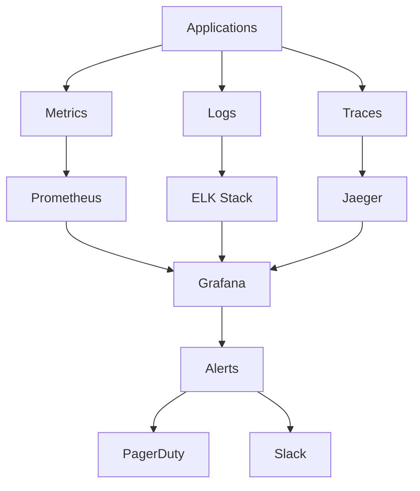
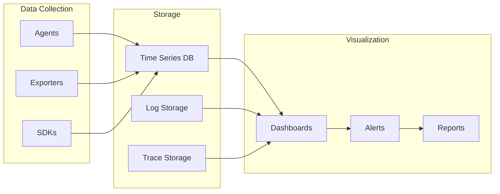

---
# Auto-generated front matter
Title: Monitoring Observability
LastUpdated: 2025-11-06T20:45:59.128272
Tags: []
Status: draft
---

# 📊 **Monitoring & Observability**

## 📘 **Theory**

Monitoring and observability are critical aspects of modern software systems that provide visibility into system behavior, performance, and health. They enable teams to detect issues, understand system behavior, and make data-driven decisions.

### **Why Monitoring & Observability Matter**

- **System Health**: Monitor system status and detect failures
- **Performance**: Track performance metrics and identify bottlenecks
- **Debugging**: Understand system behavior and troubleshoot issues
- **Capacity Planning**: Make informed decisions about resource allocation
- **User Experience**: Ensure optimal user experience
- **Business Impact**: Connect technical metrics to business outcomes

### **Key Concepts**

1. **Metrics**: Quantitative measurements of system behavior
2. **Logs**: Detailed records of events and activities
3. **Traces**: Distributed request tracking across services
4. **Alerting**: Automated notifications for critical events
5. **Dashboards**: Visual representations of system data
6. **SLIs/SLOs**: Service Level Indicators and Objectives
7. **Error Budgets**: Allowed error rates for services

### **Common Pitfalls and Best Practices**

- **Alert Fatigue**: Avoid too many alerts that cause noise
- **Metric Overload**: Focus on meaningful metrics
- **Log Management**: Implement proper log rotation and retention
- **Trace Sampling**: Use appropriate sampling rates
- **Dashboard Design**: Create clear, actionable dashboards
- **Incident Response**: Have clear procedures for handling alerts

## 📊 **Diagrams**

### **Observability Stack**



### **Monitoring Architecture**



## 🧩 **Example**

**Scenario**: Implement comprehensive monitoring for a microservices application

**Input**: Multiple services with different monitoring needs
**Expected Output**: Centralized monitoring dashboard with alerts

**Step-by-step**:

1. Set up metrics collection
2. Configure log aggregation
3. Implement distributed tracing
4. Create dashboards
5. Set up alerting rules
6. Test monitoring system

## 💻 **Implementation (Golang)**

```go
package main

import (
    "context"
    "fmt"
    "log"
    "net/http"
    "time"

    "github.com/prometheus/client_golang/prometheus"
    "github.com/prometheus/client_golang/prometheus/promhttp"
    "go.opentelemetry.io/otel"
    "go.opentelemetry.io/otel/exporters/jaeger"
    "go.opentelemetry.io/otel/sdk/trace"
    "go.uber.org/zap"
)

// MetricsCollector collects application metrics
type MetricsCollector struct {
    requestCounter   prometheus.Counter
    requestDuration  prometheus.Histogram
    activeConnections prometheus.Gauge
    errorCounter     prometheus.Counter
}

// NewMetricsCollector creates a new metrics collector
func NewMetricsCollector() *MetricsCollector {
    return &MetricsCollector{
        requestCounter: prometheus.NewCounter(prometheus.CounterOpts{
            Name: "http_requests_total",
            Help: "Total number of HTTP requests",
        }),
        requestDuration: prometheus.NewHistogram(prometheus.HistogramOpts{
            Name: "http_request_duration_seconds",
            Help: "HTTP request duration in seconds",
        }),
        activeConnections: prometheus.NewGauge(prometheus.GaugeOpts{
            Name: "active_connections",
            Help: "Number of active connections",
        }),
        errorCounter: prometheus.NewCounter(prometheus.CounterOpts{
            Name: "http_errors_total",
            Help: "Total number of HTTP errors",
        }),
    }
}

// Register registers metrics with Prometheus
func (mc *MetricsCollector) Register() {
    prometheus.MustRegister(mc.requestCounter)
    prometheus.MustRegister(mc.requestDuration)
    prometheus.MustRegister(mc.activeConnections)
    prometheus.MustRegister(mc.errorCounter)
}

// RecordRequest records a request metric
func (mc *MetricsCollector) RecordRequest(method, endpoint string, statusCode int, duration time.Duration) {
    mc.requestCounter.Inc()
    mc.requestDuration.Observe(duration.Seconds())

    if statusCode >= 400 {
        mc.errorCounter.Inc()
    }
}

// SetActiveConnections sets the active connections count
func (mc *MetricsCollector) SetActiveConnections(count float64) {
    mc.activeConnections.Set(count)
}

// Logger provides structured logging
type Logger struct {
    logger *zap.Logger
}

// NewLogger creates a new logger
func NewLogger() *Logger {
    logger, _ := zap.NewProduction()
    return &Logger{logger: logger}
}

// Info logs an info message
func (l *Logger) Info(msg string, fields ...zap.Field) {
    l.logger.Info(msg, fields...)
}

// Error logs an error message
func (l *Logger) Error(msg string, fields ...zap.Field) {
    l.logger.Error(msg, fields...)
}

// Warn logs a warning message
func (l *Logger) Warn(msg string, fields ...zap.Field) {
    l.logger.Warn(msg, fields...)
}

// Debug logs a debug message
func (l *Logger) Debug(msg string, fields ...zap.Field) {
    l.logger.Debug(msg, fields...)
}

// Tracer provides distributed tracing
type Tracer struct {
    tracer trace.Tracer
}

// NewTracer creates a new tracer
func NewTracer() *Tracer {
    // Initialize Jaeger exporter
    exp, err := jaeger.New(jaeger.WithCollectorEndpoint(jaeger.WithEndpoint("http://localhost:14268/api/traces")))
    if err != nil {
        log.Fatal(err)
    }

    tp := trace.NewTracerProvider(
        trace.WithBatcher(exp),
        trace.WithResource(resource.NewWithAttributes(
            semconv.SchemaURL,
            semconv.ServiceNameKey.String("monitoring-service"),
            semconv.ServiceVersionKey.String("1.0.0"),
        )),
    )

    otel.SetTracerProvider(tp)

    return &Tracer{
        tracer: tp.Tracer("monitoring-service"),
    }
}

// StartSpan starts a new span
func (t *Tracer) StartSpan(ctx context.Context, name string) (context.Context, trace.Span) {
    return t.tracer.Start(ctx, name)
}

// HealthChecker checks service health
type HealthChecker struct {
    checks map[string]func() error
}

// NewHealthChecker creates a new health checker
func NewHealthChecker() *HealthChecker {
    return &HealthChecker{
        checks: make(map[string]func() error),
    }
}

// AddCheck adds a health check
func (hc *HealthChecker) AddCheck(name string, check func() error) {
    hc.checks[name] = check
}

// CheckHealth checks all health checks
func (hc *HealthChecker) CheckHealth() map[string]string {
    results := make(map[string]string)

    for name, check := range hc.checks {
        if err := check(); err != nil {
            results[name] = fmt.Sprintf("ERROR: %v", err)
        } else {
            results[name] = "OK"
        }
    }

    return results
}

// AlertManager manages alerts
type AlertManager struct {
    alerts map[string]*Alert
}

// Alert represents an alert
type Alert struct {
    Name        string
    Condition   func() bool
    Severity    string
    Message     string
    LastFired   time.Time
    Cooldown    time.Duration
}

// NewAlertManager creates a new alert manager
func NewAlertManager() *AlertManager {
    return &AlertManager{
        alerts: make(map[string]*Alert),
    }
}

// AddAlert adds an alert
func (am *AlertManager) AddAlert(alert *Alert) {
    am.alerts[alert.Name] = alert
}

// CheckAlerts checks all alerts
func (am *AlertManager) CheckAlerts() []*Alert {
    var firedAlerts []*Alert

    for _, alert := range am.alerts {
        if alert.Condition() {
            if time.Since(alert.LastFired) > alert.Cooldown {
                alert.LastFired = time.Now()
                firedAlerts = append(firedAlerts, alert)
            }
        }
    }

    return firedAlerts
}

// MonitoringService provides comprehensive monitoring
type MonitoringService struct {
    metricsCollector *MetricsCollector
    logger          *Logger
    tracer          *Tracer
    healthChecker   *HealthChecker
    alertManager    *AlertManager
}

// NewMonitoringService creates a new monitoring service
func NewMonitoringService() *MonitoringService {
    return &MonitoringService{
        metricsCollector: NewMetricsCollector(),
        logger:          NewLogger(),
        tracer:          NewTracer(),
        healthChecker:   NewHealthChecker(),
        alertManager:    NewAlertManager(),
    }
}

// Initialize initializes the monitoring service
func (ms *MonitoringService) Initialize() {
    ms.metricsCollector.Register()

    // Add health checks
    ms.healthChecker.AddCheck("database", func() error {
        // Check database connection
        return nil
    })

    ms.healthChecker.AddCheck("redis", func() error {
        // Check Redis connection
        return nil
    })

    // Add alerts
    ms.alertManager.AddAlert(&Alert{
        Name: "high_error_rate",
        Condition: func() bool {
            // Check if error rate is high
            return false
        },
        Severity: "critical",
        Message:  "High error rate detected",
        Cooldown: 5 * time.Minute,
    })

    ms.alertManager.AddAlert(&Alert{
        Name: "high_response_time",
        Condition: func() bool {
            // Check if response time is high
            return false
        },
        Severity: "warning",
        Message:  "High response time detected",
        Cooldown: 2 * time.Minute,
    })
}

// Start starts the monitoring service
func (ms *MonitoringService) Start() {
    // Start metrics server
    go func() {
        http.Handle("/metrics", promhttp.Handler())
        log.Fatal(http.ListenAndServe(":8080", nil))
    }()

    // Start health check server
    go func() {
        http.HandleFunc("/health", func(w http.ResponseWriter, r *http.Request) {
            health := ms.healthChecker.CheckHealth()
            w.Header().Set("Content-Type", "application/json")
            fmt.Fprintf(w, "%+v", health)
        })
        log.Fatal(http.ListenAndServe(":8081", nil))
    }()

    // Start alert checking
    go func() {
        ticker := time.NewTicker(30 * time.Second)
        defer ticker.Stop()

        for range ticker.C {
            alerts := ms.alertManager.CheckAlerts()
            for _, alert := range alerts {
                ms.logger.Error("Alert fired",
                    zap.String("name", alert.Name),
                    zap.String("severity", alert.Severity),
                    zap.String("message", alert.Message),
                )
            }
        }
    }()
}

// MonitorRequest monitors an HTTP request
func (ms *MonitoringService) MonitorRequest(ctx context.Context, method, endpoint string, handler func(http.ResponseWriter, *http.Request)) http.HandlerFunc {
    return func(w http.ResponseWriter, r *http.Request) {
        start := time.Now()

        // Start span
        ctx, span := ms.tracer.StartSpan(ctx, fmt.Sprintf("%s %s", method, endpoint))
        defer span.End()

        // Log request
        ms.logger.Info("Request started",
            zap.String("method", method),
            zap.String("endpoint", endpoint),
            zap.String("user_agent", r.UserAgent()),
        )

        // Record metrics
        ms.metricsCollector.RecordRequest(method, endpoint, 200, time.Since(start))

        // Call handler
        handler(w, r)

        // Log completion
        ms.logger.Info("Request completed",
            zap.String("method", method),
            zap.String("endpoint", endpoint),
            zap.Duration("duration", time.Since(start)),
        )
    }
}

// Example usage
func main() {
    // Create monitoring service
    monitoring := NewMonitoringService()
    monitoring.Initialize()
    monitoring.Start()

    // Create HTTP server with monitoring
    mux := http.NewServeMux()

    // Add monitored endpoints
    mux.HandleFunc("/api/users", monitoring.MonitorRequest(context.Background(), "GET", "/api/users", func(w http.ResponseWriter, r *http.Request) {
        w.WriteHeader(http.StatusOK)
        w.Write([]byte(`{"users": []}`))
    }))

    mux.HandleFunc("/api/orders", monitoring.MonitorRequest(context.Background(), "GET", "/api/orders", func(w http.ResponseWriter, r *http.Request) {
        w.WriteHeader(http.StatusOK)
        w.Write([]byte(`{"orders": []}`))
    }))

    // Start server
    log.Println("Starting server on :8082")
    log.Fatal(http.ListenAndServe(":8082", mux))
}
```

## 💻 **Implementation (Node.js)**

```javascript
const express = require("express");
const prometheus = require("prom-client");
const winston = require("winston");
const { trace, context } = require("@opentelemetry/api");

// MetricsCollector collects application metrics
class MetricsCollector {
  constructor() {
    this.requestCounter = new prometheus.Counter({
      name: "http_requests_total",
      help: "Total number of HTTP requests",
      labelNames: ["method", "endpoint", "status_code"],
    });

    this.requestDuration = new prometheus.Histogram({
      name: "http_request_duration_seconds",
      help: "HTTP request duration in seconds",
      labelNames: ["method", "endpoint"],
    });

    this.activeConnections = new prometheus.Gauge({
      name: "active_connections",
      help: "Number of active connections",
    });

    this.errorCounter = new prometheus.Counter({
      name: "http_errors_total",
      help: "Total number of HTTP errors",
      labelNames: ["method", "endpoint", "error_type"],
    });
  }

  recordRequest(method, endpoint, statusCode, duration) {
    this.requestCounter.inc({ method, endpoint, status_code: statusCode });
    this.requestDuration.observe({ method, endpoint }, duration);

    if (statusCode >= 400) {
      this.errorCounter.inc({ method, endpoint, error_type: "http_error" });
    }
  }

  setActiveConnections(count) {
    this.activeConnections.set(count);
  }
}

// Logger provides structured logging
class Logger {
  constructor() {
    this.logger = winston.createLogger({
      level: "info",
      format: winston.format.combine(
        winston.format.timestamp(),
        winston.format.errors({ stack: true }),
        winston.format.json()
      ),
      transports: [
        new winston.transports.Console(),
        new winston.transports.File({ filename: "app.log" }),
      ],
    });
  }

  info(message, meta = {}) {
    this.logger.info(message, meta);
  }

  error(message, meta = {}) {
    this.logger.error(message, meta);
  }

  warn(message, meta = {}) {
    this.logger.warn(message, meta);
  }

  debug(message, meta = {}) {
    this.logger.debug(message, meta);
  }
}

// Tracer provides distributed tracing
class Tracer {
  constructor() {
    this.tracer = trace.getTracer("monitoring-service", "1.0.0");
  }

  startSpan(name, parentContext = null) {
    const span = this.tracer.startSpan(name, {}, parentContext);
    return { span, context: trace.setSpan(context.active(), span) };
  }

  endSpan(span) {
    span.end();
  }
}

// HealthChecker checks service health
class HealthChecker {
  constructor() {
    this.checks = new Map();
  }

  addCheck(name, check) {
    this.checks.set(name, check);
  }

  async checkHealth() {
    const results = {};

    for (const [name, check] of this.checks) {
      try {
        await check();
        results[name] = "OK";
      } catch (error) {
        results[name] = `ERROR: ${error.message}`;
      }
    }

    return results;
  }
}

// AlertManager manages alerts
class AlertManager {
  constructor() {
    this.alerts = new Map();
  }

  addAlert(alert) {
    this.alerts.set(alert.name, alert);
  }

  checkAlerts() {
    const firedAlerts = [];

    for (const alert of this.alerts.values()) {
      if (alert.condition()) {
        const now = Date.now();
        if (now - alert.lastFired > alert.cooldown) {
          alert.lastFired = now;
          firedAlerts.push(alert);
        }
      }
    }

    return firedAlerts;
  }
}

// MonitoringService provides comprehensive monitoring
class MonitoringService {
  constructor() {
    this.metricsCollector = new MetricsCollector();
    this.logger = new Logger();
    this.tracer = new Tracer();
    this.healthChecker = new HealthChecker();
    this.alertManager = new AlertManager();
  }

  initialize() {
    // Add health checks
    this.healthChecker.addCheck("database", async () => {
      // Check database connection
      return true;
    });

    this.healthChecker.addCheck("redis", async () => {
      // Check Redis connection
      return true;
    });

    // Add alerts
    this.alertManager.addAlert({
      name: "high_error_rate",
      condition: () => {
        // Check if error rate is high
        return false;
      },
      severity: "critical",
      message: "High error rate detected",
      cooldown: 5 * 60 * 1000, // 5 minutes
      lastFired: 0,
    });

    this.alertManager.addAlert({
      name: "high_response_time",
      condition: () => {
        // Check if response time is high
        return false;
      },
      severity: "warning",
      message: "High response time detected",
      cooldown: 2 * 60 * 1000, // 2 minutes
      lastFired: 0,
    });
  }

  start() {
    // Start alert checking
    setInterval(() => {
      const alerts = this.alertManager.checkAlerts();
      for (const alert of alerts) {
        this.logger.error("Alert fired", {
          name: alert.name,
          severity: alert.severity,
          message: alert.message,
        });
      }
    }, 30000); // Check every 30 seconds
  }

  monitorRequest(method, endpoint, handler) {
    return async (req, res, next) => {
      const start = Date.now();

      // Start span
      const { span, context: spanContext } = this.tracer.startSpan(
        `${method} ${endpoint}`
      );

      try {
        // Log request
        this.logger.info("Request started", {
          method,
          endpoint,
          userAgent: req.get("User-Agent"),
        });

        // Call handler
        await handler(req, res, next);

        // Record metrics
        const duration = (Date.now() - start) / 1000;
        this.metricsCollector.recordRequest(
          method,
          endpoint,
          res.statusCode,
          duration
        );

        // Log completion
        this.logger.info("Request completed", {
          method,
          endpoint,
          duration: `${duration}s`,
        });
      } catch (error) {
        // Log error
        this.logger.error("Request failed", {
          method,
          endpoint,
          error: error.message,
          stack: error.stack,
        });

        // Record error metrics
        this.metricsCollector.errorCounter.inc({
          method,
          endpoint,
          error_type: "exception",
        });

        throw error;
      } finally {
        this.tracer.endSpan(span);
      }
    };
  }
}

// Example usage
async function main() {
  const app = express();

  // Create monitoring service
  const monitoring = new MonitoringService();
  monitoring.initialize();
  monitoring.start();

  // Add metrics endpoint
  app.get("/metrics", (req, res) => {
    res.set("Content-Type", prometheus.register.contentType);
    res.end(prometheus.register.metrics());
  });

  // Add health check endpoint
  app.get("/health", async (req, res) => {
    const health = await monitoring.healthChecker.checkHealth();
    res.json(health);
  });

  // Add monitored endpoints
  app.get(
    "/api/users",
    monitoring.monitorRequest("GET", "/api/users", (req, res) => {
      res.json({ users: [] });
    })
  );

  app.get(
    "/api/orders",
    monitoring.monitorRequest("GET", "/api/orders", (req, res) => {
      res.json({ orders: [] });
    })
  );

  // Start server
  const port = process.env.PORT || 3000;
  app.listen(port, () => {
    console.log(`Server running on port ${port}`);
  });
}

// Run the example
main().catch(console.error);
```

## ⏱ **Complexity Analysis**

### **Time Complexity**

- **Metrics Collection**: O(1) for each metric
- **Log Processing**: O(n) where n is log message length
- **Trace Processing**: O(n) where n is trace depth
- **Alert Checking**: O(m) where m is number of alerts

### **Space Complexity**

- **Metrics Storage**: O(n) where n is number of metrics
- **Log Storage**: O(n) where n is log volume
- **Trace Storage**: O(n) where n is trace volume
- **Alert Storage**: O(m) where m is number of alerts

## 🚀 **Optimal Solution**

The optimal monitoring solution includes:

1. **Comprehensive Coverage**: Monitor all critical system components
2. **Efficient Collection**: Use appropriate sampling and aggregation
3. **Clear Visualization**: Create actionable dashboards
4. **Smart Alerting**: Avoid alert fatigue with proper thresholds
5. **Incident Response**: Have clear procedures for handling alerts
6. **Continuous Improvement**: Regularly review and optimize monitoring

### **Production Considerations**

- Use appropriate sampling rates for traces
- Implement proper log rotation and retention
- Set up proper alerting thresholds
- Monitor monitoring system itself
- Use distributed tracing for microservices
- Implement proper error handling and recovery

## ❓ **Follow-up Questions**

### **How would this scale with X?**

- **High Volume**: Use sampling and aggregation strategies
- **Many Services**: Use centralized monitoring and distributed tracing
- **Global Distribution**: Use edge monitoring and regional aggregation

### **How can we optimize further if Y changes?**

- **Cost Constraints**: Use efficient storage and sampling
- **Performance Requirements**: Use async processing and caching
- **Compliance Requirements**: Use proper data retention and encryption

### **What trade-offs exist in different approaches?**

- **Sampling vs Accuracy**: Performance vs Data completeness
- **Real-time vs Batch**: Immediate alerts vs Efficient processing
- **Centralized vs Distributed**: Simplicity vs Scalability
